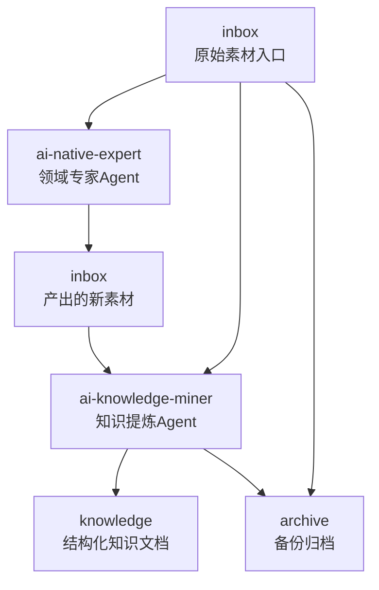
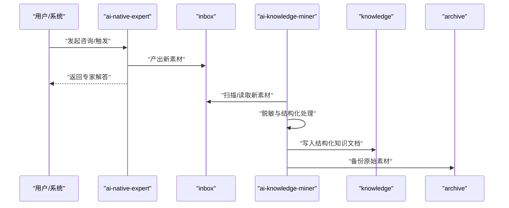
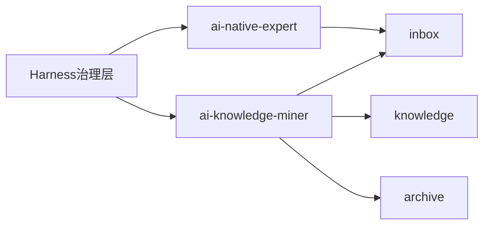

# Agent协作机制

<cite>
**本文引用的文件**
- [README.md](file://README.md)
- [index.md](file://index.md)
- [agent-def.md](file://knowledge/ai-general-notes/agent-def.md)
- [harness.md](file://knowledge/ai-general-notes/harness.md)
- [jvs-crew.md](file://knowledge/alibaba-cloud/ai-application/jvs-crew.md)
- [claude-managed-agents.md](file://knowledge/anthropic/ai-application/claude-managed-agents.md)
</cite>

## 目录
1. [简介](#简介)
2. [项目结构](#项目结构)
3. [核心组件](#核心组件)
4. [架构总览](#架构总览)
5. [详细组件分析](#详细组件分析)
6. [依赖分析](#依赖分析)
7. [性能考虑](#性能考虑)
8. [故障排查指南](#故障排查指南)
9. [结论](#结论)
10. [附录](#附录)

## 简介
本项目围绕“双Agent协作”构建知识库自动化流水线：一个负责从原始素材提炼为结构化知识文档，另一个作为领域专家产出新的原始素材。二者通过统一的目录结构与协作流程实现闭环，支撑从“原始素材”到“知识文档”的端到端处理。

- 双Agent职责划分清晰：一个专注“提炼/沉淀”，另一个专注“专家问答/素材生成”。
- 协作通过标准化目录（inbox、archive、knowledge）与文档模板实现，确保知识处理的一致性与可追溯性。
- 通过Harness（治理层）保障工具权限、凭证隔离、审计与可观测性，降低复杂任务的执行风险。

章节来源
- [README.md:1-20](file://README.md#L1-L20)

## 项目结构
知识库采用层次化目录组织，双Agent协作的关键目录如下：
- inbox：原始素材入口，双Agent均会读取或写入。
- archive：原始素材备份，用于归档与回溯。
- knowledge：结构化知识文档输出目录，按领域/组织分类。

图表来源
- [README.md:13-17](file://README.md#L13-L17)

章节来源
- [README.md:13-17](file://README.md#L13-L17)
- [index.md:1-69](file://index.md#L1-L69)

## 核心组件
- ai-native-expert（AI原生专家Agent）
  - 职责：聚焦MaaS（Qwen/Wan/Claude/Gemini/GPT）与AI Coding（Qoder/Kiro/Claude Code），回答模型能力、选型、API问题、竞品分析等；回答后自动产出inbox素材。
  - 触发方式：支持多种触发入口（如IM、API、SDK），便于与业务系统集成。
  - 安全与审计：具备凭证隔离、网络防护、只读持久化审计日志等能力，满足企业合规要求。
  - 计费模式：按会话运行时计费，Token费用透明拆分。

- ai-knowledge-miner（知识提炼Agent）
  - 职责：将inbox中的原始素材提炼为脱敏、结构化的知识文档，写入knowledge对应目录。
  - 输出：面向领域/组织的知识文档，便于检索与复用。
  - 触发方式：可按需触发或周期性扫描inbox进行批量处理。

- Harness（治理层）
  - 职责：定义Agent能做什么、不能做什么、何时需要人工介入；提供工具权限边界、业务规则约束、凭证隔离、审计追踪与退出条件。
  - 价值：Harness质量决定Agent产品的可用性上限，是企业级差异化护城河。

章节来源
- [README.md:5-11](file://README.md#L5-L11)
- [jvs-crew.md:39-48](file://knowledge/alibaba-cloud/ai-application/jvs-crew.md#L39-L48)
- [jvs-crew.md:48-56](file://knowledge/alibaba-cloud/ai-application/jvs-crew.md#L48-L56)
- [claude-managed-agents.md:40-59](file://knowledge/anthropic/ai-application/claude-managed-agents.md#L40-L59)
- [harness.md:13-23](file://knowledge/ai-general-notes/harness.md#L13-L23)

## 架构总览
双Agent协作的总体流程如下：
- ai-native-expert接收外部咨询或触发，基于领域知识生成高质量素材，并写回inbox。
- ai-knowledge-miner周期性扫描inbox，对新素材进行脱敏与结构化处理，输出到knowledge目录。
- archive用于备份，确保可追溯与回滚。

图表来源
- [README.md:7-11](file://README.md#L7-L11)
- [README.md:15-17](file://README.md#L15-L17)

## 详细组件分析

### ai-native-expert（领域专家Agent）
- 功能特性
  - 架构：推理与执行解耦，支持多种触发模式（API、定时、事件等）。
  - 模型：聚焦特定模型系列，确保领域一致性。
  - 安全与审计：凭证Vault机制、gVisor隔离、只读持久化日志、网络访问控制。
  - 监控与计费：会话日志、按运行时计费、Token透明拆分。

- 与Harness的关系
  - Harness定义工具边界与业务规则，确保专家回答在合规范围内。
  - 凭证隔离与审计追踪保障每次回答的可追溯性。

- 与ai-knowledge-miner的协作
  - 专家回答作为“上游素材”进入inbox，驱动后续提炼流程。
  - 专家Agent的输出质量直接影响下游知识文档的准确性与完整性。

章节来源
- [claude-managed-agents.md:40-59](file://knowledge/anthropic/ai-application/claude-managed-agents.md#L40-L59)
- [harness.md:37-46](file://knowledge/ai-general-notes/harness.md#L37-L46)

### ai-knowledge-miner（知识提炼Agent）
- 功能特性
  - 输入：inbox中的原始素材。
  - 处理：脱敏、结构化、规范化。
  - 输出：知识文档写入knowledge对应目录。
  - 备份：原始素材写入archive，便于回溯与审计。

- 与Harness的关系
  - Harness确保提炼过程的工具权限、退出条件与可观测性。
  - 审计与回滚能力保障知识文档的可追溯性。

- 与ai-native-expert的协作
  - 通过inbox形成“专家产出→提炼入库”的闭环。
  - 任务分工明确：专家负责“产生素材”，提炼负责“结构化沉淀”。

章节来源
- [README.md:7-9](file://README.md#L7-L9)
- [README.md:15-17](file://README.md#L15-L17)
- [harness.md:37-46](file://knowledge/ai-general-notes/harness.md#L37-L46)

### Harness（治理层）
- 核心维度
  - 工具边界：白名单与参数校验，避免越权调用。
  - 业务规则：关键操作的前置条件与守卫条件。
  - 人工介入点：关键决策节点强制人工确认。
  - 凭证隔离：Agent执行节点不直接持有生产凭证。
  - 审计追踪：全链路日志、不可变审计、可回滚能力。
  - 退出条件：超时、最大步数、异常等硬性终止条件。

- 与双Agent的协同
  - 为专家Agent提供合规边界与审计能力。
  - 为提炼Agent提供工具权限与可观测性保障。

章节来源
- [harness.md:13-46](file://knowledge/ai-general-notes/harness.md#L13-L46)

### 任务分解与组合策略
- 任务分解
  - 专家侧：将复杂咨询拆分为“背景澄清→能力评估→选型建议→竞品对比→实施建议”等子任务。
  - 提炼侧：将原始素材拆分为“标题/摘要/正文/标签/参考资料/变更记录”等结构化字段。
- 任务组合
  - 专家回答→inbox→提炼→知识文档，形成“专家生成→结构化沉淀”的串联。
  - 多轮咨询→多条素材→多篇知识文档，体现并行组合能力。

章节来源
- [agent-def.md:69-76](file://knowledge/ai-general-notes/agent-def.md#L69-L76)
- [agent-def.md:91-99](file://knowledge/ai-general-notes/agent-def.md#L91-L99)

### 触发条件、执行顺序与依赖关系
- 触发条件
  - ai-native-expert：外部咨询请求、定时任务、事件驱动。
  - ai-knowledge-miner：inbox新增素材、周期性扫描。
- 执行顺序
  - 专家回答产出→写回inbox→提炼Agent扫描→知识文档生成→archive备份。
- 依赖关系
  - 提炼Agent依赖专家Agent的素材质量与完整性。
  - Harness为两端提供统一的安全与治理约束。

章节来源
- [jvs-crew.md:42-45](file://knowledge/alibaba-cloud/ai-application/jvs-crew.md#L42-L45)
- [claude-managed-agents.md:40-48](file://knowledge/anthropic/ai-application/claude-managed-agents.md#L40-L48)
- [README.md:7-11](file://README.md#L7-L11)

### 质量控制与一致性保障
- 质量控制
  - 专家回答前的背景澄清与规则约束，减少歧义。
  - 提炼过程的脱敏与结构化，确保一致性。
- 一致性保障
  - 统一的目录结构与模板，规范知识文档格式。
  - 审计与回滚能力，确保历史版本可追溯。

章节来源
- [harness.md:69-78](file://knowledge/ai-general-notes/harness.md#L69-L78)
- [agent-def.md:101-107](file://knowledge/ai-general-notes/agent-def.md#L101-L107)

## 依赖分析
双Agent协作的依赖关系如下：

图表来源
- [harness.md:13-46](file://knowledge/ai-general-notes/harness.md#L13-L46)
- [README.md:15-17](file://README.md#L15-L17)

章节来源
- [harness.md:13-46](file://knowledge/ai-general-notes/harness.md#L13-L46)
- [README.md:15-17](file://README.md#L15-L17)

## 性能考虑
- 扫描与批处理：对inbox进行周期性扫描，避免高频IO；必要时引入增量扫描策略。
- 脱敏与结构化：对大文本进行分块处理与缓存，减少重复计算。
- 并发与隔离：利用Harness的凭证隔离与沙箱能力，提升并发安全性与稳定性。
- 监控与告警：对Agent执行日志与Token消耗进行实时监控，及时发现异常。

## 故障排查指南
- 专家Agent无法产出素材
  - 检查触发入口与会话日志，确认模型可用性与权限配置。
  - 核对Harness的工具边界与业务规则是否阻断了关键动作。
- 提炼Agent未生成知识文档
  - 检查inbox是否有新素材，确认扫描策略与权限。
  - 查看archive备份是否成功，定位异常环节。
- 审计与回滚
  - 利用只读持久化日志与全链路追踪，定位问题根因。
  - 必要时回滚至上一版本知识文档，确保业务连续性。

章节来源
- [claude-managed-agents.md:50-59](file://knowledge/anthropic/ai-application/claude-managed-agents.md#L50-L59)
- [jvs-crew.md:48-56](file://knowledge/alibaba-cloud/ai-application/jvs-crew.md#L48-L56)
- [harness.md:69-78](file://knowledge/ai-general-notes/harness.md#L69-L78)

## 结论
双Agent协作机制通过“专家素材生成—结构化提炼—知识沉淀—备份归档”的闭环，实现了从原始素材到知识文档的高效转化。Harness作为治理层，贯穿专家与提炼两端，提供工具权限、凭证隔离、审计追踪与退出条件，显著提升了系统的可靠性与合规性。结合统一的目录结构与模板，确保知识处理的一致性与完整性，为企业级知识库建设提供了可落地的工程化范式。

## 附录
- 术语
  - Agent：围绕LLM构建的自主执行系统，具备感知-推理-行动-观察循环。
  - Harness：Agent的约束与治理层，定义能做什么、不能做什么、何时需要人工介入。
  - Inbox：原始素材入口，双Agent均会读取或写入。
  - Archive：原始素材备份，用于归档与回溯。
  - Knowledge：结构化知识文档输出目录，按领域/组织分类。

章节来源
- [agent-def.md:13-28](file://knowledge/ai-general-notes/agent-def.md#L13-L28)
- [harness.md:13-23](file://knowledge/ai-general-notes/harness.md#L13-L23)
- [README.md:13-17](file://README.md#L13-L17)