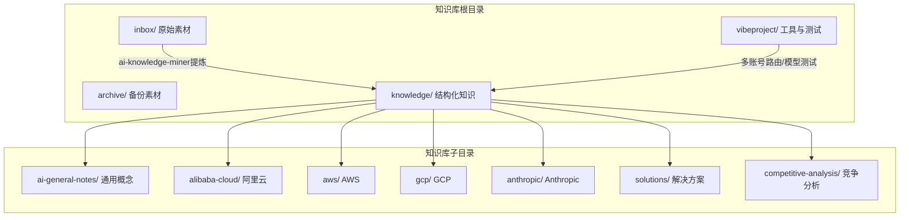
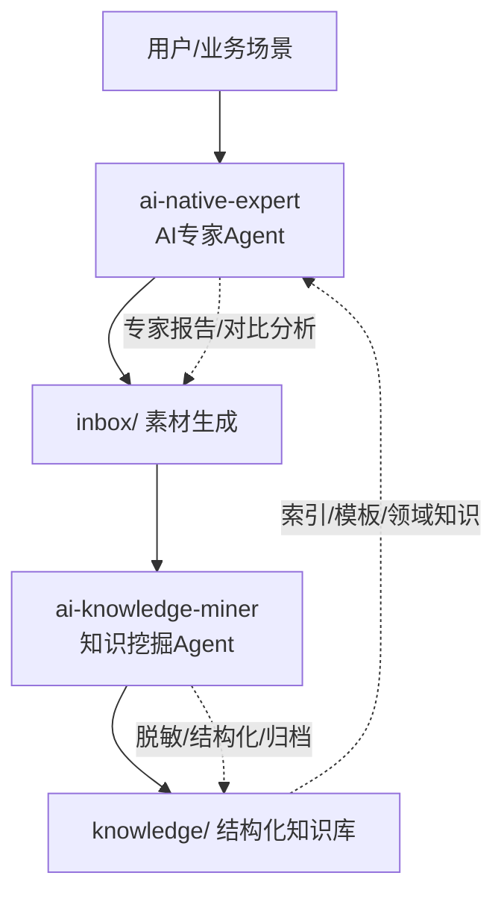
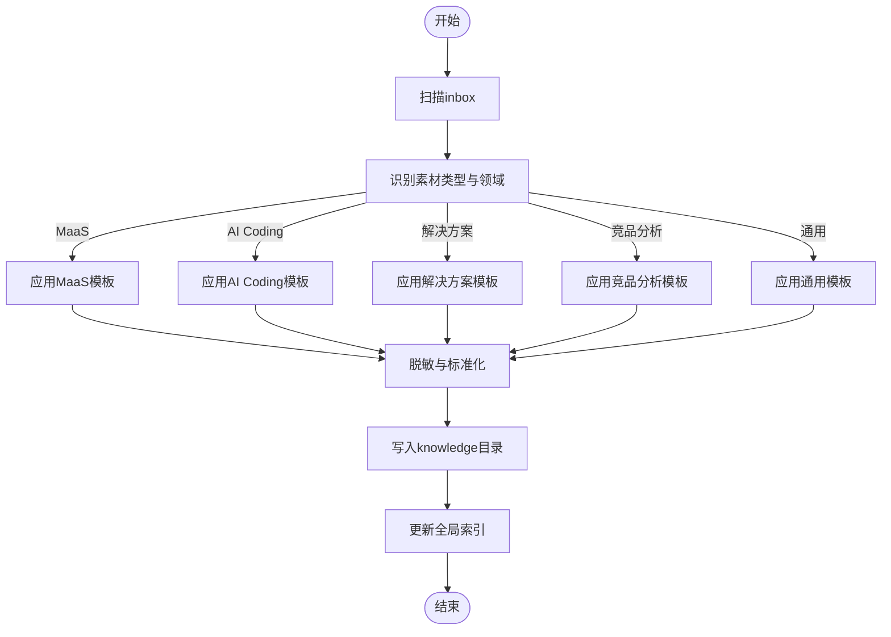
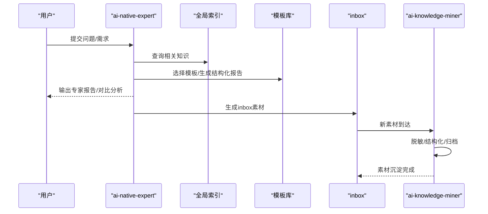
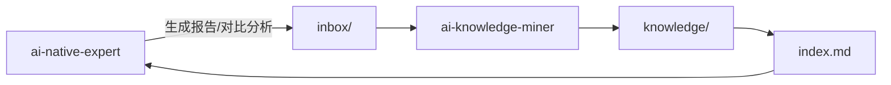
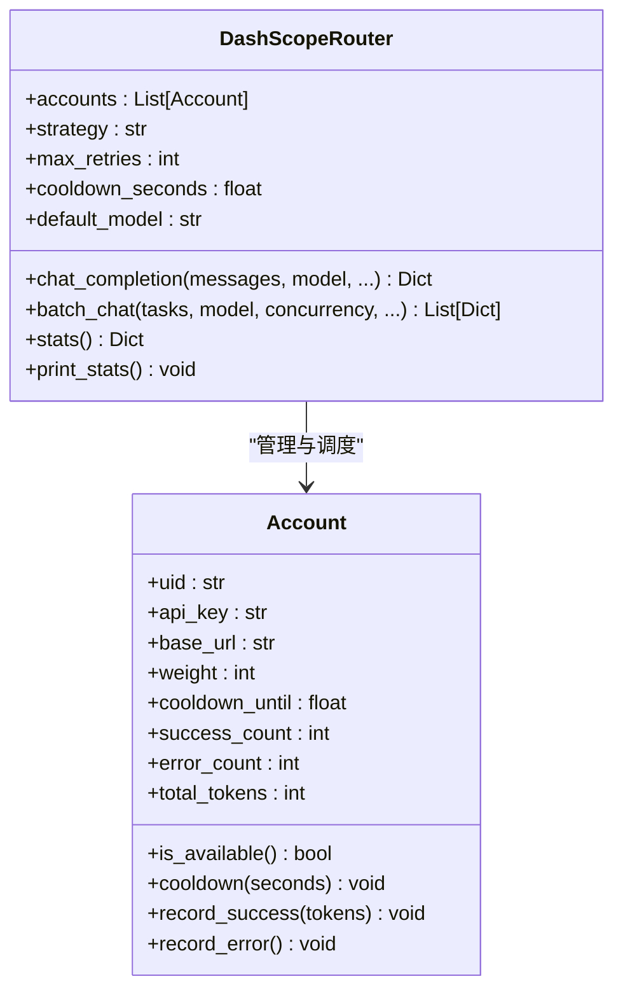
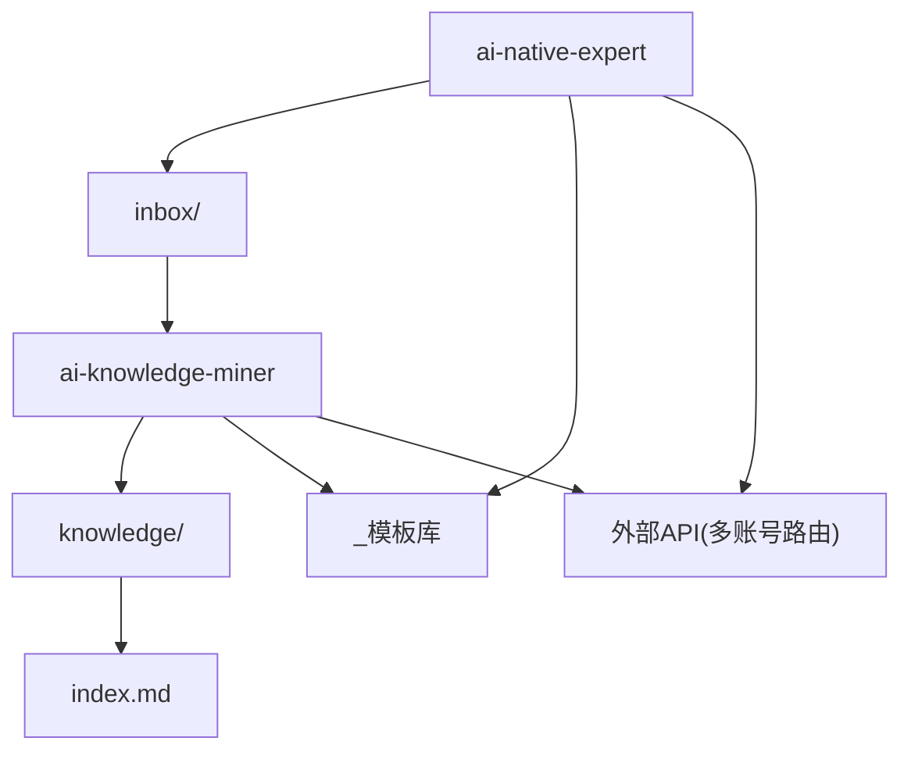

# Agent系统架构

<cite>
**本文引用的文件**   
- [README.md](file://README.md)
- [index.md](file://index.md)
- [agent-def.md](file://knowledge/ai-general-notes/agent-def.md)
- [harness.md](file://knowledge/ai-general-notes/harness.md)
- [prompt-engineering.md](file://knowledge/ai-general-notes/prompt-engineering.md)
- [overview.md](file://knowledge/alibaba-cloud/maas/overview.md)
- [qoder.md](file://knowledge/alibaba-cloud/ai-coding/qoder.md)
- [overview.md](file://knowledge/alibaba-cloud/competitive-analysis/alibaba-vs-aws/overview.md)
- [overview.md](file://knowledge/solutions/enterprise-ai-platform/overview.md)
- [real_user_test_wan2.6_no_audit.py](file://vibeproject/real_user_test_wan2.6_no_audit.py)
- [test_ds_v4.py](file://vibeproject/test_ds_v4.py)
- [dashscope_multi_account_router.py](file://vibeproject/dashscope_multi_account_router.py)
</cite>

## 目录
1. [简介](#简介)
2. [项目结构](#项目结构)
3. [核心组件](#核心组件)
4. [架构总览](#架构总览)
5. [详细组件分析](#详细组件分析)
6. [依赖分析](#依赖分析)
7. [性能考量](#性能考量)
8. [故障排查指南](#故障排查指南)
9. [结论](#结论)
10. [附录](#附录)

## 简介
本项目通过“双Agent协同架构”实现AI知识库的自动化沉淀与专家级分析。两个Agent分别承担“知识挖掘”和“AI专家分析”的职责：
- ai-knowledge-miner：将inbox中的原始素材提炼为脱敏、结构化的知识文档，写入knowledge目录。
- ai-native-expert：聚焦MaaS（Qwen/Wan/Claude/Gemini/GPT）与AI Coding（Qoder/Kiro/Claude Code）的领域专家，提供模型能力评估、选型建议、API问题解答与竞品对比分析，并在回答后自动生成inbox素材。

该架构强调“输入-处理-输出-质量控制”的闭环，确保知识沉淀的准确性与一致性，并通过Harness与Prompt Engineering等治理手段，降低幻觉与偏差风险。

**章节来源**
- [README.md:1-20](file://README.md#L1-L20)

## 项目结构
知识库采用“按领域与厂商分类”的结构化组织方式，配合inbox与archive目录实现素材采集与归档。核心目录与职责如下：
- inbox：原始素材收集区，ai-knowledge-miner从此采集并提炼。
- archive：素材备份区，用于归档与审计。
- knowledge：结构化知识库，按AI General Notes、Alibaba Cloud、AWS、GCP、Anthropic、Solutions、Competitive Analysis等维度组织。
- vibeproject：与Agent相关的工具与测试脚本，包括多账号路由、模型调用测试与特定API示例。

**图表来源**
- [README.md:13-18](file://README.md#L13-L18)
- [index.md:1-69](file://index.md#L1-L69)

**章节来源**
- [README.md:13-18](file://README.md#L13-L18)
- [index.md:1-69](file://index.md#L1-L69)

## 核心组件
- ai-knowledge-miner（知识挖掘Agent）
  - 输入：inbox中的原始素材（文本、链接、截图说明等）。
  - 处理：脱敏、结构化、标准化，结合模板与领域知识进行归类。
  - 输出：写入knowledge对应目录的结构化文档。
  - 质量控制：遵循Prompt Engineering的四层机制，结合Harness的工具边界与审计日志，确保输出稳定、可追溯。
- ai-native-expert（AI专家Agent）
  - 专业范围：MaaS能力评估、API问题诊断、AI Coding能力对比、竞品分析。
  - 输出：结构化报告与inbox素材，便于后续由ai-knowledge-miner沉淀为知识文档。
  - 治理：通过Harness定义工具权限、人工介入点与审计追踪，确保高风险动作受控。

**章节来源**
- [README.md:7-11](file://README.md#L7-L11)
- [agent-def.md:13-68](file://knowledge/ai-general-notes/agent-def.md#L13-L68)
- [harness.md:17-46](file://knowledge/ai-general-notes/harness.md#L17-L46)
- [prompt-engineering.md:46-79](file://knowledge/ai-general-notes/prompt-engineering.md#L46-L79)

## 架构总览
双Agent协同架构以“输入-处理-输出-质量控制”为主线，形成“专家分析→素材生成→知识沉淀”的闭环。

**图表来源**
- [README.md:7-11](file://README.md#L7-L11)
- [index.md:62-68](file://index.md#L62-L68)

## 详细组件分析

### ai-knowledge-miner（知识挖掘Agent）
- 职责边界
  - 负责将inbox中的原始素材提炼为脱敏、结构化的知识文档，写入knowledge对应目录。
  - 自动识别素材所属领域（MaaS、AI Coding、AI App、平台、基础设施、解决方案、竞品分析等），并按模板归档。
- 处理流程
  - 输入采集：扫描inbox，识别新增素材。
  - 脱敏与标准化：去除敏感信息，统一术语与格式。
  - 结构化：依据模板（如_maas_template.md、_product_template.md、_template.md）生成结构化文档。
  - 归档与索引：写入knowledge目录，并更新全局索引index.md。
- 质量控制
  - Prompt Engineering四层机制：边界约束、溯源要求、置信度校准、对抗验证，降低幻觉与偏差。
  - Harness治理：工具权限、人工介入点、审计追踪，确保高风险动作受控。
- 输出规范
  - 文件命名与路径：按领域与厂商组织，如alibaba-cloud/maas/qwen.md。
  - 元信息：包含最后更新时间、领域、状态、相关产品链接等。
  - 模板参考：提供_maas_template.md、_product_template.md等模板，确保一致性。

**图表来源**
- [README.md:7-8](file://README.md#L7-L8)
- [index.md:62-68](file://index.md#L62-L68)

**章节来源**
- [README.md:7-8](file://README.md#L7-L8)
- [prompt-engineering.md:46-79](file://knowledge/ai-general-notes/prompt-engineering.md#L46-L79)
- [harness.md:17-46](file://knowledge/ai-general-notes/harness.md#L17-L46)
- [index.md:62-68](file://index.md#L62-L68)

### ai-native-expert（AI专家Agent）
- 专业能力范围
  - MaaS：Qwen/Wan/Claude/Gemini/GPT等模型能力评估、API问题诊断、选型建议。
  - AI Coding：Qoder/Kiro/Claude Code等工具的代码生成、重构与质量评估。
  - 竞品分析：基于全局索引与模板，输出跨厂商对比分析报告。
- 处理流程
  - 输入：用户问题、历史对话、全局索引与模板。
  - 专家分析：结合领域知识与Prompt Engineering四层机制，生成高质量报告。
  - 素材产出：将分析结果转化为inbox素材，供ai-knowledge-miner进一步沉淀。
- 治理与约束
  - Harness：工具权限边界、业务规则约束、人工介入点、审计追踪。
  - Prompt Engineering：边界约束、溯源要求、置信度校准、对抗验证，降低幻觉风险。

**图表来源**
- [README.md:10-11](file://README.md#L10-L11)
- [index.md:62-68](file://index.md#L62-L68)

**章节来源**
- [README.md:10-11](file://README.md#L10-L11)
- [agent-def.md:13-68](file://knowledge/ai-general-notes/agent-def.md#L13-L68)
- [prompt-engineering.md:46-79](file://knowledge/ai-general-notes/prompt-engineering.md#L46-L79)
- [harness.md:17-46](file://knowledge/ai-general-notes/harness.md#L17-L46)

### Agent协作模式与通信机制
- 协作模式
  - ai-native-expert负责“专家分析”，产出高质量报告与inbox素材；ai-knowledge-miner负责“知识沉淀”，将素材转化为结构化文档。
  - 二者通过inbox与knowledge目录形成松耦合的流水线：专家生成→素材入库→知识沉淀→索引更新。
- 通信机制
  - 目录级通信：inbox与knowledge作为共享介质，无需强耦合协议。
  - 模板与索引：通过index.md与模板库（_maas_template.md、_product_template.md等）实现结构化输出与一致性控制。
- 任务分配策略
  - 专家侧：面向复杂问题与跨域分析，强调质量与可解释性。
  - 挖掘侧：面向批量素材与标准化流程，强调效率与一致性。

**图表来源**
- [README.md:7-11](file://README.md#L7-L11)
- [index.md:62-68](file://index.md#L62-L68)

**章节来源**
- [README.md:7-11](file://README.md#L7-L11)
- [index.md:62-68](file://index.md#L62-L68)

### 配置选项、性能优化与扩展机制
- 配置选项
  - 环境变量：用于API密钥与地域路由（如DASHSCOPE_ACCOUNT_*、DASHSCOPE_API_KEY_*）。
  - 模板与索引：通过模板库与index.md控制输出结构与归档路径。
- 性能优化
  - 多账号负载均衡与限流熔断：通过多账号轮询/加权调度、429自动熔断与指数退避重试，提升稳定性与吞吐。
  - 并发控制：限制并发数，避免瞬时打满账号额度。
- 扩展机制
  - 模板扩展：新增领域模板（如_maas_template.md）以支持新厂商或新场景。
  - 索引扩展：在index.md中新增条目，确保新知识可检索。
  - 工具链扩展：结合vibeproject中的脚本（如多账号路由、模型测试）扩展Agent的外部能力。

**图表来源**
- [dashscope_multi_account_router.py:93-172](file://vibeproject/dashscope_multi_account_router.py#L93-L172)
- [dashscope_multi_account_router.py:59-88](file://vibeproject/dashscope_multi_account_router.py#L59-L88)

**章节来源**
- [dashscope_multi_account_router.py:13-32](file://vibeproject/dashscope_multi_account_router.py#L13-L32)
- [dashscope_multi_account_router.py:93-172](file://vibeproject/dashscope_multi_account_router.py#L93-L172)
- [dashscope_multi_account_router.py:360-392](file://vibeproject/dashscope_multi_account_router.py#L360-L392)

## 依赖分析
- 组件耦合
  - ai-native-expert与ai-knowledge-miner通过inbox与knowledge目录弱耦合，降低模块间依赖。
  - 模板与索引对输出质量具有强约束作用，确保知识沉淀的一致性。
- 外部依赖
  - API调用：通过多账号路由脚本实现限流熔断与负载均衡，提升外部依赖的稳定性。
  - 模板与索引：依赖index.md与模板库，确保输出结构化与可检索。

**图表来源**
- [README.md:7-11](file://README.md#L7-L11)
- [index.md:62-68](file://index.md#L62-L68)
- [dashscope_multi_account_router.py:13-32](file://vibeproject/dashscope_multi_account_router.py#L13-L32)

**章节来源**
- [README.md:7-11](file://README.md#L7-L11)
- [index.md:62-68](file://index.md#L62-L68)
- [dashscope_multi_account_router.py:13-32](file://vibeproject/dashscope_multi_account_router.py#L13-L32)

## 性能考量
- 并发与限流
  - 通过多账号路由脚本实现并发控制与限流熔断，避免API端限流导致的失败风暴。
  - 指数退避重试与冷却期策略，提升失败恢复能力。
- 输出质量与成本平衡
  - Prompt Engineering四层机制在降低幻觉的同时带来输出长度与延迟的增加，需根据场景权衡。
- 索引与模板
  - 通过模板与索引统一输出结构，减少重复劳动，提升沉淀效率。

**章节来源**
- [dashscope_multi_account_router.py:175-294](file://vibeproject/dashscope_multi_account_router.py#L175-L294)
- [prompt-engineering.md:96-106](file://knowledge/ai-general-notes/prompt-engineering.md#L96-L106)

## 故障排查指南
- API调用失败
  - 检查环境变量是否正确配置（如DASHSCOPE_API_KEY_*、DASHSCOPE_ACCOUNT_*）。
  - 关注429限流与冷却期，必要时调整策略或增加账号权重。
- 输出质量不佳
  - 引入Prompt Engineering四层机制，强化边界约束与溯源要求。
  - 通过Harness设置人工介入点，确保高风险动作受控。
- 素材未沉淀
  - 检查inbox是否有新增素材，确认ai-knowledge-miner是否正常运行。
  - 核对模板与索引，确保路径与命名符合规范。

**章节来源**
- [dashscope_multi_account_router.py:251-294](file://vibeproject/dashscope_multi_account_router.py#L251-L294)
- [prompt-engineering.md:46-79](file://knowledge/ai-general-notes/prompt-engineering.md#L46-L79)
- [harness.md:17-46](file://knowledge/ai-general-notes/harness.md#L17-L46)

## 结论
双Agent协同架构通过“专家分析→素材生成→知识沉淀”的闭环，实现了AI知识库的高效与稳定运转。ai-native-expert负责高质量的专家分析与竞品对比，ai-knowledge-miner负责脱敏与结构化沉淀，二者通过模板、索引与目录级通信实现松耦合协作。借助Harness与Prompt Engineering的治理手段，系统在质量与可靠性方面具备坚实基础；通过多账号路由与并发控制，系统在性能与稳定性方面具备良好弹性。未来可在模板扩展、索引增强与工具链集成方面持续演进。

## 附录
- 使用示例与最佳实践
  - 专家分析：针对MaaS能力评估与竞品对比，先在全局索引中检索相关知识，再结合模板生成报告，最后将报告转化为inbox素材。
  - 知识沉淀：对inbox中的素材进行脱敏与标准化，依据模板生成结构化文档，写入knowledge目录并更新索引。
  - 性能优化：在批量调用外部API时，使用多账号路由脚本进行负载均衡与限流熔断，合理设置并发与重试策略。
  - 质量控制：引入Prompt Engineering四层机制与Harness治理，确保输出稳定、可追溯且符合业务规则。

**章节来源**
- [README.md:7-11](file://README.md#L7-L11)
- [index.md:62-68](file://index.md#L62-L68)
- [prompt-engineering.md:135-157](file://knowledge/ai-general-notes/prompt-engineering.md#L135-L157)
- [harness.md:69-78](file://knowledge/ai-general-notes/harness.md#L69-L78)
- [dashscope_multi_account_router.py:398-436](file://vibeproject/dashscope_multi_account_router.py#L398-L436)