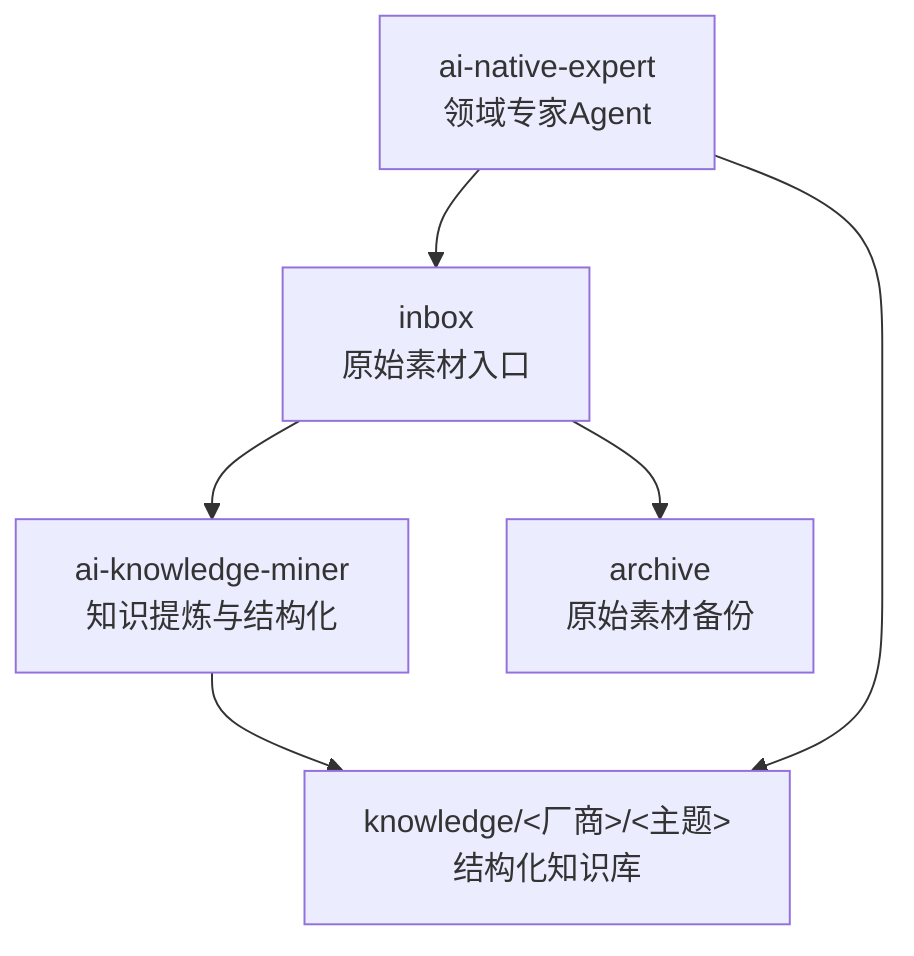
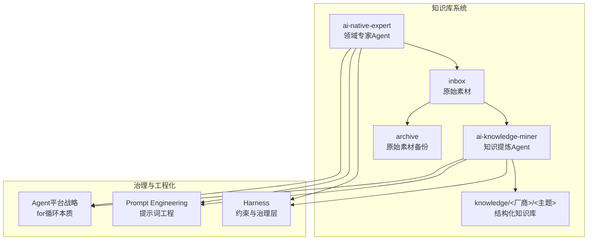
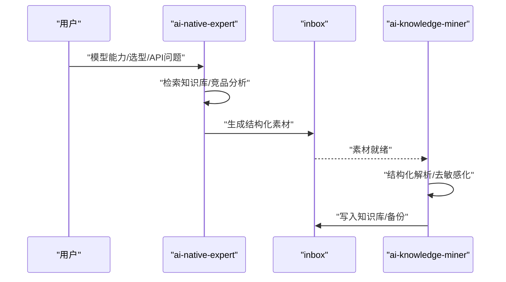
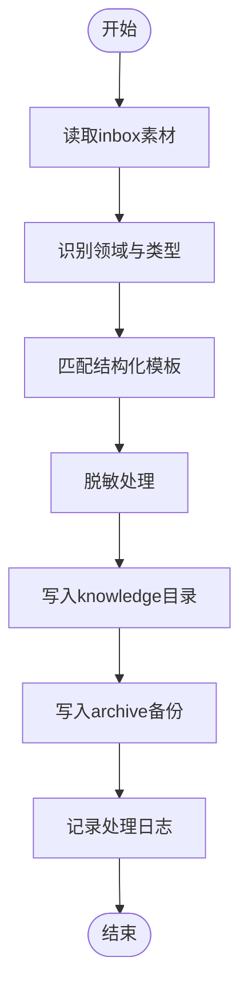
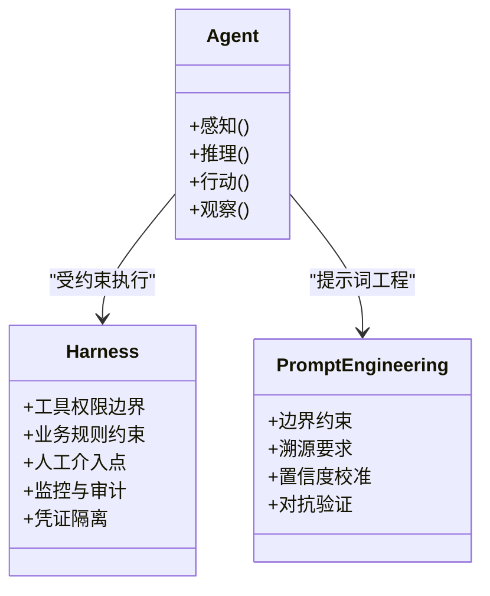
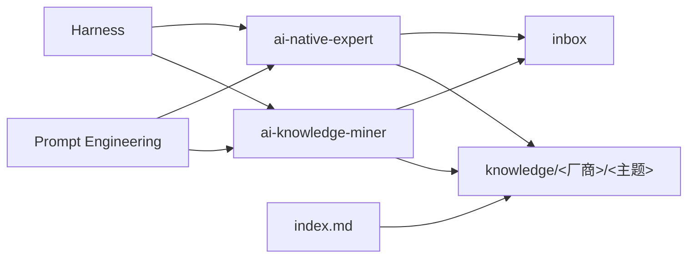

# Agent系统概述

<cite>
**本文引用的文件**
- [README.md](file://README.md)
- [index.md](file://index.md)
- [agent-def.md](file://knowledge/ai-general-notes/agent-def.md)
- [harness.md](file://knowledge/ai-general-notes/harness.md)
- [prompt-engineering.md](file://knowledge/ai-general-notes/prompt-engineering.md)
- [real_user_test_wan2.6_no_audit.py](file://vibeproject/real_user_test_wan2.6_no_audit.py)
- [test_ds_v4.py](file://vibeproject/test_ds_v4.py)
</cite>

## 目录
1. [简介](#简介)
2. [项目结构](#项目结构)
3. [核心组件](#核心组件)
4. [架构总览](#架构总览)
5. [详细组件分析](#详细组件分析)
6. [依赖分析](#依赖分析)
7. [性能考量](#性能考量)
8. [故障排查指南](#故障排查指南)
9. [结论](#结论)
10. [附录](#附录)

## 简介
本项目是一个面向AI领域的知识库系统，通过“双Agent协同架构”实现知识的自动化挖掘与结构化沉淀。系统包含两类Agent：
- ai-knowledge-miner：负责将原始素材提炼为脱敏、结构化的知识文档，写入知识库对应目录，聚焦“处理inbox、沉淀知识、结构化输出”。
- ai-native-expert：AI Native领域专家Agent，聚焦MaaS（如Qwen、Wan、Claude、Gemini、GPT）与AI Coding（如Qoder、Kiro、Claude Code），负责回答模型能力、选型、API问题、竞品分析等，并在回答后自动产出inbox素材。

该系统在知识库中的定位是“知识生产与治理的自动化中枢”，通过Agent实现从“原始素材”到“结构化知识”的闭环，支撑跨厂商、跨领域的知识沉淀与复用。

**章节来源**
- [README.md:1-20](file://README.md#L1-L20)

## 项目结构
知识库采用“领域/厂商/主题”三层目录结构，配合inbox与archive目录形成“采集—处理—归档”的工作流：
- inbox：原始素材入口，等待ai-knowledge-miner进行提炼与结构化。
- knowledge：结构化知识库，按AI通用知识、厂商产品、竞品分析、行业解决方案等维度组织。
- archive：原始素材备份目录，用于合规与审计。

**图表来源**
- [README.md:15-17](file://README.md#L15-L17)

**章节来源**
- [README.md:13-17](file://README.md#L13-L17)
- [index.md:1-69](file://index.md#L1-L69)

## 核心组件
- ai-knowledge-miner
  - 职责：从inbox提取高质量知识，生成脱敏、结构化的知识文档，写入knowledge对应目录。
  - 关键能力：结构化解析、去敏感化、模板化输出、目录归位。
  - 输入：inbox中的原始素材。
  - 输出：知识库中的结构化文档。
- ai-native-expert
  - 职责：回答模型能力、选型、API问题、竞品分析等，产出高质量inbox素材。
  - 关键能力：领域知识检索、多厂商对比、模板化回答、素材生成。
  - 输入：用户问题/指令。
  - 输出：inbox素材（供ai-knowledge-miner进一步处理）。

协作机制：
- ai-native-expert负责“知识生产”，产出素材进入inbox；
- ai-knowledge-miner负责“知识整理”，将素材转化为结构化知识；
- 二者形成“专家生成素材—系统结构化沉淀”的闭环。

**章节来源**
- [README.md:7-11](file://README.md#L7-L11)

## 架构总览
双Agent协同架构以“感知-推理-行动-观察”循环为核心，结合Harness治理层，确保Agent在工具权限、业务规则、人工介入点、审计追踪等方面具备可控性与可治理性。

**图表来源**
- [agent-def.md:29-68](file://knowledge/ai-general-notes/agent-def.md#L29-L68)
- [harness.md:17-46](file://knowledge/ai-general-notes/harness.md#L17-L46)
- [prompt-engineering.md:16-79](file://knowledge/prompt-engineering.md#L16-L79)

**章节来源**
- [agent-def.md:13-68](file://knowledge/ai-general-notes/agent-def.md#L13-L68)
- [harness.md:13-46](file://knowledge/ai-general-notes/harness.md#L13-L46)
- [prompt-engineering.md:13-79](file://knowledge/prompt-engineering.md#L13-L79)

## 详细组件分析

### ai-native-expert 组件分析
- 设计理念
  - 以“领域专家”身份提供专业问答，覆盖MaaS与AI Coding两大方向。
  - 通过模板化回答与竞品分析，形成标准化的知识产出。
- 工作原理
  - 感知：接收用户问题与上下文。
  - 推理：基于知识库与Prompt工程策略，生成结构化回答。
  - 行动：将回答转化为inbox素材，驱动后续处理。
  - 观察：评估回答质量与素材价值，反馈优化。
- 协作机制
  - 与ai-knowledge-miner形成“专家生成素材—系统结构化沉淀”的闭环。
  - 通过index.md中的索引体系，确保素材与知识库的关联性。

**图表来源**
- [README.md:7-11](file://README.md#L7-L11)
- [index.md:1-69](file://index.md#L1-L69)

**章节来源**
- [README.md:7-11](file://README.md#L7-L11)
- [index.md:1-69](file://index.md#L1-L69)

### ai-knowledge-miner 组件分析
- 设计理念
  - 以“知识提炼者”角色，将非结构化素材转化为结构化知识。
  - 强调脱敏、模板化与目录归位，确保知识库一致性与合规性。
- 工作原理
  - 感知：读取inbox中的原始素材。
  - 推理：识别素材类型与所属领域，匹配模板与结构。
  - 行动：生成结构化文档并写入knowledge对应目录，同时备份至archive。
  - 观察：记录处理日志与质量指标，支持持续优化。
- 协作机制
  - 与ai-native-expert互补，前者负责“生产”，后者负责“整理”。

**图表来源**
- [README.md:7-11](file://README.md#L7-L11)
- [README.md:15-17](file://README.md#L15-L17)

**章节来源**
- [README.md:7-11](file://README.md#L7-L11)
- [README.md:15-17](file://README.md#L15-L17)

### Agent平台战略与工程化要点
- Agent=Model+Harness：Harness是约束与治理层，决定Agent能做什么、不能做什么、何时需要人工介入。
- 感知-推理-行动-观察循环：强调上下文管理、工具调用、可观测性与失败重试。
- 多Agent（Manager-Worker）与单Agent的选择：取决于任务复杂度、错误传播与工程复杂度。

**图表来源**
- [agent-def.md:31-68](file://knowledge/ai-general-notes/agent-def.md#L31-L68)
- [harness.md:17-46](file://knowledge/ai-general-notes/harness.md#L17-L46)
- [prompt-engineering.md:46-79](file://knowledge/prompt-engineering.md#L46-L79)

**章节来源**
- [agent-def.md:29-68](file://knowledge/ai-general-notes/agent-def.md#L29-L68)
- [harness.md:24-46](file://knowledge/ai-general-notes/harness.md#L24-L46)
- [prompt-engineering.md:46-79](file://knowledge/prompt-engineering.md#L46-L79)

## 依赖分析
- 组件耦合
  - ai-native-expert与ai-knowledge-miner通过inbox与knowledge形成松耦合依赖。
  - Harness与Prompt Engineering为两Agent提供统一的治理与工程化基础。
- 外部依赖
  - 知识库索引依赖index.md进行全局导航。
  - 测试脚本展示了对外部API的调用方式与地域路由策略，间接体现Agent在实际应用中的外部集成能力。

**图表来源**
- [README.md:15-17](file://README.md#L15-L17)
- [index.md:1-69](file://index.md#L1-L69)

**章节来源**
- [README.md:15-17](file://README.md#L15-L17)
- [index.md:1-69](file://index.md#L1-L69)

## 性能考量
- 上下文管理与压缩：长循环中上下文膨胀，需采用摘要/截断策略，避免Token超限与延迟上升。
- 工具幂等性与失败重试：对可重试操作需幂等化，对不可逆操作需人工确认门。
- 限流与地域路由：参考测试脚本中的限流与地域路由策略，合理分配请求与资源，保障吞吐与稳定性。
- 观测性优先：每一步感知-行动-观察均需日志，便于调试与性能分析。

**章节来源**
- [agent-def.md:101-107](file://knowledge/ai-general-notes/agent-def.md#L101-L107)
- [test_ds_v4.py:5-11](file://vibeproject/test_ds_v4.py#L5-L11)
- [test_ds_v4.py:12-22](file://vibeproject/test_ds_v4.py#L12-L22)

## 故障排查指南
- API调用失败
  - 检查环境变量与地域路由配置，确保API Key与端点正确。
  - 参考测试脚本中的异常处理与状态轮询逻辑，定位失败原因。
- 任务状态异常
  - 使用fetch/wait方法轮询任务状态，区分SUCCEEDED/FAILED并记录日志。
- 内容安全检测导致的限制
  - 可通过禁用内容安全检测的Header进行测试，注意合规与生产环境的差异。

**章节来源**
- [real_user_test_wan2.6_no_audit.py:16-24](file://vibeproject/real_user_test_wan2.6_no_audit.py#L16-L24)
- [real_user_test_wan2.6_no_audit.py:55-98](file://vibeproject/real_user_test_wan2.6_no_audit.py#L55-L98)

## 结论
双Agent协同架构以“专家生成素材—系统结构化沉淀”为核心，结合Harness治理与Prompt Engineering工程化实践，实现了知识库的自动化、规范化与可持续演进。通过明确的职责边界与协作机制，系统在跨厂商、跨领域的知识管理中具备高扩展性与强治理能力。

## 附录
- 知识库索引与导航：通过index.md维护全局索引，指导Agent与用户高效定位与检索知识。
- 模板与最佳实践：参考Agent与Harness文档中的模板与最佳实践，确保输出质量与一致性。

**章节来源**
- [index.md:1-69](file://index.md#L1-L69)
- [agent-def.md:89-100](file://knowledge/ai-general-notes/agent-def.md#L89-L100)
- [harness.md:69-78](file://knowledge/ai-general-notes/harness.md#L69-L78)