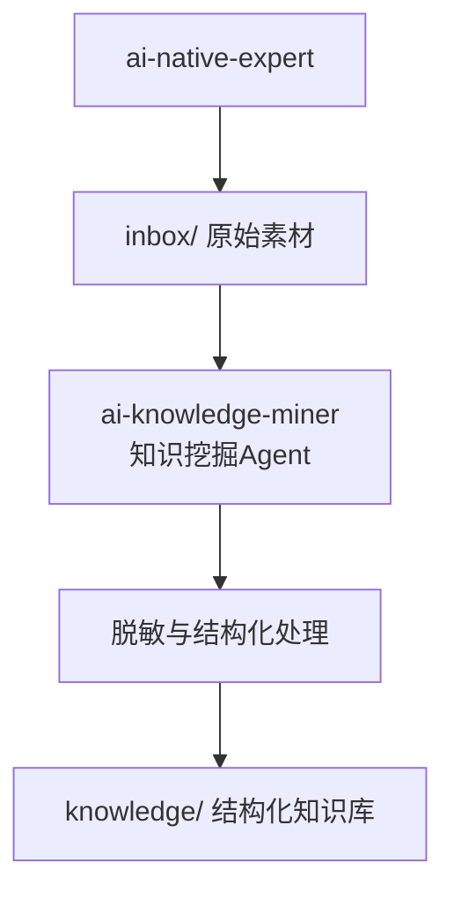
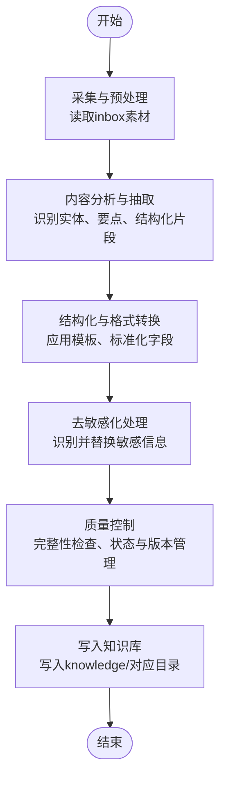
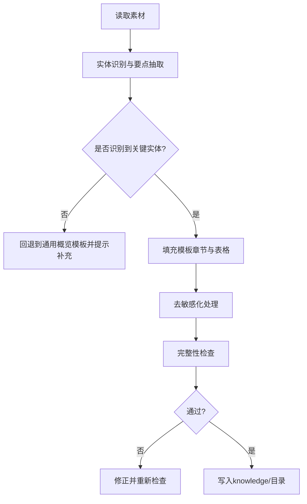
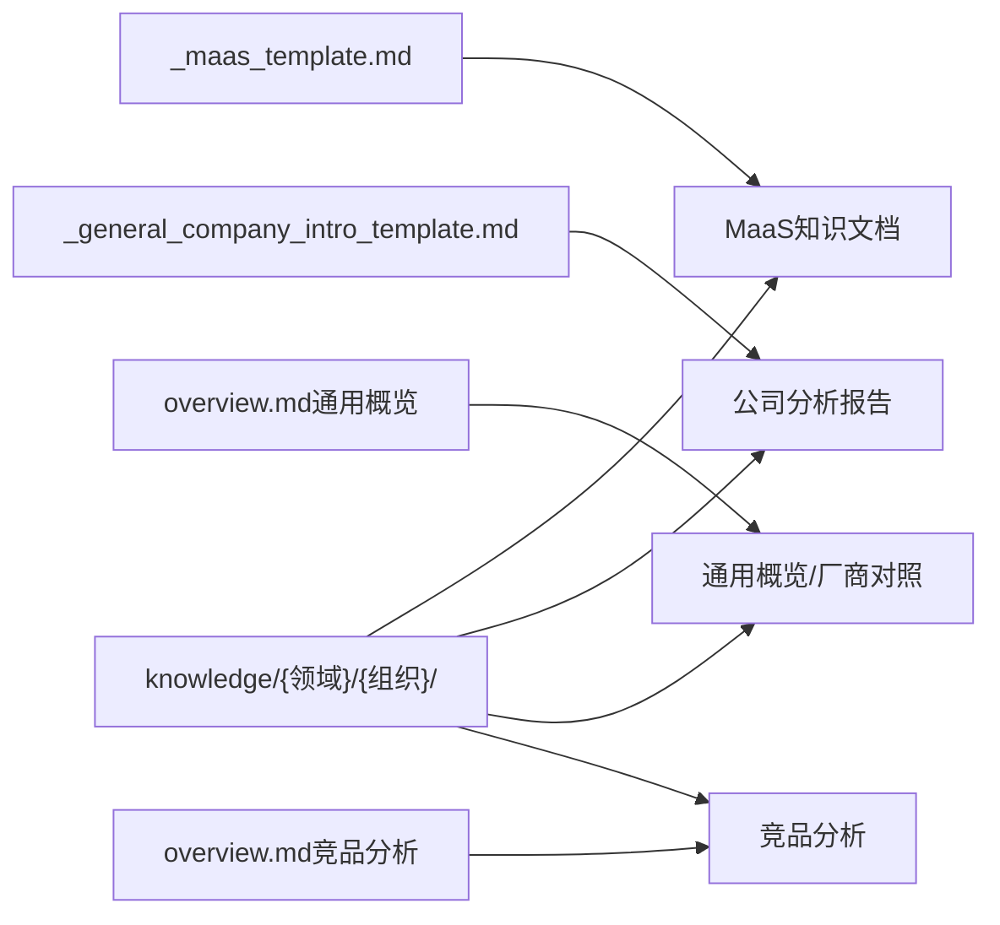

# ai-knowledge-miner知识挖掘Agent

<cite>
**本文引用的文件**
- [README.md](file://README.md)
- [dashscope_multi_account_router.py](file://vibeproject/dashscope_multi_account_router.py)
- [real_user_test_wan2.6_no_audit.py](file://vibeproject/real_user_test_wan2.6_no_audit.py)
- [_maas_template.md](file://knowledge/_maas_template.md)
- [_general_company_intro_template.md](file://knowledge/_general_company_intro_template.md)
- [overview.md](file://knowledge/ai-general-notes/overview.md)
- [overview.md](file://knowledge/alibaba-cloud/competitive-analysis/alibaba-vs-aws/overview.md)
- [Daily_note_update_with_AI_insight.md](file://notes/Daily_note_update_with_AI_insight.md)
</cite>

## 目录
1. [简介](#简介)
2. [项目结构](#项目结构)
3. [核心组件](#核心组件)
4. [架构总览](#架构总览)
5. [详细组件分析](#详细组件分析)
6. [依赖分析](#依赖分析)
7. [性能考虑](#性能考虑)
8. [故障排查指南](#故障排查指南)
9. [结论](#结论)
10. [附录](#附录)

## 简介
本文件面向“ai-knowledge-miner知识挖掘Agent”的技术文档，目标是帮助读者全面理解该Agent如何将inbox中的原始素材转化为脱敏、结构化的知识文档，并写入knowledge目录对应分类。文档覆盖输入输出规范、处理流程、质量控制机制、去敏感化策略、标准化格式与完整性检查、使用示例、配置参数与最佳实践，以及错误处理与性能优化策略。

## 项目结构
该项目采用“素材-沉淀”双Agent协作模式：
- ai-native-expert负责生成原始素材（写入inbox）
- ai-knowledge-miner负责从inbox提炼、脱敏、结构化，并写入knowledge

图示来源
- [README.md:1-20](file://README.md#L1-L20)

章节来源
- [README.md:1-20](file://README.md#L1-L20)

## 核心组件
- 输入：inbox中的原始素材（文本、网页、会议记录、笔记等）
- 输出：脱敏、结构化、标准化的知识文档，按领域/组织归档至knowledge目录
- 质量控制：脱敏策略、模板驱动的结构化、完整性检查、变更日志与状态字段
- 工具链：可复用的多账号路由与限流熔断（用于外部调用场景）

章节来源
- [README.md:7-8](file://README.md#L7-L8)

## 架构总览
Agent处理链路分为四阶段：采集与预处理、内容分析与抽取、结构化与格式转换、质量控制与落库。

## 详细组件分析

### 输入输出规范
- 输入
  - 文件类型：文本、Markdown、HTML、JSON、CSV等
  - 来源：ai-native-expert产出的原始素材
  - 结构：自由文本，可能包含多段、列表、表格、链接、图片引用等
- 输出
  - 文件类型：Markdown
  - 目录：按领域/组织归档至knowledge/下
  - 字段：标题、摘要、作者、状态、更新时间、章节、表格、参考资料、变更日志等
  - 示例：MaaS模板、公司分析模板、通用概览模板、竞品分析模板等

章节来源
- [README.md:15-17](file://README.md#L15-L17)
- [_maas_template.md:1-65](file://knowledge/_maas_template.md#L1-L65)
- [_general_company_intro_template.md:1-234](file://knowledge/_general_company_intro_template.md#L1-L234)
- [overview.md:1-42](file://knowledge/ai-general-notes/overview.md#L1-L42)
- [overview.md:1-46](file://knowledge/alibaba-cloud/competitive-analysis/alibaba-vs-aws/overview.md#L1-L46)

### 处理流程与质量控制机制
- 内容分析与抽取
  - 识别关键实体（模型名、厂商、时间、参数、场景、能力、限制等）
  - 提取要点与结构化片段（表格、清单、对比表）
  - 保留原文引用与来源链接
- 结构化与格式转换
  - 依据模板填充章节与表格
  - 统一标题层级、摘要、作者、状态、更新时间等元信息
  - 保持Markdown语法一致性
- 去敏感化处理
  - 识别并替换个人身份信息、内部链接、机密数据
  - 对图片/附件进行脱敏或移除
- 完整性检查
  - 必填字段校验（标题、状态、更新时间、至少一段正文）
  - 表格完整性（关键列不为空）
  - 参考资料与变更日志完整性
- 版本与状态管理
  - 状态字段：Draft / Reviewed / Published
  - 变更日志：记录每次更新内容与日期

### 知识组织与模板体系
- 模板类型
  - MaaS模板：模型定位、能力与限制、适用场景、论文与参考
  - 公司分析模板：公司概况、领导层、愿景使命、产品矩阵、财务与算力、近期观点、影响力分析、数据使用建议
  - 通用概览模板：定义、原理、选型维度、厂商对照、最佳实践、常见误区、参考资料、变更日志
  - 竞品分析模板：维度对比、产品矩阵、生态与合规、定价策略、销售建议、参考资料、变更日志
- 组织方式
  - 按领域/组织分层：如knowledge/ai-general-notes、knowledge/alibaba-cloud、knowledge/anthropic、knowledge/aws、knowledge/gcp、knowledge/openai、knowledge/solutions等
  - 按主题分目录：如ai-application、ai-coding、ai-infra、ai-platform、competitive-analysis、maas等

章节来源
- [_maas_template.md:1-65](file://knowledge/_maas_template.md#L1-L65)
- [_general_company_intro_template.md:1-234](file://knowledge/_general_company_intro_template.md#L1-L234)
- [overview.md:1-42](file://knowledge/ai-general-notes/overview.md#L1-L42)
- [overview.md:1-46](file://knowledge/alibaba-cloud/competitive-analysis/alibaba-vs-aws/overview.md#L1-L46)

### 使用示例
- 示例1：MaaS知识文档
  - 输入：某厂商模型能力说明、参数、上下文、场景、论文与API文档
  - 处理：按MaaS模板填充“当前主推模型”、“核心能力与限制”、“适用场景”、“关键技术论文”、“参考资料”、“变更日志”
  - 输出：knowledge/{vendor}/maas/{model}.md
- 示例2：公司分析报告
  - 输入：公司概况、高层信息、产品矩阵、财务与算力、近期观点、论文与影响力
  - 处理：按公司分析模板填充“公司概况”、“关键产品矩阵”、“产品收入与用户规模”、“算力部署与规划”、“近期CXO核心观点”、“数据使用建议”、“核心论文与影响力分析”
  - 输出：knowledge/{vendor}/{company}.md
- 示例3：通用概览与竞品分析
  - 输入：LLM概览、厂商实现对照、最佳实践、常见误区
  - 处理：按通用概览模板填充“是什么”、“核心原理”、“关键选型维度”、“各厂商实现对照”、“最佳实践”、“常见误区”、“参考资料”、“变更日志”
  - 输出：knowledge/ai-general-notes/overview.md
  - 输入：阿里云 vs AWS 竞品分析
  - 处理：按竞品分析模板填充“概览对比”、“核心产品矩阵对比”、“生态与合规”、“定价策略差异”、“SA销售建议”、“参考资料”、“变更日志”
  - 输出：knowledge/alibaba-cloud/competitive-analysis/alibaba-vs-aws/overview.md

章节来源
- [_maas_template.md:1-65](file://knowledge/_maas_template.md#L1-L65)
- [_general_company_intro_template.md:1-234](file://knowledge/_general_company_intro_template.md#L1-L234)
- [overview.md:1-42](file://knowledge/ai-general-notes/overview.md#L1-L42)
- [overview.md:1-46](file://knowledge/alibaba-cloud/competitive-analysis/alibaba-vs-aws/overview.md#L1-L46)

### 配置参数与最佳实践
- 配置参数
  - 模板路径：knowledge/_maas_template.md、knowledge/_general_company_intro_template.md
  - 输出目录：knowledge/{领域}/{组织}/
  - 状态字段：Draft / Reviewed / Published
  - 变更日志：日期与变更内容
- 最佳实践
  - 先抽取后填充：先识别关键实体，再按模板填充
  - 严格脱敏：对人名、邮箱、内部链接、截图中的敏感信息进行替换
  - 保持一致性：统一标题层级、表格列名、术语与单位
  - 完整性优先：必填字段与表格关键列不能为空
  - 版本管理：每次更新在变更日志中记录，状态随内容成熟度调整

章节来源
- [_maas_template.md:62-65](file://knowledge/_maas_template.md#L62-L65)
- [_general_company_intro_template.md:231-234](file://knowledge/_general_company_intro_template.md#L231-L234)
- [overview.md:39-42](file://knowledge/ai-general-notes/overview.md#L39-L42)
- [overview.md:43-46](file://knowledge/alibaba-cloud/competitive-analysis/alibaba-vs-aws/overview.md#L43-L46)

### 错误处理机制
- 输入异常
  - 空文件或无法解析：提示并回退到通用模板
  - 缺失关键字段：在输出中标注缺失项并要求补充
- 结构化异常
  - 模板填充失败：回退到基础结构，保留原文并标注
  - 表格列不匹配：补齐默认值或提示修正
- 质量控制异常
  - 完整性检查失败：阻断写入并输出修复清单
  - 脱敏遗漏：二次扫描与人工复核
- 外部依赖异常（可选）
  - 当Agent需要调用外部模型或API时，可复用多账号路由与限流熔断机制，实现429自动熔断、指数退避与重试

章节来源
- [dashscope_multi_account_router.py:251-293](file://vibeproject/dashscope_multi_account_router.py#L251-L293)

### 性能优化策略
- 批量处理
  - 并发控制：限制同时写入与模板渲染的并发度，避免IO瓶颈
  - 分批写入：按领域/组织分批处理，减少内存占用
- 缓存与索引
  - 常用模板与实体词典缓存，加速识别与填充
  - 输出文件索引，避免重复处理
- I/O优化
  - 流式写入，边处理边落盘
  - 压缩输出（可选），降低存储压力
- 外部调用优化（可选）
  - 多账号轮询与权重分配，提升吞吐
  - 429限流熔断与指数退避，避免雪崩

章节来源
- [dashscope_multi_account_router.py:295-317](file://vibeproject/dashscope_multi_account_router.py#L295-L317)
- [dashscope_multi_account_router.py:398-436](file://vibeproject/dashscope_multi_account_router.py#L398-L436)

## 依赖分析
- 模板依赖
  - MaaS模板与公司分析模板为知识文档的结构骨架
  - 通用概览与竞品分析模板用于快速沉淀与对比
- 目录结构依赖
  - knowledge/{领域}/{组织}/ 下的层次结构决定了Agent的分类与落库路径
- 工具链依赖（可选）
  - 多账号路由与限流熔断模块可用于外部调用场景，保障稳定性与吞吐

图示来源
- [_maas_template.md:1-65](file://knowledge/_maas_template.md#L1-L65)
- [_general_company_intro_template.md:1-234](file://knowledge/_general_company_intro_template.md#L1-L234)
- [overview.md:1-42](file://knowledge/ai-general-notes/overview.md#L1-L42)
- [overview.md:1-46](file://knowledge/alibaba-cloud/competitive-analysis/alibaba-vs-aws/overview.md#L1-L46)

## 性能考虑
- 模板渲染性能：优先使用轻量模板，避免深层嵌套与复杂计算
- 实体识别性能：对大文本分段处理，结合缓存与增量更新
- I/O吞吐：批量写入与流式处理，避免频繁fsync
- 并发与限流：在外部调用场景下，合理设置并发与重试策略，避免触发上游限流

## 故障排查指南
- 症状：输出文档字段缺失
  - 排查：检查输入素材是否包含关键实体；确认模板字段映射
  - 处理：回退到通用模板，补齐缺失字段
- 症状：脱敏不彻底
  - 排查：二次扫描敏感信息，检查图片与链接
  - 处理：替换为占位符或移除
- 症状：竞品分析对比表不完整
  - 排查：核对维度与列名；确认数据来源
  - 处理：补齐空单元格或标注“待补充”
- 症状：外部调用频繁429
  - 排查：检查账号权重与冷却时间
  - 处理：启用熔断与指数退避，调整并发

章节来源
- [dashscope_multi_account_router.py:251-293](file://vibeproject/dashscope_multi_account_router.py#L251-L293)

## 结论
ai-knowledge-miner通过“模板驱动+实体抽取+脱敏+质量控制”的流水线，将inbox中的原始素材转化为高质量、可检索、可维护的知识文档。其核心在于标准化的模板体系、严格的完整性与一致性检查，以及可选的多账号路由与限流熔断机制，确保在高并发与不稳定外部环境下仍能稳定产出。

## 附录
- 示例素材来源
  - notes/Daily_note_update_with_AI_insight.md：日常笔记与AI洞察，可作为输入素材
- 相关模板与样例
  - MaaS模板、公司分析模板、通用概览模板、竞品分析模板

章节来源
- [Daily_note_update_with_AI_insight.md:1-6](file://notes/Daily_note_update_with_AI_insight.md#L1-L6)