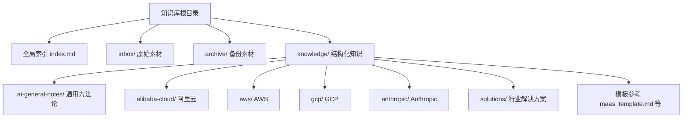
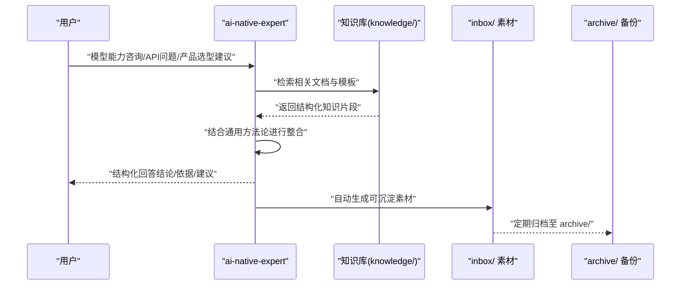
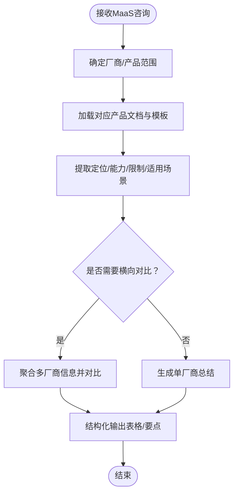
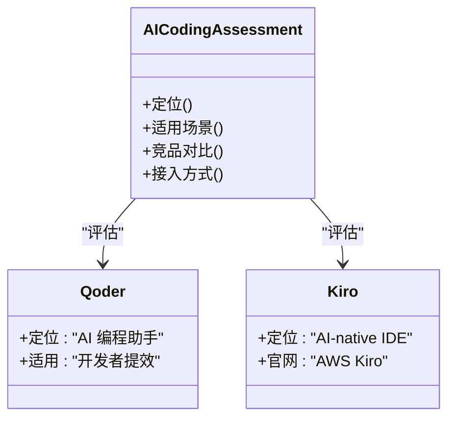
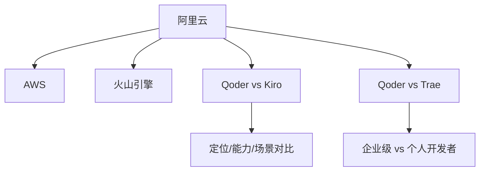
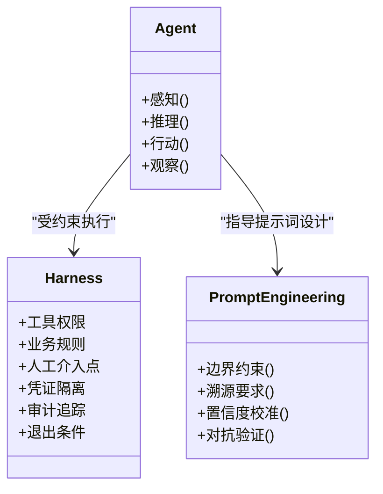
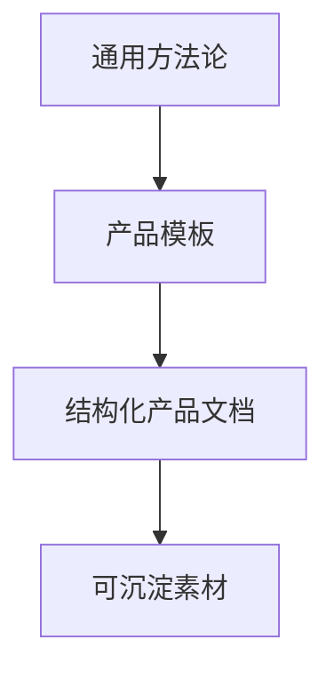
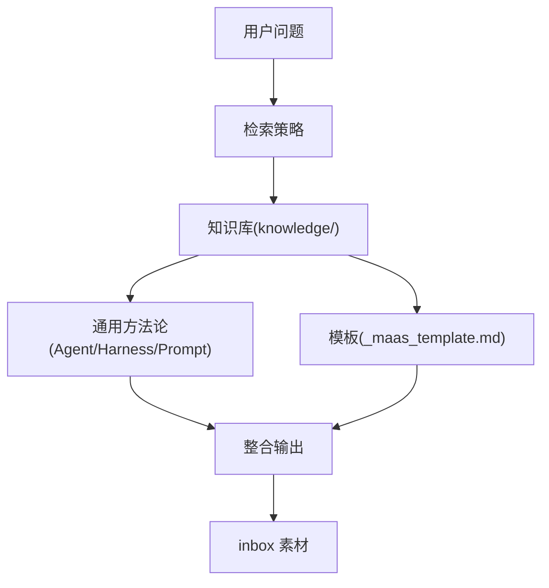

# ai-native-expert AI专家Agent

<cite>
**本文引用的文件**
- [README.md](file://README.md)
- [index.md](file://index.md)
- [_maas_template.md](file://knowledge/_maas_template.md)
- [overview.md](file://knowledge/ai-general-notes/overview.md)
- [agent-def.md](file://knowledge/ai-general-notes/agent-def.md)
- [harness.md](file://knowledge/ai-general-notes/harness.md)
- [prompt-engineering.md](file://knowledge/ai-general-notes/prompt-engineering.md)
- [alibaba-cloud/maas/overview.md](file://knowledge/alibaba-cloud/maas/overview.md)
- [alibaba-cloud/maas/qwen.md](file://knowledge/alibaba-cloud/maas/qwen.md)
- [alibaba-cloud/ai-coding/qoder.md](file://knowledge/alibaba-cloud/ai-coding/qoder.md)
- [aws/maas/overview.md](file://knowledge/aws/maas/overview.md)
- [aws/ai-coding/kiro.md](file://knowledge/aws/ai-coding/kiro.md)
- [anthropic/maas/claude-api.md](file://knowledge/anthropic/maas/claude-api.md)
- [gcp/maas/overview.md](file://knowledge/gcp/maas/overview.md)
</cite>

## 目录
1. [简介](#简介)
2. [项目结构](#项目结构)
3. [核心组件](#核心组件)
4. [架构总览](#架构总览)
5. [详细组件分析](#详细组件分析)
6. [依赖分析](#依赖分析)
7. [性能考虑](#性能考虑)
8. [故障排查指南](#故障排查指南)
9. [结论](#结论)
10. [附录](#附录)

## 简介
ai-native-expert 是一个专注于 AI Native 领域的专家级 Agent，具备以下专业能力：
- MaaS 产品分析：覆盖阿里云、AWS、GCP、Anthropic 等厂商的模型即服务（MaaS）产品，提供模型定位、能力矩阵、适用场景与限制说明。
- AI Coding 能力评估：对 Qoder、Kiro、Claude Code 等 AI 编程助手进行能力对比与使用建议。
- 竞品对比分析：在阿里云视角下，提供多厂商、多产品线的横向对比，帮助用户进行产品选型与策略制定。

该 Agent 的回答流程遵循“知识检索-推理整合-结构化输出”的范式，并在每次回答后自动生成可沉淀为知识库的 inbox 素材，形成“提问-沉淀-复用”的闭环。

章节来源
- [README.md:1-20](file://README.md#L1-L20)

## 项目结构
知识库采用“领域-厂商-产品”三层组织方式，辅以通用方法论与模板，确保知识的系统性与可复用性：
- 顶层为全局索引，提供快速导航与跨厂商对比入口。
- 领域层包含 AI General Notes（通用方法论）、各厂商的 MaaS/AI Coding/AI App/AI Platform/AI Infra 等专题。
- 模板层提供标准化的 MaaS 产品模板，确保同类文档风格一致、要素完备。

图表来源
- [index.md:1-69](file://index.md#L1-L69)
- [README.md:13-18](file://README.md#L13-L18)

章节来源
- [README.md:13-18](file://README.md#L13-L18)
- [index.md:1-69](file://index.md#L1-L69)

## 核心组件
ai-native-expert 的核心能力由以下模块组成：
- 知识来源与检索：基于知识库的结构化文档与索引，按领域与厂商进行检索与聚合。
- 推理与整合：结合通用方法论（Agent、Harness、Prompt Engineering）对多源信息进行一致性校验与结构化输出。
- 答案生成：面向用户问题，输出“结论-依据-建议”的结构化回答，并标注适用/不适用场景与限制。
- Inbox 素材产出：在回答末尾附加“可沉淀素材”清单，便于后续提炼为知识库条目。

章节来源
- [README.md:7-11](file://README.md#L7-L11)
- [prompt-engineering.md:135-161](file://knowledge/ai-general-notes/prompt-engineering.md#L135-L161)

## 架构总览
Agent 的工作流分为“输入-检索-推理-生成-沉淀”五个阶段，形成闭环：

图表来源
- [README.md:7-11](file://README.md#L7-L11)
- [index.md:1-69](file://index.md#L1-L69)

## 详细组件分析

### MaaS 产品分析能力
- 覆盖范围：阿里云（Qwen 系列、百炼平台）、AWS（Bedrock、Claude、Titan）、GCP（Model Garden、Gemini、Imagen）、Anthropic（Claude API）。
- 分析维度：定位、当前主推、适用/不适用场景、核心能力与限制、接入方式、参考资料与变更记录。
- 输出形态：结构化表格与要点说明，便于快速比较与选型。

图表来源
- [_maas_template.md:1-65](file://knowledge/_maas_template.md#L1-L65)
- [alibaba-cloud/maas/qwen.md:1-120](file://knowledge/alibaba-cloud/maas/qwen.md#L1-L120)
- [alibaba-cloud/maas/overview.md:1-9](file://knowledge/alibaba-cloud/maas/overview.md#L1-L9)
- [aws/maas/overview.md:1-9](file://knowledge/aws/maas/overview.md#L1-L9)
- [gcp/maas/overview.md:1-9](file://knowledge/gcp/maas/overview.md#L1-L9)
- [anthropic/maas/claude-api.md:1-9](file://knowledge/anthropic/maas/claude-api.md#L1-L9)

章节来源
- [_maas_template.md:1-65](file://knowledge/_maas_template.md#L1-L65)
- [alibaba-cloud/maas/qwen.md:1-120](file://knowledge/alibaba-cloud/maas/qwen.md#L1-L120)
- [alibaba-cloud/maas/overview.md:1-9](file://knowledge/alibaba-cloud/maas/overview.md#L1-L9)
- [aws/maas/overview.md:1-9](file://knowledge/aws/maas/overview.md#L1-L9)
- [gcp/maas/overview.md:1-9](file://knowledge/gcp/maas/overview.md#L1-L9)
- [anthropic/maas/claude-api.md:1-9](file://knowledge/anthropic/maas/claude-api.md#L1-L9)

### AI Coding 能力评估
- 覆盖范围：阿里云 Qoder、AWS Kiro、Anthropic Claude Code 等。
- 评估维度：定位、适用场景、与竞品对比、接入方式与注意事项。
- 输出形态：定位说明、适用/不适用场景列表、竞品对比要点。

图表来源
- [alibaba-cloud/ai-coding/qoder.md:1-9](file://knowledge/alibaba-cloud/ai-coding/qoder.md#L1-L9)
- [aws/ai-coding/kiro.md:1-9](file://knowledge/aws/ai-coding/kiro.md#L1-L9)

章节来源
- [alibaba-cloud/ai-coding/qoder.md:1-9](file://knowledge/alibaba-cloud/ai-coding/qoder.md#L1-L9)
- [aws/ai-coding/kiro.md:1-9](file://knowledge/aws/ai-coding/kiro.md#L1-L9)

### 竞品对比分析
- 阿里云视角下的横向对比：阿里云 vs AWS、阿里云 vs 火山引擎，以及具体产品对比（如 Qoder vs Kiro、Qoder vs Trae）。
- 分析维度：定位差异、目标用户、能力侧重、适用场景与限制。
- 输出形态：对比概览与要点清单，辅助选型与策略制定。

图表来源
- [index.md:48-54](file://index.md#L48-L54)

章节来源
- [index.md:48-54](file://index.md#L48-L54)

### 通用方法论支撑
- Agent：将 Agent 视为“不确定性受控的 for 循环”，强调感知-推理-行动-观察的工程化闭环。
- Harness：Harness 是约束与治理层，决定 Agent 能做什么、不能做什么、何时需要人工介入。
- Prompt Engineering：通过四层机制（边界约束、溯源要求、置信度校准、对抗验证）降低幻觉，提升可控性与可信度。

图表来源
- [agent-def.md:13-68](file://knowledge/ai-general-notes/agent-def.md#L13-L68)
- [harness.md:13-47](file://knowledge/ai-general-notes/harness.md#L13-L47)
- [prompt-engineering.md:46-79](file://knowledge/ai-general-notes/prompt-engineering.md#L46-L79)

章节来源
- [agent-def.md:13-68](file://knowledge/ai-general-notes/agent-def.md#L13-L68)
- [harness.md:13-47](file://knowledge/ai-general-notes/harness.md#L13-L47)
- [prompt-engineering.md:46-79](file://knowledge/ai-general-notes/prompt-engineering.md#L46-L79)

### 知识来源与模板体系
- 通用概览：LLM 概览、Agent 定义、Harness、Prompt Engineering 等，提供跨厂商、跨产品的一致认知框架。
- 产品模板：MaaS 产品模板，规范文档结构与要素，确保知识沉淀的标准化与可复用性。

图表来源
- [overview.md:1-42](file://knowledge/ai-general-notes/overview.md#L1-L42)
- [_maas_template.md:1-65](file://knowledge/_maas_template.md#L1-L65)

章节来源
- [overview.md:1-42](file://knowledge/ai-general-notes/overview.md#L1-L42)
- [_maas_template.md:1-65](file://knowledge/_maas_template.md#L1-L65)

## 依赖分析
- 知识依赖：Agent 的回答依赖于知识库中的结构化文档与模板，尤其是 MaaS 产品文档与通用方法论。
- 交互依赖：Agent 与用户交互时，需根据问题类型动态选择检索路径（MaaS、AI Coding、竞品对比）。
- 质量依赖：答案的准确性与一致性取决于模板的完整性与通用方法论的正确应用。

图表来源
- [index.md:1-69](file://index.md#L1-L69)
- [_maas_template.md:1-65](file://knowledge/_maas_template.md#L1-L65)
- [agent-def.md:13-68](file://knowledge/ai-general-notes/agent-def.md#L13-L68)
- [harness.md:13-47](file://knowledge/ai-general-notes/harness.md#L13-L47)
- [prompt-engineering.md:46-79](file://knowledge/ai-general-notes/prompt-engineering.md#L46-L79)

章节来源
- [index.md:1-69](file://index.md#L1-L69)
- [_maas_template.md:1-65](file://knowledge/_maas_template.md#L1-L65)
- [agent-def.md:13-68](file://knowledge/ai-general-notes/agent-def.md#L13-L68)
- [harness.md:13-47](file://knowledge/ai-general-notes/harness.md#L13-L47)
- [prompt-engineering.md:46-79](file://knowledge/ai-general-notes/prompt-engineering.md#L46-L79)

## 性能考虑
- 检索效率：通过全局索引与分层目录结构，减少无关文档扫描，提高检索命中率。
- 输出一致性：使用模板与通用方法论，避免重复劳动并保证回答风格统一。
- 素材沉淀：每次回答后自动生成可沉淀素材，降低后续提炼成本，提升知识库更新效率。

## 故障排查指南
- 问题：回答缺乏依据或过于宽泛
  - 排查：确认检索是否覆盖了相关产品文档与模板；检查通用方法论应用是否到位。
  - 处理：补充缺失文档链接与对比数据，强化“结论-依据-建议”的结构化输出。
- 问题：竞品对比不清晰或存在偏差
  - 排查：核对全局索引中的对比概览与具体对比文档。
  - 处理：依据索引中的对比维度（定位、目标用户、能力侧重、适用场景）重新组织输出。
- 问题：API 问题解答不完整
  - 排查：确认是否引用了对应厂商的 MaaS 概览与产品文档。
  - 处理：在回答末尾附加“接入方式/平台托管/可视化编排”等要点，并提供官方文档链接。

章节来源
- [index.md:48-54](file://index.md#L48-L54)
- [alibaba-cloud/maas/overview.md:1-9](file://knowledge/alibaba-cloud/maas/overview.md#L1-L9)
- [aws/maas/overview.md:1-9](file://knowledge/aws/maas/overview.md#L1-L9)
- [gcp/maas/overview.md:1-9](file://knowledge/gcp/maas/overview.md#L1-L9)
- [anthropic/maas/claude-api.md:1-9](file://knowledge/anthropic/maas/claude-api.md#L1-L9)

## 结论
ai-native-expert 通过“知识库驱动 + 方法论支撑 + 模板标准化”的方式，实现了对 MaaS 与 AI Coding 的系统化分析与选型建议。其优势在于：
- 覆盖全面：横跨多家厂商与产品线，提供横向对比与纵向深度。
- 流程规范：以模板与通用方法论为基座，确保回答一致性与可复用性。
- 闭环沉淀：每次回答自动生成可沉淀素材，加速知识库建设与迭代。

局限性与边界：
- 依赖知识库完整性：若某厂商/产品缺少结构化文档，回答深度将受限。
- 时效性：模型与产品版本更新频繁，需定期维护知识库与模板。
- 个性化：对于高度定制化场景，仍需结合业务规则与人工审核（Harness）进行落地。

## 附录
- 使用场景示例
  - 企业进行 MaaS 选型：提供 Qwen、Claude、Gemini 等模型的定位、能力与适用场景对比，辅助决策。
  - 开发团队评估 AI Coding 工具：对比 Qoder、Kiro、Claude Code 的定位与接入方式，选择合适工具链。
  - 竞品策略制定：基于“阿里云 vs AWS/火山引擎”的对比概览，制定差异化策略。
- 配置与集成
  - 集成方式：通过知识库索引与模板，将回答内容标准化并沉淀为知识条目；必要时提供“接入方式/平台托管/可视化编排”等要点。
  - 素材产出：每次回答末尾生成“可沉淀素材”清单，便于后续提炼与归档。

章节来源
- [README.md:7-11](file://README.md#L7-L11)
- [index.md:1-69](file://index.md#L1-L69)
- [prompt-engineering.md:135-161](file://knowledge/ai-general-notes/prompt-engineering.md#L135-L161)