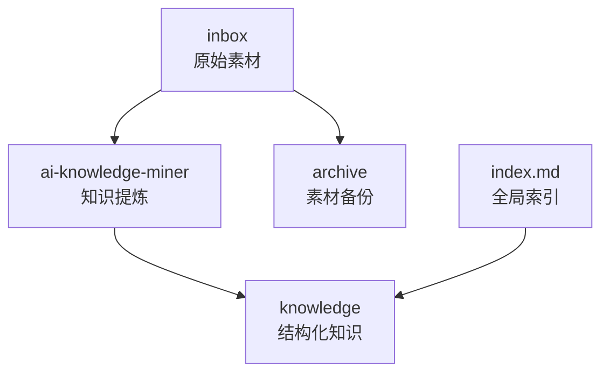
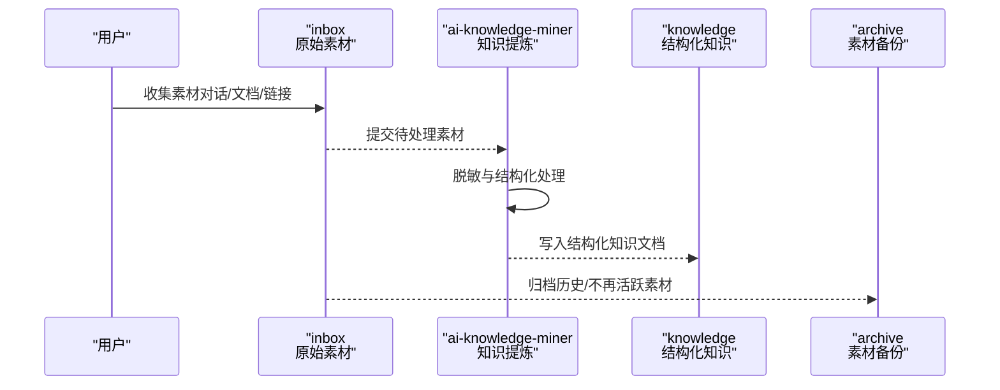
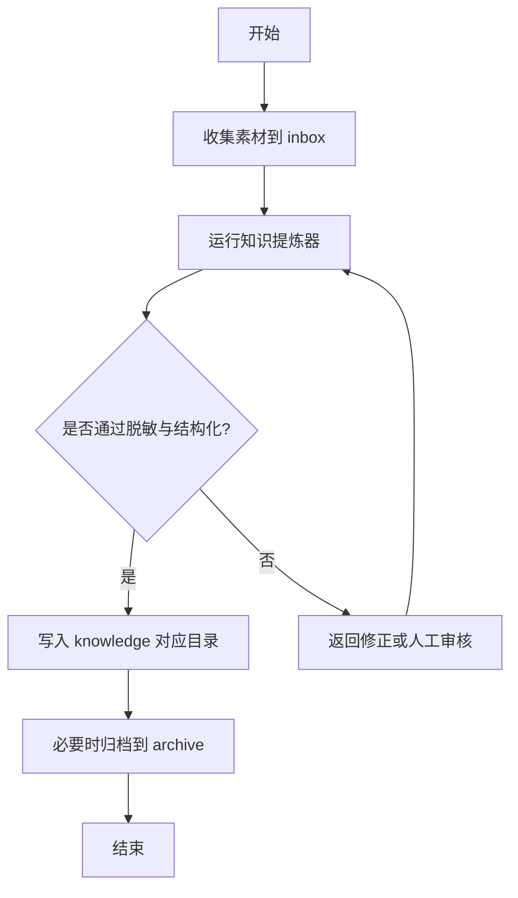
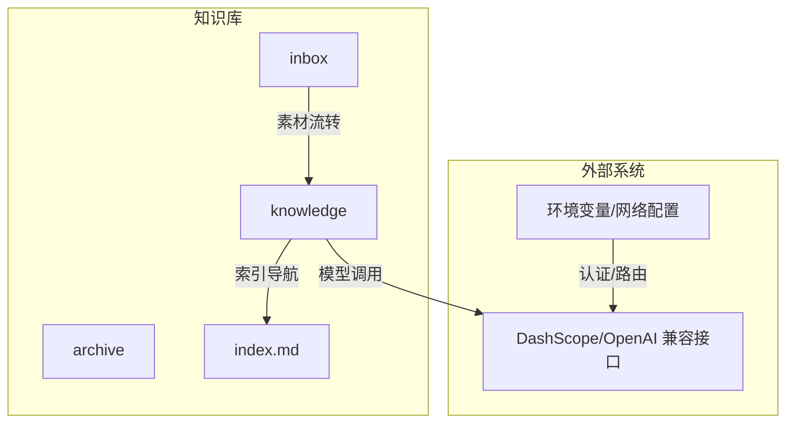

# 快速开始

<cite>
**本文引用的文件**
- [README.md](file://README.md)
- [index.md](file://index.md)
- [知识库全局索引](file://index.md)
- [_maas_template.md](file://knowledge/_maas_template.md)
- [AI 通用笔记模板](file://knowledge/ai-general-notes/_template.md)
- [对比分析模板](file://knowledge/alibaba-cloud/competitive-analysis/_template.md)
- [百炼平台概览](file://knowledge/alibaba-cloud/maas/overview.md)
- [dashscope_multi_account_router.py](file://vibeproject/dashscope_multi_account_router.py)
- [test_ds_v4.py](file://vibeproject/test_ds_v4.py)
- [real_user_test_wan2.6_no_audit.py](file://vibeproject/real_user_test_wan2.6_no_audit.py)
</cite>

## 目录
1. [简介](#简介)
2. [项目结构](#项目结构)
3. [核心组件](#核心组件)
4. [架构总览](#架构总览)
5. [详细组件分析](#详细组件分析)
6. [依赖关系分析](#依赖关系分析)
7. [性能注意事项](#性能注意事项)
8. [故障排除指南](#故障排除指南)
9. [结论](#结论)
10. [附录](#附录)

## 简介
本指南面向首次接触“AI知识库”的用户，帮助你快速完成环境准备、掌握基本使用流程，并理解inbox、archive、knowledge三大目录的职责与协作方式。同时提供常见使用场景、模板参考与故障排除建议，让你在最短时间内上手并高效沉淀知识。

## 项目结构
仓库采用“素材-沉淀-索引”的分层组织方式：
- inbox：原始素材存放区，用于收集待处理的信息与对话记录
- archive：原始素材备份区，用于归档不再活跃但仍有参考价值的素材
- knowledge：结构化知识库，按领域与厂商分类，沉淀为可检索、可复用的知识资产
- index.md：全局索引，提供知识库导航与模板参考

图表来源
- [README.md:13-17](file://README.md#L13-L17)
- [index.md:1-69](file://index.md#L1-L69)

章节来源
- [README.md:1-20](file://README.md#L1-L20)
- [index.md:1-69](file://index.md#L1-L69)

## 核心组件
- ai-knowledge-miner：负责将inbox中的原始素材提炼为脱敏、结构化的知识文档，写入knowledge对应目录
- ai-native-expert：AI原生领域专家，聚焦MaaS与AI Coding，回答模型能力、选型、API问题、竞品分析等，并自动产出inbox素材
- 目录体系：inbox、archive、knowledge三者协同，形成“收集—沉淀—归档—检索”的闭环

章节来源
- [README.md:5-17](file://README.md#L5-L17)

## 架构总览
下面以“从素材到知识沉淀”的典型流程为例，展示端到端的数据流：

图表来源
- [README.md:7-17](file://README.md#L7-L17)

## 详细组件分析

### 目录与职责
- inbox：存放尚未结构化的原始素材，建议保持“轻量、易扩展”的特性，便于后续批量处理
- archive：存放已完成沉淀或不再活跃的素材，便于长期归档与回溯
- knowledge：按领域/厂商/主题分类，沉淀为可检索的知识资产，建议遵循模板规范，保证一致性与可维护性

章节来源
- [README.md:13-17](file://README.md#L13-L17)

### 知识沉淀工作流
- 步骤一：在inbox中收集素材
- 步骤二：运行ai-knowledge-miner进行脱敏与结构化处理
- 步骤三：将生成的结构化文档放入knowledge对应目录
- 步骤四：将不再活跃的素材移动至archive

图表来源
- [README.md:7-17](file://README.md#L7-L17)

### 模板与索引
- AI通用笔记模板：适用于技术概念类与概念洞察类知识，提供“是什么”“核心原理”“关键选型维度/认知框架”“最佳实践”“常见误区”等结构化字段
- MaaS产品模板：聚焦模型定位、能力与限制、适用场景、参考资料等维度
- 竞争分析模板：用于跨厂商/跨产品对比，提供维度化对比与销售建议

章节来源
- [AI 通用笔记模板:1-75](file://knowledge/ai-general-notes/_template.md#L1-L75)
- [_maas_template.md:1-65](file://knowledge/_maas_template.md#L1-L65)
- [对比分析模板:1-46](file://knowledge/alibaba-cloud/competitive-analysis/_template.md#L1-L46)
- [知识库全局索引:1-69](file://index.md#L1-L69)

### 示例：MaaS平台概览
- 百炼平台作为阿里云模型服务平台，统一管理与调用大模型API，定位为“统一管理和调用大模型 API”
- 建议在knowledge/alibaba-cloud/maas下新增或完善对应文档，遵循MaaS模板

章节来源
- [百炼平台概览:1-9](file://knowledge/alibaba-cloud/maas/overview.md#L1-L9)

## 依赖关系分析
- 知识库依赖于两类外部系统：
  - 大模型服务（如DashScope等），通过SDK或兼容OpenAI接口的方式调用
  - 环境变量与网络配置（如API Key、地域路由、限流策略）

图表来源
- [dashscope_multi_account_router.py:1-436](file://vibeproject/dashscope_multi_account_router.py#L1-L436)
- [test_ds_v4.py:1-102](file://vibeproject/test_ds_v4.py#L1-L102)
- [real_user_test_wan2.6_no_audit.py:1-105](file://vibeproject/real_user_test_wan2.6_no_audit.py#L1-L105)

## 性能注意事项
- 并发与限流
  - 多账号轮询/加权调度可提升吞吐并降低单一账号限流风险
  - 遇到429时应熔断并指数退避重试，避免雪崩
- 调用稳定性
  - 控制并发上限，避免瞬时打满所有账号
  - 记录用量与延迟，持续监控整体性能
- 地域与路由
  - 按模型要求选择正确地域节点，避免无效调用
  - 合理配置基础URL与API Key，减少鉴权失败带来的开销

章节来源
- [dashscope_multi_account_router.py:93-354](file://vibeproject/dashscope_multi_account_router.py#L93-L354)
- [test_ds_v4.py:12-39](file://vibeproject/test_ds_v4.py#L12-L39)

## 故障排除指南
- 环境变量缺失
  - 现象：脚本报错提示未设置API Key或地域配置
  - 处理：根据脚本注释在本地shell配置相应环境变量（如DASHSCOPE_API_KEY_US、DASHSCOPE_ACCOUNT_N_*等）
- 429限流
  - 现象：接口返回429，调用被拒绝
  - 处理：启用多账号熔断与指数退避；适当降低并发或切换到更高配额账号
- 地域不匹配
  - 现象：调用失败或无响应
  - 处理：确认模型所需的地域节点（如US/Singapore），并配置正确的base_url
- 内容安全检测导致的输出受限
  - 现象：部分模型返回受限内容
  - 处理：按需配置禁用内容检测的headers（谨慎使用，遵守合规要求）

章节来源
- [real_user_test_wan2.6_no_audit.py:16-24](file://vibeproject/real_user_test_wan2.6_no_audit.py#L16-L24)
- [test_ds_v4.py:23-39](file://vibeproject/test_ds_v4.py#L23-L39)
- [dashscope_multi_account_router.py:24-32](file://vibeproject/dashscope_multi_account_router.py#L24-L32)

## 结论
通过inbox、archive、knowledge的协同与模板化沉淀，你可以将零散的素材转化为高质量、可检索的知识资产。结合多账号路由与限流熔断策略，可以在保证稳定性的同时提升吞吐效率。建议新用户先从模板入手，逐步建立自己的知识沉淀流程，并在实践中不断优化目录结构与工作流。

## 附录

### 快速上手清单
- 准备阶段
  - 确认本地具备网络访问与环境变量配置能力
  - 为需要的模型准备API Key与地域配置
- 第一次使用
  - 将素材放入inbox
  - 运行知识提炼器，生成结构化文档
  - 将文档放入knowledge对应目录
  - 将不再活跃的素材归档到archive
- 模板参考
  - AI通用笔记模板、MaaS产品模板、竞争分析模板
  - 全局索引用于导航与校验

章节来源
- [README.md:1-20](file://README.md#L1-L20)
- [AI 通用笔记模板:1-75](file://knowledge/ai-general-notes/_template.md#L1-L75)
- [_maas_template.md:1-65](file://knowledge/_maas_template.md#L1-L65)
- [对比分析模板:1-46](file://knowledge/alibaba-cloud/competitive-analysis/_template.md#L1-L46)
- [知识库全局索引:1-69](file://index.md#L1-L69)