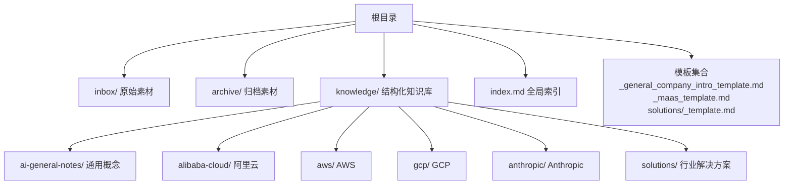
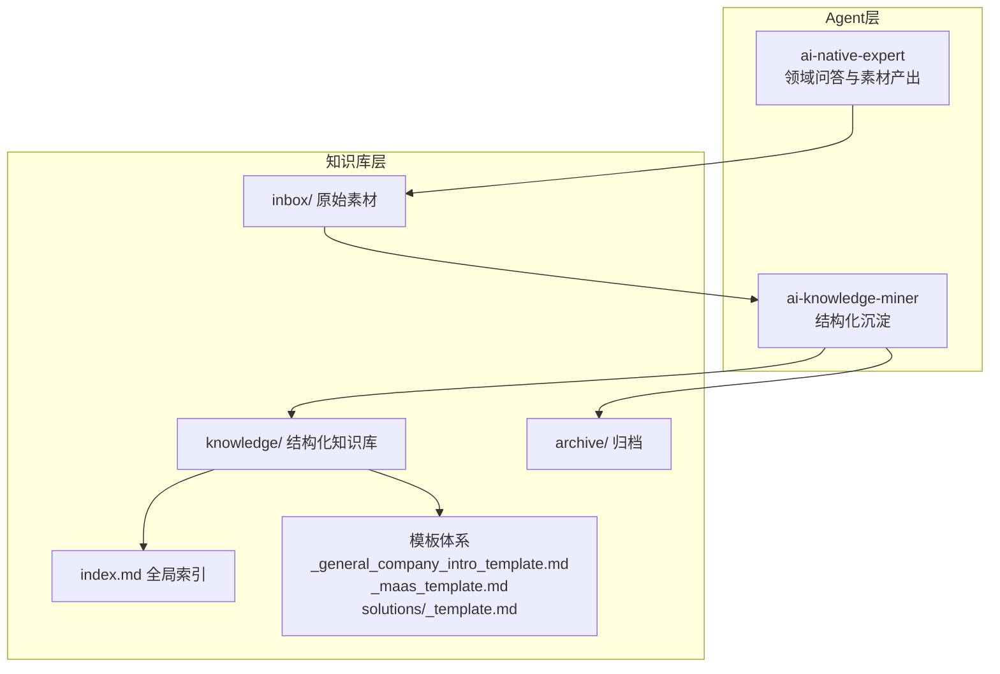
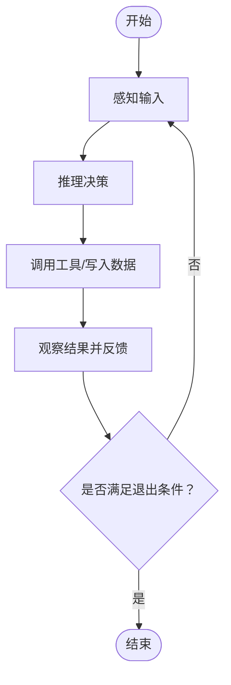
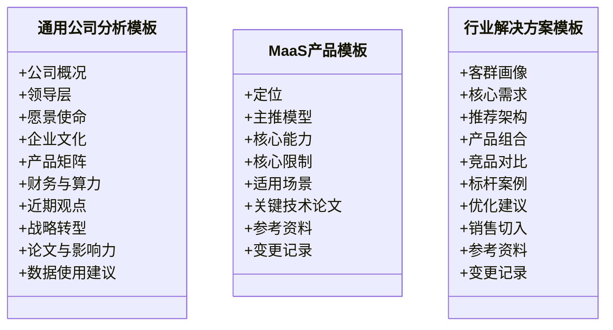
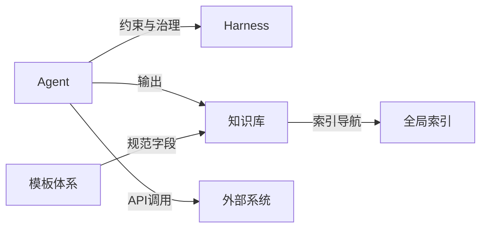

# 扩展与定制

<cite>
**本文引用的文件**   
- [README.md](file://README.md)
- [index.md](file://index.md)
- [_general_company_intro_template.md](file://knowledge/_general_company_intro_template.md)
- [_maas_template.md](file://knowledge/_maas_template.md)
- [_template.md](file://knowledge/solutions/_template.md)
- [agent-def.md](file://knowledge/ai-general-notes/agent-def.md)
- [harness.md](file://knowledge/ai-general-notes/harness.md)
- [prompt-engineering.md](file://knowledge/ai-general-notes/prompt-engineering.md)
- [rag.md](file://knowledge/ai-general-notes/rag.md)
- [fine-tuning.md](file://knowledge/ai-general-notes/fine-tuning.md)
- [qoder.md](file://knowledge/alibaba-cloud/ai-coding/qoder.md)
- [gpu-product-line.md](file://knowledge/alibaba-cloud/ai-infra/gpu-product-line.md)
</cite>

## 目录
1. [简介](#简介)
2. [项目结构](#项目结构)
3. [核心组件](#核心组件)
4. [架构总览](#架构总览)
5. [详细组件分析](#详细组件分析)
6. [依赖分析](#依赖分析)
7. [性能考虑](#性能考虑)
8. [故障排查指南](#故障排查指南)
9. [结论](#结论)
10. [附录](#附录)

## 简介
本指南面向希望扩展与定制AI知识库的工程师与产品人员，系统阐述知识沉淀与整理的两条Agent路径、知识库的目录结构与索引机制、模板体系与定制化开发方法，以及面向不同场景的扩展思路。文档同时提供插件化扩展的落地建议、部署与配置要点、性能与安全最佳实践，以及工具链与调试方法，帮助读者在不侵入核心流程的前提下，实现知识领域的新增、Agent能力的扩展与模板的定制开发。

## 项目结构
该项目采用“领域/厂商/产品”三层目录组织知识资产，辅以全局索引与模板体系，形成可扩展的知识沉淀与检索框架：
- inbox：原始素材入口，由知识矿工Agent进行脱敏与结构化处理
- archive：归档目录，保留历史素材
- knowledge：结构化知识库，按领域/厂商/产品维度组织，包含通用概念、产品分析、对比分析、行业解决方案等
- index：全局索引，提供跨域导航与模板参考

**图表来源**
- [index.md:1-69](file://index.md#L1-L69)
- [README.md:13-18](file://README.md#L13-L18)

**章节来源**
- [README.md:1-20](file://README.md#L1-L20)
- [index.md:1-69](file://index.md#L1-L69)

## 核心组件
- 知识矿工Agent（ai-knowledge-miner）：负责从inbox提取素材，生成脱敏、结构化的知识文档，写入knowledge对应目录
- AI Native专家Agent（ai-native-expert）：聚焦MaaS与AI Coding，提供模型能力、选型、API问题解答与竞品分析，并产出新的inbox素材
- 知识库索引与模板体系：通过全局索引与模板，规范知识表达与复用，支撑扩展与定制

**章节来源**
- [README.md:5-12](file://README.md#L5-L12)
- [index.md:62-69](file://index.md#L62-L69)

## 架构总览
知识库的扩展与定制围绕“素材采集—结构化沉淀—模板化复用—索引导航”的闭环展开。Agent负责自动化采集与沉淀，模板体系确保知识表达一致性，索引提供跨域检索与导航。

**图表来源**
- [README.md:5-12](file://README.md#L5-L12)
- [index.md:1-69](file://index.md#L1-L69)

## 详细组件分析

### Agent扩展与定制
- Agent本质是“感知-推理-行动-观察”的循环系统，Harness提供约束与治理，决定Agent能做什么、不能做什么、何时需要人工介入
- 扩展要点
  - 明确任务边界与退出条件，避免无限循环
  - 为工具调用设计幂等性与失败重试策略
  - 在长循环中实施上下文压缩与可观测性
  - 为关键步骤设置人工介入点（HITL）

**图表来源**
- [agent-def.md:60-68](file://knowledge/ai-general-notes/agent-def.md#L60-L68)

**章节来源**
- [agent-def.md:13-128](file://knowledge/ai-general-notes/agent-def.md#L13-L128)
- [harness.md:13-108](file://knowledge/ai-general-notes/harness.md#L13-L108)

### 模板定制开发
- 通用公司分析模板：提供公司概况、领导层、愿景使命、企业文化、产品矩阵、财务与算力规划、近期观点、战略转型、论文与影响力等标准化字段
- MaaS产品模板：标准化模型定位、主推系列、核心能力与限制、适用场景、关键技术论文与参考资料
- 行业解决方案模板：客群画像、核心需求、推荐架构、产品组合、竞品对比、标杆案例、优化建议、销售切入、参考资料与变更记录

**图表来源**
- [_general_company_intro_template.md:1-234](file://knowledge/_general_company_intro_template.md#L1-L234)
- [_maas_template.md:1-65](file://knowledge/_maas_template.md#L1-L65)
- [_template.md:1-108](file://knowledge/solutions/_template.md#L1-L108)

**章节来源**
- [_general_company_intro_template.md:1-234](file://knowledge/_general_company_intro_template.md#L1-L234)
- [_maas_template.md:1-65](file://knowledge/_maas_template.md#L1-L65)
- [_template.md:1-108](file://knowledge/solutions/_template.md#L1-L108)

### 插件架构与集成接口（扩展建议）
- 工具与API集成
  - 通过Harness定义工具白名单与参数校验，确保Agent只能调用授权API
  - 使用凭证隔离机制，避免Agent直接持有生产密钥
  - 为关键API调用设计重试、熔断与降级策略
- 数据交换
  - 与外部系统对接时，统一数据格式与版本控制，提供幂等写入与回滚能力
  - 在Agent行动前后记录可观测性日志，便于审计与排障
- 扩展点
  - 新增知识领域：在knowledge下新增领域/厂商目录，遵循现有模板字段
  - 新增Agent能力：在Harness中扩展工具权限与业务规则，配套HITL与审计
  - 新增模板：在模板集合中新增领域专属模板，保持与全局索引一致的命名与导航

**章节来源**
- [harness.md:17-47](file://knowledge/ai-general-notes/harness.md#L17-L47)
- [agent-def.md:60-68](file://knowledge/ai-general-notes/agent-def.md#L60-L68)

### 部署架构与配置选项（扩展建议）
- 环境配置
  - 为Agent运行环境划分网络与访问控制，结合SSO与RBAC实现最小权限
  - 为不同厂商与产品配置独立的API网关与路由规则
- 性能调优
  - 在长循环中实施上下文压缩与分页检索，避免上下文溢出
  - 对高频API调用引入缓存与批量处理，降低延迟与成本
- 安全设置
  - 强制审计与不可变日志，关键操作必须具备可追溯性
  - 严格凭证管理，使用令牌代理与Vault机制隔离真实密钥

**章节来源**
- [harness.md:37-47](file://knowledge/ai-general-notes/harness.md#L37-L47)
- [gpu-product-line.md:16-53](file://knowledge/alibaba-cloud/ai-infra/gpu-product-line.md#L16-L53)

### 功能定制与界面适配（扩展建议）
- 界面适配
  - 以模板字段为核心，构建可配置的渲染引擎，支持不同厂商与领域的展示差异
  - 通过全局索引与导航菜单，实现跨域知识的快速跳转与对比
- 功能定制
  - 针对不同客群（如企业、开发者、分析师）定制摘要与优先级
  - 在Agent流程中嵌入领域规则与合规检查，确保输出符合监管要求

**章节来源**
- [index.md:1-69](file://index.md#L1-L69)
- [prompt-engineering.md:96-106](file://knowledge/ai-general-notes/prompt-engineering.md#L96-L106)

### 工具链与调试方法（扩展建议）
- 工具链
  - 使用版本化模板与索引，确保知识资产的可追溯与可复用
  - 为Agent行动建立可观测性仪表盘，记录每步感知、推理、行动与观察
- 调试方法
  - 在关键节点设置人工确认门（HITL），便于快速定位问题
  - 对API调用与工具使用进行日志归档与回放，支持离线复盘

**章节来源**
- [agent-def.md:101-107](file://knowledge/ai-general-notes/agent-def.md#L101-L107)
- [harness.md:69-78](file://knowledge/ai-general-notes/harness.md#L69-L78)

### 定制化应用案例（扩展建议）
- AI Infra选型：结合ECS GPU、灵骏与PAI的适用边界，为不同规模与网络需求选择最优算力形态
- AI Coding：以Qoder为例，明确定位与适用场景，指导开发者在不同任务中选择合适工具
- 竞品对比：基于模板字段，系统化比较不同厂商在MaaS与AI Coding上的能力与限制

**章节来源**
- [gpu-product-line.md:54-80](file://knowledge/alibaba-cloud/ai-infra/gpu-product-line.md#L54-L80)
- [qoder.md:1-9](file://knowledge/alibaba-cloud/ai-coding/qoder.md#L1-L9)

## 依赖分析
- Agent与Harness的耦合：Harness为Agent提供硬约束与可观测性，二者共同决定Agent的可用性与可靠性
- 模板与知识库的耦合：模板字段驱动知识表达一致性，索引依赖模板结构实现跨域导航
- 外部系统依赖：API调用与凭证管理依赖外部厂商SDK与密钥服务

**图表来源**
- [agent-def.md:31-39](file://knowledge/ai-general-notes/agent-def.md#L31-L39)
- [harness.md:17-23](file://knowledge/ai-general-notes/harness.md#L17-L23)
- [index.md:1-69](file://index.md#L1-69)

**章节来源**
- [agent-def.md:31-39](file://knowledge/ai-general-notes/agent-def.md#L31-L39)
- [harness.md:17-23](file://knowledge/ai-general-notes/harness.md#L17-L23)
- [index.md:1-69](file://index.md#L1-69)

## 性能考虑
- 上下文管理：在长循环中实施上下文压缩与摘要策略，避免Token超限与延迟上升
- 调用优化：对外部API引入批量与缓存策略，减少重复请求与网络抖动
- 规则与审计：在实现功能前先搭建审计基础设施，避免后期补丁带来的性能损耗

**章节来源**
- [agent-def.md:105](file://knowledge/ai-general-notes/agent-def.md#L105)
- [harness.md:77](file://knowledge/ai-general-notes/harness.md#L77)

## 故障排查指南
- 常见误区
  - 将“更好的Prompt”等同于Harness，忽视系统层面的硬约束
  - 认为通用Harness可复用，忽略行业特异性
  - 低估强模型失控风险，未配套Harness
- 排障步骤
  - 检查工具权限与参数校验，确认调用链路
  - 核对审计日志与可观测性记录，定位异常步骤
  - 在关键节点启用HITL，阻断潜在风险

**章节来源**
- [harness.md:90-97](file://knowledge/ai-general-notes/harness.md#L90-L97)
- [agent-def.md:108-116](file://knowledge/ai-general-notes/agent-def.md#L108-L116)

## 结论
通过Agent与Harness的工程化设计、模板化的知识表达与全局索引导航，本知识库形成了可扩展、可定制的知识沉淀与复用体系。扩展时应优先完善Harness的工具边界与审计能力，严格遵循模板字段，结合外部系统API与凭证隔离机制，确保在不同场景下实现稳定、合规、可追溯的知识交付。

## 附录
- 术语
  - Agent：围绕LLM构建的自主执行系统
  - Harness：Agent的约束与治理层
  - HITL：人工介入点
  - RAG：检索增强生成
  - 四层Prompt机制：边界约束、溯源要求、置信度校准、对抗验证
- 参考资料
  - 全局索引与模板参考：见index与模板文件
  - 通用概念与产品分析：见ai-general-notes与各厂商目录

**章节来源**
- [index.md:62-69](file://index.md#L62-L69)
- [prompt-engineering.md:171-187](file://knowledge/ai-general-notes/prompt-engineering.md#L171-L187)
- [rag.md:1-42](file://knowledge/ai-general-notes/rag.md#L1-L42)
- [fine-tuning.md:1-42](file://knowledge/ai-general-notes/fine-tuning.md#L1-L42)