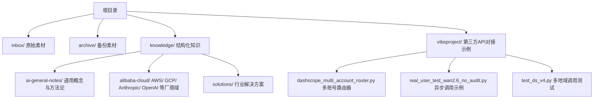
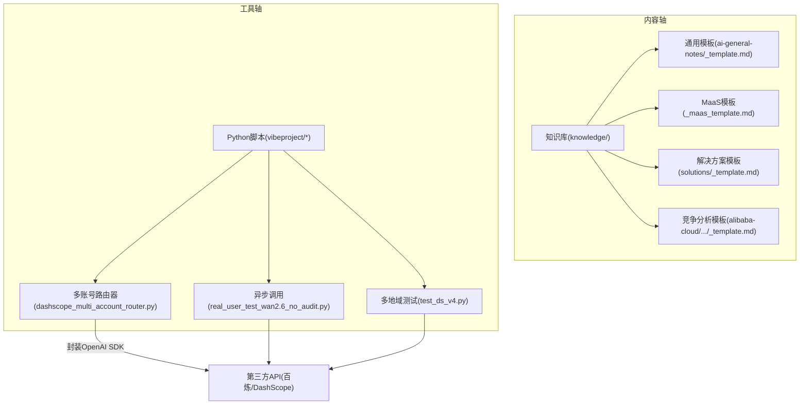
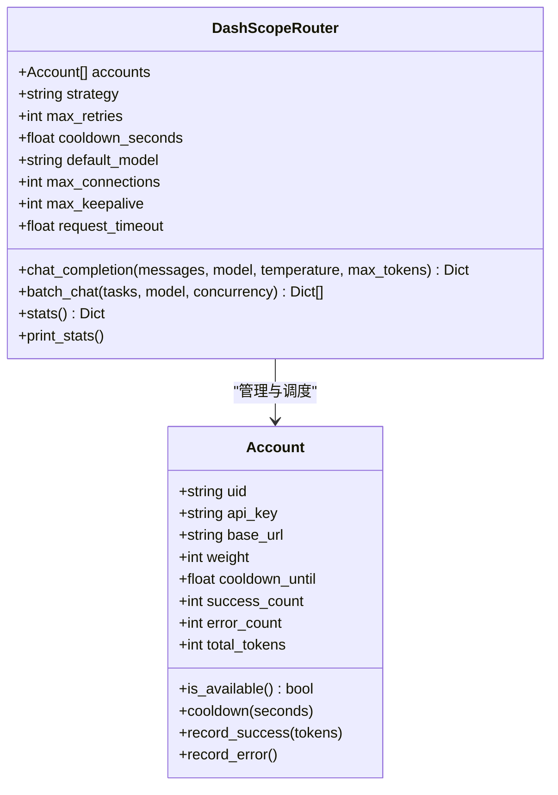
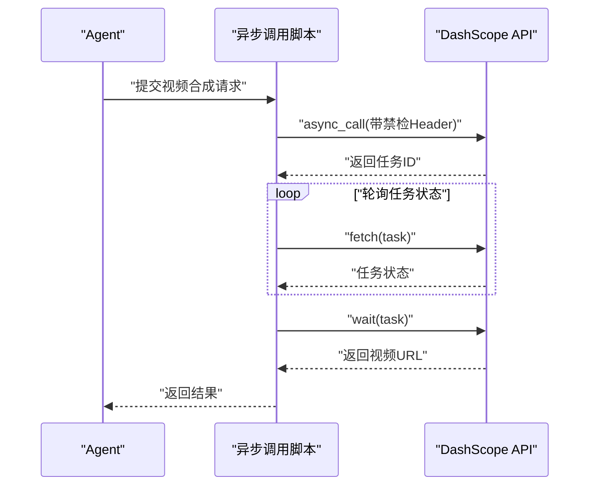
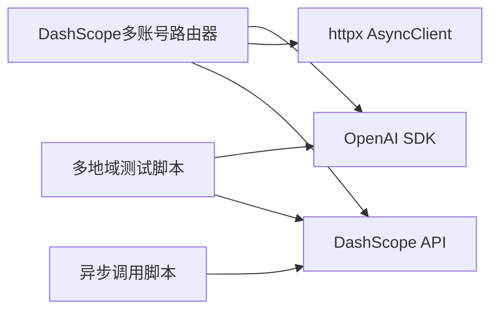

# 系统扩展指南

<cite>
**本文引用的文件**
- [README.md](file://README.md)
- [dashscope_multi_account_router.py](file://vibeproject/dashscope_multi_account_router.py)
- [real_user_test_wan2.6_no_audit.py](file://vibeproject/real_user_test_wan2.6_no_audit.py)
- [_maas_template.md](file://knowledge/_maas_template.md)
- [test_ds_v4.py](file://vibeproject/test_ds_v4.py)
- [ai-general-notes/_template.md](file://knowledge/ai-general-notes/_template.md)
</cite>

## 更新摘要
**变更内容**
- 新增多账号路由器核心组件，实现完整的多账户路由系统
- 添加负载均衡算法（加权轮询、最少负载、随机策略）
- 实现限流熔断机制与指数退避重试
- 集成异步并发控制与连接池管理
- 扩展工具链以支持高并发API调用场景

## 目录
1. [简介](#简介)
2. [项目结构](#项目结构)
3. [核心组件](#核心组件)
4. [架构总览](#架构总览)
5. [详细组件分析](#详细组件分析)
6. [依赖分析](#依赖分析)
7. [性能考虑](#性能考虑)
8. [故障排查指南](#故障排查指南)
9. [结论](#结论)
10. [附录](#附录)

## 简介
本指南面向希望扩展AI知识库系统的工程师与内容运营人员，系统讲解如何新增知识领域、扩展Agent能力、定制模板与完善知识分类体系。文档覆盖插件架构与扩展点、新增AI厂商支持、新增知识领域与Agent类型的流程与最佳实践，并提供工具链、调试方法与性能优化建议。

**更新** 新增多账号路由器作为核心扩展组件，提供完整的多账户路由、负载均衡、限流熔断和异步并发控制功能。

## 项目结构
知识库采用"内容即代码"的结构化组织方式，核心目录如下：
- inbox：原始素材存放区
- archive：原始素材备份区
- knowledge：结构化知识文档，按领域/厂商/主题分层组织
- vibeproject：与第三方API对接的示例与工具脚本（如多账号路由、异步调用）



**图表来源**
- [README.md:13-18](file://README.md#L13-L18)
- [dashscope_multi_account_router.py:1-41](file://vibeproject/dashscope_multi_account_router.py#L1-L41)

**章节来源**
- [README.md:1-20](file://README.md#L1-L20)

## 核心组件
- Agent职责
  - ai-knowledge-miner：从inbox提炼为脱敏、结构化的知识文档，写入knowledge对应目录
  - ai-native-expert：聚焦MaaS与AI Coding，提供模型能力、选型、API问题解答与竞品分析，并产出inbox素材
- 知识分类体系
  - 通用概念（ai-general-notes）
  - 厂商域（alibaba-cloud、aws、gcp、anthropic等）
  - 行业解决方案（solutions）
  - 竞争分析（各厂商域下的竞争分析专题）
- 模板体系
  - 通用笔记模板、MaaS产品模板、行业解决方案模板、竞争分析模板等，确保知识结构一致、便于检索与复用
- **新增** 多账号路由器（DashScopeRouter）
  - 提供多账号轮询/加权调度、429限流自动熔断与恢复、指数退避重试
  - 支持异步并发安全、实时用量统计、连接池管理

**章节来源**
- [README.md:5-12](file://README.md#L5-L12)

## 架构总览
系统采用"内容驱动 + 工具脚本"双轴架构：
- 内容轴：知识库文档遵循统一模板与分类，形成可检索的知识图谱
- 工具轴：通过Python脚本对接第三方API（如DashScope），实现多账号路由、异步调用、限流熔断与统计



**图表来源**
- [dashscope_multi_account_router.py:103-123](file://vibeproject/dashscope_multi_account_router.py#L103-L123)
- [real_user_test_wan2.6_no_audit.py:1-105](file://vibeproject/real_user_test_wan2.6_no_audit.py#L1-L105)
- [test_ds_v4.py:1-102](file://vibeproject/test_ds_v4.py#L1-L102)

## 详细组件分析

### 组件A：DashScope 多账号路由器
**更新** 新增核心组件，提供完整的多账户路由系统

- 功能特性
  - 多账号轮询/加权调度、最少负载选择、随机策略
  - 429限流自动熔断与恢复、指数退避重试
  - 异步并发安全、实时用量统计、连接池管理
  - 支持高并发批量调用与信号量控制
- 关键扩展点
  - 账号配置：通过环境变量批量加载
  - 调度策略：可扩展新策略（如按延迟、成功率等）
  - 返回格式：统一输出结构，便于上层Agent消费
  - 连接管理：支持自定义连接池大小与超时配置
- 使用建议
  - 为每个地域/账号设置权重，平衡吞吐与成本
  - 在Agent中统一调用该路由器，屏蔽多账号细节
  - 配置合适的并发度，避免触发限流



**图表来源**
- [dashscope_multi_account_router.py:69-98](file://vibeproject/dashscope_multi_account_router.py#L69-L98)
- [dashscope_multi_account_router.py:103-159](file://vibeproject/dashscope_multi_account_router.py#L103-L159)

**章节来源**
- [dashscope_multi_account_router.py:1-551](file://vibeproject/dashscope_multi_account_router.py#L1-L551)

### 组件B：异步调用与任务轮询（Wan 视频合成）
- 功能特性
  - 异步提交任务、轮询任务状态、等待完成、提取结果
  - 支持关闭内容安全检测的Header配置
- 扩展建议
  - 将轮询与等待封装为通用工具函数，供Agent在调用长耗时API时复用
  - 将Header与Base URL抽象为配置项，便于切换地域与开关



**图表来源**
- [real_user_test_wan2.6_no_audit.py:31-101](file://vibeproject/real_user_test_wan2.6_no_audit.py#L31-L101)

**章节来源**
- [real_user_test_wan2.6_no_audit.py:1-105](file://vibeproject/real_user_test_wan2.6_no_audit.py#L1-L105)

### 组件C：多地域调用测试（DeepSeek）
- 功能特性
  - 针对不同地域与模型的调用测试，记录Token使用
  - 支持流式输出与Usage统计
- 扩展建议
  - 将测试脚本改造为可配置的批量测试工具，支持不同模型/地域/并发度
  - 输出标准化报告，便于限流与成本评估

**章节来源**
- [test_ds_v4.py:1-102](file://vibeproject/test_ds_v4.py#L1-L102)

### 组件D：知识模板体系
- 通用模板（ai-general-notes/_template.md）
  - 适用于技术概念类与概念洞察类知识，提供"是什么/核心原理/关键选型维度/关键认知框架/最佳实践/常见误区/参考资料/变更日志"等结构化区块
- MaaS产品模板（_maas_template.md）
  - 适用于厂商模型/模型系列的标准化产品分析，包含定位、适用场景、核心能力与限制、关键技术论文、参考资料等
- 行业解决方案模板（solutions/_template.md）
  - 适用于面向垂直行业的解决方案，包含客群画像、核心需求、推荐架构、产品组合、竞品对比、标杆案例、优化建议、销售切入等
- 竞争分析模板（alibaba-cloud/competitive-analysis/_template.md）
  - 适用于厂商间对比分析，包含概览对比、核心产品矩阵对比、生态与合规、定价策略差异、客户案例对比、销售建议等

**章节来源**
- [_maas_template.md:1-65](file://knowledge/_maas_template.md#L1-L65)
- [ai-general-notes/_template.md:1-75](file://knowledge/ai-general-notes/_template.md#L1-L75)

## 依赖分析
- 组件耦合
  - DashScope多账号路由器与第三方API（OpenAI兼容端点）耦合，通过统一的AsyncOpenAI客户端进行调用
  - 异步调用脚本与视频合成API耦合，依赖HTTP状态码与任务状态轮询
  - 多地域测试脚本与OpenAI SDK耦合，用于流式输出与Usage统计
- 外部依赖
  - openai SDK、httpx、环境变量配置、HTTP状态码处理
- 潜在风险
  - 限流与熔断策略需与业务SLA匹配
  - 任务轮询的超时与重试策略需避免资源泄露
  - 连接池配置不当可能导致内存泄漏



**图表来源**
- [dashscope_multi_account_router.py:52-53](file://vibeproject/dashscope_multi_account_router.py#L52-L53)
- [real_user_test_wan2.6_no_audit.py:4-5](file://vibeproject/real_user_test_wan2.6_no_audit.py#L4-L5)
- [test_ds_v4.py:42](file://vibeproject/test_ds_v4.py#L42)

**章节来源**
- [dashscope_multi_account_router.py:1-551](file://vibeproject/dashscope_multi_account_router.py#L1-L551)
- [real_user_test_wan2.6_no_audit.py:1-105](file://vibeproject/real_user_test_wan2.6_no_audit.py#L1-L105)
- [test_ds_v4.py:1-102](file://vibeproject/test_ds_v4.py#L1-L102)

## 性能考虑
- 并发与限流
  - 使用异步并发与信号量控制最大并发，避免瞬时打满账号配额
  - 针对429限流进行熔断与快速切换，减少重试等待
  - 支持连接池复用，减少TCP握手开销
- 统计与可观测性
  - 记录全局请求/错误数与各账号成功/失败/Tokens统计，便于容量规划与成本归因
  - 提供实时统计接口，支持监控与告警
- 调用路径优化
  - 将常用参数（模型、温度、最大tokens）抽取为默认配置，减少重复传参
  - 支持批量并发调用，提高吞吐量
- 流式输出与Usage
  - 在支持流式的模型上调用时，启用stream与include_usage，降低首字节延迟并准确统计Token
- **新增** 连接池管理
  - 自定义最大连接数与保活连接数，优化资源利用率
  - 支持超时配置，避免连接泄漏

**章节来源**
- [dashscope_multi_account_router.py:139-159](file://vibeproject/dashscope_multi_account_router.py#L139-L159)
- [dashscope_multi_account_router.py:347-381](file://vibeproject/dashscope_multi_account_router.py#L347-L381)

## 故障排查指南
- 多账号全部冷却
  - 现象：所有账号处于冷却期，触发指数退避重试
  - 处理：检查限流阈值与冷却时间，适当提高权重或扩容账号
- 429限流
  - 现象：APIStatusError 429，触发熔断
  - 处理：立即切换其他账号，必要时降低并发或调整策略
- 任务轮询卡住
  - 现象：fetch返回非OK或状态长时间为RUNNING
  - 处理：检查任务ID、Header配置与地域端点，设置最大轮询次数与超时
- 环境变量缺失
  - 现象：加载账号配置时报错
  - 处理：确保按约定设置DASHSCOPE_ACCOUNT_{N}_KEY、BASE_URL、WEIGHT等环境变量
- **新增** 连接池问题
  - 现象：连接泄漏或内存不足
  - 处理：检查连接池配置，确保正确关闭AsyncOpenAI客户端
- **新增** 调度策略失效
  - 现象：账号选择不均匀或性能不佳
  - 处理：尝试不同的调度策略（weighted_round_robin/least_loaded/random）

**章节来源**
- [dashscope_multi_account_router.py:284-320](file://vibeproject/dashscope_multi_account_router.py#L284-L320)
- [real_user_test_wan2.6_no_audit.py:55-97](file://vibeproject/real_user_test_wan2.6_no_audit.py#L55-L97)
- [dashscope_multi_account_router.py:384-419](file://vibeproject/dashscope_multi_account_router.py#L384-L419)

## 结论
通过统一的模板体系与工具脚本，系统实现了"内容标准化 + 工具自动化"的扩展能力。新增知识领域与Agent类型的关键在于：规范模板、完善分类、抽象API调用、统一调度与统计。**更新** 新增多账号路由器作为核心扩展组件，提供了完整的多账户路由、负载均衡、限流熔断和异步并发控制功能，显著提升了系统的可扩展性和稳定性。建议在扩展过程中坚持"先模板、后实现、再测试"的流程，确保知识库的一致性与可维护性。

## 附录

### 扩展Agent类型与功能的流程与最佳实践
- 新增Agent类型
  - 明确Agent职责边界（如MaaS选型、竞品分析、行业落地）
  - 设计对话流程与工具链（如调用多账号路由器、拉取API数据）
  - 在Agent中集成模板渲染与知识入库逻辑
- 模板定制开发
  - 优先复用现有模板，按需裁剪区块
  - 保持字段一致性，便于检索与交叉引用
- 知识分类体系扩展
  - 新增厂商域：在knowledge下新建目录，沿用厂商域模板
  - 新增行业解决方案：使用solutions模板，补充客群画像与架构
  - 新增通用概念：使用ai-general-notes模板，沉淀方法论与认知框架

**章节来源**
- [README.md:5-12](file://README.md#L5-L12)

### 新增AI厂商支持的步骤
- 厂商域目录结构
  - 在knowledge下新增厂商目录（如newcloud/），按MaaS/AI Coding/AI App/AI Platform/AI Infra/competitive-analysis等子目录组织
- 模板与索引
  - 使用_MaaS模板与_solutions模板撰写厂商产品与方案
  - 在全局索引index.md中新增厂商入口与导航
- API集成
  - 若厂商API与OpenAI兼容，可复用DashScope多账号路由器
  - 若不兼容，抽象统一的客户端接口，保持Agent调用一致
- **新增** 多账号支持
  - 配置多个API密钥与基础URL
  - 设置权重分配策略
  - 集成限流熔断与重试机制

**章节来源**
- [README.md:13-18](file://README.md#L13-L18)
- [_maas_template.md:1-65](file://knowledge/_maas_template.md#L1-L65)

### 新增知识领域的步骤
- 选择模板
  - 通用概念：ai-general-notes/_template.md
  - 产品分析：_maas_template.md
  - 行业方案：solutions/_template.md
  - 竞争分析：各厂商域下的_competitive-analysis/_template.md
- 内容结构
  - 按模板区块填充，确保"一句话说明/核心原理/关键选型/最佳实践/常见误区/参考资料/变更日志"
- 索引导航
  - 在index.md中新增条目，指向新文档

**章节来源**
- [ai-general-notes/_template.md:1-75](file://knowledge/ai-general-notes/_template.md#L1-L75)
- [_maas_template.md:1-65](file://knowledge/_maas_template.md#L1-L65)

### 工具链、调试与性能优化建议
- 工具链
  - Python脚本：多账号路由、异步调用、多地域测试
  - 环境变量：账号密钥、基础URL、权重
- 调试方法
  - 打印统计信息（全局请求/错误、各账号成功/失败/Tokens）
  - 任务轮询设置最大次数与超时，避免死循环
  - 对比不同策略（加权轮询/最少负载/随机）的效果
  - **新增** 使用Dry Run模式验证路由逻辑
- 性能优化
  - 控制并发度，避免触发限流
  - 合理设置冷却时间与重试间隔
  - 使用流式输出与Usage统计，降低延迟并准确计费
  - **新增** 配置连接池参数，优化资源利用率

**章节来源**
- [dashscope_multi_account_router.py:463-543](file://vibeproject/dashscope_multi_account_router.py#L463-L543)
- [real_user_test_wan2.6_no_audit.py:59-97](file://vibeproject/real_user_test_wan2.6_no_audit.py#L59-L97)
- [test_ds_v4.py:58-86](file://vibeproject/test_ds_v4.py#L58-L86)

### 多账号路由器使用指南
- **配置环境变量**
  ```bash
  export DASHSCOPE_ACCOUNT_1_KEY=sk-xxx
  export DASHSCOPE_ACCOUNT_1_BASE_URL=https://dashscope-intl.aliyuncs.com/compatible-mode/v1
  export DASHSCOPE_ACCOUNT_1_WEIGHT=1
  
  export DASHSCOPE_ACCOUNT_2_KEY=sk-yyy
  export DASHSCOPE_ACCOUNT_2_BASE_URL=https://dashscope-intl.aliyuncs.com/compatible-mode/v1
  export DASHSCOPE_ACCOUNT_2_WEIGHT=1
  ```
- **基本调用示例**
  ```python
  router = DashScopeRouter(accounts=accounts, strategy="weighted_round_robin")
  result = await router.chat_completion(
      messages=[{"role": "user", "content": "你好"}],
      model="qwen-plus"
  )
  ```
- **批量并发调用**
  ```python
  results = await router.batch_chat(
      tasks=messages_list,
      model="qwen-plus",
      concurrency=10
  )
  ```

**章节来源**
- [dashscope_multi_account_router.py:387-419](file://vibeproject/dashscope_multi_account_router.py#L387-L419)
- [dashscope_multi_account_router.py:205-320](file://vibeproject/dashscope_multi_account_router.py#L205-L320)
- [dashscope_multi_account_router.py:324-344](file://vibeproject/dashscope_multi_account_router.py#L324-L344)