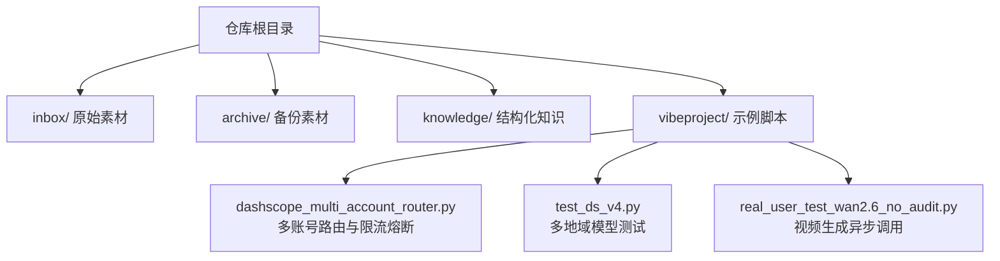
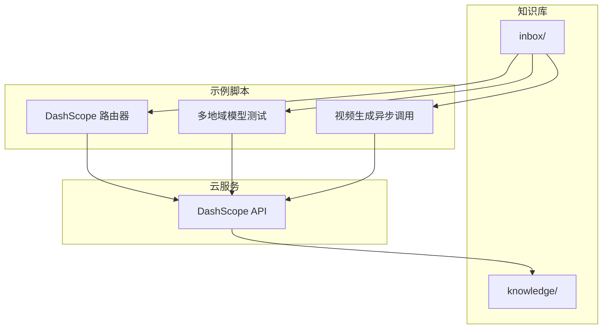
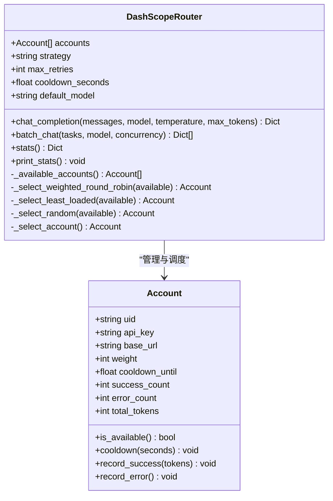
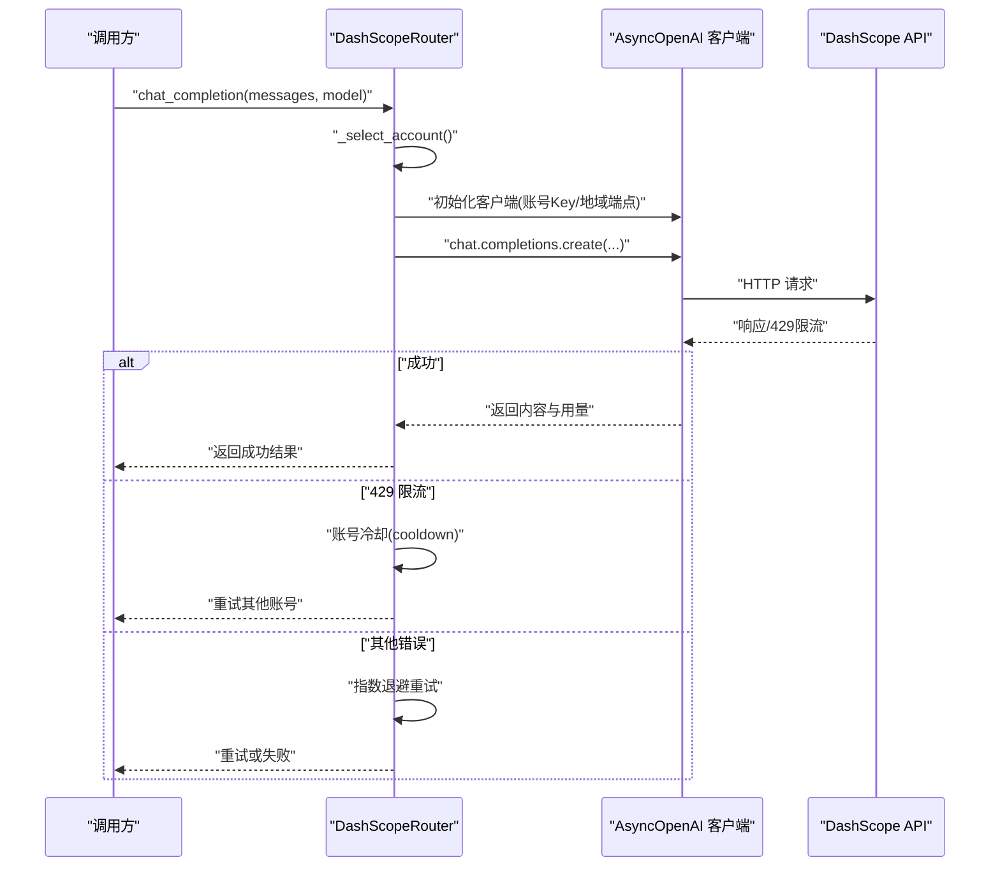
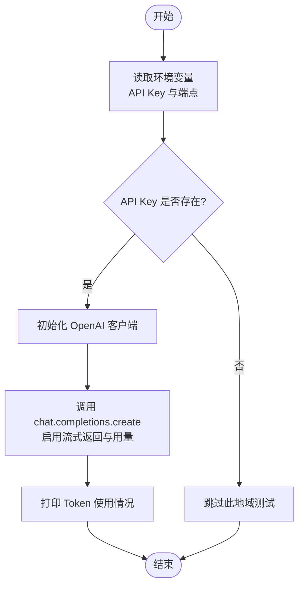
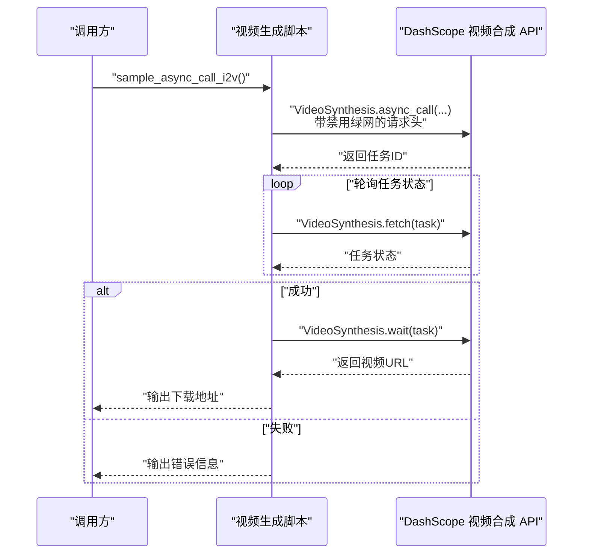
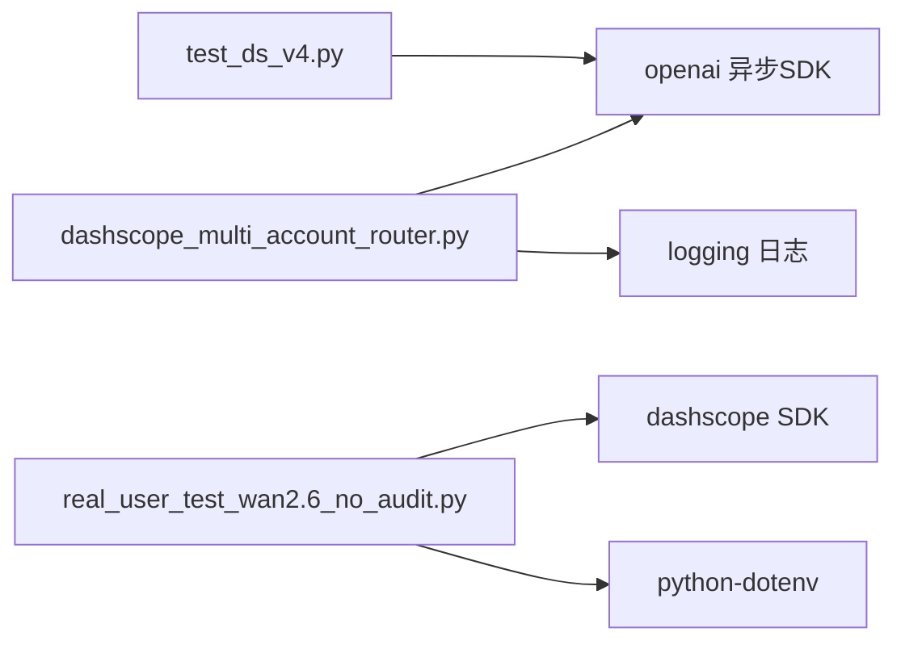

# 集成与部署

<cite>
**本文引用的文件**
- [README.md](file://README.md)
- [index.md](file://index.md)
- [real_user_test_wan2.6_no_audit.py](file://vibeproject/real_user_test_wan2.6_no_audit.py)
- [test_ds_v4.py](file://vibeproject/test_ds_v4.py)
- [dashscope_multi_account_router.py](file://vibeproject/dashscope_multi_account_router.py)
</cite>

## 目录
1. [简介](#简介)
2. [项目结构](#项目结构)
3. [核心组件](#核心组件)
4. [架构总览](#架构总览)
5. [详细组件分析](#详细组件分析)
6. [依赖分析](#依赖分析)
7. [性能考虑](#性能考虑)
8. [故障排除指南](#故障排除指南)
9. [结论](#结论)
10. [附录](#附录)

## 简介
本指南面向AI知识库的集成与部署，围绕仓库内的知识组织结构与示例脚本，系统阐述以下主题：
- 系统部署架构与配置要点：环境准备、依赖安装、配置文件设置
- 外部系统集成接口：云服务API对接（以百炼 DashScope 为例）、第三方平台集成与数据交换协议
- 完整部署流程与配置示例：本地开发环境、Docker容器化与Kubernetes集群部署思路
- 性能调优策略、安全配置与监控设置
- 故障排除、备份恢复与升级迁移策略
- 不同部署场景的最佳实践与配置模板

本知识库以“inbox/”原始素材与“knowledge/”结构化知识为核心，结合示例脚本展示与云服务的对接方式，帮助读者快速落地集成与部署。

**章节来源**
- [README.md:1-20](file://README.md#L1-L20)

## 项目结构
仓库采用“知识组织 + 示例脚本”的结构：
- 根目录包含知识库索引与说明文件
- knowledge/ 下按厂商与领域组织结构化知识
- inbox/ 与 archive/ 分别用于存放原始素材与备份
- vibeproject/ 包含与云服务对接的示例脚本，涵盖异步调用、多账号路由与限流熔断等

**图表来源**
- [README.md:13-17](file://README.md#L13-L17)
- [index.md:1-69](file://index.md#L1-L69)
- [dashscope_multi_account_router.py:1-436](file://vibeproject/dashscope_multi_account_router.py#L1-L436)
- [test_ds_v4.py:1-102](file://vibeproject/test_ds_v4.py#L1-L102)
- [real_user_test_wan2.6_no_audit.py:1-105](file://vibeproject/real_user_test_wan2.6_no_audit.py#L1-L105)

**章节来源**
- [README.md:13-17](file://README.md#L13-L17)
- [index.md:1-69](file://index.md#L1-L69)

## 核心组件
- 知识组织与索引
  - 知识库索引文件提供全局导航，覆盖跨厂商AI概念、单产品知识、对比分析与行业解决方案
  - 知识沉淀遵循“提炼/沉淀/处理 inbox”与“专家问答产出素材”的双Agent模式
- 示例脚本与云服务对接
  - 多账号路由与限流熔断：实现按权重轮询、最少负载与随机策略，自动处理429限流与指数退避重试
  - 多地域模型测试：演示按地域切换端点与API Key的调用流程
  - 异步视频生成：展示异步提交、轮询任务状态与获取结果的完整流程

**章节来源**
- [index.md:1-69](file://index.md#L1-L69)
- [README.md:5-11](file://README.md#L5-L11)
- [dashscope_multi_account_router.py:1-436](file://vibeproject/dashscope_multi_account_router.py#L1-L436)
- [test_ds_v4.py:1-102](file://vibeproject/test_ds_v4.py#L1-L102)
- [real_user_test_wan2.6_no_audit.py:1-105](file://vibeproject/real_user_test_wan2.6_no_audit.py#L1-L105)

## 架构总览
下图展示了知识库与外部云服务的集成关系：知识沉淀与专家问答产生素材，素材经由示例脚本对接云服务API，实现异步任务、多账号调度与限流熔断，最终回填至知识库或用于进一步处理。

**图表来源**
- [README.md:15-17](file://README.md#L15-L17)
- [dashscope_multi_account_router.py:93-294](file://vibeproject/dashscope_multi_account_router.py#L93-L294)
- [test_ds_v4.py:45-87](file://vibeproject/test_ds_v4.py#L45-L87)
- [real_user_test_wan2.6_no_audit.py:31-96](file://vibeproject/real_user_test_wan2.6_no_audit.py#L31-L96)

## 详细组件分析

### 多账号路由与限流熔断组件
该组件提供多账号轮询/加权调度、429限流自动熔断、指数退避重试、异步并发安全与实时用量统计，适用于高并发与多地域的API调用场景。

**图表来源**
- [dashscope_multi_account_router.py:59-88](file://vibeproject/dashscope_multi_account_router.py#L59-L88)
- [dashscope_multi_account_router.py:93-172](file://vibeproject/dashscope_multi_account_router.py#L93-L172)

**图表来源**
- [dashscope_multi_account_router.py:175-294](file://vibeproject/dashscope_multi_account_router.py#L175-L294)

**章节来源**
- [dashscope_multi_account_router.py:1-436](file://vibeproject/dashscope_multi_account_router.py#L1-L436)

### 多地域模型测试组件
该组件演示如何根据地域切换端点与API Key，进行模型兼容模式的调用，并输出Token使用情况。

**图表来源**
- [test_ds_v4.py:45-87](file://vibeproject/test_ds_v4.py#L45-L87)

**章节来源**
- [test_ds_v4.py:1-102](file://vibeproject/test_ds_v4.py#L1-L102)

### 异步视频生成组件
该组件演示图像到视频的异步调用流程：提交任务、轮询状态、获取结果，并支持关闭内容安全检测的请求头。

**图表来源**
- [real_user_test_wan2.6_no_audit.py:31-96](file://vibeproject/real_user_test_wan2.6_no_audit.py#L31-L96)

**章节来源**
- [real_user_test_wan2.6_no_audit.py:1-105](file://vibeproject/real_user_test_wan2.6_no_audit.py#L1-L105)

## 依赖分析
- 内部依赖
  - 示例脚本之间无直接依赖，均通过环境变量与云服务API交互
- 外部依赖
  - DashScope 多账号路由：依赖异步OpenAI SDK与日志模块
  - 多地域模型测试：依赖OpenAI SDK与环境变量
  - 异步视频生成：依赖DashScope SDK与dotenv加载环境变量

**图表来源**
- [dashscope_multi_account_router.py:43-53](file://vibeproject/dashscope_multi_account_router.py#L43-L53)
- [test_ds_v4.py:42-42](file://vibeproject/test_ds_v4.py#L42-L42)
- [real_user_test_wan2.6_no_audit.py:4-6](file://vibeproject/real_user_test_wan2.6_no_audit.py#L4-L6)

**章节来源**
- [dashscope_multi_account_router.py:24-32](file://vibeproject/dashscope_multi_account_router.py#L24-L32)
- [test_ds_v4.py:41-42](file://vibeproject/test_ds_v4.py#L41-L42)
- [real_user_test_wan2.6_no_audit.py:1-9](file://vibeproject/real_user_test_wan2.6_no_audit.py#L1-L9)

## 性能考虑
- 并发与限流
  - 使用多账号轮询与最少负载策略分散请求，降低单一账号限流风险
  - 429限流触发时进行冷却与熔断，避免雪崩效应
  - 指数退避重试减少对上游的压力峰值
- 调用路径优化
  - 按地域选择最优端点，减少网络往返与合规限制
  - 异步调用与轮询机制避免阻塞主线程
- 监控与可观测性
  - 记录全局请求/错误与各账号成功/失败/Token总量，便于容量规划与成本归集
  - 输出延迟与用量指标，支撑性能优化与计费审计

**章节来源**
- [dashscope_multi_account_router.py:93-172](file://vibeproject/dashscope_multi_account_router.py#L93-L172)
- [dashscope_multi_account_router.py:251-294](file://vibeproject/dashscope_multi_account_router.py#L251-L294)
- [test_ds_v4.py:5-11](file://vibeproject/test_ds_v4.py#L5-L11)

## 故障排除指南
- 环境变量缺失
  - 症状：脚本抛出“未设置环境变量”错误
  - 处理：确保按地域要求设置API Key与端点，参考示例脚本中的环境变量命名规范
- 429限流
  - 症状：出现429状态码，账号进入冷却期
  - 处理：等待冷却时间结束，或调整策略（如提高权重、切换账号），必要时申请临时提额
- 异步任务失败
  - 症状：任务状态为失败或超时
  - 处理：检查输入参数与提示词，确认禁用绿网的请求头是否正确传递，重新轮询或重试
- 并发过高导致抖动
  - 症状：请求成功率波动较大
  - 处理：降低并发数，启用最少负载策略，增加重试与退避时间

**章节来源**
- [real_user_test_wan2.6_no_audit.py:16-24](file://vibeproject/real_user_test_wan2.6_no_audit.py#L16-L24)
- [dashscope_multi_account_router.py:251-294](file://vibeproject/dashscope_multi_account_router.py#L251-L294)
- [test_ds_v4.py:23-39](file://vibeproject/test_ds_v4.py#L23-L39)

## 结论
本指南基于知识库的组织结构与示例脚本，给出了与云服务集成的部署与运维实践。通过多账号路由与限流熔断、多地域端点切换与异步调用，能够有效提升稳定性与吞吐能力。建议在生产环境中配套完善的监控、告警与备份恢复机制，并结合业务规模持续优化并发与策略配置。

[本节不涉及具体文件分析，无需列出章节来源]

## 附录

### 部署流程与配置示例（思路）
- 本地开发环境
  - 安装Python依赖：参考示例脚本中的依赖声明
  - 设置环境变量：按地域与账号配置API Key与端点
  - 运行示例脚本：先执行多地域测试，再运行多账号路由与异步视频生成
- Docker容器化部署
  - 基于Python镜像构建容器，拷贝示例脚本与.env文件
  - 通过环境变量注入API Key与端点，启动容器运行脚本
- Kubernetes集群部署
  - 将示例脚本封装为Job或Deployment，挂载Secret管理API Key
  - 使用ConfigMap管理端点与策略参数，按需设置资源限制与并发数

[本节为概念性说明，不直接分析具体文件，故不列出章节来源]

### 安全配置与监控设置
- 安全
  - 使用Secret管理API Key，避免硬编码
  - 限制端点访问范围，启用最小权限原则
  - 对外暴露的请求头与参数进行白名单校验
- 监控
  - 记录全局与账号级请求/错误/Token统计
  - 上报延迟与用量指标，设置阈值告警
  - 定期导出统计报表，用于容量与成本分析

[本节为通用指导，不直接分析具体文件，故不列出章节来源]

### 备份恢复与升级迁移策略
- 备份
  - 定期归档inbox/与archive/目录，保留历史素材
  - 导出统计与日志，建立快照与增量备份
- 恢复
  - 从最近快照恢复，验证API Key与端点配置
  - 逐步放量，观察成功率与延迟指标
- 升级迁移
  - 先在测试环境验证新版本脚本与策略
  - 渐进式切换账号与端点，记录迁移前后指标对比

[本节为通用指导，不直接分析具体文件，故不列出章节来源]