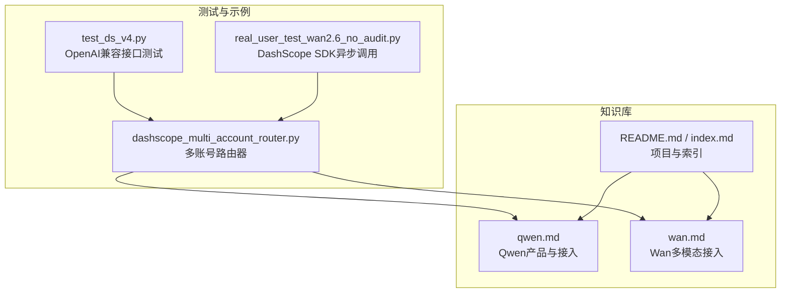
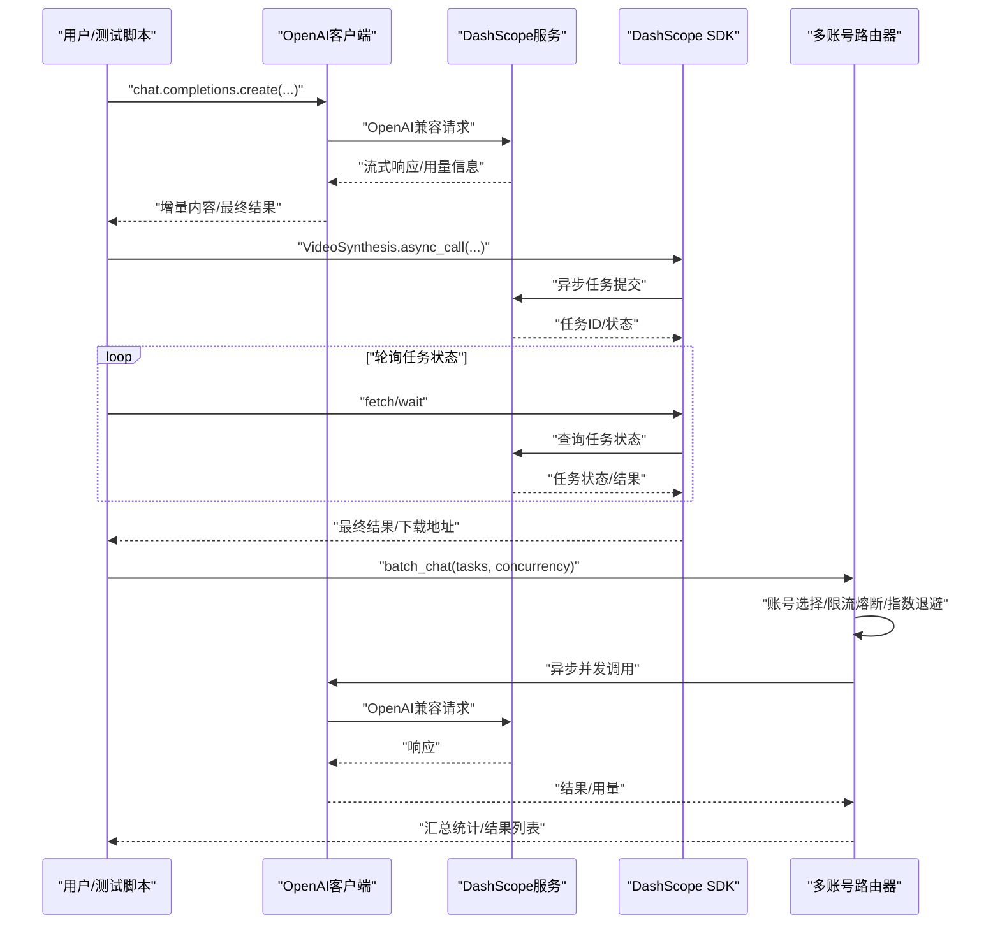
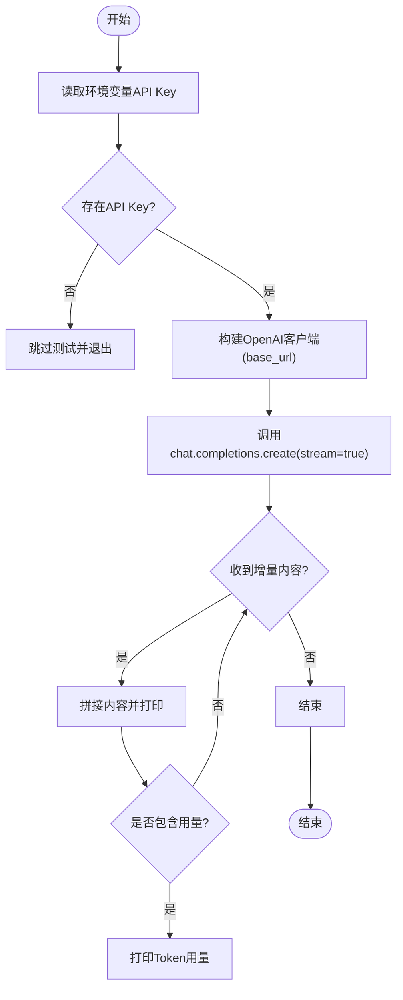
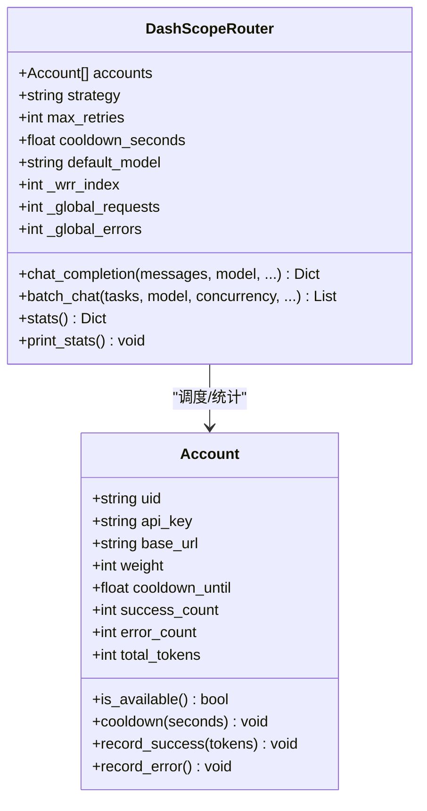
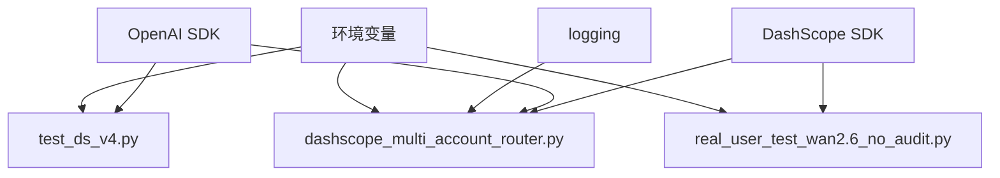

# API集成与测试

<cite>
**本文引用的文件**
- [test_ds_v4.py](file://vibeproject/test_ds_v4.py)
- [real_user_test_wan2.6_no_audit.py](file://vibeproject/real_user_test_wan2.6_no_audit.py)
- [dashscope_multi_account_router.py](file://vibeproject/dashscope_multi_account_router.py)
- [qwen.md](file://knowledge/alibaba-cloud/maas/qwen.md)
- [wan.md](file://knowledge/alibaba-cloud/maas/wan.md)
- [README.md](file://README.md)
- [index.md](file://index.md)
</cite>

## 目录
1. [简介](#简介)
2. [项目结构](#项目结构)
3. [核心组件](#核心组件)
4. [架构总览](#架构总览)
5. [详细组件分析](#详细组件分析)
6. [依赖关系分析](#依赖关系分析)
7. [性能考虑](#性能考虑)
8. [故障排查指南](#故障排查指南)
9. [结论](#结论)
10. [附录](#附录)

## 简介
本技术文档围绕API集成与测试展开，重点覆盖以下方面：
- DashScope API的集成方法与使用规范：认证机制、请求格式、响应处理、错误码管理
- OpenAI兼容接口的实现原理与配置方法：如何统一不同平台的API调用方式
- 多地域调用测试的实现策略：测试脚本编写、参数配置、结果验证
- 具体的API调用示例与错误处理代码路径
- API性能优化技巧、限流策略与监控机制
- API集成最佳实践与常见问题解决方案

## 项目结构
本仓库包含用于DashScope API集成与测试的Python脚本，以及与之相关的知识库文档。关键文件如下：
- vibeproject/test_ds_v4.py：基于OpenAI兼容接口进行DeepSeek多地域调用的测试脚本
- vibeproject/real_user_test_wan2.6_no_audit.py：基于DashScope SDK进行视频生成的异步调用与轮询示例
- vibeproject/dashscope_multi_account_router.py：多账号负载均衡路由器，支持限流熔断、指数退避与并发控制
- knowledge/alibaba-cloud/maas/qwen.md：通义千问（Qwen）产品与接入方式说明
- knowledge/alibaba-cloud/maas/wan.md：万相（Wan）多模态生成模型（图像/视频）接入说明
- README.md 与 index.md：项目整体介绍与知识库索引



图表来源
- [test_ds_v4.py:1-102](file://vibeproject/test_ds_v4.py#L1-L102)
- [real_user_test_wan2.6_no_audit.py:1-105](file://vibeproject/real_user_test_wan2.6_no_audit.py#L1-L105)
- [dashscope_multi_account_router.py:1-436](file://vibeproject/dashscope_multi_account_router.py#L1-L436)
- [qwen.md:1-120](file://knowledge/alibaba-cloud/maas/qwen.md#L1-L120)
- [wan.md:1-88](file://knowledge/alibaba-cloud/maas/wan.md#L1-L88)
- [README.md:1-20](file://README.md#L1-L20)
- [index.md:1-69](file://index.md#L1-L69)

章节来源
- [README.md:1-20](file://README.md#L1-L20)
- [index.md:1-69](file://index.md#L1-L69)

## 核心组件
- OpenAI兼容接口测试脚本：通过OpenAI SDK以兼容模式调用DashScope，支持流式响应与Token用量统计
- DashScope SDK异步调用示例：使用VideoSynthesis异步接口提交任务，并轮询任务状态直至完成
- 多账号路由器：封装多账号负载均衡、限流熔断、指数退避与并发控制，提供批量并发调用能力

章节来源
- [test_ds_v4.py:45-102](file://vibeproject/test_ds_v4.py#L45-L102)
- [real_user_test_wan2.6_no_audit.py:31-102](file://vibeproject/real_user_test_wan2.6_no_audit.py#L31-L102)
- [dashscope_multi_account_router.py:93-392](file://vibeproject/dashscope_multi_account_router.py#L93-L392)

## 架构总览
下图展示了三种典型调用路径：OpenAI兼容接口、DashScope SDK异步调用、多账号路由器的统一调度。



图表来源
- [test_ds_v4.py:58-86](file://vibeproject/test_ds_v4.py#L58-L86)
- [real_user_test_wan2.6_no_audit.py:31-102](file://vibeproject/real_user_test_wan2.6_no_audit.py#L31-L102)
- [dashscope_multi_account_router.py:175-294](file://vibeproject/dashscope_multi_account_router.py#L175-L294)

## 详细组件分析

### OpenAI兼容接口测试（test_ds_v4.py）
- 认证机制：通过环境变量注入API Key，传入OpenAI客户端构造函数
- 请求格式：使用chat.completions.create，支持流式响应与用量统计
- 响应处理：逐块读取增量内容，聚合完整回复；在流结束时输出Token用量
- 错误处理：捕获异常并打印错误信息
- 多地域调用：分别针对US节点与国际节点进行测试，模型名称与端点不同



图表来源
- [test_ds_v4.py:45-86](file://vibeproject/test_ds_v4.py#L45-L86)

章节来源
- [test_ds_v4.py:1-102](file://vibeproject/test_ds_v4.py#L1-L102)

### DashScope SDK异步调用（real_user_test_wan2.6_no_audit.py）
- 认证机制：通过环境变量注入API Key
- 请求格式：VideoSynthesis.async_call提交任务，支持分辨率、时长、种子等参数
- 响应处理：获取任务ID后轮询fetch，根据任务状态决定是否继续轮询或终止；完成后wait获取最终结果
- 错误处理：对HTTP状态码、错误码与消息进行判断与打印
- 内容安全：通过自定义Header关闭内容安全检测（绿网）

```mermaid
sequenceDiagram
participant U as "用户/测试脚本"
participant VS as "VideoSynthesis"
participant DS as "DashScope服务"
U->>VS : "async_call(model, prompt, headers)"
VS->>DS : "提交异步任务"
DS-->>VS : "任务ID/状态"
loop "轮询"
U->>VS : "fetch(task)"
VS->>DS : "查询任务状态"
DS-->>VS : "任务状态"
alt "SUCCEEDED/FAILED"
break
else "PROCESSING"
U->>U : "sleep并继续轮询"
end
end
U->>VS : "wait(task)"
VS->>DS : "获取最终结果"
DS-->>VS : "视频URL/错误信息"
VS-->>U : "返回结果"
```

图表来源
- [real_user_test_wan2.6_no_audit.py:31-102](file://vibeproject/real_user_test_wan2.6_no_audit.py#L31-L102)

章节来源
- [real_user_test_wan2.6_no_audit.py:1-105](file://vibeproject/real_user_test_wan2.6_no_audit.py#L1-L105)

### 多账号路由器（dashscope_multi_account_router.py）
- 账号模型：Account包含UID、API Key、Base URL、权重与运行时状态（冷却时间、成功/失败计数、Token累计）
- 调度策略：支持加权轮询、最少负载、随机选择
- 限流熔断：遇到429时对该账号进行冷却，立即切换其他账号；其他错误采用指数退避
- 并发控制：通过信号量限制并发数，避免同时打满所有账号
- 统计与日志：记录全局与账号级统计，输出运行时日志便于监控



图表来源
- [dashscope_multi_account_router.py:59-88](file://vibeproject/dashscope_multi_account_router.py#L59-L88)
- [dashscope_multi_account_router.py:93-172](file://vibeproject/dashscope_multi_account_router.py#L93-L172)

章节来源
- [dashscope_multi_account_router.py:1-436](file://vibeproject/dashscope_multi_account_router.py#L1-L436)

## 依赖关系分析
- OpenAI兼容接口测试依赖OpenAI SDK与环境变量
- DashScope SDK异步调用依赖DashScope SDK与环境变量
- 多账号路由器依赖OpenAI SDK、异步并发库与日志模块
- 知识库文档为产品接入与能力说明提供背景支撑



图表来源
- [test_ds_v4.py:41-42](file://vibeproject/test_ds_v4.py#L41-L42)
- [real_user_test_wan2.6_no_audit.py:4-6](file://vibeproject/real_user_test_wan2.6_no_audit.py#L4-L6)
- [dashscope_multi_account_router.py:34-43](file://vibeproject/dashscope_multi_account_router.py#L34-L43)

章节来源
- [test_ds_v4.py:41-42](file://vibeproject/test_ds_v4.py#L41-L42)
- [real_user_test_wan2.6_no_audit.py:4-6](file://vibeproject/real_user_test_wan2.6_no_audit.py#L4-L6)
- [dashscope_multi_account_router.py:34-43](file://vibeproject/dashscope_multi_account_router.py#L34-L43)

## 性能考虑
- 限流与熔断：遇到429时立即冷却当前账号并切换其他账号，减少整体等待时间
- 指数退避：对非429错误采用指数退避，避免雪崩效应
- 并发控制：通过信号量限制并发数，防止瞬时打满所有账号
- Token统计：在流式响应中收集用量，便于成本与性能评估
- 多地域路由：针对不同模型选择最优地域端点，降低网络延迟

章节来源
- [dashscope_multi_account_router.py:251-282](file://vibeproject/dashscope_multi_account_router.py#L251-L282)
- [test_ds_v4.py:58-86](file://vibeproject/test_ds_v4.py#L58-L86)

## 故障排查指南
- 环境变量缺失：若未设置API Key，测试脚本会跳过并提示；多账号路由器会抛出配置错误
- 429限流：多账号路由器会触发冷却并切换账号；建议增加账号数量或提高权重
- 任务状态轮询：异步调用需正确处理任务状态，避免无限轮询；建议设置最大轮询次数与超时
- 内容安全检测：如需关闭绿网检测，需在请求头中添加相应字段
- 日志与统计：利用路由器的日志与统计输出，快速定位问题账号与错误类型

章节来源
- [test_ds_v4.py:51-54](file://vibeproject/test_ds_v4.py#L51-L54)
- [dashscope_multi_account_router.py:383-391](file://vibeproject/dashscope_multi_account_router.py#L383-L391)
- [real_user_test_wan2.6_no_audit.py:18-24](file://vibeproject/real_user_test_wan2.6_no_audit.py#L18-L24)

## 结论
本项目提供了DashScope API的多种集成与测试方案：
- 通过OpenAI兼容接口实现统一调用入口，简化多平台适配
- 通过DashScope SDK实现异步任务与轮询流程，满足视频生成等长时任务场景
- 通过多账号路由器实现限流熔断、指数退避与并发控制，提升系统稳定性与吞吐
结合知识库文档，可进一步完善产品能力与接入方式的理解，形成可扩展的API集成体系。

## 附录
- 产品与接入参考：Qwen与Wan多模态能力说明
- 项目与索引：知识库全局索引与README

章节来源
- [qwen.md:97-103](file://knowledge/alibaba-cloud/maas/qwen.md#L97-L103)
- [wan.md:70-76](file://knowledge/alibaba-cloud/maas/wan.md#L70-L76)
- [README.md:1-20](file://README.md#L1-L20)
- [index.md:1-69](file://index.md#L1-L69)