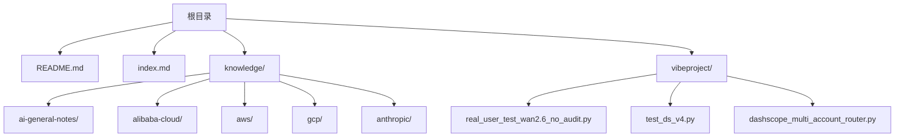
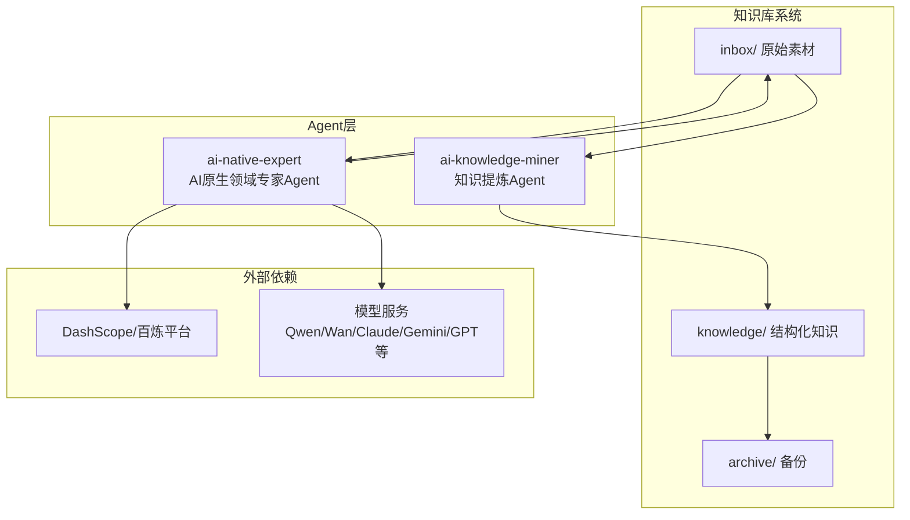
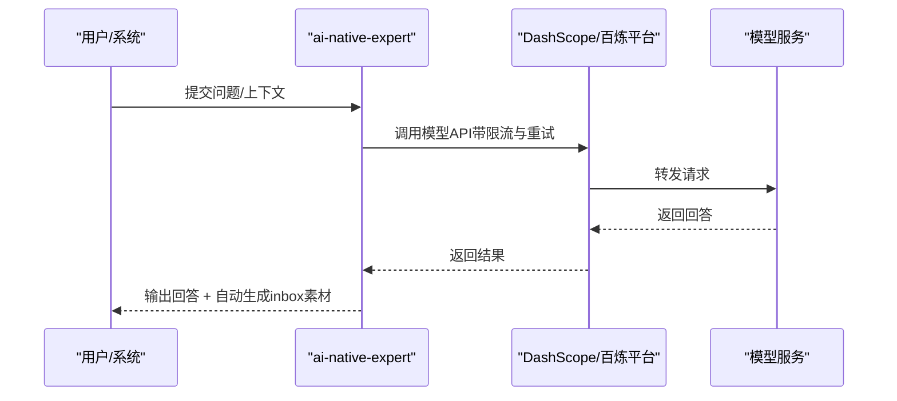
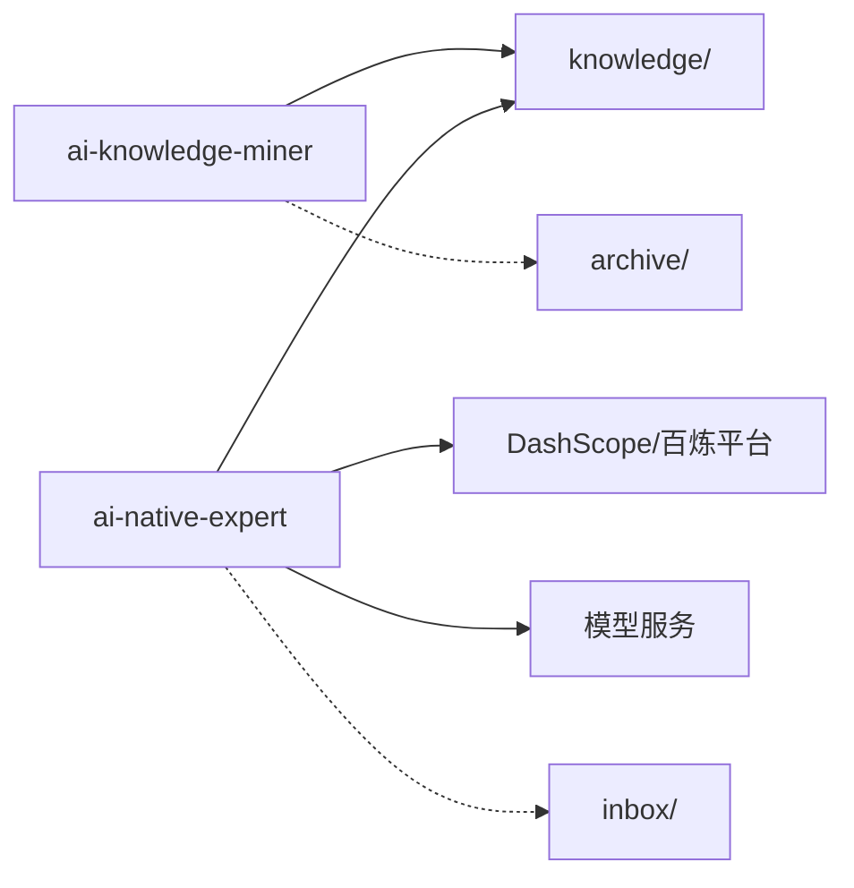
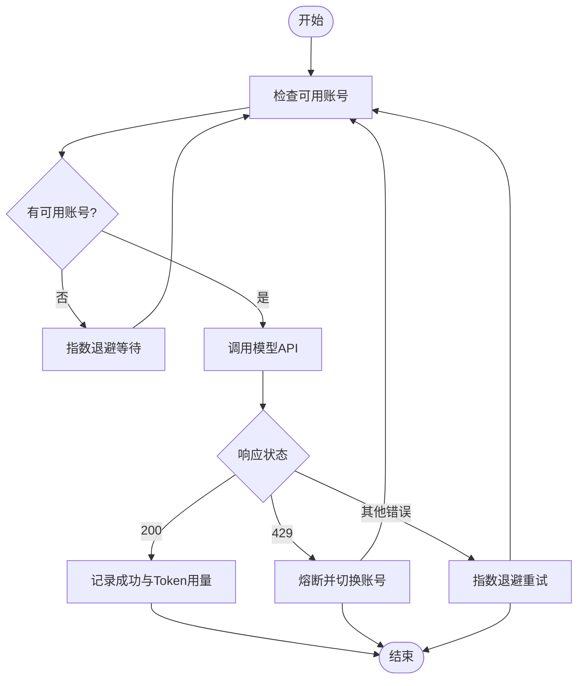

# Agent架构设计

<cite>
**本文引用的文件**
- [README.md](file://README.md)
- [index.md](file://index.md)
- [agent-def.md](file://knowledge/ai-general-notes/agent-def.md)
- [harness.md](file://knowledge/ai-general-notes/harness.md)
- [claw-family.md](file://knowledge/alibaba-cloud/ai-application/claw-family.md)
- [jvs-crew.md](file://knowledge/alibaba-cloud/ai-application/jvs-crew.md)
- [real_user_test_wan2.6_no_audit.py](file://vibeproject/real_user_test_wan2.6_no_audit.py)
- [test_ds_v4.py](file://vibeproject/test_ds_v4.py)
- [dashscope_multi_account_router.py](file://vibeproject/dashscope_multi_account_router.py)
</cite>

## 目录
1. [简介](#简介)
2. [项目结构](#项目结构)
3. [核心组件](#核心组件)
4. [架构总览](#架构总览)
5. [详细组件分析](#详细组件分析)
6. [依赖分析](#依赖分析)
7. [性能考虑](#性能考虑)
8. [故障排查指南](#故障排查指南)
9. [结论](#结论)
10. [附录](#附录)

## 简介
本项目围绕“知识沉淀”和“领域专家问答”两类Agent展开：  
- ai-knowledge-miner：负责将原始素材提炼为脱敏、结构化的知识文档，写入知识库相应目录。  
- ai-native-expert：聚焦MaaS（Qwen/Wan/Claude/Gemini/GPT）与AI Coding（Qoder/Kiro/Claude Code），提供能力选型、API问题、竞品分析等专业解答，并在回答后自动生成inbox素材。

这两类Agent共同支撑知识库的“采集-沉淀-输出-反馈”的闭环，形成可复用、可演进的知识资产。

章节来源
- [README.md:1-20](file://README.md#L1-L20)

## 项目结构
- 根目录包含知识库入口索引、README说明、以及若干用于验证与演示的Python脚本。
- 知识库主体位于knowledge/目录，按厂商与领域分类组织，便于检索与复用。
- vibeproject/目录包含与模型平台（如DashScope）对接的示例脚本，体现Agent在工程化落地中的外部依赖与调用方式。

图表来源
- [README.md:13-18](file://README.md#L13-L18)
- [index.md:1-69](file://index.md#L1-L69)

章节来源
- [README.md:13-18](file://README.md#L13-L18)
- [index.md:1-69](file://index.md#L1-L69)

## 核心组件
- ai-knowledge-miner（知识提炼Agent）  
  - 输入：inbox/中的原始素材（文本/截图/会议记录等）  
  - 处理：脱敏、结构化、抽取关键信息、归类到对应领域目录  
  - 输出：knowledge/下的结构化文档，供后续检索与复用  
  - 关键点：强调“沉淀”“处理inbox”，确保知识可溯源、可复用  

- ai-native-expert（AI原生领域专家Agent）  
  - 输入：面向MaaS与AI Coding的咨询问题（能力对比、API使用、竞品分析等）  
  - 处理：结合权威资料与最新动态，给出可执行的建议与落地方案  
  - 输出：高质量回答 + 自动生成inbox素材（用于后续沉淀）  
  - 关键点：聚焦“专家级洞察”，并具备“自反馈”能力，促进知识闭环  

章节来源
- [README.md:7-11](file://README.md#L7-L11)

## 架构总览
从系统视角看，Agent架构由“感知-推理-行动-观察”循环构成，结合Harness进行约束与治理，确保在复杂任务中保持可控、可观测、可审计。

图表来源
- [README.md:7-11](file://README.md#L7-L11)
- [agent-def.md:60-68](file://knowledge/ai-general-notes/agent-def.md#L60-L68)
- [harness.md:13-23](file://knowledge/ai-general-notes/harness.md#L13-L23)

## 详细组件分析

### ai-knowledge-miner（知识提炼Agent）
- 工作流程  
  - 感知：扫描inbox/，识别新增素材  
  - 推理：根据领域模板与结构化规则，抽取关键字段  
  - 行动：写入knowledge/对应目录，生成标准化文档  
  - 观察：记录写入结果与去重策略，避免重复沉淀  

- 输入输出规范  
  - 输入：原始素材（文本/图片/链接/会议纪要等）  
  - 输出：结构化知识文档（含标题、摘要、要点、来源、标签等）  
  - 归档：写入后移动至archive/，便于版本管理与审计  

- 数据流转机制  
  - 去重与合并：同一主题在短期内多次出现时，进行合并与摘要  
  - 脱敏：去除敏感信息（如姓名、工号、内部链接等）  
  - 分类：依据领域模板自动归类到AI General Notes、MaaS、AI Coding、Infra等目录  

- 工程化要点  
  - 退出条件显式化：限定最大处理步数与超时，避免无限循环  
  - 幂等性：重复运行不产生重复文件  
  - 上下文压缩：长周期处理中定期摘要，避免上下文膨胀  
  - 可观测性：记录每步处理日志，便于回溯与调试  

章节来源
- [README.md:7-9](file://README.md#L7-L9)
- [agent-def.md:101-107](file://knowledge/ai-general-notes/agent-def.md#L101-L107)

### ai-native-expert（AI原生领域专家Agent）
- 工作流程  
  - 感知：接收用户问题或系统提示（如“竞品分析”“API问题”）  
  - 推理：检索知识库与权威资料，生成结构化回答与建议  
  - 行动：输出回答，并自动生成inbox素材（用于后续沉淀）  
  - 观察：记录回答质量、引用来源、用户反馈，驱动迭代  

- 输入输出规范  
  - 输入：自然语言问题、上下文、领域标签  
  - 输出：高质量回答、可执行建议、引用来源、自动生成的inbox素材  
  - 产物：回答与素材均沉淀到知识库，形成“专家回答→素材→沉淀→再专家”的闭环  

- 数据流转机制  
  - 知识检索：基于index.md与知识库目录进行检索与匹配  
  - 竞品对比：按厂商维度（阿里云/AWS/GCP/Anthropic）进行横向对比  
  - 方案生成：结合模板与最佳实践，输出可落地的实施建议  

- 工程化要点  
  - 退出条件显式化：避免长对话导致上下文膨胀与资源浪费  
  - 工具幂等性：对外部调用（如模型API）进行重试与去重  
  - 上下文压缩：定期摘要与截断，维持高效推理  
  - 可观测性：记录每步动作、调用参数、返回结果与耗时  

章节来源
- [README.md:10-11](file://README.md#L10-L11)
- [index.md:1-69](file://index.md#L1-L69)
- [agent-def.md:101-107](file://knowledge/ai-general-notes/agent-def.md#L101-L107)

### Harness（约束与治理层）
Harness是Agent的“缰绳+鞍具”，定义Agent能做什么、不能做什么、何时需要人工介入，是企业级Agent产品化的关键。

- 核心组成  
  - 工具权限边界：白名单、参数校验  
  - 业务规则约束：关键条件下的停止/转人工  
  - 人工介入点（HITL）：关键决策节点强制人工确认  
  - 凭证隔离：Agent执行节点不直接持有生产凭证  
  - 审计追踪：每步行动可追溯、可回滚  
  - 退出条件：超时、最大步数、异常等守卫条件  

- 与Agent的关系  
  - Agent = Model（大脑）+ Harness（缰绳+鞍具）  
  - Harness决定Agent的可用性上限，差的Harness会使强模型也“跑偏”  

- 企业级实践  
  - 业务流程梳理：把核心流程文档化，作为Harness输入  
  - 风险边界定义：明确不可自动执行的操作（资金、删除等）  
  - 分层权限设计：只读>写>删，最小权限逐步开放  
  - HITL节点设计：每个关键决策点预设人工确认触发条件  
  - 审计先行：在实现功能前搭建审计日志基础设施  

章节来源
- [agent-def.md:31-39](file://knowledge/ai-general-notes/agent-def.md#L31-L39)
- [harness.md:13-23](file://knowledge/ai-general-notes/harness.md#L13-L23)
- [harness.md:37-47](file://knowledge/ai-general-notes/harness.md#L37-L47)
- [harness.md:69-78](file://knowledge/ai-general-notes/harness.md#L69-L78)

### 外部依赖与工程化实现（以脚本为例）
- 模型平台对接  
  - DashScope多账号负载均衡路由器：支持多账号轮询/加权调度、429限流熔断、指数退避重试、异步并发安全与实时用量统计  
  - DeepSeek多地域调用测试：按US/Singapore地域路由，配置不同API Key与端点，演示限流与Token统计  

- 示例脚本的作用  
  - dashscope_multi_account_router.py：展示Harness在“凭证隔离”“限流治理”“可观测性”方面的工程化落地  
  - test_ds_v4.py：演示多地域、多账号的模型调用与限流策略  
  - real_user_test_wan2.6_no_audit.py：演示视频生成API的异步调用与状态轮询，体现“行动-观察”的闭环  

图表来源
- [dashscope_multi_account_router.py:175-294](file://vibeproject/dashscope_multi_account_router.py#L175-L294)
- [test_ds_v4.py:45-87](file://vibeproject/test_ds_v4.py#L45-L87)
- [real_user_test_wan2.6_no_audit.py:31-101](file://vibeproject/real_user_test_wan2.6_no_audit.py#L31-L101)

章节来源
- [dashscope_multi_account_router.py:1-436](file://vibeproject/dashscope_multi_account_router.py#L1-L436)
- [test_ds_v4.py:1-102](file://vibeproject/test_ds_v4.py#L1-L102)
- [real_user_test_wan2.6_no_audit.py:1-105](file://vibeproject/real_user_test_wan2.6_no_audit.py#L1-L105)

## 依赖分析
- 组件耦合与协作  
  - ai-knowledge-miner与ai-native-expert共享知识库（inbox/、knowledge/、archive/）作为数据依赖  
  - ai-native-expert依赖外部模型平台（DashScope/百炼）与具体模型（Qwen/Wan/Claude/Gemini/GPT）  
  - Harness贯穿Agent生命周期，对工具、权限、审计、退出条件进行统一治理  

- 外部依赖与集成点  
  - 模型平台：DashScope（多账号、多地域、限流与熔断）  
  - 企业安全：凭证隔离、审计追踪、HITL、SSO（如JVS Crew）  
  - 执行环境：无影AgentBay（沙箱隔离）  

图表来源
- [README.md:15-17](file://README.md#L15-L17)
- [claw-family.md:77-87](file://knowledge/alibaba-cloud/ai-application/claw-family.md#L77-L87)
- [jvs-crew.md:47-56](file://knowledge/alibaba-cloud/ai-application/jvs-crew.md#L47-L56)

章节来源
- [README.md:15-17](file://README.md#L15-L17)
- [claw-family.md:77-87](file://knowledge/alibaba-cloud/ai-application/claw-family.md#L77-L87)
- [jvs-crew.md:47-56](file://knowledge/alibaba-cloud/ai-application/jvs-crew.md#L47-L56)

## 性能考虑
- 限流与熔断  
  - 多账号轮询/加权调度，遇到429自动熔断并切换账号，减少全局等待  
  - 指数退避重试，避免雪崩效应  
- 并发与吞吐  
  - 控制并发数，防止瞬时打满所有账号  
  - 批量并发调用，配合信号量实现安全并发  
- 上下文管理  
  - 长循环中定期摘要与截断，避免上下文膨胀导致性能下降  
- 可观测性  
  - 记录延迟、Token用量、账号成功率与错误统计，便于容量规划与问题定位  

章节来源
- [dashscope_multi_account_router.py:93-172](file://vibeproject/dashscope_multi_account_router.py#L93-L172)
- [dashscope_multi_account_router.py:297-317](file://vibeproject/dashscope_multi_account_router.py#L297-L317)
- [agent-def.md:101-107](file://knowledge/ai-general-notes/agent-def.md#L101-L107)

## 故障排查指南
- 常见问题与处理  
  - 429限流：自动熔断与切换账号，稍后重试；必要时调整权重或增加账号  
  - 账号不可用：检查冷却剩余时间，等待恢复后再试  
  - 异常重试：指数退避，超过最大重试次数后记录失败原因  
  - 并发阻塞：降低并发数或增加账号，避免瞬时打满  
- 日志与统计  
  - 查看全局请求/错误统计与各账号状态，定位问题根因  
  - 记录每次调用的账号、延迟、Token用量，辅助成本与性能分析  

图表来源
- [dashscope_multi_account_router.py:175-294](file://vibeproject/dashscope_multi_account_router.py#L175-L294)

章节来源
- [dashscope_multi_account_router.py:318-354](file://vibeproject/dashscope_multi_account_router.py#L318-L354)

## 结论
- ai-knowledge-miner与ai-native-expert分别承担“沉淀”与“输出”的职责，二者协同形成知识闭环。  
- Harness是Agent产品化的关键，通过工具边界、业务规则、人工介入点、凭证隔离与审计追踪，将“不确定性”转化为“可控性”。  
- 工程化落地中，应重视限流熔断、并发控制、上下文压缩与可观测性，确保Agent在复杂场景下稳定运行。  
- 企业级Agent平台（如JVS Crew、HiClaw）提供了可借鉴的安全与治理范式，可作为Harness设计的参考。

## 附录
- 启动与运行  
  - 知识沉淀：扫描inbox/，脱敏与结构化后写入knowledge/，并归档到archive/  
  - 专家回答：接收问题→检索知识→生成回答→自动生成inbox素材  
  - 外部调用：通过DashScope多账号路由器进行限流治理与重试  
- 监控与维护  
  - 实时统计：账号成功率、错误率、Token用量、冷却剩余时间  
  - 日志：每步动作、参数、返回与耗时，便于回溯与优化  
- 扩展与定制  
  - 新增领域：在index.md中补充索引，完善模板与竞品分析  
  - 新增工具：在Harness中新增白名单与参数校验，确保权限与安全  
  - 新增Agent：遵循“感知-推理-行动-观察”循环，明确退出条件与可观测性  

章节来源
- [README.md:7-11](file://README.md#L7-L11)
- [index.md:1-69](file://index.md#L1-L69)
- [dashscope_multi_account_router.py:318-354](file://vibeproject/dashscope_multi_account_router.py#L318-L354)
- [claw-family.md:36-88](file://knowledge/alibaba-cloud/ai-application/claw-family.md#L36-L88)
- [jvs-crew.md:16-56](file://knowledge/alibaba-cloud/ai-application/jvs-crew.md#L16-L56)