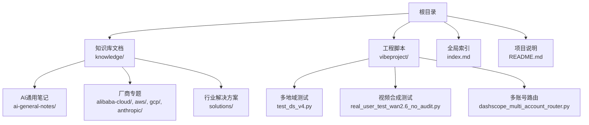
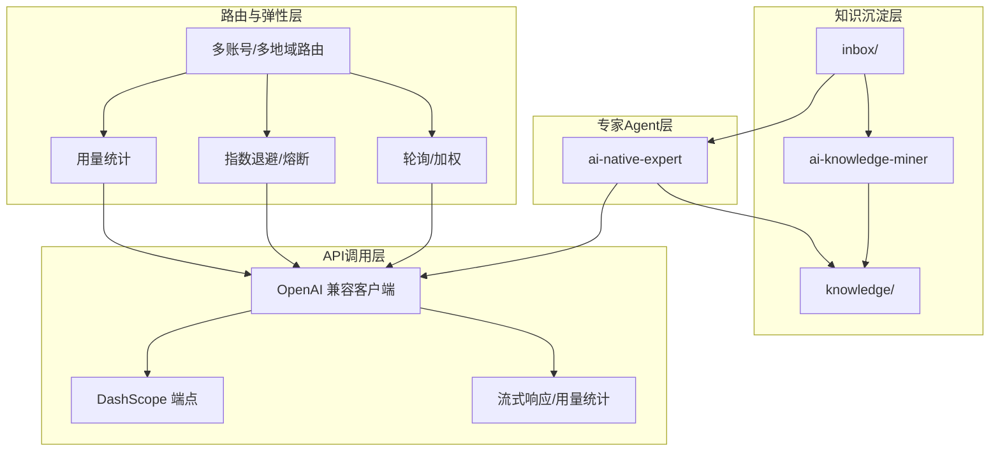
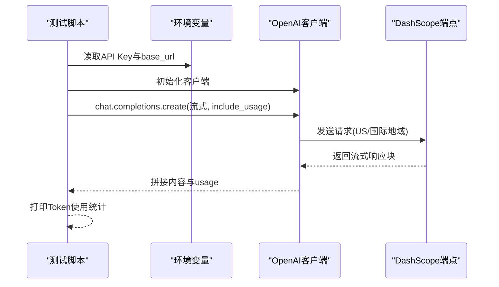
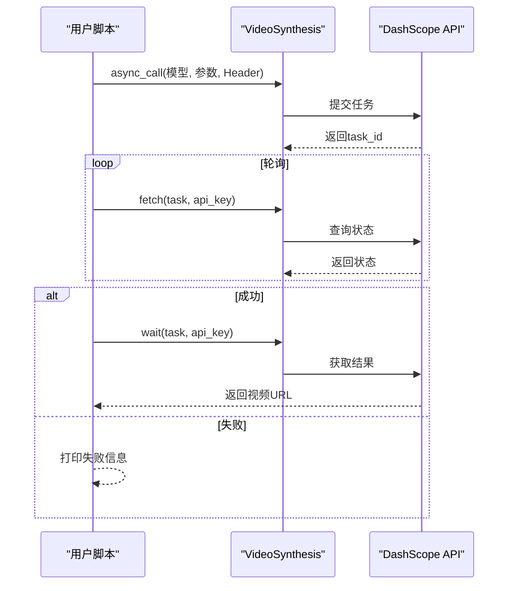
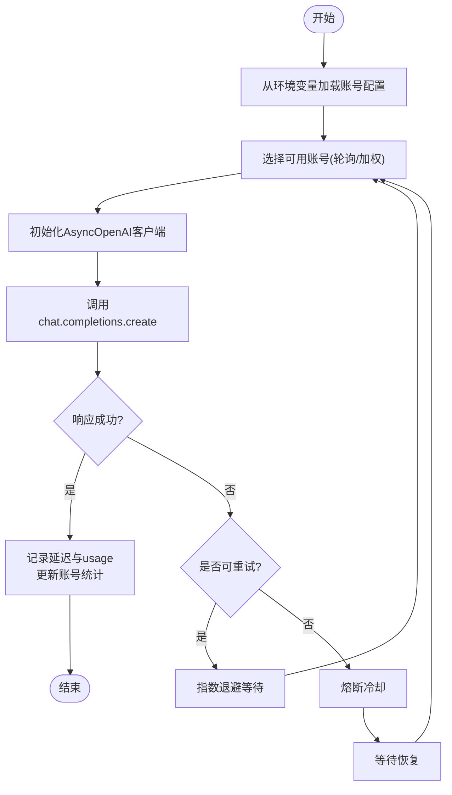
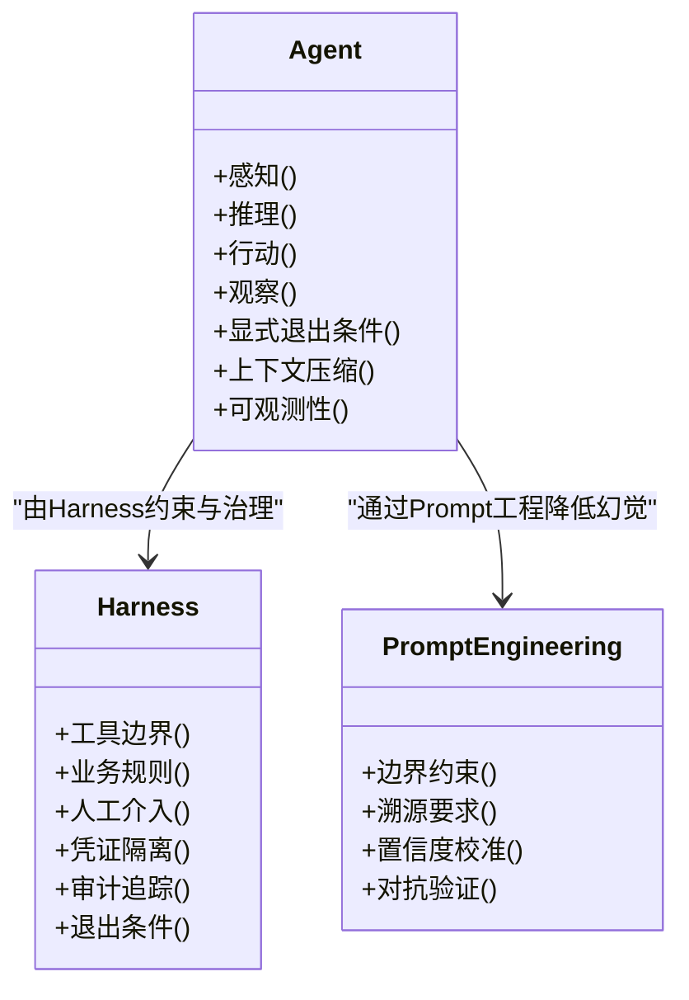
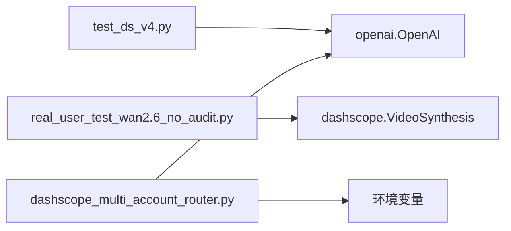

# 技术实现细节

<cite>
**本文引用的文件**
- [README.md](file://README.md)
- [index.md](file://index.md)
- [test_ds_v4.py](file://vibeproject/test_ds_v4.py)
- [real_user_test_wan2.6_no_audit.py](file://vibeproject/real_user_test_wan2.6_no_audit.py)
- [dashscope_multi_account_router.py](file://vibeproject/dashscope_multi_account_router.py)
- [agent-def.md](file://knowledge/ai-general-notes/agent-def.md)
- [harness.md](file://knowledge/ai-general-notes/harness.md)
- [prompt-engineering.md](file://knowledge/ai-general-notes/prompt-engineering.md)
- [rag.md](file://knowledge/ai-general-notes/rag.md)
- [fine-tuning.md](file://knowledge/ai-general-notes/fine-tuning.md)
</cite>

## 目录
1. [简介](#简介)
2. [项目结构](#项目结构)
3. [核心组件](#核心组件)
4. [架构总览](#架构总览)
5. [详细组件分析](#详细组件分析)
6. [依赖分析](#依赖分析)
7. [性能考量](#性能考量)
8. [故障排查指南](#故障排查指南)
9. [结论](#结论)
10. [附录](#附录)

## 简介
本项目是一个AI知识库，旨在通过两类Agent沉淀与整理AI相关知识：
- ai-knowledge-miner：将inbox中的原始素材提炼为脱敏、结构化的知识文档，写入knowledge对应目录。
- ai-native-expert：聚焦MaaS（Qwen/Wan/Claude/Gemini/GPT）与AI Coding（Qoder/Kiro/Claude Code），回答模型能力、选型、API问题及竞品分析，并在回答后自动产出inbox素材。

项目同时提供了对DashScope API的OpenAI兼容接口调用测试脚本、多账号负载均衡路由器、以及针对特定模型（如DeepSeek）的多地域调用策略与限流说明，便于在不同地域与账号间进行弹性扩容与稳定性保障。

章节来源
- [README.md:1-20](file://README.md#L1-L20)

## 项目结构
项目采用“知识文档 + 工程脚本”的双轨组织方式：
- 知识库文档位于knowledge目录，按领域与厂商分类，形成可检索的知识索引。
- 工程脚本位于vibeproject目录，包含API测试、多账号路由与视频合成等实用工具。

图表来源
- [README.md:13-18](file://README.md#L13-L18)
- [index.md:1-69](file://index.md#L1-L69)

章节来源
- [README.md:13-18](file://README.md#L13-L18)
- [index.md:1-69](file://index.md#L1-L69)

## 核心组件
- Agent架构与Harness治理
  - Agent本质是“不确定性受控的for循环”，包含感知-推理-行动-观察四个阶段，强调退出条件显式化、工具幂等性、上下文压缩与可观测性优先。
  - Harness是Agent的约束与治理层，定义能做什么、不能做什么、何时需要人工介入，涵盖工具边界、业务规则、人工介入点、凭证隔离、审计追踪与退出条件。
- Prompt工程与防幻觉四层机制
  - 通过边界约束、溯源要求、置信度校准与对抗验证四层机制，系统性降低幻觉率。
- DashScope API集成与OpenAI兼容接口
  - 提供OpenAI兼容客户端调用示例，支持流式响应与Token用量统计。
- 多账号负载均衡与多地域路由
  - 基于环境变量配置多个账号与地域端点，实现轮询/加权调度、429限流熔断、指数退避重试与实时用量统计。

章节来源
- [agent-def.md:13-68](file://knowledge/ai-general-notes/agent-def.md#L13-L68)
- [harness.md:13-47](file://knowledge/ai-general-notes/harness.md#L13-L47)
- [prompt-engineering.md:46-79](file://knowledge/ai-general-notes/prompt-engineering.md#L46-L79)
- [test_ds_v4.py:45-87](file://vibeproject/test_ds_v4.py#L45-L87)
- [dashscope_multi_account_router.py:360-392](file://vibeproject/dashscope_multi_account_router.py#L360-L392)

## 架构总览
系统采用“知识沉淀 + 工程化调用 + 多账号/多地域路由”的整体架构：
- 知识沉淀层：ai-knowledge-miner负责从inbox提取结构化知识至knowledge。
- 专家Agent层：ai-native-expert用于回答与产出素材，支撑知识库内容增长。
- API调用层：OpenAI兼容客户端封装DashScope端点，统一接口风格。
- 路由与弹性层：多账号轮询/加权、429熔断、指数退避与用量统计，保障高并发与稳定性。

图表来源
- [README.md:7-11](file://README.md#L7-L11)
- [test_ds_v4.py:45-87](file://vibeproject/test_ds_v4.py#L45-L87)
- [dashscope_multi_account_router.py:360-392](file://vibeproject/dashscope_multi_account_router.py#L360-L392)

## 详细组件分析

### 组件A：多地域与多账号API测试（OpenAI兼容）
- 功能概述
  - 针对DeepSeek系列模型，演示US与国际（新加坡）地域的OpenAI兼容端点调用。
  - 支持流式响应与usage统计，便于评估Token消耗与延迟。
- 关键流程
  - 读取环境变量中的API Key与端点。
  - 初始化OpenAI客户端并发起聊天补全请求。
  - 流式遍历响应块，拼接内容并打印usage信息。
- 配置要点
  - 环境变量：按地域分别设置API Key与base_url。
  - 模型名称：根据地域选择对应模型（如US地域的deepseek-v4-pro/flash，国际地域的deepseek-v3.2）。
- 限流与地域规则
  - RPM/TPM限流阈值与恢复策略。
  - 地域路由规则与授权开通流程。

图表来源
- [test_ds_v4.py:45-87](file://vibeproject/test_ds_v4.py#L45-L87)

章节来源
- [test_ds_v4.py:1-102](file://vibeproject/test_ds_v4.py#L1-L102)

### 组件B：视频合成异步调用（Wan系列）
- 功能概述
  - 使用DashScope VideoSynthesis异步接口进行图像到视频生成，支持关闭内容安全检测的Header配置。
  - 提交任务后轮询任务状态，完成后获取结果链接。
- 关键流程
  - 设置base_http_api_url与API Key。
  - 调用VideoSynthesis.async_call提交任务，获取task_id。
  - 循环fetch查询任务状态，直至SUCCEEDED或FAILED。
  - 成功后调用wait获取视频URL。
- 配置要点
  - base_http_api_url按地域切换（新加坡/北京）。
  - DISABLE_INSPECTION_HEADERS用于关闭绿网检测。
  - 模型名称与分辨率、时长、种子等参数按需调整。

图表来源
- [real_user_test_wan2.6_no_audit.py:31-102](file://vibeproject/real_user_test_wan2.6_no_audit.py#L31-L102)

章节来源
- [real_user_test_wan2.6_no_audit.py:1-105](file://vibeproject/real_user_test_wan2.6_no_audit.py#L1-L105)

### 组件C：多账号负载均衡与路由（多地域/多账号）
- 功能概述
  - 通过环境变量批量配置多个账号（含权重），实现轮询/加权调度。
  - 面对429限流自动熔断，结合指数退避重试，避免雪崩。
  - 异步并发安全，实时统计各账号用量与全局请求计数。
- 关键流程
  - 从环境变量加载账号列表（KEY/URL/WEIGHT）。
  - 选择可用账号，初始化AsyncOpenAI客户端。
  - 发起chat.completions请求，记录延迟与usage。
  - 成功后更新账号统计，失败时按指数退避重试或熔断。
- 配置要点
  - 环境变量命名规范：DASHSCOPE_ACCOUNT_{N}_KEY/ BASE_URL/ WEIGHT。
  - 默认base_url与权重默认值。
  - 最大重试次数与冷却等待时间上限。

图表来源
- [dashscope_multi_account_router.py:360-392](file://vibeproject/dashscope_multi_account_router.py#L360-L392)
- [dashscope_multi_account_router.py:200-235](file://vibeproject/dashscope_multi_account_router.py#L200-L235)

章节来源
- [dashscope_multi_account_router.py:1-392](file://vibeproject/dashscope_multi_account_router.py#L1-L392)

### 组件D：Agent架构与Harness治理（设计原理与工程化）
- Agent本质
  - “不确定性受控的for循环”，包含感知-推理-行动-观察四个阶段，强调显式退出条件、工具幂等性、上下文压缩与可观测性。
- Harness治理
  - 工具边界、业务规则、人工介入点、凭证隔离、审计追踪、退出条件六大维度，确保系统整体行为可控。
- Prompt工程与防幻觉四层机制
  - 边界约束、溯源要求、置信度校准、对抗验证，系统性降低幻觉率并提升可信度。
- 与RAG、微调的关系
  - RAG侧重检索增强，Prompt工程提供约束与校准，微调用于垂直领域适配。

图表来源
- [agent-def.md:13-68](file://knowledge/ai-general-notes/agent-def.md#L13-L68)
- [harness.md:13-47](file://knowledge/ai-general-notes/harness.md#L13-L47)
- [prompt-engineering.md:46-79](file://knowledge/ai-general-notes/prompt-engineering.md#L46-L79)

章节来源
- [agent-def.md:13-128](file://knowledge/ai-general-notes/agent-def.md#L13-L128)
- [harness.md:13-108](file://knowledge/ai-general-notes/harness.md#L13-L108)
- [prompt-engineering.md:1-193](file://knowledge/ai-general-notes/prompt-engineering.md#L1-L193)
- [rag.md:1-42](file://knowledge/ai-general-notes/rag.md#L1-L42)
- [fine-tuning.md:1-42](file://knowledge/ai-general-notes/fine-tuning.md#L1-L42)

## 依赖分析
- 组件耦合
  - 多地域测试脚本依赖OpenAI SDK与环境变量；视频合成脚本依赖DashScope SDK与HTTP状态码常量。
  - 多账号路由脚本依赖AsyncOpenAI、环境变量与数据结构Account，具备独立运行能力。
- 外部依赖
  - OpenAI SDK：提供OpenAI兼容客户端与异步支持。
  - DashScope SDK：提供视频合成与HTTP API封装。
- 潜在循环依赖
  - 当前脚本均为独立入口，无直接循环导入；若在上层业务中组合使用，需注意避免在路由模块中引入业务逻辑导致的环。

图表来源
- [test_ds_v4.py:42](file://vibeproject/test_ds_v4.py#L42)
- [real_user_test_wan2.6_no_audit.py:4](file://vibeproject/real_user_test_wan2.6_no_audit.py#L4)
- [dashscope_multi_account_router.py:43](file://vibeproject/dashscope_multi_account_router.py#L43)

章节来源
- [test_ds_v4.py:41-42](file://vibeproject/test_ds_v4.py#L41-L42)
- [real_user_test_wan2.6_no_audit.py:4](file://vibeproject/real_user_test_wan2.6_no_audit.py#L4)
- [dashscope_multi_account_router.py:34-44](file://vibeproject/dashscope_multi_account_router.py#L34-L44)

## 性能考量
- 流式响应与Token统计
  - OpenAI兼容接口支持流式返回与usage统计，有助于实时观测延迟与Token消耗，便于成本与性能优化。
- 多账号/多地域弹性
  - 通过轮询/加权与指数退避，分散限流压力，提升吞吐与稳定性。
- 上下文管理与可观测性
  - Agent工程化强调上下文压缩与可观测性优先，避免长循环中上下文膨胀导致的性能下降。
- Prompt工程降本增效
  - 四层机制在降低幻觉的同时，需平衡输出长度与延迟，结合预算与实时性需求进行策略取舍。

章节来源
- [test_ds_v4.py:58-83](file://vibeproject/test_ds_v4.py#L58-L83)
- [dashscope_multi_account_router.py:200-235](file://vibeproject/dashscope_multi_account_router.py#L200-L235)
- [agent-def.md:101-107](file://knowledge/ai-general-notes/agent-def.md#L101-L107)
- [prompt-engineering.md:96-106](file://knowledge/ai-general-notes/prompt-engineering.md#L96-L106)

## 故障排查指南
- OpenAI兼容接口调用
  - 症状：环境变量未设置或端点错误。
  - 排查：确认API Key与base_url配置正确；检查模型名称与地域匹配。
  - 参考路径：[test_ds_v4.py:51-56](file://vibeproject/test_ds_v4.py#L51-L56)
- 视频合成异步任务
  - 症状：任务状态长时间Pending或失败。
  - 排查：确认base_http_api_url与API Key；检查DISABLE_INSPECTION_HEADERS是否生效；轮询间隔与任务状态枚举。
  - 参考路径：[real_user_test_wan2.6_no_audit.py:55-78](file://vibeproject/real_user_test_wan2.6_no_audit.py#L55-L78)
- 多账号路由与限流
  - 症状：频繁429或账号全部冷却。
  - 排查：检查账号权重与base_url配置；启用指数退避与熔断；观察全局请求计数与账号用量统计。
  - 参考路径：[dashscope_multi_account_router.py:360-392](file://vibeproject/dashscope_multi_account_router.py#L360-L392)
- Agent与Harness工程化
  - 症状：任务无法稳定终止或工具副作用不可控。
  - 排查：显式化退出条件、确保工具幂等性、实施上下文压缩与可观测性。
  - 参考路径：[agent-def.md:101-107](file://knowledge/ai-general-notes/agent-def.md#L101-L107)

章节来源
- [test_ds_v4.py:51-56](file://vibeproject/test_ds_v4.py#L51-L56)
- [real_user_test_wan2.6_no_audit.py:55-78](file://vibeproject/real_user_test_wan2.6_no_audit.py#L55-L78)
- [dashscope_multi_account_router.py:360-392](file://vibeproject/dashscope_multi_account_router.py#L360-L392)
- [agent-def.md:101-107](file://knowledge/ai-general-notes/agent-def.md#L101-L107)

## 结论
本项目通过Agent架构与Harness治理，结合DashScope的OpenAI兼容接口与多账号/多地域路由策略，实现了从知识沉淀到API调用的闭环。工程脚本覆盖了多地域测试、视频合成异步调用与多账号负载均衡，为大规模、高可用的AI应用提供了可复用的实现范式。建议在实际落地中进一步完善监控与日志体系，强化安全与合规治理，并根据业务场景对Prompt工程与限流策略进行精细化调优。

## 附录
- 知识库索引与导航
  - 全局索引与各领域模板参考，便于快速定位与复用。
- 技术选型与权衡
  - Agent与Harness强调系统性约束与可观测性，Prompt工程提供可控性与可信度，多账号/多地域路由保障弹性与稳定性。

章节来源
- [index.md:1-69](file://index.md#L1-L69)
- [rag.md:1-42](file://knowledge/ai-general-notes/rag.md#L1-L42)
- [fine-tuning.md:1-42](file://knowledge/ai-general-notes/fine-tuning.md#L1-L42)