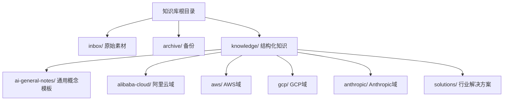
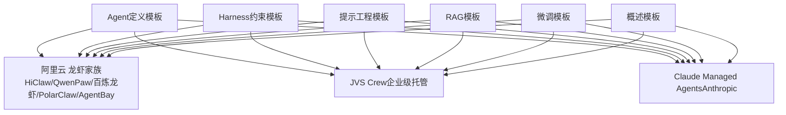
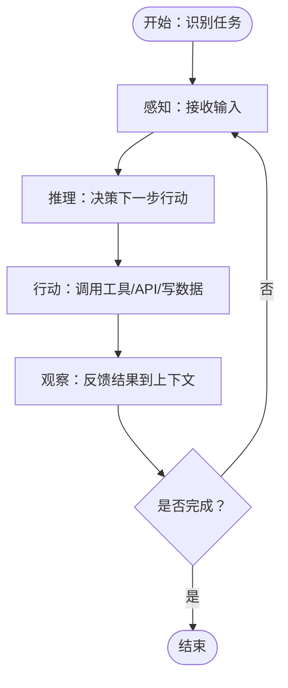
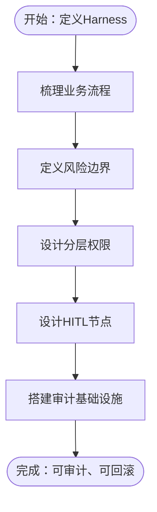
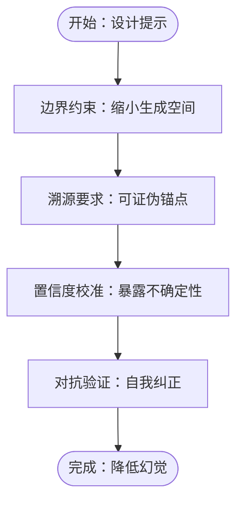
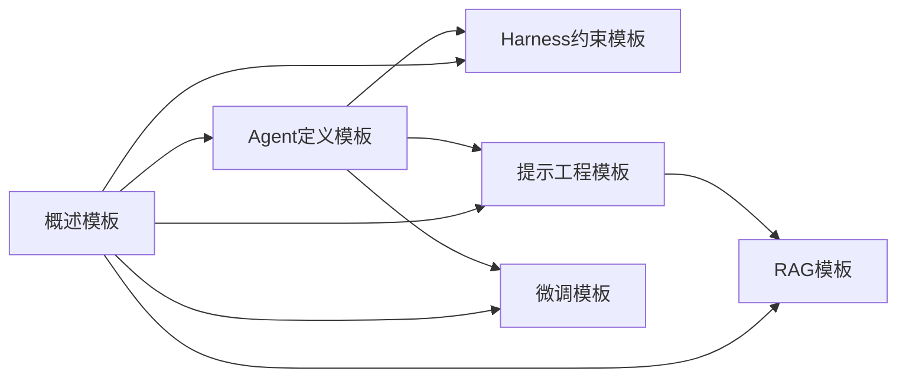

# AI通用笔记模板

<cite>
**本文引用的文件**
- [README.md](file://README.md)
- [index.md](file://index.md)
- [_template.md](file://knowledge/ai-general-notes/_template.md)
- [agent-def.md](file://knowledge/ai-general-notes/agent-def.md)
- [harness.md](file://knowledge/ai-general-notes/harness.md)
- [prompt-engineering.md](file://knowledge/ai-general-notes/prompt-engineering.md)
- [rag.md](file://knowledge/ai-general-notes/rag.md)
- [fine-tuning.md](file://knowledge/ai-general-notes/fine-tuning.md)
- [overview.md](file://knowledge/ai-general-notes/overview.md)
- [claw-family.md](file://knowledge/alibaba-cloud/ai-application/claw-family.md)
- [jvs-crew.md](file://knowledge/alibaba-cloud/ai-application/jvs-crew.md)
- [claude-managed-agents.md](file://knowledge/anthropic/ai-application/claude-managed-agents.md)
</cite>

## 目录
1. [简介](#简介)
2. [项目结构](#项目结构)
3. [核心组件](#核心组件)
4. [架构总览](#架构总览)
5. [详细组件分析](#详细组件分析)
6. [依赖分析](#依赖分析)
7. [性能考量](#性能考量)
8. [故障排查指南](#故障排查指南)
9. [结论](#结论)
10. [附录](#附录)

## 简介
本文件系统化阐述“AI通用笔记模板”的设计理念与结构组成，面向AI工程与产品落地的读者，提供可复用的知识沉淀范式。模板覆盖以下主题：Agent定义、Harness约束、概述、提示工程、微调、RAG。文档不仅解释每个模板的适用场景、核心字段、内容组织方式与最佳实践，还给出实际使用案例、模板间逻辑关系与组合策略、定制化与扩展方法，以及常见问题与注意事项。

## 项目结构
该知识库采用“主题域 + 产品域 + 解决方案域”的三层组织方式：
- 主题域：ai-general-notes 下的通用概念与方法论（Agent、Harness、Prompt Engineering、RAG、Fine-tuning、Overview）
- 产品域：按厂商与产品线组织的MaaS、AI Coding、AI App、AI Platform、AI Infra等
- 解决方案域：面向垂直行业的规模化复制案例与方法论

图表来源
- [index.md:13-69](file://index.md#L13-L69)

章节来源
- [README.md:1-20](file://README.md#L1-L20)
- [index.md:13-69](file://index.md#L13-L69)

## 核心组件
本节对六大通用模板进行概览式解读，明确其定位、核心字段与典型使用场景。

- Agent定义模板
  - 定位：系统化阐述Agent的本质、工程化要点、平台战略与厂商实现对照
  - 核心字段：一句话说明、核心价值、相关产品、感知-推理-行动-观察循环、关键选型维度、最佳实践、常见误区、参考资料、变更日志
  - 适用场景：需要统一Agent认知框架、比较不同平台能力、制定工程化规范时
  - 参考路径：[agent-def.md:1-128](file://knowledge/ai-general-notes/agent-def.md#L1-L128)

- Harness约束模板
  - 定位：强调Harness作为治理层的硬约束、企业级差异化资产
  - 核心字段：一句话说明、核心价值、相关产品、Harness构成维度、关键选型维度、厂商实现对照、最佳实践、常见误区、参考资料、变更日志
  - 适用场景：构建企业级Agent安全与合规体系、设计工具边界与人工介入点
  - 参考路径：[harness.md:1-108](file://knowledge/ai-general-notes/harness.md#L1-L108)

- 概述模板
  - 定位：对基础概念（如LLM）进行通俗解释与选型维度梳理
  - 核心字段：一句话说明、核心价值、相关产品、关键选型维度、厂商实现对照、最佳实践、常见误区、参考资料、变更日志
  - 适用场景：快速建立跨厂商对比与选型基线
  - 参考路径：[overview.md:1-42](file://knowledge/ai-general-notes/overview.md#L1-L42)

- 提示工程模板
  - 定位：以第一性原理解释幻觉机制，提出四层防幻觉约束
  - 核心字段：一句话说明、核心价值、相关产品、核心原理（幻觉微结构机制、四层机制）、关键选型维度、厂商实现对照、最佳实践、常见误区、参考资料、变更日志
  - 适用场景：降低幻觉、提升可控性与可信度，结合RAG形成完整方案
  - 参考路径：[prompt-engineering.md:1-193](file://knowledge/ai-general-notes/prompt-engineering.md#L1-L193)

- 微调模板
  - 定位：在预训练基础上使用领域数据继续训练以适配特定任务
  - 核心字段：一句话说明、核心价值、相关产品、核心原理、关键选型维度、厂商实现对照、最佳实践、常见误区、参考资料、变更日志
  - 适用场景：垂直领域能力提升、成本敏感场景下的稳定输出
  - 参考路径：[fine-tuning.md:1-42](file://knowledge/ai-general-notes/fine-tuning.md#L1-L42)

- RAG模板
  - 定位：结合检索与生成的增强生成技术
  - 核心字段：一句话说明、核心价值、相关产品、核心原理、关键选型维度、厂商实现对照、最佳实践、常见误区、参考资料、变更日志
  - 适用场景：需要利用外部知识减少幻觉、提升事实性与时效性
  - 参考路径：[rag.md:1-42](file://knowledge/ai-general-notes/rag.md#L1-L42)

章节来源
- [agent-def.md:1-128](file://knowledge/ai-general-notes/agent-def.md#L1-L128)
- [harness.md:1-108](file://knowledge/ai-general-notes/harness.md#L1-L108)
- [overview.md:1-42](file://knowledge/ai-general-notes/overview.md#L1-L42)
- [prompt-engineering.md:1-193](file://knowledge/ai-general-notes/prompt-engineering.md#L1-L193)
- [fine-tuning.md:1-42](file://knowledge/ai-general-notes/fine-tuning.md#L1-L42)
- [rag.md:1-42](file://knowledge/ai-general-notes/rag.md#L1-L42)

## 架构总览
通用模板与产品实践的映射关系如下：

图表来源
- [agent-def.md:78-88](file://knowledge/ai-general-notes/agent-def.md#L78-L88)
- [harness.md:58-68](file://knowledge/ai-general-notes/harness.md#L58-L68)
- [prompt-engineering.md:119-134](file://knowledge/ai-general-notes/prompt-engineering.md#L119-L134)
- [claw-family.md:1-137](file://knowledge/alibaba-cloud/ai-application/claw-family.md#L1-L137)
- [jvs-crew.md:1-96](file://knowledge/alibaba-cloud/ai-application/jvs-crew.md#L1-L96)
- [claude-managed-agents.md:1-97](file://knowledge/anthropic/ai-application/claude-managed-agents.md#L1-L97)

## 详细组件分析

### Agent定义模板
- 设计理念
  - 将Agent视为“不确定性受控的for循环”，强调感知-推理-行动-观察的工程闭环
  - 明确“Model + Harness”是Agent平台的战略支点，Harness决定产品可用性上限
- 核心字段与组织方式
  - 一句话说明、核心价值、相关产品：用于快速建立认知基线
  - 感知-推理-行动-观察循环：表格化呈现工程关键点
  - 关键选型维度：单Agent vs 多Agent（Manager-Worker）的权衡
  - 各厂商实现对照：突出平台能力差异与适用场景
  - 最佳实践：老代码改造三步法、工程化要点
  - 常见误区：将Agent等同于高级Prompt、模型越强越好等
- 适用场景
  - 产品/平台选型：对比不同厂商Agent平台的适用性
  - 工程落地：指导Agent系统设计与风险控制
- 实际使用案例
  - 企业级Agent平台选型：结合Harness能力与合规要求，选择JVS Crew或Claude Managed Agents
  - 多Agent协作：在任务可并行拆解且可靠性要求高的场景，采用Manager-Worker架构
- 模板间关系
  - 与Harness模板互补：Harness提供约束与治理，Agent模板提供执行框架
  - 与提示工程模板互补：Agent循环中嵌入Prompt工程的约束层
- 定制化与扩展
  - 可按行业细化“关键选型维度”，如金融/医疗的合规与审计要求
  - 可加入“退出条件显式化”“上下文压缩”等工程实践清单

图表来源
- [agent-def.md:60-68](file://knowledge/ai-general-notes/agent-def.md#L60-L68)

章节来源
- [agent-def.md:1-128](file://knowledge/ai-general-notes/agent-def.md#L1-L128)

### Harness约束模板
- 设计理念
  - Harness是“缰绳+鞍具”，不是模型，但决定Agent能否安全可控地运行
  - 企业级Harness是差异化竞争护城河，越通用越没价值
- 核心字段与组织方式
  - 一句话说明、核心价值、相关产品：强调Harness的战略资产属性
  - Harness构成维度：工具边界、业务规则、人工介入点、凭证隔离、审计追踪、退出条件
  - 关键选型维度：轻量Harness vs 企业级Harness的取舍
  - 各厂商实现对照：RBAC、凭证隔离、审计日志、SSO等能力差异
  - 最佳实践：业务流程梳理、风险边界定义、分层权限设计、HITL节点设计、审计先行
  - 常见误区：将Prompt当作Harness、Harness通用化可复用
- 适用场景
  - 高合规行业（金融/医疗/政企）：强制人工介入、不可变审计日志、凭证隔离
  - 个人/开发者工具：轻量权限控制与最小化约束
- 实际使用案例
  - 企业级Agent平台：JVS Crew的零凭证架构、全链路追踪与按会话计费
  - 对比分析：Claude Managed Agents的gVisor沙箱与Vault机制
- 模板间关系
  - 与Agent模板互补：Harness为Agent提供硬约束与可观测性
  - 与提示工程模板互补：Prompt用于软约束，Harness用于硬约束
- 定制化与扩展
  - 可按行业细化“风险边界定义”“人工介入点设计”
  - 可引入“凭证隔离”“网络隔离”“SSO/AD”等企业级能力清单

图表来源
- [harness.md:71-78](file://knowledge/ai-general-notes/harness.md#L71-L78)

章节来源
- [harness.md:1-108](file://knowledge/ai-general-notes/harness.md#L1-L108)

### 提示工程模板
- 设计理念
  - 幻觉的微结构机制：logits分布、采样策略、RLHF引入的“讨好偏差”
  - 防幻觉四层机制：边界约束、溯源要求、置信度校准、对抗验证
  - “道德约束”无效，需要结构性约束
- 核心字段与组织方式
  - 一句话说明、核心价值、相关产品：强调降低幻觉与提升可信度
  - 核心原理：幻觉微结构机制、四层机制、博弈论视角
  - 关键选型维度：约束强度对比（幻觉率降低、输出长度、推理延迟、Token成本）
  - 各厂商实现对照：中文SFT数据多、Constitutional AI、通用训练等底层原因
  - 最佳实践：整合提示词模板、可迁移应用场景、与RAG的关系
  - 常见误区：请说实话无效、RAG完全解决幻觉、四层机制无代价
- 适用场景
  - 财务审计、用户调研、代码审查、采访提问等需要强验证的场景
  - 与RAG结合形成“检索+四层约束”的最低幻觉方案
- 实际使用案例
  - 企业级Agent平台：在Agent循环中嵌入提示工程约束层
  - 跨厂商对比：不同模型在四层机制上的侧重点差异
- 模板间关系
  - 与Agent模板互补：在感知-推理-行动-观察中嵌入提示工程约束
  - 与RAG模板互补：RAG提供边界与溯源，提示工程提供置信度与自查
- 定制化与扩展
  - 可按任务类型调整四层机制的组合强度
  - 可引入“熵值-准确性相关性”等量化指标

图表来源
- [prompt-engineering.md:46-79](file://knowledge/ai-general-notes/prompt-engineering.md#L46-L79)

章节来源
- [prompt-engineering.md:1-193](file://knowledge/ai-general-notes/prompt-engineering.md#L1-L193)

### RAG模板
- 设计理念
  - 结合检索与生成的增强生成技术，利用外部知识减少幻觉
  - RAG是“边界约束+溯源要求”的系统级实现，但通常缺少置信度与自查
- 核心字段与组织方式
  - 一句话说明、核心价值、相关产品：强调外部知识增强与幻觉抑制
  - 核心原理：检索与生成的结合机制
  - 关键选型维度：召回质量、生成质量、延迟与成本权衡
  - 各厂商实现对照：不同平台的检索与生成能力差异
  - 最佳实践：与提示工程四层机制结合，形成完整方案
  - 常见误区：RAG完全解决幻觉、忽视成本与延迟
- 适用场景
  - 需要事实性与时效性强的问答与生成任务
  - 与提示工程模板组合，补齐置信度与自查
- 实际使用案例
  - 企业级Agent平台：在Agent循环中嵌入RAG作为“感知”阶段的知识来源
  - 跨厂商对比：不同平台的检索与生成能力差异
- 模板间关系
  - 与提示工程模板互补：RAG提供边界与溯源，提示工程提供置信度与自查
- 定制化与扩展
  - 可按领域细化检索策略与生成策略
  - 可引入“检索质量评估”“生成一致性评估”等指标

章节来源
- [rag.md:1-42](file://knowledge/ai-general-notes/rag.md#L1-L42)

### 微调模板
- 设计理念
  - 在预训练模型基础上，使用领域数据继续训练以适配特定任务
  - 适用于垂直领域能力提升与成本敏感场景
- 核心字段与组织方式
  - 一句话说明、核心价值、相关产品：强调垂直领域适配
  - 核心原理：微调的训练机制与适用场景
  - 关键选型维度：数据质量、计算资源、效果评估
  - 各厂商实现对照：不同平台的微调能力差异
  - 最佳实践：数据准备、训练策略、效果评估
  - 常见误区：微调一定优于提示工程、忽视数据隐私与合规
- 适用场景
  - 垂直领域（法律/金融/医疗）的稳定输出与成本优化
  - 与提示工程模板结合，形成“提示+微调”的混合策略
- 实际使用案例
  - 企业级Agent平台：在Agent循环中结合微调模型与提示工程
- 模板间关系
  - 与提示工程模板互补：微调提升稳定性，提示工程提升可控性
- 定制化与扩展
  - 可按领域细化数据准备与评估指标
  - 可引入“增量微调”“参数高效微调”等策略

章节来源
- [fine-tuning.md:1-42](file://knowledge/ai-general-notes/fine-tuning.md#L1-L42)

### 概述模板
- 设计理念
  - 对基础概念（如LLM）进行通俗解释，建立跨厂商对比基线
- 核心字段与组织方式
  - 一句话说明、核心价值、相关产品：快速建立认知基线
  - 关键选型维度：厂商能力对比与选型建议
  - 各厂商实现对照：产品能力差异
  - 最佳实践：快速上手与迭代
  - 常见误区：概念混淆与过度抽象
- 适用场景
  - 新人入门、快速选型、跨厂商对比
- 实际使用案例
  - 与Agent/Harness/Prompt Engineering模板配合，形成“基础概念—工程实践—平台能力”的完整认知链
- 模板间关系
  - 作为其他模板的前置基础，帮助建立统一术语与基线
- 定制化与扩展
  - 可按领域细化“关键选型维度”与“厂商实现对照”

章节来源
- [overview.md:1-42](file://knowledge/ai-general-notes/overview.md#L1-L42)

## 依赖分析
通用模板与产品实践的依赖关系如下：

图表来源
- [agent-def.md:31-40](file://knowledge/ai-general-notes/agent-def.md#L31-L40)
- [harness.md:26-35](file://knowledge/ai-general-notes/harness.md#L26-L35)
- [prompt-engineering.md:157-160](file://knowledge/ai-general-notes/prompt-engineering.md#L157-L160)
- [overview.md:1-42](file://knowledge/ai-general-notes/overview.md#L1-L42)

章节来源
- [agent-def.md:1-128](file://knowledge/ai-general-notes/agent-def.md#L1-L128)
- [harness.md:1-108](file://knowledge/ai-general-notes/harness.md#L1-L108)
- [prompt-engineering.md:1-193](file://knowledge/ai-general-notes/prompt-engineering.md#L1-L193)
- [rag.md:1-42](file://knowledge/ai-general-notes/rag.md#L1-L42)
- [fine-tuning.md:1-42](file://knowledge/ai-general-notes/fine-tuning.md#L1-L42)
- [overview.md:1-42](file://knowledge/ai-general-notes/overview.md#L1-L42)

## 性能考量
- 幻觉抑制与成本权衡
  - 提示工程四层机制在显著降低幻觉的同时，会带来输出长度与Token成本上升、推理延迟增加，需根据实时性与预算进行取舍
- Agent循环的可观测性
  - 在感知-推理-行动-观察的每一步保留日志与回滚能力，有助于定位性能瓶颈与错误传播路径
- RAG与提示工程的组合
  - RAG提供边界与溯源，提示工程提供置信度与自查，二者结合可显著降低幻觉，但需注意检索与生成的端到端延迟
- 微调的性价比
  - 微调适合垂直领域稳定输出与成本敏感场景，需平衡数据准备、训练成本与效果评估

## 故障排查指南
- 常见误区与对策
  - 将Agent等同于高级Prompt：应在Harness中建立硬约束，避免仅依赖模型遵从
  - 认为Harness可以通用化复用：Harness越通用越没价值，需按行业特性深度定制
  - 仅依赖RAG解决幻觉：RAG缺置信度与自查，需结合提示工程四层机制
  - 请说实话能减少幻觉：软约束无效，需结构性约束
- 工程化要点
  - 退出条件显式化：设置最大步数、超时等硬性终止条件
  - 工具幂等性：可重试的操作必须幂等，不可逆操作需人工确认门
  - 上下文压缩：长循环中定期摘要/截断，避免上下文膨胀
  - 可观测性优先：每一步感知-行动-观察均需日志，便于调试与审计
- 产品实践对照
  - JVS Crew：零凭证架构、全链路追踪、按会话计费，适合内网+SSO+合规审计场景
  - Claude Managed Agents：gVisor沙箱、Vault凭证隔离、不可变审计日志，适合顶级模型能力优先场景
  - 阿里云“龙虾家族”：多Agent协作、数据库深度优化、云基础设施（AgentBay）

章节来源
- [agent-def.md:108-116](file://knowledge/ai-general-notes/agent-def.md#L108-L116)
- [harness.md:90-97](file://knowledge/ai-general-notes/harness.md#L90-L97)
- [prompt-engineering.md:162-170](file://knowledge/ai-general-notes/prompt-engineering.md#L162-L170)
- [jvs-crew.md:29-36](file://knowledge/alibaba-cloud/ai-application/jvs-crew.md#L29-L36)
- [claude-managed-agents.md:31-38](file://knowledge/anthropic/ai-application/claude-managed-agents.md#L31-L38)
- [claw-family.md:77-88](file://knowledge/alibaba-cloud/ai-application/claw-family.md#L77-L88)

## 结论
AI通用笔记模板以“Agent定义—Harness约束—提示工程—RAG—微调—概述”为主线，构建了从概念到工程再到产品实践的完整知识谱系。通过标准化的模板字段与组织方式，读者可在不同AI应用场景中快速建立统一认知、制定工程规范、进行厂商对比与落地实施。模板间的逻辑关系清晰：Harness为Agent提供硬约束与可观测性，提示工程提供结构性约束与幻觉抑制，RAG与微调分别从知识增强与领域适配角度提升效果。结合实际产品实践（如JVS Crew、Claude Managed Agents、“龙虾家族”），可进一步完善模板的定制化与扩展策略。

## 附录
- 使用模板的组合策略
  - 通用场景：概述模板 + Agent定义模板 + Harness约束模板 + 提示工程模板
  - 企业级场景：在上述基础上叠加RAG模板与微调模板，形成“检索+提示+微调”的混合方案
  - 产品对比：在Agent/Harness/Prompt Engineering/RAG/微调模板中插入“厂商实现对照”区块
- 模板定制化与扩展
  - 可按行业细化关键选型维度（如金融/医疗的合规与审计要求）
  - 可引入量化指标（如熵值-准确性相关性、检索质量评估、生成一致性评估）
  - 可扩展“最佳实践”区块，加入可迁移应用场景与跨领域方法论