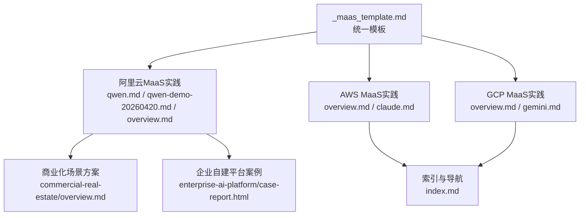
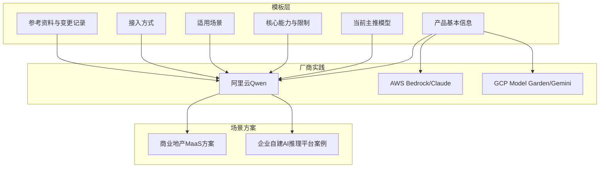
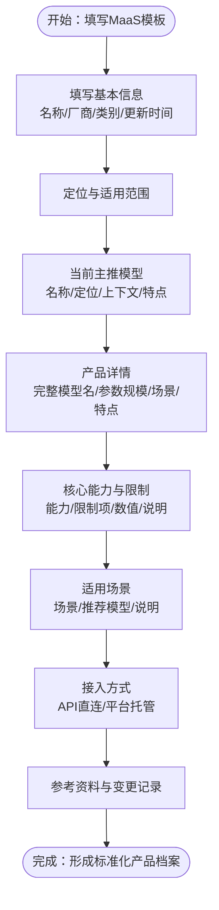
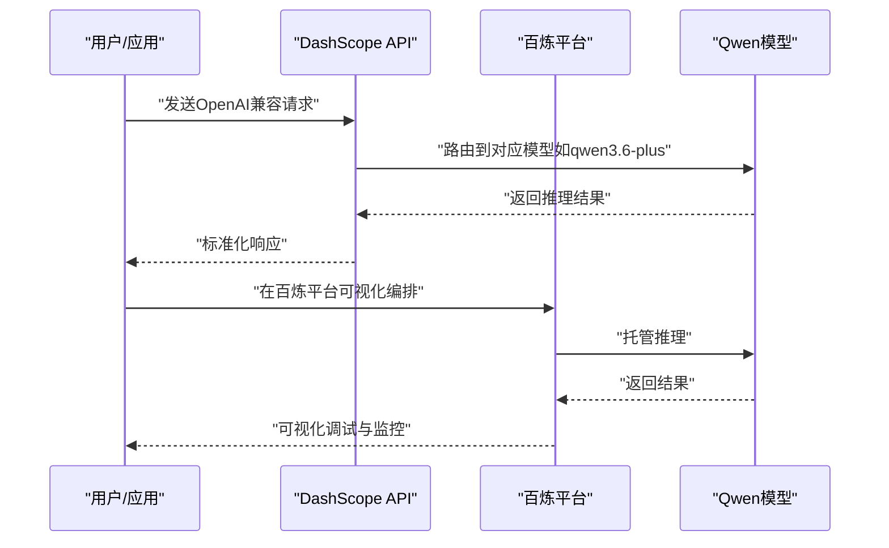
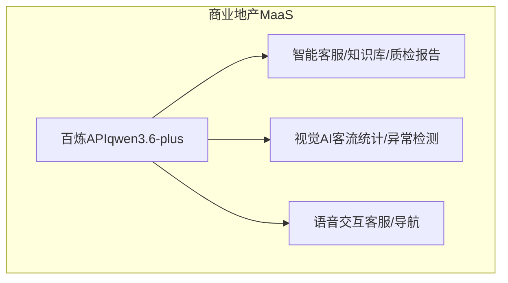
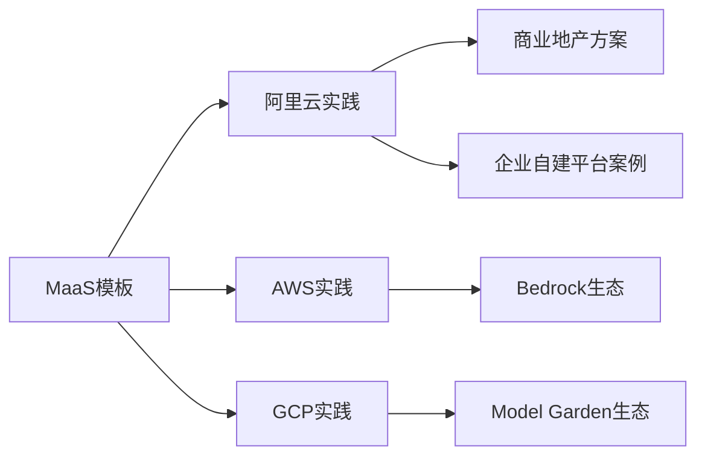

# MaaS产品模板

<cite>
**本文档引用的文件**
- [_maas_template.md](file://knowledge/_maas_template.md)
- [qwen.md](file://knowledge/alibaba-cloud/maas/qwen.md)
- [qwen-demo-20260420.md](file://knowledge/alibaba-cloud/maas/qwen-demo-20260420.md)
- [claude-api.md](file://knowledge/anthropic/maas/claude-api.md)
- [claude.md](file://knowledge/aws/maas/claude.md)
- [overview.md](file://knowledge/aws/maas/overview.md)
- [gemini.md](file://knowledge/gcp/maas/gemini.md)
- [overview.md](file://knowledge/gcp/maas/overview.md)
- [overview.md](file://knowledge/alibaba-cloud/maas/overview.md)
- [overview.md](file://knowledge/ai-general-notes/overview.md)
- [overview.md](file://index.md)
- [overview.md](file://knowledge/solutions/commercial-real-estate/overview.md)
- [overview.html](file://knowledge/solutions/enterprise-ai-platform/case-report.html)
</cite>

## 目录
1. [简介](#简介)
2. [项目结构](#项目结构)
3. [核心组件](#核心组件)
4. [架构总览](#架构总览)
5. [详细组件分析](#详细组件分析)
6. [依赖关系分析](#依赖关系分析)
7. [性能考量](#性能考量)
8. [故障排查指南](#故障排查指南)
9. [结论](#结论)
10. [附录](#附录)

## 简介
本文件系统化梳理MaaS（Model as a Service）产品模板的设计与标准化结构，覆盖产品基本信息、技术规格、性能指标、定价策略、部署方式等核心字段，并结合阿里云、AWS、GCP等厂商的实践案例，提供模板在不同云环境下的适配方法、差异化处理、评估维度与对比标准、版本管理与更新机制，以及最佳实践与常见问题解决方案。

## 项目结构
该知识库围绕“MaaS”主题构建了统一模板与多厂商实践案例，形成“模板-示例-对比-方案”的结构化组织：
- 模板层：统一的MaaS模板文件，定义字段与填写规范
- 示例层：各厂商代表性产品（如Qwen、Claude、Gemini）的模板化案例
- 对比层：跨厂商概览与对比分析，帮助选型与差异化定位
- 方案层：面向行业场景的MaaS应用方案与落地建议

图表来源
- [知识库索引](file://index.md)
- [阿里云MaaS概览](file://knowledge/alibaba-cloud/maas/overview.md)
- [AWS MaaS概览](file://knowledge/aws/maas/overview.md)
- [GCP MaaS概览](file://knowledge/gcp/maas/overview.md)

章节来源
- [知识库索引](file://index.md)

## 核心组件
MaaS产品模板由以下核心字段构成，用于统一描述与比较不同厂商的模型服务能力：

- 基本信息
  - 产品名称与所属厂商
  - 产品类别与状态
  - 最后更新时间
- 产品定位与适用范围
  - 产品定位与当前主推系列/型号
  - 适用与不适用场景
- 当前主推模型
  - 模型名称、定位、上下文长度、特点
- 产品详情
  - 完整模型名、公司、发布时间、参数规模、上下文长度、主要场景、核心特点
- 核心能力与限制
  - 能力列表与说明
  - 限制项、具体数值与说明
- 适用场景
  - 场景、推荐模型、说明
- 接入方式
  - API直连、平台托管等接入路径与适用场景
- 关键技术论文与参考资料
  - 论文主题、核心观点、影响
- 变更记录
  - 日期与变更内容

章节来源
- [MaaS模板](file://knowledge/_maas_template.md)

## 架构总览
MaaS模板在知识库中的作用是“标准化描述”，在实际应用中则体现为“厂商实践 + 场景方案”的协同架构：
- 模板标准化：确保不同厂商、不同产品在相同维度下可比
- 厂商实践：以Qwen、Claude、Gemini为例，展示模板在不同云上的落地形态
- 场景方案：结合商业化场景（如商业地产）与企业自建平台案例，提供落地参考

图表来源
- [MaaS模板](file://knowledge/_maas_template.md)
- [阿里云Qwen](file://knowledge/alibaba-cloud/maas/qwen.md)
- [AWS Bedrock概览](file://knowledge/aws/maas/overview.md)
- [GCP Model Garden概览](file://knowledge/gcp/maas/overview.md)
- [商业地产MaaS方案](file://knowledge/solutions/commercial-real-estate/overview.md)
- [企业自建平台案例](file://knowledge/solutions/enterprise-ai-platform/case-report.html)

## 详细组件分析

### 组件A：统一MaaS模板
- 设计原则
  - 结构化字段：确保信息可检索、可比较
  - 可扩展性：为新增厂商/产品留白
  - 可追溯性：变更记录与最后更新时间
- 关键字段说明
  - 产品定位与适用范围：帮助快速筛选是否满足业务场景
  - 当前主推模型：明确不同定位（旗舰/均衡/轻量）与上下文长度
  - 核心能力与限制：量化能力边界，便于风险控制
  - 适用场景：场景化推荐，降低试错成本
  - 接入方式：API直连与平台托管的差异与取舍
  - 参考资料与变更记录：权威来源与版本演进

图表来源
- [MaaS模板](file://knowledge/_maas_template.md)

章节来源
- [MaaS模板](file://knowledge/_maas_template.md)

### 组件B：阿里云Qwen（模板化案例）
- 产品定位与主推系列
  - 定位：阿里云自研大模型系列，覆盖文本/代码/多模态，开源+商业双轨并行
  - 主推：Qwen3.6系列（Max/Plus/Flash），明确旗舰、均衡、轻量三档定位
- 产品详情
  - Qwen3.6-Plus：1M上下文、Agentic Coding强、多模态、GA状态、中文强
  - Qwen3.6-Max-Preview：256K上下文、MoE架构、深度推理强、Preview期免费
  - Qwen3.6-Max：待发布，1M上下文，旗舰推理能力
- 核心能力与限制
  - 能力：深度推理、Agentic Coding、超长上下文、多模态理解、多语言、代码生成、开源生态
  - 限制：Max上下文窗口较小、Preview稳定性、Max多模态限制、Max定价偏高、Plus深度推理略弱
- 适用场景
  - AI Agent/自动编程、科研/数学/复杂推理、长文档分析、多模态理解、生产环境稳定性、极致智能、企业智能客服、代码辅助、高并发轻量调用、私有化部署
- 接入方式
  - API直连：DashScope API，兼容OpenAI格式
  - 平台托管：百炼平台，可视化编排
- 参考资料与变更记录
  - 来源：Artificial Analysis、智源社区、官方博客、GitHub、百炼平台

图表来源
- [Qwen产品文档](file://knowledge/alibaba-cloud/maas/qwen.md)
- [Qwen演示脚本](file://knowledge/alibaba-cloud/maas/qwen-demo-20260420.md)

章节来源
- [Qwen产品文档](file://knowledge/alibaba-cloud/maas/qwen.md)
- [Qwen演示脚本](file://knowledge/alibaba-cloud/maas/qwen-demo-20260420.md)

### 组件C：AWS Bedrock与Claude（模板化案例）
- 产品定位
  - Bedrock：AWS托管大模型服务，一键调用主流Foundation Models
  - Claude on Bedrock：Anthropic Claude系列模型在Bedrock上的托管服务
- 适配要点
  - 通过Bedrock统一入口调用多厂商模型，简化集成
  - Claude系列（Opus/Sonnet/Haiku）在Bedrock上按需托管与计费
- 差异化处理
  - 与阿里云百炼相比，Bedrock更强调“多模型路由”与“统一计费”
  - 适合已有AWS生态的企业快速迁移与扩展

章节来源
- [AWS Bedrock概览](file://knowledge/aws/maas/overview.md)
- [Claude on Bedrock](file://knowledge/aws/maas/claude.md)

### 组件D：GCP Model Garden与Gemini（模板化案例）
- 产品定位
  - Model Garden：GCP模型市场，统一访问Google及第三方模型
  - Gemini：Google自研多模态大模型系列（Pro/Flash/Nano）
- 适配要点
  - 依托GCP生态与合规优势，提供多模态与多语言能力
  - 适合重视数据主权与合规性的企业
- 差异化处理
  - 与阿里云Qwen相比，GCP更强调多模态与合规性
  - 适合需要与GCP其他服务（如Vertex AI）联动的企业

章节来源
- [GCP Model Garden概览](file://knowledge/gcp/maas/overview.md)
- [Gemini](file://knowledge/gcp/maas/gemini.md)

### 组件E：场景化应用与对比分析
- 商业地产MaaS方案
  - 核心产品组合：百炼大模型（qwen3.6-plus）+ 视觉智能开放平台 + 智能语音交互 + 智能客服 + Qoder AI编程
  - TOKEN消耗画像与单价参考：文本模型输入约1.2/千tokens，多模态约2.0/千tokens
  - 收入提升路径：短期5-10万/月，中期10-25万/月，长期25-50万/月
- 企业自建平台案例
  - 通过Higress网关、ACK集群、GPU节点池与NAS存储，构建企业级MaaS基础设施
  - 关注成本归集、灰度发布、资源隔离与审计日志容量规划

图表来源
- [商业地产MaaS方案](file://knowledge/solutions/commercial-real-estate/overview.md)

章节来源
- [商业地产MaaS方案](file://knowledge/solutions/commercial-real-estate/overview.md)
- [企业自建平台案例](file://knowledge/solutions/enterprise-ai-platform/case-report.html)

## 依赖关系分析
- 模板与实践的耦合
  - 模板为“描述标准”，实践为“落地范式”，二者通过统一字段实现可比性
- 厂商生态依赖
  - 阿里云：百炼平台、DashScope API、开源生态
  - AWS：Bedrock、多模型路由、统一计费
  - GCP：Model Garden、Vertex AI、合规与多模态
- 场景方案依赖
  - 商业地产：MaaS API调用、视觉与语音服务、Qoder编程工具
  - 企业自建：网关、容器编排、GPU资源与存储

图表来源
- [MaaS模板](file://knowledge/_maas_template.md)
- [Qwen产品文档](file://knowledge/alibaba-cloud/maas/qwen.md)
- [AWS Bedrock概览](file://knowledge/aws/maas/overview.md)
- [GCP Model Garden概览](file://knowledge/gcp/maas/overview.md)
- [商业地产MaaS方案](file://knowledge/solutions/commercial-real-estate/overview.md)
- [企业自建平台案例](file://knowledge/solutions/enterprise-ai-platform/case-report.html)

## 性能考量
- 上下文长度与吞吐
  - 高上下文模型（如Qwen3.6-Plus/Max）适合长文档与复杂推理，但成本与延迟更高
- 多模态与并发
  - 多模态输入（图像/视频）带来更强表达能力，但计算开销更大；并发能力与账户等级相关
- 成本与定价
  - 不同模型的输入/输出单价差异较大，建议结合业务场景选择合适模型
- 稳定性与可用性
  - Preview/测试模型在稳定性与功能完整性上存在阶段性差异，生产环境建议优先选择GA状态模型

章节来源
- [Qwen产品文档](file://knowledge/alibaba-cloud/maas/qwen.md)
- [商业地产MaaS方案](file://knowledge/solutions/commercial-real-estate/overview.md)

## 故障排查指南
- API调用失败
  - 检查密钥与基础URL配置，确认API兼容性（如OpenAI格式）
  - 参考演示脚本中的调用方式与参数设置
- 上下文超限
  - 对于超长文档，优先选择高上下文模型或拆分处理
- 多模态能力不足
  - 确认当前模型是否支持多模态输入；必要时切换到支持多模态的模型
- 并发与配额
  - 根据账户等级调整并发策略，避免触发限流
- 定价与成本异常
  - 对照公开定价表核对单价与计费维度，关注输入/输出比例与包月折扣

章节来源
- [Qwen演示脚本](file://knowledge/alibaba-cloud/maas/qwen-demo-20260420.md)
- [Qwen产品文档](file://knowledge/alibaba-cloud/maas/qwen.md)
- [商业地产MaaS方案](file://knowledge/solutions/commercial-real-estate/overview.md)

## 结论
MaaS产品模板通过标准化字段与结构化描述，实现了跨厂商、跨场景的可比性与可迁移性。结合阿里云Qwen、AWS Bedrock/Claude、GCP Model Garden/Gemini等实践案例，以及商业地产与企业自建平台的落地经验，可以为企业在模型选型、部署方式、成本控制与场景适配方面提供系统化的参考路径。

## 附录

### A. 模板字段填写规范
- 产品基本信息：名称、厂商、类别、状态、最后更新时间
- 产品定位与适用范围：清晰描述定位、主推系列/型号、适用与不适用场景
- 当前主推模型：列出模型名称、定位、上下文长度、特点
- 产品详情：完整模型名、公司、发布时间、参数规模、上下文长度、主要场景、核心特点
- 核心能力与限制：能力与限制项需量化，便于风险控制
- 适用场景：场景、推荐模型、说明
- 接入方式：API直连与平台托管的差异与取舍
- 参考资料与变更记录：注明来源与版本演进

章节来源
- [MaaS模板](file://knowledge/_maas_template.md)

### B. 不同云厂商适配方法与差异化
- 阿里云
  - 优势：百炼平台、DashScope API、开源生态、中文与多模态能力
  - 适用：需要中文强、多模态、开源生态的企业
- AWS
  - 优势：Bedrock多模型路由、统一计费、生态成熟
  - 适用：已有AWS生态、需要多模型统一接入的企业
- GCP
  - 优势：Model Garden、Vertex AI、合规与多模态
  - 适用：重视数据主权与合规、需要与GCP服务联动的企业

章节来源
- [阿里云Qwen](file://knowledge/alibaba-cloud/maas/qwen.md)
- [AWS Bedrock概览](file://knowledge/aws/maas/overview.md)
- [GCP Model Garden概览](file://knowledge/gcp/maas/overview.md)

### C. 评估维度与对比标准
- 评估维度
  - 能力：深度推理、Agentic Coding、多模态、多语言、代码生成
  - 性能：上下文长度、延迟、吞吐、并发
  - 成本：输入/输出单价、包月折扣、按量计费
  - 稳定性：GA状态、Preview稳定性、SLA
  - 集成：API兼容性、平台托管、生态对接
- 对比标准
  - 同一场景下不同模型的性能与成本对比
  - 不同厂商在同一维度上的优劣势对比
  - 场景化推荐与取舍

章节来源
- [Qwen产品文档](file://knowledge/alibaba-cloud/maas/qwen.md)
- [商业地产MaaS方案](file://knowledge/solutions/commercial-real-estate/overview.md)

### D. 版本管理与更新机制
- 变更记录
  - 每次更新需记录日期与变更内容，保持可追溯性
- 更新触发
  - 模型迭代、定价调整、接入方式变化、能力边界更新
- 沟通与同步
  - 通过索引与导航文件（如index.md）维护最新链接与状态

章节来源
- [MaaS模板](file://knowledge/_maas_template.md)
- [Qwen产品文档](file://knowledge/alibaba-cloud/maas/qwen.md)
- [知识库索引](file://index.md)

### E. 最佳实践
- 选型流程
  - 明确业务场景与预算，对比能力与成本，先在Demo/POC验证
- 部署策略
  - 优先API直连与平台托管，满足快速上线；后续根据调用量与成本评估自建
- 成本优化
  - 选择合适的模型定位（旗舰/均衡/轻量），关注输入/输出比例与包月折扣
- 风险控制
  - 生产环境优先选择GA状态模型，关注Preview稳定性与功能完整性

章节来源
- [Qwen产品文档](file://knowledge/alibaba-cloud/maas/qwen.md)
- [商业地产MaaS方案](file://knowledge/solutions/commercial-real-estate/overview.md)