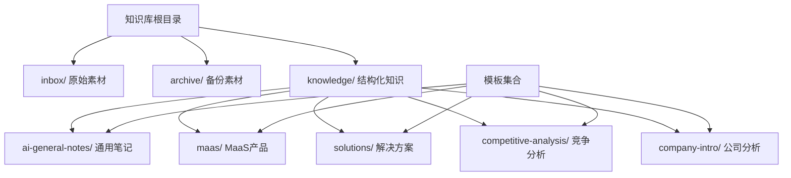
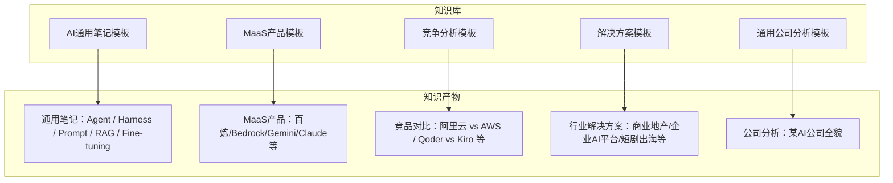
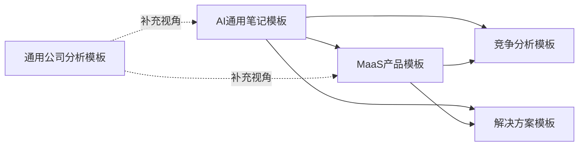
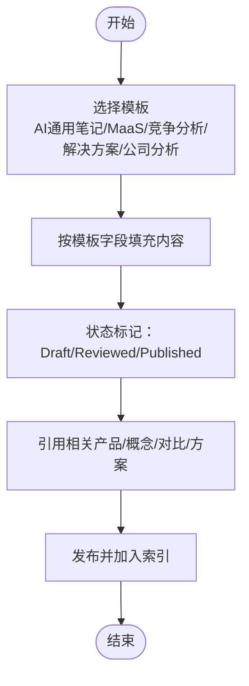

# 模板类型详解

<cite>
**本文引用的文件**
- [README.md](file://README.md)
- [index.md](file://index.md)
- [_general_company_intro_template.md](file://knowledge/_general_company_intro_template.md)
- [_maas_template.md](file://knowledge/_maas_template.md)
- [_template.md（解决方案）](file://knowledge/solutions/_template.md)
- [_template.md（竞争分析）](file://knowledge/alibaba-cloud/competitive-analysis/_template.md)
- [overview.md（AI通用笔记概览）](file://knowledge/ai-general-notes/overview.md)
- [agent-def.md（Agent定义）](file://knowledge/ai-general-notes/agent-def.md)
- [harness.md（Harness定义）](file://knowledge/ai-general-notes/harness.md)
- [prompt-engineering.md（Prompt工程）](file://knowledge/ai-general-notes/prompt-engineering.md)
- [rag.md（RAG）](file://knowledge/ai-general-notes/rag.md)
- [fine-tuning.md（微调）](file://knowledge/ai-general-notes/fine-tuning.md)
- [overview.md（商业地产解决方案）](file://knowledge/solutions/commercial-real-estate/overview.md)
- [overview.md（阿里云 vs AWS）](file://knowledge/alibaba-cloud/competitive-analysis/alibaba-vs-aws/overview.md)
</cite>

## 目录
1. [简介](#简介)
2. [项目结构](#项目结构)
3. [核心模板总览](#核心模板总览)
4. [架构总览](#架构总览)
5. [详细模板解析](#详细模板解析)
6. [依赖与组合关系](#依赖与组合关系)
7. [性能与可维护性考量](#性能与可维护性考量)
8. [故障排查与常见问题](#故障排查与常见问题)
9. [结论](#结论)
10. [附录](#附录)

## 简介
本文件面向知识库使用者与维护者，系统化梳理并讲解AI知识库中的模板体系，包括：
- AI通用笔记模板
- MaaS产品模板
- 竞争分析模板
- 解决方案模板
- 通用公司分析模板

文档从“模板用途与适用场景”“结构设计与字段定义”“内容要求与填写规范”“实际案例与最佳实践”“模板间关联与组合使用”“定制化与扩展方法”“常见问题与注意事项”七个维度展开，帮助读者高效选择与正确使用模板。

## 项目结构
知识库采用“按领域/厂商/主题分类”的结构组织，模板集中于知识库根目录与各专题目录中，便于复用与扩展。

图表来源
- [index.md:13-17](file://index.md#L13-L17)

章节来源
- [README.md:13-17](file://README.md#L13-L17)
- [index.md:13-17](file://index.md#L13-L17)

## 核心模板总览
- AI通用笔记模板：用于沉淀AI基础概念、工程方法与认知框架，强调“技术概念类”“概念洞察类”的知识结构。
- MaaS产品模板：用于标准化记录与对比MaaS产品的能力、定位、适用场景与技术论文等。
- 竞争分析模板：用于跨厂商/产品线的对比分析，突出优势、劣势与销售建议。
- 解决方案模板：面向行业/客群的端到端方案，包含客群画像、需求、架构、产品组合、竞品对比、标杆案例、销售切入等。
- 通用公司分析模板：用于公司概况、领导层、愿景使命、文化、产品矩阵、财务与算力、CXO观点、战略转型、论文影响力等的系统化梳理。

章节来源
- [index.md:62-69](file://index.md#L62-L69)

## 架构总览
模板体系与知识库的整体关系如下：

图表来源
- [index.md:6-69](file://index.md#L6-L69)
- [README.md:3-11](file://README.md#L3-L11)

## 详细模板解析

### AI通用笔记模板
- 用途与定位
  - 面向“AI领域知识（跨厂商）”，分为“技术概念类”和“概念洞察类”，用于沉淀关键选型维度与认知框架。
- 结构设计与字段
  - 标题与元信息：标题、最后更新、领域、状态
  - 摘要区：一句话说明、核心价值、相关产品
  - 主体：是什么、核心原理、关键选型维度、厂商实现对照、最佳实践、常见误区、参考资料、变更日志
- 内容要求与填写规范
  - “是什么”需用通俗语言解释核心概念
  - “核心原理”应提炼第一性原理与关键机制
  - “关键选型维度”建议采用表格对比，明确“怎么选”
  - “厂商实现对照”建议横向对比主流厂商能力
  - “最佳实践/常见误区”建议以清单形式呈现
- 实际案例与最佳实践
  - 可参考“Agent”“Harness”“Prompt Engineering”“RAG”“Fine-tuning”等已有笔记，按模板格式填充
- 模板使用建议
  - 优先在“技术概念类”中沉淀选型维度，在“概念洞察类”中沉淀认知框架
  - 与产品模板联动：在“相关产品”中指向具体产品文档

章节来源
- [index.md:8-18](file://index.md#L8-L18)
- [overview.md（AI通用笔记概览）:1-42](file://knowledge/ai-general-notes/overview.md#L1-L42)
- [agent-def.md:1-128](file://knowledge/ai-general-notes/agent-def.md#L1-L128)
- [harness.md:1-108](file://knowledge/ai-general-notes/harness.md#L1-L108)
- [prompt-engineering.md:1-193](file://knowledge/ai-general-notes/prompt-engineering.md#L1-L193)
- [rag.md:1-42](file://knowledge/ai-general-notes/rag.md#L1-L42)
- [fine-tuning.md:1-42](file://knowledge/ai-general-notes/fine-tuning.md#L1-L42)

### MaaS产品模板
- 用途与定位
  - 标准化记录MaaS产品的能力、定位、适用/不适用场景、核心能力与限制、关键技术论文、变更日志等
- 结构设计与字段
  - 标题与元信息：标题、最后更新、所属厂商、产品类别
  - 产品定位：定位、当前主推、适用、不适用
  - 当前主推模型：模型、定位、上下文、特点、推出时间
  - 产品详情：模型、公司、时间、尺寸、上下文、场景、特点
  - 能力与限制：核心能力、核心限制
  - 适用场景：✅ 适用场景
  - 技术论文与参考资料、变更日志
- 内容要求与填写规范
  - “当前主推模型”表格建议至少包含三档（旗舰/均衡/轻量）
  - “适用场景”建议以“场景-推荐模型-说明”的三元组呈现
  - “核心能力/限制”建议量化或可对比
- 实际案例与最佳实践
  - 可参考“百炼/Bedrock/Gemini/Claude”等产品文档，按模板填充
- 模板使用建议
  - 与“AI通用笔记模板”联动：在“相关产品”中引用通用笔记中的关键概念

章节来源
- [_maas_template.md:1-65](file://knowledge/_maas_template.md#L1-L65)

### 竞争分析模板
- 用途与定位
  - 用于跨厂商/产品线的对比分析，突出优势、劣势与销售建议
- 结构设计与字段
  - 标题与元信息：标题、最后更新、作者、状态
  - 摘要区：核心差异、我方优势
  - 对比维度：概览对比、核心产品矩阵对比（计算/存储/网络/数据库/AI/ML/安全）、生态与合规、定价策略差异、客户案例对比
  - 销售建议：SA建议、优势切入点、薄弱环节、话术要点
  - 参考资料、变更日志
- 内容要求与填写规范
  - “概览对比”建议至少包含全球/中国区域数量、核心优势市场、市场份额等关键指标
  - “产品矩阵对比”建议按云原生能力维度逐项对比
  - “销售建议”建议结合“我方优势切入点”“对方薄弱环节”“建议话术要点”形成闭环
- 实际案例与最佳实践
  - 可参考“阿里云 vs AWS”等已有对比分析，按模板填充
- 模板使用建议
  - 与“MaaS产品模板”联动：在“产品矩阵对比”中引用具体产品能力

章节来源
- [_template.md（竞争分析）:1-46](file://knowledge/alibaba-cloud/competitive-analysis/_template.md#L1-L46)
- [overview.md（阿里云 vs AWS）:1-46](file://knowledge/alibaba-cloud/competitive-analysis/alibaba-vs-aws/overview.md#L1-L46)

### 解决方案模板
- 用途与定位
  - 面向行业/客群的端到端方案，包含客群画像、需求、架构、产品组合、竞品对比、标杆案例、销售切入等
- 结构设计与字段
  - 标题与元信息：标题、最后更新、客群标签、状态
  - 摘要区：客群特征、核心产品、关键需求、核心优势
  - 主体：客群画像、核心需求、推荐架构、资源规划、产品组合、竞品对比、标杆案例、优化建议、销售切入、参考资料、变更日志
- 内容要求与填写规范
  - “客群画像”建议包含典型客户、业务特征、IT痛点、预算规模、迁移/升级背景
  - “核心需求”建议按优先级（P0/P1/P2）列出，并对应产品
  - “推荐架构”建议以“业务层→网关层→计算层→存储层”的分层表达
  - “产品组合”建议包含层级、产品、规格/版本、成本参考
  - “竞品对比”建议以“能力层-阿里云优势-竞品/原方案局限”的三元组呈现
  - “销售切入”建议明确决策人、切入时机、差异化卖点、POC方案
- 实际案例与最佳实践
  - 可参考“商业地产行业解决方案”等已有方案，按模板填充
- 模板使用建议
  - 与“MaaS产品模板”“AI通用笔记模板”联动：在“核心产品/关键需求/架构/产品组合”中引用具体产品与概念

章节来源
- [_template.md（解决方案）:1-108](file://knowledge/solutions/_template.md#L1-L108)
- [overview.md（商业地产解决方案）:1-217](file://knowledge/solutions/commercial-real-estate/overview.md#L1-L217)

### 通用公司分析模板
- 用途与定位
  - 用于公司概况、领导层、愿景使命、文化、产品矩阵、财务与算力、CXO观点、战略转型、论文影响力等的系统化梳理
- 结构设计与字段
  - 标题与元信息：标题、数据时效说明
  - 主体：公司概况、创始团队与核心人物、愿景与使命、企业文化、关键产品矩阵、产品收入/DAU/ARR、算力部署与规划、近期CXO核心观点、战略转型动态、数据使用建议、核心论文与影响力分析、参考资料、变更日志
- 内容要求与填写规范
  - “数据可信度提示”“估值（需核实）”等需明确标注数据来源与可信度
  - “产品矩阵”建议包含核心模型/产品系列、API与企业产品、其他业务方向
  - “收入/算力/论文”建议以表格/清单形式呈现
- 实际案例与最佳实践
  - 可参考“某AI公司分析报告”等，按模板填充
- 模板使用建议
  - 与“MaaS产品模板”“AI通用笔记模板”联动：在“产品矩阵/能力”中引用具体产品与概念

章节来源
- [_general_company_intro_template.md:1-234](file://knowledge/_general_company_intro_template.md#L1-L234)

## 依赖与组合关系
- 模板间的依赖与组合
  - AI通用笔记模板为“概念与方法论”基础，为MaaS产品模板、竞争分析模板、解决方案模板提供认知与选型维度支撑
  - MaaS产品模板为“产品能力”载体，为竞争分析模板与解决方案模板提供产品能力基础
  - 竞争分析模板与解决方案模板分别面向“横向对比”和“纵向落地”，二者可互补使用
  - 通用公司分析模板可作为“宏观视角”的补充，用于公司/行业层面的系统化梳理
- 模板组合使用示例
  - 选型阶段：先用“AI通用笔记模板”沉淀关键维度，再用“MaaS产品模板”与“竞争分析模板”做横向对比
  - 落地阶段：用“解决方案模板”输出端到端方案，配套“MaaS产品模板”“AI通用笔记模板”作为能力与方法论支撑

图表来源
- [index.md:6-69](file://index.md#L6-L69)
- [_maas_template.md:1-65](file://knowledge/_maas_template.md#L1-L65)
- [_template.md（竞争分析）:1-46](file://knowledge/alibaba-cloud/competitive-analysis/_template.md#L1-L46)
- [_template.md（解决方案）:1-108](file://knowledge/solutions/_template.md#L1-L108)
- [_general_company_intro_template.md:1-234](file://knowledge/_general_company_intro_template.md#L1-L234)

## 性能与可维护性考量
- 模板一致性
  - 统一使用“摘要区”“状态”“最后更新”“参考资料”“变更日志”等字段，确保知识可追溯
- 结构化程度
  - 优先使用表格/清单/三元组（场景-推荐模型-说明）等结构化表达，降低阅读与检索成本
- 可扩展性
  - 模板预留“相关产品”“参考资料”“变更日志”等扩展字段，便于后续补充
- 维护成本
  - 建议定期回顾“状态”字段（Draft/Reviewed/Published），避免过时内容沉淀

## 故障排查与常见问题
- 常见问题
  - 字段缺失：未填写“摘要区”“状态”“最后更新”“参考资料”“变更日志”等字段
  - 结构混乱：未按模板结构组织内容，导致阅读困难
  - 数据标注不清：未标注“数据可信度”“估值（需核实）”等风险提示
  - 产品引用不一致：产品名称、版本、定位前后不一致
- 解决方案
  - 使用模板前先对照字段清单，逐项补齐
  - 采用表格/清单/三元组等结构化表达
  - 在“数据使用建议”“摘要区”中明确标注来源与可信度
  - 建立“变更日志”并定期评审“状态”

章节来源
- [_general_company_intro_template.md:3,92,124-127,194-199:3-3](file://knowledge/_general_company_intro_template.md#L3-L3)
- [_template.md（解决方案）:7-12,99-102,103-108:7-12](file://knowledge/solutions/_template.md#L7-L12)

## 结论
模板体系以“概念—产品—对比—方案—公司分析”为主线，既满足“横向选型”又满足“纵向落地”。建议在不同阶段按需选择模板，并通过“摘要区—状态—最后更新—参考资料—变更日志”的标准化字段，确保知识的可追溯性与可维护性。

## 附录
- 模板使用流程示意

[本图为概念流程示意，无需图表来源]