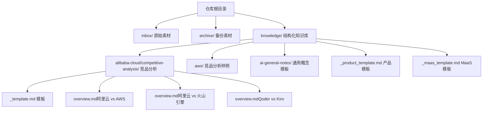
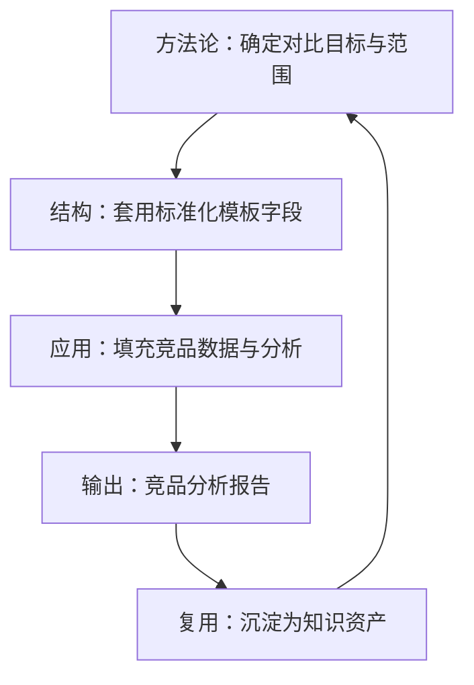
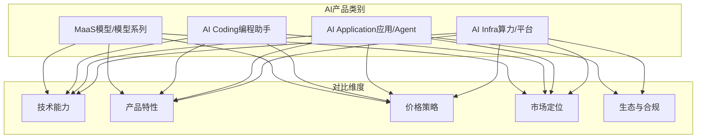
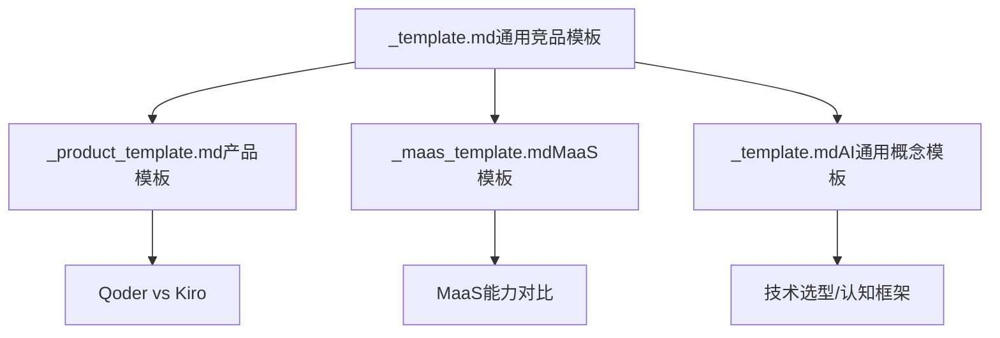

# 竞品对比模板

<cite>
**本文引用的文件**
- [_template.md](file://knowledge/alibaba-cloud/competitive-analysis/_template.md)
- [overview.md（阿里云 vs AWS）](file://knowledge/alibaba-cloud/competitive-analysis/alibaba-vs-aws/overview.md)
- [overview.md（阿里云 vs 火山引擎）](file://knowledge/alibaba-cloud/competitive-analysis/alibaba-vs-volcengine/overview.md)
- [overview.md（Qoder vs Kiro）](file://knowledge/alibaba-cloud/competitive-analysis/qoder-vs-kiro/overview.md)
- [_maas_template.md](file://knowledge/_maas_template.md)
- [_product_template.md](file://knowledge/_product_template.md)
- [_template.md（AI通用概念模板）](file://knowledge/ai-general-notes/_template.md)
- [README.md](file://README.md)
- [claw-family.md](file://knowledge/alibaba-cloud/ai-application/claw-family.md)
- [gpu-product-line.md](file://knowledge/alibaba-cloud/ai-infra/gpu-product-line.md)
- [qoder.md](file://knowledge/alibaba-cloud/ai-coding/qoder.md)
- [kiro.md](file://knowledge/aws/ai-coding/kiro.md)
- [q-business.md](file://knowledge/aws/ai-application/q-business.md)
</cite>

## 目录
1. [简介](#简介)
2. [项目结构](#项目结构)
3. [核心组件](#核心组件)
4. [架构总览](#架构总览)
5. [详细组件分析](#详细组件分析)
6. [依赖分析](#依赖分析)
7. [性能考虑](#性能考虑)
8. [故障排查指南](#故障排查指南)
9. [结论](#结论)
10. [附录](#附录)

## 简介
本文件系统化梳理竞品对比模板的设计框架与标准化结构，结合仓库内现有竞品分析样例（阿里云 vs AWS、阿里云 vs 火山引擎、Qoder vs Kiro），以及 MaaS 与产品模板，总结可复用的对比维度、评分标准与优劣势分析框架，并给出在不同 AI 产品类别（MaaS、AI Coding、AI Application、AI Infra）中的适用性与调整策略，以及竞品分析报告的撰写规范与质量控制要求。

## 项目结构
仓库以“知识沉淀”为核心目标，采用按领域与厂商分层的目录组织方式，其中竞品分析模板位于“alibaba-cloud/competitive-analysis”下，配套模板包括通用产品模板、MaaS 模板与 AI 通用概念模板。README 明确了两个 Agent 的职责分工与知识沉淀范围。

图表来源
- [README.md:1-20](file://README.md#L1-L20)
- [知识库文件分布:1-46](file://knowledge/alibaba-cloud/competitive-analysis/_template.md#L1-L46)

章节来源
- [README.md:1-20](file://README.md#L1-L20)

## 核心组件
- 竞品对比模板（通用）：提供标准化的概览、产品矩阵、生态合规、定价策略、客户案例、销售建议、参考资料与变更记录等结构化字段，便于快速填充与复用。
- 产品对比模板（AI Coding/应用/平台）：聚焦产品定位、原理解析、适用边界、竞品对照、踩坑记录与最佳实践，强调“如何做”的可操作性。
- MaaS 模板：面向模型/模型系列的产品化文档，涵盖定位、主推模型、核心能力与限制、适用场景、关键技术论文与参考链接。
- AI 通用概念模板：用于提炼技术概念、关键选型维度与认知框架，支撑跨厂商实现对照与方法论沉淀。

章节来源
- [_template.md:1-46](file://knowledge/alibaba-cloud/competitive-analysis/_template.md#L1-L46)
- [_product_template.md:1-62](file://knowledge/_product_template.md#L1-L62)
- [_maas_template.md:1-65](file://knowledge/_maas_template.md#L1-L65)
- [_template.md（AI通用概念模板）:1-75](file://knowledge/ai-general-notes/_template.md#L1-L75)

## 架构总览
竞品对比模板的“方法论—结构—应用”三层架构如下：

该流程贯穿“知识沉淀—竞品分析—方法论固化”的闭环，确保每次分析既有统一结构，又能针对具体产品类别灵活调整。

## 详细组件分析

### 通用竞品对比模板（阿里云 vs…）
- 模板字段与用途
  - 概览对比：宏观维度（全球/中国区域、核心优势市场、市场份额）快速比对。
  - 核心产品矩阵对比：按计算/存储/网络/数据库/AI/安全等维度展开，便于横向对比。
  - 生态与合规：厂商生态、合规资质、政策影响等软实力维度。
  - 定价策略差异：计费模式、折扣策略、打包方案等。
  - 客户案例对比：典型落地案例与效果，增强说服力。
  - SA 销售打法建议：优势切入、对方薄弱环节、话术要点。
  - 参考资料与变更记录：保证溯源与版本管理。

- 模板应用示例
  - 阿里云 vs AWS：沿用同一模板，填充双方在区域、产品矩阵、定价与生态上的差异。
  - 阿里云 vs 火山引擎：同模板结构，聚焦国内市场的差异化竞争。
  - Qoder vs Kiro：在“概览对比”基础上，增加“产品定位”“核心功能对比”“技术架构差异”“性能/体验对比”“生态集成”“优劣势总结”“SA 推荐策略”。

- 评分与权重建议（可选）
  - 可在“概览对比”或“核心产品矩阵对比”中引入评分维度（如：1-5 分），并设定权重（如：产品成熟度 20%、技术先进性 25%、生态完善度 20%、定价竞争力 20%、客户案例影响力 15%），形成量化结论与排序。

章节来源
- [_template.md:1-46](file://knowledge/alibaba-cloud/competitive-analysis/_template.md#L1-L46)
- [overview.md（阿里云 vs AWS）:1-46](file://knowledge/alibaba-cloud/competitive-analysis/alibaba-vs-aws/overview.md#L1-L46)
- [overview.md（阿里云 vs 火山引擎）:1-46](file://knowledge/alibaba-cloud/competitive-analysis/alibaba-vs-volcengine/overview.md#L1-L46)
- [overview.md（Qoder vs Kiro）:1-50](file://knowledge/alibaba-cloud/competitive-analysis/qoder-vs-kiro/overview.md#L1-L50)

### 产品对比模板（AI Coding/应用/平台）
- 模板字段与用途
  - 产品原理解析：一句话定位、底层原理（通俗版）、核心限制。
  - 适用边界分析：适用/不适用场景、常见误解与替代方案。
  - 关键配置与最佳实践：踩坑记录、配置清单、检查清单。
  - 竞品快速对照：与竞品的维度化对比表。
  - 参考资料与变更记录：来源标注与版本追踪。

- 适配案例
  - Qoder vs Kiro：在“产品定位”“核心功能对比”“技术架构差异”“性能/体验对比”“生态集成”“优劣势总结”“SA 推荐策略”等维度展开，形成可直接复用的对比框架。

章节来源
- [_product_template.md:1-62](file://knowledge/_product_template.md#L1-L62)
- [overview.md（Qoder vs Kiro）:1-50](file://knowledge/alibaba-cloud/competitive-analysis/qoder-vs-kiro/overview.md#L1-L50)

### MaaS 模板（模型/模型系列）
- 模板字段与用途
  - 定位与主推：明确产品定位、当前主推模型系列与型号、适用/不适用场景。
  - 当前主推模型：按模型名称、公司、时间、尺寸、上下文、场景、特点等维度罗列。
  - 核心能力与限制：能力说明与限制项表格化呈现。
  - 适用场景：场景化推荐与说明。
  - 关键技术论文：主题、核心观点与影响。
  - 参考资料与变更记录：来源与版本。

- 适配案例
  - 可将 MaaS 作为“AI/ML”维度下的子项纳入“核心产品矩阵对比”，并在“适用场景”中与竞品进行场景化对比。

章节来源
- [_maas_template.md:1-65](file://knowledge/_maas_template.md#L1-L65)

### AI 通用概念模板（方法论与认知框架）
- 模板字段与用途
  - 是什么：通俗解释核心概念。
  - 核心原理：底层机制、技术架构、流程图等。
  - 关键选型维度/认知框架：用于技术方案/架构选择或概念理解的决策框架。
  - 各厂商实现对照：聚焦“实现方式差异”而非“产品功能对比”。
  - 最佳实践：可操作的方法论、步骤、模板、检查清单。
  - 常见误区：列出常见误解与正确认知。
  - 参考资料与变更记录：来源标注与版本。

- 适配案例
  - 在“概览对比”“核心产品矩阵对比”中，借助“关键选型维度/认知框架”对技术能力、部署方式、安全合规等进行系统化评估。

章节来源
- [_template.md（AI通用概念模板）:1-75](file://knowledge/ai-general-notes/_template.md#L1-L75)

### 典型竞品对比案例

#### 阿里云 vs AWS
- 结构化字段：概览对比（区域、市场、份额）、产品矩阵（计算/存储/网络/数据库/AI/安全）、生态与合规、定价策略、客户案例、销售建议、参考资料、变更记录。
- 方法论要点：以“区域与生态”“产品成熟度与定价策略”“客户案例影响力”为关键维度，形成可量化的结论与建议。

章节来源
- [overview.md（阿里云 vs AWS）:1-46](file://knowledge/alibaba-cloud/competitive-analysis/alibaba-vs-aws/overview.md#L1-L46)

#### 阿里云 vs 火山引擎
- 结构化字段：与阿里云 vs AWS 类似，聚焦国内市场差异化。
- 方法论要点：突出“本土化生态”“合规与政策”“定价与打包方案”的对比。

章节来源
- [overview.md（阿里云 vs 火山引擎）:1-46](file://knowledge/alibaba-cloud/competitive-analysis/alibaba-vs-volcengine/overview.md#L1-L46)

#### Qoder vs Kiro（AI 编程助手）
- 结构化字段：产品定位（厂商、发布时间、目标用户、开源/闭源、定价模式）、核心功能对比、技术架构差异、性能/体验对比、生态集成、优劣势总结、SA 推荐策略。
- 方法论要点：以“功能矩阵”“技术架构”“生态集成”“定价模式”“用户体验”为对比维度，形成“适用客户画像、推荐场景、竞品应对话术”的闭环。

章节来源
- [overview.md（Qoder vs Kiro）:1-50](file://knowledge/alibaba-cloud/competitive-analysis/qoder-vs-kiro/overview.md#L1-L50)
- [qoder.md:1-9](file://knowledge/alibaba-cloud/ai-coding/qoder.md#L1-L9)
- [kiro.md:1-9](file://knowledge/aws/ai-coding/kiro.md#L1-L9)

### 不同 AI 产品类别的适用性与调整策略

- MaaS
  - 适用：模型能力、上下文长度、参数规模、适用场景、技术论文与限制项。
  - 调整：将 MaaS 模板中的“当前主推模型”“核心能力与限制”“适用场景”映射到“技术能力”“产品特性”“市场定位”维度。
- AI Coding
  - 适用：功能矩阵、技术架构差异、性能/体验、生态集成、定价模式。
  - 调整：以“核心功能对比”“技术架构差异”“性能/体验对比”“生态集成”为主，辅以“价格策略”“销售建议”。
- AI Application
  - 适用：产品定位、适用场景、生态集成、合规与安全、SLA/可用性。
  - 调整：在“概览对比”“产品矩阵”中强化“生态与合规”“SLA/可用性”“适用场景”等维度。
- AI Infra
  - 适用：网络拓扑、管理粒度、运维要求、灵活度、竞品对照。
  - 调整：在“概览对比”“产品矩阵”中突出“网络能力”“管理粒度”“运维要求”“灵活度”，并引入“竞品快速对照”。

章节来源
- [_maas_template.md:1-65](file://knowledge/_maas_template.md#L1-L65)
- [_product_template.md:1-62](file://knowledge/_product_template.md#L1-L62)
- [claw-family.md:1-137](file://knowledge/alibaba-cloud/ai-application/claw-family.md#L1-L137)
- [gpu-product-line.md:1-114](file://knowledge/alibaba-cloud/ai-infra/gpu-product-line.md#L1-L114)

### 评估标准与评分体系（建议）
- 维度与权重（示例）
  - 产品成熟度：20%
  - 技术先进性：25%
  - 生态完善度：20%
  - 定价竞争力：20%
  - 客户案例影响力：15%
- 评分规则（示例）
  - 1-5 分：1 分为明显落后，5 分为显著领先。
  - 加权汇总：Σ(单项得分 × 权重)。
- 输出建议
  - 形成“综合评分”“单项得分”“优劣势总结”“销售建议”等模块，便于汇报与复用。

章节来源
- [_template.md:1-46](file://knowledge/alibaba-cloud/competitive-analysis/_template.md#L1-L46)
- [overview.md（Qoder vs Kiro）:1-50](file://knowledge/alibaba-cloud/competitive-analysis/qoder-vs-kiro/overview.md#L1-L50)

### 报告撰写规范与质量控制
- 规范
  - 标题：清晰标注“竞品对比”“产品分析”“技术能力对比”等关键词。
  - 结构：严格遵循模板字段，避免遗漏关键维度。
  - 数据来源：在“参考资料”中逐条标注来源，优先官方文档、权威评测、学术论文。
  - 版本管理：在“变更记录”中记录每次修订的时间、内容与责任人。
- 质量控制
  - 双人交叉校验：至少两人审阅，确保维度一致、数据准确、逻辑严谨。
  - 一致性检查：对比维度与评分标准前后一致，避免主观偏差。
  - 可复用性：提炼“销售建议”“竞品应对话术”“适用客户画像”等可复用内容，沉淀为知识资产。

章节来源
- [_template.md:1-46](file://knowledge/alibaba-cloud/competitive-analysis/_template.md#L1-L46)
- [_product_template.md:1-62](file://knowledge/_product_template.md#L1-L62)
- [_template.md（AI通用概念模板）:1-75](file://knowledge/ai-general-notes/_template.md#L1-L75)

## 依赖分析
- 模板依赖关系
  - 通用竞品对比模板是“方法论—结构—应用”的基础，适用于所有 AI 产品类别。
  - 产品模板与 MaaS 模板分别面向“产品化文档”与“模型系列文档”，可作为“概览对比”“产品矩阵”的细化补充。
  - AI 通用概念模板提供“关键选型维度/认知框架”，用于支撑技术能力与方法论层面的评估。
- 外部依赖
  - 竞品信息来源于公开资料、官网文档、第三方评测与客户案例，需在“参考资料”中明确标注。
  - 与销售建议相关的“适用客户画像”“推荐场景”“竞品应对话术”需结合一线销售反馈持续迭代。

图表来源
- [_template.md:1-46](file://knowledge/alibaba-cloud/competitive-analysis/_template.md#L1-L46)
- [_product_template.md:1-62](file://knowledge/_product_template.md#L1-L62)
- [_maas_template.md:1-65](file://knowledge/_maas_template.md#L1-L65)
- [_template.md（AI通用概念模板）:1-75](file://knowledge/ai-general-notes/_template.md#L1-L75)

## 性能考虑
- 分析效率
  - 使用标准化模板可显著缩短首次分析时间，减少遗漏关键维度的风险。
  - 通过“竞品快速对照”“适用场景”“销售建议”等模块，快速形成可交付的分析结论。
- 数据质量
  - 优先使用官方文档与权威评测数据，避免二手信息导致的偏差。
  - 在“核心限制/常见误解”中明确数据来源与适用范围，提升可信度。
- 复用与沉淀
  - 将“销售建议”“竞品应对话术”“适用客户画像”固化为知识资产，支持后续快速复用。

## 故障排查指南
- 常见问题
  - 维度缺失：检查是否覆盖“概览对比”“产品矩阵”“生态与合规”“定价策略”“客户案例”“销售建议”等关键字段。
  - 数据不一致：核对“参考资料”中的来源与时间，确保数据时效性与准确性。
  - 主观偏差：引入“评分标准”与“加权汇总”，减少主观判断的影响。
- 处理建议
  - 双人交叉校验：至少两人审阅，确保维度一致、数据准确、逻辑严谨。
  - 持续迭代：根据一线销售反馈与市场变化，定期更新“销售建议”“竞品应对话术”“适用场景”。

章节来源
- [_template.md:1-46](file://knowledge/alibaba-cloud/competitive-analysis/_template.md#L1-L46)
- [_product_template.md:1-62](file://knowledge/_product_template.md#L1-L62)
- [_template.md（AI通用概念模板）:1-75](file://knowledge/ai-general-notes/_template.md#L1-L75)

## 结论
竞品对比模板通过“方法论—结构—应用”的闭环设计，实现了对不同 AI 产品类别（MaaS、AI Coding、AI Application、AI Infra）的标准化与可复用化。结合仓库内的样例与模板，可在保证结构完整性的同时，灵活调整对比维度与评分标准，形成高质量、可交付、可持续沉淀的竞品分析报告。

## 附录
- 参考案例
  - 阿里云 vs AWS：概览对比、产品矩阵、生态与合规、定价策略、客户案例、销售建议。
  - 阿里云 vs 火山引擎：聚焦国内市场差异化。
  - Qoder vs Kiro：产品定位、核心功能对比、技术架构差异、性能/体验对比、生态集成、优劣势总结、SA 推荐策略。
- 相关产品与模板
  - 阿里云“龙虾家族”AI Agent 产品全景：多 Agent 协作、数据库增强、执行环境等维度的对比与适用场景。
  - 阿里云 GPU 产品线选型：ECS GPU vs 灵骏 vs PAI 的网络能力、管理粒度、运维要求与灵活度对比。

章节来源
- [claw-family.md:1-137](file://knowledge/alibaba-cloud/ai-application/claw-family.md#L1-L137)
- [gpu-product-line.md:1-114](file://knowledge/alibaba-cloud/ai-infra/gpu-product-line.md#L1-L114)
- [q-business.md:1-9](file://knowledge/aws/ai-application/q-business.md#L1-L9)