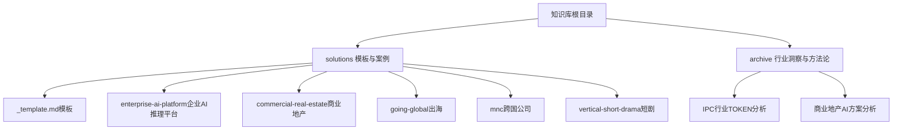
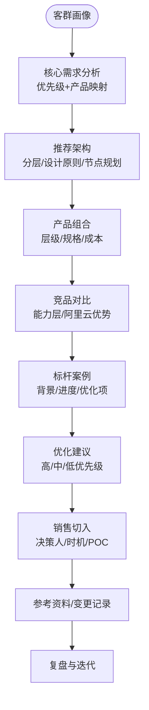
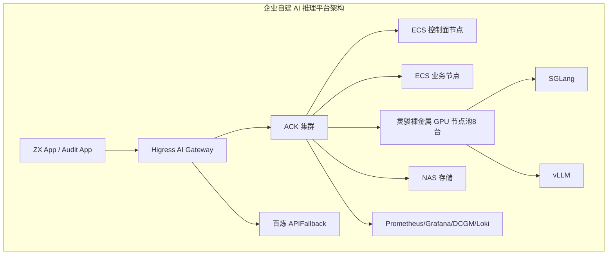
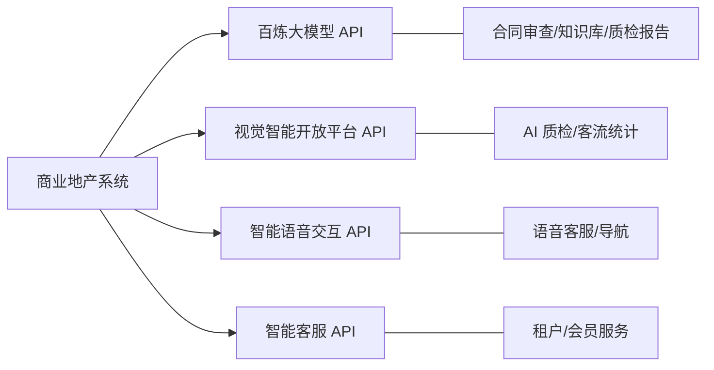
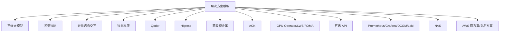

# 解决方案模板

<cite>
**本文引用的文件**
- [解决方案模板](file://knowledge/solutions/_template.md)
- [企业自建 AI 推理平台解决方案](file://knowledge/solutions/enterprise-ai-platform/overview.md)
- [企业自建 AI 推理平台 — 项目案例](file://knowledge/solutions/enterprise-ai-platform/case-report.html)
- [商业地产行业 AI 解决方案](file://knowledge/solutions/commercial-real-estate/overview.md)
- [出海企业（Going Global）解决方案分析](file://knowledge/solutions/going-global/overview.md)
- [MNC（跨国企业）解决方案分析](file://knowledge/solutions/mnc/overview.md)
- [Vertical Industry - Short Drama](file://knowledge/solutions/vertical-short-drama/overview.md)
- [IPC行业云产品方案分析 — TOKEN商业模式与AI收入提升](file://archive/IPC行业TOKEN商业模式方案分析_v1.1.0.md)
- [商业地产行业AI方案分析_聚焦AI版](file://archive/商业地产行业AI方案分析_聚焦AI版.md)
- [知识库全局索引](file://index.md)
</cite>

## 目录
1. [简介](#简介)
2. [项目结构](#项目结构)
3. [核心组件](#核心组件)
4. [架构总览](#架构总览)
5. [详细组件分析](#详细组件分析)
6. [依赖分析](#依赖分析)
7. [性能考量](#性能考量)
8. [故障排查指南](#故障排查指南)
9. [结论](#结论)
10. [附录](#附录)

## 简介
本文件系统化梳理“解决方案模板”的设计理念与标准化结构，覆盖解决方案概述、实施策略、技术架构、资源配置、风险评估、效果评估等核心模块，并结合企业自建 AI 推理平台、商业地产、出海业务、跨国公司、智能安防（IPC）、短剧制作等垂直场景的适配方法，提供完整案例分析与最佳实践。同时阐明标准化设计流程与质量控制标准，说明模板的定制化开发与扩展机制，并总结常见问题与经验。

## 项目结构
解决方案模板位于知识库的 solutions 目录，采用“模板 + 垂直行业示例”的组织方式：
- 模板文件：提供标准化结构与填写指引，确保不同行业与客群的方案一致性
- 行业示例：以真实案例为蓝本，展示模板在不同场景中的落地形态
- 归档资料：沉淀行业洞察与方法论，支撑模板的持续演进

**图表来源**
- [知识库全局索引:55-68](file://index.md#L55-L68)

**章节来源**
- [知识库全局索引:55-68](file://index.md#L55-L68)

## 核心组件
模板围绕“客群画像—核心需求—推荐架构—产品组合—竞品对比—标杆案例—优化建议—销售切入—参考资料—变更记录”构建标准化结构，确保方案可复制、可落地、可评估。

- 客群画像：典型客户、业务特征、IT痛点、预算规模、迁移背景
- 核心需求：按优先级梳理需求与对应产品
- 推荐架构：三层或多层架构示意与设计原则
- 资源规划：角色、形态、数量、用途
- 产品组合：层级、产品、规格/版本、成本参考
- 竞品对比：能力层对比与阿里云优势
- 标杆案例：背景、已实施、当前进度、关键优化项
- 优化建议：高/中/低优先级建议
- 销售切入：决策人、切入时机、差异化卖点、POC建议
- 参考资料：外部链接与内部文档
- 变更记录：版本演进与责任人

**章节来源**
- [解决方案模板:1-108](file://knowledge/solutions/_template.md#L1-L108)

## 架构总览
模板采用“自顶向下”的设计思路：以客群画像为起点，映射到核心需求，进而形成推荐架构与产品组合，再通过竞品对比凸显优势，最后以标杆案例与优化建议闭环验证与迭代。

**图表来源**
- [解决方案模板:16-108](file://knowledge/solutions/_template.md#L16-L108)

## 详细组件分析

### 企业自建 AI 推理平台（模板落地案例）
该案例完整体现了模板的“三层架构 + 设计原则 + 节点规划 + 产品组合 + 竞品对比 + 标杆案例 + 优化建议 + 销售策略”。

- 客群画像：从 AWS 迁移至阿里云的 500 强企业，业务线包含 ZX App 与 Audit App
- 核心需求：统一网关、自建 GPU 推理、云端 Fallback、全链路可观测、内容合规、K8s 统一 GPU 调度
- 推荐架构：业务层 → 网关层（Higress）→ 计算层（ACK + 灵骏裸金属 + SGLang/vLLM）→ 存储层（NAS）
- 设计原则：统一网关、混合推理双轨、全链路可观测、内容合规、高性能互联（按需）
- 节点规划：Control Plane（ECS 3 节点）、业务节点（ECS 2 节点）、GPU 推理节点（灵骏裸金属 8 台）
- 产品组合：Higress AI Gateway、灵骏裸金属 H20-3e、SGLang/vLLM、ACK + GPU Operator + LWS、RDMA RoCE、百炼 API、Redis、NAS、Prometheus/Grafana/DCGM/Loki
- 竞品对比：AWS 原方案痛点与阿里云优势（统一入口、可观测、合规、统一调度、混合推理、AI 优化内核）
- 标杆案例：某 500 强企业迁移与实施进度（已完成/进行中/规划中/待处理）
- 优化建议：Higress HA、Fallback 触发条件、兼容性、跨机 TP 评估、Prometheus 收敛、Prompt 缓存、资源隔离、审计容量规划
- 销售策略：CTO/技术负责人 + 合规负责人、迁移窗口、POC（裸金属推理性能对比、Fallback 自动切换、GPU 卡级可观测）

**图表来源**
- [企业自建 AI 推理平台解决方案:46-127](file://knowledge/solutions/enterprise-ai-platform/overview.md#L46-L127)

**章节来源**
- [企业自建 AI 推理平台解决方案:1-273](file://knowledge/solutions/enterprise-ai-platform/overview.md#L1-L273)
- [企业自建 AI 推理平台 — 项目案例:397-793](file://knowledge/solutions/enterprise-ai-platform/case-report.html#L397-L793)

### 商业地产（模板落地案例）
该案例展示了“API 调用为主”的推荐架构与产品组合，强调 TOKEN 消耗与 MaaS 收入提升路径，以及 Qoder AI 编程提效的 PPL 收入估算。

- 客群画像：头部企业（华润万象生活、龙湖智创生活、凯德）处于“应用期-规模化期”，AI 消耗占总云消耗约 3-8%
- 核心需求：已落地场景规模化复制（AI 质检/合同审查/知识库）、智能客服落地、精准营销推荐、数据分析助手、Qoder 提效
- 推荐架构：API 调用为主（百炼 + 视觉智能 + 语音交互 + 智能客服）
- 产品组合：百炼大模型（qwen3.6-plus）+ 视觉智能 + 智能语音交互 + 智能客服 + Qoder（PPL 模式）
- 竞品对比：阿里云在多模态大模型、定价灵活性、开源生态等方面具有优势
- 标杆案例：凯德已落地 AI 质检、合同审查、企业知识库，CEO 明确 AI 数字化战略
- 优化建议：场景规模化复制、智能客服落地、精准营销推荐、数据分析助手、Qoder 规模化推广
- 销售策略：CTO/CIO/数字化负责人 + 外包项目管理负责人 + CEO/总裁，切入时机为云资源续约/扩容期、IT 系统升级/外包项目启动期、新商场开业/存量改造期

**图表来源**
- [商业地产行业 AI 解决方案:88-97](file://knowledge/solutions/commercial-real-estate/overview.md#L88-L97)

**章节来源**
- [商业地产行业 AI 解决方案:1-217](file://knowledge/solutions/commercial-real-estate/overview.md#L1-L217)

### 出海企业（模板现状）
该模板处于草稿/评审/发布状态，尚未形成完整案例。建议参考“企业自建 AI 推理平台”与“商业地产”的方法论，结合全球化基础设施、合规与多区域部署需求，完善“客群画像—核心需求—推荐架构—产品组合—销售策略”。

**章节来源**
- [出海企业（Going Global）解决方案分析:1-53](file://knowledge/solutions/going-global/overview.md#L1-L53)

### 跨国公司（MNC）（模板现状）
该模板同样处于草稿/评审/发布状态。建议结合“企业自建 AI 推理平台”的混合推理双轨与“商业地产”的 API 调用模式，设计多区域部署、合规与统一调度的架构，并明确销售切入与差异化卖点。

**章节来源**
- [MNC（跨国企业）解决方案分析:1-53](file://knowledge/solutions/mnc/overview.md#L1-L53)

### 短剧制作（垂直行业）
该模板处于草稿状态，建议参考“商业地产”的场景落地清单与“IPC”的 TOKEN 商业模式，结合短剧的多模态内容生产、分发与合规审计需求，设计“场景—产品—成本”的闭环方案。

**章节来源**
- [Vertical Industry - Short Drama:1-52](file://knowledge/solutions/vertical-short-drama/overview.md#L1-L52)

### 智能安防（IPC）行业洞察
IPC 行业正从“硬件销售”向“硬件+AI服务”转型，TOKEN 成为衡量 AI 服务收入的核心指标。建议以 IoT 平台层为 TOKEN 消耗主阵地，以品牌商层为 MaaS 收入增量来源，以制造+品牌层为视频结构化分析的重度场景，形成“平台放大 + 品牌直付 + 制造深度”的三层 TOKEN 收入矩阵。

- 客户分层：IoT 平台层、品牌商层、制造+品牌层、纯制造层
- TOKEN 消耗特征：IoT 平台层最高，品牌商层次之，制造+品牌层极高，纯制造层较低
- 产品组合：百炼大模型 + 视频云 + 视觉智能 + PAI + CDN + SLS
- 收入提升路径：短期（6 个月）5-10 万/月，中期（1 年）10-25 万/月，长期（3 年）25-50 万/月
- 竞品对比：阿里云在多模态大模型、IoT 平台、视频云、定价灵活性、开源生态等方面具有优势

**章节来源**
- [IPC行业云产品方案分析 — TOKEN商业模式与AI收入提升:1-490](file://archive/IPC行业TOKEN商业模式方案分析_v1.1.0.md#L1-L490)

### 商业地产行业 AI 方案（归档）
该归档文件提供了商业地产行业 AI 应用的阶段判断、典型特征、产品消耗结构、MaaS 收入提升路径、竞品方案对比与实施路线图，可直接作为模板的行业洞察与方法论支撑。

**章节来源**
- [商业地产行业AI方案分析_聚焦AI版:1-342](file://archive/商业地产行业AI方案分析_聚焦AI版.md#L1-L342)

## 依赖分析
模板的实施依赖于多方面能力与资源：
- 产品能力：百炼大模型、视觉智能、智能语音交互、智能客服、Qoder、Higress、灵骏裸金属、ACK、GPU Operator、LWS、RDMA RoCE、百炼 API、Prometheus/Grafana/DCGM/Loki、NAS
- 外部依赖：AWS 原方案（对比参考）、竞品方案（AWS/Azure/腾讯云/火山引擎）
- 内部依赖：销售策略、POC 设计、标杆案例、优化建议、参考资料与变更记录

**图表来源**
- [企业自建 AI 推理平台解决方案:157-170](file://knowledge/solutions/enterprise-ai-platform/overview.md#L157-L170)
- [商业地产行业 AI 解决方案:111-122](file://knowledge/solutions/commercial-real-estate/overview.md#L111-L122)

**章节来源**
- [企业自建 AI 推理平台解决方案:157-170](file://knowledge/solutions/enterprise-ai-platform/overview.md#L157-L170)
- [商业地产行业 AI 解决方案:111-122](file://knowledge/solutions/commercial-real-estate/overview.md#L111-L122)

## 性能考量
- 架构性能：统一网关与混合推理双轨可降低延迟与提高可用性；跨机高性能互联（RDMA RoCE）在大模型分布式推理中至关重要，需按需启用
- 观测性能：全链路可观测（Token 统计、延迟/吞吐、GPU 利用率/温度）有助于快速定位瓶颈
- 成本性能：API 调用模式在月消耗较低时更具性价比；当 API 调用量超过阈值时，评估自建 GPU 的 ROI
- 合规性能：全量 Prompt/Response 审计与 NAS 持久化满足监管要求，避免合规风险

**章节来源**
- [企业自建 AI 推理平台解决方案:129-154](file://knowledge/solutions/enterprise-ai-platform/overview.md#L129-L154)
- [商业地产行业 AI 解决方案:173-187](file://knowledge/solutions/commercial-real-estate/overview.md#L173-L187)

## 故障排查指南
- Higress 网关单点故障：扩至 2-3 副本 + 反亲和 + SLB 四层负载
- Fallback 触发条件不明确：健康检查 + 限流降级 + 熔断保护三档配置
- DCGM Exporter 可观测异常：检查 readiness probe 配置
- RDMA DP 调度异常：仅调度到 GPU 节点，避免 ECS 节点浪费
- 审计日志容量规划：明确合规要求（全量或元数据+异常全量）

**章节来源**
- [企业自建 AI 推理平台 — 项目案例:708-720](file://knowledge/solutions/enterprise-ai-platform/case-report.html#L708-L720)

## 结论
解决方案模板通过标准化结构与行业案例，实现了“从客群画像到销售切入”的闭环设计。模板在企业自建 AI 推理平台、商业地产、IPC 等场景中得到验证，建议在出海与跨国公司场景中延续该方法论，结合多区域部署与合规要求，完善架构与产品组合。通过持续的标杆案例、优化建议与销售策略迭代，模板将成为可复制、可扩展、可持续的行业解决方案资产。

## 附录

### 标准化流程与质量控制
- 流程：客群画像 → 核心需求 → 推荐架构 → 产品组合 → 竞品对比 → 标杆案例 → 优化建议 → 销售切入 → 参考资料 → 变更记录
- 质量控制：统一设计原则、明确优先级、收敛可观测与成本、闭环验证与迭代

**章节来源**
- [解决方案模板:36-108](file://knowledge/solutions/_template.md#L36-L108)

### 定制化开发与扩展机制
- 定制化：根据客群特征调整架构与产品组合，如出海场景强调多区域部署与合规，跨国公司强调统一调度与混合推理
- 扩展机制：引入行业洞察（IPC 的 TOKEN 商业模式、商业地产的 API 调用路径），形成可复用的场景清单与产品映射

**章节来源**
- [IPC行业云产品方案分析 — TOKEN商业模式与AI收入提升:160-222](file://archive/IPC行业TOKEN商业模式方案分析_v1.1.0.md#L160-L222)
- [商业地产行业AI方案分析_聚焦AI版:107-144](file://archive/商业地产行业AI方案分析_聚焦AI版.md#L107-L144)