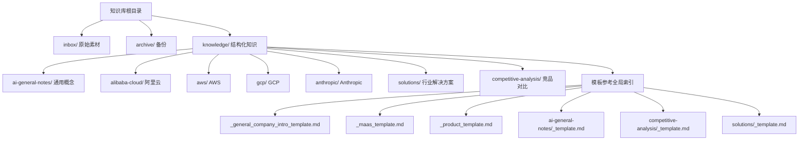
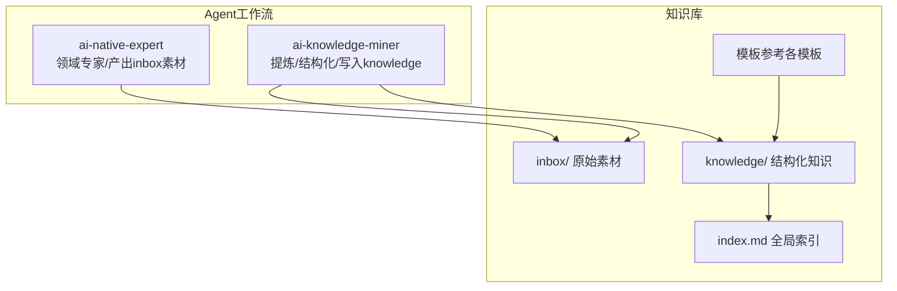
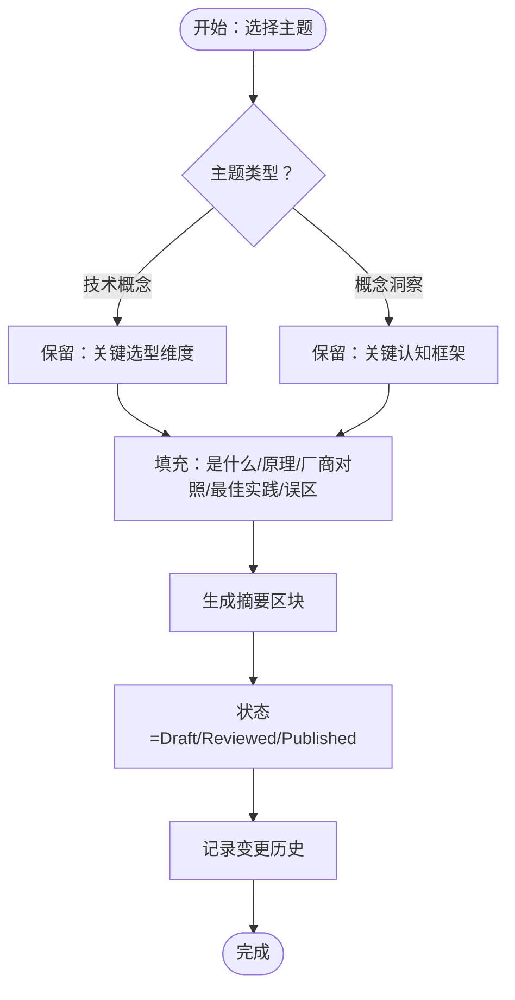
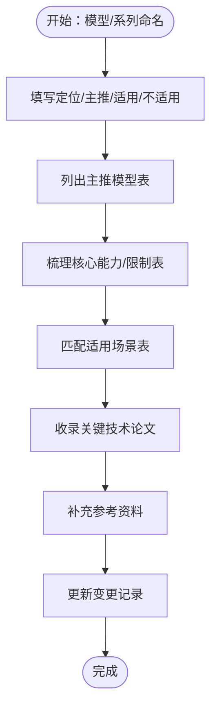
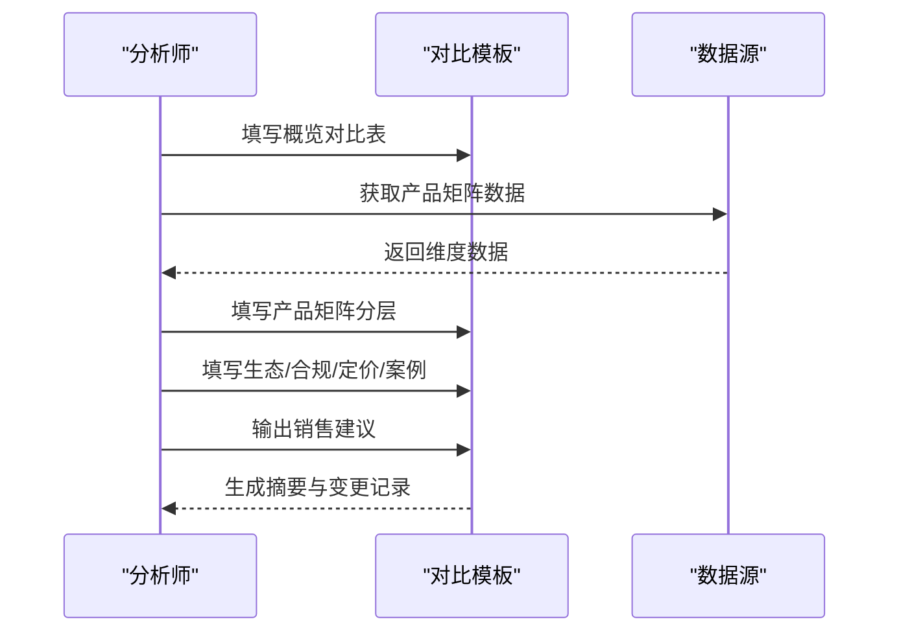
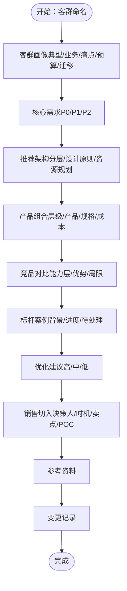
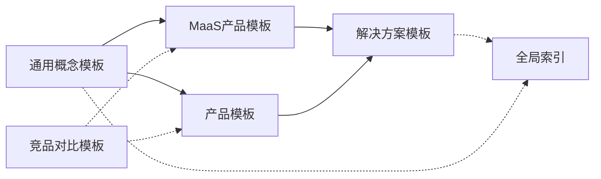

# 模板系统

<cite>
**本文引用的文件**
- [README.md](file://README.md)
- [index.md](file://index.md)
- [知识库全局索引](file://index.md)
- [_general_company_intro_template.md](file://knowledge/_general_company_intro_template.md)
- [_maas_template.md](file://knowledge/_maas_template.md)
- [_product_template.md](file://knowledge/_product_template.md)
- [ai-general-notes/_template.md](file://knowledge/ai-general-notes/_template.md)
- [competitive-analysis/_template.md](file://knowledge/alibaba-cloud/competitive-analysis/_template.md)
- [solutions/_template.md](file://knowledge/solutions/_template.md)
- [overview.md](file://knowledge/ai-general-notes/overview.md)
- [agent-def.md](file://knowledge/ai-general-notes/agent-def.md)
- [overview.md](file://knowledge/alibaba-cloud/competitive-analysis/alibaba-vs-aws/overview.md)
- [overview.md](file://knowledge/alibaba-cloud/maas/overview.md)
- [qwen.md](file://knowledge/alibaba-cloud/maas/qwen.md)
- [enterprise-ai-platform/overview.md](file://knowledge/solutions/enterprise-ai-platform/overview.md)
</cite>

## 目录
1. [简介](#简介)
2. [项目结构](#项目结构)
3. [核心组件](#核心组件)
4. [架构总览](#架构总览)
5. [详细组件分析](#详细组件分析)
6. [依赖分析](#依赖分析)
7. [性能考量](#性能考量)
8. [故障排查指南](#故障排查指南)
9. [结论](#结论)
10. [附录](#附录)

## 简介
本模板系统服务于AI知识库的结构化沉淀与复用，围绕“提炼”和“专家”两类Agent的工作流，形成标准化的模板体系，覆盖AI通用概念、MaaS产品、竞品对比、解决方案等主题域。模板强调：
- 结构化与可检索性：通过统一字段、标题层级与表格化表达，确保知识可读、可比、可复用
- 可追溯与可审计：Changelog、来源标注、作者/状态字段，支撑质量控制与版本管理
- 可扩展与可定制：模板提供占位符与模块化区块，便于按需填充与替换

## 项目结构
知识库采用“按领域/组织/主题”分层的目录结构，配合全局索引与模板参考，形成“总—分—细”的知识组织方式。

图表来源
- [index.md:62-69](file://index.md#L62-L69)
- [知识库全局索引:1-69](file://index.md#L1-L69)

章节来源
- [README.md:13-19](file://README.md#L13-L19)
- [index.md:1-69](file://index.md#L1-L69)

## 核心组件
- 通用概念模板：面向AI通用知识，强调“是什么/原理/选型维度/认知框架/厂商对照/最佳实践/常见误区/参考资料/变更记录”
- MaaS产品模板：聚焦模型/模型系列，强调“定位/主推/适用/限制/能力/场景/论文/资料/变更记录”
- 产品模板：面向具体产品，强调“定位/适用/限制/边界/配置/竞品/踩坑/资料/变更记录”
- 竞品对比模板：面向组织/产品对比，强调“概览对比/产品矩阵/生态合规/定价/案例/销售建议/资料/变更记录”
- 解决方案模板：面向行业/客群，强调“客群画像/核心需求/推荐架构/产品组合/竞品对比/标杆案例/优化建议/销售切入/资料/变更记录”

章节来源
- [ai-general-notes/_template.md:1-75](file://knowledge/ai-general-notes/_template.md#L1-L75)
- [_maas_template.md:1-65](file://knowledge/_maas_template.md#L1-L65)
- [_product_template.md:1-62](file://knowledge/_product_template.md#L1-L62)
- [competitive-analysis/_template.md:1-46](file://knowledge/alibaba-cloud/competitive-analysis/_template.md#L1-L46)
- [solutions/_template.md:1-108](file://knowledge/solutions/_template.md#L1-L108)

## 架构总览
模板系统与知识沉淀流程的关系如下：

图表来源
- [README.md:7-11](file://README.md#L7-L11)
- [index.md:1-69](file://index.md#L1-L69)

## 详细组件分析

### 通用概念模板（AI通用笔记）
- 设计原则
  - 结构化区块：是什么、核心原理、关键选型维度/关键认知框架（二选一）、厂商对照、最佳实践、常见误区、参考资料、变更记录
  - 可检索摘要：SUMMARY_START/END 区块，便于索引与卡片化阅读
  - 可追溯性：状态字段（Draft/Reviewed/Published）、最后更新
- 使用建议
  - 技术概念类保留“关键选型维度”，概念洞察类保留“关键认知框架”
  - 厂商对照聚焦“实现方式差异”，避免落入产品功能对比
- 示例映射
  - [overview.md:1-42](file://knowledge/ai-general-notes/overview.md#L1-L42)
  - [agent-def.md:1-128](file://knowledge/ai-general-notes/agent-def.md#L1-L128)

图表来源
- [ai-general-notes/_template.md:1-75](file://knowledge/ai-general-notes/_template.md#L1-L75)

章节来源
- [ai-general-notes/_template.md:1-75](file://knowledge/ai-general-notes/_template.md#L1-L75)
- [overview.md:1-42](file://knowledge/ai-general-notes/overview.md#L1-L42)
- [agent-def.md:1-128](file://knowledge/ai-general-notes/agent-def.md#L1-L128)

### MaaS产品模板（模型/模型系列）
- 设计原则
  - 标准化字段：定位、当前主推、适用/不适用、主推模型表、核心能力与限制、适用场景、关键技术论文、参考资料、变更记录
  - 可比对性：主推模型表横向对比，能力/限制表清晰量化
- 使用建议
  - 严格区分“当前主推”与“历史/预览”模型，避免混淆
  - 适用场景与限制需成对出现，便于选型决策
- 示例映射
  - [overview.md:1-9](file://knowledge/alibaba-cloud/maas/overview.md#L1-L9)
  - [qwen.md:1-120](file://knowledge/alibaba-cloud/maas/qwen.md#L1-L120)

图表来源
- [_maas_template.md:1-65](file://knowledge/_maas_template.md#L1-L65)
- [qwen.md:1-120](file://knowledge/alibaba-cloud/maas/qwen.md#L1-L120)

章节来源
- [_maas_template.md:1-65](file://knowledge/_maas_template.md#L1-L65)
- [overview.md:1-9](file://knowledge/alibaba-cloud/maas/overview.md#L1-L9)
- [qwen.md:1-120](file://knowledge/alibaba-cloud/maas/qwen.md#L1-L120)

### 产品模板（具体产品）
- 设计原则
  - 产品原理解析：一句话定位、通俗原理、核心限制
  - 边界分析：适用/不适用场景、常见误解
  - 最佳实践：踩坑记录、竞品快速对照
- 使用建议
  - 限制与适用需成对呈现，避免“只说优点”
  - 踩坑记录建议按问题-原因-方案-日期归档
- 示例映射
  - [qwen.md:1-120](file://knowledge/alibaba-cloud/maas/qwen.md#L1-L120)

章节来源
- [_product_template.md:1-62](file://knowledge/_product_template.md#L1-L62)
- [qwen.md:1-120](file://knowledge/alibaba-cloud/maas/qwen.md#L1-L120)

### 竞品对比模板（组织/产品对比）
- 设计原则
  - 概览对比：区域/市场/优势等维度横向对比
  - 产品矩阵：计算/存储/网络/数据库/AI/安全等分层对比
  - 销售建议：优势切入点、薄弱环节、话术要点
- 使用建议
  - 以“我方优势”和“核心差异”为摘要，便于快速决策
  - 对比维度尽量量化，避免主观描述
- 示例映射
  - [overview.md:1-46](file://knowledge/alibaba-cloud/competitive-analysis/alibaba-vs-aws/overview.md#L1-L46)

图表来源
- [competitive-analysis/_template.md:1-46](file://knowledge/alibaba-cloud/competitive-analysis/_template.md#L1-L46)
- [overview.md:1-46](file://knowledge/alibaba-cloud/competitive-analysis/alibaba-vs-aws/overview.md#L1-L46)

章节来源
- [competitive-analysis/_template.md:1-46](file://knowledge/alibaba-cloud/competitive-analysis/_template.md#L1-L46)
- [overview.md:1-46](file://knowledge/alibaba-cloud/competitive-analysis/alibaba-vs-aws/overview.md#L1-L46)

### 解决方案模板（行业/客群）
- 设计原则
  - 客群画像：典型客户、业务特征、IT痛点、预算规模、迁移背景
  - 核心需求：优先级、需求、对应产品
  - 推荐架构：业务层→网关层→计算层→存储层，设计原则与资源规划
  - 产品组合：层级、产品、规格/版本、成本参考
  - 竞品对比：能力层、阿里云优势、竞品局限
  - 标杆案例：背景、已实施/进行中/规划中/待处理
  - 优化建议：高/中/低优先级
  - 销售切入：决策人、切入时机、差异化卖点、POC
- 使用建议
  - 架构图建议以“层”为单位，突出“统一网关/混合推理/可观测/合规/调度”等关键设计原则
  - 产品组合与成本参考需结合实际资源规划
- 示例映射
  - [enterprise-ai-platform/overview.md:1-273](file://knowledge/solutions/enterprise-ai-platform/overview.md#L1-L273)

图表来源
- [solutions/_template.md:1-108](file://knowledge/solutions/_template.md#L1-L108)
- [enterprise-ai-platform/overview.md:1-273](file://knowledge/solutions/enterprise-ai-platform/overview.md#L1-L273)

章节来源
- [solutions/_template.md:1-108](file://knowledge/solutions/_template.md#L1-L108)
- [enterprise-ai-platform/overview.md:1-273](file://knowledge/solutions/enterprise-ai-platform/overview.md#L1-L273)

## 依赖分析
- 模板依赖关系
  - 通用概念模板是“跨厂商/跨产品”的基础，衍生出MaaS产品模板、产品模板、竞品对比模板、解决方案模板
  - 解决方案模板依赖MaaS产品模板与产品模板，形成“概念→产品→对比→方案”的闭环
- 索引与导航
  - 全局索引对模板与知识条目进行统一导航，便于检索与复用

图表来源
- [ai-general-notes/_template.md:1-75](file://knowledge/ai-general-notes/_template.md#L1-L75)
- [_maas_template.md:1-65](file://knowledge/_maas_template.md#L1-L65)
- [_product_template.md:1-62](file://knowledge/_product_template.md#L1-L62)
- [competitive-analysis/_template.md:1-46](file://knowledge/alibaba-cloud/competitive-analysis/_template.md#L1-L46)
- [solutions/_template.md:1-108](file://knowledge/solutions/_template.md#L1-L108)
- [index.md:62-69](file://index.md#L62-L69)

章节来源
- [index.md:62-69](file://index.md#L62-L69)

## 性能考量
- 模板渲染与检索效率
  - 通过统一字段与表格化表达，降低人工阅读成本，提升检索命中率
  - 摘要区块（SUMMARY）有助于快速卡片化浏览，减少全文扫描
- 维护成本与一致性
  - 模板标准化可降低编辑与校对成本，减少知识碎片化
  - 变更记录与状态字段有助于追踪修订路径，避免陈旧信息误导

## 故障排查指南
- 常见问题
  - 模板字段缺失：检查是否遗漏“适用/不适用/限制/竞品/参考资料/变更记录”等关键字段
  - 内容冗余：通用概念与产品细节混杂，建议遵循“概念→产品→对比→方案”的层级
  - 对比失焦：竞品对比偏向产品功能而非实现差异，应回归“能力/理念/生态/合规/定价”等维度
- 处理建议
  - 使用模板占位符与模块化区块，逐项填充，避免一次性大改
  - 引入“草稿/评审/发布”状态流转，确保质量门禁
  - 对照全局索引核验链接有效性与分类准确性

## 结论
模板系统通过“标准化模板体系+可追溯的质量控制+可扩展的定制化选项”，实现了AI知识从“原始素材”到“结构化知识”的高效转化。建议持续：
- 以“概念→产品→对比→方案”为主线，完善模板族谱
- 强化变更记录与状态管理，确保知识新鲜度
- 结合实际案例（如企业自建AI推理平台）不断迭代模板，提升实用性

## 附录
- 模板参考（全局索引）
  - [AI通用笔记模板](file://knowledge/ai-general-notes/_template.md)
  - [MaaS产品模板](file://knowledge/_maas_template.md)
  - [产品模板](file://knowledge/_product_template.md)
  - [竞品对比模板](file://knowledge/alibaba-cloud/competitive-analysis/_template.md)
  - [解决方案模板](file://knowledge/solutions/_template.md)