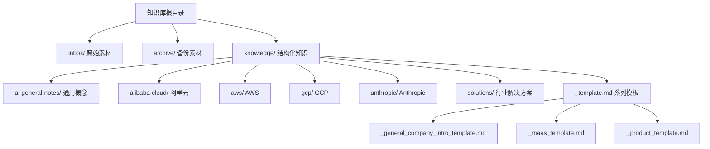
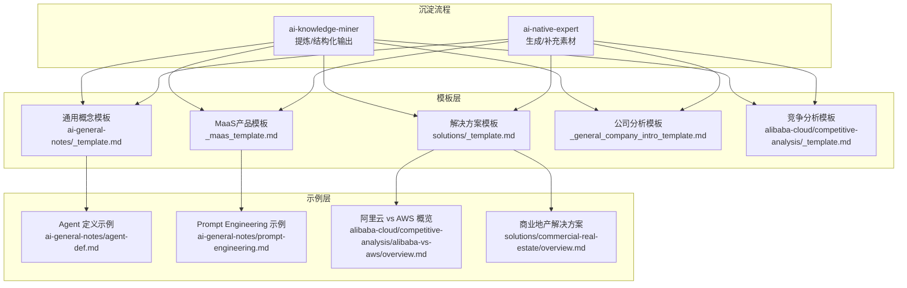
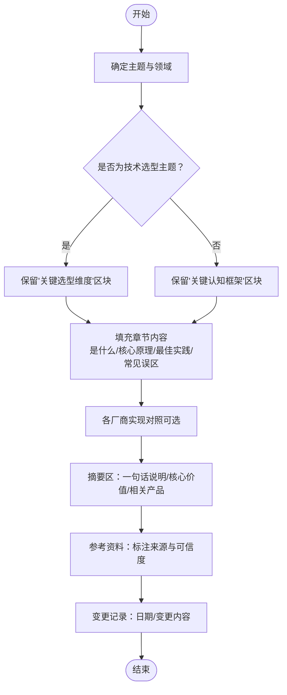
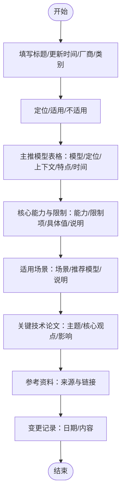
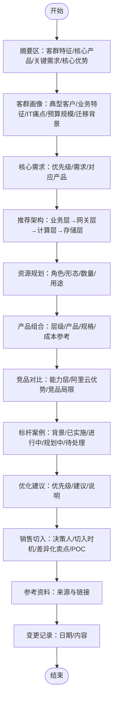
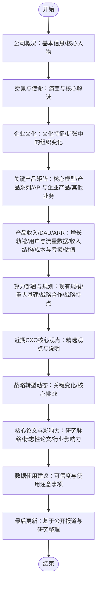
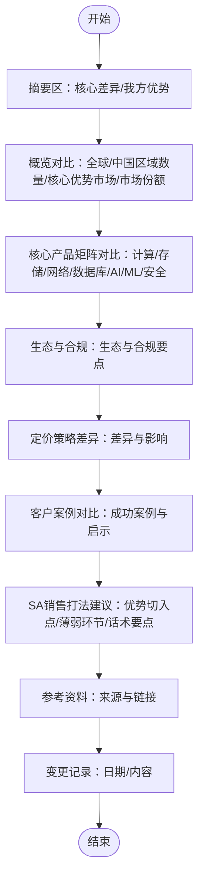
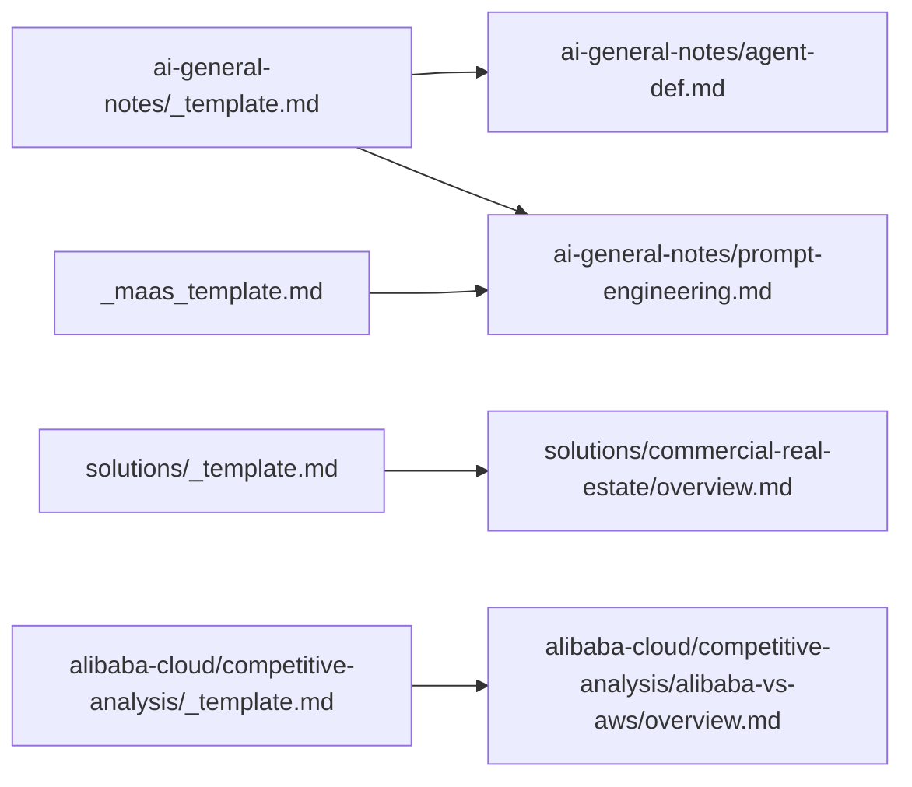

# 模板设计原则

<cite>
**本文引用的文件**
- [README.md](file://README.md)
- [index.md](file://index.md)
- [_general_company_intro_template.md](file://knowledge/_general_company_intro_template.md)
- [_maas_template.md](file://knowledge/_maas_template.md)
- [_template.md](file://knowledge/ai-general-notes/_template.md)
- [_template.md](file://knowledge/alibaba-cloud/competitive-analysis/_template.md)
- [_template.md](file://knowledge/solutions/_template.md)
- [agent-def.md](file://knowledge/ai-general-notes/agent-def.md)
- [prompt-engineering.md](file://knowledge/ai-general-notes/prompt-engineering.md)
- [overview.md](file://knowledge/alibaba-cloud/competitive-analysis/alibaba-vs-aws/overview.md)
- [overview.md](file://knowledge/solutions/commercial-real-estate/overview.md)
</cite>

## 目录
1. [引言](#引言)
2. [项目结构](#项目结构)
3. [核心组件](#核心组件)
4. [架构总览](#架构总览)
5. [详细组件分析](#详细组件分析)
6. [依赖分析](#依赖分析)
7. [性能考虑](#性能考虑)
8. [故障排查指南](#故障排查指南)
9. [结论](#结论)
10. [附录](#附录)

## 引言
本文件面向“AI知识库模板设计原则”，系统阐述模板标准化体系的核心理念与设计哲学，涵盖模板质量控制机制、版本管理策略、设计基本原则（一致性、可扩展性、可维护性），模板在知识沉淀过程中的作用与价值，模板结构与字段定义规范，审核流程与质量评估标准，以及模板演进历史与未来方向。文档以仓库现有模板与示例为基础，结合知识沉淀与结构化输出的实践，提供可落地的设计指南与最佳实践。

## 项目结构
该项目采用“领域-主题-模板”的层级化组织方式，围绕AI通用知识、厂商能力、竞品分析、行业解决方案等维度建立知识库。模板文件位于知识库根目录与各子目录，示例文档展示模板的实际应用形态。

图表来源
- [README.md:13-17](file://README.md#L13-L17)
- [index.md:62-68](file://index.md#L62-L68)

章节来源
- [README.md:1-20](file://README.md#L1-L20)
- [index.md:1-69](file://index.md#L1-L69)

## 核心组件
- 通用概念模板：面向AI通用知识，强调“是什么”“核心原理”“关键选型维度/关键认知框架”“最佳实践”“常见误区”“参考资料”“变更记录”等模块，支持技术概念类与概念洞察类两类内容的差异化组织。
- MaaS产品模板：聚焦模型/模型系列的定位、主推模型、核心能力与限制、适用场景、关键技术论文、参考资料与变更记录，便于快速沉淀厂商MaaS能力。
- 解决方案模板：面向行业解决方案，包含客群画像、核心需求、推荐架构、产品组合、竞品对比、标杆案例、优化建议、销售切入、参考资料与变更记录，支撑从需求到落地的闭环。
- 公司分析模板：面向企业公司分析，覆盖公司概况、核心人物、愿景使命、企业文化、产品矩阵、收入与用户指标、算力部署、CXO观点、战略转型、论文与影响力、数据使用建议与最后更新等模块。
- 竞争分析模板：面向厂商对比，包含概览对比、产品矩阵对比、生态与合规、定价策略差异、客户案例对比、销售建议、参考资料与变更记录。

章节来源
- [_template.md:1-75](file://knowledge/ai-general-notes/_template.md#L1-L75)
- [_maas_template.md:1-65](file://knowledge/_maas_template.md#L1-L65)
- [_template.md:1-108](file://knowledge/solutions/_template.md#L1-L108)
- [_general_company_intro_template.md:1-234](file://knowledge/_general_company_intro_template.md#L1-L234)
- [_template.md:1-46](file://knowledge/alibaba-cloud/competitive-analysis/_template.md#L1-L46)

## 架构总览
模板体系通过“模板文件 + 示例文档”的双轨设计实现标准化与可复用性。模板文件定义结构、字段与流程，示例文档展示真实填充后的结构化知识形态，二者共同构成“可复制的知识沉淀范式”。

图表来源
- [README.md:7-11](file://README.md#L7-L11)
- [_template.md:1-75](file://knowledge/ai-general-notes/_template.md#L1-L75)
- [_maas_template.md:1-65](file://knowledge/_maas_template.md#L1-L65)
- [_template.md:1-108](file://knowledge/solutions/_template.md#L1-L108)
- [_general_company_intro_template.md:1-234](file://knowledge/_general_company_intro_template.md#L1-L234)
- [_template.md:1-46](file://knowledge/alibaba-cloud/competitive-analysis/_template.md#L1-L46)
- [agent-def.md:1-128](file://knowledge/ai-general-notes/agent-def.md#L1-L128)
- [prompt-engineering.md:1-193](file://knowledge/ai-general-notes/prompt-engineering.md#L1-L193)
- [overview.md:1-46](file://knowledge/alibaba-cloud/competitive-analysis/alibaba-vs-aws/overview.md#L1-L46)
- [overview.md:1-217](file://knowledge/solutions/commercial-real-estate/overview.md#L1-L217)

## 详细组件分析

### 通用概念模板（ai-general-notes/_template.md）
- 设计理念
  - 分层结构：从“是什么”到“核心原理”，再到“关键选型维度/关键认知框架”，最后落到“最佳实践”“常见误区”“参考资料”“变更记录”，形成完整的认知闭环。
  - 可选区块：针对技术概念类与概念洞察类分别提供“关键选型维度”与“关键认知框架”两种组织方式，避免模板冗余。
  - 可迁移场景：鼓励将抽象认知迁移到非AI场景，强化第一性原理价值。
- 字段与模块
  - 标题、领域、状态、摘要区、章节标题、表格与列表、参考资料、变更记录等。
- 质量控制
  - 条目化、表格化、可验证来源标注，降低主观偏差。
- 版本管理
  - 变更记录逐条记录日期与内容，便于追溯。

图表来源
- [_template.md:1-75](file://knowledge/ai-general-notes/_template.md#L1-L75)

章节来源
- [_template.md:1-75](file://knowledge/ai-general-notes/_template.md#L1-L75)

### MaaS产品模板（_maas_template.md）
- 设计理念
  - 以“定位/适用/不适用”为入口，快速建立产品画像；主推模型表格化呈现能力与上下文等关键属性；核心能力与限制分列，便于横向对比。
- 字段与模块
  - 标题、更新时间、厂商、产品类别、定位、当前主推、适用/不适用、主推模型、核心能力、核心限制、适用场景、关键技术论文、参考资料、变更记录。
- 质量控制
  - 表格化字段统一格式，减少歧义；限制项与能力项一一对应，避免遗漏。
- 版本管理
  - 变更记录按日期与内容归档，便于追踪模型迭代。

图表来源
- [_maas_template.md:1-65](file://knowledge/_maas_template.md#L1-L65)

章节来源
- [_maas_template.md:1-65](file://knowledge/_maas_template.md#L1-L65)

### 解决方案模板（solutions/_template.md）
- 设计理念
  - 以“客群画像—核心需求—推荐架构—产品组合—竞品对比—标杆案例—优化建议—销售切入”为主线，形成从需求到落地的完整闭环。
- 字段与模块
  - 标题、客群标签、状态、摘要区、客群画像、核心需求、推荐架构、资源规划、产品组合、竞品对比、标杆案例、优化建议、销售切入、参考资料、变更记录。
- 质量控制
  - 需求优先级（P0/P1/P2）与资源规划表格化，确保方案可执行；竞品对比维度清晰，避免主观臆断。
- 版本管理
  - 变更记录包含初始版本与后续修订，便于追踪方案演进。

图表来源
- [_template.md:1-108](file://knowledge/solutions/_template.md#L1-L108)

章节来源
- [_template.md:1-108](file://knowledge/solutions/_template.md#L1-L108)

### 公司分析模板（_general_company_intro_template.md）
- 设计理念
  - 以“公司概况—核心人物—愿景使命—企业文化—产品矩阵—收入与用户指标—算力部署—CXO观点—战略转型—论文与影响力—数据使用建议—最后更新”为主线，形成企业级全景视图。
- 字段与模块
  - 标题、数据时效说明、章节标题、表格、要点列表、数据使用建议、最后更新等。
- 质量控制
  - 数据可信度分级与来源标注，降低误用风险；结构化表格便于横向比较。
- 版本管理
  - 最后更新与变更记录，确保信息时效性。

图表来源
- [_general_company_intro_template.md:1-234](file://knowledge/_general_company_intro_template.md#L1-L234)

章节来源
- [_general_company_intro_template.md:1-234](file://knowledge/_general_company_intro_template.md#L1-L234)

### 竞争分析模板（alibaba-cloud/competitive-analysis/_template.md）
- 设计理念
  - 以“概览对比—核心产品矩阵对比—生态与合规—定价策略差异—客户案例对比—SA销售建议—参考资料—变更记录”为主线，支撑销售与策略制定。
- 字段与模块
  - 标题、作者、状态、摘要区、对比维度、产品矩阵、生态与合规、定价策略、客户案例、销售建议、参考资料、变更记录。
- 质量控制
  - 对比维度清晰、产品矩阵分层、销售建议可执行。
- 版本管理
  - 变更记录按日期与内容归档。

图表来源
- [_template.md:1-46](file://knowledge/alibaba-cloud/competitive-analysis/_template.md#L1-L46)

章节来源
- [_template.md:1-46](file://knowledge/alibaba-cloud/competitive-analysis/_template.md#L1-L46)

## 依赖分析
模板之间的依赖关系体现在“模板文件”与“示例文档”的映射关系上，示例文档是对模板字段的具体填充，二者共同构成“标准化模板 + 结构化输出”的知识沉淀闭环。

图表来源
- [_template.md:1-75](file://knowledge/ai-general-notes/_template.md#L1-L75)
- [agent-def.md:1-128](file://knowledge/ai-general-notes/agent-def.md#L1-L128)
- [prompt-engineering.md:1-193](file://knowledge/ai-general-notes/prompt-engineering.md#L1-L193)
- [_maas_template.md:1-65](file://knowledge/_maas_template.md#L1-L65)
- [_template.md:1-108](file://knowledge/solutions/_template.md#L1-L108)
- [overview.md:1-217](file://knowledge/solutions/commercial-real-estate/overview.md#L1-L217)
- [_template.md:1-46](file://knowledge/alibaba-cloud/competitive-analysis/_template.md#L1-L46)
- [overview.md:1-46](file://knowledge/alibaba-cloud/competitive-analysis/alibaba-vs-aws/overview.md#L1-L46)

章节来源
- [README.md:7-11](file://README.md#L7-L11)

## 性能考虑
- 模板渲染与检索效率
  - 采用Markdown结构化字段与表格，有利于后续工具化检索与索引构建。
- 知识复用与一致性
  - 统一字段命名与表格格式，减少歧义，提升跨文档对比与复用效率。
- 版本追踪与回溯
  - 变更记录按日期与内容归档，便于快速定位问题与回滚。

## 故障排查指南
- 常见问题
  - 字段缺失：检查摘要区、关键选型维度/认知框架、竞品对比、参考资料、变更记录等必填模块是否完整。
  - 数据来源不明确：核查“数据使用建议”与“参考资料”标注，确保来源权威且可追溯。
  - 结构不一致：核对表格字段与列表层级，确保与模板约定一致。
- 处理建议
  - 优先补齐缺失模块，再进行交叉验证与同行评审。
  - 对照示例文档（如Agent定义、Prompt工程、商业地产解决方案）进行结构与内容校验。

章节来源
- [_template.md:7-11](file://knowledge/ai-general-notes/_template.md#L7-L11)
- [_template.md:7-12](file://knowledge/solutions/_template.md#L7-L12)
- [_general_company_intro_template.md:92-93](file://knowledge/_general_company_intro_template.md#L92-L93)

## 结论
模板设计原则以“标准化、可扩展、可维护”为核心，通过结构化字段与模块化组织，实现知识沉淀的高质量与高复用性。模板与示例文档的双轨设计，既保证了模板的稳定性，又提供了丰富的实践参考。建议在实际使用中坚持“先模板、后填充”的流程，配合变更记录与来源标注，持续优化模板以适配新的知识领域与业务场景。

## 附录
- 模板演进历史与未来方向
  - 演进历史：从通用概念模板到MaaS产品模板、解决方案模板、公司分析模板与竞争分析模板，逐步覆盖AI知识库的主要知识域。
  - 未来方向：引入自动化校验（字段完整性、表格格式、来源标注）、版本对比工具、跨模板联动分析（如将MaaS能力与解决方案场景对接），以及基于模板的结构化检索与知识图谱构建。