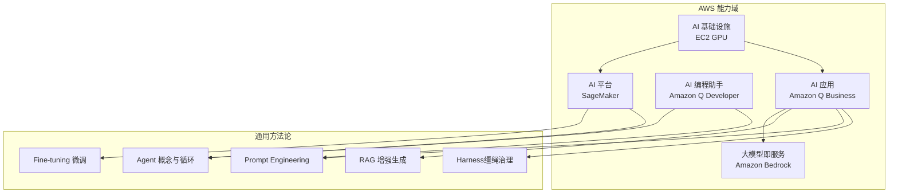
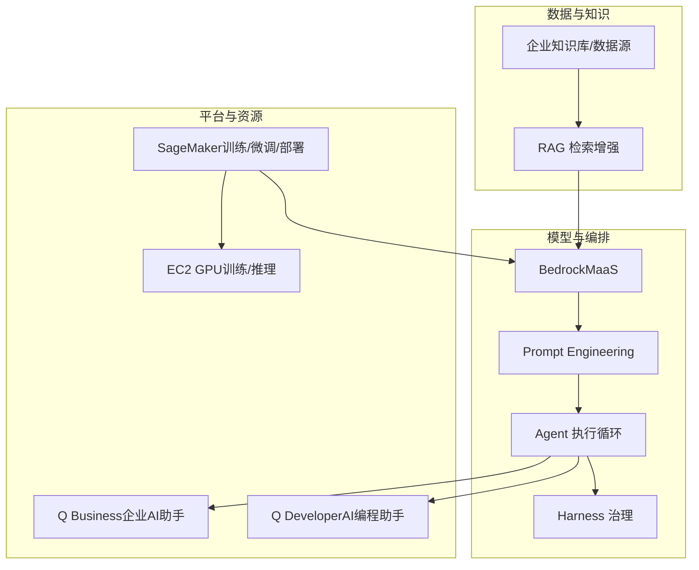
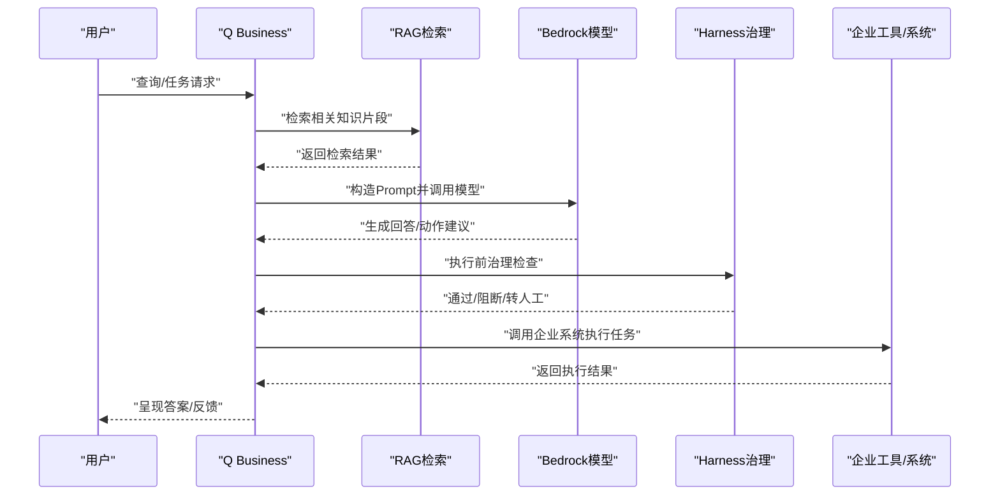
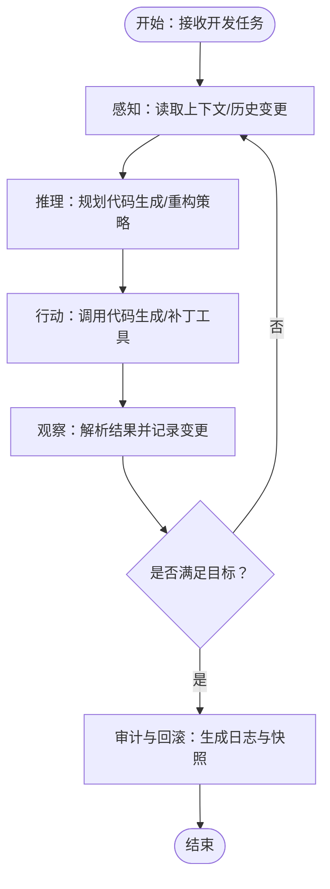
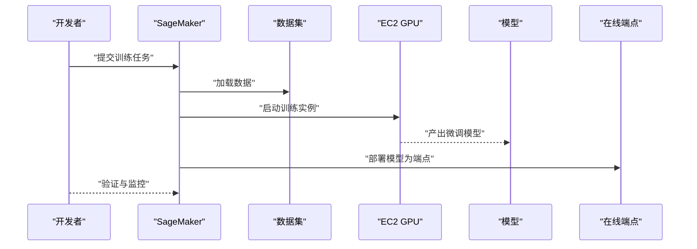
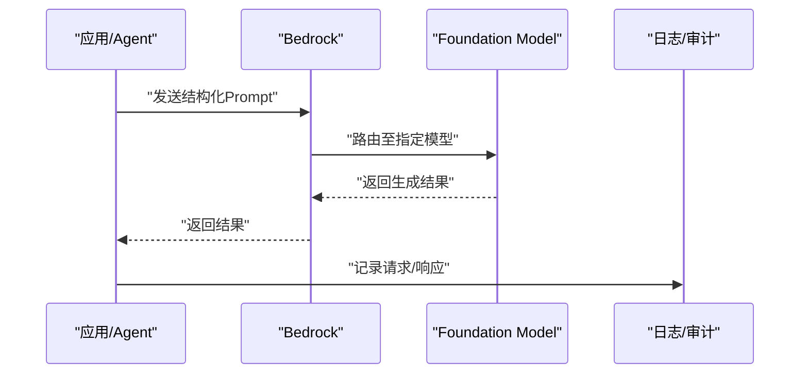
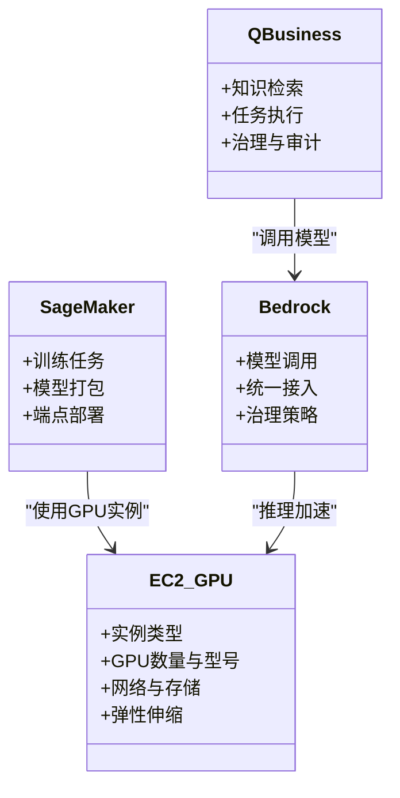
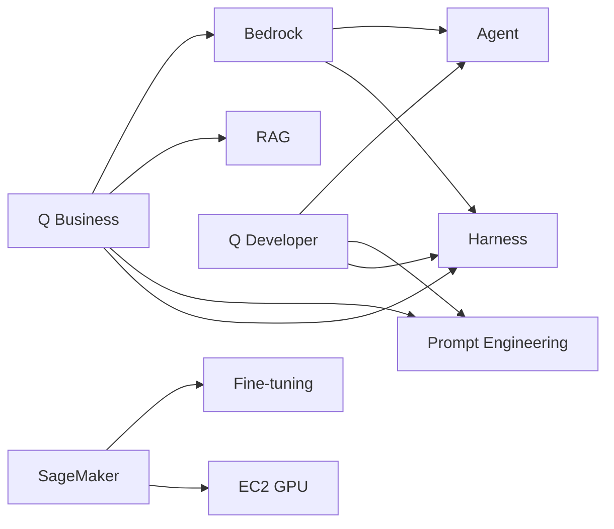

# AWS AI Application（AI应用平台）

<cite>
**本文引用的文件**
- [q-business.md](file://knowledge/aws/ai-application/q-business.md)
- [sagemaker.md](file://knowledge/aws/ai-platform/sagemaker.md)
- [q-developer.md](file://knowledge/aws/ai-coding/q-developer.md)
- [ec2-gpu.md](file://knowledge/aws/ai-infra/ec2-gpu.md)
- [overview.md](file://knowledge/aws/maas/overview.md)
- [agent-def.md](file://knowledge/ai-general-notes/agent-def.md)
- [harness.md](file://knowledge/ai-general-notes/harness.md)
- [prompt-engineering.md](file://knowledge/ai-general-notes/prompt-engineering.md)
- [rag.md](file://knowledge/ai-general-notes/rag.md)
</cite>

## 目录
1. [简介](#简介)
2. [项目结构](#项目结构)
3. [核心组件](#核心组件)
4. [架构总览](#架构总览)
5. [组件详解](#组件详解)
6. [依赖关系分析](#依赖关系分析)
7. [性能与可扩展性](#性能与可扩展性)
8. [故障排查指南](#故障排查指南)
9. [结论](#结论)
10. [附录](#附录)

## 简介
本文件面向企业级AI应用平台建设与落地，系统梳理AWS在AI应用开发与部署方面的整体能力与实践路径，重点聚焦于Amazon Q Business的企业级AI助手定位、Amazon Q Developer的AI编程助手能力、SageMaker的机器学习全托管平台、Bedrock的大模型即服务（MaaS）以及EC2 GPU计算资源支撑。同时结合通用AI工程方法论（Agent、Harness、Prompt Engineering、RAG、Fine-tuning），为企业提供从需求到上线、从开发到运维的端到端参考。

## 项目结构
该知识库采用“厂商-能力域-主题”的层次化组织方式，便于跨厂商横向对比与按主题深入学习。AWS相关条目主要分布在：
- ai-application：AI应用（如Q Business）
- ai-platform：AI平台（如SageMaker）
- ai-coding：AI编程助手（如Q Developer）
- ai-infra：AI基础设施（如EC2 GPU）
- maas：大模型即服务（如Bedrock）
- ai-general-notes：通用AI工程方法论（Agent、Harness、Prompt Engineering、RAG、Fine-tuning）

图表来源
- [q-business.md:1-9](file://knowledge/aws/ai-application/q-business.md#L1-L9)
- [q-developer.md:1-9](file://knowledge/aws/ai-coding/q-developer.md#L1-L9)
- [sagemaker.md:1-9](file://knowledge/aws/ai-platform/sagemaker.md#L1-L9)
- [overview.md:1-9](file://knowledge/aws/maas/overview.md#L1-L9)
- [ec2-gpu.md:1-9](file://knowledge/aws/ai-infra/ec2-gpu.md#L1-L9)
- [agent-def.md:1-128](file://knowledge/ai-general-notes/agent-def.md#L1-L128)
- [harness.md:1-108](file://knowledge/ai-general-notes/harness.md#L1-L108)
- [prompt-engineering.md:1-193](file://knowledge/ai-general-notes/prompt-engineering.md#L1-L193)
- [rag.md:1-42](file://knowledge/ai-general-notes/rag.md#L1-L42)

章节来源
- [q-business.md:1-9](file://knowledge/aws/ai-application/q-business.md#L1-L9)
- [sagemaker.md:1-9](file://knowledge/aws/ai-platform/sagemaker.md#L1-L9)
- [q-developer.md:1-9](file://knowledge/aws/ai-coding/q-developer.md#L1-L9)
- [ec2-gpu.md:1-9](file://knowledge/aws/ai-infra/ec2-gpu.md#L1-L9)
- [overview.md:1-9](file://knowledge/aws/maas/overview.md#L1-L9)

## 核心组件
- Amazon Q Business（AI应用）
  - 定位：面向企业的AI助手，连接企业数据进行问答与任务执行。
  - 关联能力：RAG、Prompt Engineering、Harness治理、MaaS（模型调用）。
- Amazon Q Developer（AI编程助手）
  - 定位：AI编程助手（原CodeWhisperer），提升开发效率与代码质量。
  - 关联能力：Agent执行循环、Prompt Engineering、代码检索与生成。
- SageMaker（AI平台）
  - 定位：机器学习全托管平台，支持训练、微调、部署与监控。
  - 关联能力：Fine-tuning、Agent工程化、资源调度与弹性。
- Bedrock（MaaS）
  - 定位：托管大模型服务，一键调用主流Foundation Models。
  - 关联能力：Prompt Engineering、RAG、Agent与Harness的上层编排。
- EC2 GPU（AI基础设施）
  - 定位：GPU计算实例（如P5、P4d），支撑训练与推理加速。
  - 关联能力：SageMaker训练集群、Q Business推理节点、Bedrock模型调用。

章节来源
- [q-business.md:1-9](file://knowledge/aws/ai-application/q-business.md#L1-L9)
- [q-developer.md:1-9](file://knowledge/aws/ai-coding/q-developer.md#L1-L9)
- [sagemaker.md:1-9](file://knowledge/aws/ai-platform/sagemaker.md#L1-L9)
- [overview.md:1-9](file://knowledge/aws/maas/overview.md#L1-L9)
- [ec2-gpu.md:1-9](file://knowledge/aws/ai-infra/ec2-gpu.md#L1-L9)

## 架构总览
下图展示企业级AI应用从“数据接入—模型编排—任务执行—可观测治理”的整体架构，映射到AWS典型服务与通用方法论：

图表来源
- [overview.md:1-9](file://knowledge/aws/maas/overview.md#L1-L9)
- [prompt-engineering.md:1-193](file://knowledge/ai-general-notes/prompt-engineering.md#L1-L193)
- [agent-def.md:1-128](file://knowledge/ai-general-notes/agent-def.md#L1-L128)
- [harness.md:1-108](file://knowledge/ai-general-notes/harness.md#L1-L108)
- [sagemaker.md:1-9](file://knowledge/aws/ai-platform/sagemaker.md#L1-L9)
- [ec2-gpu.md:1-9](file://knowledge/aws/ai-infra/ec2-gpu.md#L1-L9)
- [q-business.md:1-9](file://knowledge/aws/ai-application/q-business.md#L1-L9)
- [q-developer.md:1-9](file://knowledge/aws/ai-coding/q-developer.md#L1-L9)

## 组件详解

### Amazon Q Business（企业AI助手）
- 能力定位
  - 连接企业数据，提供问答与任务执行能力，适合知识检索、流程自动化、智能客服等场景。
- 关键技术关联
  - RAG：将检索到的知识与生成结合，降低幻觉、提升准确性。
  - Prompt Engineering：通过结构化提示词约束生成，强化溯源与置信度。
  - Harness：对工具权限、业务规则、人工介入点、凭证隔离与审计追踪进行治理。
  - MaaS：依托Bedrock调用主流Foundation Models，统一模型接入与治理。
- 典型流程（序列图）

图表来源
- [q-business.md:1-9](file://knowledge/aws/ai-application/q-business.md#L1-L9)
- [prompt-engineering.md:1-193](file://knowledge/ai-general-notes/prompt-engineering.md#L1-L193)
- [harness.md:1-108](file://knowledge/ai-general-notes/harness.md#L1-L108)
- [overview.md:1-9](file://knowledge/aws/maas/overview.md#L1-L9)

章节来源
- [q-business.md:1-9](file://knowledge/aws/ai-application/q-business.md#L1-L9)

### Amazon Q Developer（AI编程助手）
- 能力定位
  - 以Agent执行循环为核心，结合Prompt Engineering与工具调用，辅助开发者完成代码生成、重构与测试。
- 关键技术关联
  - Agent循环：感知-推理-行动-观察，确保复杂任务可追踪、可回滚。
  - Prompt Engineering：降低幻觉、提升输出质量与可控性。
  - Harness：对工具权限、凭证隔离、审计追踪进行治理，保障开发过程安全。
- 流程示意（流程图）

图表来源
- [agent-def.md:1-128](file://knowledge/ai-general-notes/agent-def.md#L1-L128)
- [prompt-engineering.md:1-193](file://knowledge/ai-general-notes/prompt-engineering.md#L1-L193)
- [harness.md:1-108](file://knowledge/ai-general-notes/harness.md#L1-L108)
- [q-developer.md:1-9](file://knowledge/aws/ai-coding/q-developer.md#L1-L9)

章节来源
- [q-developer.md:1-9](file://knowledge/aws/ai-coding/q-developer.md#L1-L9)
- [agent-def.md:1-128](file://knowledge/ai-general-notes/agent-def.md#L1-L128)
- [harness.md:1-108](file://knowledge/ai-general-notes/harness.md#L1-L108)

### SageMaker（机器学习全托管平台）
- 能力定位
  - 提供从数据准备、训练、微调、评估到部署的全生命周期托管能力，支持多种算法与框架。
- 关键技术关联
  - Fine-tuning：在预训练模型基础上使用领域数据继续训练，适配特定任务。
  - Agent工程化：通过训练与部署环节支撑Agent的稳定性与可靠性。
  - 资源弹性：结合EC2 GPU实现训练与推理的弹性扩缩容。
- 流程示意（序列图）

图表来源
- [sagemaker.md:1-9](file://knowledge/aws/ai-platform/sagemaker.md#L1-L9)
- [ec2-gpu.md:1-9](file://knowledge/aws/ai-infra/ec2-gpu.md#L1-L9)
- [fine-tuning.md:1-42](file://knowledge/ai-general-notes/fine-tuning.md#L1-L42)

章节来源
- [sagemaker.md:1-9](file://knowledge/aws/ai-platform/sagemaker.md#L1-L9)
- [ec2-gpu.md:1-9](file://knowledge/aws/ai-infra/ec2-gpu.md#L1-L9)
- [fine-tuning.md:1-42](file://knowledge/ai-general-notes/fine-tuning.md#L1-L42)

### Bedrock（大模型即服务）
- 能力定位
  - 一键调用主流Foundation Models，提供统一的模型接入与治理入口。
- 关键技术关联
  - Prompt Engineering：通过结构化提示词约束生成质量与可控性。
  - RAG：检索增强生成，结合外部知识提升回答准确性。
  - Agent与Harness：在上层编排中实现复杂任务的执行与治理。
- 流程示意（序列图）

图表来源
- [overview.md:1-9](file://knowledge/aws/maas/overview.md#L1-L9)
- [prompt-engineering.md:1-193](file://knowledge/ai-general-notes/prompt-engineering.md#L1-L193)
- [rag.md:1-42](file://knowledge/ai-general-notes/rag.md#L1-L42)
- [agent-def.md:1-128](file://knowledge/ai-general-notes/agent-def.md#L1-L128)
- [harness.md:1-108](file://knowledge/ai-general-notes/harness.md#L1-L108)

章节来源
- [overview.md:1-9](file://knowledge/aws/maas/overview.md#L1-L9)
- [prompt-engineering.md:1-193](file://knowledge/ai-general-notes/prompt-engineering.md#L1-L193)
- [rag.md:1-42](file://knowledge/ai-general-notes/rag.md#L1-L42)

### EC2 GPU（AI基础设施）
- 能力定位
  - 提供高性能GPU实例（如P5、P4d），支撑大规模训练与高并发推理。
- 关键技术关联
  - 与SageMaker配合实现训练集群弹性扩缩容；
  - 与Q Business、Bedrock配合实现推理加速与模型部署。
- 流程示意（类图）

图表来源
- [ec2-gpu.md:1-9](file://knowledge/aws/ai-infra/ec2-gpu.md#L1-L9)
- [sagemaker.md:1-9](file://knowledge/aws/ai-platform/sagemaker.md#L1-L9)
- [q-business.md:1-9](file://knowledge/aws/ai-application/q-business.md#L1-L9)
- [overview.md:1-9](file://knowledge/aws/maas/overview.md#L1-L9)

章节来源
- [ec2-gpu.md:1-9](file://knowledge/aws/ai-infra/ec2-gpu.md#L1-L9)

## 依赖关系分析
- 组件耦合与协作
  - Q Business依赖Bedrock/MaaS进行模型调用，结合RAG与Prompt Engineering提升准确性与可控性，并通过Harness进行治理与审计。
  - Q Developer以Agent执行循环为核心，结合Prompt Engineering与Harness保障开发过程的安全与可观测。
  - SageMaker负责模型训练与微调，向上游Agent与Q Business提供高质量模型；与EC2 GPU形成资源弹性闭环。
  - Bedrock作为MaaS，统一模型接入与治理策略，向下兼容Agent与Harness的编排。
- 外部依赖与集成点
  - 企业数据源与系统：Q Business与Q Developer均需对接企业知识库与业务系统，强调数据安全与访问控制。
  - 第三方工具与API：Harness对工具权限与凭证隔离提出严格要求，避免Agent误操作与数据泄露。

图表来源
- [q-business.md:1-9](file://knowledge/aws/ai-application/q-business.md#L1-L9)
- [q-developer.md:1-9](file://knowledge/aws/ai-coding/q-developer.md#L1-L9)
- [sagemaker.md:1-9](file://knowledge/aws/ai-platform/sagemaker.md#L1-L9)
- [ec2-gpu.md:1-9](file://knowledge/aws/ai-infra/ec2-gpu.md#L1-L9)
- [overview.md:1-9](file://knowledge/aws/maas/overview.md#L1-L9)
- [agent-def.md:1-128](file://knowledge/ai-general-notes/agent-def.md#L1-L128)
- [harness.md:1-108](file://knowledge/ai-general-notes/harness.md#L1-L108)
- [prompt-engineering.md:1-193](file://knowledge/ai-general-notes/prompt-engineering.md#L1-L193)
- [rag.md:1-42](file://knowledge/ai-general-notes/rag.md#L1-L42)
- [fine-tuning.md:1-42](file://knowledge/ai-general-notes/fine-tuning.md#L1-L42)

章节来源
- [agent-def.md:1-128](file://knowledge/ai-general-notes/agent-def.md#L1-L128)
- [harness.md:1-108](file://knowledge/ai-general-notes/harness.md#L1-L108)
- [prompt-engineering.md:1-193](file://knowledge/ai-general-notes/prompt-engineering.md#L1-L193)
- [rag.md:1-42](file://knowledge/ai-general-notes/rag.md#L1-L42)
- [fine-tuning.md:1-42](file://knowledge/ai-general-notes/fine-tuning.md#L1-L42)
- [sagemaker.md:1-9](file://knowledge/aws/ai-platform/sagemaker.md#L1-L9)
- [ec2-gpu.md:1-9](file://knowledge/aws/ai-infra/ec2-gpu.md#L1-L9)
- [overview.md:1-9](file://knowledge/aws/maas/overview.md#L1-L9)
- [q-business.md:1-9](file://knowledge/aws/ai-application/q-business.md#L1-L9)
- [q-developer.md:1-9](file://knowledge/aws/ai-coding/q-developer.md#L1-L9)

## 性能与可扩展性
- 训练与推理加速
  - 使用EC2 GPU实例承载大规模训练与高并发推理，结合SageMaker的弹性伸缩能力，动态匹配负载。
- 生成质量与延迟平衡
  - Prompt Engineering的四层机制可在幻觉率与延迟、Token成本之间取得平衡，按任务重要性选择约束强度。
- RAG检索优化
  - 通过合理的检索策略与索引设计，降低检索延迟与无关召回，提升最终生成质量。
- Agent执行稳定性
  - 明确退出条件、工具幂等性与可观测性，避免长循环中的错误累积与不可恢复操作。

## 故障排查指南
- 幻觉与不可信输出
  - 检查Prompt Engineering约束是否到位，必要时引入溯源要求与置信度校准。
- 任务执行失败
  - 核查Harness的工具权限、人工介入点与凭证隔离是否正确配置；查看审计日志定位失败步骤。
- 模型调用异常
  - 检查Bedrock的模型路由与治理策略；确认请求格式与上下文长度限制。
- 训练/推理资源不足
  - 检查SageMaker训练任务与端点配置；结合EC2 GPU规格与弹性策略调整实例类型与数量。

章节来源
- [prompt-engineering.md:1-193](file://knowledge/ai-general-notes/prompt-engineering.md#L1-L193)
- [harness.md:1-108](file://knowledge/ai-general-notes/harness.md#L1-L108)
- [sagemaker.md:1-9](file://knowledge/aws/ai-platform/sagemaker.md#L1-L9)
- [ec2-gpu.md:1-9](file://knowledge/aws/ai-infra/ec2-gpu.md#L1-L9)

## 结论
AWS AI应用平台通过Q Business、Q Developer、SageMaker、Bedrock与EC2 GPU的协同，为企业提供了从数据接入、模型编排、任务执行到治理审计的完整能力闭环。结合通用AI工程方法论（Agent、Harness、Prompt Engineering、RAG、Fine-tuning），企业可以快速构建并稳定运行AI驱动的应用程序，实现知识检索、自动化任务与智能编程辅助的规模化落地。

## 附录
- 最佳实践清单
  - 以Harness为治理核心，明确工具边界、业务规则与人工介入点。
  - 在Agent执行循环中显式化退出条件与可观测性，避免长任务风险。
  - 使用Prompt Engineering的四层机制平衡幻觉率、延迟与成本。
  - 通过SageMaker进行模型微调与部署，结合EC2 GPU实现弹性与加速。
  - 以Bedrock统一模型接入与治理策略，确保跨模型一致性与安全性。