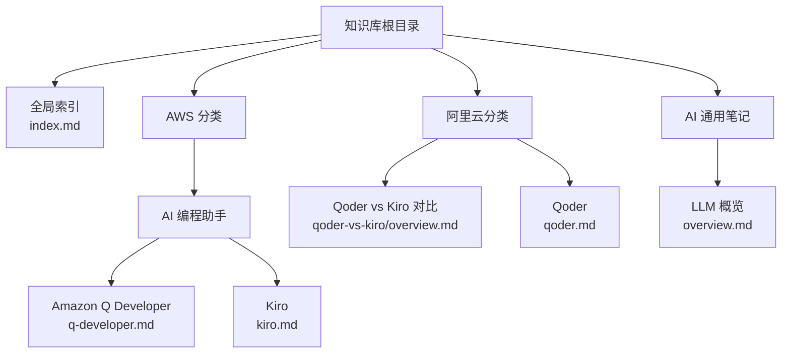
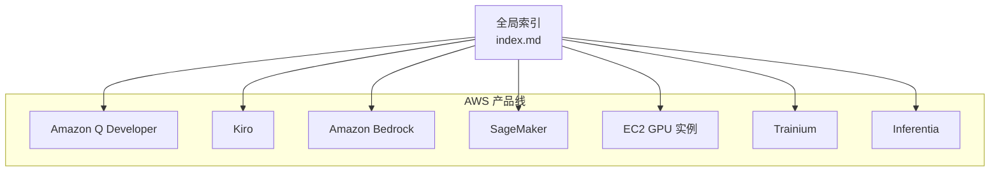
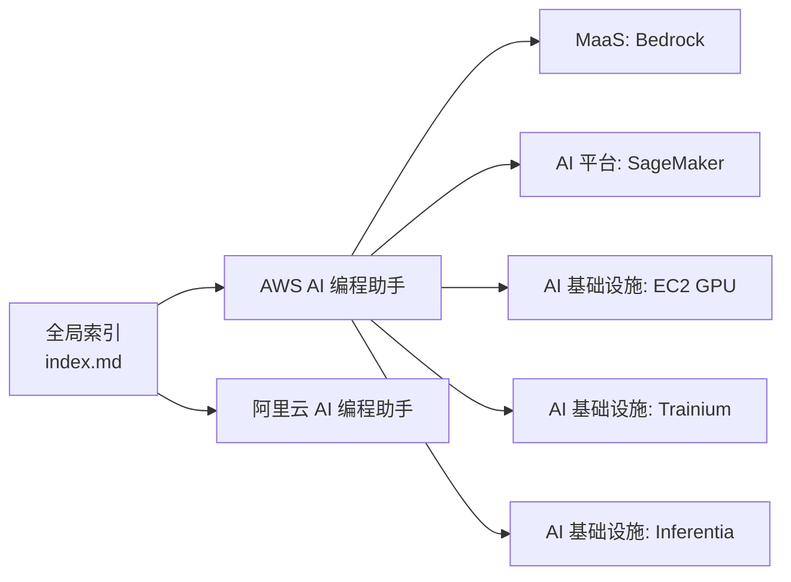

# AWS AI 编程助手（AI编程助手）

<cite>
**本文引用的文件**
- [q-developer.md](file://knowledge/aws/ai-coding/q-developer.md)
- [kiro.md](file://knowledge/aws/ai-coding/kiro.md)
- [index.md](file://index.md)
- [overview.md](file://knowledge/ai-general-notes/overview.md)
- [qoder-vs-kiro/overview.md](file://knowledge/alibaba-cloud/competitive-analysis/qoder-vs-kiro/overview.md)
- [qoder.md](file://knowledge/alibaba-cloud/ai-coding/qoder.md)
- [Daily_note_update_with_AI_insight.md](file://notes/Daily_note_update_with_AI_insight.md)
</cite>

## 目录
1. [简介](#简介)
2. [项目结构](#项目结构)
3. [核心组件](#核心组件)
4. [架构总览](#架构总览)
5. [详细组件分析](#详细组件分析)
6. [依赖分析](#依赖分析)
7. [性能考虑](#性能考虑)
8. [故障排除指南](#故障排除指南)
9. [结论](#结论)
10. [附录](#附录)

## 简介
本文件系统化梳理 AWS 在 AI 编程辅助领域的解决方案，重点覆盖 Amazon Q Developer 与 Kiro 的定位、演进关系、与竞品（如阿里云 Qoder）的对比要点，并结合仓库中的索引与笔记信息，给出可操作的使用建议、集成路径与最佳实践指引。由于当前仓库中对具体功能细节与技术架构的描述尚处于草稿阶段，本文以“已知事实”为基础，强调“可落地”的使用与集成思路。

## 项目结构
仓库采用“按厂商/领域/产品类型”分层组织的知识库结构，AWS AI 编程助手相关内容集中在以下位置：
- AWS AI 编程助手：知识库根目录下的 AWS 分类中，包含 Q Developer 与 Kiro 的独立条目
- 竞争对手对比：阿里云视角的 Qoder vs Kiro 对比分析
- 全局索引：index.md 提供跨厂商的产品导航与对比入口
- 通用概念：AI 概览等基础概念文档，支撑对 LLM/AI 编程助手的理解

图表来源
- [index.md:29-34](file://index.md#L29-L34)
- [q-developer.md:1-9](file://knowledge/aws/ai-coding/q-developer.md#L1-L9)
- [kiro.md:1-9](file://knowledge/aws/ai-coding/kiro.md#L1-L9)
- [qoder-vs-kiro/overview.md:1-50](file://knowledge/alibaba-cloud/competitive-analysis/qoder-vs-kiro/overview.md#L1-L50)
- [qoder.md:1-9](file://knowledge/alibaba-cloud/ai-coding/qoder.md#L1-L9)
- [overview.md:1-42](file://knowledge/ai-general-notes/overview.md#L1-L42)

章节来源
- [index.md:29-34](file://index.md#L29-L34)
- [q-developer.md:1-9](file://knowledge/aws/ai-coding/q-developer.md#L1-L9)
- [kiro.md:1-9](file://knowledge/aws/ai-coding/kiro.md#L1-L9)
- [qoder-vs-kiro/overview.md:1-50](file://knowledge/alibaba-cloud/competitive-analysis/qoder-vs-kiro/overview.md#L1-L50)
- [qoder.md:1-9](file://knowledge/alibaba-cloud/ai-coding/qoder.md#L1-L9)
- [overview.md:1-42](file://knowledge/ai-general-notes/overview.md#L1-L42)

## 核心组件
- Amazon Q Developer
  - 定位：AWS AI 编程助手（原 CodeWhisperer）
  - 状态：Draft
  - 参考路径：[q-developer.md:1-9](file://knowledge/aws/ai-coding/q-developer.md#L1-L9)
- Kiro
  - 定位：AWS AI-native IDE
  - 状态：Draft
  - 官网：https://aws.amazon.com/cn/campaigns/kiro/?
  - 参考路径：[kiro.md:1-9](file://knowledge/aws/ai-coding/kiro.md#L1-L9)
- 竞品对比：Qoder vs Kiro
  - 参考路径：[qoder-vs-kiro/overview.md:1-50](file://knowledge/alibaba-cloud/competitive-analysis/qoder-vs-kiro/overview.md#L1-L50)
- 全局索引与导航
  - 参考路径：[index.md:29-34](file://index.md#L29-L34)

章节来源
- [q-developer.md:1-9](file://knowledge/aws/ai-coding/q-developer.md#L1-L9)
- [kiro.md:1-9](file://knowledge/aws/ai-coding/kiro.md#L1-L9)
- [qoder-vs-kiro/overview.md:1-50](file://knowledge/alibaba-cloud/competitive-analysis/qoder-vs-kiro/overview.md#L1-L50)
- [index.md:29-34](file://index.md#L29-L34)

## 架构总览
从仓库现有信息可见，AWS 将 AI 编程助手置于“AI 编程助手”产品线内，并与 MaaS（Bedrock/Claude/Titan）、AI 平台（SageMaker）、AI 基础设施（EC2 GPU/Trainium/Inferentia）共同构成端到端能力矩阵。下图展示与本主题直接相关的组件关系与导航入口：

图表来源
- [index.md:29-34](file://index.md#L29-L34)
- [q-developer.md:1-9](file://knowledge/aws/ai-coding/q-developer.md#L1-L9)
- [kiro.md:1-9](file://knowledge/aws/ai-coding/kiro.md#L1-L9)

章节来源
- [index.md:29-34](file://index.md#L29-L34)

## 详细组件分析

### Amazon Q Developer
- 当前状态：Draft
- 已知信息
  - 定位：AWS AI 编程助手（原 CodeWhisperer）
  - 参考路径：[q-developer.md:1-9](file://knowledge/aws/ai-coding/q-developer.md#L1-L9)
- 使用建议
  - 结合全局索引定位其在 AWS 产品体系中的位置，用于后续查阅更完整的功能与集成信息
  - 参考路径：[index.md:29-34](file://index.md#L29-L34)

章节来源
- [q-developer.md:1-9](file://knowledge/aws/ai-coding/q-developer.md#L1-L9)
- [index.md:29-34](file://index.md#L29-L34)

### Kiro
- 当前状态：Draft
- 已知信息
  - 定位：AWS AI-native IDE
  - 官网：https://aws.amazon.com/cn/campaigns/kiro/?
  - 参考路径：[kiro.md:1-9](file://knowledge/aws/ai-coding/kiro.md#L1-L9)
- 演进关系
  - 笔记中指出：Kiro 的前身为 AWS CodeWhisperer（已停服），演进路线为：AWS CodeWhisperer → Amazon Q Developer（过渡期）→ 升级为 Kiro（新一代 AI IDE）
  - 参考路径：[Daily_note_update_with_AI_insight.md:6](file://notes/Daily_note_update_with_AI_insight.md#L6)
- 使用建议
  - 作为新一代 AI IDE，建议关注其在 IDE 内的集成方式、工作流适配与团队协作能力
  - 参考路径：[kiro.md:1-9](file://knowledge/aws/ai-coding/kiro.md#L1-L9)

章节来源
- [kiro.md:1-9](file://knowledge/aws/ai-coding/kiro.md#L1-L9)
- [Daily_note_update_with_AI_insight.md:6](file://notes/Daily_note_update_with_AI_insight.md#L6)

### 与竞品的对比：Qoder vs Kiro
- 已知信息
  - 仓库提供对比分析框架，涵盖产品定位、核心功能、技术架构、性能/体验、生态集成、优劣势总结与推荐策略
  - 参考路径：[qoder-vs-kiro/overview.md:1-50](file://knowledge/alibaba-cloud/competitive-analysis/qoder-vs-kiro/overview.md#L1-L50)
- 使用建议
  - 基于对比框架，补充具体维度的评估标准（如定价模式、开源/闭源、目标用户等），形成可量化的选型依据
  - 参考路径：[qoder-vs-kiro/overview.md:12-21](file://knowledge/alibaba-cloud/competitive-analysis/qoder-vs-kiro/overview.md#L12-L21)

章节来源
- [qoder-vs-kiro/overview.md:1-50](file://knowledge/alibaba-cloud/competitive-analysis/qoder-vs-kiro/overview.md#L1-L50)

### 竞品参考：Qoder
- 已知信息
  - 定位：AI 编程助手，提升开发者编码效率
  - 参考路径：[qoder.md:1-9](file://knowledge/alibaba-cloud/ai-coding/qoder.md#L1-L9)
- 使用建议
  - 作为对比参照，关注其在开发者效率提升方面的侧重点与差异化能力

章节来源
- [qoder.md:1-9](file://knowledge/alibaba-cloud/ai-coding/qoder.md#L1-L9)

### 通用概念支撑：LLM 概览
- 已知信息
  - 提供 LLM 的基本概念、核心价值与关键选型维度，有助于理解 AI 编程助手的技术底座
  - 参考路径：[overview.md:1-42](file://knowledge/ai-general-notes/overview.md#L1-L42)
- 使用建议
  - 在评估 AI 编程助手时，结合 LLM 能力边界、提示工程、RAG 等概念，制定更稳健的选型与实施策略

章节来源
- [overview.md:1-42](file://knowledge/ai-general-notes/overview.md#L1-L42)

## 依赖分析
- 产品依赖关系
  - AWS 将 AI 编程助手置于“AI 编程助手”产品线，同时与 MaaS（Bedrock/Claude/Titan）、AI 平台（SageMaker）、AI 基础设施（EC2 GPU/Trainium/Inferentia）协同
  - 参考路径：[index.md:29-34](file://index.md#L29-L34)
- 竞品依赖关系
  - 阿里云将 Qoder 置于“AI 编程助手”产品线，与多款 AI 应用与平台产品共同组成能力矩阵
  - 参考路径：[index.md:22-27](file://index.md#L22-L27)

图表来源
- [index.md:29-34](file://index.md#L29-L34)
- [index.md:22-27](file://index.md#L22-L27)

章节来源
- [index.md:29-34](file://index.md#L29-L34)
- [index.md:22-27](file://index.md#L22-L27)

## 性能考虑
- 仓库当前未提供针对 AWS AI 编程助手的具体性能数据或指标。建议在实际部署与使用过程中，结合以下维度进行评估与优化：
  - 响应延迟与吞吐：结合所选 MaaS（如 Bedrock）与基础设施（如 EC2 GPU/Trainium/Inferentia）的性能特征
  - 提示工程与上下文管理：遵循通用提示工程最佳实践，减少无效 token 与重复计算
  - RAG 与本地知识库：在需要接入企业数据时，评估检索质量与缓存策略
- 参考路径
  - [overview.md:10-11](file://knowledge/ai-general-notes/overview.md#L10-L11)
  - [overview.md:30](file://knowledge/ai-general-notes/overview.md#L30)

## 故障排除指南
- 当前仓库未提供针对 AWS AI 编程助手的专用故障排除文档。建议采用以下通用排查步骤：
  - 环境与权限
    - 确认 MaaS（如 Bedrock）访问权限与凭证配置正确
    - 检查网络连通性与代理设置
  - 提示与上下文
    - 简化提示，逐步增加复杂度，定位问题范围
    - 控制上下文长度，避免超出模型上下文窗口
  - 日志与审计
    - 利用平台提供的日志与审计能力（如 AWS CloudTrail）追踪请求链路
  - 回退与降级
    - 在出现异常时，临时切换至更稳定的模型或基础能力
- 参考路径
  - [Daily_note_update_with_AI_insight.md:4](file://notes/Daily_note_update_with_AI_insight.md#L4)

章节来源
- [Daily_note_update_with_AI_insight.md:4](file://notes/Daily_note_update_with_AI_insight.md#L4)

## 结论
- 本仓库对 AWS AI 编程助手（Q Developer 与 Kiro）的描述目前处于草稿阶段，主要提供定位与导航信息。结合笔记中关于 Kiro 演进历史的信息，可确认其为新一代 AI IDE 的发展方向。
- 建议在实际使用中：
  - 以全局索引为入口，逐步完善各产品的功能、集成与最佳实践
  - 对照竞品（如 Qoder）的对比框架，补充具体维度的评估标准
  - 结合 LLM 概览等通用概念，构建稳健的提示工程与 RAG 策略

## 附录
- 使用示例与配置指南
  - 由于当前仓库未提供具体示例与配置细节，建议以“全局索引”为入口，查找 AWS MaaS（Bedrock）、AI 平台（SageMaker）与基础设施（EC2 GPU/Trainium/Inferentia）的相关文档，再将这些能力与 AI 编程助手进行组合使用
  - 参考路径：[index.md:29-34](file://index.md#L29-L34)
- 最佳实践
  - 以 LLM 概览中的关键选型维度为指导，围绕“理解、生成、推理”三大核心价值，制定提示工程与 RAG 实施策略
  - 参考路径：[overview.md:18-26](file://knowledge/ai-general-notes/overview.md#L18-L26)