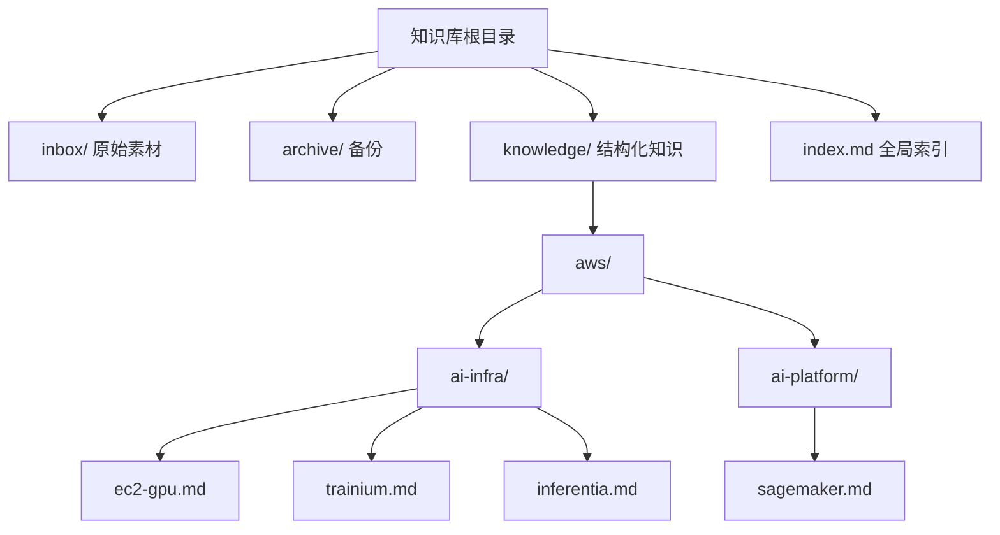
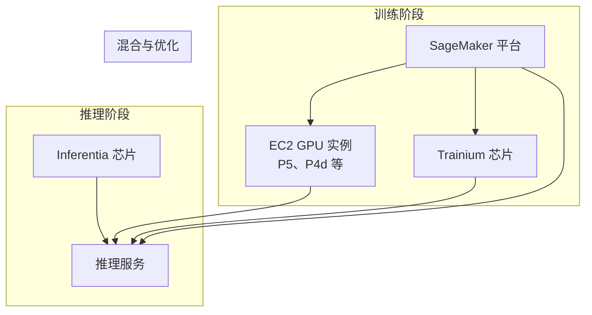
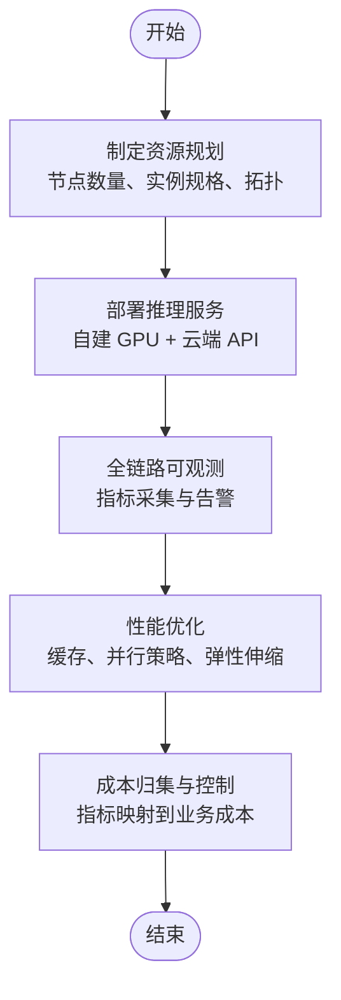
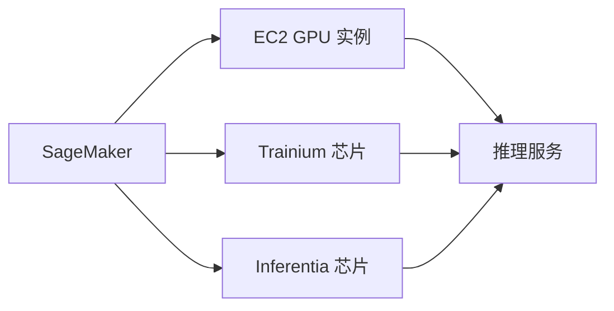

# AWS AI Infrastructure（AI基础设施）

<cite>
**本文引用的文件**
- [index.md](file://index.md)
- [ec2-gpu.md](file://knowledge/aws/ai-infra/ec2-gpu.md)
- [trainium.md](file://knowledge/aws/ai-infra/trainium.md)
- [inferentia.md](file://knowledge/aws/ai-infra/inferentia.md)
- [sagemaker.md](file://knowledge/aws/ai-platform/sagemaker.md)
- [README.md](file://README.md)
- [enterprise-ai-platform/overview.md](file://knowledge/solutions/enterprise-ai-platform/overview.md)
- [anthropic/general_intro.md](file://knowledge/anthropic/general_intro.md)
</cite>

## 目录
1. [简介](#简介)
2. [项目结构](#项目结构)
3. [核心组件](#核心组件)
4. [架构总览](#架构总览)
5. [详细组件分析](#详细组件分析)
6. [依赖关系分析](#依赖关系分析)
7. [性能考量](#性能考量)
8. [故障排查指南](#故障排查指南)
9. [结论](#结论)
10. [附录](#附录)

## 简介
本文件系统梳理 AWS 在 AI 计算基础设施方面的能力与实践，重点覆盖以下主题：
- EC2 GPU 实例族（如 P5、P4d 等）在训练与推理中的定位与适用场景
- AWS 自研 AI 芯片：Trainium（训练）与 Inferentia（推理）的技术特性与生态协同
- 与 SageMaker 平台的结合使用方式与最佳实践
- 基于企业级推理平台的资源规划、性能优化与成本控制方法
- 面向不同 AI 工作负载（训练/推理/混合）的硬件选型建议与落地策略

本仓库为知识库形态，本文在不展示具体代码的前提下，基于现有文档片段与索引信息，给出可操作的架构与选型建议。

章节来源
- [README.md:1-20](file://README.md#L1-L20)
- [index.md:1-69](file://index.md#L1-L69)

## 项目结构
知识库采用“厂商 + 领域”的分层组织方式，AWS AI 基础设施相关内容集中在 aws/ai-infra 与 aws/ai-platform 下，并通过 index.md 提供全局导航。

图表来源
- [index.md:29-34](file://index.md#L29-L34)

章节来源
- [index.md:29-34](file://index.md#L29-L34)

## 核心组件
- EC2 GPU 实例族（P5、P4d 等）：面向 GPU 加速的通用计算实例，适用于大规模 AI 训练与高性能推理场景。
- Trainium 芯片：AWS 自研 AI 训练芯片，面向大规模模型训练与训练集群编排。
- Inferentia 芯片：AWS 自研 AI 推理芯片，面向低延迟、高吞吐的在线推理服务。
- SageMaker 平台：全托管机器学习平台，提供从数据处理、训练、模型优化到部署的一体化能力，可与上述硬件资源协同使用。

章节来源
- [ec2-gpu.md:1-9](file://knowledge/aws/ai-infra/ec2-gpu.md#L1-L9)
- [trainium.md:1-9](file://knowledge/aws/ai-infra/trainium.md#L1-L9)
- [inferentia.md:1-9](file://knowledge/aws/ai-infra/inferentia.md#L1-L9)
- [sagemaker.md:1-9](file://knowledge/aws/ai-platform/sagemaker.md#L1-L9)
- [index.md:29-34](file://index.md#L29-L34)

## 架构总览
AWS AI 基础设施的典型使用路径包括：
- 使用 EC2 GPU 实例承载训练任务与短期推理峰值
- 使用 Trainium 芯片构建大规模训练集群，提升训练效率与成本效益
- 使用 Inferentia 芯片承载稳定、低延迟的在线推理服务
- 将 SageMaker 作为训练与模型管理的统一平台，结合硬件资源实现端到端流水线

图表来源
- [sagemaker.md:1-9](file://knowledge/aws/ai-platform/sagemaker.md#L1-L9)
- [ec2-gpu.md:1-9](file://knowledge/aws/ai-infra/ec2-gpu.md#L1-L9)
- [trainium.md:1-9](file://knowledge/aws/ai-infra/trainium.md#L1-L9)
- [inferentia.md:1-9](file://knowledge/aws/ai-infra/inferentia.md#L1-L9)

## 详细组件分析

### EC2 GPU 实例（P5、P4d 等）
- 定位：通用 GPU 计算实例，适合需要灵活调度与弹性扩展的训练与推理任务。
- 适用场景：
  - 短中期训练任务与中小规模推理
  - 需要与 SageMaker 训练/调试流程配合的场景
  - 对 GPU 类型与数量有一定灵活性的工作负载
- 选型要点：
  - 根据显存容量与计算能力匹配模型规模
  - 结合 Spot 实例或预留实例降低长期成本
  - 与网络与存储子系统协同优化 I/O 吞吐

章节来源
- [ec2-gpu.md:1-9](file://knowledge/aws/ai-infra/ec2-gpu.md#L1-L9)
- [index.md:29-34](file://index.md#L29-L34)

### Trainium 芯片（训练）
- 定位：AWS 自研 AI 训练芯片，面向大规模模型训练与高效集群编排。
- 技术特点（结合公开披露信息）：
  - 面向训练场景的专用架构，具备高带宽与高扩展性
  - 与 SageMaker 等平台协同，支持大规模分布式训练
- 适用场景：
  - 大模型训练、长周期训练任务
  - 对训练效率与成本敏感的场景
- 选型要点：
  - 评估训练集群规模与通信开销，合理规划节点拓扑
  - 结合 SageMaker 的分布式训练工具链，优化数据并行与张量并行策略

章节来源
- [trainium.md:1-9](file://knowledge/aws/ai-infra/trainium.md#L1-L9)
- [anthropic/general_intro.md:98-108](file://knowledge/anthropic/general_intro.md#L98-L108)

### Inferentia 芯片（推理）
- 定位：AWS 自研 AI 推理芯片，面向低延迟、高吞吐的在线推理服务。
- 技术特点（结合公开披露信息）：
  - 面向推理场景的专用架构，具备高并发与低时延能力
  - 与 SageMaker 等平台协同，支持模型部署与弹性扩缩容
- 适用场景：
  - 在线推理服务、实时交互应用
  - 对延迟与吞吐有严格要求的服务
- 选型要点：
  - 评估 QPS、并发连接与模型吞吐，合理规划实例规格
  - 结合缓存与预取策略，进一步降低尾延迟

章节来源
- [inferentia.md:1-9](file://knowledge/aws/ai-infra/inferentia.md#L1-L9)
- [anthropic/general_intro.md:98-108](file://knowledge/anthropic/general_intro.md#L98-L108)

### SageMaker 平台（训练与部署）
- 定位：全托管机器学习平台，提供从数据处理、训练、模型优化到部署的一体化能力。
- 与硬件资源的协同：
  - 训练阶段：可在 SageMaker 中选择 EC2 GPU 实例或 Trainium 集群进行训练
  - 部署阶段：可将模型部署至 EC2、Inferentia 或 SageMaker Hosting 服务
- 选型要点：
  - 根据训练规模与数据量选择合适的实例族与分布式策略
  - 结合模型格式与运行时需求，选择最优部署后端

章节来源
- [sagemaker.md:1-9](file://knowledge/aws/ai-platform/sagemaker.md#L1-L9)
- [index.md:33](file://index.md#L33)

### 企业级推理平台的资源规划与优化（参考）
虽然该案例基于阿里云实践，但其资源规划、可观测性与成本控制思路可迁移至 AWS 生态：
- 统一网关与混合推理双轨：通过网关统一入口、自建 GPU 与云端 API 的自动切换，提升可用性与弹性
- 全链路可观测：从网关到 GPU 卡级指标一体化，便于定位瓶颈与优化
- 成本归集与弹性伸缩：通过指标归集与弹性策略，实现成本与性能的平衡

图表来源
- [enterprise-ai-platform/overview.md:137-170](file://knowledge/solutions/enterprise-ai-platform/overview.md#L137-L170)

章节来源
- [enterprise-ai-platform/overview.md:137-170](file://knowledge/solutions/enterprise-ai-platform/overview.md#L137-L170)

## 依赖关系分析
- SageMaker 与 EC2 GPU/Trainium/Inferentia 的关系：SageMaker 作为统一平台，可选择不同硬件后端执行训练与部署
- 芯片与平台的协同：Trainium/Inferentia 与 SageMaker 的训练/部署工具链协同，提升整体效率
- 企业级平台的依赖：统一网关、可观测性与弹性伸缩能力对硬件资源的稳定性与性能提出更高要求

图表来源
- [sagemaker.md:1-9](file://knowledge/aws/ai-platform/sagemaker.md#L1-L9)
- [ec2-gpu.md:1-9](file://knowledge/aws/ai-infra/ec2-gpu.md#L1-L9)
- [trainium.md:1-9](file://knowledge/aws/ai-infra/trainium.md#L1-L9)
- [inferentia.md:1-9](file://knowledge/aws/ai-infra/inferentia.md#L1-L9)

章节来源
- [index.md:29-34](file://index.md#L29-L34)

## 性能考量
- 训练阶段
  - 选择合适实例规格与并行策略（数据并行/张量并行），减少通信瓶颈
  - 利用分布式训练工具链与高带宽互联，提升吞吐
- 推理阶段
  - 通过缓存与预取降低尾延迟
  - 合理设置并发与批大小，平衡延迟与吞吐
- 成本与弹性
  - 结合 Spot/预留实例与弹性伸缩策略，降低长期成本
  - 通过指标归集与成本映射，实现精细化成本控制

章节来源
- [enterprise-ai-platform/overview.md:211-238](file://knowledge/solutions/enterprise-ai-platform/overview.md#L211-L238)

## 故障排查指南
- 推理服务可用性
  - 通过健康检查与熔断降级机制，实现自建 GPU 与云端 API 的自动切换
  - 明确 Fallback 触发条件，避免“双轨”成为冷备
- 可观测性
  - 建立从网关到 GPU 卡级的全链路指标体系，快速定位问题
  - 统一监控系统，收敛多套指标采集，降低运维复杂度
- 资源与成本
  - 通过指标归集与业务标签，计算单次会话 GPU 成本，支撑定价与成本核算

章节来源
- [enterprise-ai-platform/overview.md:204-238](file://knowledge/solutions/enterprise-ai-platform/overview.md#L204-L238)

## 结论
- AWS 在 AI 基础设施方面提供从通用 GPU 实例到自研 Trainium/Inferentia 芯片的完整谱系，并通过 SageMaker 平台实现训练与部署的统一管理
- 面向不同工作负载，应以“训练效率、推理延迟、成本控制”为核心维度进行选型与优化
- 企业级场景建议采用统一网关、混合推理双轨与全链路可观测的架构，结合弹性与成本归集策略，实现稳定高效的 AI 基础设施

## 附录
- 相关索引与导航：AWS AI 基础设施与平台在全局索引中有明确条目，便于检索与交叉引用

章节来源
- [index.md:29-34](file://index.md#L29-L34)