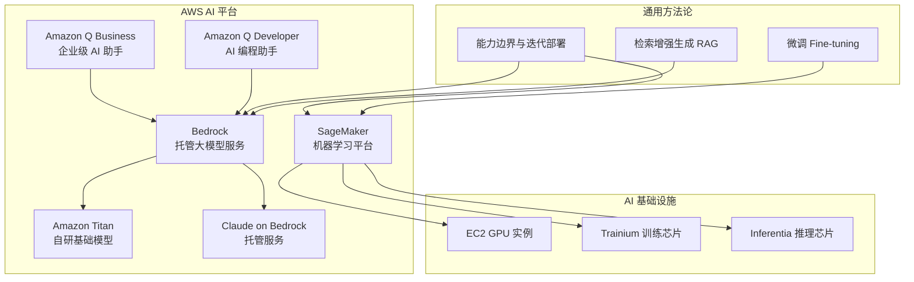
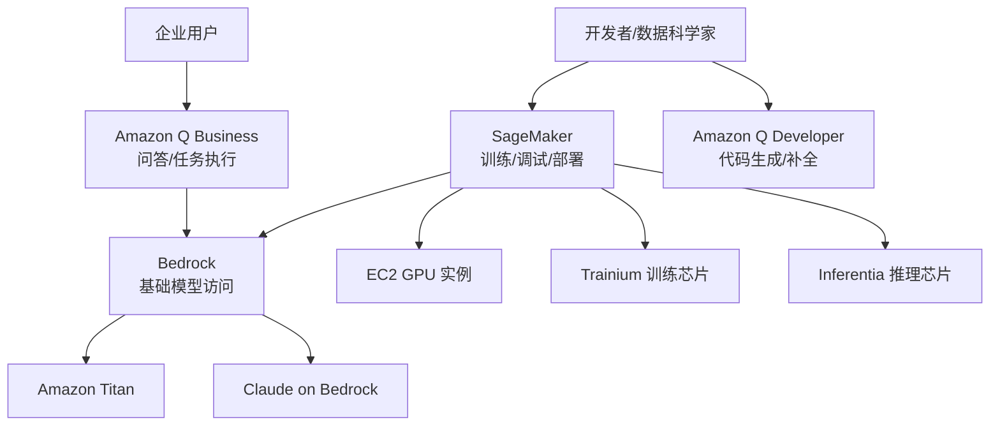
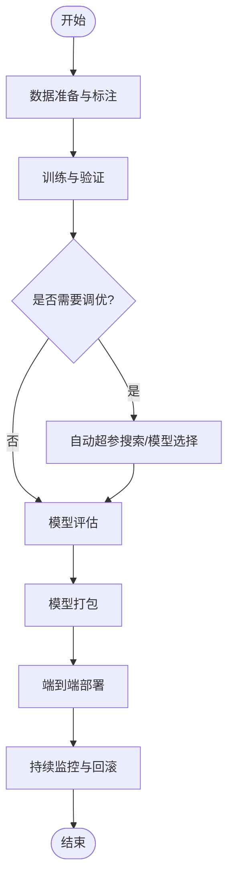
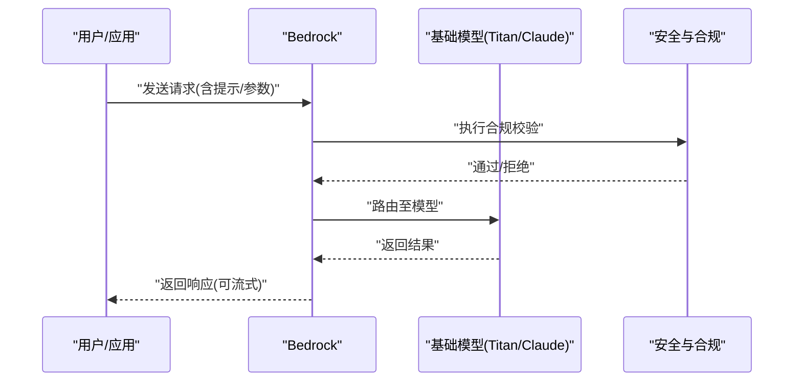
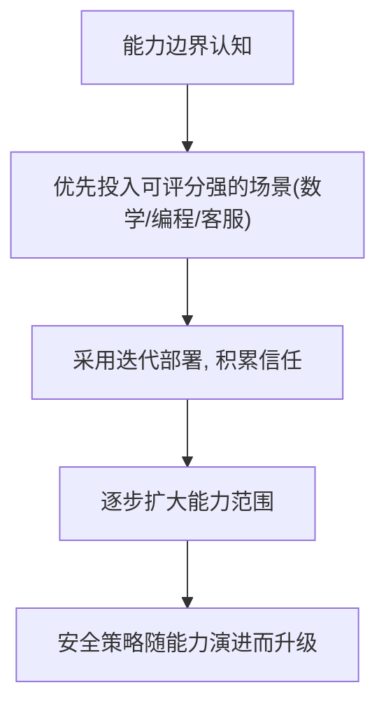
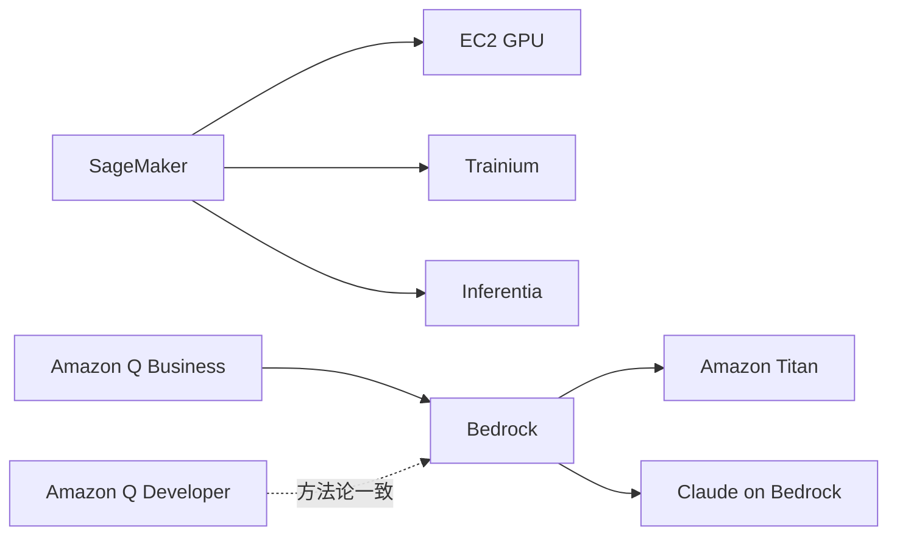

# AWS AI Platform（AI平台服务）

<cite>
**本文引用的文件**
- [sagemaker.md](file://knowledge/aws/ai-platform/sagemaker.md)
- [q-business.md](file://knowledge/aws/ai-application/q-business.md)
- [overview.md](file://knowledge/aws/maas/overview.md)
- [titan.md](file://knowledge/aws/maas/titan.md)
- [claude.md](file://knowledge/aws/maas/claude.md)
- [ec2-gpu.md](file://knowledge/aws/ai-infra/ec2-gpu.md)
- [inferentia.md](file://knowledge/aws/ai-infra/inferentia.md)
- [trainium.md](file://knowledge/aws/ai-infra/trainium.md)
- [q-developer.md](file://knowledge/aws/ai-coding/q-developer.md)
- [overview.md](file://knowledge/ai-general-notes/overview.md)
- [ai-capability-and-deployment.md](file://knowledge/ai-general-notes/ai-capability-and-deployment.md)
- [fine-tuning.md](file://knowledge/ai-general-notes/fine-tuning.md)
- [rag.md](file://knowledge/ai-general-notes/rag.md)
</cite>

## 目录
1. [简介](#简介)
2. [项目结构](#项目结构)
3. [核心组件](#核心组件)
4. [架构总览](#架构总览)
5. [详细组件分析](#详细组件分析)
6. [依赖分析](#依赖分析)
7. [性能考量](#性能考量)
8. [故障排查指南](#故障排查指南)
9. [结论](#结论)
10. [附录](#附录)

## 简介
本文件面向希望系统性理解与应用 AWS AI 平台服务的读者，围绕机器学习平台（SageMaker）、托管大模型服务（Bedrock 及其内置模型系列）、面向企业的 AI 应用（Amazon Q Business）、面向开发者的 AI 辅助（Amazon Q Developer）以及底层 AI 计算基础设施（EC2 GPU、Trainium、Inferentia）展开。文档结合仓库中的现有条目，梳理各产品定位、能力边界与部署哲学，并给出可操作的最佳实践与排障建议。

## 项目结构
仓库以“厂商-领域-主题”为组织方式，AWS AI 平台相关内容主要分布在以下路径：
- ai-platform：机器学习平台（SageMaker）
- maas：托管大模型服务（Bedrock、Titan、Claude on Bedrock）
- ai-application：面向企业与个人的应用（Amazon Q Business）
- ai-coding：开发者辅助（Amazon Q Developer）
- ai-infra：AI 计算基础设施（EC2 GPU、Trainium、Inferentia）
- ai-general-notes：通用 AI 能力与方法论（能力边界、迭代部署、微调、RAG）

图表来源
- [sagemaker.md:1-9](file://knowledge/aws/ai-platform/sagemaker.md#L1-L9)
- [overview.md:1-9](file://knowledge/aws/maas/overview.md#L1-L9)
- [titan.md:1-9](file://knowledge/aws/maas/titan.md#L1-L9)
- [claude.md:1-9](file://knowledge/aws/maas/claude.md#L1-L9)
- [q-business.md:1-9](file://knowledge/aws/ai-application/q-business.md#L1-L9)
- [q-developer.md:1-9](file://knowledge/aws/ai-coding/q-developer.md#L1-L9)
- [ec2-gpu.md:1-9](file://knowledge/aws/ai-infra/ec2-gpu.md#L1-L9)
- [trainium.md:1-9](file://knowledge/aws/ai-infra/trainium.md#L1-L9)
- [inferentia.md:1-9](file://knowledge/aws/ai-infra/inferentia.md#L1-L9)
- [ai-capability-and-deployment.md:1-135](file://knowledge/ai-general-notes/ai-capability-and-deployment.md#L1-L135)
- [fine-tuning.md:1-42](file://knowledge/ai-general-notes/fine-tuning.md#L1-L42)
- [rag.md:1-42](file://knowledge/ai-general-notes/rag.md#L1-L42)

章节来源
- [sagemaker.md:1-9](file://knowledge/aws/ai-platform/sagemaker.md#L1-L9)
- [overview.md:1-9](file://knowledge/aws/maas/overview.md#L1-L9)
- [q-business.md:1-9](file://knowledge/aws/ai-application/q-business.md#L1-L9)
- [q-developer.md:1-9](file://knowledge/aws/ai-coding/q-developer.md#L1-L9)
- [ec2-gpu.md:1-9](file://knowledge/aws/ai-infra/ec2-gpu.md#L1-L9)
- [trainium.md:1-9](file://knowledge/aws/ai-infra/trainium.md#L1-L9)
- [inferentia.md:1-9](file://knowledge/aws/ai-infra/inferentia.md#L1-L9)
- [ai-capability-and-deployment.md:1-135](file://knowledge/ai-general-notes/ai-capability-and-deployment.md#L1-L135)
- [fine-tuning.md:1-42](file://knowledge/ai-general-notes/fine-tuning.md#L1-L42)
- [rag.md:1-42](file://knowledge/ai-general-notes/rag.md#L1-L42)

## 核心组件
- SageMaker（机器学习平台）
  - 定位：AWS 机器学习全托管平台
  - 能力：覆盖从数据准备、训练、评估到部署的全流程，支持多框架与自动超参搜索、模型打包与端到端部署
  - 适用场景：结构化/非结构化数据建模、图像/文本处理、实时/批量推理
  - 与基础设施的关系：可直接使用 EC2 GPU、Trainium、Inferentia 实例或托管训练/推理资源
- Bedrock（托管大模型服务）
  - 定位：AWS 托管大模型服务，一键调用主流基础模型
  - 能力：提供多种基础模型访问入口，支持提示工程、流式响应、安全与合规控制
  - 与模型系列的关系：内置 Amazon Titan 系列与第三方模型（如 Claude on Bedrock）
- Amazon Q Business（企业级 AI 助手）
  - 定位：面向企业的 AI 助手，连接企业数据进行问答与任务执行
  - 适用场景：知识检索、文档问答、工作流程自动化
- Amazon Q Developer（AI 编程助手）
  - 定位：AWS AI 编程助手（原 CodeWhisperer）
  - 适用场景：代码生成、补全、重构、安全扫描与最佳实践建议
- AI 基础设施
  - EC2 GPU：P5、P4d 等 GPU 实例，适合训练与推理
  - Trainium：自研训练芯片，面向高吞吐训练场景
  - Inferentia：自研推理芯片，面向低延迟高吞吐推理场景

章节来源
- [sagemaker.md:1-9](file://knowledge/aws/ai-platform/sagemaker.md#L1-L9)
- [overview.md:1-9](file://knowledge/aws/maas/overview.md#L1-L9)
- [titan.md:1-9](file://knowledge/aws/maas/titan.md#L1-L9)
- [claude.md:1-9](file://knowledge/aws/maas/claude.md#L1-L9)
- [q-business.md:1-9](file://knowledge/aws/ai-application/q-business.md#L1-L9)
- [q-developer.md:1-9](file://knowledge/aws/ai-coding/q-developer.md#L1-L9)
- [ec2-gpu.md:1-9](file://knowledge/aws/ai-infra/ec2-gpu.md#L1-L9)
- [trainium.md:1-9](file://knowledge/aws/ai-infra/trainium.md#L1-L9)
- [inferentia.md:1-9](file://knowledge/aws/ai-infra/inferentia.md#L1-L9)

## 架构总览
下图展示 AWS AI 平台在端到端 AI 生命周期中的角色与协作关系：开发者通过 SageMaker 进行训练与部署，企业用户通过 Amazon Q Business 使用 Bedrock 的基础模型能力，开发者借助 Amazon Q Developer 提升编码效率；底层由 EC2 GPU、Trainium、Inferentia 提供算力支撑。

图表来源
- [sagemaker.md:1-9](file://knowledge/aws/ai-platform/sagemaker.md#L1-L9)
- [overview.md:1-9](file://knowledge/aws/maas/overview.md#L1-L9)
- [titan.md:1-9](file://knowledge/aws/maas/titan.md#L1-L9)
- [claude.md:1-9](file://knowledge/aws/maas/claude.md#L1-L9)
- [q-business.md:1-9](file://knowledge/aws/ai-application/q-business.md#L1-L9)
- [q-developer.md:1-9](file://knowledge/aws/ai-coding/q-developer.md#L1-L9)
- [ec2-gpu.md:1-9](file://knowledge/aws/ai-infra/ec2-gpu.md#L1-L9)
- [trainium.md:1-9](file://knowledge/aws/ai-infra/trainium.md#L1-L9)
- [inferentia.md:1-9](file://knowledge/aws/ai-infra/inferentia.md#L1-L9)

## 详细组件分析

### SageMaker（机器学习平台）
- 角色与定位
  - 全托管机器学习平台，覆盖数据标注、训练、模型评估、模型打包与部署
  - 支持多框架生态与自动超参搜索，降低 ML 工程门槛
- 与基础设施的关系
  - 可直接选择 EC2 GPU、Trainium、Inferentia 实例作为训练/推理节点
  - 也可使用 SageMaker 托管的训练与推理资源，简化运维
- 应用场景
  - 结构化/非结构化数据建模、图像/文本处理、实时/批量推理
- 最佳实践
  - 数据准备阶段进行数据质量检查与特征工程
  - 使用自动超参搜索与交叉验证提升模型稳定性
  - 将模型封装为可复用的模型包，配合端到端流水线部署

图表来源
- [sagemaker.md:1-9](file://knowledge/aws/ai-platform/sagemaker.md#L1-L9)

章节来源
- [sagemaker.md:1-9](file://knowledge/aws/ai-platform/sagemaker.md#L1-L9)
- [ec2-gpu.md:1-9](file://knowledge/aws/ai-infra/ec2-gpu.md#L1-L9)
- [trainium.md:1-9](file://knowledge/aws/ai-infra/trainium.md#L1-L9)
- [inferentia.md:1-9](file://knowledge/aws/ai-infra/inferentia.md#L1-L9)

### Bedrock（托管大模型服务）
- 角色与定位
  - 一键调用主流基础模型，提供统一的提示工程与安全控制接口
- 模型系列
  - Amazon Titan：AWS 自研基础模型系列
  - Claude on Bedrock：Anthropic Claude 系列模型的托管版本
- 应用场景
  - 文本生成、摘要、分类、对话、代码生成等
- 最佳实践
  - 使用结构化提示与示例引导模型输出
  - 结合 Guardrails 与合规策略，确保输出安全可控
  - 通过流式响应优化用户体验

图表来源
- [overview.md:1-9](file://knowledge/aws/maas/overview.md#L1-L9)
- [titan.md:1-9](file://knowledge/aws/maas/titan.md#L1-L9)
- [claude.md:1-9](file://knowledge/aws/maas/claude.md#L1-L9)

章节来源
- [overview.md:1-9](file://knowledge/aws/maas/overview.md#L1-L9)
- [titan.md:1-9](file://knowledge/aws/maas/titan.md#L1-L9)
- [claude.md:1-9](file://knowledge/aws/maas/claude.md#L1-L9)

### Amazon Q Business（企业级 AI 助手）
- 角色与定位
  - 连接企业数据源，提供智能问答与任务执行
- 应用场景
  - 知识检索、文档问答、工作流程自动化
- 最佳实践
  - 明确数据接入范围与权限控制
  - 通过提示工程与检索增强生成（RAG）提升回答准确性

章节来源
- [q-business.md:1-9](file://knowledge/aws/ai-application/q-business.md#L1-L9)
- [rag.md:1-42](file://knowledge/ai-general-notes/rag.md#L1-L42)

### Amazon Q Developer（AI 编程助手）
- 角色与定位
  - AI 编程助手（原 CodeWhisperer），提供代码生成、补全与安全建议
- 应用场景
  - 快速原型、代码补全、重构与安全扫描
- 最佳实践
  - 将 AI 输出纳入代码审查流程
  - 结合静态分析与测试保障质量

章节来源
- [q-developer.md:1-9](file://knowledge/aws/ai-coding/q-developer.md#L1-L9)

### AI 基础设施（EC2 GPU、Trainium、Inferentia）
- EC2 GPU
  - 适用于训练与推理的通用 GPU 实例族（如 P5、P4d）
- Trainium
  - 自研训练芯片，面向高吞吐训练场景
- Inferentia
  - 自研推理芯片，面向低延迟高吞吐推理场景
- 选型建议
  - 训练优先考虑 Trainium/高性能 GPU；推理优先考虑 Inferentia 或 GPU

章节来源
- [ec2-gpu.md:1-9](file://knowledge/aws/ai-infra/ec2-gpu.md#L1-L9)
- [trainium.md:1-9](file://knowledge/aws/ai-infra/trainium.md#L1-L9)
- [inferentia.md:1-9](file://knowledge/aws/ai-infra/inferentia.md#L1-L9)

### 通用方法论与能力边界
- 能力边界与迭代部署
  - AI 能力在不同领域呈现锯齿状差异；强化学习依赖可评分标准
  - 安全策略应采用迭代部署，而非等待完美
- 微调（Fine-tuning）
  - 在预训练模型基础上使用领域数据继续训练以适配特定任务
- 检索增强生成（RAG）
  - 结合检索与生成的增强生成技术，减少幻觉、提升事实性

图表来源
- [ai-capability-and-deployment.md:1-135](file://knowledge/ai-general-notes/ai-capability-and-deployment.md#L1-L135)
- [fine-tuning.md:1-42](file://knowledge/ai-general-notes/fine-tuning.md#L1-L42)
- [rag.md:1-42](file://knowledge/ai-general-notes/rag.md#L1-L42)

章节来源
- [ai-capability-and-deployment.md:1-135](file://knowledge/ai-general-notes/ai-capability-and-deployment.md#L1-L135)
- [fine-tuning.md:1-42](file://knowledge/ai-general-notes/fine-tuning.md#L1-L42)
- [rag.md:1-42](file://knowledge/ai-general-notes/rag.md#L1-L42)

## 依赖分析
- SageMaker 与基础设施耦合度高，既可使用托管资源，也可选择自有实例族（EC2 GPU、Trainium、Inferentia）
- Bedrock 作为统一入口，依赖基础模型系列（Amazon Titan、Claude on Bedrock）
- Amazon Q Business 与 Bedrock 强关联，用于企业数据接入与任务执行
- Amazon Q Developer 与 Bedrock 无直接耦合，但共享统一的提示工程与安全控制思想

图表来源
- [sagemaker.md:1-9](file://knowledge/aws/ai-platform/sagemaker.md#L1-L9)
- [overview.md:1-9](file://knowledge/aws/maas/overview.md#L1-L9)
- [titan.md:1-9](file://knowledge/aws/maas/titan.md#L1-L9)
- [claude.md:1-9](file://knowledge/aws/maas/claude.md#L1-L9)
- [q-business.md:1-9](file://knowledge/aws/ai-application/q-business.md#L1-L9)
- [q-developer.md:1-9](file://knowledge/aws/ai-coding/q-developer.md#L1-L9)
- [ec2-gpu.md:1-9](file://knowledge/aws/ai-infra/ec2-gpu.md#L1-L9)
- [trainium.md:1-9](file://knowledge/aws/ai-infra/trainium.md#L1-L9)
- [inferentia.md:1-9](file://knowledge/aws/ai-infra/inferentia.md#L1-L9)

章节来源
- [sagemaker.md:1-9](file://knowledge/aws/ai-platform/sagemaker.md#L1-L9)
- [overview.md:1-9](file://knowledge/aws/maas/overview.md#L1-L9)
- [titan.md:1-9](file://knowledge/aws/maas/titan.md#L1-L9)
- [claude.md:1-9](file://knowledge/aws/maas/claude.md#L1-L9)
- [q-business.md:1-9](file://knowledge/aws/ai-application/q-business.md#L1-L9)
- [q-developer.md:1-9](file://knowledge/aws/ai-coding/q-developer.md#L1-L9)
- [ec2-gpu.md:1-9](file://knowledge/aws/ai-infra/ec2-gpu.md#L1-L9)
- [trainium.md:1-9](file://knowledge/aws/ai-infra/trainium.md#L1-L9)
- [inferentia.md:1-9](file://knowledge/aws/ai-infra/inferentia.md#L1-L9)

## 性能考量
- 训练性能
  - 优先选择 Trainium 以获得更高吞吐与更低时延
  - 对于混合负载，可结合 EC2 GPU 实例进行灵活调度
- 推理性能
  - Inferentia 适合低延迟高吞吐场景
  - Bedrock 的流式响应可显著改善交互体验
- 资源成本
  - 根据任务类型选择合适实例族，避免过度配置
  - 利用 SageMaker 的自动扩缩容与批处理能力降低空闲成本

## 故障排查指南
- 训练失败
  - 检查数据格式与特征工程是否符合框架要求
  - 查看日志与指标，确认资源是否充足（CPU/GPU/内存）
- 推理异常
  - 核对输入提示与上下文长度限制
  - 检查安全策略与合规开关是否导致输出被过滤
- 部署回滚
  - 使用 SageMaker 的蓝绿/金丝雀发布策略，快速回滚
  - 保留历史模型版本与配置，便于审计与恢复

## 结论
AWS AI 平台通过 SageMaker、Bedrock、Amazon Q Business、Amazon Q Developer 与自研芯片（Trainium、Inferentia）形成“平台+模型+应用+基础设施”的完整闭环。结合“能力边界与迭代部署”的方法论，可在保证安全的前提下，以最小成本快速验证与规模化落地 AI 能力。建议在训练侧优先采用托管训练资源与自动超参搜索，在推理侧优先采用托管模型与流式响应，并通过基础设施选型实现性能与成本的平衡。

## 附录
- 使用指南与最佳实践
  - 训练与部署：优先使用 SageMaker 端到端流水线，结合自动超参搜索与模型打包
  - 大模型调用：通过 Bedrock 统一入口，结合提示工程与 Guardrails
  - 企业应用：以 Amazon Q Business 为入口，打通企业数据与工作流
  - 开发效率：借助 Amazon Q Developer 提升编码速度与质量
- 项目实战建议
  - 从“可评分强”的场景入手（如客服、代码生成），积累经验与信任
  - 逐步引入 RAG 与微调，提升垂直领域表现
  - 建立持续监控与回滚机制，确保线上稳定