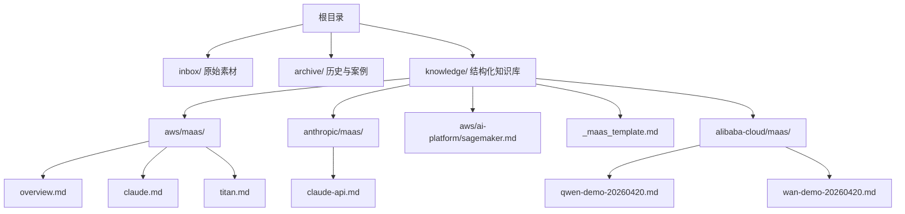
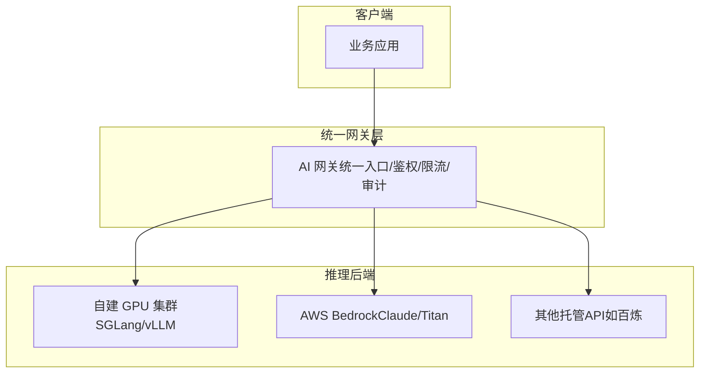
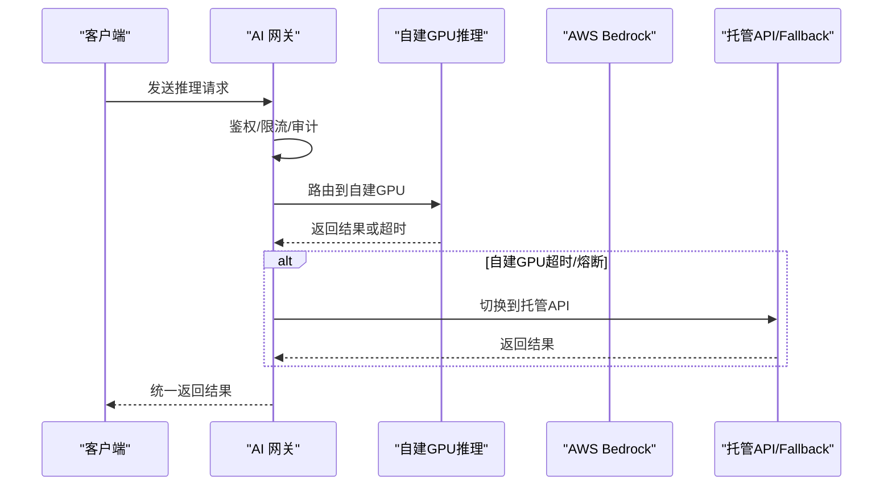
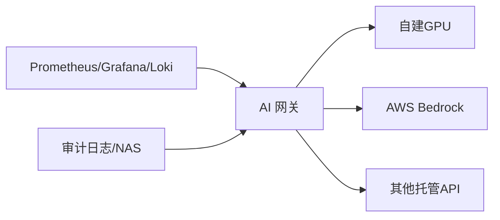

# AWS MaaS（模型即服务）

<cite>
**本文引用的文件**
- [README.md](file://README.md)
- [aws/maas/overview.md](file://knowledge/aws/maas/overview.md)
- [aws/maas/claude.md](file://knowledge/aws/maas/claude.md)
- [aws/maas/titan.md](file://knowledge/aws/maas/titan.md)
- [_maas_template.md](file://knowledge/_maas_template.md)
- [anthropic/maas/claude-api.md](file://knowledge/anthropic/maas/claude-api.md)
- [aws/ai-platform/sagemaker.md](file://knowledge/aws/ai-platform/sagemaker.md)
- [archive/20260420.md](file://archive/20260420.md)
- [archive/20260518.md](file://archive/20260518.md)
- [alibaba-cloud/maas/qwen-demo-20260420.md](file://knowledge/alibaba-cloud/maas/qwen-demo-20260420.md)
- [alibaba-cloud/maas/wan-demo-20260420.md](file://knowledge/alibaba-cloud/maas/wan-demo-20260420.md)
</cite>

## 目录
1. [简介](#简介)
2. [项目结构](#项目结构)
3. [核心组件](#核心组件)
4. [架构总览](#架构总览)
5. [详细组件分析](#详细组件分析)
6. [依赖关系分析](#依赖关系分析)
7. [性能考量](#性能考量)
8. [故障排查指南](#故障排查指南)
9. [结论](#结论)
10. [附录](#附录)

## 简介
本文件面向AWS MaaS（模型即服务）的知识沉淀与对外说明，围绕AWS托管的大模型服务（Bedrock）及其上托管的Claude与Amazon Titan等模型进行系统化梳理。文档基于仓库中的模板与现有材料，结合竞品维度与平台能力，构建从架构理念、技术实现到应用场景与选型建议的全景视图，并提供可落地的使用指南与最佳实践。

## 项目结构
该项目采用“按领域与厂商分层”的知识组织方式，AWS MaaS相关内容集中在aws/maas目录，同时通过模板文件与竞品分析材料支撑标准化文档与对比视角。

图表来源
- [aws/maas/overview.md:1-9](file://knowledge/aws/maas/overview.md#L1-L9)
- [aws/maas/claude.md:1-9](file://knowledge/aws/maas/claude.md#L1-L9)
- [aws/maas/titan.md:1-9](file://knowledge/aws/maas/titan.md#L1-L9)
- [anthropic/maas/claude-api.md:1-9](file://knowledge/anthropic/maas/claude-api.md#L1-L9)
- [aws/ai-platform/sagemaker.md:1-9](file://knowledge/aws/ai-platform/sagemaker.md#L1-L9)
- [_maas_template.md:1-65](file://knowledge/_maas_template.md#L1-L65)
- [alibaba-cloud/maas/qwen-demo-20260420.md:1-47](file://knowledge/alibaba-cloud/maas/qwen-demo-20260420.md#L1-L47)
- [alibaba-cloud/maas/wan-demo-20260420.md:1-57](file://knowledge/alibaba-cloud/maas/wan-demo-20260420.md#L1-L57)

章节来源
- [README.md:1-20](file://README.md#L1-L20)
- [aws/maas/overview.md:1-9](file://knowledge/aws/maas/overview.md#L1-L9)
- [_maas_template.md:1-65](file://knowledge/_maas_template.md#L1-L65)

## 核心组件
- AWS Bedrock（托管大模型服务）
  - 定位：AWS 托管大模型服务，一键调用主流 Foundation Models
  - 状态：Draft
- Claude on Bedrock（Anthropic Claude系列模型在Bedrock上的托管）
  - 定位：Anthropic Claude 系列模型在 Bedrock 上的托管服务
  - 状态：Draft
- Amazon Titan（AWS自研基础模型系列）
  - 定位：AWS 自研基础模型系列
  - 状态：Draft
- Claude API（Anthropic Claude模型API服务）
  - 定位：Anthropic Claude 模型 API 服务（Claude Opus / Sonnet / Haiku）
  - 状态：Draft
- SageMaker（AWS机器学习全托管平台）
  - 定位：AWS 机器学习全托管平台
  - 状态：Draft

章节来源
- [aws/maas/overview.md:1-9](file://knowledge/aws/maas/overview.md#L1-L9)
- [aws/maas/claude.md:1-9](file://knowledge/aws/maas/claude.md#L1-L9)
- [aws/maas/titan.md:1-9](file://knowledge/aws/maas/titan.md#L1-L9)
- [anthropic/maas/claude-api.md:1-9](file://knowledge/anthropic/maas/claude-api.md#L1-L9)
- [aws/ai-platform/sagemaker.md:1-9](file://knowledge/aws/ai-platform/sagemaker.md#L1-L9)

## 架构总览
AWS MaaS的架构理念可概括为“统一入口、按需调度、弹性扩展、可观测与合规”。下图展示了以网关为中心的统一入口与多后端（自建GPU/托管API）协同的总体思路，该模式同样适用于AWS Bedrock与Claude/Titan的集成与路由策略。

说明
- 统一网关负责鉴权、限流、路由与审计，屏蔽后端差异
- 自建GPU与托管API作为双轨并行的推理后端，支持自动熔断与降级
- 该架构可映射到AWS MaaS的路由与混合推理策略

（本图为概念性架构示意，不直接对应具体源码文件，故不附图表来源）

## 详细组件分析

### AWS Bedrock（托管大模型服务）
- 定位与价值
  - 提供一键调用主流Foundation Models的托管能力，降低接入与运维门槛
  - 适合作为MaaS的统一入口，与自建推理或第三方API形成混合推理架构
- 与Claude/Titan的关系
  - Claude on Bedrock：在Bedrock上托管Claude系列模型，便于统一计费与路由
  - Amazon Titan：AWS自研基础模型系列，适合对数据隐私与合规有更高要求的场景
- 选型建议
  - 对齐业务SLA与合规要求：若强调数据驻留与合规，优先考虑Titan或自建GPU
  - 对齐成本与易用性：若追求快速上线与多模型比选，Bedrock是首选

章节来源
- [aws/maas/overview.md:1-9](file://knowledge/aws/maas/overview.md#L1-L9)
- [aws/maas/claude.md:1-9](file://knowledge/aws/maas/claude.md#L1-L9)
- [aws/maas/titan.md:1-9](file://knowledge/aws/maas/titan.md#L1-L9)

### Claude on Bedrock（Claude系列模型）
- 定位
  - Anthropic Claude 系列模型在 Bedrock 上的托管服务
- 能力与限制（基于模板字段）
  - 可参考模板中的“当前主推模型”“核心能力与限制”“适用场景”等字段进行填充
- 与Claude API的关系
  - Claude API提供原生接口能力，Bedrock提供统一入口与托管编排
- 选型建议
  - 若需要与AWS生态深度集成与统一计费，优先Bedrock托管
  - 若需要原生API的灵活性与定制化，可考虑Claude API

章节来源
- [aws/maas/claude.md:1-9](file://knowledge/aws/maas/claude.md#L1-L9)
- [anthropic/maas/claude-api.md:1-9](file://knowledge/anthropic/maas/claude-api.md#L1-L9)
- [_maas_template.md:12-50](file://knowledge/_maas_template.md#L12-L50)

### Amazon Titan（AWS自研基础模型）
- 定位
  - AWS 自研基础模型系列
- 适用场景
  - 对数据隐私、合规与可控性要求较高的企业级应用
- 与Bedrock的关系
  - 作为Bedrock上托管的模型之一，具备统一的计费与路由能力

章节来源
- [aws/maas/titan.md:1-9](file://knowledge/aws/maas/titan.md#L1-L9)

### 混合推理与路由策略（通用最佳实践）
- 统一网关
  - 一个入口管控所有 LLM 流量，业务无需感知后端变更
- 混合推理双轨
  - 自建 GPU 主力 + 托管API（如Bedrock/百炼）Fallback，自动熔断降级
- 可观测与合规
  - 全链路可观测（请求级Token统计、模型级延迟/吞吐量、GPU指标、日志审计）
- 路由决策
  - 按业务App/模型类型进行分流，支持灰度发布与弹性扩缩

图表来源
- [archive/20260518.md:218-256](file://archive/20260518.md#L218-L256)

章节来源
- [archive/20260518.md:17-39](file://archive/20260518.md#L17-L39)
- [archive/20260518.md:217-256](file://archive/20260518.md#L217-L256)

### 使用指南与API调用示例（参考竞品与模板）
- 通用调用流程
  - 选择模型（如Claude/Titan/Plus等）
  - 准备消息结构（system/user/assistant）
  - 发送请求并解析响应
- 示例参考（以OpenAI兼容格式为例）
  - 参考“Qwen3.6-Plus API调用”示例，展示OpenAI兼容的调用方式与长上下文处理
  - 参考“Wan2.6 文生视频/图生视频/图像生成”示例，展示多模态生成任务的调用方式
- 与AWS Bedrock的对接
  - 可将上述OpenAI兼容的调用封装为统一SDK，通过网关路由到Bedrock或自建GPU
  - 在网关侧实现统一鉴权、限流与审计

章节来源
- [alibaba-cloud/maas/qwen-demo-20260420.md:6-47](file://knowledge/alibaba-cloud/maas/qwen-demo-20260420.md#L6-L47)
- [alibaba-cloud/maas/wan-demo-20260420.md:6-57](file://knowledge/alibaba-cloud/maas/wan-demo-20260420.md#L6-L57)

### 能力对比与选型建议（基于模板与竞品维度）
- 模板字段指引
  - “当前主推模型”“核心能力与限制”“适用场景”“关键技术论文”“参考资料”“Changelog”
- 竞品维度参考
  - 可参考“Qwen3.6-Max-Plus差异分析”中的维度（综合智能指数、Agentic Coding、上下文窗口、多模态、推理成本、推理速度、状态等）进行横向对比
- 选型建议
  - AI Agent/自动编程：优先上下文窗口大、多模态、性价比高的模型
  - 科研/数学/复杂推理：优先综合智能指数高、思考深度更强的模型
  - 长文档分析：优先上下文窗口更大的模型
  - 生产环境稳定性：优先GA状态、成熟度更高的模型

章节来源
- [_maas_template.md:12-65](file://knowledge/_maas_template.md#L12-L65)
- [archive/20260420.md:15-57](file://archive/20260420.md#L15-L57)

## 依赖关系分析
- 组件耦合
  - 网关与后端推理服务解耦，通过Provider注册与路由规则实现松耦合
  - 自建GPU与托管API作为双轨，通过健康检查与熔断机制实现高可用
- 外部依赖
  - 与AWS Bedrock、Anthropic Claude API、阿里云百炼等外部服务的对接
- 潜在风险
  - 网关单副本风险、跨机张量并行的复杂性、监控与日志的收敛

图表来源
- [archive/20260518.md:118-150](file://archive/20260518.md#L118-L150)
- [archive/20260518.md:260-288](file://archive/20260518.md#L260-L288)

章节来源
- [archive/20260518.md:118-150](file://archive/20260518.md#L118-L150)
- [archive/20260518.md:260-288](file://archive/20260518.md#L260-L288)

## 性能考量
- 跨机张量并行的成本与收益
  - 单机TP即可覆盖多数2B以下模型，跨机TP带来通信开销与复杂度，需权衡TTFT与吞吐
- 资源隔离与弹性
  - 通过多副本与HPA实现弹性伸缩，避免单点瓶颈
- 监控与可观测
  - 统一Prometheus采集与可视化，结合GPU指标与业务指标进行容量与成本归集

（本节为通用性能讨论，不直接分析具体文件，故不附章节来源）

## 故障排查指南
- 网关单副本风险
  - 建议扩容至2-3副本并配置反亲和，配合SLB/ALB实现四层负载
- 健康检查与熔断
  - 明确自建GPU超时/队列深度/错误率阈值，自动切换到托管API
- RDMA与NCCL参数
  - 明确H20+RDMA的IB/HCA与网络接口配置，避免跨机通信异常
- 日志与审计
  - 明确全量与元数据审计范围，合理规划存储容量

章节来源
- [archive/20260518.md:355-396](file://archive/20260518.md#L355-L396)
- [archive/20260518.md:405-425](file://archive/20260518.md#L405-L425)

## 结论
AWS MaaS以Bedrock为核心入口，结合Claude与Titan等模型，为企业提供统一、弹性、可观测且合规的模型即服务方案。通过网关与混合推理策略，可在保证SLA的同时兼顾成本与扩展性。建议在生产环境中优先考虑网关解耦、健康检查与熔断、监控与审计的完善配置，并基于模板化文档持续沉淀模型能力与选型经验。

（本节为总结性内容，不直接分析具体文件，故不附章节来源）

## 附录
- 模板字段与填充建议
  - 当前主推模型：依据竞品评测与业务需求确定
  - 核心能力与限制：从推理能力、上下文、多模态、成本、速度、稳定性等维度梳理
  - 适用场景：明确Agent编程、科研推理、长文档分析、多模态理解等场景
  - 参考资料：链接权威评测与官方文档
- 竞品维度参考
  - 可参考“Qwen3.6-Max-Plus差异分析”中的评测维度与结论，作为横向对比的基准

章节来源
- [_maas_template.md:12-65](file://knowledge/_maas_template.md#L12-L65)
- [archive/20260420.md:15-57](file://archive/20260420.md#L15-L57)