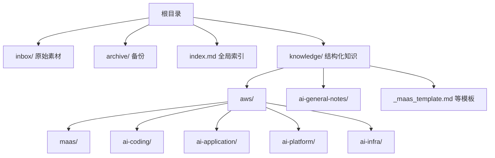
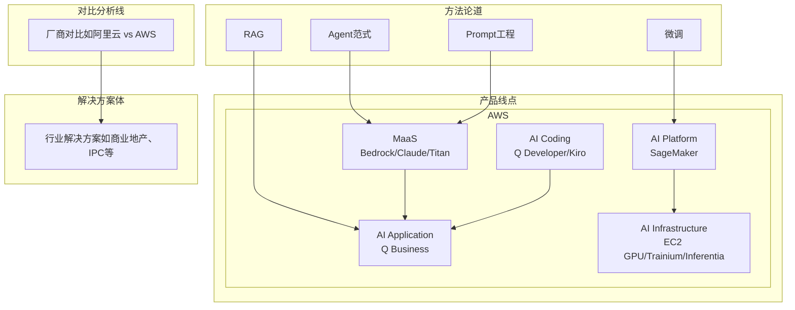
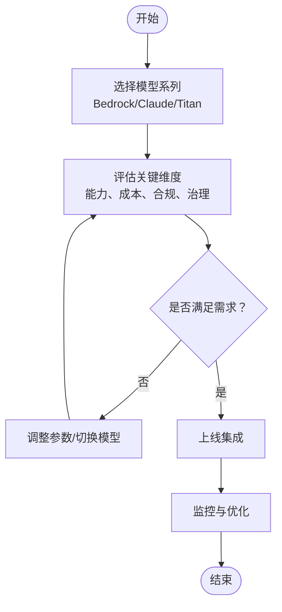
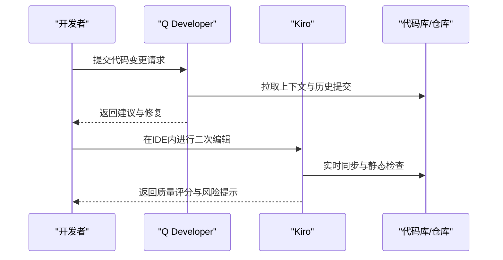
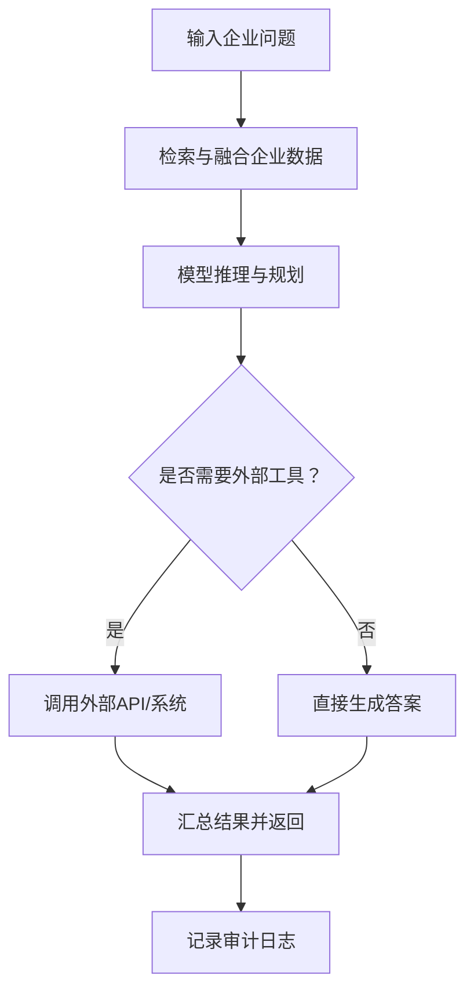
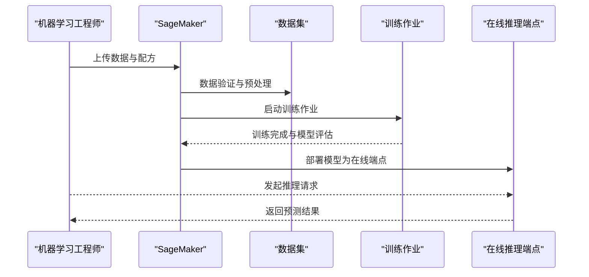
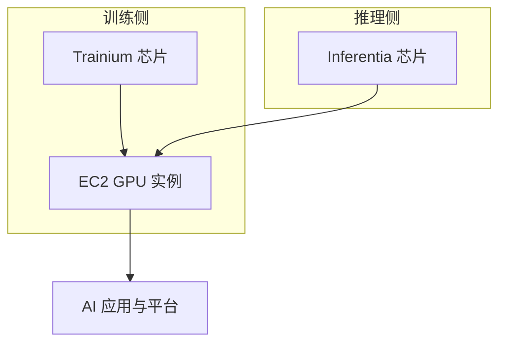
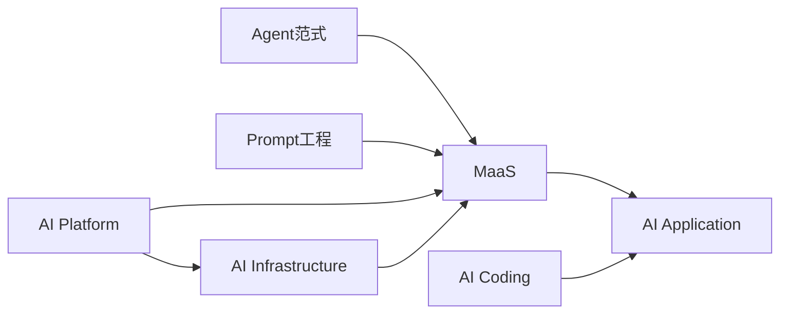

# AWS知识库

<cite>
**本文档引用的文件**
- [README.md](file://README.md)
- [index.md](file://index.md)
- [aws/maas/overview.md](file://knowledge/aws/maas/overview.md)
- [aws/maas/claude.md](file://knowledge/aws/maas/claude.md)
- [aws/maas/titan.md](file://knowledge/aws/maas/titan.md)
- [aws/ai-coding/q-developer.md](file://knowledge/aws/ai-coding/q-developer.md)
- [aws/ai-coding/kiro.md](file://knowledge/aws/ai-coding/kiro.md)
- [aws/ai-application/q-business.md](file://knowledge/aws/ai-application/q-business.md)
- [aws/ai-platform/sagemaker.md](file://knowledge/aws/ai-platform/sagemaker.md)
- [aws/ai-infra/ec2-gpu.md](file://knowledge/aws/ai-infra/ec2-gpu.md)
- [aws/ai-infra/trainium.md](file://knowledge/aws/ai-infra/trainium.md)
- [aws/ai-infra/inferentia.md](file://knowledge/aws/ai-infra/inferentia.md)
- [_maas_template.md](file://knowledge/_maas_template.md)
- [ai-general-notes/overview.md](file://knowledge/ai-general-notes/overview.md)
- [ai-general-notes/agent-def.md](file://knowledge/ai-general-notes/agent-def.md)
- [ai-general-notes/prompt-engineering.md](file://knowledge/ai-general-notes/prompt-engineering.md)
</cite>

## 目录
1. [简介](#简介)
2. [项目结构](#项目结构)
3. [核心组件](#核心组件)
4. [架构总览](#架构总览)
5. [详细组件分析](#详细组件分析)
6. [依赖分析](#依赖分析)
7. [性能考虑](#性能考虑)
8. [故障排查指南](#故障排查指南)
9. [结论](#结论)
10. [附录](#附录)

## 简介
本知识库面向AI平台与应用的系统化知识沉淀，围绕“道-点-线-体”四个维度组织内容：  
- 道：跨厂商的AI通用方法论与范式（如Agent、Prompt工程、RAG、微调等）  
- 点：单产品知识（各厂商具体产品与能力）  
- 线：对比分析（如阿里云 vs AWS 等）  
- 体：行业解决方案（可复用的规模化应用案例）

AWS知识库聚焦于以下产品线：  
- MaaS（模型即服务）：Bedrock、Claude（通过Bedrock托管）、Titan（自研基础模型）  
- AI Coding（AI编程助手）：Amazon Q Developer（原CodeWhisperer）、Kiro（AI原生IDE）  
- AI Application（AI应用）：Amazon Q Business（企业级AI助手）  
- AI Platform（AI平台）：SageMaker（全托管机器学习平台）  
- AI Infrastructure（AI基础设施）：EC2 GPU、Trainium（训练芯片）、Inferentia（推理芯片）

知识库采用“知识提炼-结构化沉淀-全局索引”的流程，确保内容可检索、可复用、可持续演进。

**章节来源**
- [README.md:1-20](file://README.md#L1-L20)
- [index.md:1-69](file://index.md#L1-L69)

## 项目结构
知识库采用“按领域与厂商分层”的目录组织方式：  
- 根目录包含全局索引与说明  
- knowledge/ 下按厂商与产品线细分：aws/maas、aws/ai-coding、aws/ai-application、aws/ai-platform、aws/ai-infra  
- 通用方法论与模板位于 ai-general-notes 与根模板文件夹  
- inbox/ 存放原始素材，archive/ 用于备份  
- 通过 index.md 提供全局导航与快速定位

**图表来源**
- [index.md:1-69](file://index.md#L1-L69)

**章节来源**
- [README.md:13-17](file://README.md#L13-L17)
- [index.md:1-69](file://index.md#L1-L69)

## 核心组件
- MaaS（模型即服务）：统一接入主流基础模型，提供托管与定制化能力，覆盖推理、微调与安全治理  
- AI Coding（AI编程助手）：面向开发者的智能编程助手与原生IDE，提升研发效率与质量  
- AI Application（AI应用）：面向企业场景的智能助手，连接企业数据与工作流，实现问答与任务执行  
- AI Platform（AI平台）：提供端到端机器学习生命周期管理，涵盖数据、训练、评估、部署与监控  
- AI Infrastructure（AI基础设施）：提供高性能计算与专用芯片，支撑训练与推理的规模化需求  

**章节来源**
- [index.md:29-34](file://index.md#L29-L34)

## 架构总览
知识库整体采用“方法论驱动 + 产品线落地 + 对比分析 + 解决方案复用”的闭环：  
- 方法论（道）：Agent、Prompt工程、RAG、微调等通用范式  
- 产品线（点）：AWS各产品线能力与选型建议  
- 对比分析（线）：厂商间能力与定位差异  
- 解决方案（体）：可复制的行业规模化案例  

**图表来源**
- [index.md:6-69](file://index.md#L6-L69)

## 详细组件分析

### MaaS（模型即服务）
- Bedrock：AWS托管大模型服务，统一接入主流基础模型，提供安全、合规与治理能力  
- Claude（通过Bedrock托管）：Anthropic Claude系列模型在Bedrock上的托管形态  
- Titan：AWS自研基础模型系列，强调安全性与可控性  

**图表来源**
- [aws/maas/overview.md:1-9](file://knowledge/aws/maas/overview.md#L1-L9)
- [aws/maas/claude.md:1-9](file://knowledge/aws/maas/claude.md#L1-L9)
- [aws/maas/titan.md:1-9](file://knowledge/aws/maas/titan.md#L1-L9)

**章节来源**
- [aws/maas/overview.md:1-9](file://knowledge/aws/maas/overview.md#L1-L9)
- [aws/maas/claude.md:1-9](file://knowledge/aws/maas/claude.md#L1-L9)
- [aws/maas/titan.md:1-9](file://knowledge/aws/maas/titan.md#L1-L9)

### AI Coding（AI编程助手）
- Amazon Q Developer（原CodeWhisperer）：面向开发者的智能编程助手，提供代码补全、安全扫描与最佳实践建议  
- Kiro：AI原生IDE，面向云端原生开发体验，提供一体化的开发与调试能力  

**图表来源**
- [aws/ai-coding/q-developer.md:1-9](file://knowledge/aws/ai-coding/q-developer.md#L1-L9)
- [aws/ai-coding/kiro.md:1-9](file://knowledge/aws/ai-coding/kiro.md#L1-L9)

**章节来源**
- [aws/ai-coding/q-developer.md:1-9](file://knowledge/aws/ai-coding/q-developer.md#L1-L9)
- [aws/ai-coding/kiro.md:1-9](file://knowledge/aws/ai-coding/kiro.md#L1-L9)

### AI Application（AI应用）
- Amazon Q Business：面向企业的AI助手，连接企业数据与工作流，支持问答与任务执行，强调安全与合规  

**图表来源**
- [aws/ai-application/q-business.md:1-9](file://knowledge/aws/ai-application/q-business.md#L1-L9)

**章节来源**
- [aws/ai-application/q-business.md:1-9](file://knowledge/aws/ai-application/q-business.md#L1-L9)

### AI Platform（AI平台）
- SageMaker：全托管机器学习平台，覆盖数据、训练、评估、部署与监控，支持端到端模型生命周期管理  

**图表来源**
- [aws/ai-platform/sagemaker.md:1-9](file://knowledge/aws/ai-platform/sagemaker.md#L1-L9)

**章节来源**
- [aws/ai-platform/sagemaker.md:1-9](file://knowledge/aws/ai-platform/sagemaker.md#L1-L9)

### AI Infrastructure（AI基础设施）
- EC2 GPU：提供P5、P4d等GPU实例，满足高吞吐训练与推理需求  
- Trainium：AWS自研训练芯片，面向大规模模型训练的高性价比与高能效  
- Inferentia：AWS自研推理芯片，面向低延迟、高吞吐的生产级推理  

**图表来源**
- [aws/ai-infra/ec2-gpu.md:1-9](file://knowledge/aws/ai-infra/ec2-gpu.md#L1-L9)
- [aws/ai-infra/trainium.md:1-9](file://knowledge/aws/ai-infra/trainium.md#L1-L9)
- [aws/ai-infra/inferentia.md:1-9](file://knowledge/aws/ai-infra/inferentia.md#L1-L9)

**章节来源**
- [aws/ai-infra/ec2-gpu.md:1-9](file://knowledge/aws/ai-infra/ec2-gpu.md#L1-L9)
- [aws/ai-infra/trainium.md:1-9](file://knowledge/aws/ai-infra/trainium.md#L1-L9)
- [aws/ai-infra/inferentia.md:1-9](file://knowledge/aws/ai-infra/inferentia.md#L1-L9)

## 依赖分析
- 方法论对产品线的指导：Agent范式与Prompt工程贯穿MaaS、AI Coding与AI Application  
- 平台能力对基础设施的依赖：SageMaker训练作业依赖EC2 GPU/Trainium，推理端点依赖Inferentia  
- 产品线之间的耦合：MaaS提供模型能力，AI Application连接企业数据与工作流，AI Platform提供训练与部署能力  

**图表来源**
- [index.md:6-69](file://index.md#L6-L69)

**章节来源**
- [index.md:6-69](file://index.md#L6-L69)

## 性能考虑
- 训练与推理的资源匹配：根据模型规模与吞吐需求选择Trainium/EC2 GPU/Inferentia组合  
- 模型服务的延迟与吞吐：通过实例规格、批处理与缓存策略平衡成本与性能  
- 端到端流水线优化：在SageMaker中优化数据管道与训练配置，在推理端点启用自动扩缩容与健康检查  
- 安全与合规：在Bedrock与Q Business中启用访问控制、审计与数据脱敏策略  

[本节为通用指导，无需特定文件引用]

## 故障排查指南
- Agent循环问题：检查退出条件是否显式化、工具调用是否幂等、上下文是否定期压缩、可观测性是否完备  
- Prompt工程问题：确认是否使用边界约束、溯源要求、置信度校准与对抗验证的组合，避免仅依赖软性提示  
- SageMaker训练问题：核对数据格式、超参配置、实例规格与日志输出，确认评估指标与部署端点状态  
- 推理端点异常：检查实例类型与扩缩容策略、冷启动与热身、错误重试与降级策略  
- 企业数据接入问题：确认数据源连通性、权限与脱敏策略、检索质量与结果解析  

**章节来源**
- [ai-general-notes/agent-def.md:101-107](file://knowledge/ai-general-notes/agent-def.md#L101-L107)
- [ai-general-notes/prompt-engineering.md:162-170](file://knowledge/ai-general-notes/prompt-engineering.md#L162-L170)

## 结论
AWS知识库以“方法论—产品线—对比—方案”为主线，形成可检索、可复用、可持续演进的知识体系。通过标准化模板与流程，确保内容质量与一致性；通过全局索引与导航，提升知识获取效率。建议在实际落地中结合自身场景，以Agent范式与Prompt工程为方法论指导，以SageMaker与EC2 GPU/Trainium/Inferentia为基础设施支撑，逐步完善MaaS、AI Coding与AI Application的选型与实施。

[本节为总结性内容，无需特定文件引用]

## 附录
- 使用指南与最佳实践  
  - 选型流程：明确任务目标与约束（成本、延迟、合规），评估MaaS能力矩阵，结合SageMaker进行原型验证  
  - 集成路径：先在SageMaker完成训练与评估，再将模型部署至推理端点，最后在Q Business中接入企业数据与工作流  
  - 工程实践：遵循Agent循环的工程化要点，强化可观测性与可审计性；在Prompt工程中采用四层机制组合  
  - 模板参考：使用_MaaS模板与通用模板，确保文档结构一致、信息完整  
- 更新机制  
  - 通过ai-knowledge-miner将inbox素材提炼为结构化文档，写入knowledge对应目录  
  - ai-native-expert聚焦MaaS与AI Coding领域，回答后自动产出素材，推动持续补充与迭代  
  - index.md作为全局索引，定期维护导航与链接有效性  

**章节来源**
- [README.md:7-11](file://README.md#L7-L11)
- [index.md:1-69](file://index.md#L1-L69)
- [_maas_template.md:1-65](file://knowledge/_maas_template.md#L1-L65)
- [ai-general-notes/overview.md:1-42](file://knowledge/ai-general-notes/overview.md#L1-L42)
- [ai-general-notes/agent-def.md:89-107](file://knowledge/ai-general-notes/agent-def.md#L89-L107)
- [ai-general-notes/prompt-engineering.md:135-161](file://knowledge/ai-general-notes/prompt-engineering.md#L135-L161)