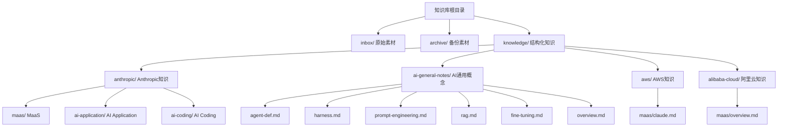
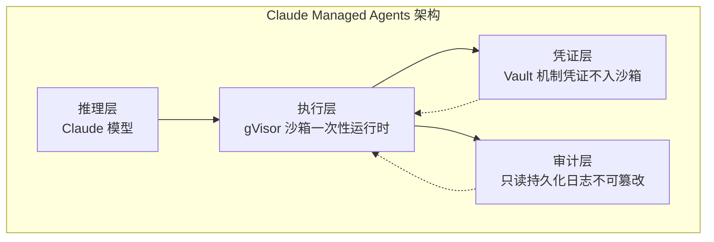
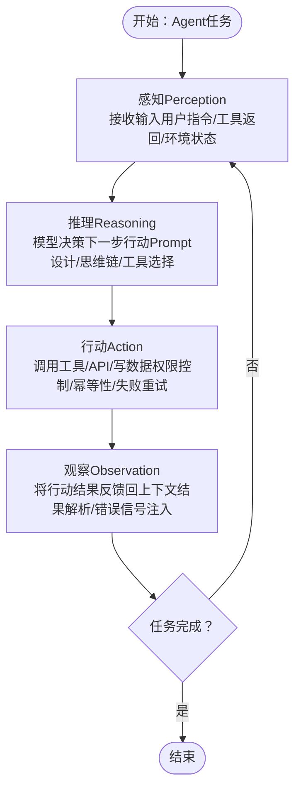
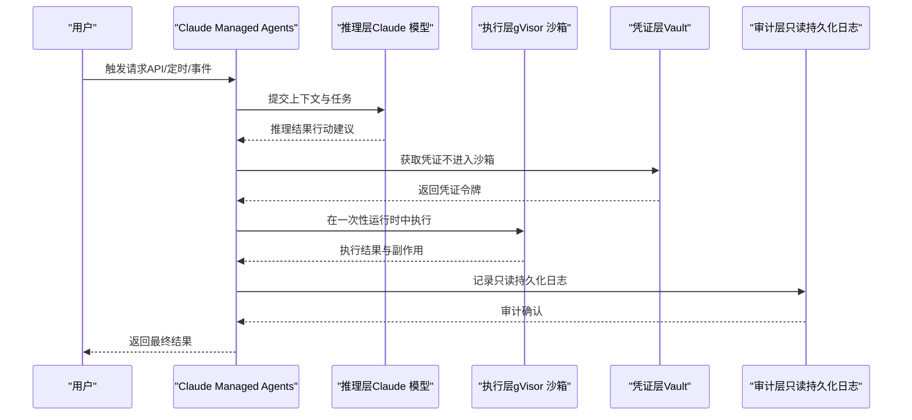
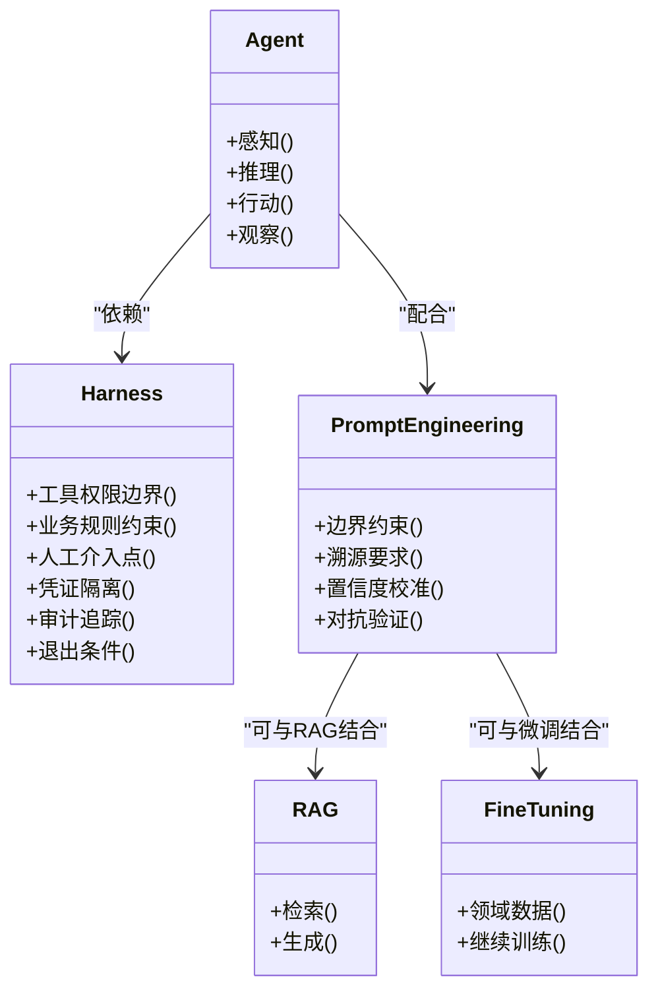
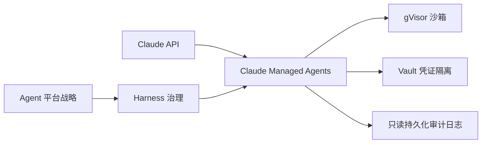

# Anthropic知识库

<cite>
**本文引用的文件**
- [README.md](file://README.md)
- [index.md](file://index.md)
- [claude-api.md](file://knowledge/anthropic/maas/claude-api.md)
- [claude-teams.md](file://knowledge/anthropic/ai-application/claude-teams.md)
- [claude-managed-agents.md](file://knowledge/anthropic/ai-application/claude-managed-agents.md)
- [agent-def.md](file://knowledge/ai-general-notes/agent-def.md)
- [harness.md](file://knowledge/ai-general-notes/harness.md)
- [prompt-engineering.md](file://knowledge/ai-general-notes/prompt-engineering.md)
- [rag.md](file://knowledge/ai-general-notes/rag.md)
- [fine-tuning.md](file://knowledge/ai-general-notes/fine-tuning.md)
- [overview.md](file://knowledge/ai-general-notes/overview.md)
- [claude.md](file://knowledge/aws/maas/claude.md)
- [overview.md](file://knowledge/alibaba-cloud/maas/overview.md)
- [Daily_note_update_with_AI_insight.md](file://notes/Daily_note_update_with_AI_insight.md)
</cite>

## 目录
1. [简介](#简介)
2. [项目结构](#项目结构)
3. [核心组件](#核心组件)
4. [架构总览](#架构总览)
5. [详细组件分析](#详细组件分析)
6. [依赖分析](#依赖分析)
7. [性能考虑](#性能考虑)
8. [故障排查指南](#故障排查指南)
9. [结论](#结论)
10. [附录](#附录)

## 简介
本文件为Anthropic知识库的系统化文档，聚焦于Anthropic AI平台的知识组织与落地实践，覆盖MaaS（Claude API）、AI Coding（Claude Code，仓库暂无独立文档）、AI Application（Claude Teams、Claude Managed Agents）等产品线。文档旨在帮助读者理解Anthropic在Agent平台、Harness治理、Prompt工程等关键领域的理念与实践，并结合仓库现有内容提供选型建议、使用指南与最佳实践。

## 项目结构
知识库采用“领域-产品线-产品”的层次化组织方式，Anthropic相关知识位于anthropic目录下，同时在全局索引中提供跨厂商对比与关联导航。仓库还包含AI通用概念（Agent、Harness、Prompt Engineering、RAG、Fine-tuning）以及与AWS/Aliyun等厂商的对比分析，便于横向选型与场景映射。

图表来源
- [index.md:1-69](file://index.md#L1-L69)
- [README.md:13-17](file://README.md#L13-L17)

章节来源
- [README.md:1-20](file://README.md#L1-L20)
- [index.md:1-69](file://index.md#L1-L69)

## 核心组件
- MaaS（Claude API）
  - 产品定位：Anthropic Claude模型API服务，覆盖Opus/Sonnet/Haiku等系列。
  - 适用场景：需要顶级模型能力、高质量推理与生成的场景。
  - 选型要点：与AWS Bedrock上的Claude服务在身份认证、审计与计费上存在差异，需结合部署边界与合规要求进行选择。
- AI Application（Claude Teams / Claude Managed Agents）
  - Claude Teams：团队/企业版，面向组织协作。
  - Claude Managed Agents：云端全托管Agent平台，推理与执行解耦，强调gVisor沙箱与Vault凭证隔离、只读持久化审计日志。
  - 适用场景：需要顶级模型能力、强安全隔离与不可变审计的Agent自动化任务。
  - 限制与边界：当前不支持SSO/RBAC、内网/VPC支持，且仅支持Claude API。
- AI Coding（Claude Code）
  - 仓库现状：当前无独立文档，可在后续补充Claude Code在编程辅助、代码生成与编辑方面的特性与最佳实践。

章节来源
- [claude-api.md:1-9](file://knowledge/anthropic/maas/claude-api.md#L1-L9)
- [claude-teams.md:1-9](file://knowledge/anthropic/ai-application/claude-teams.md#L1-L9)
- [claude-managed-agents.md:1-97](file://knowledge/anthropic/ai-application/claude-managed-agents.md#L1-L97)

## 架构总览
下图展示了Anthropic在Agent平台与安全治理层面的整体架构思路：推理层（Claude模型）、执行层（gVisor沙箱）、凭证层（Vault机制）、审计层（只读持久化日志）。该架构强调“一次性运行时”“凭证不入沙箱”“不可变审计日志”，以满足高安全与合规要求。

图表来源
- [claude-managed-agents.md:22-29](file://knowledge/anthropic/ai-application/claude-managed-agents.md#L22-L29)

## 详细组件分析

### Claude API（MaaS）
- 产品定位与能力边界
  - 面向需要顶级模型能力的场景，覆盖Opus/Sonnet/Haiku等系列。
  - 与AWS Bedrock上的Claude在身份认证、审计与计费上存在差异，需结合部署边界与合规要求进行选择。
- 选型建议
  - 若追求原生API体验与数据处理边界清晰，可优先考虑Anthropic原生平台。
  - 若已有AWS生态与IAM/CloudTrail/发票体系，Bedrock上的Claude亦可作为替代方案。

章节来源
- [claude-api.md:1-9](file://knowledge/anthropic/maas/claude-api.md#L1-L9)
- [claude.md:1-9](file://knowledge/aws/maas/claude.md#L1-L9)
- [Daily_note_update_with_AI_insight.md:3-6](file://notes/Daily_note_update_with_AI_insight.md#L3-L6)

### Claude Teams（AI Application）
- 产品定位
  - 面向团队/企业协作的Claude版本，强调组织级使用体验。
- 适用场景
  - 团队知识共享、跨部门协作、标准化问答与内容生成。
- 选型建议
  - 与Claude Managed Agents相比，Teams更偏向协作与内容管理，Agent自动化与强安全隔离需求较弱时优先考虑。

章节来源
- [claude-teams.md:1-9](file://knowledge/anthropic/ai-application/claude-teams.md#L1-L9)

### Claude Managed Agents（AI Application）
- 产品原理解析
  - 推理与执行解耦，支持多种触发模式，以gVisor沙箱与Vault凭证隔离为核心安全设计。
  - 关键设计原则：一次性运行时、凭证不入沙箱、只读持久化审计日志。
- 核心限制
  - 仅支持Claude API；不支持SSO/RBAC、内网/VPC支持；当前处于公测阶段。
- 功能特性与安全审计
  - 架构：推理层、执行层、凭证层、审计层。
  - 模型：Claude系列（claude-opus-4.5 / sonnet / haiku）。
  - 触发：多种触发模式（API调用、定时、事件等）。
  - 安全：gVisor隔离、Vault凭证隔离、JWT代理/TLS检查/DNS禁用/limited模式。
  - 审计：只读持久化事件日志（不可变）。
- 计费模式
  - Token：标准Claude API费率。
  - Session：$0.08/Session小时（仅Running时计费）。
  - 额外：网页搜索$10/千次。
  - 预充值：无需预充值。
- 竞品快速对照（Claude Managed Agents vs JVS Crew）
  - 模型能力：Claude Managed Agents领先。
  - 企业身份集成（SSO/RBAC）：JVS Crew具备，Claude当前不支持。
  - 内网/VPC支持：JVS Crew支持，Claude为纯公网SaaS。
  - 沙箱技术透明度：Claude Managed Agents更透明。
  - 凭证隔离：Claude Managed Agents更彻底。
  - 不可变审计日志：Claude Managed Agents默认支持。
  - 多渠道IM集成：JVS Crew支持钉钉/企微/飞书。
  - 计费模式：持平（均按需后付费）。

图表来源
- [agent-def.md:60-68](file://knowledge/ai-general-notes/agent-def.md#L60-L68)

图表来源
- [claude-managed-agents.md:18-29](file://knowledge/anthropic/ai-application/claude-managed-agents.md#L18-L29)

章节来源
- [claude-managed-agents.md:1-97](file://knowledge/anthropic/ai-application/claude-managed-agents.md#L1-L97)

### AI通用概念与选型支撑
- Agent（Agent定义）
  - Agent本质是“不确定性受控的for循环”，包含感知-推理-行动-观察四个阶段。
  - 选型维度：任务复杂度、错误传播、工程复杂度。
  - 各厂商实现对照：阿里云JVS Crew、Anthropic Claude Managed Agents、OpenAI Codex Agent平台、开源方案。
- Harness（缰绳）
  - Harness是Agent的约束与治理层，定义能做什么、不能做什么、何时需要人工介入。
  - 企业级Harness需覆盖工具边界、业务规则、人工介入点、凭证隔离、审计追踪、退出条件。
  - 各厂商实现对照：阿里云JVS Crew、Anthropic Claude Managed Agents、开源方案。
- Prompt Engineering（提示词工程）
  - 通过结构化提示词设计降低幻觉率，核心是改变信息生产的结构性成本。
  - 防幻觉四层机制：边界约束、溯源要求、置信度校准、对抗验证。
  - 各厂商能力对比：中文理解、溯源能力、Constitutional AI、自我反思能力。
- RAG（检索增强生成）
  - 结合检索与生成的增强生成技术，减少幻觉。
  - 仓库中为草稿状态，后续可补充各厂商实现细节。
- Fine-tuning（微调）
  - 在预训练模型基础上使用领域数据继续训练以适配特定任务。
  - 仓库中为草稿状态，后续可补充各厂商实现细节。

图表来源
- [agent-def.md:13-68](file://knowledge/ai-general-notes/agent-def.md#L13-L68)
- [harness.md:13-47](file://knowledge/ai-general-notes/harness.md#L13-L47)
- [prompt-engineering.md:13-79](file://knowledge/ai-general-notes/prompt-engineering.md#L13-L79)
- [rag.md:1-42](file://knowledge/ai-general-notes/rag.md#L1-L42)
- [fine-tuning.md:1-42](file://knowledge/ai-general-notes/fine-tuning.md#L1-L42)

章节来源
- [agent-def.md:1-128](file://knowledge/ai-general-notes/agent-def.md#L1-L128)
- [harness.md:1-108](file://knowledge/ai-general-notes/harness.md#L1-L108)
- [prompt-engineering.md:1-193](file://knowledge/ai-general-notes/prompt-engineering.md#L1-L193)
- [rag.md:1-42](file://knowledge/ai-general-notes/rag.md#L1-L42)
- [fine-tuning.md:1-42](file://knowledge/ai-general-notes/fine-tuning.md#L1-L42)
- [overview.md:1-42](file://knowledge/ai-general-notes/overview.md#L1-L42)

## 依赖分析
- 组件耦合与协作
  - Claude Managed Agents依赖Claude API提供推理能力，执行层通过gVisor沙箱隔离，凭证层通过Vault机制隔离，审计层提供只读持久化日志。
  - Agent平台战略与Harness治理共同决定产品可用性上限，模型能力虽重要，但Harness质量决定实际效果。
- 外部依赖与集成点
  - 与AWS Bedrock上的Claude存在差异（身份认证、审计、计费），需结合部署边界与合规要求进行选择。
  - 与阿里云JVS Crew在企业身份集成、内网支持、IM集成等方面形成竞品对比。

图表来源
- [claude-managed-agents.md:18-29](file://knowledge/anthropic/ai-application/claude-managed-agents.md#L18-L29)
- [agent-def.md:42-58](file://knowledge/ai-general-notes/agent-def.md#L42-L58)
- [harness.md:24-47](file://knowledge/ai-general-notes/harness.md#L24-L47)
- [claude.md:1-9](file://knowledge/aws/maas/claude.md#L1-L9)

章节来源
- [claude-managed-agents.md:1-97](file://knowledge/anthropic/ai-application/claude-managed-agents.md#L1-L97)
- [agent-def.md:1-128](file://knowledge/ai-general-notes/agent-def.md#L1-L128)
- [harness.md:1-108](file://knowledge/ai-general-notes/harness.md#L1-L108)
- [claude.md:1-9](file://knowledge/aws/maas/claude.md#L1-L9)

## 性能考虑
- Token与会话计费
  - Token按标准Claude API费率计费；Session按运行时间计费（$0.08/Session小时）；网页搜索另计。
- 触发模式与执行效率
  - 多种触发模式（API调用、定时、事件）可灵活适配不同任务类型，需结合任务频率与SLA进行选择。
- 安全与合规成本
  - gVisor沙箱与Vault凭证隔离带来更高的安全级别，但也会引入额外的资源与运维成本，需在安全与成本间平衡。

章节来源
- [claude-managed-agents.md:61-69](file://knowledge/anthropic/ai-application/claude-managed-agents.md#L61-L69)

## 故障排查指南
- 常见误区
  - 将“规则写进Prompt”当作Harness：Harness是系统层面的硬约束，而Prompt是软约束。
  - 认为通用Harness可以复用：Harness越通用越没价值，行业特异性才是护城河。
  - 认为强模型不需要Harness：模型越强越需要Harness，以避免失控的后果。
- 审计与可观测性
  - 使用只读持久化日志进行回溯与审计，确保每一步行动可追溯、可回滚。
- 人工介入点（HITL）
  - 在关键决策节点预设人工确认触发条件，避免不可逆操作带来的风险。

章节来源
- [harness.md:90-97](file://knowledge/ai-general-notes/harness.md#L90-L97)
- [agent-def.md:108-116](file://knowledge/ai-general-notes/agent-def.md#L108-L116)
- [claude-managed-agents.md:50-59](file://knowledge/anthropic/ai-application/claude-managed-agents.md#L50-L59)

## 结论
- Anthropic在Agent平台与安全治理方面提供了清晰的架构与实践路径：推理与执行解耦、凭证隔离、只读持久化审计日志，适合对安全性与合规性要求较高的企业场景。
- 在MaaS层面，Claude API与AWS Bedrock上的Claude存在差异，需结合身份认证、审计与计费体系进行选型。
- AI通用概念（Agent、Harness、Prompt Engineering）为选型与实施提供了方法论支撑，建议在项目中系统性应用。

## 附录
- 使用指南与最佳实践
  - 任务拆解：单Agent适合线性、单一目标任务；多Agent适合可并行拆解的任务，但需注意协调开销。
  - 工具幂等性：能重试的操作必须幂等，不可逆操作需要人工确认门。
  - 上下文压缩：长循环中上下文会膨胀，需要摘要/截断策略。
  - 可观测性优先：每一步的感知-行动-观察都要有日志，否则调试极难。
- 选型建议
  - 需要顶级模型能力、强安全隔离与不可变审计：优先Claude Managed Agents。
  - 需要企业身份集成（SSO/RBAC）、内网/VPC支持、IM集成：可考虑阿里云JVS Crew等具备相应能力的竞品。
  - 已有AWS生态：可评估AWS Bedrock上的Claude服务。

章节来源
- [agent-def.md:89-107](file://knowledge/ai-general-notes/agent-def.md#L89-L107)
- [harness.md:69-78](file://knowledge/ai-general-notes/harness.md#L69-L78)
- [claude-managed-agents.md:70-84](file://knowledge/anthropic/ai-application/claude-managed-agents.md#L70-L84)
- [claude.md:1-9](file://knowledge/aws/maas/claude.md#L1-L9)
- [overview.md:1-9](file://knowledge/alibaba-cloud/maas/overview.md#L1-9)