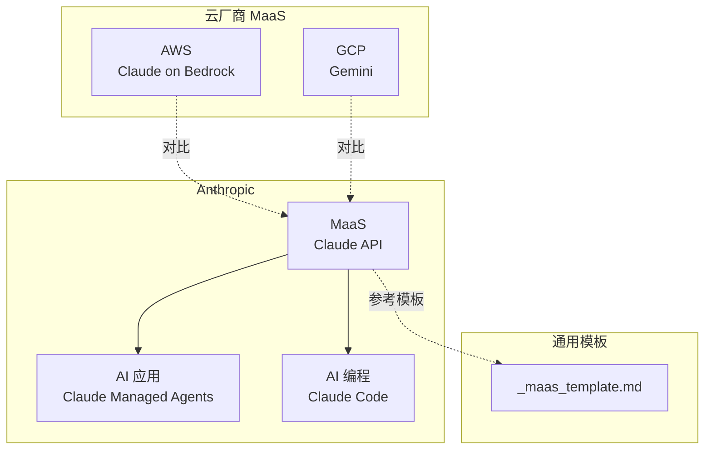
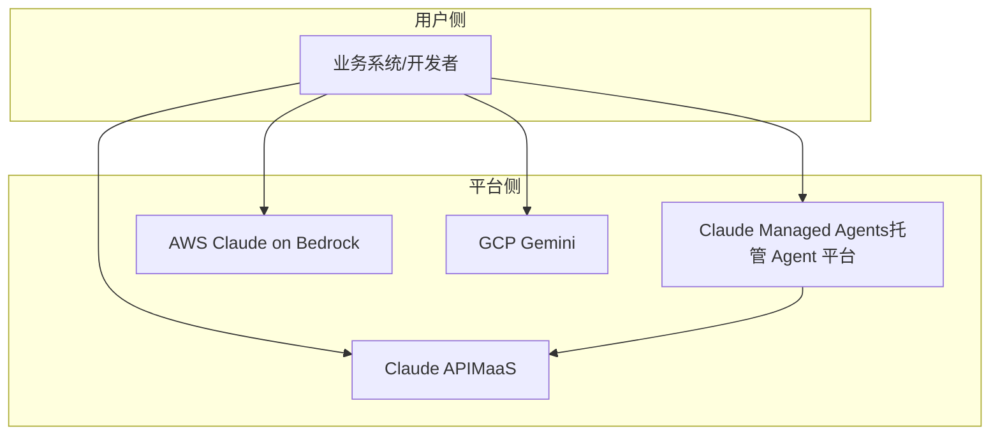
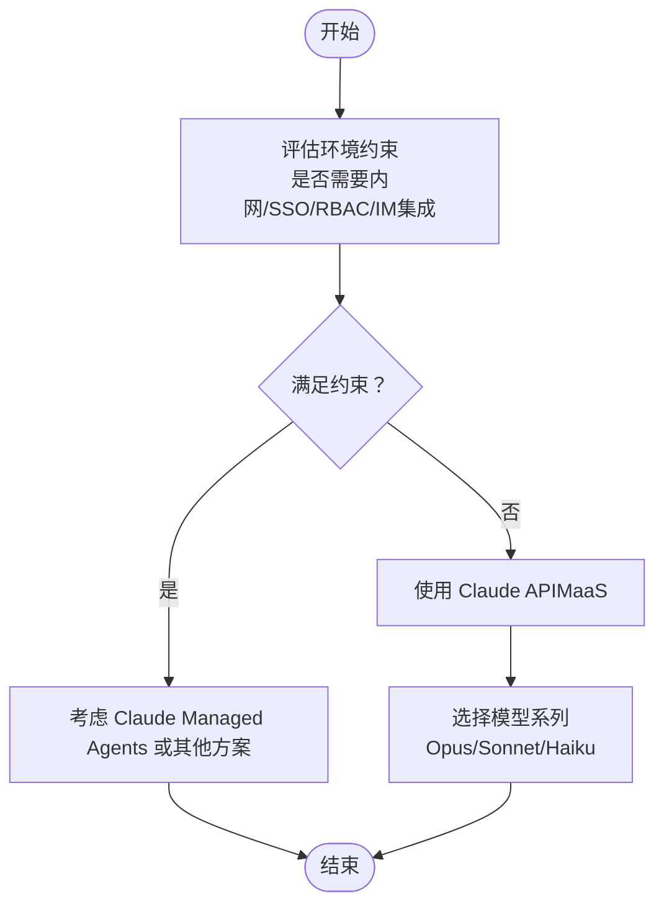
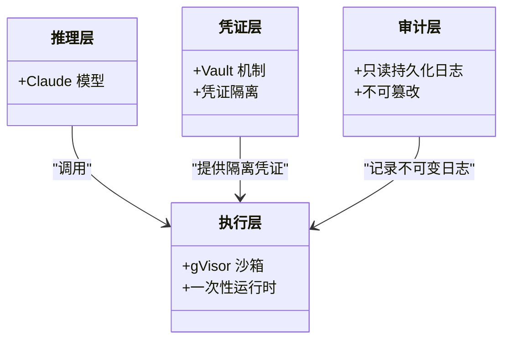
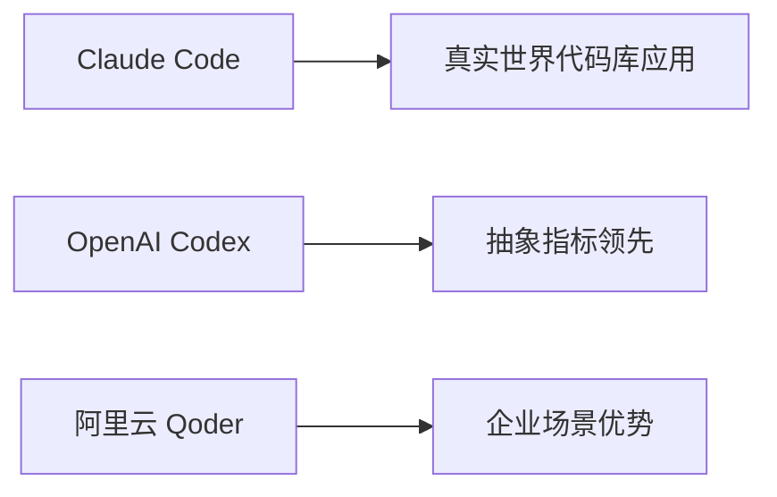
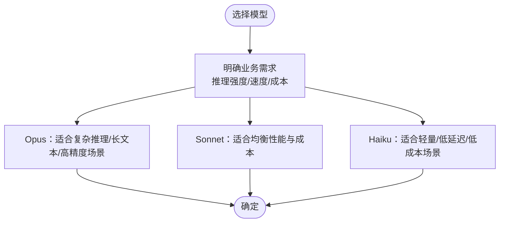
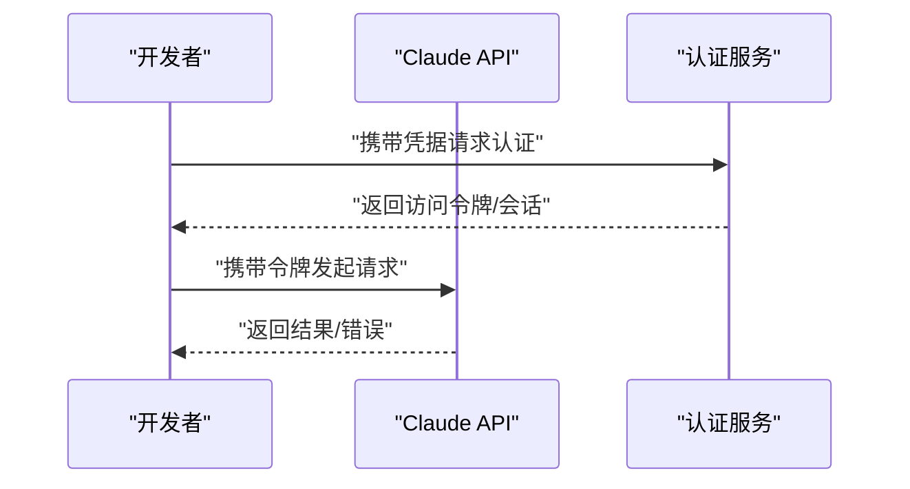
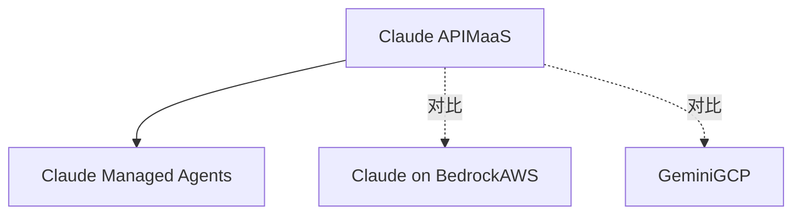

# Claude API（MaaS）

<cite>
**本文引用的文件**
- [claude-api.md](file://knowledge/anthropic/maas/claude-api.md)
- [claude-managed-agents.md](file://knowledge/anthropic/ai-application/claude-managed-agents.md)
- [claude-code.md](file://knowledge/anthropic/ai-coding/claude-code.md)
- [_maas_template.md](file://knowledge/_maas_template.md)
- [claude.md](file://knowledge/aws/maas/claude.md)
- [gemini.md](file://knowledge/gcp/maas/gemini.md)
</cite>

## 目录
1. [简介](#简介)
2. [项目结构](#项目结构)
3. [核心组件](#核心组件)
4. [架构总览](#架构总览)
5. [详细组件分析](#详细组件分析)
6. [依赖关系分析](#依赖关系分析)
7. [性能考量](#性能考量)
8. [故障排查指南](#故障排查指南)
9. [结论](#结论)
10. [附录](#附录)

## 简介
本文件系统化梳理 Anthropic Claude API 在 MaaS（Model-as-a-Service）平台中的定位、技术架构、模型能力（Opus/Sonnet/Haiku）、性能特点与应用场景，并结合 Claude Managed Agents 的托管 Agent 能力进行横向对比，帮助读者在不同业务目标下做出正确的模型与平台选择。同时，文档覆盖认证与调用方式、限流与成本控制、安全与合规要点，以及常见问题排查路径。

## 项目结构
知识库中与 Claude API 相关的内容主要分布在以下位置：
- Anthropic MaaS：Claude API 基础定位与状态
- Anthropic AI 应用：Claude Managed Agents（托管 Agent 平台）与 Claude Code（AI 编程工具）
- 通用 MaaS 模板：用于标准化描述模型系列与能力
- AWS MaaS：Claude on Bedrock（在 AWS Bedrock 上的托管服务）
- GCP MaaS：Gemini（Google 自研多模态模型系列）

**图表来源**
- [claude-api.md:1-9](file://knowledge/anthropic/maas/claude-api.md#L1-L9)
- [claude-managed-agents.md:1-97](file://knowledge/anthropic/ai-application/claude-managed-agents.md#L1-L97)
- [claude-code.md:1-52](file://knowledge/anthropic/ai-coding/claude-code.md#L1-L52)
- [_maas_template.md:1-65](file://knowledge/_maas_template.md#L1-L65)
- [claude.md:1-9](file://knowledge/aws/maas/claude.md#L1-L9)
- [gemini.md:1-9](file://knowledge/gcp/maas/gemini.md#L1-L9)

**章节来源**
- [claude-api.md:1-9](file://knowledge/anthropic/maas/claude-api.md#L1-L9)
- [claude-managed-agents.md:1-97](file://knowledge/anthropic/ai-application/claude-managed-agents.md#L1-L97)
- [_maas_template.md:1-65](file://knowledge/_maas_template.md#L1-L65)
- [claude.md:1-9](file://knowledge/aws/maas/claude.md#L1-L9)
- [gemini.md:1-9](file://knowledge/gcp/maas/gemini.md#L1-L9)

## 核心组件
- Claude API（MaaS）：Anthropic 提供的模型即服务，支持 Claude Opus/Sonnet/Haiku 等系列，定位为“顶级模型能力”的 MaaS 服务。
- Claude Managed Agents：Anthropic 云端全托管 AI Agent 平台，推理与执行解耦，强调 gVisor 沙箱、Vault 凭证隔离与不可变审计日志；当前不支持内网部署、企业 SSO/RBAC、IM 集成等企业特性。
- Claude Code：Anthropic 的 AI 编程工具，强调在真实世界代码库上的应用优势。
- AWS MaaS：Claude on Bedrock，即在 AWS Bedrock 上的托管服务形态。
- GCP MaaS：Gemini（Google 自研多模态模型系列），用于与 Claude 形成横向对比。

**章节来源**
- [claude-api.md:8-9](file://knowledge/anthropic/maas/claude-api.md#L8-L9)
- [claude-managed-agents.md:9-13](file://knowledge/anthropic/ai-application/claude-managed-agents.md#L9-L13)
- [claude-code.md:8-14](file://knowledge/anthropic/ai-coding/claude-code.md#L8-L14)
- [claude.md:8-9](file://knowledge/aws/maas/claude.md#L8-L9)
- [gemini.md:8-9](file://knowledge/gcp/maas/gemini.md#L8-L9)

## 架构总览
从平台与能力视角，Claude API 与 Claude Managed Agents 的关系如下：
- Claude API 作为底层模型服务能力，提供 Opus/Sonnet/Haiku 等模型；
- Claude Managed Agents 以 Claude API 为核心，构建“推理与执行解耦”的 Agent 平台，强调安全与审计；
- AWS/GCP 提供的 Claude/Gemini 属于不同云厂商的托管形态或替代方案，便于横向比较。

**图表来源**
- [claude-api.md:8-9](file://knowledge/anthropic/maas/claude-api.md#L8-L9)
- [claude-managed-agents.md:9-13](file://knowledge/anthropic/ai-application/claude-managed-agents.md#L9-L13)
- [claude.md:8-9](file://knowledge/aws/maas/claude.md#L8-L9)
- [gemini.md:8-9](file://knowledge/gcp/maas/gemini.md#L8-L9)

## 详细组件分析

### Claude API（MaaS）：定位与能力概览
- 定位：顶级模型能力的 MaaS 服务，支持 Claude Opus/Sonnet/Haiku 系列。
- 适用场景：需要高阶推理、分析与创作能力的业务，如复杂问答、长文本生成、跨模态理解等。
- 不适用场景：对内网部署、企业 SSO/RBAC、IM 集成有强需求的企业环境（该类需求在 Claude Managed Agents 中亦未覆盖）。

**图表来源**
- [claude-api.md:8-9](file://knowledge/anthropic/maas/claude-api.md#L8-L9)
- [claude-managed-agents.md:9-13](file://knowledge/anthropic/ai-application/claude-managed-agents.md#L9-L13)

**章节来源**
- [claude-api.md:8-9](file://knowledge/anthropic/maas/claude-api.md#L8-L9)

### Claude Managed Agents：架构与安全
- 架构四大模块：推理层（Claude 模型）、执行层（gVisor 沙箱）、凭证层（Vault 机制）、审计层（只读持久化日志）。
- 设计原则：一次性运行时、凭证不入沙箱、不可变审计日志。
- 核心限制：当前不支持内网部署、企业 SSO/RBAC、IM 集成等企业特性；仅 Claude API。

**图表来源**
- [claude-managed-agents.md:24-29](file://knowledge/anthropic/ai-application/claude-managed-agents.md#L24-L29)

**章节来源**
- [claude-managed-agents.md:16-60](file://knowledge/anthropic/ai-application/claude-managed-agents.md#L16-L60)

### Claude Code：AI 编程工具
- 定位：命令行 AI 编程工具，强调在真实世界代码库上的应用优势。
- 竞争对比：在真实代码库应用上具备先发优势，OpenAI Codex 在抽象指标上领先，但在真实世界代码库应用上追赶迅速。

**图表来源**
- [claude-code.md:11-29](file://knowledge/anthropic/ai-coding/claude-code.md#L11-L29)

**章节来源**
- [claude-code.md:1-52](file://knowledge/anthropic/ai-coding/claude-code.md#L1-L52)

### 模型能力与选择标准（Opus/Sonnet/Haiku）
- 依据现有仓库信息，Claude API 支持 Opus/Sonnet/Haiku 系列，但未给出具体参数规模、上下文长度、发布时间等细节。
- 建议采用通用模板的结构化方式，补充各模型的参数规模、上下文长度、场景定位与特点，以便在不同业务目标下进行选择。

**图表来源**
- [claude-api.md:8-9](file://knowledge/anthropic/maas/claude-api.md#L8-L9)
- [_maas_template.md:14-18](file://knowledge/_maas_template.md#L14-L18)

**章节来源**
- [claude-api.md:8-9](file://knowledge/anthropic/maas/claude-api.md#L8-L9)
- [_maas_template.md:14-18](file://knowledge/_maas_template.md#L14-L18)

### 认证与调用方式
- 仓库未提供 Claude API 的具体认证与调用方式细节。建议遵循通用 MaaS 模板的结构，补充：
  - 认证机制（如 API Key、OAuth、服务账号等）
  - 请求头、URL、HTTP 方法与端点
  - 请求体格式与响应结构
  - 错误码与错误消息规范
  - SDK/CLI 使用示例与最佳实践

[本图为概念流程示意，不对应具体源码文件]

### 安全与合规
- Claude Managed Agents 强调：
  - gVisor 沙箱隔离与一次性运行时
  - Vault 凭证隔离，凭证不进入执行沙箱
  - 只读持久化不可变审计日志
  - 网络层面的 JWT 代理、TLS 检查、DNS 禁用与 limited 模式
- 企业特性（SSO/RBAC、内网/VPC 支持、IM 集成）当前不支持，需结合业务约束进行取舍。

**章节来源**
- [claude-managed-agents.md:50-60](file://knowledge/anthropic/ai-application/claude-managed-agents.md#L50-L60)

### 计费与成本控制
- Claude Managed Agents 的计费维度包含：
  - Token 按标准 Claude API 费率
  - Session 按小时计费（Running 期间）
  - 网页搜索按千次计费
  - 无需预充值
- 建议结合业务流量与会话时长，选择合适的模型与触发频率，避免不必要的 Session 时长与搜索次数。

**章节来源**
- [claude-managed-agents.md:61-69](file://knowledge/anthropic/ai-application/claude-managed-agents.md#L61-L69)

### 限流与稳定性
- 仓库未提供 Claude API 的限流策略细节。建议在接入时关注：
  - 并发连接数与每秒请求数上限
  - 重试退避策略与幂等性设计
  - 超时与熔断配置
  - 监控与告警阈值设置

[本节为通用指导，不对应具体源码文件]

## 依赖关系分析
- Claude API 与 Claude Managed Agents 的关系：后者以前者为核心能力来源，前者提供模型推理能力，后者负责执行与安全编排。
- 与 AWS/GCP 的关系：Claude on Bedrock 与 Gemini 作为不同云厂商的托管形态，便于横向对比与迁移。

**图表来源**
- [claude-api.md:8-9](file://knowledge/anthropic/maas/claude-api.md#L8-L9)
- [claude-managed-agents.md:9-13](file://knowledge/anthropic/ai-application/claude-managed-agents.md#L9-L13)
- [claude.md:8-9](file://knowledge/aws/maas/claude.md#L8-L9)
- [gemini.md:8-9](file://knowledge/gcp/maas/gemini.md#L8-L9)

**章节来源**
- [claude-api.md:8-9](file://knowledge/anthropic/maas/claude-api.md#L8-L9)
- [claude-managed-agents.md:9-13](file://knowledge/anthropic/ai-application/claude-managed-agents.md#L9-L13)
- [claude.md:8-9](file://knowledge/aws/maas/claude.md#L8-L9)
- [gemini.md:8-9](file://knowledge/gcp/maas/gemini.md#L8-L9)

## 性能考量
- 模型选择：根据任务复杂度与延迟要求选择 Opus/Sonnet/Haiku；在保证质量的前提下优先考虑成本与吞吐。
- 会话管理：合理规划会话生命周期，避免长时间 Running Session 导致额外费用。
- 网络与安全：利用 Claude Managed Agents 的网络限制与审计能力，减少外部依赖与攻击面。
- 监控与压测：在上线前进行容量与稳定性测试，确保在峰值负载下的可用性与一致性。

[本节为通用指导，不对应具体源码文件]

## 故障排查指南
- 常见问题线索：
  - 认证失败：检查凭据有效期、作用域与签名方式
  - 请求超时：检查网络连通性、代理与防火墙规则
  - 会话异常：确认 Session 生命周期与触发条件
  - 成本异常：核对 Token 使用量、Session 时长与搜索次数
- 建议流程：
  - 开启细粒度日志与审计
  - 分阶段回滚与灰度验证
  - 结合监控告警快速定位瓶颈

[本节为通用指导，不对应具体源码文件]

## 结论
- Claude API（MaaS）提供顶级模型能力，适合对推理质量与长文本生成有高要求的场景。
- Claude Managed Agents 在安全与审计方面具备显著优势，适合需要严格隔离与可追溯性的 Agent 场景，但当前不支持企业级 SSO/RBAC、内网/VPC 与 IM 集成。
- AWS/GCP 提供的 Claude/Gemini 作为替代方案，便于在多云与混合云环境下进行能力与成本对比。
- 建议在接入前完善认证、调用、限流与成本控制策略，并结合业务目标选择合适的模型与平台形态。

[本节为总结性内容，不对应具体源码文件]

## 附录
- 术语表
  - MaaS：模型即服务
  - Agent：智能体，具备感知、决策与执行能力
  - SSO/RBAC：单点登录/基于角色的访问控制
  - gVisor：容器沙箱隔离引擎
  - Vault：凭证与密钥管理机制
- 参考资料
  - Claude Managed Agents 定价与安全分析
  - Claude Code 竞争格局与真实代码库应用优势

**章节来源**
- [claude-managed-agents.md:87-91](file://knowledge/anthropic/ai-application/claude-managed-agents.md#L87-L91)
- [claude-code.md:42-45](file://knowledge/anthropic/ai-coding/claude-code.md#L42-L45)