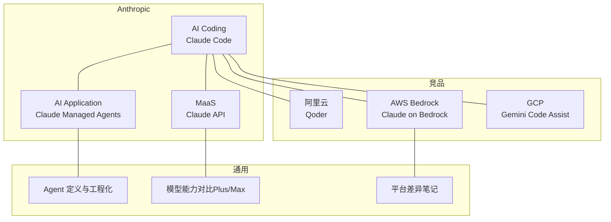
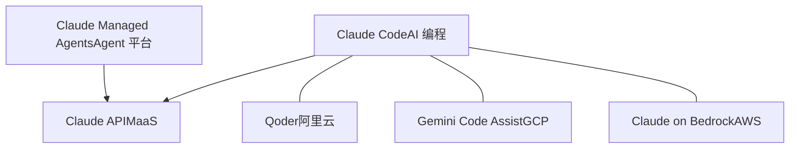
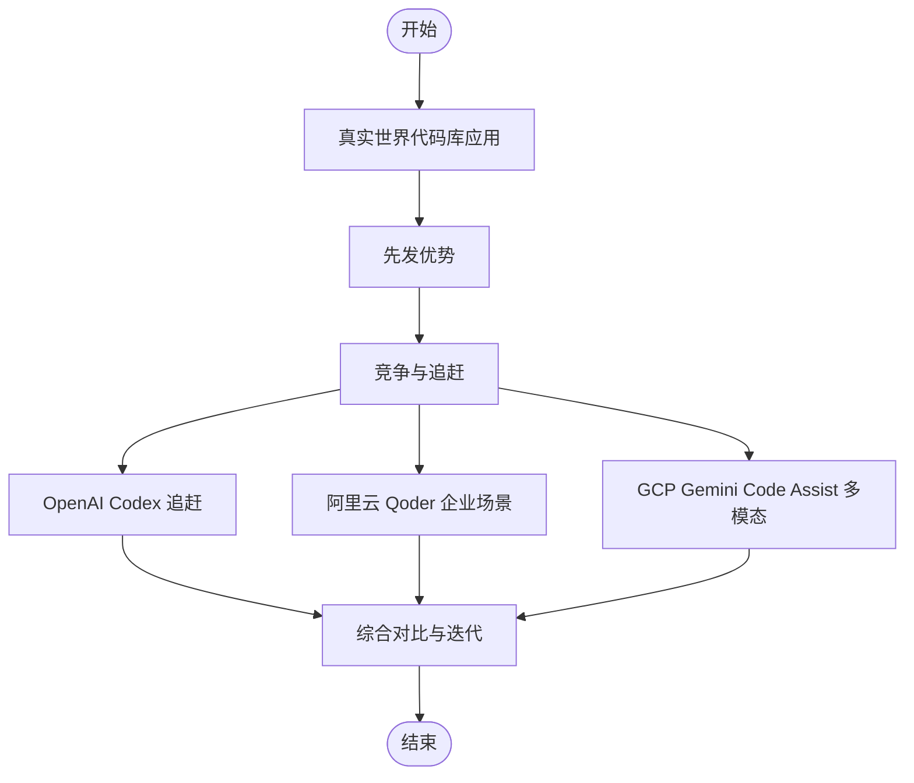
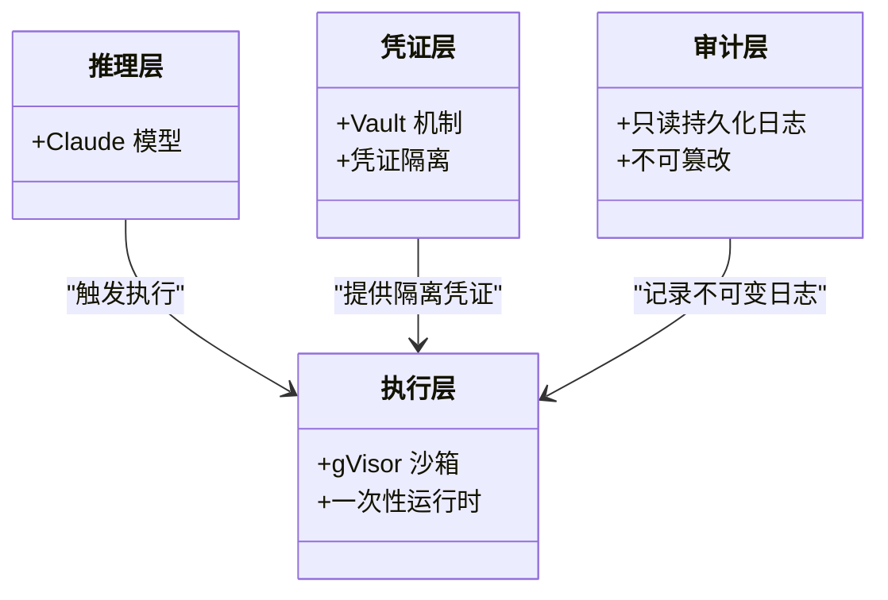
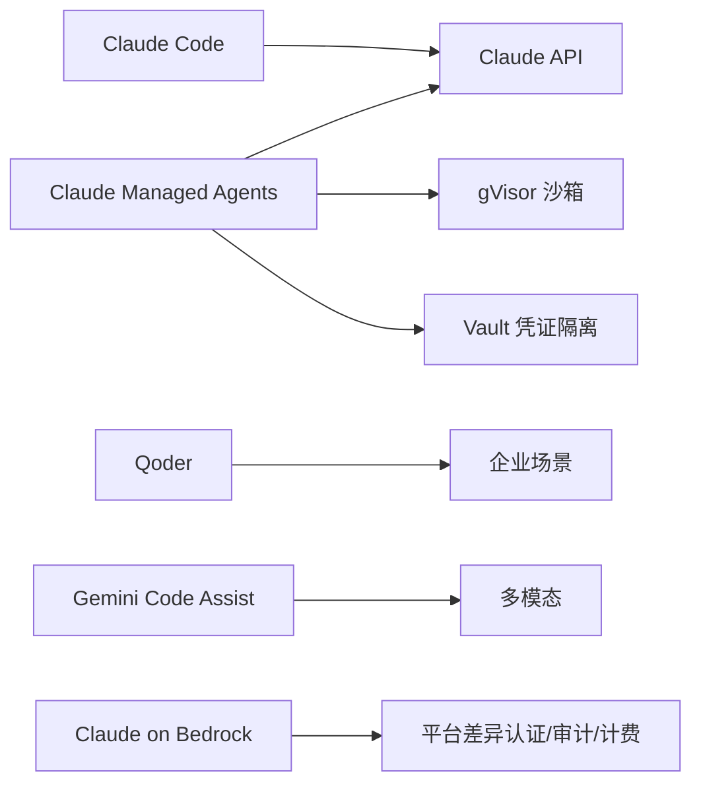

# Claude Code（AI 编程）

<cite>
**本文引用的文件**
- [claude-code.md](file://knowledge/anthropic/ai-coding/claude-code.md)
- [claude-managed-agents.md](file://knowledge/anthropic/ai-application/claude-managed-agents.md)
- [claude-api.md](file://knowledge/anthropic/maas/claude-api.md)
- [claude.md](file://knowledge/aws/maas/claude.md)
- [gemini-code-assist.md](file://knowledge/gcp/ai-coding/gemini-code-assist.md)
- [qoder.md](file://knowledge/alibaba-cloud/ai-coding/qoder.md)
- [agent-def.md](file://knowledge/ai-general-notes/agent-def.md)
- [20260420.md](file://archive/20260420.md)
- [Daily_note_update_with_AI_insight.md](file://notes/Daily_note_update_with_AI_insight.md)
</cite>

## 目录
1. [简介](#简介)
2. [项目结构](#项目结构)
3. [核心组件](#核心组件)
4. [架构总览](#架构总览)
5. [详细组件分析](#详细组件分析)
6. [依赖关系分析](#依赖关系分析)
7. [性能考量](#性能考量)
8. [故障排查指南](#故障排查指南)
9. [结论](#结论)
10. [附录](#附录)

## 简介
本文件围绕 Claude Code（AI 编程）进行系统化梳理，结合仓库中 Anthropic 与竞品相关知识条目，形成覆盖产品定位、能力边界、与传统 IDE/Agent 平台集成方式、API 使用路径、工作流与最佳实践、性能与安全注意事项、团队协作视角的综合性文档。Claude Code 在仓库中被定位为“Anthropic 命令行 AI 编程工具”，强调在“真实世界代码库”上的应用先发优势，并与 OpenAI Codex、阿里云 Qoder、Google Gemini Code Assist 等形成竞品对比。

章节来源
- [claude-code.md:1-52](file://knowledge/anthropic/ai-coding/claude-code.md#L1-L52)

## 项目结构
本仓库中与 Claude Code 相关的知识分布在以下区域：
- Anthropic 侧：AI Coding、AI Application（Claude Managed Agents）、MaaS（Claude API）等
- 竞品侧：阿里云 Qoder、AWS Bedrock 上的 Claude、GCP Gemini Code Assist
- 通用 AI Engineering：Agent 定义、老代码改造三步法等
- 归档与笔记：包含模型能力对比、平台差异等补充信息

图表来源
- [claude-code.md:1-52](file://knowledge/anthropic/ai-coding/claude-code.md#L1-L52)
- [claude-managed-agents.md:1-97](file://knowledge/anthropic/ai-application/claude-managed-agents.md#L1-L97)
- [claude-api.md:1-9](file://knowledge/anthropic/maas/claude-api.md#L1-L9)
- [claude.md:1-9](file://knowledge/aws/maas/claude.md#L1-L9)
- [gemini-code-assist.md:1-9](file://knowledge/gcp/ai-coding/gemini-code-assist.md#L1-L9)
- [qoder.md:1-9](file://knowledge/alibaba-cloud/ai-coding/qoder.md#L1-L9)
- [agent-def.md:1-128](file://knowledge/ai-general-notes/agent-def.md#L1-L128)
- [20260420.md:1-68](file://archive/20260420.md#L1-L68)
- [Daily_note_update_with_AI_insight.md:1-6](file://notes/Daily_note_update_with_AI_insight.md#L1-L6)

章节来源
- [claude-code.md:1-52](file://knowledge/anthropic/ai-coding/claude-code.md#L1-L52)
- [claude-managed-agents.md:1-97](file://knowledge/anthropic/ai-application/claude-managed-agents.md#L1-L97)
- [claude-api.md:1-9](file://knowledge/anthropic/maas/claude-api.md#L1-L9)
- [claude.md:1-9](file://knowledge/aws/maas/claude.md#L1-L9)
- [gemini-code-assist.md:1-9](file://knowledge/gcp/ai-coding/gemini-code-assist.md#L1-L9)
- [qoder.md:1-9](file://knowledge/alibaba-cloud/ai-coding/qoder.md#L1-L9)
- [agent-def.md:1-128](file://knowledge/ai-general-notes/agent-def.md#L1-L128)
- [20260420.md:1-68](file://archive/20260420.md#L1-L68)
- [Daily_note_update_with_AI_insight.md:1-6](file://notes/Daily_note_update_with_AI_insight.md#L1-L6)

## 核心组件
- Claude Code（AI 编程）
  - 定位：命令行 AI 编程工具，强调在真实世界代码库上的应用先发优势
  - 竞争对比：与 OpenAI Codex（起步慢但追赶迅速）、阿里云 Qoder、Google Gemini Code Assist
  - 关键洞察：Anthropic 更早认识到真实代码的复杂性（混乱、不规范、遗留代码），OpenAI 通过竞赛指标优势快速转化产品能力
- Claude Managed Agents（云端全托管 AI Agent 平台）
  - 架构：推理与执行解耦，四大模块（推理层、执行层、凭证层、审计层）
  - 安全：gVisor disposable 运行时、Vault 凭证隔离、只读持久化日志
  - 限制：仅 Claude API、不支持 SSO/RBAC、不支持内网/VPC
- Claude API（MaaS）
  - 定位：Claude Opus/Sonnet/Haiku 模型 API 服务
- 竞品
  - 阿里云 Qoder：AI 编程助手，提升开发者编码效率
  - AWS Bedrock 上的 Claude：在 Bedrock 上的托管服务
  - GCP Gemini Code Assist：Google AI 编程助手（原 Duet AI for Developers）

章节来源
- [claude-code.md:16-41](file://knowledge/anthropic/ai-coding/claude-code.md#L16-L41)
- [claude-managed-agents.md:8-38](file://knowledge/anthropic/ai-application/claude-managed-agents.md#L8-L38)
- [claude-api.md:1-9](file://knowledge/anthropic/maas/claude-api.md#L1-L9)
- [qoder.md:1-9](file://knowledge/alibaba-cloud/ai-coding/qoder.md#L1-L9)
- [claude.md:1-9](file://knowledge/aws/maas/claude.md#L1-L9)
- [gemini-code-assist.md:1-9](file://knowledge/gcp/ai-coding/gemini-code-assist.md#L1-L9)

## 架构总览
从仓库信息可见，Claude Code 属于“AI Coding”范畴，与 Claude Managed Agents（Agent 平台）和 Claude API（模型服务）存在天然关联。Claude Managed Agents 采用“推理与执行解耦”的架构，强调安全与审计；Claude Code 则聚焦于“真实世界代码库”的应用优势。竞品方面，Qoder、Gemini Code Assist、Codex 等分别在企业场景、多模态、真实代码库应用等方面形成差异化。

图表来源
- [claude-code.md:16-41](file://knowledge/anthropic/ai-coding/claude-code.md#L16-L41)
- [claude-managed-agents.md:8-38](file://knowledge/anthropic/ai-application/claude-managed-agents.md#L8-L38)
- [claude-api.md:1-9](file://knowledge/anthropic/maas/claude-api.md#L1-L9)
- [qoder.md:1-9](file://knowledge/alibaba-cloud/ai-coding/qoder.md#L1-L9)
- [gemini-code-assist.md:1-9](file://knowledge/gcp/ai-coding/gemini-code-assist.md#L1-L9)
- [claude.md:1-9](file://knowledge/aws/maas/claude.md#L1-L9)

## 详细组件分析

### Claude Code（AI 编程）
- 产品定位与价值
  - 定位：命令行 AI 编程工具
  - 核心价值：在真实世界代码库上应用的先发优势，强调对混乱、不规范、遗留代码的理解与处理
- 竞争对比
  - OpenAI Codex：起步较慢但追赶迅速，竞赛指标上曾领先
  - 阿里云 Qoder：企业级定位，侧重企业场景
  - Google Gemini Code Assist：多模态与编程辅助方向
- 关键洞察
  - Anthropic 的优势在于更早理解真实代码的复杂性
  - OpenAI 的追赶体现在将竞赛指标优势转化为产品能力

图表来源
- [claude-code.md:20-41](file://knowledge/anthropic/ai-coding/claude-code.md#L20-L41)

章节来源
- [claude-code.md:16-41](file://knowledge/anthropic/ai-coding/claude-code.md#L16-L41)

### Claude Managed Agents（Agent 平台）
- 架构与安全
  - 四大模块：推理层（Claude 模型）、执行层（gVisor 沙箱）、凭证层（Vault 机制）、审计层（只读持久化日志）
  - 设计原则：一次性运行时、凭证不入沙箱、不可变审计日志
- 限制与适用
  - 仅 Claude API、不支持 SSO/RBAC、不支持内网/VPC
  - 适用于需要顶级模型能力、强安全与不可变审计日志的纯公网 SaaS 场景

图表来源
- [claude-managed-agents.md:22-38](file://knowledge/anthropic/ai-application/claude-managed-agents.md#L22-L38)

章节来源
- [claude-managed-agents.md:16-60](file://knowledge/anthropic/ai-application/claude-managed-agents.md#L16-L60)

### Claude API（MaaS）
- 定位：Claude Opus/Sonnet/Haiku 模型 API 服务
- 与 Claude Code/Managed Agents 的关系：Claude Code 作为“命令行编程工具”，通常通过 Claude API 获取模型能力；Managed Agents 亦以 Claude API 为核心推理引擎

章节来源
- [claude-api.md:1-9](file://knowledge/anthropic/maas/claude-api.md#L1-L9)

### 竞品对比（Qoder、Gemini Code Assist、Claude on Bedrock）
- 阿里云 Qoder：AI 编程助手，提升开发者编码效率，企业场景优势
- GCP Gemini Code Assist：Google AI 编程助手（原 Duet AI for Developers），多模态与编程辅助
- AWS Bedrock 上的 Claude：在 Bedrock 上的托管服务，与 Anthropic 原生平台在身份验证、审计与计费上存在差异

章节来源
- [qoder.md:1-9](file://knowledge/alibaba-cloud/ai-coding/qoder.md#L1-L9)
- [gemini-code-assist.md:1-9](file://knowledge/gcp/ai-coding/gemini-code-assist.md#L1-L9)
- [claude.md:1-9](file://knowledge/aws/maas/claude.md#L1-L9)
- [Daily_note_update_with_AI_insight.md:3-6](file://notes/Daily_note_update_with_AI_insight.md#L3-L6)

### Agent 工程化与老代码改造三步法
- Agent 工程化要点：退出条件显式化、工具幂等性、上下文压缩、可观测性优先
- 老代码改造三步法：先还原（读老代码写 SPEC）、再设计（明确改与不改）、后生成（基于 SPEC 生成新代码，保证融合）

章节来源
- [agent-def.md:69-107](file://knowledge/ai-general-notes/agent-def.md#L69-L107)
- [agent-def.md:91-98](file://knowledge/ai-general-notes/agent-def.md#L91-L98)

## 依赖关系分析
- Claude Code 与 Claude API：Claude Code 作为命令行编程工具，通常通过 Claude API 获取模型能力
- Claude Managed Agents 与 Claude API：以 Claude API 为推理引擎，执行层通过 gVisor 沙箱与 Vault 凭证隔离
- 竞品与平台差异：Qoder、Gemini Code Assist、Claude on Bedrock 分别面向不同场景与平台，存在差异化能力与限制

图表来源
- [claude-code.md:16-41](file://knowledge/anthropic/ai-coding/claude-code.md#L16-L41)
- [claude-managed-agents.md:22-38](file://knowledge/anthropic/ai-application/claude-managed-agents.md#L22-L38)
- [claude-api.md:1-9](file://knowledge/anthropic/maas/claude-api.md#L1-L9)
- [qoder.md:1-9](file://knowledge/alibaba-cloud/ai-coding/qoder.md#L1-L9)
- [gemini-code-assist.md:1-9](file://knowledge/gcp/ai-coding/gemini-code-assist.md#L1-L9)
- [claude.md:1-9](file://knowledge/aws/maas/claude.md#L1-L9)
- [Daily_note_update_with_AI_insight.md:3-6](file://notes/Daily_note_update_with_AI_insight.md#L3-L6)

章节来源
- [claude-code.md:16-41](file://knowledge/anthropic/ai-coding/claude-code.md#L16-L41)
- [claude-managed-agents.md:22-38](file://knowledge/anthropic/ai-application/claude-managed-agents.md#L22-L38)
- [claude-api.md:1-9](file://knowledge/anthropic/maas/claude-api.md#L1-L9)
- [qoder.md:1-9](file://knowledge/alibaba-cloud/ai-coding/qoder.md#L1-L9)
- [gemini-code-assist.md:1-9](file://knowledge/gcp/ai-coding/gemini-code-assist.md#L1-L9)
- [claude.md:1-9](file://knowledge/aws/maas/claude.md#L1-L9)
- [Daily_note_update_with_AI_insight.md:3-6](file://notes/Daily_note_update_with_AI_insight.md#L3-L6)

## 性能考量
- 模型能力与上下文窗口：仓库中模型能力对比显示，Qwen3.6 Plus 在“Agentic Coding”与“1M 上下文窗口”方面具有优势，适合长文档/大型代码仓库场景；Max 在综合智能指数上更高，适合深度推理场景
- 选型建议：AI Agent/自动编程场景优先 Plus；科研/复杂推理场景优先 Max；长文档分析优先 Plus；多模态理解优先 Plus；生产稳定性优先 Plus；追求极致智能优先 Max

章节来源
- [20260420.md:15-53](file://archive/20260420.md#L15-L53)

## 故障排查指南
- Claude Managed Agents 安全与审计
  - 沙箱：gVisor disposable 运行时，确保执行环境一次性销毁
  - 凭证：Vault 机制，凭证不入沙箱，隔离最彻底
  - 审计：只读持久化事件日志（不可变，无法篡改）
  - 限制：不支持 SSO/RBAC、不支持内网/VPC
- 平台差异与计费
  - Claude on AWS 与 Claude on Bedrock 在身份验证、审计日志与计费结算上存在差异，前者强调 day0 体验与原生 API 一致性

章节来源
- [claude-managed-agents.md:50-69](file://knowledge/anthropic/ai-application/claude-managed-agents.md#L50-L69)
- [Daily_note_update_with_AI_insight.md:3-6](file://notes/Daily_note_update_with_AI_insight.md#L3-L6)

## 结论
- Claude Code 作为 Anthropic 的命令行 AI 编程工具，强调在真实世界代码库上的应用先发优势，与 OpenAI Codex、阿里云 Qoder、Google Gemini Code Assist 形成差异化竞争
- 与 Claude API/Managed Agents 的关系清晰：Claude Code 通过 Claude API 获取模型能力，而 Managed Agents 则以 Claude API 为核心，构建“推理与执行解耦”的安全执行平台
- 在 Agent 工程化与老代码改造方面，仓库提供了“先还原→再设计→后生成”的三步法与工程化要点，有助于在真实项目中稳健落地

## 附录
- 使用建议
  - 选择 Claude Code 作为命令行编程工具，结合 Claude API 获取模型能力
  - 对于需要强安全与不可变审计日志的场景，可考虑 Claude Managed Agents
  - 在企业场景中，关注 Qoder 的企业级定位与集成能力
  - 在多模态与编程辅助场景，可参考 Gemini Code Assist 的能力边界
- 最佳实践
  - 老代码改造遵循“先还原→再设计→后生成”的工程流程
  - Agent 工程化坚持可观测性优先、工具幂等性与上下文压缩策略