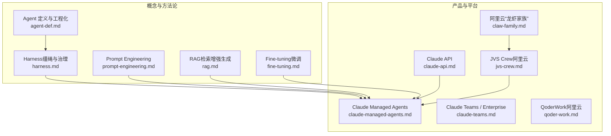
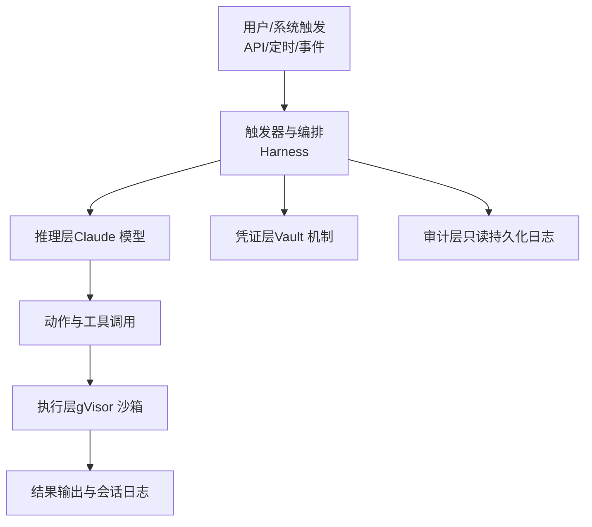
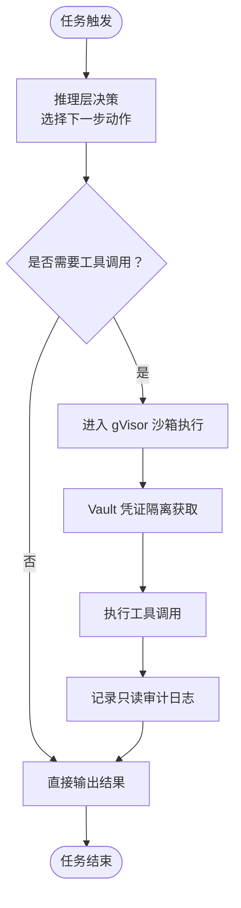
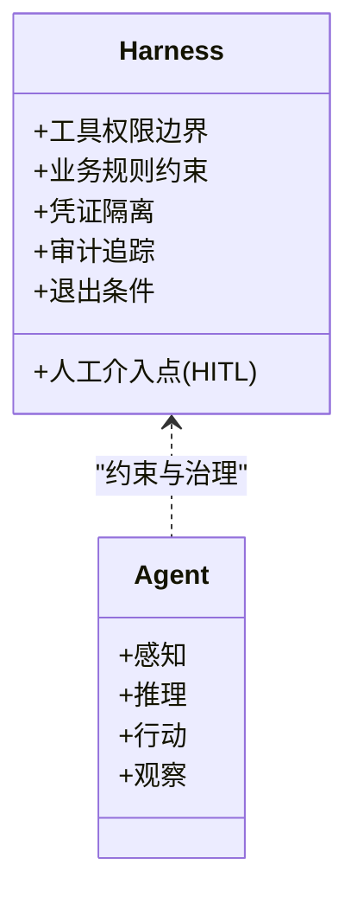
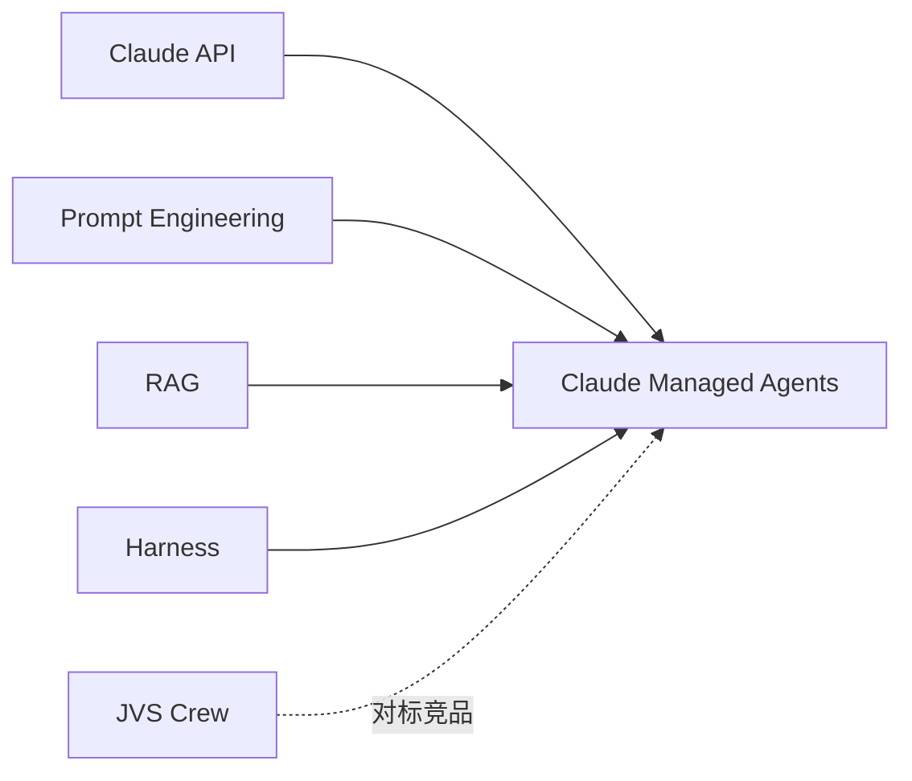

# Claude Managed Agents（AI Application）

<cite>
**本文引用的文件**
- [claude-managed-agents.md](file://knowledge/anthropic/ai-application/claude-managed-agents.md)
- [claude-api.md](file://knowledge/anthropic/maas/claude-api.md)
- [claude-teams.md](file://knowledge/anthropic/ai-application/claude-teams.md)
- [agent-def.md](file://knowledge/ai-general-notes/agent-def.md)
- [harness.md](file://knowledge/ai-general-notes/harness.md)
- [prompt-engineering.md](file://knowledge/ai-general-notes/prompt-engineering.md)
- [rag.md](file://knowledge/ai-general-notes/rag.md)
- [claw-family.md](file://knowledge/alibaba-cloud/ai-application/claw-family.md)
- [jvs-crew.md](file://knowledge/alibaba-cloud/ai-application/jvs-crew.md)
- [qoder-work.md](file://knowledge/alibaba-cloud/ai-application/qoder-work.md)
- [fine-tuning.md](file://knowledge/ai-general-notes/fine-tuning.md)
</cite>

## 目录
1. [简介](#简介)
2. [项目结构](#项目结构)
3. [核心组件](#核心组件)
4. [架构总览](#架构总览)
5. [详细组件分析](#详细组件分析)
6. [依赖分析](#依赖分析)
7. [性能考虑](#性能考虑)
8. [故障排查指南](#故障排查指南)
9. [结论](#结论)
10. [附录](#附录)

## 简介
Claude Managed Agents 是由 Anthropic 推出的云端全托管 AI Agent 平台，面向需要顶级模型能力、强安全与不可变审计日志的 AI Agent 场景。其核心为“推理与执行解耦”的架构，支持多触发模式，执行环境采用 gVisor 沙箱与 Vault 凭证隔离，审计日志默认只读持久化，不可篡改。当前版本为公测（2026-04-08），不支持企业 SSO/RBAC、内网/VPC、以及 AWS Bedrock/GCP Vertex AI/私有化部署。

## 项目结构
本知识库围绕“Agent”“Harness”“Prompt Engineering”“RAG”“Fine-tuning”等主题，形成从基础概念到产品对比、再到竞品分析的知识体系。其中与 Claude Managed Agents 直接相关的内容主要集中在以下文件：
- Claude Managed Agents 产品与能力说明
- Claude API 基础能力定位
- Agent 与 Harness 的工程化方法论
- Prompt Engineering 与 RAG 的技术要点
- 阿里云“龙虾家族”与 JVS Crew 的竞品对比

图表来源
- [claude-managed-agents.md:1-97](file://knowledge/anthropic/ai-application/claude-managed-agents.md#L1-L97)
- [agent-def.md:1-128](file://knowledge/ai-general-notes/agent-def.md#L1-L128)
- [harness.md:1-108](file://knowledge/ai-general-notes/harness.md#L1-L108)
- [prompt-engineering.md:1-193](file://knowledge/ai-general-notes/prompt-engineering.md#L1-L193)
- [rag.md:1-42](file://knowledge/ai-general-notes/rag.md#L1-L42)
- [fine-tuning.md:1-42](file://knowledge/ai-general-notes/fine-tuning.md#L1-L42)
- [claw-family.md:1-137](file://knowledge/alibaba-cloud/ai-application/claw-family.md#L1-L137)
- [jvs-crew.md:1-96](file://knowledge/alibaba-cloud/ai-application/jvs-crew.md#L1-L96)
- [qoder-work.md:1-9](file://knowledge/alibaba-cloud/ai-application/qoder-work.md#L1-L9)
- [claude-api.md:1-9](file://knowledge/anthropic/maas/claude-api.md#L1-L9)
- [claude-teams.md:1-9](file://knowledge/anthropic/ai-application/claude-teams.md#L1-L9)

章节来源
- [claude-managed-agents.md:1-97](file://knowledge/anthropic/ai-application/claude-managed-agents.md#L1-L97)
- [agent-def.md:1-128](file://knowledge/ai-general-notes/agent-def.md#L1-L128)
- [harness.md:1-108](file://knowledge/ai-general-notes/harness.md#L1-L108)
- [prompt-engineering.md:1-193](file://knowledge/ai-general-notes/prompt-engineering.md#L1-L193)
- [rag.md:1-42](file://knowledge/ai-general-notes/rag.md#L1-L42)
- [fine-tuning.md:1-42](file://knowledge/ai-general-notes/fine-tuning.md#L1-L42)
- [claw-family.md:1-137](file://knowledge/alibaba-cloud/ai-application/claw-family.md#L1-L137)
- [jvs-crew.md:1-96](file://knowledge/alibaba-cloud/ai-application/jvs-crew.md#L1-L96)
- [qoder-work.md:1-9](file://knowledge/alibaba-cloud/ai-application/qoder-work.md#L1-L9)
- [claude-api.md:1-9](file://knowledge/anthropic/maas/claude-api.md#L1-L9)
- [claude-teams.md:1-9](file://knowledge/anthropic/ai-application/claude-teams.md#L1-L9)

## 核心组件
- 推理层（Claude 模型）：提供理解与生成能力，支持 claude-opus-4.5 / sonnet / haiku 等系列。
- 执行层（gVisor 沙箱）：Disposable 一次性运行时，任务完成后销毁，确保执行环境隔离与可恢复。
- 凭证层（Vault 机制）：凭证不进入沙箱，通过 Vault 机制隔离，避免执行节点接触真实密钥。
- 审计层（只读持久化日志）：默认不可变审计日志，支持会话日志与全链路追踪。
- 触发与编排：支持 API 调用、定时、事件等多种触发模式，结合 Harness 实现任务编排与智能决策。

章节来源
- [claude-managed-agents.md:16-60](file://knowledge/anthropic/ai-application/claude-managed-agents.md#L16-L60)
- [agent-def.md:29-68](file://knowledge/ai-general-notes/agent-def.md#L29-L68)
- [harness.md:13-47](file://knowledge/ai-general-notes/harness.md#L13-L47)

## 架构总览
Claude Managed Agents 采用“推理与执行解耦”的架构，强调安全与可观测性。其核心设计原则包括：
- 执行环境 Disposable，任务完成后销毁
- 凭证不入沙箱，通过 Vault 机制隔离
- 审计日志只读持久化，不可篡改
- 支持多触发模式，便于与外部系统集成

图表来源
- [claude-managed-agents.md:16-60](file://knowledge/anthropic/ai-application/claude-managed-agents.md#L16-L60)
- [harness.md:13-47](file://knowledge/ai-general-notes/harness.md#L13-L47)

## 详细组件分析

### 推理与执行解耦
- 推理层：基于 Claude API 的模型能力，支持多模型选择与按需计费。
- 执行层：gVisor 沙箱提供 VM 级别的隔离，Disposable 运行时确保每次任务的可恢复性与安全性。
- 凭证层：Vault 机制将凭证与执行节点隔离，避免密钥泄露风险。
- 审计层：默认只读持久化日志，不可篡改，满足合规与审计要求。

图表来源
- [claude-managed-agents.md:16-60](file://knowledge/anthropic/ai-application/claude-managed-agents.md#L16-L60)
- [harness.md:13-47](file://knowledge/ai-general-notes/harness.md#L13-L47)

章节来源
- [claude-managed-agents.md:16-60](file://knowledge/anthropic/ai-application/claude-managed-agents.md#L16-L60)
- [harness.md:13-47](file://knowledge/ai-general-notes/harness.md#L13-L47)

### Harness（治理与约束）
- 工具权限边界：通过工具白名单与参数校验，限定 Agent 能调用的工具集合。
- 业务规则约束：在规则引擎或 Prompt 约束中定义何时停止、何时转人工。
- 人工介入点（HITL）：关键决策节点强制人工确认，降低不可逆操作风险。
- 凭证隔离：执行节点不直接持有生产凭证，采用 Vault 或令牌代理。
- 审计追踪：每步行动可追溯、可回滚，支持不可变日志与全链路追踪。
- 退出条件：设置硬性终止条件（最大步数、超时、异常），避免无限循环。

图表来源
- [harness.md:13-47](file://knowledge/ai-general-notes/harness.md#L13-L47)
- [agent-def.md:60-68](file://knowledge/ai-general-notes/agent-def.md#L60-L68)

章节来源
- [harness.md:13-47](file://knowledge/ai-general-notes/harness.md#L13-L47)
- [agent-def.md:60-68](file://knowledge/ai-general-notes/agent-def.md#L60-L68)

### Prompt Engineering 与 RAG
- Prompt Engineering：通过边界约束、溯源要求、置信度校准、对抗验证四层机制，降低幻觉率，提升可控性与可信度。
- RAG：结合检索与生成，利用外部知识增强模型输出，减少幻觉；建议与 Prompt Engineering 的 Layer 3/4 结合使用，形成“检索 + 四层约束”的完整方案。

章节来源
- [prompt-engineering.md:1-193](file://knowledge/ai-general-notes/prompt-engineering.md#L1-L193)
- [rag.md:1-42](file://knowledge/ai-general-notes/rag.md#L1-L42)

### 竞品对比：Claude Managed Agents vs JVS Crew
- 模型能力：Claude Managed Agents 在 Claude 系列模型上具备行业第一梯队能力。
- 企业身份集成：JVS Crew 支持 SSO/RBAC、内网/VPC、IM 集成（钉钉/企微/飞书），Claude 当前不支持。
- 沙箱与凭证：两者均强调隔离与安全，Claude 使用 gVisor 与 Vault，JVS Crew 使用无影沙箱与 RBAC。
- 审计：Claude 默认只读持久化日志，JVS Crew 提供全链路追踪与可回滚。
- 计费：两者均为按需后付费，Claude 以 Session 与 Token 计费，JVS Crew 以请求消耗计费。

章节来源
- [claude-managed-agents.md:70-85](file://knowledge/anthropic/ai-application/claude-managed-agents.md#L70-L85)
- [jvs-crew.md:68-82](file://knowledge/alibaba-cloud/ai-application/jvs-crew.md#L68-L82)

### 与阿里云“龙虾家族”的关系
- “龙虾家族”包含 HiClaw（多 Agent 协作框架）、QwenPaw（轻量个人 Agent）、百炼龙虾（OpenClaw 云端托管）、PolarClaw（数据库深度优化的 PaaS）、无影 AgentBay（Agent 云基础设施）。
- 与 Claude Managed Agents 的共同点在于：均强调 Agent 平台化、可编排、可观测与安全；差异点在于：执行环境与企业能力侧重点不同（如内网/VPC、SSO/RBAC、IM 集成等）。

章节来源
- [claw-family.md:1-137](file://knowledge/alibaba-cloud/ai-application/claw-family.md#L1-L137)

## 依赖分析
- 与 Claude API 的依赖：Claude Managed Agents 仅支持 Claude API，不支持 AWS Bedrock、GCP Vertex AI 或私有化部署。
- 与 Prompt Engineering 的依赖：通过 Prompt Engineering 的四层机制提升可控性与可信度，降低幻觉风险。
- 与 RAG 的依赖：在需要外部知识增强的场景，建议结合 RAG 与 Prompt Engineering 的 Layer 3/4，形成检索增强 + 结构化约束的完整方案。
- 与 Harness 的依赖：Harness 是 Agent 的约束与治理层，决定 Agent 能做什么、不能做什么、何时需要人工介入。

图表来源
- [claude-managed-agents.md:1-97](file://knowledge/anthropic/ai-application/claude-managed-agents.md#L1-L97)
- [prompt-engineering.md:1-193](file://knowledge/ai-general-notes/prompt-engineering.md#L1-L193)
- [rag.md:1-42](file://knowledge/ai-general-notes/rag.md#L1-L42)
- [harness.md:1-108](file://knowledge/ai-general-notes/harness.md#L1-L108)
- [jvs-crew.md:1-96](file://knowledge/alibaba-cloud/ai-application/jvs-crew.md#L1-L96)

章节来源
- [claude-managed-agents.md:1-97](file://knowledge/anthropic/ai-application/claude-managed-agents.md#L1-L97)
- [prompt-engineering.md:1-193](file://knowledge/ai-general-notes/prompt-engineering.md#L1-L193)
- [rag.md:1-42](file://knowledge/ai-general-notes/rag.md#L1-L42)
- [harness.md:1-108](file://knowledge/ai-general-notes/harness.md#L1-L108)
- [jvs-crew.md:1-96](file://knowledge/alibaba-cloud/ai-application/jvs-crew.md#L1-L96)

## 性能考虑
- Token 与 Session 计费：Claude Managed Agents 以 Claude API 标准费率计费，Session 以 Running 时间计费，网页搜索另计。
- 执行环境隔离：gVisor 沙箱带来更强的安全性，但可能引入额外的执行开销；建议在任务设计阶段尽量减少不必要的工具调用与网络访问。
- 上下文管理：长循环中上下文会膨胀，需采用摘要/截断策略，避免超出上下文窗口导致性能下降。
- 触发与编排：合理设计触发策略与编排逻辑，避免频繁短周期触发造成资源浪费。

章节来源
- [claude-managed-agents.md:61-69](file://knowledge/anthropic/ai-application/claude-managed-agents.md#L61-L69)
- [agent-def.md:101-107](file://knowledge/ai-general-notes/agent-def.md#L101-L107)

## 故障排查指南
- 审计日志不可篡改：若发现日志缺失或异常，优先检查审计日志是否被正确记录与保存，确保只读持久化策略生效。
- 凭证隔离问题：若出现凭证泄露或访问异常，检查 Vault 机制是否正确配置，确保执行节点不直接持有真实密钥。
- 触发与编排异常：若任务未按预期触发或执行中断，检查触发器与编排逻辑，确认退出条件与错误处理策略是否合理。
- 模型输出不可控：若模型输出不稳定或出现幻觉，结合 Prompt Engineering 的四层机制进行约束强化，必要时引入 RAG 与 Layer 3/4。

章节来源
- [claude-managed-agents.md:50-60](file://knowledge/anthropic/ai-application/claude-managed-agents.md#L50-L60)
- [harness.md:13-47](file://knowledge/ai-general-notes/harness.md#L13-L47)
- [prompt-engineering.md:46-79](file://knowledge/ai-general-notes/prompt-engineering.md#L46-L79)

## 结论
Claude Managed Agents 以“推理与执行解耦”为核心，结合 gVisor 沙箱与 Vault 凭证隔离，提供强安全与不可变审计的日志能力，适合对模型能力与安全有较高要求的 AI Agent 场景。在实际应用中，建议配合 Prompt Engineering、RAG 与 Harness 的治理方法，构建稳定、可控、可审计的 Agent 工作流。对于需要企业 SSO/RBAC、内网/VPC、IM 集成的场景，可参考 JVS Crew 的能力矩阵进行取舍。

## 附录
- 术语与概念
  - Agent：围绕 LLM 构建的自主执行系统，包含感知-推理-行动-观察循环。
  - Harness：Agent 的约束与治理层，定义工具权限、业务规则、人工介入点、凭证隔离与审计追踪。
  - Prompt Engineering：通过结构化提示词设计，引导 LLM 输出期望结果，降低幻觉率。
  - RAG：结合检索与生成的增强生成技术，利用外部知识增强模型输出。
  - Fine-tuning：在预训练模型基础上，使用领域数据继续训练以适配特定任务。

章节来源
- [agent-def.md:1-128](file://knowledge/ai-general-notes/agent-def.md#L1-L128)
- [harness.md:1-108](file://knowledge/ai-general-notes/harness.md#L1-L108)
- [prompt-engineering.md:1-193](file://knowledge/ai-general-notes/prompt-engineering.md#L1-L193)
- [rag.md:1-42](file://knowledge/ai-general-notes/rag.md#L1-L42)
- [fine-tuning.md:1-42](file://knowledge/ai-general-notes/fine-tuning.md#L1-L42)