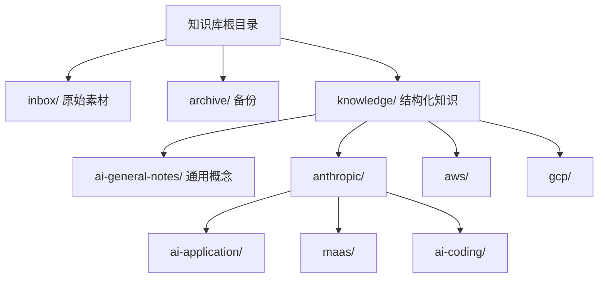
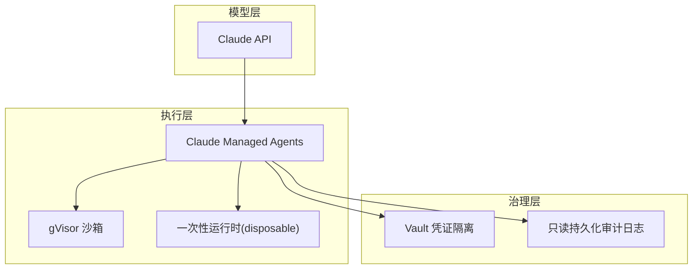
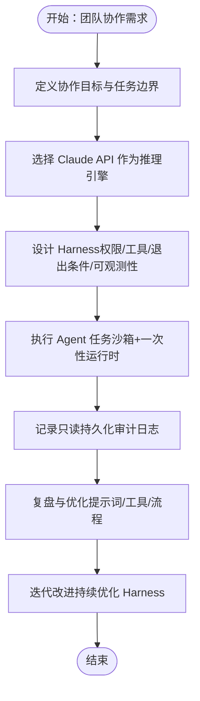
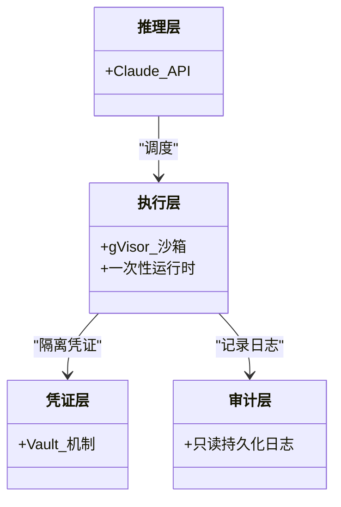
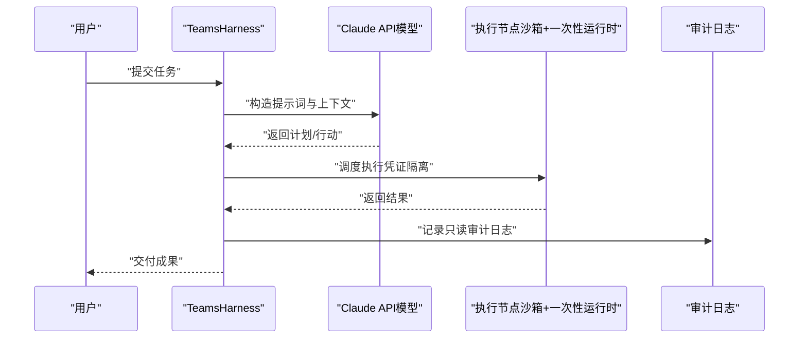
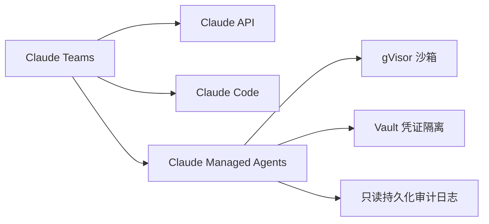

# Claude Teams（AI Application）

<cite>
**本文引用的文件**
- [知识库全局索引](file://index.md)
- [AI Knowledge Base 说明](file://README.md)
- [Claude Teams](file://knowledge/anthropic/ai-application/claude-teams.md)
- [Claude Managed Agents](file://knowledge/anthropic/ai-application/claude-managed-agents.md)
- [Claude API](file://knowledge/anthropic/maas/claude-api.md)
- [Claude Code](file://knowledge/anthropic/ai-coding/claude-code.md)
- [Agent 概念](file://knowledge/ai-general-notes/agent-def.md)
- [阿里云“龙虾家族”](file://knowledge/alibaba-cloud/ai-application/claw-family.md)
- [AWS 上的 Claude](file://knowledge/aws/maas/claude.md)
- [GCP Model Garden](file://knowledge/gcp/maas/overview.md)
- [AI 通用笔记模板](file://knowledge/ai-general-notes/_template.md)
</cite>

## 目录
1. [简介](#简介)
2. [项目结构](#项目结构)
3. [核心组件](#核心组件)
4. [架构总览](#架构总览)
5. [详细组件分析](#详细组件分析)
6. [依赖分析](#依赖分析)
7. [性能考量](#性能考量)
8. [故障排除指南](#故障排除指南)
9. [结论](#结论)
10. [附录](#附录)

## 简介
本文件面向企业与团队协作场景，系统梳理 Claude Teams（AI Application）在 Anthropic AI Application 平台中的定位、能力边界与实践路径。结合仓库现有知识，重点覆盖以下主题：
- 企业级协作与团队工作流：以 Agent 平台为载体，强调“Harness”对执行过程的约束与治理，支撑多角色、多任务的协作闭环。
- 团队配置与权限管理：当前 Claude Managed Agents（与 Teams 相关的托管能力）暂不提供 SSO/RBAC 与 per-agent 权限范围，需结合企业 IAM/目录服务进行外部编排。
- 文档协作与项目管理：依托 Claude API 与 Claude Code 等能力，形成“提示词工程 + 代码理解/生成 + 可观测性”的协作范式。
- 与企业系统的集成：通过 API 调用、凭证隔离与审计日志，满足企业合规与安全要求；与 IM/协作平台的集成需通过企业侧能力实现。
- 数据安全与合规：以 gVisor 沙箱、Vault 凭证隔离、只读持久化审计日志为核心安全基线。
- 部署指南、使用流程与最佳实践：基于现有文档总结可落地的实施步骤与注意事项。
- 团队规模扩展、性能优化与故障排除：结合 Agent 工程化要点与平台能力边界，提出可操作建议。

## 项目结构
本知识库采用“领域 + 厂商 + 产品”的层级组织，便于跨厂商对比与横向借鉴。Claude Teams 所在的知识域为“Anthropic / AI App”，并与“MaaS（Claude API）”“AI Coding（Claude Code）”“Agent 平台（Claude Managed Agents）”存在紧密关联。

图表来源
- [知识库全局索引:1-69](file://index.md#L1-L69)
- [AI Knowledge Base 说明:1-20](file://README.md#L1-L20)

章节来源
- [知识库全局索引:1-69](file://index.md#L1-L69)
- [AI Knowledge Base 说明:1-20](file://README.md#L1-L20)

## 核心组件
- Claude Teams（AI Application）：面向组织协作场景的 AI 应用平台定位，与“Agent 平台 + 模型 + 工具 + 治理”三位一体的体系相关联。
- Claude API：Claude 模型的 MaaS 服务能力，是 Teams 的“推理引擎”。
- Claude Code：命令行 AI 编程工具，强调在真实代码库上的应用与先发优势，可作为团队“代码理解/生成”的协作工具。
- Agent 平台（Claude Managed Agents）：云端全托管 Agent 平台，强调推理与执行解耦、gVisor 沙箱、Vault 凭证隔离与只读审计日志，当前不支持 SSO/RBAC。
- Agent 概念与工程化：以“感知-推理-行动-观察”循环为核心，强调 Harness 对工具权限、退出条件、可观测性的约束。

章节来源
- [Claude Teams:1-9](file://knowledge/anthropic/ai-application/claude-teams.md#L1-L9)
- [Claude API:1-9](file://knowledge/anthropic/maas/claude-api.md#L1-L9)
- [Claude Code:1-52](file://knowledge/anthropic/ai-coding/claude-code.md#L1-L52)
- [Claude Managed Agents:1-97](file://knowledge/anthropic/ai-application/claude-managed-agents.md#L1-L97)
- [Agent 概念:1-128](file://knowledge/ai-general-notes/agent-def.md#L1-L128)

## 架构总览
Claude Teams 的企业协作架构可抽象为“模型 + 执行 + 治理 + 审计”的四层协同：
- 模型层：Claude API 提供推理能力，作为 Agent 的“大脑”。
- 执行层：Claude Managed Agents 的执行节点采用 gVisor 沙箱与 disposable 运行时，确保执行环境隔离与可销毁性。
- 治理层：通过 Vault 凭证隔离与只读持久化审计日志，实现最小权限与不可篡改审计。
- 审计层：会话日志与不可变事件日志，满足合规与追溯需求。

图表来源
- [Claude Managed Agents:22-59](file://knowledge/anthropic/ai-application/claude-managed-agents.md#L22-L59)
- [Claude API:1-9](file://knowledge/anthropic/maas/claude-api.md#L1-L9)

## 详细组件分析

### Claude Teams（AI Application）
- 定位：面向组织协作场景的 AI 应用平台，强调 Harness 对 Agent 执行过程的约束与治理，支撑多角色、多任务的协作闭环。
- 与 Agent 平台的关系：Teams 与 Claude Managed Agents 共享“推理与执行解耦”的架构思想，Teams 的具体实现细节以“团队工作流 + 知识管理 + 协作治理”为核心。
- 与 Claude API 的关系：Teams 以 Claude API 作为推理引擎，结合团队知识库与协作工具，形成“提示词工程 + 代码理解/生成 + 可观测性”的协作范式。
- 与 Claude Code 的关系：在代码理解与生成环节，Claude Code 可作为团队的“命令行编程助手”，与 Teams 的协作流程互补。

图表来源
- [Agent 概念:60-107](file://knowledge/ai-general-notes/agent-def.md#L60-L107)
- [Claude Teams:1-9](file://knowledge/anthropic/ai-application/claude-teams.md#L1-L9)

章节来源
- [Claude Teams:1-9](file://knowledge/anthropic/ai-application/claude-teams.md#L1-L9)
- [Agent 概念:1-128](file://knowledge/ai-general-notes/agent-def.md#L1-L128)

### Claude Managed Agents（Agent 平台）
- 架构四大模块：推理层（Claude 模型）、执行层（gVisor 沙箱）、凭证层（Vault 机制）、审计层（只读持久化日志）。
- 关键设计原则：一次性运行时、凭证不入沙箱、只读不可篡改审计日志。
- 核心限制：当前不支持 SSO/RBAC、内网/VPC 支持，模型锁定为 Claude API。
- 与 Teams 的关系：Teams 可借鉴其执行与治理思路，结合企业 IAM/目录服务实现团队配置与权限管理。

图表来源
- [Claude Managed Agents:22-59](file://knowledge/anthropic/ai-application/claude-managed-agents.md#L22-L59)

章节来源
- [Claude Managed Agents:1-97](file://knowledge/anthropic/ai-application/claude-managed-agents.md#L1-L97)

### Claude API（模型服务）
- 定位：Claude Opus/Sonnet/Haiku 的 MaaS 服务，作为 Teams 的推理引擎。
- 使用建议：在 Teams 的协作流程中，将 API 调用封装为可复用的工具，结合 Harness 的权限与可观测性设计，确保任务执行的安全与稳定。

章节来源
- [Claude API:1-9](file://knowledge/anthropic/maas/claude-api.md#L1-L9)

### Claude Code（命令行编程工具）
- 定位：在真实世界代码库上具备先发优势的 AI 编程工具，强调代码理解与生成能力。
- 与 Teams 的协作：在代码改造、重构与自动化生成环节，Claude Code 可作为团队的“命令行编程助手”，与 Teams 的协作流程互补。

章节来源
- [Claude Code:1-52](file://knowledge/anthropic/ai-coding/claude-code.md#L1-L52)

### Agent 概念与工程化
- Agent = Model + Harness，Harness 决定 Agent 能做什么、不能做什么。
- “感知-推理-行动-观察”循环是 Agent 的工程化骨架，强调退出条件显式化、工具幂等性、上下文压缩与可观测性优先。

图表来源
- [Agent 概念:60-107](file://knowledge/ai-general-notes/agent-def.md#L60-L107)
- [Claude Managed Agents:22-59](file://knowledge/anthropic/ai-application/claude-managed-agents.md#L22-L59)

章节来源
- [Agent 概念:1-128](file://knowledge/ai-general-notes/agent-def.md#L1-L128)
- [Claude Managed Agents:1-97](file://knowledge/anthropic/ai-application/claude-managed-agents.md#L1-L97)

### 与企业系统的集成
- 与 IM/协作平台集成：当前 Claude Managed Agents 不支持多渠道 IM 集成，Teams 的团队协作可通过企业侧的 IM/协作平台实现对接。
- 与企业 IAM/目录服务集成：当前 Claude Managed Agents 不支持 SSO/RBAC，Teams 的团队配置与权限管理需结合企业 IAM/目录服务进行外部编排。

章节来源
- [Claude Managed Agents:70-84](file://knowledge/anthropic/ai-application/claude-managed-agents.md#L70-L84)

### 与竞品对比（阿里云“龙虾家族”）
- HiClaw：基于 OpenClaw 的架构升级分支，主打 Manager-Worker 多 Agent 协作，强调零凭证架构与内置心跳监控。
- 百炼龙虾：OpenClaw 原版云端官方托管，支持钉钉/飞书接入，适合快速落地。
- PolarClaw：通用 AI 助理 + PolarDB 深度优化，提供数据库 AI 操作能力。
- 与 Teams 的关系：Teams 可借鉴“零凭证架构”“内置监控”“多渠道接入”的设计思路，结合企业 IAM/目录服务实现团队权限与协作治理。

章节来源
- [阿里云“龙虾家族”:1-137](file://knowledge/alibaba-cloud/ai-application/claw-family.md#L1-L137)
- [Claude Managed Agents:70-84](file://knowledge/anthropic/ai-application/claude-managed-agents.md#L70-L84)

## 依赖分析
- 与 Claude API 的依赖：Teams 的推理能力依赖 Claude API，需关注 Token 计费与会话成本。
- 与 Claude Code 的依赖：在代码理解与生成环节，Claude Code 可作为团队工具链的一部分。
- 与 Agent 平台的依赖：Teams 可借鉴 Claude Managed Agents 的执行与治理思路，结合企业 IAM/目录服务实现团队配置与权限管理。

图表来源
- [Claude Teams:1-9](file://knowledge/anthropic/ai-application/claude-teams.md#L1-L9)
- [Claude API:1-9](file://knowledge/anthropic/maas/claude-api.md#L1-L9)
- [Claude Code:1-52](file://knowledge/anthropic/ai-coding/claude-code.md#L1-L52)
- [Claude Managed Agents:22-59](file://knowledge/anthropic/ai-application/claude-managed-agents.md#L22-L59)

章节来源
- [Claude Teams:1-9](file://knowledge/anthropic/ai-application/claude-teams.md#L1-L9)
- [Claude API:1-9](file://knowledge/anthropic/maas/claude-api.md#L1-L9)
- [Claude Code:1-52](file://knowledge/anthropic/ai-coding/claude-code.md#L1-L52)
- [Claude Managed Agents:1-97](file://knowledge/anthropic/ai-application/claude-managed-agents.md#L1-L97)

## 性能考量
- 会话计费与 Token 成本：Claude API 的 Token 计费与会话小时计费需纳入团队预算与任务编排考量。
- 一次性运行时与沙箱开销：执行节点的一次性销毁与沙箱隔离带来安全收益，但也需关注启动与销毁的时延。
- 可观测性优先：在长循环任务中，上下文膨胀与错误累积是关键风险，需通过日志与监控保障性能与稳定性。

章节来源
- [Claude Managed Agents:61-69](file://knowledge/anthropic/ai-application/claude-managed-agents.md#L61-L69)
- [Agent 概念:101-107](file://knowledge/ai-general-notes/agent-def.md#L101-L107)

## 故障排除指南
- 任务失败与错误传播：在多 Agent 或长循环任务中，应设置显式退出条件与人工介入点，避免错误传播。
- 工具幂等性与重试：对可重试操作需幂等化设计，对不可逆操作需引入人工确认门。
- 审计与追溯：利用只读持久化审计日志进行问题定位与责任追溯。
- 与企业系统的对接问题：若出现 IM/协作平台对接异常，需检查企业侧的集成配置与凭证下发流程。

章节来源
- [Agent 概念:101-107](file://knowledge/ai-general-notes/agent-def.md#L101-L107)
- [Claude Managed Agents:50-59](file://knowledge/anthropic/ai-application/claude-managed-agents.md#L50-L59)

## 结论
Claude Teams（AI Application）以“Harness”为核心，将模型、工具、执行与治理整合为企业级协作能力。当前 Claude Managed Agents 提供了可借鉴的执行与治理基线（gVisor 沙箱、Vault 凭证隔离、只读审计日志），而团队配置与权限管理需结合企业 IAM/目录服务实现。通过 Claude API 与 Claude Code 的协同，Teams 可在提示词工程、代码理解与生成、可观测性等方面形成稳健的协作范式，并在企业系统集成、数据安全与合规方面取得平衡。

## 附录
- 术语表
  - Harness：约束与治理层，决定 Agent 能做什么、不能做什么。
  - disposable：一次性运行时，执行完毕即销毁。
  - Vault：凭证隔离机制，确保执行节点不接触真实密钥。
  - 只读持久化审计日志：不可篡改的事件日志，用于合规与追溯。
- 参考资料
  - [知识库全局索引:1-69](file://index.md#L1-L69)
  - [AI 通用笔记模板:1-75](file://knowledge/ai-general-notes/_template.md#L1-L75)
  - [AWS 上的 Claude:1-9](file://knowledge/aws/maas/claude.md#L1-L9)
  - [GCP Model Garden:1-9](file://knowledge/gcp/maas/overview.md#L1-L9)