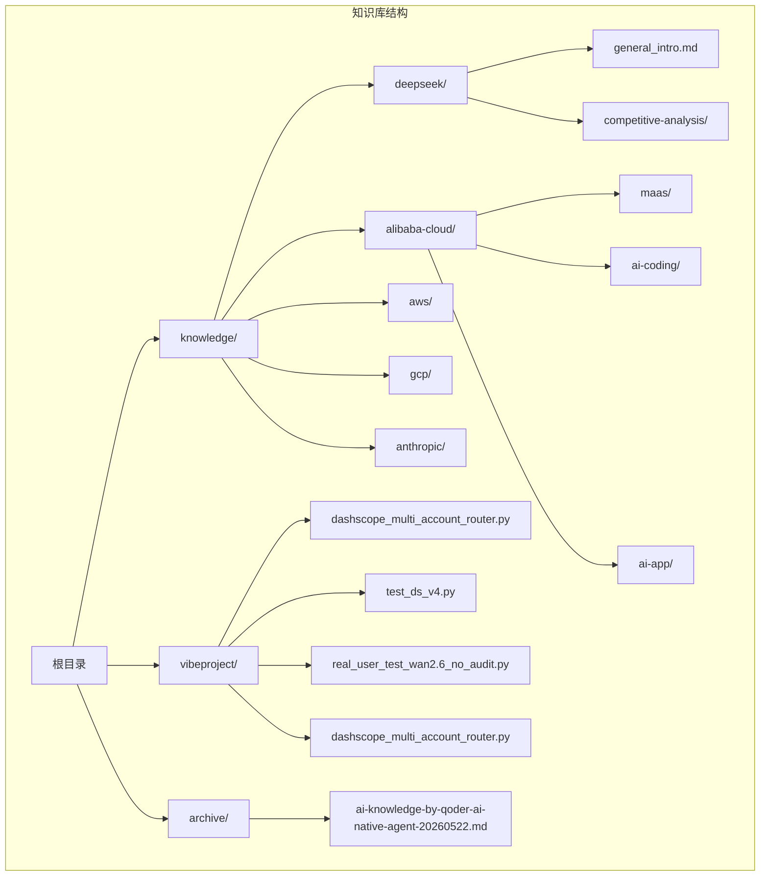
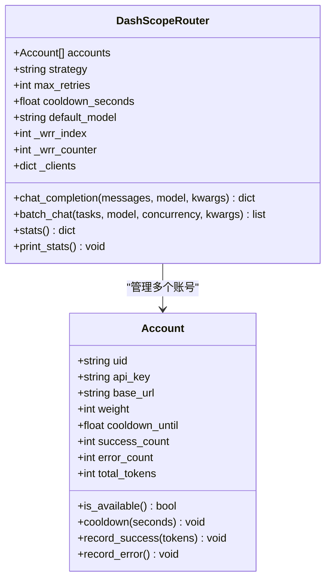
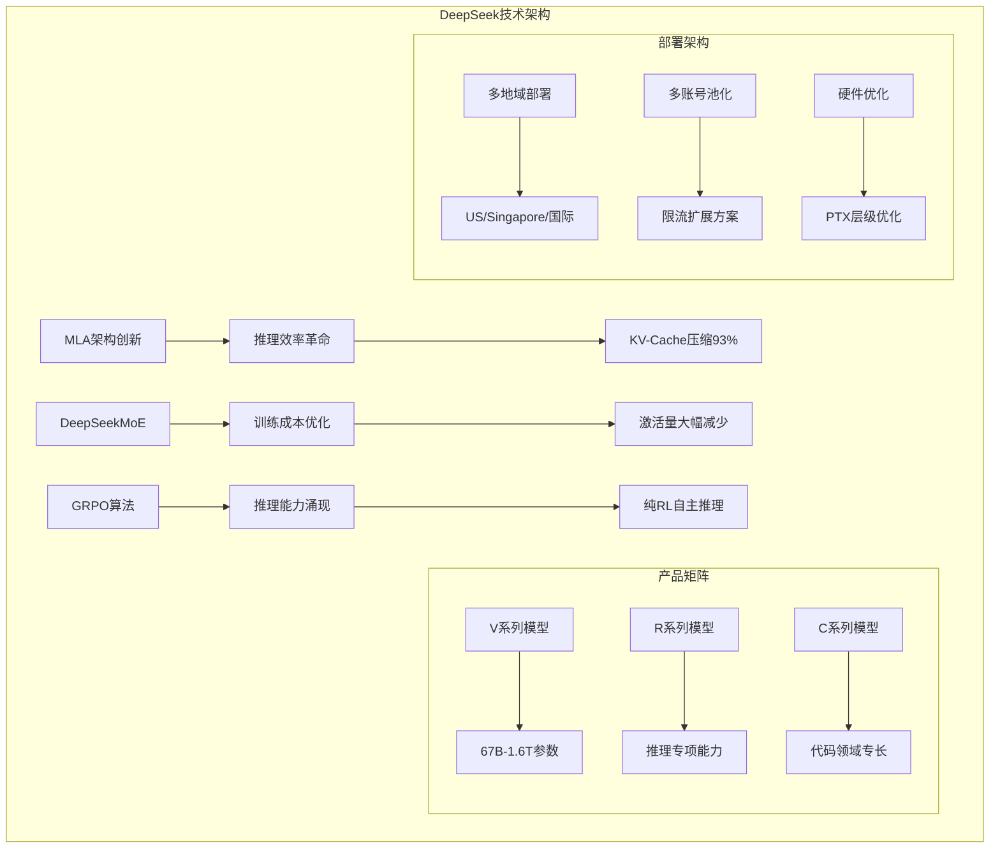
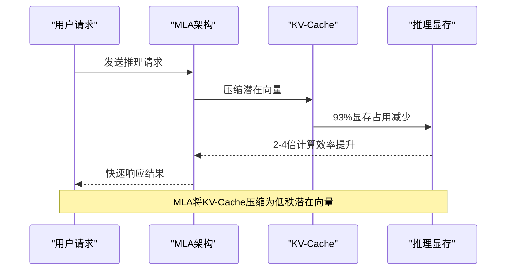
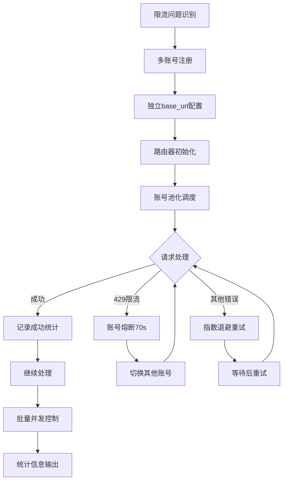
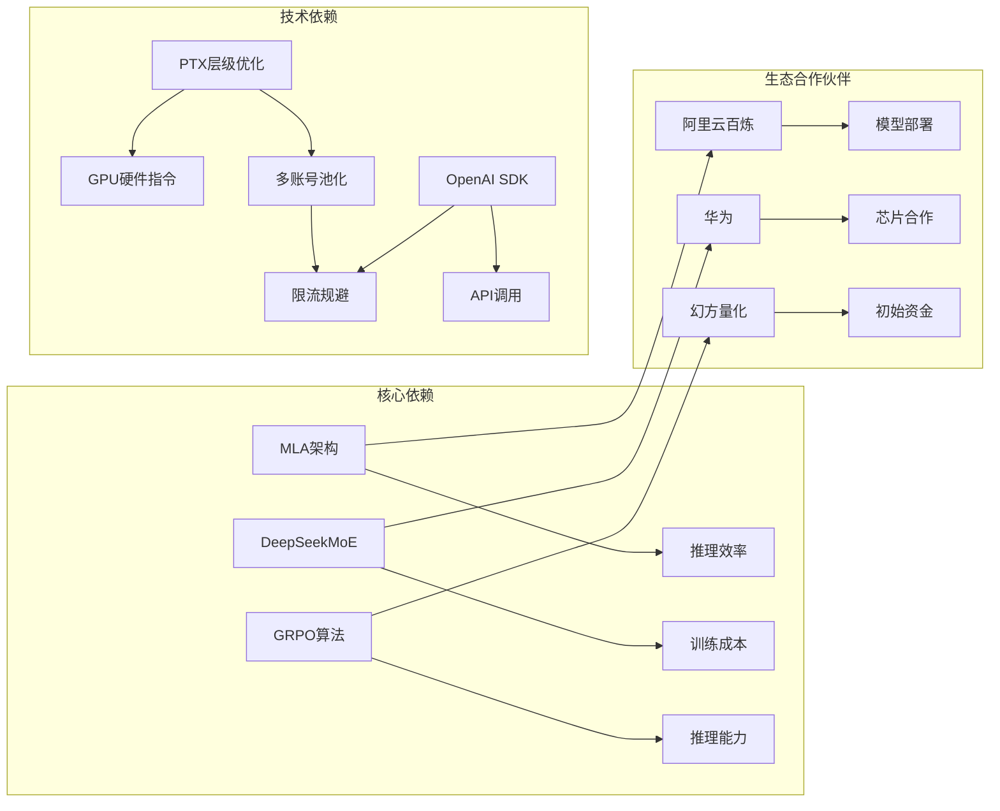
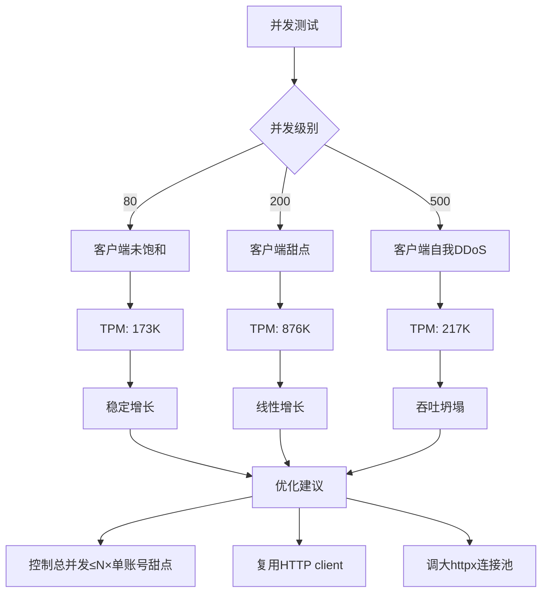

# DeepSeek公司分析报告

<cite>
**本文档引用的文件**
- [DeepSeek公司分析报告](file://knowledge/deepseek/general_intro.md)
- [百炼平台](file://knowledge/alibaba-cloud/maas/overview.md)
- [DeepSeek多账号路由路由器](file://vibeproject/dashscope_multi_account_router.py)
- [DeepSeek模型测试脚本](file://vibeproject/test_ds_v4.py)
- [2026-05-22 百炼多账号限流扩展方案](file://archive/ai-knowledge-by-qoder-ai-native-agent-20260522.md)
- [Qoder vs Trae竞争分析](file://knowledge/alibaba-cloud/competitive-analysis/qoder-vs-trae/overview.md)
- [_general_company_intro_template.md](file://knowledge/_general_company_intro_template.md)
</cite>

## 目录
1. [简介](#简介)
2. [项目结构](#项目结构)
3. [核心组件](#核心组件)
4. [架构概览](#架构概览)
5. [详细组件分析](#详细组件分析)
6. [依赖分析](#依赖分析)
7. [性能考虑](#性能考虑)
8. [故障排除指南](#故障排除指南)
9. [结论](#结论)
10. [附录](#附录)

## 简介

DeepSeek（深度求索）是中国最具影响力的开源大模型公司，由量化基金幻方量化创始人梁文锋于2023年创立。公司凭借MLA（多头潜在注意力）、DeepSeekMoE等原创架构创新和极致性价比的开源策略，在2025年1月引发全球**"DeepSeek时刻"**——R1模型发布当天即导致Nvidia单日市值蒸发5890亿美元。

DeepSeek的核心特点是：
- **开源至上**：所有核心模型（V2/V3/R1/V4）均完全开源，MIT许可
- **架构创新**：用600万美元训练成本对标5亿美元级模型，颠覆"暴力堆算力"范式
- **商业化不是目标**：梁文锋多次表态，公司定位为"纯粹的研究机构"
- **极简组织**：150人团队产出的模型影响力对标数千人团队

## 项目结构

该项目的知识库采用主题分类的组织方式，重点关注AI领域的技术分析和企业实践：

**图表来源**
- [DeepSeek公司分析报告:1-346](file://knowledge/deepseek/general_intro.md#L1-L346)
- [百炼平台:1-204](file://knowledge/alibaba-cloud/maas/overview.md#L1-L204)

**章节来源**
- [DeepSeek公司分析报告:1-346](file://knowledge/deepseek/general_intro.md#L1-L346)
- [百炼平台:1-204](file://knowledge/alibaba-cloud/maas/overview.md#L1-L204)

## 核心组件

### 1. 深度求索公司分析报告

DeepSeek作为AI领域的创新企业，其分析报告涵盖了公司概况、产品矩阵、技术架构等多个维度：

**核心技术架构**：
- MLA（多头潜在注意力）：将KV-Cache压缩为低秩潜在向量，推理显存减少93%
- DeepSeekMoE：改进专家路由机制，更细粒度的专家划分
- GRPO（Group Relative Policy Optimization）：R1核心算法，纯RL自主激发推理能力

**产品矩阵**：
- V系列（通用旗舰）：从V1到V4，参数规模从67B到1.6T
- R系列（推理专项）：R1纯RL推理，R2下一代推理模型
- C系列（代码专项）：DeepSeek-Coder系列代码模型

**商业模式**：
- API调用为主，定价极具竞争力（V4-Pro约为Claude Opus 4.6的1/5价格）
- C端App尚未商业化，当前免费为主
- 150人团队产出对标数千人团队的影响力

**章节来源**
- [DeepSeek公司分析报告:7-115](file://knowledge/deepseek/general_intro.md#L7-L115)
- [DeepSeek公司分析报告:246-288](file://knowledge/deepseek/general_intro.md#L246-L288)

### 2. 百炼平台集成

阿里云百炼平台作为DeepSeek模型的重要部署渠道，提供了多地域统一的模型调用接入能力：

**限流机制**：
- 限流颗粒度：阿里云账号（UID）级别
- 限流维度：RPM（每分钟请求数）、TPM（每分钟Token数）、RPS/TPS（秒级保护）
- 恢复特性：触发限流后通常1分钟内自动恢复

**多账号扩TPM方案**：
- 单个UID额度无法满足业务吞吐需求时，可通过注册多个独立阿里云账号
- 2个独立UID实测TPM突破单UID文档额度达到1.84M+
- 8.5倍扩容效果验证

**章节来源**
- [百炼平台:32-126](file://knowledge/alibaba-cloud/maas/overview.md#L32-L126)
- [百炼平台:175-197](file://knowledge/alibaba-cloud/maas/overview.md#L175-L197)

### 3. 技术实现组件

#### 多账号路由路由器

该组件实现了DeepSeek模型的多账号池化调度，是解决云厂商限流问题的关键技术：

**图表来源**
- [DeepSeek多账号路由路由器:69-160](file://vibeproject/dashscope_multi_account_router.py#L69-L160)

**核心功能**：
- 多账号轮询/加权调度
- 429限流自动熔断与恢复
- 指数退避重试
- 异步并发安全
- 实时用量统计

**章节来源**
- [DeepSeek多账号路由路由器:1-551](file://vibeproject/dashscope_multi_account_router.py#L1-L551)

#### 模型测试脚本

该脚本展示了DeepSeek模型在不同地域的调用方式和限流参数：

**地域路由规则**：
- DeepSeek V4（deepseek-v4-pro/deepseek-v4-flash）：必须调用US节点
- DeepSeek V3.2（deepseek-v3.2）：优先调用新加坡（国际）节点

**限流参数**：
- RPM：15,000（每分钟请求数）
- TPM：1,200,000（每分钟Token数，含输入与输出）
- 限流按主账号维度统计，超出后通常一分钟内自动恢复

**章节来源**
- [DeepSeek模型测试脚本:1-102](file://vibeproject/test_ds_v4.py#L1-L102)

**章节来源**
- [DeepSeek模型测试脚本:1-102](file://vibeproject/test_ds_v4.py#L1-L102)

## 架构概览

DeepSeek的技术架构体现了从算法创新到工程实现的完整体系：

**图表来源**
- [DeepSeek公司分析报告:246-288](file://knowledge/deepseek/general_intro.md#L246-L288)
- [百炼平台:22-31](file://knowledge/alibaba-cloud/maas/overview.md#L22-L31)

## 详细组件分析

### MLA架构创新分析

MLA（多头潜在注意力）是DeepSeek的核心技术创新，彻底改变了大模型推理的成本公式：

**图表来源**
- [DeepSeek公司分析报告:254-258](file://knowledge/deepseek/general_intro.md#L254-L258)

**技术特点**：
- KV-Cache压缩为低秩潜在向量
- 推理显存减少93%
- 计算效率提升2-4倍
- 改写了大模型推理成本公式

**章节来源**
- [DeepSeek公司分析报告:254-258](file://knowledge/deepseek/general_intro.md#L254-L258)

### 多账号扩TPM方案

面对云厂商UID级限流，DeepSeek团队开发了完整的多账号池化解决方案：

**图表来源**
- [DeepSeek多账号路由路由器:205-321](file://vibeproject/dashscope_multi_account_router.py#L205-L321)

**实现细节**：
- 2个独立UID实测TPM突破1.84M+
- 8.5倍扩容效果验证
- 客户端拥塞拐点识别（200并发为甜点）
- httpx连接池优化（max_connections=1000）

**章节来源**
- [2026-05-22 百炼多账号限流扩展方案:66-131](file://archive/ai-knowledge-by-qoder-ai-native-agent-20260522.md#L66-L131)

### 模型测试与验证

通过端到端的测试验证，DeepSeek的模型性能得到了充分证明：

**测试设计**：
- 模型：deepseek-v4-flash（思考模式默认开启）
- 账号：DASHSCOPE_API_KEY（大陆站）+ DASHSCOPE_API_KEY_INTL（国际站）
- 客户端优化：httpx连接池max_connections=1000、keepalive=200

**关键发现**：
- 单账号500并发TPM：217K（触发大量429限流）
- 双账号500并发TPM：1,840,652（零限流）
- 客户端拥塞拐点：200并发为最佳性能点
- 账号token分布：几乎对半分（53% vs 47%）

**章节来源**
- [2026-05-22 百炼多账号限流扩展方案:68-115](file://archive/ai-knowledge-by-qoder-ai-native-agent-20260522.md#L68-L115)

## 依赖分析

DeepSeek的发展形成了独特的生态系统依赖关系：

**图表来源**
- [DeepSeek公司分析报告:167-193](file://knowledge/deepseek/general_intro.md#L167-L193)
- [百炼平台:183-191](file://knowledge/alibaba-cloud/maas/overview.md#L183-L191)

**依赖关系分析**：
- **技术依赖**：PTX层级优化超越CUDA标准编程接口
- **生态依赖**：与华为芯片合作推进国产化路线
- **平台依赖**：阿里云百炼提供重要的部署渠道
- **资金依赖**：幻方量化提供初始资金与GPU资源

**章节来源**
- [DeepSeek公司分析报告:167-193](file://knowledge/deepseek/general_intro.md#L167-L193)
- [百炼平台:183-191](file://knowledge/alibaba-cloud/maas/overview.md#L183-L191)

## 性能考虑

### 算力优化策略

DeepSeek在算力使用方面展现了极致的优化能力：

**硬件配置**：
- V3训练：约2000-3000张H800
- 日常推理：约278台服务器/2224张GPU
- DAU2000万满配：约2.78万张GPU
- V4训练：H800+华为昇腾

**成本控制**：
- V3训练仅557万美元（GPU运算成本）
- 约38亿人民币硬件总投入（媒体估算）
- 用557万美元训练成本对标5亿美元级模型

**效率提升**：
- MLA减少KV-Cache，推理显存占用大幅降低
- DeepSeekMoE激活量大幅减少，训练/推理成本双降
- PTX层级优化，直接在GPU硬件指令层做优化

### 并发性能优化

针对客户端拥塞拐点的识别和优化：

**图表来源**
- [2026-05-22 百炼多账号限流扩展方案:84-115](file://archive/ai-knowledge-by-qoder-ai-native-agent-20260522.md#L84-L115)

**章节来源**
- [DeepSeek公司分析报告:147-154](file://knowledge/deepseek/general_intro.md#L147-L154)
- [2026-05-22 百炼多账号限流扩展方案:84-131](file://archive/ai-knowledge-by-qoder-ai-native-agent-20260522.md#L84-L131)

## 故障排除指南

### 常见问题诊断

基于实际压测经验，DeepSeek集成中常见的问题及解决方案：

**问题1：500并发吞吐反而下降**
- **原因**：客户端自我DDoS，超过RPM软限后重试风暴挤占资源
- **解决方案**：并发控制在甜点（~200），需更高吞吐走多账号池化

**问题2：创建多个API Key后TPM未提升**
- **原因**：API Key同账号额度共享
- **解决方案**：注册N个独立阿里云账号，业务层路由

**问题3：同一deepseek-v4在base_url不匹配的地域报无权限**
- **原因**：API Key与base_url地域必须匹配
- **解决方案**：为每个账号记录正确的base_url，在路由器中绑定

**章节来源**
- [百炼平台:175-182](file://knowledge/alibaba-cloud/maas/overview.md#L175-L182)
- [2026-05-22 百炼多账号限流扩展方案:175-182](file://archive/ai-knowledge-by-qoder-ai-native-agent-20260522.md#L175-L182)

### 限流参数对照

| 维度 | 百炼 | AWS Bedrock | GCP Vertex AI |
|------|------|-------------|---------------|
| 限流颗粒度 | 账号（UID） | 账号+区域+模型 | 项目（Project）+区域+模型 |
| 限流提额 | 控制台"限流提额"页 | Quota表单+AWS Support | Quota Increase Request |
| 多账号扩额可行性 | 可行（官方未禁，实测验证8.5×）| 可行但复杂（多Account/IAM） | 可行（多Project） |
| OpenAI兼容API | 是 | 否（需SDK转换）| 是（OpenAI兼容endpoint） |

**章节来源**
- [百炼平台:183-191](file://knowledge/alibaba-cloud/maas/overview.md#L183-L191)

## 结论

DeepSeek作为AI领域的创新先锋，通过三大核心技术架构创新彻底改变了行业对大模型发展的认知：

### 核心成就

1. **MLA架构革命**：将KV-Cache压缩93%，计算效率提升2-4倍
2. **DeepSeekMoE优化**：激活量大幅减少，训练/推理成本双降
3. **GRPO算法突破**：纯RL自主激发推理能力，无需SFT监督数据

### 商业模式创新

- **开源至上**：所有核心模型MIT开源，推动AGI研究普惠化
- **极致性价比**：用600万美元训练成本对标5亿美元级模型
- **极简组织**：150人团队产出对标数千人团队的影响力

### 技术影响力

- **GPU市场格局影响**：R1发布直接导致Nvidia市值单日蒸发5890亿美元
- **全球AI政策讨论**：DeepSeek的成功使"中国AI威胁论"成为高频议题
- **开源SOTA标杆**：V3、R1、V4连续三代在开源领域达到SOTA

### 未来展望

随着首轮融资（100-500亿美元）即将到来，DeepSeek正从"纯研究机构"向"有资本平台支撑的研究机构"转变。其在架构创新、算力优化和开源策略方面的成功经验，为整个AI行业的发展提供了重要启示。

## 附录

### 关键技术参数

**V4系列模型规格**：
- DeepSeek-V4-Pro：1.6T参数，全能旗舰
- DeepSeek-V4-Flash：284B参数，极致高效轻量版
- 支持1M上下文，均支持思考模式

**训练成本对比**：
- DeepSeek V3：557万美元（GPU运算成本）
- OpenAI GPT-5：预计数亿美元
- 成本效率提升数倍

### 参考文献

- DeepSeek官方/arxiv：R1论文"Incentivizing Reasoning via RL"
- BBC/NYT：2025.01.27 DeepSeek App登顶App Store，Nvidia市值蒸发5890亿
- 量子位：V4发布，明确华为芯片合作
- 太平洋科技：团队150人、DAU 2000万、2.78万张GPU估算