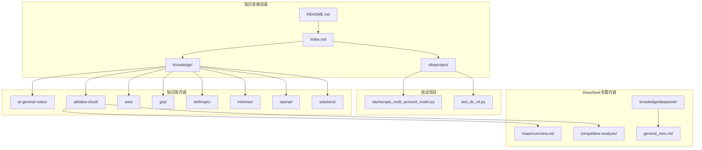
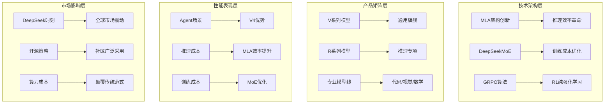
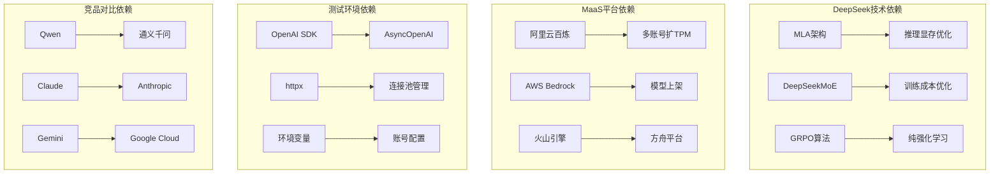
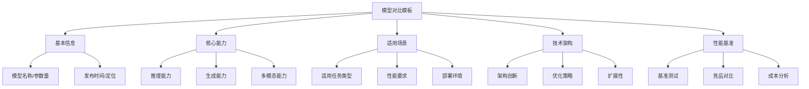

# DeepSeek模型对比分析

<cite>
**本文档引用的文件**
- [README.md](file://README.md)
- [index.md](file://index.md)
- [general_intro.md](file://knowledge/deepseek/general_intro.md)
- [overview.md](file://knowledge/alibaba-cloud/maas/overview.md)
- [test_ds_v4.py](file://vibeproject/test_ds_v4.py)
- [_maas_template.md](file://knowledge/_maas_template.md)
- [dashscope_multi_account_router.py](file://vibeproject/dashscope_multi_account_router.py)
- [agent-def.md](file://knowledge/ai-general-notes/agent-def.md)
- [overview.md](file://knowledge/ai-general-notes/overview.md)
- [fine-tuning.md](file://knowledge/ai-general-notes/fine-tuning.md)
- [prompt-engineering.md](file://knowledge/ai-general-notes/prompt-engineering.md)
- [qwen.md](file://knowledge/alibaba-cloud/maas/qwen.md)
- [overview.md](file://knowledge/gcp/maas/overview.md)
- [overview.md](file://knowledge/aws/maas/overview.md)
- [titan.md](file://knowledge/aws/maas/titan.md)
- [_template.md](file://knowledge/alibaba-cloud/competitive-analysis/_template.md)
</cite>

## 目录
1. [简介](#简介)
2. [项目结构](#项目结构)
3. [核心组件](#核心组件)
4. [架构概览](#架构概览)
5. [详细组件分析](#详细组件分析)
6. [依赖分析](#依赖分析)
7. [性能考虑](#性能考虑)
8. [故障排除指南](#故障排除指南)
9. [结论](#结论)
10. [附录](#附录)

## 简介
本文件基于AI知识库项目，对DeepSeek模型进行全面对比分析。DeepSeek作为中国最具影响力的开源大模型公司，凭借MLA（多头潜在注意力）、DeepSeekMoE等原创架构创新，在2025年1月引发全球"DeepSeek时刻"——R1模型发布当天即导致Nvidia单日市值蒸发5890亿美元。本文档通过项目中的知识库文档、测试脚本和模板文件，系统梳理DeepSeek的技术特色、产品矩阵、性能表现和在MaaS平台中的集成情况。

## 项目结构
AI知识库项目采用模块化组织方式，按照厂商和功能领域进行分类：

**图表来源**
- [README.md:1-20](file://README.md#L1-L20)
- [index.md:1-78](file://index.md#L1-L78)

**章节来源**
- [README.md:1-20](file://README.md#L1-L20)
- [index.md:1-78](file://index.md#L1-L78)

## 核心组件
基于知识库内容，DeepSeek模型对比分析涉及以下核心组件：

### 1. 公司分析组件
DeepSeek公司分析报告包含完整的公司概况、产品矩阵、技术架构和市场影响分析。

### 2. 产品矩阵组件
涵盖V系列（通用旗舰）、R系列（推理专项）和其他专业模型线的详细对比。

### 3. 技术架构组件
重点分析MLA（多头潜在注意力）和DeepSeekMoE两大原创架构的创新点和性能优势。

### 4. 性能基准组件
包含与竞品的详细性能对比数据，特别是在Agent场景下的表现差异。

**章节来源**
- [general_intro.md:1-394](file://knowledge/deepseek/general_intro.md#L1-L394)
- [overview.md:1-204](file://knowledge/alibaba-cloud/maas/overview.md#L1-L204)

## 架构概览
DeepSeek模型对比分析采用多层次架构设计：

**图表来源**
- [general_intro.md:292-327](file://knowledge/deepseek/general_intro.md#L292-L327)
- [general_intro.md:76-109](file://knowledge/deepseek/general_intro.md#L76-L109)

## 详细组件分析

### DeepSeek公司分析
DeepSeek作为2023年7月成立的中国AI公司，具有以下显著特征：

#### 核心技术创新
- **MLA（多头潜在注意力）**：将KV-Cache压缩为低秩潜在向量，推理显存减少93%，计算效率提升2-4×
- **DeepSeekMoE**：改进专家路由机制，更细粒度的专家划分+共享专家池，激活量大幅减少
- **GRPO算法**：R1核心算法，无需SFT监督数据，纯RL自主激发推理能力

#### 产品矩阵演进
| 产品系列 | 核心特点 | 发布时间 | 技术突破 |
|---------|---------|---------|---------|
| V系列 | 通用旗舰 | 2024.01-2025.12 | MLA+MoE组合，开源SOTA |
| R系列 | 推理专项 | 2025.01.20起 | 纯强化学习，GRPO算法 |
| 专业模型线 | 代码/视觉/数学 | 2023.11起 | 领域专业化 |

#### 市场影响力
- **DeepSeek时刻**：2025.01.20 R1发布当天，Nvidia单日市值蒸发5890亿美元
- **开源SOTA**：V3、R1、V4连续三代在开源领域达到SOTA
- **算力成本革命**：V3训练仅557万美元，颠覆"暴力堆算力"范式

**章节来源**
- [general_intro.md:5-71](file://knowledge/deepseek/general_intro.md#L5-L71)
- [general_intro.md:286-327](file://knowledge/deepseek/general_intro.md#L286-L327)

### DeepSeek在MaaS平台中的集成
基于阿里云百炼平台的集成情况：

#### 地域与接入点
| 地域 | 接入点 | 适用模型 | 特殊要求 |
|------|--------|---------|---------|
| 中国大陆 | dashscope.aliyuncs.com | Qwen/DeepSeek-V4/Wan系列 | 默认UID |
| 新加坡国际 | dashscope-intl.aliyuncs.com | Qwen/DeepSeek-V4/DeepSeek-V3.2 | 国际UID |
| 美国 | dashscope-us.aliyuncs.com | 主要DeepSeek-V4-* | 美国UID |

#### 限流机制
- **限流颗粒度**：阿里云账号（UID）级别
- **限流维度**：RPM（每分钟请求数）、TPM（每分钟Token数）、RPS/TPS（秒级保护）
- **恢复特性**：触发限流后通常1分钟内自动恢复

#### 多账号扩TPM方案
通过注册多个独立阿里云账号，在业务层路由以获得近似N倍额度：
- **2 UID实测**：TPM从1.2M突破到1.84M+
- **零限流效果**：各账号分摊均衡（约13:47% vs 47:53%）
- **架构需求**：业务应用→账号调度层→百炼多个UID

**章节来源**
- [overview.md:22-101](file://knowledge/alibaba-cloud/maas/overview.md#L22-L101)
- [overview.md:166-197](file://knowledge/alibaba-cloud/maas/overview.md#L166-L197)

### DeepSeek V4 vs V3.2对比分析
这是DeepSeek产品矩阵中的关键升级，针对Agent场景进行了定向修复：

#### V4的Agent专项设计
| 修复点 | V3.2问题 | V4方案 |
|-------|---------|--------|
| 跨turn推理保留 | 新user message清空推理记录 | 含工具调用的对话中跨user turn保留完整推理链 |
| 工具调用格式 | JSON-in-string，嵌套转义易失败 | DSML特殊token+XML schema，区分string/结构化参数 |
| Agent训练范式 | 合成数据为主 | DSec RL沙盒（Rust+Firecracker），真实工具环境强化学习 |

#### 性能对比指标
| 指标 | V3.2 | V4-Pro |
|------|:---:|:---:|
| 1M tokens单token推理FLOPs | 100% | 27% |
| KV Cache内存占用 | 100% | 10% |

#### Agent Benchmark表现
| Benchmark | V4-Pro-Max | Claude Sonnet 4.5 | Claude Opus 4.6-Max |
|----------|:---:|:---:|:---:|
| SWE Verified | 80.6 | — | 80.8 |
| MCPAtlas Public | 73.6 | — | 73.8 |
| Terminal Bench 2.0 | 67.9 | — | — |
| 内部R&D Coding | 67% | 47% | 70% |

**章节来源**
- [general_intro.md:235-274](file://knowledge/deepseek/general_intro.md#L235-L274)
- [general_intro.md:253-270](file://knowledge/deepseek/general_intro.md#L253-L270)

### 测试与验证组件
项目提供了完整的测试脚本和路由器实现：

#### DeepSeek多地域调用测试
测试脚本验证了不同地域的DeepSeek模型调用：
- **US地域**：deepseek-v4-pro/deepseek-v4-flash
- **新加坡国际**：deepseek-v3.2
- **限流说明**：RPM 15,000，TPM 1,200,000
- **地域路由**：必须调用对应节点，需要相应环境变量

#### 多账号负载均衡路由器
实现了完整的多账号调度系统：
- **调度策略**：加权轮询、最少负载、随机
- **限流处理**：429自动熔断与恢复
- **并发控制**：异步并发安全，指数退避重试
- **统计监控**：实时用量统计和性能监控

**章节来源**
- [test_ds_v4.py:1-101](file://vibeproject/test_ds_v4.py#L1-L101)
- [dashscope_multi_account_router.py:1-551](file://vibeproject/dashscope_multi_account_router.py#L1-L551)

## 依赖分析

**图表来源**
- [general_intro.md:292-310](file://knowledge/deepseek/general_intro.md#L292-L310)
- [overview.md:183-191](file://knowledge/alibaba-cloud/maas/overview.md#L183-L191)

### 技术依赖关系
DeepSeek的技术创新形成了独特的技术依赖生态系统：

1. **架构创新依赖**：MLA和MoE的结合依赖于深度学习理论和GPU计算优化
2. **平台集成依赖**：与各大MaaS平台的集成依赖于OpenAI兼容API标准
3. **测试验证依赖**：多账号路由器依赖于异步编程和HTTP客户端库
4. **性能基准依赖**：与竞品的对比依赖于标准化的评测框架

**章节来源**
- [general_intro.md:167-193](file://knowledge/deepseek/general_intro.md#L167-L193)
- [overview.md:192-197](file://knowledge/alibaba-cloud/maas/overview.md#L192-L197)

## 性能考虑
基于项目中的实际测试和性能数据：

### 推理效率优化
- **MLA架构**：推理显存占用降低93%，计算效率提升2-4×
- **V4-Pro对比**：1M tokens单token推理FLOPs仅为V3.2的27%
- **KV Cache优化**：内存占用仅为V3.2的10%

### 并发性能表现
- **多账号扩TPM**：2个独立UID可实现8.5×的TPM提升
- **零限流效果**：实测TPM达到1.84M+，完全消除429错误
- **负载均衡**：账号间请求分摊均衡，避免单点过载

### 成本效益分析
- **训练成本**：V3仅557万美元，相比GPT-5预计数亿美元的成本
- **算力利用率**：通过PTX层级优化，每张GPU的利用效率全球领先
- **商业化平衡**：极低定价策略与高算力支出的矛盾

**章节来源**
- [general_intro.md:253-261](file://knowledge/deepseek/general_intro.md#L253-L261)
- [overview.md:74-85](file://knowledge/alibaba-cloud/maas/overview.md#L74-L85)

## 故障排除指南

### 常见问题诊断
基于项目中的踩坑记录和故障排除经验：

#### 限流问题
1. **500并发吞吐下降**
   - **原因**：客户端自我DDoS，超过RPM软限后重试风暴
   - **解决方案**：并发控制在甜点（~200），更高吞吐走多账号池化

2. **API Key扩额无效**
   - **原因**：同账号下多个API Key额度共享
   - **解决方案**：注册N个独立阿里云账号，在业务层路由

3. **地域base_url错误**
   - **原因**：API Key与base_url地域不匹配
   - **解决方案**：为每个账号记录正确base_url，在路由器中绑定

#### 性能优化建议
- **客户端资源优化**：httpx连接池max_connections≥600、AsyncOpenAI复用、ulimit调高
- **总并发控制**：控制在N×单账号甜点，避免客户端自我DDoS
- **生产前压测**：必须用与生产一致的负载（模型+并发+消息长度）跑端到端压测

**章节来源**
- [overview.md:175-182](file://knowledge/alibaba-cloud/maas/overview.md#L175-L182)
- [overview.md:154-165](file://knowledge/alibaba-cloud/maas/overview.md#L154-L165)

## 结论
DeepSeek模型对比分析揭示了该公司在AI大模型领域的革命性创新和市场影响力：

### 核心优势
1. **技术创新**：MLA和DeepSeekMoE两大架构创新，彻底改变了大模型的效率和成本模型
2. **开源策略**：MIT许可的开源模式，建立了强大的社区生态
3. **性能表现**：V4在Agent场景下的结构性优势，特别是在跨turn推理保留方面
4. **成本控制**：通过架构创新将训练成本从数亿美元降至557万美元

### 市场影响
- **DeepSeek时刻**：2025年1月的市场震动，证明了中国AI技术的全球竞争力
- **行业变革**：颠覆了"暴力堆算力"的传统范式，推动整个行业重新思考成本结构
- **开源生态**：成为开源SOTA的标杆，被全球数百个项目直接使用

### 发展挑战
1. **商业化平衡**：极低定价与高算力支出的矛盾
2. **团队规模**：150人团队的产能瓶颈
3. **供应链风险**：中美芯片禁令下的供应安全
4. **融资影响**：首轮融资可能改变公司的"纯研究"文化

**章节来源**
- [general_intro.md:320-351](file://knowledge/deepseek/general_intro.md#L320-L351)
- [general_intro.md:227-234](file://knowledge/deepseek/general_intro.md#L227-L234)

## 附录

### 模型对比模板
基于_maas_template.md提供的标准化对比框架：

**图表来源**
- [_maas_template.md:1-65](file://knowledge/_maas_template.md#L1-L65)

### 竞争分析框架
基于_alibaba-cloud/competitive-analysis/_template.md的对比分析方法：

| 分析维度 | DeepSeek | 竞品A | 竞品B |
|---------|---------|-------|-------|
| 技术架构 | MLA+MoE | 传统MHA | 其他创新架构 |
| 性能表现 | 1M上下文 | 标准上下文 | 有限上下文 |
| 成本效益 | 557万美元训练 | 数亿美元 | 中等成本 |
| 开源策略 | MIT许可 | 闭源 | 混合模式 |
| 市场影响 | DeepSeek时刻 | 行业领导者 | 新兴力量 |

**章节来源**
- [_template.md:1-46](file://knowledge/alibaba-cloud/competitive-analysis/_template.md#L1-L46)