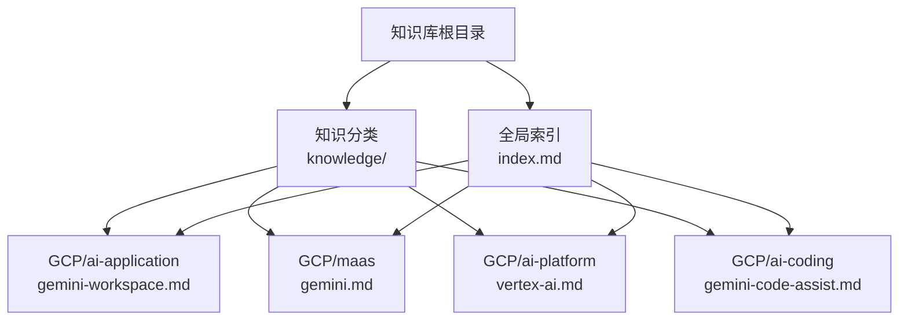
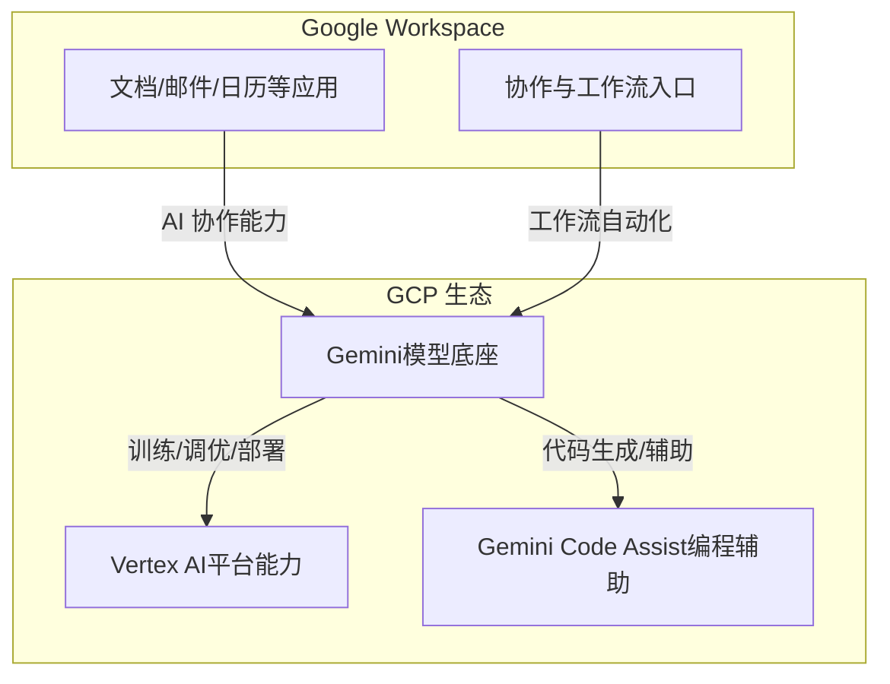
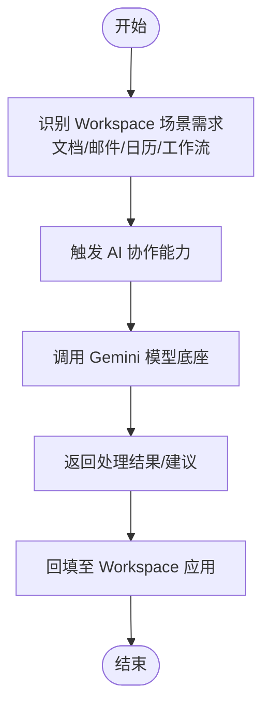
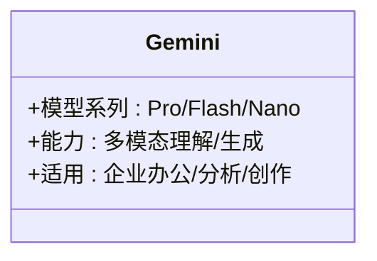
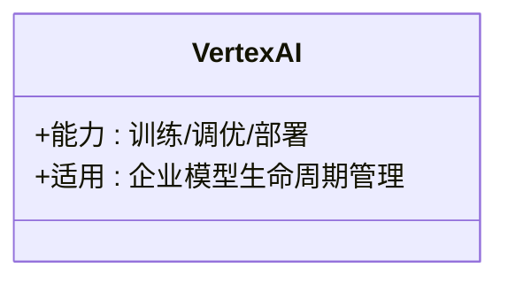
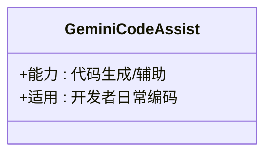
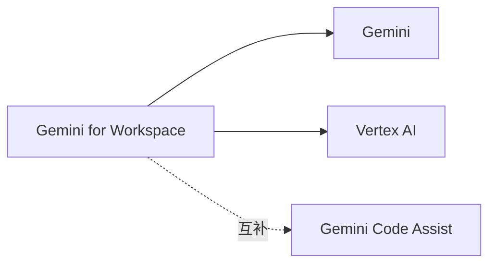

# GCP AI Application（Gemini for Workspace）

<cite>
**本文引用的文件**
- [gemini-workspace.md](file://knowledge/gcp/ai-application/gemini-workspace.md)
- [index.md](file://index.md)
- [README.md](file://README.md)
- [_product_template.md](file://knowledge/_product_template.md)
- [_maas_template.md](file://knowledge/_maas_template.md)
- [gemini.md](file://knowledge/gcp/maas/gemini.md)
- [vertex-ai.md](file://knowledge/gcp/ai-platform/vertex-ai.md)
- [gemini-code-assist.md](file://knowledge/gcp/ai-coding/gemini-code-assist.md)
</cite>

## 目录
1. [简介](#简介)
2. [项目结构](#项目结构)
3. [核心组件](#核心组件)
4. [架构总览](#架构总览)
5. [详细组件分析](#详细组件分析)
6. [依赖关系分析](#依赖关系分析)
7. [性能考量](#性能考量)
8. [故障排查指南](#故障排查指南)
9. [结论](#结论)
10. [附录](#附录)

## 简介
本文件围绕 GCP AI Application（Gemini for Workspace）进行系统化梳理，结合仓库现有知识条目，从产品定位、与 Google Workspace 的整合、与 GCP 生态（Vertex AI、Gemini、Gemini Code Assist）的关系出发，构建面向企业办公场景的应用价值、集成能力与安全特性的说明框架。由于当前仓库中 Gemini for Workspace 的条目尚处于草稿状态，本文以现有信息为基础，补充概念性说明与可视化表达，帮助读者建立整体认知。

## 项目结构
该知识库采用“全局索引 + 分类知识”的组织方式，Gemini for Workspace 在全局索引中被列为 GCP 的 AI App 之一，与 Vertex AI、Gemini、Gemini Code Assist 等共同构成 GCP 的 AI 能力矩阵。

**图表来源**
- [index.md:36-42](file://index.md#L36-L42)
- [gemini-workspace.md:1-9](file://knowledge/gcp/ai-application/gemini-workspace.md#L1-L9)
- [gemini.md:1-9](file://knowledge/gcp/maas/gemini.md#L1-L9)
- [vertex-ai.md:1-9](file://knowledge/gcp/ai-platform/vertex-ai.md#L1-L9)
- [gemini-code-assist.md:1-9](file://knowledge/gcp/ai-coding/gemini-code-assist.md#L1-L9)

**章节来源**
- [index.md:1-69](file://index.md#L1-L69)
- [README.md:1-20](file://README.md#L1-L20)

## 核心组件
- Gemini for Workspace（GCP AI Application）
  - 定位：Google Workspace 内置 AI 协作助手（草稿）
  - 作用：在 Workspace 办公场景中提供 AI 协作能力，提升文档处理、数据分析、协作与工作流自动化效率
- Gemini（GCP MaaS）
  - 定位：Google 自研多模态大模型系列（Pro/Flash/Nano）
  - 作用：为 Workspace AI 助手提供基础模型能力支撑
- Vertex AI（GCP AI Platform）
  - 定位：GCP 机器学习平台，覆盖训练、调优、部署全流程
  - 作用：为 Workspace AI 助手提供模型训练与部署能力
- Gemini Code Assist（GCP AI Coding）
  - 定位：Google AI 编程助手（原 Duet AI for Developers）
  - 作用：面向开发者场景的代码生成与辅助能力，与 Workspace 文档/协作形成互补

**章节来源**
- [gemini-workspace.md:1-9](file://knowledge/gcp/ai-application/gemini-workspace.md#L1-L9)
- [gemini.md:1-9](file://knowledge/gcp/maas/gemini.md#L1-L9)
- [vertex-ai.md:1-9](file://knowledge/gcp/ai-platform/vertex-ai.md#L1-L9)
- [gemini-code-assist.md:1-9](file://knowledge/gcp/ai-coding/gemini-code-assist.md#L1-L9)

## 架构总览
下图展示 Gemini for Workspace 在 GCP 生态中的位置与其与 Workspace 的关系。Workspace 作为企业办公入口，Gemini 作为模型底座，Vertex AI 提供训练与部署能力，Gemini Code Assist 作为编程辅助工具，共同构成端到端的企业 AI 应用体系。

**图表来源**
- [gemini-workspace.md:8](file://knowledge/gcp/ai-application/gemini-workspace.md#L8)
- [gemini.md:8](file://knowledge/gcp/maas/gemini.md#L8)
- [vertex-ai.md:8](file://knowledge/gcp/ai-platform/vertex-ai.md#L8)
- [gemini-code-assist.md:8](file://knowledge/gcp/ai-coding/gemini-code-assist.md#L8)

## 详细组件分析

### 组件一：Gemini for Workspace（AI Application）
- 产品定位与价值
  - 作为 Workspace 内置的 AI 协作助手，面向企业办公场景，提供文档处理、数据分析、协作与工作流自动化能力，提升日常办公效率与智能化水平
- 与 Workspace 的整合
  - 通过 Workspace 应用生态无缝接入，用户可在文档、邮件、日历等常用工具中直接触发 AI 协作能力
- 与 GCP 生态的关系
  - 以 Gemini 为模型底座，借助 Vertex AI 的训练与部署能力，结合 Gemini Code Assist 的编程辅助，形成完整的 AI 应用闭环
- 使用建议
  - 从文档处理与协作入手，逐步扩展到工作流自动化场景
  - 结合企业合规与数据安全要求，制定权限与审计策略

**图表来源**
- [gemini-workspace.md:8](file://knowledge/gcp/ai-application/gemini-workspace.md#L8)
- [gemini.md:8](file://knowledge/gcp/maas/gemini.md#L8)
- [vertex-ai.md:8](file://knowledge/gcp/ai-platform/vertex-ai.md#L8)
- [gemini-code-assist.md:8](file://knowledge/gcp/ai-coding/gemini-code-assist.md#L8)

**章节来源**
- [gemini-workspace.md:1-9](file://knowledge/gcp/ai-application/gemini-workspace.md#L1-L9)

### 组件二：Gemini（MaaS）
- 产品定位与价值
  - 多模态大模型系列（Pro/Flash/Nano），为企业提供从高阶推理到轻量处理的多样化模型选择
- 关键能力
  - 支持文本、图像、多模态输入输出
  - 面向企业级场景的上下文理解与生成能力
- 适用场景
  - 文档摘要与提取、多模态内容理解、跨语言翻译与生成等

**图表来源**
- [gemini.md:8](file://knowledge/gcp/maas/gemini.md#L8)

**章节来源**
- [gemini.md:1-9](file://knowledge/gcp/maas/gemini.md#L1-L9)

### 组件三：Vertex AI（AI Platform）
- 产品定位与价值
  - 提供从训练、调优到部署的全链路机器学习平台能力，支撑 Workspace AI 助手的模型训练与上线
- 关键能力
  - 算法与数据工程、模型训练与调优、托管推理服务、可观测性与治理
- 适用场景
  - 企业定制化模型训练与部署、大规模推理服务

**图表来源**
- [vertex-ai.md:8](file://knowledge/gcp/ai-platform/vertex-ai.md#L8)

**章节来源**
- [vertex-ai.md:1-9](file://knowledge/gcp/ai-platform/vertex-ai.md#L1-L9)

### 组件四：Gemini Code Assist（AI Coding）
- 产品定位与价值
  - 面向开发者的 AI 编程助手，提供代码生成、补全与辅助能力
- 关键能力
  - 代码生成与重构、注释生成、错误检测与修复建议
- 适用场景
  - 快速原型开发、代码质量提升、跨语言/跨框架辅助

**图表来源**
- [gemini-code-assist.md:8](file://knowledge/gcp/ai-coding/gemini-code-assist.md#L8)

**章节来源**
- [gemini-code-assist.md:1-9](file://knowledge/gcp/ai-coding/gemini-code-assist.md#L1-L9)

## 依赖关系分析
- 产品层级关系
  - Gemini for Workspace 作为应用层，依赖 Gemini（模型底座）与 Vertex AI（平台能力）
  - Gemini Code Assist 作为独立应用，与 Workspace 文档/协作形成互补
- 数据与能力流
  - Workspace 场景需求 → AI 协作触发 → 调用 Gemini 模型 → 返回结果并回填 Workspace
  - Vertex AI 负责模型训练与部署，保障模型能力持续演进

**图表来源**
- [gemini-workspace.md:8](file://knowledge/gcp/ai-application/gemini-workspace.md#L8)
- [gemini.md:8](file://knowledge/gcp/maas/gemini.md#L8)
- [vertex-ai.md:8](file://knowledge/gcp/ai-platform/vertex-ai.md#L8)
- [gemini-code-assist.md:8](file://knowledge/gcp/ai-coding/gemini-code-assist.md#L8)

**章节来源**
- [index.md:36-42](file://index.md#L36-L42)

## 性能考量
- 模型响应延迟与吞吐
  - 依据 Workspace 场景的交互频率与并发需求，合理选择 Gemini 模型系列（如 Flash/Nano 用于低延迟场景，Pro 用于高复杂度任务）
- 平台能力与弹性
  - 通过 Vertex AI 的托管推理与弹性扩缩容能力，保障高峰时段的服务稳定性
- 数据与网络
  - 在企业内网或受限网络环境下，评估数据传输与本地化部署的可行性

## 故障排查指南
- 常见问题与处理思路
  - 触发无响应：检查 Workspace 与 GCP 的连通性、权限配置与配额限制
  - 结果质量不稳定：调整提示词策略、切换模型系列或启用缓存策略
  - 工作流中断：核对 Workspace 集成回调地址、鉴权与审计日志
- 配置与最佳实践
  - 建立最小可行配置清单（权限、网络、配额、日志）
  - 制定变更与回滚流程，确保生产环境稳定

## 结论
Gemini for Workspace 作为 GCP 在 Workspace 生态中的 AI 应用入口，具备与 Workspace 深度整合、面向企业办公场景的潜力。依托 Gemini 的多模态能力与 Vertex AI 的平台能力，可为企业提供从文档处理、数据分析到协作与工作流自动化的综合解决方案。建议以渐进式方式落地，结合企业合规与安全要求，持续优化模型与平台配置。

## 附录
- 模板参考
  - 产品模板：用于规范产品定位、适用边界、配置与最佳实践的撰写
  - MaaS 模板：用于模型系列的能力与限制、适用场景的标准化描述
- 使用建议
  - 以文档处理与协作为切入点，逐步扩展到工作流自动化
  - 结合 Gemini Code Assist 提升开发效率，形成“文档+代码”的双轮驱动

**章节来源**
- [_product_template.md:1-62](file://knowledge/_product_template.md#L1-L62)
- [_maas_template.md:1-65](file://knowledge/_maas_template.md#L1-L65)