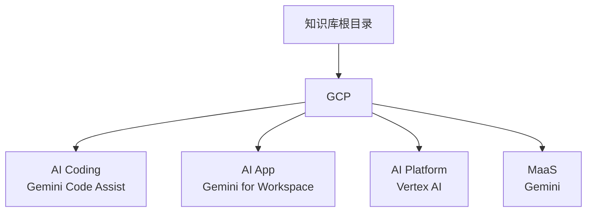
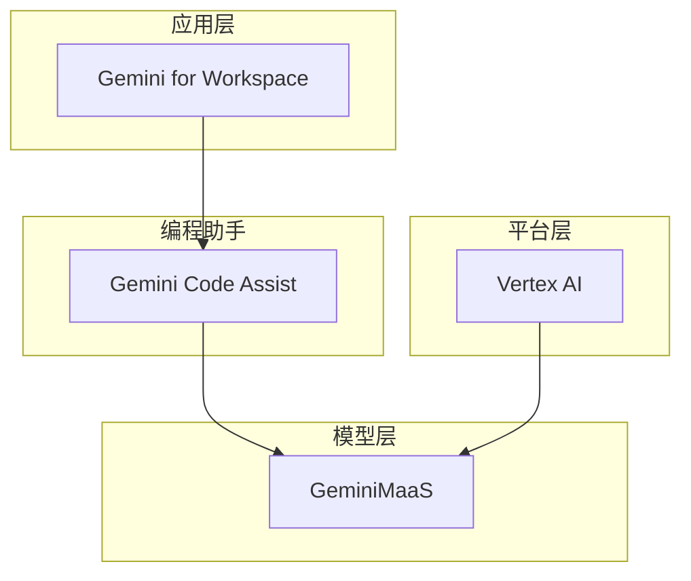
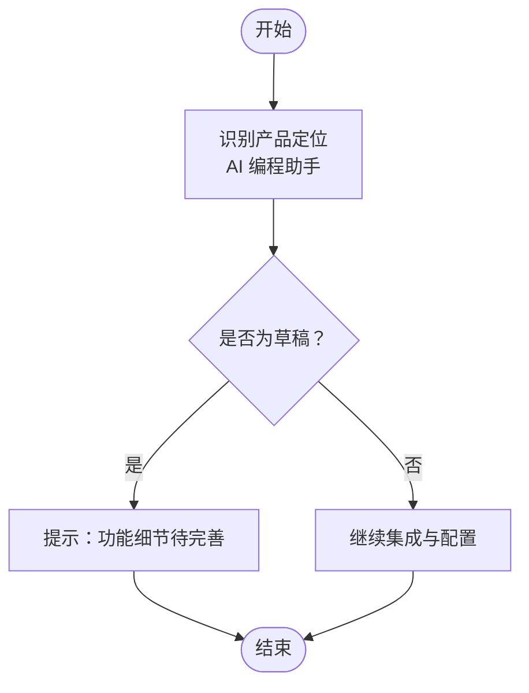
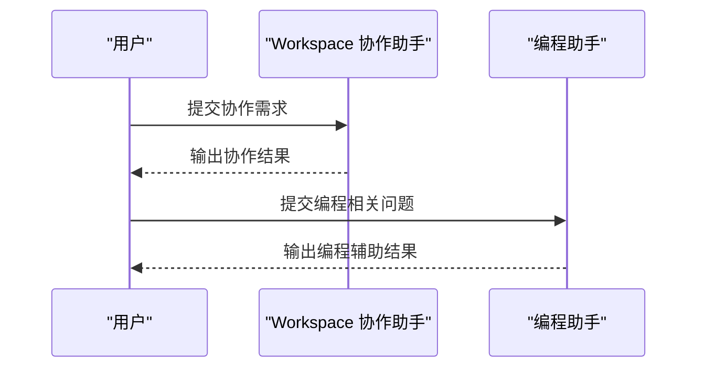
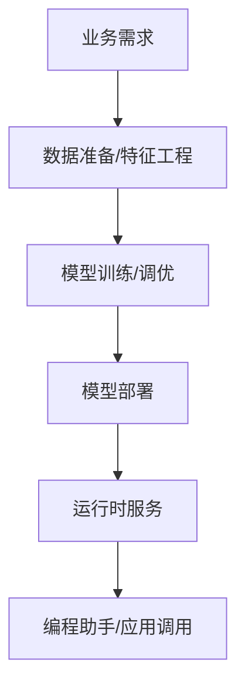
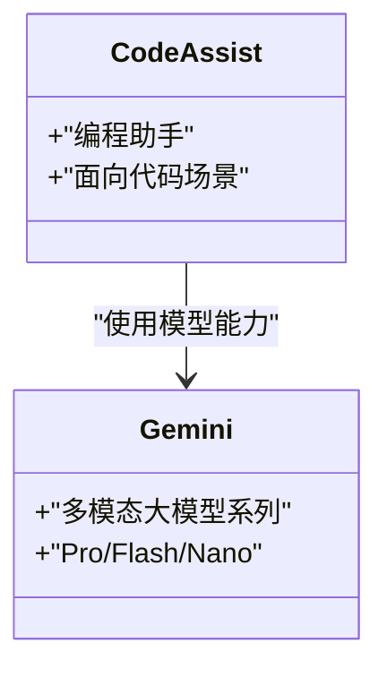
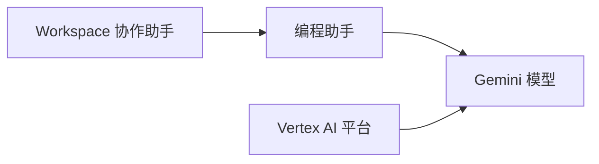
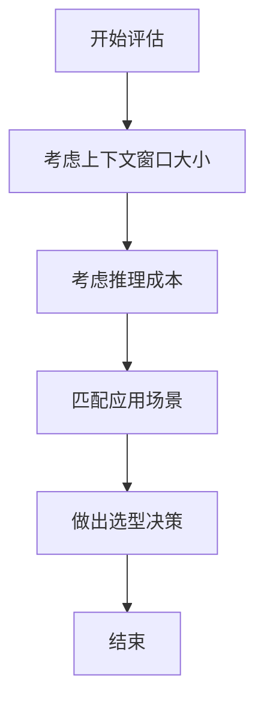

# GCP AI Coding（Gemini Code Assist）

<cite>
**本文引用的文件**
- [gemini-code-assist.md](file://knowledge/gcp/ai-coding/gemini-code-assist.md)
- [index.md](file://index.md)
- [20260420.md](file://archive/20260420.md)
- [gemini-workspace.md](file://knowledge/gcp/ai-application/gemini-workspace.md)
- [vertex-ai.md](file://knowledge/gcp/ai-platform/vertex-ai.md)
- [gemini.md](file://knowledge/gcp/maas/gemini.md)
</cite>

## 目录
1. [简介](#简介)
2. [项目结构](#项目结构)
3. [核心组件](#核心组件)
4. [架构总览](#架构总览)
5. [详细组件分析](#详细组件分析)
6. [依赖关系分析](#依赖关系分析)
7. [性能考量](#性能考量)
8. [故障排查指南](#故障排查指南)
9. [结论](#结论)
10. [附录](#附录)

## 简介
本文件围绕 GCP AI Coding（Gemini Code Assist）进行系统化整理与说明，目标是帮助读者快速理解该产品的定位、能力边界、与同类工具的差异、在不同开发环境中的集成路径、以及在企业开发流程中的应用价值。当前仓库中关于 Gemini Code Assist 的直接技术细节较少，本文在不臆造信息的前提下，基于现有知识库条目进行归纳与扩展，并提供可追溯的来源。

## 项目结构
本知识库采用“厂商-产品类别-具体产品”的层级组织方式，Gemini Code Assist 属于 GCP 的 AI Coding 类别，位于如下路径：
- knowledge/gcp/ai-coding/gemini-code-assist.md

同时，GCP 的相关生态包括：
- AI 应用：Gemini for Workspace
- 平台：Vertex AI
- MaaS：Gemini 系列模型

这些条目在全局索引中有明确映射，便于交叉检索与对比。

**章节来源**
- [index.md:36-41](file://index.md#L36-L41)
- [gemini-code-assist.md:1-9](file://knowledge/gcp/ai-coding/gemini-code-assist.md#L1-L9)
- [gemini-workspace.md:1-9](file://knowledge/gcp/ai-application/gemini-workspace.md#L1-L9)
- [vertex-ai.md:1-9](file://knowledge/gcp/ai-platform/vertex-ai.md#L1-L9)
- [gemini.md:1-9](file://knowledge/gcp/maas/gemini.md#L1-L9)

## 核心组件
根据现有资料，Gemini Code Assist 的核心定位与关联组件如下：
- 定位：Google AI 编程助手（原 Duet AI for Developers）
- 关联产品：
  - Gemini for Workspace：Workspace 内置 AI 协作助手
  - Vertex AI：GCP 机器学习平台，覆盖训练、调优、部署全流程
  - Gemini（MaaS）：GCP 自研多模态大模型系列（Pro/Flash/Nano）

这些组件共同构成 GCP 在“AI 编程”与“AI 平台/模型服务”层面的能力闭环。

**章节来源**
- [gemini-code-assist.md:8](file://knowledge/gcp/ai-coding/gemini-code-assist.md#L8)
- [gemini-workspace.md:8](file://knowledge/gcp/ai-application/gemini-workspace.md#L8)
- [vertex-ai.md:8](file://knowledge/gcp/ai-platform/vertex-ai.md#L8)
- [gemini.md:8](file://knowledge/gcp/maas/gemini.md#L8)

## 架构总览
从产品形态看，Gemini Code Assist 可视为面向“编程场景”的 AI 助手，通常与以下层次协同：
- 上层应用：如 Gemini for Workspace（协作与工作流）
- 平台层：Vertex AI（训练/微调/部署）
- 模型层：Gemini（基础模型能力）

说明
- 该图为概念性架构示意，用于帮助理解产品间的角色分工与协作方向。
- 实际集成方式需结合各产品官方文档与当前仓库未包含的技术细节。

## 详细组件分析

### 组件一：Gemini Code Assist（编程助手）
- 定位与状态：作为 GCP 的 AI 编程助手，当前仓库标注为草稿状态，强调其“原 Duet AI for Developers”的历史定位。
- 能力边界：仓库未提供具体功能清单或 API 使用细节，因此无法展开代码生成/补全能力的实现细节。
- 集成与配置：仓库未提供集成步骤与配置项，建议以官方文档为准。

**章节来源**
- [gemini-code-assist.md:1-9](file://knowledge/gcp/ai-coding/gemini-code-assist.md#L1-L9)

### 组件二：Gemini for Workspace（协作助手）
- 定位：Workspace 内置 AI 协作助手，强调“协作”场景下的 AI 辅助能力。
- 与编程的关系：可作为“非代码”场景的 AI 协作入口，与编程助手形成互补。

**章节来源**
- [gemini-workspace.md:8](file://knowledge/gcp/ai-application/gemini-workspace.md#L8)

### 组件三：Vertex AI（平台）
- 定位：覆盖训练、调优、部署全流程的机器学习平台。
- 与编程助手的关系：平台层能力可为编程助手提供模型训练/微调/部署支撑，或作为企业内部 AI 能力的基础设施。

**章节来源**
- [vertex-ai.md:8](file://knowledge/gcp/ai-platform/vertex-ai.md#L8)

### 组件四：Gemini（MaaS）
- 定位：GCP 自研多模态大模型系列（Pro/Flash/Nano），作为底层模型能力来源。
- 与编程助手的关系：编程助手可基于 Gemini 系列模型提供对话、推理、代码生成等能力。

**章节来源**
- [gemini.md:8](file://knowledge/gcp/maas/gemini.md#L8)

## 依赖关系分析
从现有条目可见，GCP 的 AI 编程相关能力由“应用层（Workspace）—平台层（Vertex AI）—模型层（Gemini）—编程助手（Code Assist）”构成的链条支撑。其中：
- 编程助手依赖模型层的通用能力；
- 平台层负责模型生命周期管理；
- 应用层提供协作与工作流入口。

**章节来源**
- [index.md:36-41](file://index.md#L36-L41)
- [gemini-workspace.md:8](file://knowledge/gcp/ai-application/gemini-workspace.md#L8)
- [vertex-ai.md:8](file://knowledge/gcp/ai-platform/vertex-ai.md#L8)
- [gemini.md:8](file://knowledge/gcp/maas/gemini.md#L8)

## 性能考量
- 上下文窗口与推理成本：仓库中存在关于上下文窗口大小与推理成本的讨论，可作为选择模型或场景的参考维度之一。
- 适用场景：在 Agent 编程与长文档分析等场景中，上下文窗口较大的模型具有明显优势。

**章节来源**
- [20260420.md:46-53](file://archive/20260420.md#L46-L53)

## 故障排查指南
- 状态确认：当前仓库中 Gemini Code Assist 与相关产品均标注为草稿状态，建议在集成前关注官方最新发布信息与变更日志。
- 文档一致性：若遇到功能描述与实际行为不一致的情况，请优先参考官方文档与仓库中“最后更新”时间较新的条目。

**章节来源**
- [gemini-code-assist.md:3](file://knowledge/gcp/ai-coding/gemini-code-assist.md#L3)
- [gemini-workspace.md:3](file://knowledge/gcp/ai-application/gemini-workspace.md#L3)
- [vertex-ai.md:3](file://knowledge/gcp/ai-platform/vertex-ai.md#L3)
- [gemini.md:3](file://knowledge/gcp/maas/gemini.md#L3)

## 结论
- Gemini Code Assist 在本知识库中被定位为 GCP 的 AI 编程助手，当前仓库未包含其具体功能、API 与集成细节。
- 其与 Gemini for Workspace、Vertex AI、Gemini（MaaS）共同构成 GCP 在“协作—平台—模型—编程助手”的能力体系。
- 对于企业应用，建议结合自身场景（如 Agent 编程、长文档分析、协作效率提升）评估是否引入该能力，并持续跟踪官方文档与仓库更新。

## 附录
- 术语说明
  - MaaS：Model as a Service，模型即服务
  - Agent 编程：具备代理式自动编程能力的场景
- 参考来源
  - 全局索引：GCP 产品分类与映射
  - 仓库内草稿状态条目：用于了解当前可用信息范围

**章节来源**
- [index.md:36-41](file://index.md#L36-L41)
- [gemini-code-assist.md:1-9](file://knowledge/gcp/ai-coding/gemini-code-assist.md#L1-L9)
- [gemini-workspace.md:1-9](file://knowledge/gcp/ai-application/gemini-workspace.md#L1-L9)
- [vertex-ai.md:1-9](file://knowledge/gcp/ai-platform/vertex-ai.md#L1-L9)
- [gemini.md:1-9](file://knowledge/gcp/maas/gemini.md#L1-L9)