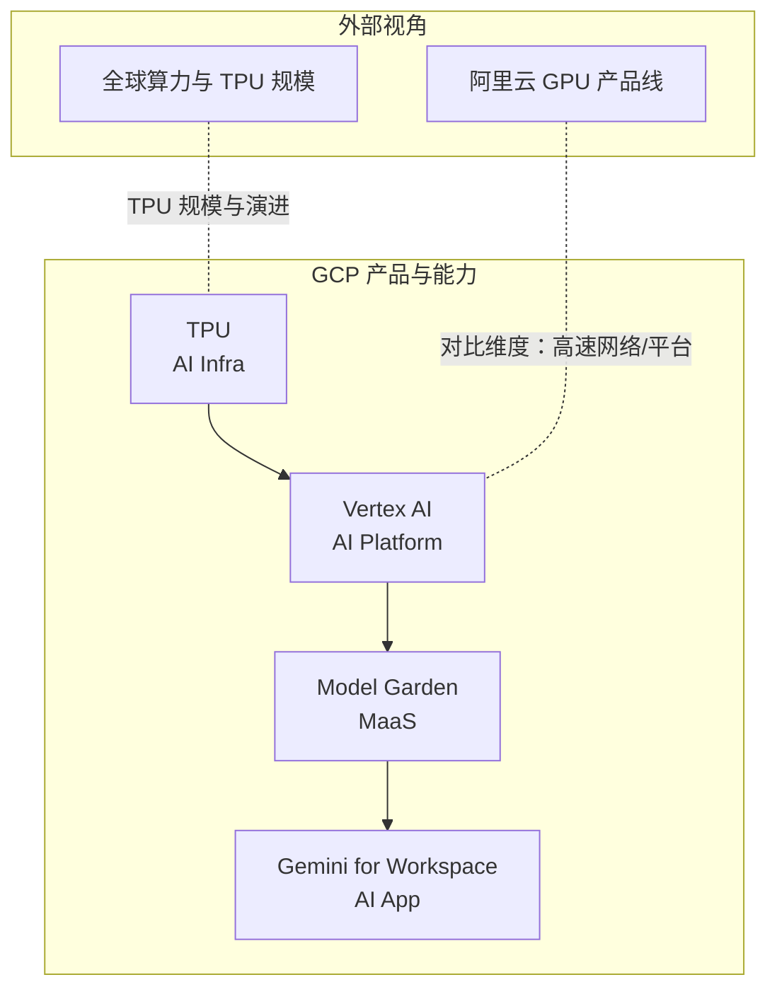
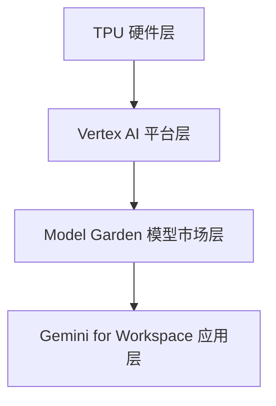
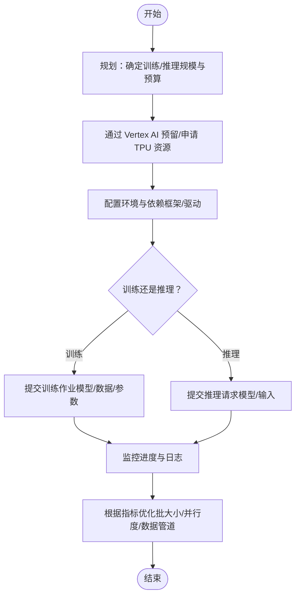
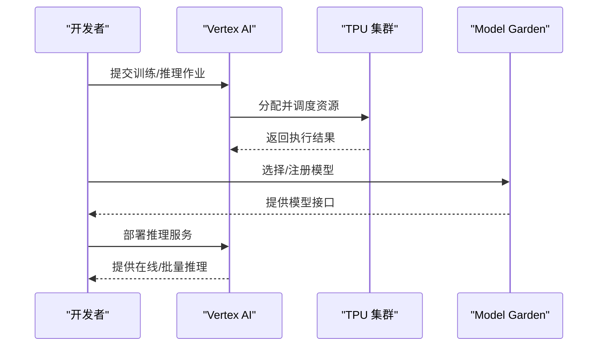
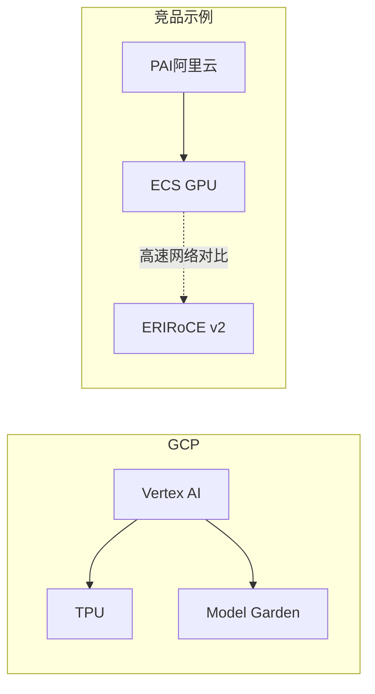
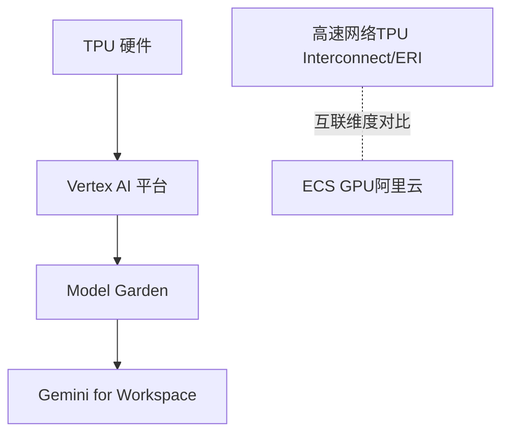

# GCP AI Infrastructure（TPU）

<cite>
**本文引用的文件**
- [tpu.md](file://knowledge/gcp/ai-infra/tpu.md)
- [index.md](file://index.md)
- [general_intro.md](file://knowledge/anthropic/general_intro.md)
- [gpu-product-line.md](file://knowledge/alibaba-cloud/ai-infra/gpu-product-line.md)
- [vertex-ai.md](file://knowledge/gcp/ai-platform/vertex-ai.md)
- [gemini.md](file://knowledge/gcp/maas/gemini.md)
- [gemini-workspace.md](file://knowledge/gcp/ai-application/gemini-workspace.md)
</cite>

## 目录
1. [简介](#简介)
2. [项目结构](#项目结构)
3. [核心组件](#核心组件)
4. [架构概览](#架构概览)
5. [详细组件分析](#详细组件分析)
6. [依赖分析](#依赖分析)
7. [性能考虑](#性能考虑)
8. [故障排查指南](#故障排查指南)
9. [结论](#结论)
10. [附录](#附录)

## 简介
本文件聚焦于 GCP 的 AI 基础设施与 TPU（张量处理单元）相关知识，结合仓库现有材料，系统梳理 GCP 在机器学习训练与推理中的定位、与 Vertex AI 平台的关系、与 MaaS（模型即服务）生态的协同，以及在不同规模 AI 项目中的选型考量。同时，基于仓库内已有信息，对 TPU 的技术背景、硬件规格与软件栈支持进行概念性说明，并给出部署与优化的实践建议。

## 项目结构
GCP AI 基础设施相关内容在知识库中以主题化文件组织，主要分布在以下模块：
- AI Infra：GCP 的 TPU 产品定位与基础信息
- AI Platform：Vertex AI 平台能力与使用场景
- MaaS：Gemini 系列模型与模型市场（Model Garden）
- AI Application：Gemini for Workspace 等应用集成
- 竞品与宏观背景：阿里云 GPU 产品线与全球算力布局（含 TPU 的对比维度）

**图表来源**
- [index.md:36-41](file://index.md#L36-L41)
- [tpu.md:1-9](file://knowledge/gcp/ai-infra/tpu.md#L1-L9)
- [vertex-ai.md:1-9](file://knowledge/gcp/ai-platform/vertex-ai.md#L1-L9)
- [gemini.md:1-9](file://knowledge/gcp/maas/gemini.md#L1-L9)
- [gemini-workspace.md:1-9](file://knowledge/gcp/ai-application/gemini-workspace.md#L1-L9)
- [gpu-product-line.md:95-102](file://knowledge/alibaba-cloud/ai-infra/gpu-product-line.md#L95-L102)
- [general_intro.md:97-108](file://knowledge/anthropic/general_intro.md#L97-L108)

**章节来源**
- [index.md:36-41](file://index.md#L36-L41)
- [tpu.md:1-9](file://knowledge/gcp/ai-infra/tpu.md#L1-L9)
- [vertex-ai.md:1-9](file://knowledge/gcp/ai-platform/vertex-ai.md#L1-L9)
- [gemini.md:1-9](file://knowledge/gcp/maas/gemini.md#L1-L9)
- [gemini-workspace.md:1-9](file://knowledge/gcp/ai-application/gemini-workspace.md#L1-L9)
- [gpu-product-line.md:95-102](file://knowledge/alibaba-cloud/ai-infra/gpu-product-line.md#L95-L102)
- [general_intro.md:97-108](file://knowledge/anthropic/general_intro.md#L97-L108)

## 核心组件
- TPU（AI Infra）：GCP 自研 AI 加速芯片，定位为机器学习训练与推理的专用硬件基础设施。
- Vertex AI（AI Platform）：GCP 的机器学习平台，覆盖训练、调优、部署全流程，与 TPU 硬件形成软硬协同。
- Model Garden（MaaS）：GCP 模型市场，统一访问 Google 及第三方模型，支撑推理与应用集成。
- Gemini for Workspace（AI App）：面向 Workspace 场景的 AI 协作助手，体现 MaaS 与应用的结合。

上述组件在知识库中均以“Draft”状态呈现，表明当前为草稿阶段，建议在正式使用前关注官方文档与最新发布信息。

**章节来源**
- [tpu.md:8](file://knowledge/gcp/ai-infra/tpu.md#L8)
- [vertex-ai.md:7](file://knowledge/gcp/ai-platform/vertex-ai.md#L7)
- [gemini.md:8](file://knowledge/gcp/maas/gemini.md#L8)
- [gemini-workspace.md:8](file://knowledge/gcp/ai-application/gemini-workspace.md#L8)

## 架构概览
从仓库现有信息可以勾勒出 GCP AI 基础设施的宏观关系：TPU 作为底层硬件，Vertex AI 作为平台层，Model Garden 作为模型市场层，Gemini for Workspace 作为应用层。整体呈现“硬件—平台—模型—应用”的分层协同。

**图表来源**
- [index.md:36-41](file://index.md#L36-L41)
- [vertex-ai.md:7](file://knowledge/gcp/ai-platform/vertex-ai.md#L7)
- [gemini.md:8](file://knowledge/gcp/maas/gemini.md#L8)
- [gemini-workspace.md:8](file://knowledge/gcp/ai-application/gemini-workspace.md#L8)

## 详细组件分析

### TPU（AI Infra）
- 定位：GCP 自研 AI 加速芯片，用于机器学习训练与推理。
- 仓库现状：文件简要描述了厂商、类别与状态（Draft），未包含具体技术细节与规格。
- 与 Vertex AI 的关系：TPU 作为底层硬件，通常由 Vertex AI 统一调度与管理，实现从资源编排到模型训练/推理的端到端流程。
- 与 MaaS 的关系：TPU 为模型运行提供高性能算力，Model Garden 提供模型选择与访问入口，二者协同支撑推理与应用。

**图表来源**
- [vertex-ai.md:7](file://knowledge/gcp/ai-platform/vertex-ai.md#L7)
- [tpu.md:8](file://knowledge/gcp/ai-infra/tpu.md#L8)

**章节来源**
- [tpu.md:1-9](file://knowledge/gcp/ai-infra/tpu.md#L1-L9)
- [vertex-ai.md:7](file://knowledge/gcp/ai-platform/vertex-ai.md#L7)

### Vertex AI（AI Platform）
- 定位：GCP 机器学习平台，覆盖训练、调优、部署全流程。
- 与 TPU 的关系：作为资源编排与作业管理平台，负责将训练/推理任务调度到 TPU 硬件上执行。
- 与 MaaS 的关系：通过 Model Garden 统一接入模型，简化模型选择与部署流程。

**图表来源**
- [vertex-ai.md:7](file://knowledge/gcp/ai-platform/vertex-ai.md#L7)
- [gemini.md:8](file://knowledge/gcp/maas/gemini.md#L8)

**章节来源**
- [vertex-ai.md:1-9](file://knowledge/gcp/ai-platform/vertex-ai.md#L1-L9)
- [gemini.md:1-9](file://knowledge/gcp/maas/gemini.md#L1-L9)

### Model Garden（MaaS）
- 定位：GCP 模型市场，统一访问 Google 及第三方模型。
- 与 TPU/Vertex AI 的关系：在平台上注册与管理模型，借助 TPU 实现高效推理与部署。

**章节来源**
- [gemini.md:8](file://knowledge/gcp/maas/gemini.md#L8)

### Gemini for Workspace（AI App）
- 定位：Google Workspace 内置 AI 协作助手。
- 与 TPU/Vertex AI 的关系：通过 Vertex AI 部署推理服务，背后可能使用 Model Garden 中的模型，从而受益于 TPU 的高性能算力。

**章节来源**
- [gemini-workspace.md:8](file://knowledge/gcp/ai-application/gemini-workspace.md#L8)

### 与竞品的差异化与选型考量
- 高速网络维度：仓库中提及“TPU Interconnect”，与阿里云 ECS GPU 的 ERI（RoCE v2）形成对比维度，反映不同厂商在互联网络方面的差异化设计。
- 平台协同：阿里云 GPU 产品线将“AI 平台（PAI）”与“虚拟化 GPU（ECS GPU）/裸金属（灵骏）”进行组合使用，体现平台与硬件的协同策略。GCP 方向则以 Vertex AI 为核心平台，结合 TPU 硬件实现一体化调度。

**图表来源**
- [gpu-product-line.md:95-102](file://knowledge/alibaba-cloud/ai-infra/gpu-product-line.md#L95-L102)

**章节来源**
- [gpu-product-line.md:95-102](file://knowledge/alibaba-cloud/ai-infra/gpu-product-line.md#L95-L102)

## 依赖分析
- 组件耦合：TPU 与 Vertex AI 存在强耦合关系，前者提供算力，后者负责资源编排与作业管理；Model Garden 与 Vertex AI 在模型生命周期管理上存在协作关系；Gemini for Workspace 依赖 Vertex AI 的推理服务能力。
- 外部依赖：仓库中引用了“TPU Interconnect”“ERI（RoCE v2）”等网络互联维度，体现不同厂商在高速互联系统上的差异化设计。
- 规模与演进：仓库中记录了“超 1 GW，百万颗 TPU”“下一代 TPU”等信息，反映 GCP 在 TPU 规模与演进上的规划。

**图表来源**
- [general_intro.md:97-108](file://knowledge/anthropic/general_intro.md#L97-L108)
- [gpu-product-line.md:95-102](file://knowledge/alibaba-cloud/ai-infra/gpu-product-line.md#L95-L102)

**章节来源**
- [general_intro.md:97-108](file://knowledge/anthropic/general_intro.md#L97-L108)
- [gpu-product-line.md:95-102](file://knowledge/alibaba-cloud/ai-infra/gpu-product-line.md#L95-L102)

## 性能考虑
- 硬件与平台协同：通过 Vertex AI 统一调度 TPU 资源，可提升资源利用率与作业吞吐。
- 网络互联：仓库中对比了“TPU Interconnect”与“ERI（RoCE v2）”，提示在大规模分布式训练/推理中，互联带宽与延迟对整体性能影响显著。
- 规模化部署：仓库记录了“超 1 GW，百万颗 TPU”的规模信息，表明 GCP 在 TPU 规模化部署方面具备较强能力，有助于支撑更大规模的训练与推理任务。

**章节来源**
- [gpu-product-line.md:95-102](file://knowledge/alibaba-cloud/ai-infra/gpu-product-line.md#L95-L102)
- [general_intro.md:97-108](file://knowledge/anthropic/general_intro.md#L97-L108)

## 故障排查指南
- 资源与权限：确认 TPU 资源是否已在项目中启用并具备相应权限。
- 作业状态：通过 Vertex AI 查看作业状态与日志，定位失败原因。
- 网络连通性：若涉及多机或多卡训练，检查互联网络配置（如 TPU Interconnect）是否正常。
- 模型与版本：确保 Model Garden 中的模型版本与推理接口一致，避免因版本不匹配导致的错误。

[本节为通用指导，未直接分析具体文件，故无“章节来源”]

## 结论
GCP 的 TPU 作为自研 AI 加速芯片，与 Vertex AI 平台、Model Garden 以及 Gemini for Workspace 形成了从硬件到应用的完整生态链。仓库现有材料表明，GCP 在 TPU 规模化部署与平台化调度方面具备优势，并通过“TPU Interconnect”等互联特性提升性能。对于不同规模的 AI 项目，建议结合 Vertex AI 的资源编排能力与 Model Garden 的模型管理能力，制定训练与推理的部署策略。

[本节为总结性内容，未直接分析具体文件，故无“章节来源”]

## 附录
- 相关文件索引：可在全局索引中找到 GCP 的 AI Infra、AI Platform、MaaS、AI App 的入口链接，便于进一步查阅。

**章节来源**
- [index.md:36-41](file://index.md#L36-L41)