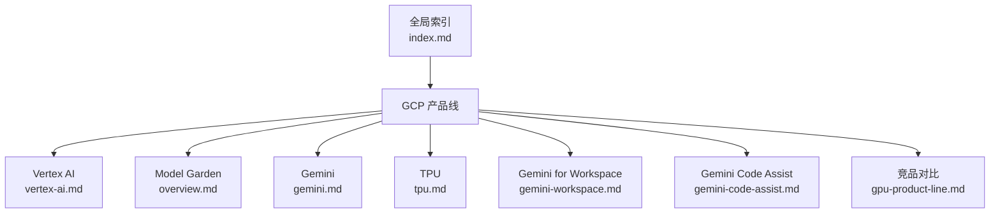
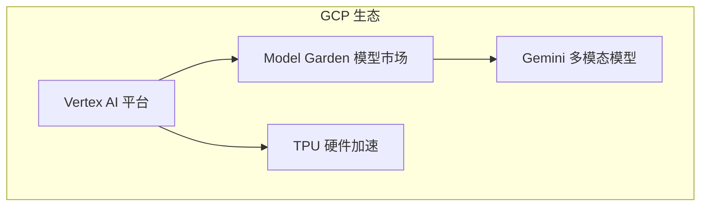
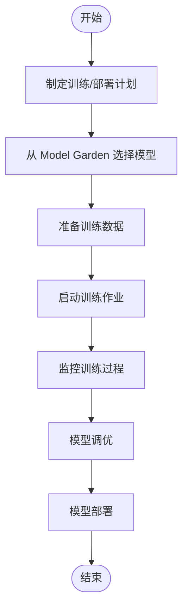
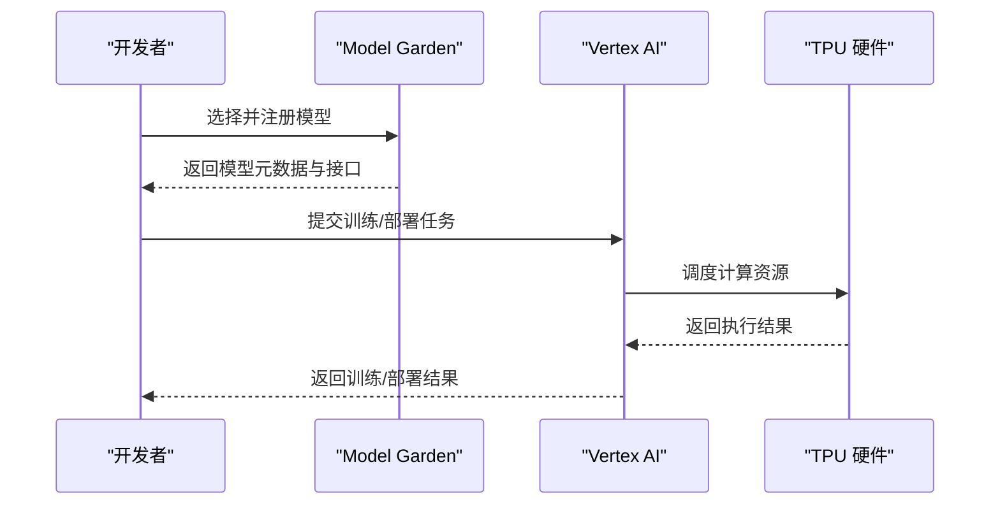
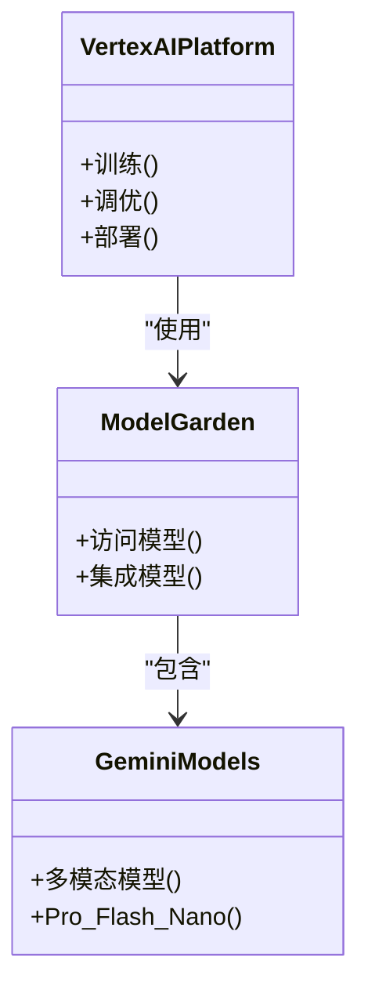
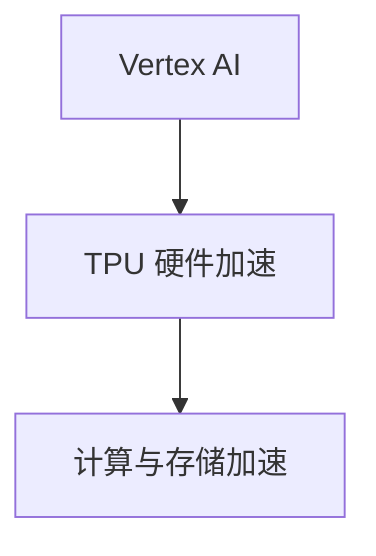
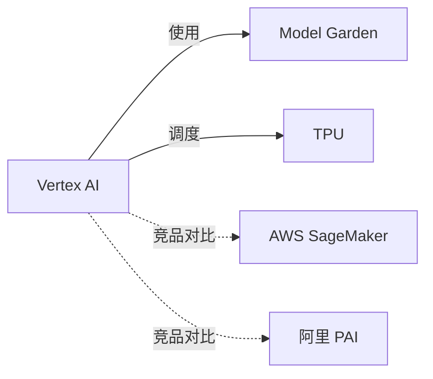

# GCP AI Platform（Vertex AI）

<cite>
**本文引用的文件**
- [vertex-ai.md](file://knowledge/gcp/ai-platform/vertex-ai.md)
- [tpu.md](file://knowledge/gcp/ai-infra/tpu.md)
- [gemini.md](file://knowledge/gcp/maas/gemini.md)
- [overview.md](file://knowledge/gcp/maas/overview.md)
- [index.md](file://index.md)
- [gemini-workspace.md](file://knowledge/gcp/ai-application/gemini-workspace.md)
- [gemini-code-assist.md](file://knowledge/gcp/ai-coding/gemini-code-assist.md)
- [ai_knowledge_20260423.md](file://archive/ai_knowledge_20260423.md)
- [gpu-product-line.md](file://knowledge/alibaba-cloud/ai-infra/gpu-product-line.md)
</cite>

## 目录
1. [简介](#简介)
2. [项目结构](#项目结构)
3. [核心组件](#核心组件)
4. [架构总览](#架构总览)
5. [详细组件分析](#详细组件分析)
6. [依赖关系分析](#依赖关系分析)
7. [性能考量](#性能考量)
8. [故障排查指南](#故障排查指南)
9. [结论](#结论)
10. [附录](#附录)

## 简介
本文件围绕 GCP Vertex AI 的定位与能力进行系统化梳理，结合仓库现有资料，重点阐述其作为端到端机器学习平台在“训练、调优、部署”全流程中的角色，并说明与 Vertex AI Model Garden、Gemini 等 GCP MaaS 能力的关系。同时，结合仓库中关于 GCP TPU 的定位，说明硬件加速基础设施在 Vertex AI 生态中的作用。

- Vertex AI 定位为 GCP 机器学习平台，覆盖训练、调优、部署全流程。
- Vertex AI Model Garden 提供统一访问 Google 及第三方模型的能力。
- Gemini 作为 GCP 自研多模态大模型系列，与 Vertex AI 在 MaaS 层协同。

章节来源
- [vertex-ai.md:1-9](file://knowledge/gcp/ai-platform/vertex-ai.md#L1-L9)
- [overview.md:1-9](file://knowledge/gcp/maas/overview.md#L1-L9)
- [gemini.md:1-9](file://knowledge/gcp/maas/gemini.md#L1-L9)

## 项目结构
仓库中与 Vertex AI 相关的知识条目主要分布在以下路径：
- GCP 产品线：Vertex AI、Model Garden、Gemini、TPU、Gemini for Workspace、Gemini Code Assist
- 索引文件：全局索引对 GCP 产品线进行了分类与导航
- 竞品对比：GPU 产品线选型中将 Vertex AI 作为与 AWS SageMaker、阿里 PAI 并列的 AI 平台之一

图表来源
- [index.md:36-41](file://index.md#L36-L41)
- [vertex-ai.md:1-9](file://knowledge/gcp/ai-platform/vertex-ai.md#L1-L9)
- [overview.md:1-9](file://knowledge/gcp/maas/overview.md#L1-L9)
- [gemini.md:1-9](file://knowledge/gcp/maas/gemini.md#L1-L9)
- [tpu.md:1-9](file://knowledge/gcp/ai-infra/tpu.md#L1-L9)
- [gemini-workspace.md:1-9](file://knowledge/gcp/ai-application/gemini-workspace.md#L1-L9)
- [gemini-code-assist.md:1-9](file://knowledge/gcp/ai-coding/gemini-code-assist.md#L1-L9)
- [gpu-product-line.md:11](file://knowledge/alibaba-cloud/ai-infra/gpu-product-line.md#L11)

章节来源
- [index.md:1-69](file://index.md#L1-L69)
- [vertex-ai.md:1-9](file://knowledge/gcp/ai-platform/vertex-ai.md#L1-L9)
- [overview.md:1-9](file://knowledge/gcp/maas/overview.md#L1-L9)
- [gemini.md:1-9](file://knowledge/gcp/maas/gemini.md#L1-L9)
- [tpu.md:1-9](file://knowledge/gcp/ai-infra/tpu.md#L1-L9)
- [gemini-workspace.md:1-9](file://knowledge/gcp/ai-application/gemini-workspace.md#L1-L9)
- [gemini-code-assist.md:1-9](file://knowledge/gcp/ai-coding/gemini-code-assist.md#L1-L9)
- [gpu-product-line.md:11](file://knowledge/alibaba-cloud/ai-infra/gpu-product-line.md#L11)

## 核心组件
- Vertex AI 平台：提供训练、调优、部署的全流程能力，作为 GCP 的机器学习平台。
- Vertex AI Model Garden：统一访问 Google 及第三方模型，便于在 Vertex 环境中选择与集成模型。
- Gemini（多模态大模型系列）：作为 GCP 自研模型，与 Vertex AI 在 MaaS 层协同，支撑多样化的 AI 应用场景。
- TPU：GCP 自研 AI 加速芯片，为 Vertex AI 的训练与推理提供硬件基础。

章节来源
- [vertex-ai.md:7-9](file://knowledge/gcp/ai-platform/vertex-ai.md#L7-L9)
- [overview.md:8](file://knowledge/gcp/maas/overview.md#L8)
- [gemini.md:8](file://knowledge/gcp/maas/gemini.md#L8)
- [tpu.md:8](file://knowledge/gcp/ai-infra/tpu.md#L8)

## 架构总览
下图展示了 Vertex AI 在 GCP 生态中的位置与其相关能力之间的关系：平台层负责训练与部署，MaaS 层提供模型市场与大模型能力，TPU 提供硬件加速。

图表来源
- [vertex-ai.md:7-9](file://knowledge/gcp/ai-platform/vertex-ai.md#L7-L9)
- [overview.md:8](file://knowledge/gcp/maas/overview.md#L8)
- [gemini.md:8](file://knowledge/gcp/maas/gemini.md#L8)
- [tpu.md:8](file://knowledge/gcp/ai-infra/tpu.md#L8)

## 详细组件分析

### Vertex AI 平台
- 定位：GCP 机器学习平台，覆盖训练、调优、部署全流程。
- 与 Vertex AI Model Garden 的关系：通过 Model Garden 统一访问模型，再在 Vertex 环境中进行训练与部署。
- 与 TPU 的关系：借助 TPU 硬件加速提升训练与推理效率。

图表来源
- [vertex-ai.md:7-9](file://knowledge/gcp/ai-platform/vertex-ai.md#L7-L9)
- [overview.md:8](file://knowledge/gcp/maas/overview.md#L8)
- [tpu.md:8](file://knowledge/gcp/ai-infra/tpu.md#L8)

章节来源
- [vertex-ai.md:7-9](file://knowledge/gcp/ai-platform/vertex-ai.md#L7-L9)

### Vertex AI Model Garden
- 定位：统一访问 Google 及第三方模型，便于在 Vertex 环境中进行模型选择与集成。
- 与 Vertex AI 的关系：作为模型市场，为 Vertex 的训练与部署提供模型资源。

图表来源
- [overview.md:8](file://knowledge/gcp/maas/overview.md#L8)
- [vertex-ai.md:7-9](file://knowledge/gcp/ai-platform/vertex-ai.md#L7-L9)
- [tpu.md:8](file://knowledge/gcp/ai-infra/tpu.md#L8)

章节来源
- [overview.md:8](file://knowledge/gcp/maas/overview.md#L8)

### Gemini（多模态大模型）
- 定位：GCP 自研多模态大模型系列（Pro/Flash/Nano），与 Vertex AI 在 MaaS 层协同。
- 与 Vertex AI 的关系：通过 Model Garden 访问与集成，用于训练与部署。

图表来源
- [vertex-ai.md:7-9](file://knowledge/gcp/ai-platform/vertex-ai.md#L7-L9)
- [overview.md:8](file://knowledge/gcp/maas/overview.md#L8)
- [gemini.md:8](file://knowledge/gcp/maas/gemini.md#L8)

章节来源
- [gemini.md:8](file://knowledge/gcp/maas/gemini.md#L8)

### TPU（硬件加速）
- 定位：GCP 自研 AI 加速芯片，为 Vertex AI 的训练与推理提供硬件基础。
- 与 Vertex AI 的关系：作为底层算力资源，支撑 Vertex 的大规模训练与高效推理。

图表来源
- [tpu.md:8](file://knowledge/gcp/ai-infra/tpu.md#L8)
- [vertex-ai.md:7-9](file://knowledge/gcp/ai-platform/vertex-ai.md#L7-L9)

章节来源
- [tpu.md:8](file://knowledge/gcp/ai-infra/tpu.md#L8)

### Gemini for Workspace 与 Gemini Code Assist
- Gemini for Workspace：作为 Google Workspace 内置的 AI 协作助手，体现 GCP 在应用层面的 AI 能力。
- Gemini Code Assist：作为 Google AI 编程助手，面向开发者场景，与 Vertex AI 的开发者工具链形成互补。

章节来源
- [gemini-workspace.md:8](file://knowledge/gcp/ai-application/gemini-workspace.md#L8)
- [gemini-code-assist.md:8](file://knowledge/gcp/ai-coding/gemini-code-assist.md#L8)

## 依赖关系分析
- Vertex AI 与 Model Garden：平台层与模型市场的协作关系，确保模型选择与集成的统一性。
- Vertex AI 与 TPU：平台层对硬件层的调度与利用，以获得更高的训练/推理性能。
- 竞品对比视角：在 GPU 产品线选型中，Vertex AI 与 AWS SageMaker、阿里 PAI 并列为 AI 平台选项之一，体现了其在市场中的定位。

图表来源
- [vertex-ai.md:7-9](file://knowledge/gcp/ai-platform/vertex-ai.md#L7-L9)
- [overview.md:8](file://knowledge/gcp/maas/overview.md#L8)
- [tpu.md:8](file://knowledge/gcp/ai-infra/tpu.md#L8)
- [gpu-product-line.md:11](file://knowledge/alibaba-cloud/ai-infra/gpu-product-line.md#L11)

章节来源
- [gpu-product-line.md:11](file://knowledge/alibaba-cloud/ai-infra/gpu-product-line.md#L11)

## 性能考量
- 硬件加速：TPU 作为 GCP 自研加速芯片，能够显著提升大规模模型训练与推理的性能，是 Vertex AI 算力基础设施的关键组成部分。
- 模型市场：通过 Model Garden 统一访问与集成模型，有助于缩短模型选择与上线周期，间接提升整体效率。
- 开发者工具：Gemini Code Assist 等工具可辅助开发者快速构建与优化模型，从而提升研发效率。

章节来源
- [tpu.md:8](file://knowledge/gcp/ai-infra/tpu.md#L8)
- [overview.md:8](file://knowledge/gcp/maas/overview.md#L8)
- [gemini-code-assist.md:8](file://knowledge/gcp/ai-coding/gemini-code-assist.md#L8)

## 故障排查指南
- 模型访问与集成问题：若在 Vertex 环境中无法访问或集成模型，可检查 Model Garden 的可用性与权限设置。
- 硬件资源调度问题：若训练/推理任务无法正常调度，可检查 TPU 资源状态与队列情况。
- 开发者工具链问题：若使用 Gemini Code Assist 等工具遇到异常，可检查工具版本与环境兼容性。

章节来源
- [overview.md:8](file://knowledge/gcp/maas/overview.md#L8)
- [tpu.md:8](file://knowledge/gcp/ai-infra/tpu.md#L8)
- [gemini-code-assist.md:8](file://knowledge/gcp/ai-coding/gemini-code-assist.md#L8)

## 结论
Vertex AI 作为 GCP 的端到端机器学习平台，结合 Vertex AI Model Garden 与 Gemini 等 MaaS 能力，形成了从模型选择、训练、调优到部署的完整闭环。TPU 作为硬件加速基础设施，为 Vertex AI 的高性能计算提供了坚实基础。在实际企业级应用中，Vertex AI 可与其他 GCP 服务协同，支撑多样化的 AI 场景。

## 附录
- 相关链接与参考
  - Vertex AI Model Garden：[链接](https://cloud.google.com/vertex-ai)
  - Gemini：[链接](https://deepmind.google/technologies/gemini/)
  - TPU：[链接](https://cloud.google.com/tpu)