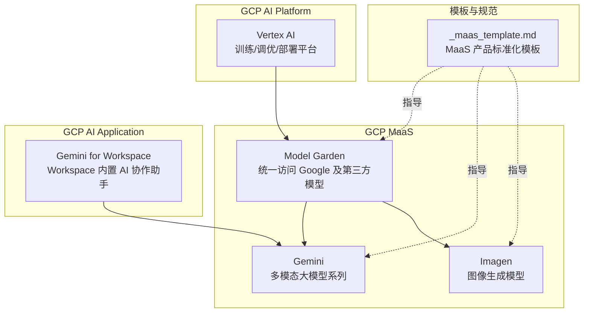
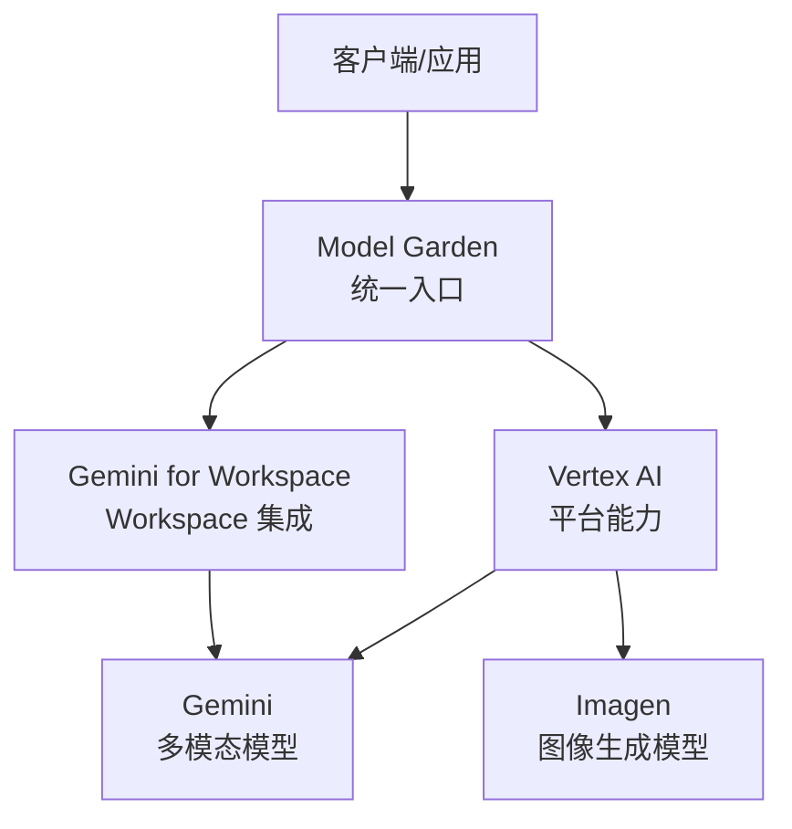
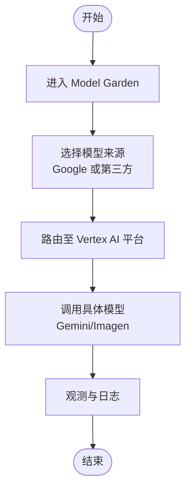
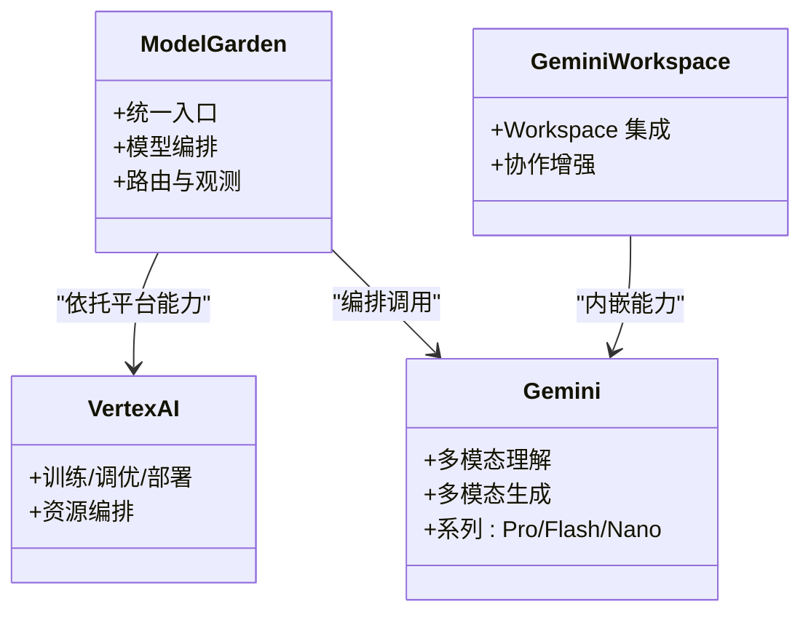
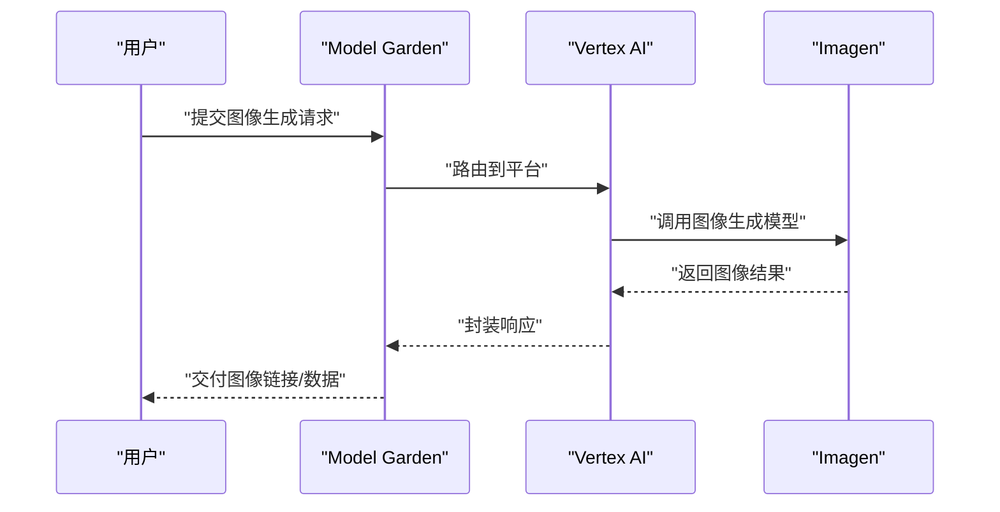
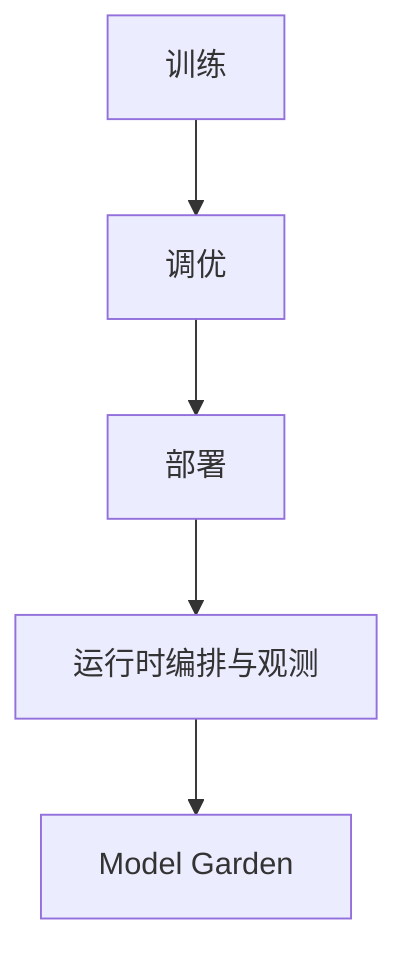
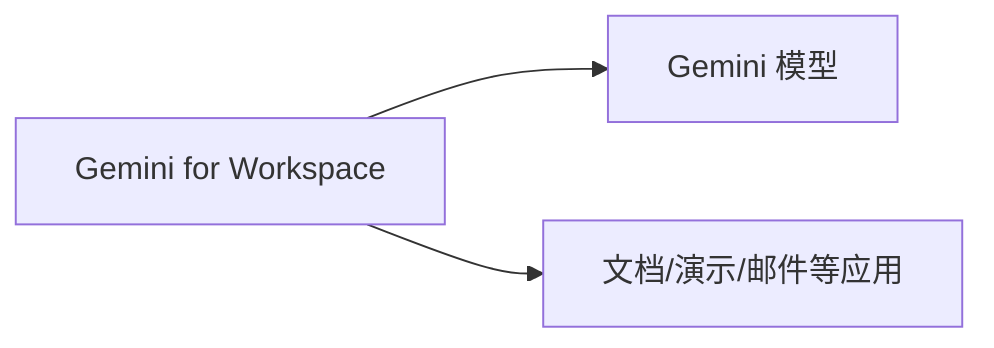
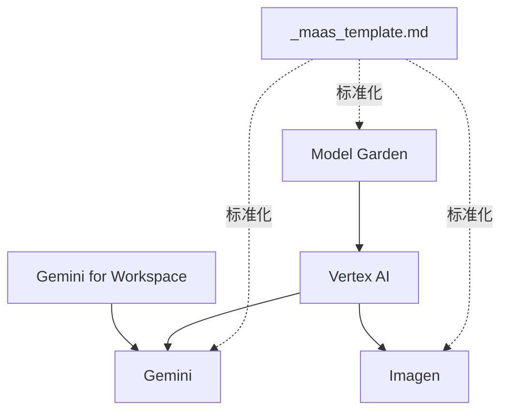

# GCP MaaS（模型即服务）

<cite>
**本文引用的文件**
- [overview.md](file://knowledge/gcp/maas/overview.md)
- [gemini.md](file://knowledge/gcp/maas/gemini.md)
- [imagen.md](file://knowledge/gcp/maas/imagen.md)
- [_maas_template.md](file://knowledge/_maas_template.md)
- [vertex-ai.md](file://knowledge/gcp/ai-platform/vertex-ai.md)
- [gemini-workspace.md](file://knowledge/gcp/ai-application/gemini-workspace.md)
</cite>

## 目录
1. [引言](#引言)
2. [项目结构](#项目结构)
3. [核心组件](#核心组件)
4. [架构总览](#架构总览)
5. [详细组件分析](#详细组件分析)
6. [依赖关系分析](#依赖关系分析)
7. [性能考虑](#性能考虑)
8. [故障排查指南](#故障排查指南)
9. [结论](#结论)
10. [附录](#附录)

## 引言
本文件围绕 GCP 的模型即服务（MaaS）能力进行系统化梳理，重点覆盖以下方面：
- Vertex AI Model Garden：统一访问 Google 及第三方模型的“模型市场”定位与能力边界
- Gemini：Google 自研多模态大模型系列（Pro/Flash/Nano）的能力定位与适用场景
- Imagen：Google 图像生成模型的技术定位与典型应用
- 与 Vertex AI 平台的关系：作为模型托管与编排入口的协同作用
- 与 Google Workspace 的集成：面向办公协作的 AI 助手能力
- 通用 MaaS 选型与最佳实践：基于模板化的结构化框架

本仓库现有文件对上述主题以“定位”“Draft 状态”“类别”等维度进行了初步沉淀，本文在不超出仓库已有信息的前提下，构建可读性强、层次清晰的说明文档，并提供架构图与流程图帮助理解。

## 项目结构
GCP MaaS 相关内容分布在如下位置：
- knowledge/gcp/maas：包含 Model Garden、Gemini、Imagen 的定位说明
- knowledge/gcp/ai-platform：Vertex AI 作为 AI 平台的整体定位
- knowledge/gcp/ai-application：Gemini for Workspace 在 Google Workspace 的定位
- knowledge/_maas_template.md：MaaS 产品标准化模板，便于后续填充细节

图表来源
- [overview.md:1-9](file://knowledge/gcp/maas/overview.md#L1-L9)
- [gemini.md:1-9](file://knowledge/gcp/maas/gemini.md#L1-L9)
- [imagen.md:1-9](file://knowledge/gcp/maas/imagen.md#L1-L9)
- [vertex-ai.md:1-9](file://knowledge/gcp/ai-platform/vertex-ai.md#L1-L9)
- [gemini-workspace.md:1-9](file://knowledge/gcp/ai-application/gemini-workspace.md#L1-L9)
- [_maas_template.md:1-65](file://knowledge/_maas_template.md#L1-L65)

章节来源
- [overview.md:1-9](file://knowledge/gcp/maas/overview.md#L1-L9)
- [gemini.md:1-9](file://knowledge/gcp/maas/gemini.md#L1-L9)
- [imagen.md:1-9](file://knowledge/gcp/maas/imagen.md#L1-L9)
- [vertex-ai.md:1-9](file://knowledge/gcp/ai-platform/vertex-ai.md#L1-L9)
- [gemini-workspace.md:1-9](file://knowledge/gcp/ai-application/gemini-workspace.md#L1-L9)
- [_maas_template.md:1-65](file://knowledge/_maas_template.md#L1-L65)

## 核心组件
- Model Garden（Vertex AI Model Garden）
  - 定位：统一访问 Google 及第三方模型的“模型市场”
  - 作用：作为入口，聚合与编排多来源模型，便于按需调用与管理
- Gemini
  - 定位：Google 自研多模态大模型系列（Pro/Flash/Nano）
  - 作用：提供多模态理解与生成能力，适配不同延迟与吞吐需求
- Imagen
  - 定位：Google 图像生成模型
  - 作用：面向高质量图像生成场景，支撑创意与商业应用
- Vertex AI
  - 定位：GCP 机器学习平台，覆盖训练、调优、部署全流程
  - 作用：为 MaaS 提供底层基础设施与编排能力
- Gemini for Workspace
  - 定位：Google Workspace 内置 AI 协作助手
  - 作用：将 Gemini 能力嵌入办公套件，提升日常协作效率

章节来源
- [overview.md:1-9](file://knowledge/gcp/maas/overview.md#L1-L9)
- [gemini.md:1-9](file://knowledge/gcp/maas/gemini.md#L1-L9)
- [imagen.md:1-9](file://knowledge/gcp/maas/imagen.md#L1-L9)
- [vertex-ai.md:1-9](file://knowledge/gcp/ai-platform/vertex-ai.md#L1-L9)
- [gemini-workspace.md:1-9](file://knowledge/gcp/ai-application/gemini-workspace.md#L1-L9)

## 架构总览
下图展示了 GCP MaaS 的宏观架构：Model Garden 作为统一入口，连接 Vertex AI 平台与具体模型（Gemini/Imagen），并通过 Gemini for Workspace 与 Google Workspace 生态融合。

图表来源
- [overview.md:1-9](file://knowledge/gcp/maas/overview.md#L1-L9)
- [vertex-ai.md:1-9](file://knowledge/gcp/ai-platform/vertex-ai.md#L1-L9)
- [gemini.md:1-9](file://knowledge/gcp/maas/gemini.md#L1-L9)
- [imagen.md:1-9](file://knowledge/gcp/maas/imagen.md#L1-L9)
- [gemini-workspace.md:1-9](file://knowledge/gcp/ai-application/gemini-workspace.md#L1-L9)

## 详细组件分析

### Model Garden（Vertex AI Model Garden）
- 定位与职责
  - 统一访问 Google 及第三方模型，作为“模型市场”的入口
  - 与 Vertex AI 平台协同，提供模型托管、版本管理与编排能力
- 与 Vertex AI 的关系
  - Vertex AI 提供训练/调优/部署的基础设施与工具链；Model Garden 聚合这些能力并对外呈现为统一的调用面
- 与 Gemini/Imagen 的关系
  - 作为模型编排与接入层，负责路由、鉴权、限流与可观测性等
- 使用建议
  - 将不同来源模型纳入统一编排，便于灰度发布与 A/B 对比
  - 结合 Workspace 场景，优先选择具备多模态与协作能力的模型

图表来源
- [overview.md:1-9](file://knowledge/gcp/maas/overview.md#L1-L9)
- [vertex-ai.md:1-9](file://knowledge/gcp/ai-platform/vertex-ai.md#L1-L9)
- [gemini.md:1-9](file://knowledge/gcp/maas/gemini.md#L1-L9)
- [imagen.md:1-9](file://knowledge/gcp/maas/imagen.md#L1-L9)

章节来源
- [overview.md:1-9](file://knowledge/gcp/maas/overview.md#L1-L9)
- [vertex-ai.md:1-9](file://knowledge/gcp/ai-platform/vertex-ai.md#L1-L9)

### Gemini（多模态大模型系列）
- 定位与系列
  - Google 自研多模态大模型系列（Pro/Flash/Nano）
  - 面向不同延迟与吞吐需求，覆盖从轻量到旗舰的多种形态
- 能力与适用场景
  - 多模态理解与生成：文本、图像、视频等
  - 适用于内容创作、分析问答、代码辅助、跨模态检索等
- 与 Workspace 的关系
  - 通过 Gemini for Workspace 嵌入办公套件，提升协作效率
- 使用建议
  - 根据延迟/成本/质量目标选择合适系列（Pro/Flash/Nano）
  - 在 Workspace 场景中优先启用多模态能力，结合上下文与权限控制

图表来源
- [overview.md:1-9](file://knowledge/gcp/maas/overview.md#L1-L9)
- [vertex-ai.md:1-9](file://knowledge/gcp/ai-platform/vertex-ai.md#L1-L9)
- [gemini.md:1-9](file://knowledge/gcp/maas/gemini.md#L1-L9)
- [gemini-workspace.md:1-9](file://knowledge/gcp/ai-application/gemini-workspace.md#L1-L9)

章节来源
- [gemini.md:1-9](file://knowledge/gcp/maas/gemini.md#L1-L9)
- [gemini-workspace.md:1-9](file://knowledge/gcp/ai-application/gemini-workspace.md#L1-L9)

### Imagen（图像生成模型）
- 定位与职责
  - Google 图像生成模型，面向高质量图像生成场景
  - 与 Model Garden/Vertex AI 协同，提供稳定、可扩展的图像生成能力
- 适用场景
  - 创意设计、品牌素材、电商视觉、内容营销等
- 使用建议
  - 与多模态模型配合，实现图文联动与跨模态检索
  - 在 Workspace 场景中结合文案与图像，提升协作产出质量

图表来源
- [overview.md:1-9](file://knowledge/gcp/maas/overview.md#L1-L9)
- [vertex-ai.md:1-9](file://knowledge/gcp/ai-platform/vertex-ai.md#L1-L9)
- [imagen.md:1-9](file://knowledge/gcp/maas/imagen.md#L1-L9)

章节来源
- [imagen.md:1-9](file://knowledge/gcp/maas/imagen.md#L1-L9)

### Vertex AI（平台能力）
- 定位与职责
  - GCP 机器学习平台，覆盖训练、调优、部署全流程
  - 为 Model Garden 与具体模型提供基础设施与编排能力
- 与 MaaS 的关系
  - 平台层能力决定模型的可用性、弹性与可观测性
  - 通过统一入口（Model Garden）对外呈现一致的调用体验

图表来源
- [vertex-ai.md:1-9](file://knowledge/gcp/ai-platform/vertex-ai.md#L1-L9)
- [overview.md:1-9](file://knowledge/gcp/maas/overview.md#L1-L9)

章节来源
- [vertex-ai.md:1-9](file://knowledge/gcp/ai-platform/vertex-ai.md#L1-L9)

### Gemini for Workspace（协作助手）
- 定位与职责
  - Google Workspace 内置 AI 协作助手，将 Gemini 能力嵌入办公套件
- 与 MaaS 的关系
  - 作为面向终端用户的“应用层”，直接体现多模态模型在办公场景中的价值
- 使用建议
  - 在文档、演示、邮件等场景中启用多模态能力，提升内容创作与协作效率

图表来源
- [gemini-workspace.md:1-9](file://knowledge/gcp/ai-application/gemini-workspace.md#L1-L9)
- [gemini.md:1-9](file://knowledge/gcp/maas/gemini.md#L1-L9)

章节来源
- [gemini-workspace.md:1-9](file://knowledge/gcp/ai-application/gemini-workspace.md#L1-L9)

## 依赖关系分析
- Model Garden 依赖 Vertex AI 平台提供的训练/调优/部署能力
- Gemini/Imagen 作为具体模型由 Model Garden 进行编排与路由
- Gemini for Workspace 依赖 Gemini 模型并在 Workspace 生态中提供用户体验
- 模板（_maas_template.md）为后续完善各组件的“当前主推”“核心能力/限制”“适用场景”等提供标准化框架

图表来源
- [_maas_template.md:1-65](file://knowledge/_maas_template.md#L1-L65)
- [overview.md:1-9](file://knowledge/gcp/maas/overview.md#L1-L9)
- [vertex-ai.md:1-9](file://knowledge/gcp/ai-platform/vertex-ai.md#L1-L9)
- [gemini.md:1-9](file://knowledge/gcp/maas/gemini.md#L1-L9)
- [imagen.md:1-9](file://knowledge/gcp/maas/imagen.md#L1-L9)
- [gemini-workspace.md:1-9](file://knowledge/gcp/ai-application/gemini-workspace.md#L1-L9)

章节来源
- [_maas_template.md:1-65](file://knowledge/_maas_template.md#L1-L65)
- [overview.md:1-9](file://knowledge/gcp/maas/overview.md#L1-L9)
- [vertex-ai.md:1-9](file://knowledge/gcp/ai-platform/vertex-ai.md#L1-L9)
- [gemini.md:1-9](file://knowledge/gcp/maas/gemini.md#L1-L9)
- [imagen.md:1-9](file://knowledge/gcp/maas/imagen.md#L1-L9)
- [gemini-workspace.md:1-9](file://knowledge/gcp/ai-application/gemini-workspace.md#L1-L9)

## 性能考虑
- 选型建议
  - 根据延迟/吞吐/成本目标选择合适系列（Pro/Flash/Nano）
  - 在 Workspace 场景中优先启用多模态能力，结合上下文与权限控制
- 运行时优化
  - 通过 Model Garden 实现模型编排与路由，便于灰度发布与 A/B 对比
  - 结合平台能力（Vertex AI）进行弹性扩缩容与资源调度
- 成本控制
  - 优先采用按需调用模式，避免长期闲置资源
  - 在满足质量前提下，优先选择轻量级模型（Flash/Nano）以降低成本

## 故障排查指南
- 常见问题定位
  - 调用失败：检查 Model Garden 路由与鉴权配置
  - 响应异常：确认 Vertex AI 平台资源与模型版本
  - 性能抖动：核查限流与弹性策略，必要时进行灰度扩容
- 建议流程
  - 采集调用日志与追踪 ID
  - 核对模型版本与参数配置
  - 在 Workspace 场景中检查权限与上下文完整性

## 结论
- Model Garden 作为统一入口，整合 Vertex AI 平台能力与多来源模型，形成“平台+模型+应用”的闭环
- Gemini 与 Imagen 分别覆盖多模态与图像生成两大核心场景，可与 Workspace 深度结合
- 建议以模板化方式持续完善“当前主推”“核心能力/限制”“适用场景”等信息，支撑产品化与工程化落地

## 附录
- 使用示例与最佳实践
  - 建议参考 MaaS 模板，补充“当前主推模型”“核心能力/限制”“适用场景”等内容
  - 在 Workspace 场景中优先启用多模态能力，结合上下文与权限控制
- 差异化与选型考量
  - 与 AWS Bedrock、阿里云百炼等平台相比，GCP MaaS 更强调与 Vertex AI 的深度集成与 Workspace 的原生协作体验
  - 选型时应综合考虑延迟、成本、生态契合度与合规要求

章节来源
- [_maas_template.md:1-65](file://knowledge/_maas_template.md#L1-L65)