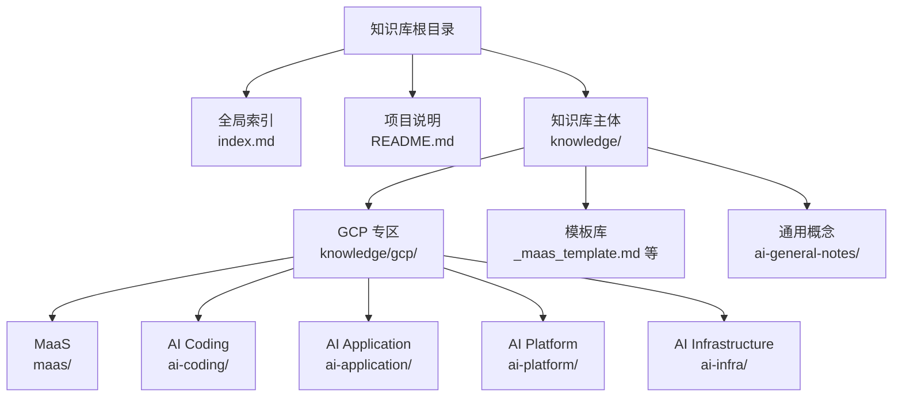
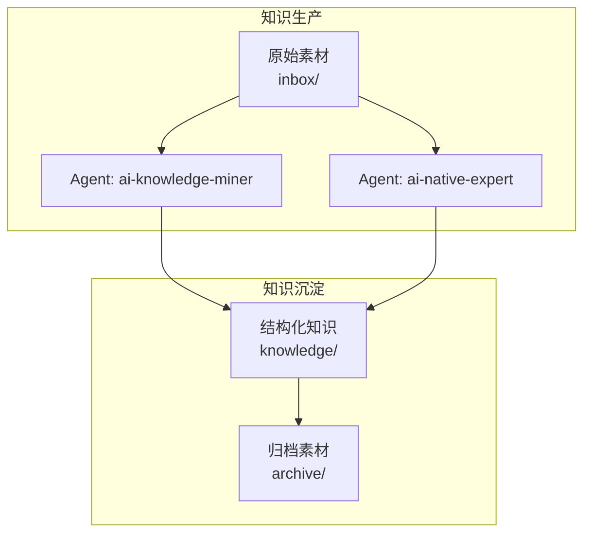
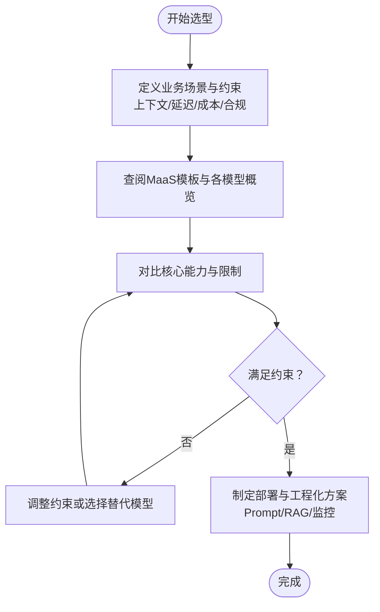
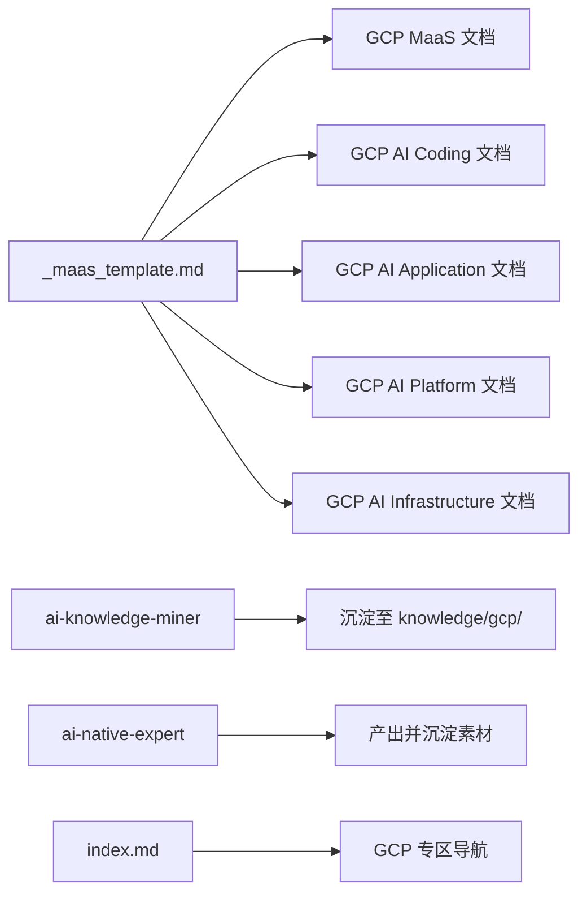

# GCP知识库

<cite>
**本文档引用的文件**
- [README.md](file://README.md)
- [index.md](file://index.md)
- [知识库模板：_maas_template.md](file://knowledge/_maas_template.md)
- [AI通用笔记模板：ai-general-notes/_template.md](file://knowledge/ai-general-notes/_template.md)
- [GCP MaaS：Model Garden概览](file://knowledge/gcp/maas/overview.md)
- [GCP MaaS：Gemini](file://knowledge/gcp/maas/gemini.md)
- [GCP MaaS：Imagen](file://knowledge/gcp/maas/imagen.md)
- [GCP AI Coding：Gemini Code Assist](file://knowledge/gcp/ai-coding/gemini-code-assist.md)
- [GCP AI Application：Gemini for Workspace](file://knowledge/gcp/ai-application/gemini-workspace.md)
- [GCP AI Platform：Vertex AI](file://knowledge/gcp/ai-platform/vertex-ai.md)
- [GCP AI Infrastructure：TPU](file://knowledge/gcp/ai-infra/tpu.md)
- [AI通用概念：Prompt Engineering](file://knowledge/ai-general-notes/prompt-engineering.md)
- [AI通用概念：RAG](file://knowledge/ai-general-notes/rag.md)
- [AI通用概念：Fine-tuning](file://knowledge/ai-general-notes/fine-tuning.md)
</cite>

## 目录
1. [简介](#简介)
2. [项目结构](#项目结构)
3. [核心组件](#核心组件)
4. [架构总览](#架构总览)
5. [详细组件分析](#详细组件分析)
6. [依赖分析](#依赖分析)
7. [性能考虑](#性能考虑)
8. [故障排查指南](#故障排查指南)
9. [结论](#结论)
10. [附录](#附录)

## 简介
本文件面向GCP知识库，系统梳理GCP在“模型即服务（MaaS）”、“AI编程（AI Coding）”、“AI应用（AI Application）”、“AI平台（AI Platform）”、“AI基础设施（AI Infrastructure）”五大产品线的知识组织与内容要点，并结合仓库的通用模板与流程，说明知识库的组织逻辑与更新机制。同时提供使用指南与最佳实践建议，帮助读者快速定位与复用知识。

## 项目结构
知识库采用“全局索引 + 分领域知识”的两级结构：
- 全局索引：提供跨厂商、跨领域的知识导航与模板参考
- 领域知识：按GCP的MaaS、AI Coding、AI Application、AI Platform、AI Infrastructure划分，形成标准化的文档模板与内容结构

图表来源
- [index.md:1-69](file://index.md#L1-L69)
- [README.md:1-20](file://README.md#L1-L20)

章节来源
- [index.md:1-69](file://index.md#L1-L69)
- [README.md:1-20](file://README.md#L1-L20)

## 核心组件
- GCP MaaS（模型即服务）
  - Model Garden：统一访问Google及第三方模型的入口
  - Gemini：多模态大模型系列（Pro/Flash/Nano）
  - Imagen：图像生成模型
- GCP AI Coding（AI编程）
  - Gemini Code Assist：原Duet AI for Developers，面向开发者的AI编程助手
- GCP AI Application（AI应用）
  - Gemini for Workspace：集成于Google Workspace的AI协作助手
- GCP AI Platform（AI平台）
  - Vertex AI：覆盖训练、调优、部署的全流程机器学习平台
- GCP AI Infrastructure（AI基础设施）
  - TPU：Google自研AI加速芯片

章节来源
- [index.md:36-41](file://index.md#L36-L41)
- [GCP MaaS：Model Garden概览:1-9](file://knowledge/gcp/maas/overview.md#L1-L9)
- [GCP MaaS：Gemini:1-9](file://knowledge/gcp/maas/gemini.md#L1-L9)
- [GCP MaaS：Imagen:1-9](file://knowledge/gcp/maas/imagen.md#L1-L9)
- [GCP AI Coding：Gemini Code Assist:1-9](file://knowledge/gcp/ai-coding/gemini-code-assist.md#L1-L9)
- [GCP AI Application：Gemini for Workspace:1-9](file://knowledge/gcp/ai-application/gemini-workspace.md#L1-L9)
- [GCP AI Platform：Vertex AI:1-9](file://knowledge/gcp/ai-platform/vertex-ai.md#L1-L9)
- [GCP AI Infrastructure：TPU:1-9](file://knowledge/gcp/ai-infra/tpu.md#L1-L9)

## 架构总览
知识库采用“模板驱动 + 流程驱动”的组织方式：
- 模板驱动：MaaS模板、通用笔记模板等，确保同类知识在结构与维度上一致
- 流程驱动：通过“ai-knowledge-miner”与“ai-native-expert”两类Agent，将原始素材提炼为结构化知识并沉淀至对应领域

图表来源
- [README.md:3-11](file://README.md#L3-L11)
- [index.md:13-17](file://index.md#L13-L17)

章节来源
- [README.md:3-11](file://README.md#L3-L11)
- [index.md:13-17](file://index.md#L13-L17)

## 详细组件分析

### GCP MaaS（Model Garden、Gemini、Imagen）
- 组织逻辑
  - 以“定位”“当前主推”“适用/不适用”“核心能力与限制”“适用场景”“关键技术论文/参考资料/变更记录”为主线
  - 使用MaaS模板，保证不同模型的横向对比与纵向演进可追踪
- 内容要点
  - Model Garden：统一入口、第三方模型生态、版本与兼容性管理
  - Gemini：多模态能力矩阵（文本/视觉/音频/代码）、上下文窗口、推理与生成特性、API形态与计费维度
  - Imagen：图像生成质量、风格控制、版权与合规、与Gemini多模态的协同
- 使用建议
  - 以“适用场景”为选型抓手，先判断是否满足“上下文/延迟/成本/合规”等约束
  - 以“核心能力与限制”为技术抓手，结合Prompt Engineering与RAG进行工程化落地
  - 以“变更记录”跟踪模型迭代与API变化

图表来源
- [知识库模板：_maas_template.md:1-65](file://knowledge/_maas_template.md#L1-L65)
- [GCP MaaS：Model Garden概览:1-9](file://knowledge/gcp/maas/overview.md#L1-L9)
- [GCP MaaS：Gemini:1-9](file://knowledge/gcp/maas/gemini.md#L1-L9)
- [GCP MaaS：Imagen:1-9](file://knowledge/gcp/maas/imagen.md#L1-L9)

章节来源
- [知识库模板：_maas_template.md:1-65](file://knowledge/_maas_template.md#L1-L65)
- [GCP MaaS：Model Garden概览:1-9](file://knowledge/gcp/maas/overview.md#L1-L9)
- [GCP MaaS：Gemini:1-9](file://knowledge/gcp/maas/gemini.md#L1-L9)
- [GCP MaaS：Imagen:1-9](file://knowledge/gcp/maas/imagen.md#L1-L9)

### GCP AI Coding（Gemini Code Assist）
- 组织逻辑
  - 以“定位”“当前主推”“适用/不适用”“核心能力与限制”“适用场景”“关键技术论文/参考资料/变更记录”为主线
- 内容要点
  - Gemini Code Assist：代码补全、单元测试生成、代码重构、安全扫描、多语言支持、IDE集成
- 使用建议
  - 与Prompt Engineering结合，构建“上下文+约束+反馈”的提示词体系
  - 与RAG结合，将团队知识库与历史代码作为外部检索增强
  - 以Fine-tuning或Adapter为补充，针对特定代码风格或领域术语做定制

章节来源
- [GCP AI Coding：Gemini Code Assist:1-9](file://knowledge/gcp/ai-coding/gemini-code-assist.md#L1-L9)

### GCP AI Application（Gemini for Workspace）
- 组织逻辑
  - 以“定位”“当前主推”“适用/不适用”“核心能力与限制”“适用场景”“关键技术论文/参考资料/变更记录”为主线
- 内容要点
  - Gemini for Workspace：邮件/日历/文档的智能辅助、协作与审阅、多模态摘要、会议纪要、翻译与润色
- 使用建议
  - 以“适用场景”为切入点，优先在高频协作场景中试点
  - 与组织治理结合，建立“最小可用规范”，逐步扩大使用范围

章节来源
- [GCP AI Application：Gemini for Workspace:1-9](file://knowledge/gcp/ai-application/gemini-workspace.md#L1-L9)

### GCP AI Platform（Vertex AI）
- 组织逻辑
  - 以“定位”“当前主推”“适用/不适用”“核心能力与限制”“适用场景”“关键技术论文/参考资料/变更记录”为主线
- 内容要点
  - Vertex AI：训练（自定义训练/托管训练）、调优（超参搜索/微调）、部署（端点/批量/边缘）、可观测性与治理
- 使用建议
  - 以“适用场景”为落点，结合“核心能力与限制”评估是否需要引入外部工具链（如RAG/Agent/Harness）
  - 以“变更记录”跟踪平台能力演进与API变化

章节来源
- [GCP AI Platform：Vertex AI:1-9](file://knowledge/gcp/ai-platform/vertex-ai.md#L1-L9)

### GCP AI Infrastructure（TPU）
- 组织逻辑
  - 以“定位”“当前主推”“适用/不适用”“核心能力与限制”“适用场景”“关键技术论文/参考资料/变更记录”为主线
- 内容要点
  - TPU：硬件代际演进、算力规格、软件栈（JAX/TensorFlow/XLA）、分布式训练与推理
- 使用建议
  - 以“适用场景”为落点，优先在需要高吞吐/低延迟的训练与推理任务中评估
  - 与Vertex AI结合，利用托管服务降低运维复杂度

章节来源
- [GCP AI Infrastructure：TPU:1-9](file://knowledge/gcp/ai-infra/tpu.md#L1-L9)

## 依赖分析
- 模板依赖
  - MaaS模板用于统一GCP MaaS条目的结构化表达
  - 通用笔记模板用于LLM基础概念的标准化沉淀
- Agent依赖
  - ai-knowledge-miner：将inbox素材转化为结构化知识，沉淀至knowledge/gcp/对应子目录
  - ai-native-expert：围绕MaaS与AI Coding生成竞品分析与API使用建议，产出新的inbox素材
- 索引依赖
  - index.md提供全局导航，串联各厂商与领域知识，便于检索与复用

图表来源
- [知识库模板：_maas_template.md:1-65](file://knowledge/_maas_template.md#L1-L65)
- [README.md:3-11](file://README.md#L3-L11)
- [index.md:36-41](file://index.md#L36-L41)

章节来源
- [知识库模板：_maas_template.md:1-65](file://knowledge/_maas_template.md#L1-L65)
- [README.md:3-11](file://README.md#L3-L11)
- [index.md:36-41](file://index.md#L36-L41)

## 性能考虑
- 选型维度
  - 上下文窗口与Token成本：在长文档与多轮对话场景中需平衡成本与效果
  - 推理延迟与吞吐：实时性要求高的应用需评估模型与部署形态
  - 硬件与算力：TPU等基础设施对大规模训练与高并发推理至关重要
- 工程化手段
  - Prompt Engineering：通过边界约束、溯源要求、置信度校准、对抗验证降低幻觉
  - RAG：结合检索与生成，提升事实性与时效性
  - Fine-tuning：针对特定任务与领域数据进行定制化优化

章节来源
- [AI通用概念：Prompt Engineering:1-193](file://knowledge/ai-general-notes/prompt-engineering.md#L1-L193)
- [AI通用概念：RAG:1-42](file://knowledge/ai-general-notes/rag.md#L1-L42)
- [AI通用概念：Fine-tuning:1-42](file://knowledge/ai-general-notes/fine-tuning.md#L1-L42)

## 故障排查指南
- 常见问题定位
  - 幻觉与事实性：优先检查提示词结构与检索质量，必要时引入置信度校准与对抗验证
  - 性能瓶颈：评估上下文长度、并发与硬件资源，必要时引入缓存与分片策略
  - API与计费：核对模型版本、调用频率与计费维度，关注变更记录
- 建议流程
  - 明确问题现象与影响范围
  - 回溯提示词与数据输入
  - 检查检索与生成链路
  - 核对计费与配额
  - 记录变更并持续观察

章节来源
- [AI通用概念：Prompt Engineering:135-170](file://knowledge/ai-general-notes/prompt-engineering.md#L135-L170)

## 结论
GCP知识库以模板与Agent双轮驱动，形成“结构化沉淀—可检索复用—持续演进”的闭环。围绕MaaS、AI Coding、AI Application、AI Platform、AI Infrastructure五大产品线，结合Prompt Engineering、RAG与Fine-tuning等工程化手段，可实现从“选型—部署—运营”的全生命周期管理。建议在实际落地中以“场景—能力—成本—风险”为决策基线，配合变更记录与最佳实践，持续优化模型与系统表现。

## 附录
- 使用指南
  - 新增GCP MaaS条目：参考MaaS模板，填写定位、适用/不适用、核心能力与限制、适用场景、参考资料与变更记录
  - 新增GCP AI Coding/应用/平台/基础设施条目：沿用通用模板，聚焦“定位—适用—能力—场景—变更”
  - 使用Agent：将原始素材放入inbox，触发ai-knowledge-miner与ai-native-expert，自动沉淀与扩展知识
- 最佳实践
  - 以“适用场景”为选型抓手，先易后难、小步快跑
  - 以“核心能力与限制”为技术抓手，结合工程化手段降低风险
  - 以“变更记录”为跟踪抓手，建立版本化与可追溯的知识档案

章节来源
- [知识库模板：_maas_template.md:1-65](file://knowledge/_maas_template.md#L1-L65)
- [README.md:3-11](file://README.md#L3-L11)
- [index.md:62-69](file://index.md#L62-L69)