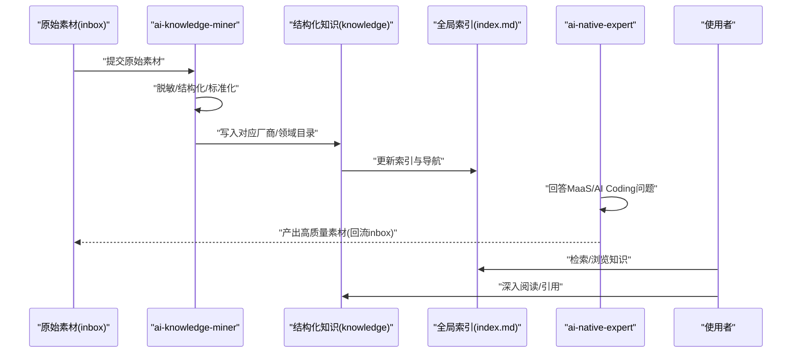
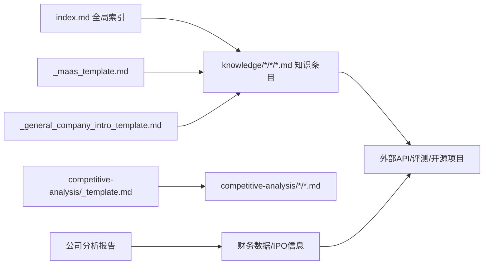

# 厂商知识库

<cite>
**本文引用的文件**
- [README.md](file://README.md)
- [index.md](file://index.md)
- [_maas_template.md](file://knowledge/_maas_template.md)
- [_general_company_intro_template.md](file://knowledge/_general_company_intro_template.md)
- [alibaba-cloud/maas/overview.md](file://knowledge/alibaba-cloud/maas/overview.md)
- [aws/maas/overview.md](file://knowledge/aws/maas/overview.md)
- [gcp/maas/overview.md](file://knowledge/gcp/maas/overview.md)
- [anthropic/maas/claude-api.md](file://knowledge/anthropic/maas/claude-api.md)
- [alibaba-cloud/ai-coding/qoder.md](file://knowledge/alibaba-cloud/ai-coding/qoder.md)
- [alibaba-cloud/ai-application/qoder-work.md](file://knowledge/alibaba-cloud/ai-application/qoder-work.md)
- [alibaba-cloud/ai-platform/pai.md](file://knowledge/alibaba-cloud/ai-platform/pai.md)
- [aws/ai-application/q-business.md](file://knowledge/aws/ai-application/q-business.md)
- [gcp/ai-platform/vertex-ai.md](file://knowledge/gcp/ai-platform/vertex-ai.md)
- [alibaba-cloud/competitive-analysis/alibaba-vs-aws/overview.md](file://knowledge/alibaba-cloud/competitive-analysis/alibaba-vs-aws/overview.md)
- [alibaba-cloud/competitive-analysis/_template.md](file://knowledge/alibaba-cloud/competitive-analysis/_template.md)
- [solutions/enterprise-ai-platform/overview.md](file://knowledge/solutions/enterprise-ai-platform/overview.md)
- [ai-general-notes/overview.md](file://knowledge/ai-general-notes/overview.md)
- [deepseek/general_intro.md](file://knowledge/deepseek/general_intro.md)
- [minimax/general_intro.md](file://knowledge/minimax/general_intro.md)
- [zhipu/general_intro.md](file://knowledge/zhipu/general_intro.md)
</cite>

## 目录
1. [简介](#简介)
2. [项目结构](#项目结构)
3. [核心组件](#核心组件)
4. [架构总览](#架构总览)
5. [详细组件分析](#详细组件分析)
6. [依赖分析](#依赖分析)
7. [性能考量](#性能考量)
8. [故障排查指南](#故障排查指南)
9. [结论](#结论)
10. [附录](#附录)

## 简介
本项目是一个面向主流AI平台（阿里云、AWS、GCP、Anthropic等）的知识库组织工程，旨在通过标准化的结构与模板，沉淀厂商在MaaS（模型即服务）、AI Coding（AI编程）、AI Application（AI应用）、AI Platform（AI平台）、AI Infrastructure（AI基础设施）等领域的知识。仓库采用"两个Agent"协同机制：ai-knowledge-miner负责从原始素材提炼为结构化知识并落盘到对应厂商/领域目录；ai-native-expert聚焦MaaS与AI Coding的选型、能力与API问题，输出高质量素材供沉淀。

- 两大Agent职责边界清晰，确保"输入—提炼—沉淀—索引"的闭环高效运转。
- 知识库以"全局索引"为导航中枢，覆盖跨厂商的通用概念、厂商专属产品、对比分析与行业解决方案。
- **新增**：本次更新特别增加了对MiniMax、智谱AI（Zhipu）和DeepSeek等中国AI公司的深度分析报告，丰富了知识库在开源大模型、多模态应用和全球化AI产品方面的覆盖范围。

章节来源
- [README.md:1-20](file://README.md#L1-L20)
- [index.md:1-78](file://index.md#L1-L78)

## 项目结构
仓库采用"按厂商+领域"的两级目录组织方式，配合全局索引与模板，形成统一规范与差异化表达并存的知识体系。

```mermaid
graph TB
root["知识库根目录"] --> inbox["inbox/ 原始素材"]
root --> archive["archive/ 备份素材"]
root --> knowledge["knowledge/ 结构化知识库"]
knowledge --> gen["ai-general-notes/ 通用AI概念"]
knowledge --> aliyun["alibaba-cloud/ 阿里云"]
knowledge --> aws["aws/ AWS"]
knowledge --> gcp["gcp/ GCP"]
knowledge --> anthropic["anthropic/ Anthropic"]
knowledge --> minimax["minimax/ MiniMax"]
knowledge --> zhipu["zhipu/ 智谱AI"]
knowledge --> deepseek["deepseek/ DeepSeek"]
knowledge --> solutions["solutions/ 行业解决方案"]
knowledge --> templates["_maas_template.md / _general_company_intro_template.md 等模板"]
subgraph "阿里云"
aliyun --> ac_maas["maas/ MaaS"]
aliyun --> ac_ai_coding["ai-coding/ AI 编程"]
aliyun --> ac_ai_app["ai-application/ AI 应用"]
aliyun --> ac_ai_platform["ai-platform/ AI 平台"]
aliyun --> ac_ai_infra["ai-infra/ AI 基础设施"]
aliyun --> ac_competitive["competitive-analysis/ 竞争分析"]
end
subgraph "AWS"
aws --> aw_maas["maas/ MaaS"]
aws --> aw_ai_coding["ai-coding/ AI 编程"]
aws --> aw_ai_app["ai-application/ AI 应用"]
aws --> aw_ai_platform["ai-platform/ AI 平台"]
aws --> aw_ai_infra["ai-infra/ AI 基础设施"]
end
subgraph "GCP"
gcp --> gc_maas["maas/ MaaS"]
gcp --> gc_ai_coding["ai-coding/ AI 编程"]
gcp --> gc_ai_app["ai-application/ AI 应用"]
gcp --> gc_ai_platform["ai-platform/ AI 平台"]
gcp --> gc_ai_infra["ai-infra/ AI 基础设施"]
end
subgraph "Anthropic"
anthropic --> ap_maas["maas/ MaaS"]
anthropic --> ap_ai_coding["ai-coding/ AI 编程"]
anthropic --> ap_ai_app["ai-application/ AI 应用"]
end
subgraph "中国AI公司"
minimax --> mm_company["公司分析报告"]
zhipu --> zp_company["公司分析报告"]
deepseek --> ds_company["公司分析报告"]
end
```

**更新** 新增了MiniMax、智谱AI和DeepSeek三个中国AI公司的专门分析目录，丰富了知识库在开源大模型和多模态应用领域的覆盖。

图表来源
- [index.md:22-56](file://index.md#L22-L56)

章节来源
- [README.md:13-19](file://README.md#L13-L19)
- [index.md:1-78](file://index.md#L1-L78)

## 核心组件
- 全局索引：提供跨厂商、跨领域的导航与摘要，便于快速检索与上下文定位。
- 通用模板：MaaS模板与公司分析模板，确保知识条目在结构、维度与可比性上保持一致。
- 厂商知识库：按领域细分（MaaS/AI Coding/AI Application/AI Platform/AI Infrastructure），每个领域下按产品/功能命名文件，统一头部元信息与结构。
- 竞争分析：以"我方 vs 对方"的对比模板，系统化梳理产品矩阵、生态、定价与销售策略。
- 行业解决方案：面向特定垂直场景的端到端方案，强调架构、产品组合、落地节奏与优化建议。
- **新增**：公司分析报告模块，涵盖MiniMax的多模态全球化产品矩阵、智谱AI的MaaS API商业化路径，以及DeepSeek的开源大模型架构创新。

章节来源
- [index.md:6-78](file://index.md#L6-L78)
- [_maas_template.md:1-65](file://knowledge/_maas_template.md#L1-L65)
- [_general_company_intro_template.md:1-249](file://knowledge/_general_company_intro_template.md#L1-L249)

## 架构总览
知识库的"输入—提炼—沉淀—索引—应用"流程如下：

图表来源
- [README.md:7-11](file://README.md#L7-L11)
- [index.md:1-78](file://index.md#L1-L78)

章节来源
- [README.md:1-20](file://README.md#L1-L20)
- [index.md:1-78](file://index.md#L1-L78)

## 详细组件分析

### 统一结构与差异化特点
- 统一结构
  - 文件头部包含"所属厂商、产品类别、最后更新、状态"等元信息，便于检索与版本追踪。
  - MaaS条目遵循统一模板，包含"定位/当前主推/适用/不适用/核心能力与限制/适用场景/参考资料/Changelog"等模块，确保可比性与一致性。
  - 竞争分析采用固定表格与段落，覆盖概览、产品矩阵、生态、定价、案例与销售建议等维度。
  - **新增**：公司分析报告采用统一的"公司概况-产品矩阵-财务数据-战略合作-影响力分析"结构，确保不同厂商间的可比性。
- 差异化特点
  - 各厂商在产品命名、定位、能力侧重与生态布局上存在差异。例如：阿里云强调"百炼平台"统一管理API；AWS强调"Bedrock"一键调用主流模型；GCP强调"Model Garden"与Vertex AI；Anthropic强调Claude系列API与Teams/Managed Agents应用形态。
  - **新增**：MiniMax强调多模态全球化产品矩阵（海螺AI、Talkie）和开源混合注意力架构；智谱AI强调MaaS API商业化路径和本地化部署优势；DeepSeek强调开源大模型架构创新和极致性价比。
  - AI Coding/AI Application/AI Platform/AI Infrastructure在不同厂商下的产品形态与命名差异明显，需结合模板与索引进行横向对比。

章节来源
- [_maas_template.md:1-65](file://knowledge/_maas_template.md#L1-L65)
- [alibaba-cloud/maas/overview.md:1-9](file://knowledge/alibaba-cloud/maas/overview.md#L1-L9)
- [aws/maas/overview.md:1-9](file://knowledge/aws/maas/overview.md#L1-L9)
- [gcp/maas/overview.md:1-9](file://knowledge/gcp/maas/overview.md#L1-L9)
- [anthropic/maas/claude-api.md:1-9](file://knowledge/anthropic/maas/claude-api.md#L1-L9)
- [minimax/general_intro.md:1-309](file://knowledge/minimax/general_intro.md#L1-L309)
- [zhipu/general_intro.md:1-347](file://knowledge/zhipu/general_intro.md#L1-L347)
- [deepseek/general_intro.md:1-346](file://knowledge/deepseek/general_intro.md#L1-L346)

### 覆盖范围与组织策略
- MaaS（模型即服务）
  - 阿里云：百炼平台、Qwen、万相等。
  - AWS：Bedrock、Claude、Titan等。
  - GCP：Model Garden、Gemini、Imagen等。
  - Anthropic：Claude API（Opus/Sonnet/Haiku）。
  - **新增**：MiniMax：多模态基础模型（M系列）、海螺AI API、Talkie API。
  - **新增**：智谱AI：GLM系列（GLM-4/4.5/4.6/5）、MaaS API平台、本地化部署。
  - **新增**：DeepSeek：V系列（V1-V4）、R系列（R1）、DeepSeek App API。
- AI Coding（AI编程）
  - 阿里云：Qoder。
  - AWS：Q Developer、Kiro。
  - GCP：Gemini Code Assist。
  - Anthropic：Claude Code。
  - **新增**：智谱AI：CodeGeeX系列、AutoGLM编程助手。
- AI Application（AI应用）
  - 阿里云：QoderWork、龙虾家族、JVS Crew等。
  - AWS：Amazon Q Business。
  - GCP：Gemini Workspace。
  - Anthropic：Claude Teams、Claude Managed Agents。
  - **新增**：MiniMax：海螺AI（Hailuo AI）、Talkie（海外AI角色社交）。
  - **新增**：DeepSeek：DeepSeek App（C端对话产品）。
- AI Platform（AI平台）
  - 阿里云：PAI。
  - AWS：SageMaker。
  - GCP：Vertex AI。
  - **新增**：智谱AI：MaaS开放平台（bigmodel.cn）、AutoGLM智能体框架。
- AI Infrastructure（AI基础设施）
  - 阿里云：ECS GPU、灵骏、GPU产品线。
  - AWS：EC2 GPU、Trainium、Inferentia。
  - GCP：TPU。
  - Anthropic：未在基础设施目录中提供具体产品文件。
  - **新增**：DeepSeek：与华为昇腾合作的算力部署、PTX层级优化。
- **新增**：公司分析报告（中国AI公司）
  - MiniMax：多模态基础模型（M1/M2/M3）、海螺AI、Talkie、海外收入占比70%+。
  - 智谱AI：GLM系列（GLM-5 SWE-bench Verified）、MaaS API ARR 17亿元、本地化部署。
  - DeepSeek：MLA+MoE架构创新、R1纯RL推理、V4开源SOTA、557万美元训练成本。

章节来源
- [index.md:22-56](file://index.md#L22-L56)
- [alibaba-cloud/ai-coding/qoder.md:1-9](file://knowledge/alibaba-cloud/ai-coding/qoder.md#L1-L9)
- [alibaba-cloud/ai-application/qoder-work.md:1-9](file://knowledge/alibaba-cloud/ai-application/qoder-work.md#L1-L9)
- [alibaba-cloud/ai-platform/pai.md:1-9](file://knowledge/alibaba-cloud/ai-platform/pai.md#L1-L9)
- [aws/ai-application/q-business.md:1-9](file://knowledge/aws/ai-application/q-business.md#L1-L9)
- [gcp/ai-platform/vertex-ai.md:1-9](file://knowledge/gcp/ai-platform/vertex-ai.md#L1-L9)
- [minimax/general_intro.md:69-117](file://knowledge/minimax/general_intro.md#L69-L117)
- [zhipu/general_intro.md:84-137](file://knowledge/zhipu/general_intro.md#L84-L137)
- [deepseek/general_intro.md:74-125](file://knowledge/deepseek/general_intro.md#L74-L125)

### 更新机制与维护策略
- 更新机制
  - 通过Changelog记录每次更新日期与内容，确保知识演进可追溯。
  - 全局索引定期同步新增/修订条目，保持导航与摘要准确。
  - **新增**：公司分析报告采用季度更新机制，重点关注财务数据、产品矩阵和战略合作的变化。
- 维护策略
  - 模板驱动：统一模板减少知识碎片化，提升横向比较效率。
  - 评审状态：条目头部状态字段（Draft/Reviewed/Published）便于质量把关与发布节奏控制。
  - 竞争分析：以"我方 vs 对方"模板固化对比维度，避免遗漏关键差异点。
  - 解决方案：以"企业自建AI推理平台"为例，提供架构、产品组合、优化建议与销售策略，形成可复用的模板化方案。
  - **新增**：公司分析报告建立"数据时效说明"机制，明确标注数据来源和可信度分级。

章节来源
- [_maas_template.md:62-65](file://knowledge/_maas_template.md#L62-L65)
- [alibaba-cloud/competitive-analysis/alibaba-vs-aws/overview.md:43-46](file://knowledge/alibaba-cloud/competitive-analysis/alibaba-vs-aws/overview.md#L43-L46)
- [solutions/enterprise-ai-platform/overview.md:268-273](file://knowledge/solutions/enterprise-ai-platform/overview.md#L268-L273)
- [index.md:1-78](file://index.md#L1-L78)
- [minimax/general_intro.md:2-3](file://knowledge/minimax/general_intro.md#L2-L3)
- [zhipu/general_intro.md:2-3](file://knowledge/zhipu/general_intro.md#L2-L3)
- [deepseek/general_intro.md:2-3](file://knowledge/deepseek/general_intro.md#L2-L3)

### 使用指南与最佳实践
- 使用指南
  - 以全局索引为入口，先看"道（跨厂商通用概念）"，再按需进入"点（单产品知识）"与"线（对比分析）"。
  - 在"体（行业解决方案）"中寻找端到端案例，复用架构与产品组合建议。
  - **新增**：在"点（单产品知识）"中，可重点关注新增的中国AI公司分析报告，了解开源大模型、多模态应用和全球化AI产品的最新动态。
- 最佳实践
  - 选型优先：先确定领域（MaaS/AI Coding/AI Application/AI Platform/AI Infrastructure），再按厂商筛选。
  - 对比分析：使用竞争分析模板，系统化梳理产品矩阵、生态、定价与销售策略。
  - 模板化沉淀：撰写MaaS条目时严格遵循模板，确保"定位/能力/限制/适用场景/参考资料/Changelog"齐全。
  - 持续更新：为每篇条目维护Changelog，定期回顾与修订，保证时效性与准确性。
  - **新增**：使用公司分析报告时，注意区分"已确认事实/媒体估算/管理层指引"三类数据，特别关注MiniMax、智谱AI和DeepSeek的IPO相关信息。

章节来源
- [index.md:6-78](file://index.md#L6-L78)
- [_maas_template.md:1-65](file://knowledge/_maas_template.md#L1-L65)
- [alibaba-cloud/competitive-analysis/_template.md:1-46](file://knowledge/alibaba-cloud/competitive-analysis/_template.md#L1-L46)

## 依赖分析
- 组件耦合
  - 索引与知识库：索引依赖知识库条目的元信息与标题，二者保持强耦合以确保导航准确。
  - 模板与条目：MaaS模板与公司模板为知识条目提供结构化骨架，降低信息缺失风险。
  - 竞争分析与条目：对比分析模板与厂商条目共同构成"横向可比"的知识网络。
  - **新增**：公司分析报告与MaaS条目相互补充，前者提供宏观层面的商业模式和财务数据，后者提供具体的技术能力和API使用指导。
- 外部依赖
  - 产品生态与API：MaaS条目中常引用外部API文档与评测站点，需定期校验链接有效性与内容时效。
  - 行业实践：解决方案类文档引用开源项目与云厂商产品，需关注版本兼容与部署变化。
  - **新增**：IPO相关信息和股价波动对MiniMax、智谱AI和DeepSeek的分析具有重要影响，需及时跟踪港交所公告和市场动态。

图表来源
- [index.md:1-78](file://index.md#L1-78)
- [_maas_template.md:1-65](file://knowledge/_maas_template.md#L1-L65)
- [_general_company_intro_template.md:1-249](file://knowledge/_general_company_intro_template.md#L1-L249)
- [alibaba-cloud/competitive-analysis/_template.md:1-46](file://knowledge/alibaba-cloud/competitive-analysis/_template.md#L1-L46)

章节来源
- [index.md:1-78](file://index.md#L1-L78)
- [_maas_template.md:1-65](file://knowledge/_maas_template.md#L1-L65)
- [_general_company_intro_template.md:1-249](file://knowledge/_general_company_intro_template.md#L1-L249)
- [alibaba-cloud/competitive-analysis/_template.md:1-46](file://knowledge/alibaba-cloud/competitive-analysis/_template.md#L1-L46)

## 性能考量
- 知识检索效率
  - 通过全局索引与模板化结构，减少无效搜索与重复劳动。
  - 建议为索引增加关键词标签与摘要，提升检索命中率。
  - **新增**：针对新增的公司分析报告，建议在索引中增加"中国AI公司"分类，便于快速定位。
- 内容维护成本
  - 模板化与Changelog机制显著降低维护成本，建议强制执行。
  - 对高频更新的MaaS条目，建立"月度回顾"机制，确保能力边界与限制及时修正。
  - **新增**：公司分析报告建立"季度更新"机制，重点关注财务数据、产品矩阵和战略合作的变化。
- 可扩展性
  - 新增厂商或领域时，沿用现有模板与索引格式，保持知识库一致性。
  - 解决方案类文档可抽象为"模板化方案包"，便于复用与二次创作。
  - **新增**：随着中国AI公司IPO增多，建议建立专门的"港股AI板块"分析模板。

## 故障排查指南
- 常见问题
  - 索引与条目不一致：检查条目头部元信息是否与索引匹配，必要时同步更新。
  - 模板字段缺失：对照模板补齐"定位/适用/不适用/核心能力/限制/参考资料/Changelog"等字段。
  - 链接失效：定期巡检外部链接，替换为稳定镜像或替代资源。
  - **新增**：IPO相关信息滞后：关注港交所公告，及时更新MiniMax、智谱AI和DeepSeek的最新进展。
- 处理流程
  - 发现问题→定位文件→核对模板→补充/修正→更新Changelog→同步索引。

章节来源
- [_maas_template.md:1-65](file://knowledge/_maas_template.md#L1-L65)
- [alibaba-cloud/competitive-analysis/_template.md:1-46](file://knowledge/alibaba-cloud/competitive-analysis/_template.md#L1-L46)

## 结论
该知识库以"Agent驱动+模板化+索引导航"的方式，实现了对主流AI平台在五大领域的系统化组织。通过统一结构与差异化表达，既保证了横向可比性，又保留了厂商特色。**本次更新特别增加了MiniMax、智谱AI和DeepSeek等中国AI公司的深度分析，丰富了知识库在开源大模型、多模态应用和全球化AI产品方面的覆盖范围。** 建议持续完善模板与索引，强化Changelog与评审状态管理，并将成功案例沉淀为可复用的解决方案模板，进一步提升知识库的实用性与传播价值。

## 附录
- 术语速览
  - MaaS：模型即服务，指通过API统一访问与管理大模型的能力。
  - AI Coding：AI辅助编程，提升开发者编码效率。
  - AI Application：面向用户的AI应用，如智能客服、企业助手等。
  - AI Platform：提供模型训练、调优与部署的平台化服务。
  - AI Infrastructure：支撑AI计算的底层硬件与网络设施。
  - **新增**：IPO：首次公开募股，指公司首次向公众投资者发行股票。
  - **新增**：ARR：年度经常性收入，衡量订阅服务的年度价值。
  - **新增**：MoE：Mixture of Experts，专家混合模型，通过选择性激活部分专家来提高效率。
- 参考路径
  - 通用概念概览：[ai-general-notes/overview.md:1-42](file://knowledge/ai-general-notes/overview.md#L1-L42)
  - 竞争分析模板：[alibaba-cloud/competitive-analysis/_template.md:1-46](file://knowledge/alibaba-cloud/competitive-analysis/_template.md#L1-L46)
  - 企业自建AI推理平台方案：[solutions/enterprise-ai-platform/overview.md:1-273](file://knowledge/solutions/enterprise-ai-platform/overview.md#L1-L273)
  - **新增**：MiniMax公司分析报告：[minimax/general_intro.md:1-309](file://knowledge/minimax/general_intro.md#L1-L309)
  - **新增**：智谱AI公司分析报告：[zhipu/general_intro.md:1-347](file://knowledge/zhipu/general_intro.md#L1-L347)
  - **新增**：DeepSeek公司分析报告：[deepseek/general_intro.md:1-346](file://knowledge/deepseek/general_intro.md#L1-L346)