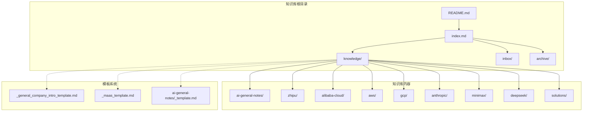
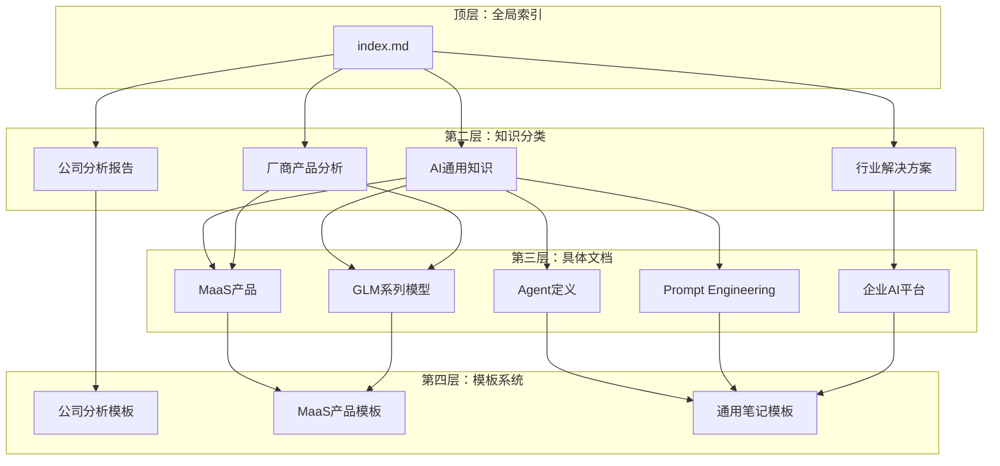
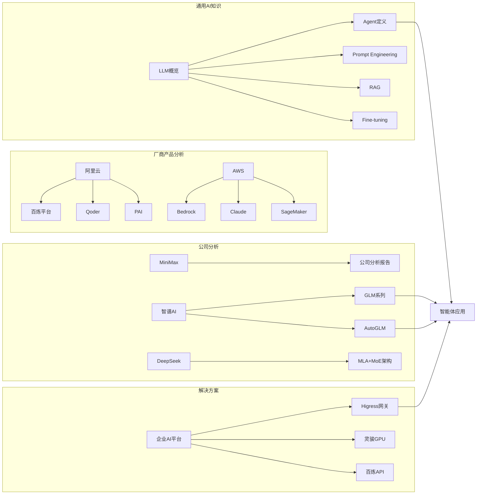
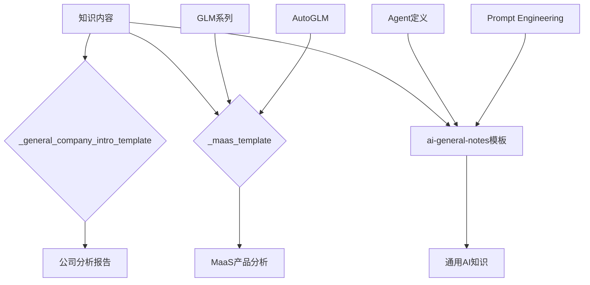

# 智谱AI公司分析报告

<cite>
**本文档引用的文件**
- [README.md](file://README.md)
- [index.md](file://index.md)
- [_general_company_intro_template.md](file://knowledge/_general_company_intro_template.md)
- [_maas_template.md](file://knowledge/_maas_template.md)
- [general_intro.md](file://knowledge/zhipu/general_intro.md)
- [overview.md](file://knowledge/ai-general-notes/overview.md)
- [agent-def.md](file://knowledge/ai-general-notes/agent-def.md)
- [prompt-engineering.md](file://knowledge/ai-general-notes/prompt-engineering.md)
- [rag.md](file://knowledge/ai-general-notes/rag.md)
- [fine-tuning.md](file://knowledge/ai-general-notes/fine-tuning.md)
- [overview.md](file://knowledge/alibaba-cloud/competitive-analysis/alibaba-vs-aws/overview.md)
- [overview.md](file://knowledge/solutions/enterprise-ai-platform/overview.md)
- [Daily_note_update_with_AI_insight.md](file://notes/Daily_note_update_with_AI_insight.md)
</cite>

## 目录
1. [简介](#简介)
2. [项目结构](#项目结构)
3. [核心组件](#核心组件)
4. [架构概览](#架构概览)
5. [详细组件分析](#详细组件分析)
6. [依赖分析](#依赖分析)
7. [性能考虑](#性能考虑)
8. [故障排除指南](#故障排除指南)
9. [结论](#结论)
10. [附录](#附录)

## 简介
本报告基于AI知识库项目，对智谱AI（Zhipu AI）进行全面分析。智谱AI是北京智谱华章科技股份有限公司的简称，成立于2019年6月，总部位于中国北京，是"全球大模型第一股"（2026年1月8日在港交所主板上市，股票代码02513.HK）。公司专注于自研GLM系列大模型，并通过MaaS API平台、AutoGLM智能体、本地化部署、智谱清言（C端）等业务实现商业化。

## 项目结构
AI知识库采用模块化组织结构，主要分为以下几个层次：

**图表来源**
- [README.md:1-20](file://README.md#L1-L20)
- [index.md:1-78](file://index.md#L1-L78)

项目采用"道-点-线-体"的知识组织架构：
- **道**：AI领域通用知识（跨厂商）
- **点**：单产品知识（各厂商具体产品）
- **线**：对比分析（阿里云视角）
- **体**：行业解决方案

**章节来源**
- [README.md:13-18](file://README.md#L13-L18)
- [index.md:6-78](file://index.md#L6-L78)

## 核心组件
知识库包含四大核心组件，每个组件都有其独特的职责和价值：

### 1. ai-knowledge-miner（知识提炼器）
负责将inbox中的原始素材提炼为脱敏、结构化的知识文档，写入knowledge对应目录。当提到"提炼"、"沉淀"、"处理inbox"、"knowledge miner"时自动适用。

### 2. ai-native-expert（AI原生专家）
AI Native领域专家，聚焦MaaS（Qwen/Wan/Claude/Gemini/GPT）和AI Coding（Qoder/Kiro/Claude Code）。当询问模型能力、选型、API问题、竞品分析时自动适用。

### 3. 结构化知识文档
按照不同AI领域和组织分类整理，包括：
- AI通用笔记（Agent、Harness、Prompt Engineering、RAG、Fine-tuning）
- 各厂商产品分析（阿里云、AWS、GCP、Anthropic等）
- 公司分析报告（MiniMax、智谱AI、DeepSeek等）
- 行业解决方案

### 4. 模板系统
提供标准化的文档模板，确保知识库内容的一致性和专业性。

**章节来源**
- [README.md:7-11](file://README.md#L7-L11)

## 架构概览
知识库采用分层架构设计，体现了从通用到专业的知识组织层次：

**图表来源**
- [index.md:1-78](file://index.md#L1-L78)
- [_general_company_intro_template.md:1-249](file://knowledge/_general_company_intro_template.md#L1-L249)
- [_maas_template.md:1-65](file://knowledge/_maas_template.md#L1-L65)

## 详细组件分析

### 智谱AI公司分析报告

#### 公司概况
智谱AI具有深厚的学术背景和技术实力：

**基本信息**
- 成立时间：2019年6月
- 总部：中国北京（海淀区清华科技园）
- 性质：港股主板上市公司（02513.HK，2026年1月8日上市）
- 英文品牌：Z.ai / Zhipu AI
- 控股股东：清华系自然人持股结构 + 多轮机构投资人
- 现任CEO：张鹏（Zhang Peng）

**清华血统**
智谱团队源自清华大学计算机系知识工程实验室（KEG），该实验室是中国最早开展知识图谱、大规模预训练语言模型研究的学术团队之一，GLM（General Language Model）的核心架构即源于该实验室的研究成果。

#### 创始团队与核心人物
**创始团队**
- 唐杰（Tang Jie）：联合创始人、灵魂人物/发起人，清华大学计算机系教授，逐渐淡出公司管理层
- 张鹏（Zhang Peng）：CEO、联合创始人，公司整体运营与战略规划负责人
- 王绍兰：总裁、联合创始人，商业化与组织建设

**投资结构**
- 累计融资：超150亿元人民币（含IPO前所有轮次）
- IPO前最后一轮（2025.05）：估值约244亿元人民币
- IPO市值：发行市值超511亿港元（约2.1×上一轮估值）

#### 愿景与使命
- **愿景**：让机器像人一样思考（Make Machines Think Like Humans）
- **使命**：成为中国AGI标杆，推动从清华实验室到全球技术领导者产业化跨越
- **核心理念**：
  - AGI长跑哲学：六年AGI长跑，强调技术路径上的耐心与连续投入
  - API驱动商业化：对标Anthropic ARR路径，认为模型足够强时API调用会成为主导收入来源
  - 中国AGI路径：在合规、安全与本土化部署上做差异化

#### 企业文化
**学术驱动+长期主义**
- 公司高管多为清华博士、教授背景，技术决策权重显著高于行业平均
- 以"长跑"自我定位，区别于市场上更激进的"短期变现"叙事

**政企协同与本土化部署**
- 本地化部署是主要业务模式：2025年本地化部署收入达5.34亿元，同比+102.3%
- 在央企、政务、金融、能源等高合规要求行业渗透率高
- 文化上更接近"To B/中国合规市场"的工程化基因

#### 关键产品矩阵
**GLM系列基础模型（核心产品）**
- **语言/推理/编程模型**：GLM-130B（开源）、ChatGLM-6B（开源）、GLM-4、GLM-4.5、GLM-4.6、GLM-5
- **多模态模型**：CogView系列、CogVLM、CogAgent、CogVideoX（开源）、CodeGeeX系列、GLM-4.6V
- **GLM-5设计理念**：从"Vibe Coding"升级为"Agentic Engineering"

**智能体产品线**
- **AutoGLM**：智谱自研智能体，具备浏览器自动化操作能力
- **AutoClaw（澳龙）**：国内首款一键安装的本地OpenClaw客户端
- **CodeGeeX Plus**：IDE编程助手+Agentic编程模式（基于GLM-5）

**MaaS开放平台**
- 面向企业与开发者的模型即服务平台
- MaaS API ARR截至2026年3月达17亿元，过去12个月增长60×
- 提供"龙虾套餐"等团队订阅产品

#### 产品收入、DAU与ARR
**收入增长轨迹**
- 2022全年：0.57亿元
- 2023全年：1.25亿元
- 2024全年：3.13亿元
- 2025全年：超7.24亿元（+131.9%）

**MaaS API平台ARR**
- 2025年3月：约0.28亿元
- 2026年3月：17亿元（过去12个月+60×）

**收入结构（2025）**
- 本地化部署（央企/政企）：5.34亿元（+102.3%）
- 云端部署/MaaS API：约1.9亿元（高速增长）
- 对标Anthropic路径：参照Anthropic模式（API占比70-80%），公司目标是云端MaaS持续放量

#### 算力部署与战略合作
**算力来源**
- 训练算力：与国资云、阿里云、火山引擎、华为昇腾等多方合作
- 国产化方向：与华为昇腾深度合作，是央企本地化部署的关键能力
- 多元化策略：兼顾英伟达、昇腾、寒武纪等多种AI芯片

**战略合作关系**
- 国资/央企：深度参与"东数西算"与"国资云"建设
- 互联网巨头：阿里、腾讯、美团、小米、蚂蚁均为股东+客户
- 清华大学计算机系/KEG：技术与人才源头

#### 战略转型动态
**2026年关键变化**
- 完成IPO："全球大模型第一股"称号+港股长期融资平台
- GLM-5发布：对齐Claude Opus 4.5，重点投入Agentic Engineering与编程能力
- MaaS API ARR 60×暴增：商业化重心从本地化向云端API倾斜
- AutoGLM/AutoClaw智能体产品线扩张：抢占国内"操作型Agent"市场
- 唐杰教授淡出管理：管理层全面交棒至张鹏团队

**面临的核心挑战**
1. 毛利率转负：本地化部署项目重，硬件成本与项目交付侵蚀利润
2. 亏损扩大：随研发投入加大与算力支出，2025年亏损同比扩大
3. 国内竞争白热化：与DeepSeek、Qwen、豆包、MiniMax、月之暗面等同业激烈竞争
4. GLM-5商业化兑现：开源SOTA模型如何转化为持续收入仍待验证
5. 政企客户回款周期：本地化项目回款慢，对现金流构成压力

**章节来源**
- [general_intro.md:1-347](file://knowledge/zhipu/general_intro.md#L1-L347)

### AI通用知识体系

#### Agent定义与原理
Agent是一个围绕LLM构建的自主执行系统，能够感知环境、调用工具、做出决策，并持续循环直到任务完成。

**Agent的本质**：本质上是一个for循环，包含感知（Perception）→思考（Reasoning）→行动（Action）→观察（Observation）四个阶段。

**Agent平台战略拐点**：
- 模型从"产品本身"转变为"产品的一部分"
- 一层很厚的软件层，包括skill、连接器、计算机操作、上下文管理、记忆
- 战略逻辑：单模型能力已触及用户交互瓶颈，Agent平台可构建生态壁垒

#### Prompt Engineering（提示词工程）
通过精心设计的提示词引导LLM输出期望结果，核心是改变信息生产的结构性成本而非道德约束。

**防幻觉四层机制**：
1. **边界约束（Context Grounding）**：通过system prompt改变attention权重分布
2. **溯源要求（Chain-of-Verification）**：构造谎言的复杂度，强制模型在生成结论时attend到source tokens
3. **置信度校准（Uncertainty Quantification）**：强制输出置信度=暴露模型内部的uncertainty signal
4. **对抗验证（Self-Critique）**：切换attention pattern，激活不同参数子集

#### RAG（检索增强生成）
结合检索和生成的增强生成技术，利用外部知识增强模型输出，减少幻觉。

#### Fine-tuning（微调）
在预训练模型基础上，使用领域数据继续训练以适配特定任务，提升模型在垂直领域的表现。

**章节来源**
- [agent-def.md:1-128](file://knowledge/ai-general-notes/agent-def.md#L1-L128)
- [prompt-engineering.md:1-193](file://knowledge/ai-general-notes/prompt-engineering.md#L1-L193)
- [rag.md:1-42](file://knowledge/ai-general-notes/rag.md#L1-L42)
- [fine-tuning.md:1-42](file://knowledge/ai-general-notes/fine-tuning.md#L1-L42)

### 竞争分析框架

#### 阿里云vs AWS对比分析
知识库提供了完整的竞争分析模板，用于对比分析不同云厂商的AI服务能力。

**核心对比维度**：
- 全球区域数量与核心优势市场
- AI/ML产品矩阵对比
- 生态与合规策略
- 定价策略差异
- 客户案例对比

#### 解决方案模板
为企业自建AI推理平台提供标准化解决方案，包括：

**核心需求分析**：
- AI网关统一入口：一个接入点管控所有LLM流量
- 自建GPU推理集群：高性能LLM本地推理，数据不出集群
- 云端API Fallback：自建推理不可用时自动切换
- AI全链路可观测：从网关到GPU卡的全栈监控

**推荐架构方案**：
- 三层架构设计：业务层→阿里云VPC→GPU推理节点
- 混合推理双轨：自建GPU主力+百炼API Fallback
- 统一网关：所有LLM请求经Higress管控

**章节来源**
- [overview.md:1-46](file://knowledge/alibaba-cloud/competitive-analysis/alibaba-vs-aws/overview.md#L1-L46)
- [overview.md:1-273](file://knowledge/solutions/enterprise-ai-platform/overview.md#L1-L273)

## 依赖分析

### 知识依赖关系
知识库内部存在复杂的依赖关系，体现了从通用到专业的知识递进：

**图表来源**
- [index.md:1-78](file://index.md#L1-L78)
- [general_intro.md:84-138](file://knowledge/zhipu/general_intro.md#L84-L138)

### 模板依赖关系
模板系统为各个知识模块提供标准化格式：

**图表来源**
- [_general_company_intro_template.md:1-249](file://knowledge/_general_company_intro_template.md#L1-L249)
- [_maas_template.md:1-65](file://knowledge/_maas_template.md#L1-L65)

**章节来源**
- [index.md:1-78](file://index.md#L1-L78)

## 性能考虑
基于知识库的组织架构，可以从以下几个维度考虑性能优化：

### 知识检索性能
- **索引优化**：利用index.md的全局索引，提高知识检索效率
- **分类粒度**：合理的分类层级可以减少搜索范围，提高命中率
- **关键词提取**：在文档标题和摘要中使用关键术语，便于快速定位

### 内容更新性能
- **增量更新**：通过Changelog机制追踪内容变更，支持增量同步
- **版本管理**：使用Git进行版本控制，支持并行开发和冲突解决
- **模板复用**：标准化模板减少重复工作，提高内容生产效率

### 系统维护性能
- **模块化设计**：清晰的模块边界便于独立维护和测试
- **依赖管理**：通过依赖图识别潜在的循环依赖风险
- **文档一致性**：模板系统的使用确保知识库内容风格统一

## 故障排除指南

### 常见问题诊断
**知识内容缺失**
- 检查index.md中的链接是否正确指向目标文件
- 验证文件命名规范是否符合项目约定
- 确认文件权限设置是否正确

**模板使用问题**
- 确认使用的模板版本与当前项目要求匹配
- 检查必填字段是否完整填写
- 验证参考文献格式是否符合要求

**跨部门协作问题**
- 利用README.md中的Agent说明明确责任分工
- 通过inboxes/目录管理原始素材流转
- 使用archive/目录进行历史资料归档

### 数据验证建议
**财务数据验证**
- 智谱AI的ARR、收入、利润等核心财务数据已通过港交所招股书与2025年报披露
- 建议以HKEXnews 02513.HK公告为最终依据
- MaaS API ARR 17亿元为公司管理层披露口径，与GAAP收入存在差异

**算力规划验证**
- 国内厂商通常不公开GW级算力具体数字
- 以业务依赖与合作披露为主
- 实际交付进度为准

**章节来源**
- [general_intro.md:257-263](file://knowledge/zhipu/general_intro.md#L257-L263)

## 结论
智谱AI知识库项目展现了现代AI知识管理的最佳实践，通过四个核心Agent的协同工作，实现了从原始素材到结构化知识的高效转化。项目采用模块化、模板化的架构设计，既保证了知识内容的专业性和一致性，又为后续扩展提供了良好的基础。

**主要成就**：
1. **完整的知识体系**：涵盖了AI领域的各个方面，从基础概念到前沿应用
2. **标准化的模板系统**：确保不同类型知识内容的一致性和专业性
3. **清晰的组织结构**：体现了从通用到专业的知识递进层次
4. **实用的分析框架**：提供了竞争分析和解决方案的标准化模板

**未来发展方向**：
1. **智能化增强**：利用AI技术进一步提升知识抽取和整理效率
2. **协作平台化**：构建在线协作平台，支持多人实时编辑和审阅
3. **个性化推荐**：基于用户历史行为和偏好提供个性化知识推送
4. **移动端支持**：开发移动应用，支持随时随地访问和更新知识

## 附录

### 参考模板使用指南
**公司分析报告模板**（_general_company_intro_template.md）
- 适用于各类AI公司的深度分析
- 包含公司概况、产品矩阵、财务数据、战略分析等完整框架
- 支持多维度数据验证和交叉引用

**MaaS产品分析模板**（_maas_template.md）
- 专门用于大模型即服务产品的分析
- 强调产品定位、核心能力、适用场景的标准化描述
- 提供技术论文和参考资料的规范化格式

**章节来源**
- [_general_company_intro_template.md:1-249](file://knowledge/_general_company_intro_template.md#L1-L249)
- [_maas_template.md:1-65](file://knowledge/_maas_template.md#L1-L65)