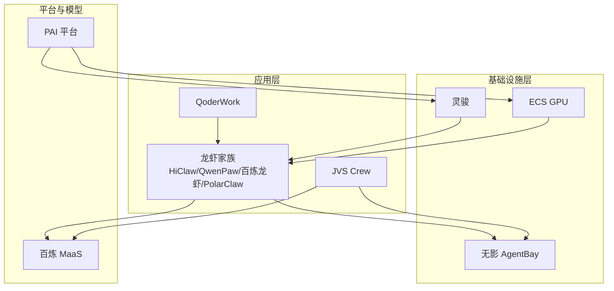
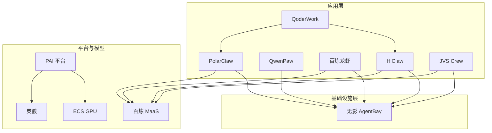
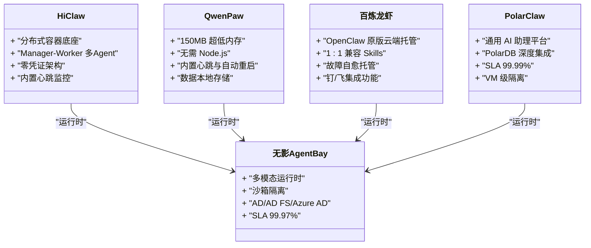
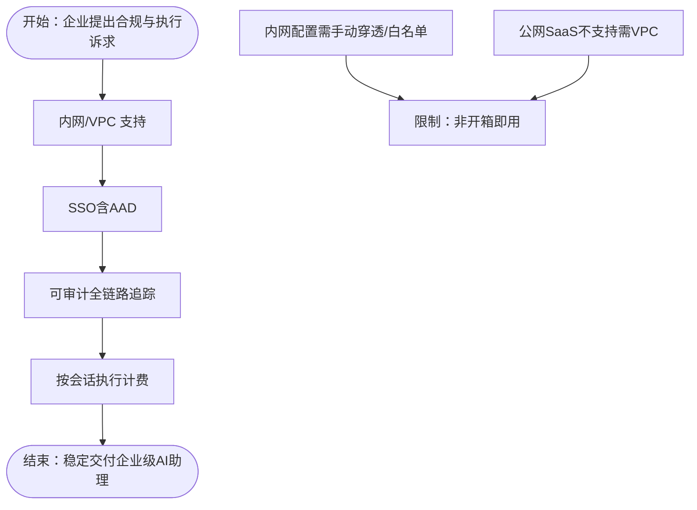
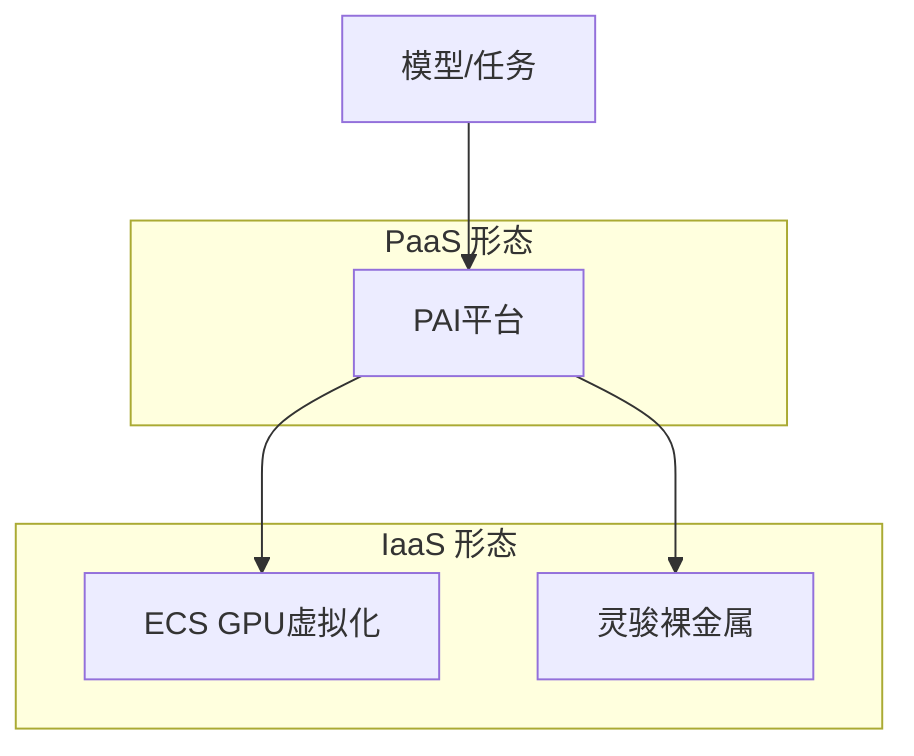
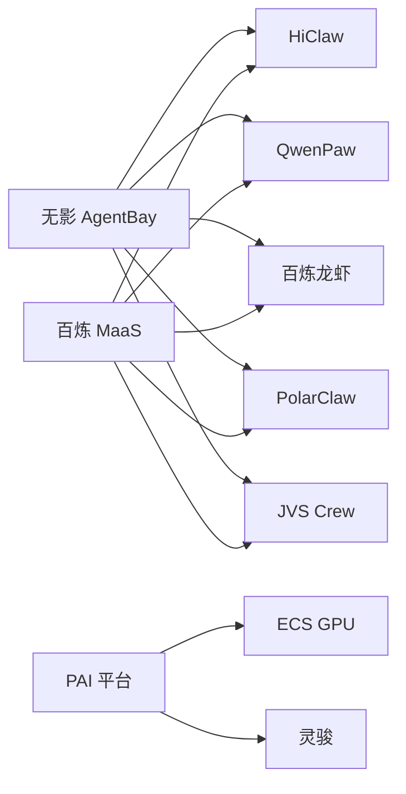

# 阿里云AI应用平台

<cite>
**本文引用的文件**
- [龙虾家族.md](file://knowledge/alibaba-cloud/ai-application/claw-family.md)
- [JVS Crew.md](file://knowledge/alibaba-cloud/ai-application/jvs-crew.md)
- [QoderWork.md](file://knowledge/alibaba-cloud/ai-application/qoder-work.md)
- [PAI.md](file://knowledge/alibaba-cloud/ai-platform/pai.md)
- [GPU产品线选型：ECS GPU vs 灵骏 vs PAI.md](file://knowledge/alibaba-cloud/ai-infra/gpu-product-line.md)
- [ECS GPU.md](file://knowledge/alibaba-cloud/ai-infra/ecs-gpu.md)
- [灵骏.md](file://knowledge/alibaba-cloud/ai-infra/lingjun.md)
- [LLM概览.md](file://knowledge/ai-general-notes/overview.md)
- [百炼平台.md](file://knowledge/alibaba-cloud/maas/overview.md)
- [Qoder.md](file://knowledge/alibaba-cloud/ai-coding/qoder.md)
</cite>

## 目录
1. [引言](#引言)
2. [项目结构](#项目结构)
3. [核心组件](#核心组件)
4. [架构总览](#架构总览)
5. [详细组件分析](#详细组件分析)
6. [依赖分析](#依赖分析)
7. [性能考虑](#性能考虑)
8. [故障排查指南](#故障排查指南)
9. [结论](#结论)
10. [附录](#附录)

## 引言
本文件系统性梳理阿里云AI应用平台的产品矩阵与技术架构，重点覆盖“龙虾家族”（HiClaw、QwenPaw、百炼龙虾、PolarClaw、无影AgentBay）的定位、能力边界与协同关系；深入解析JVS Crew视频生成应用在企业合规与执行层面的技术特点与适用场景；并结合QoderWork办公智能化解决方案的业务价值，阐释各产品在企业数字化转型中的互补与联动。同时，给出可落地的应用案例、集成方案与实施建议，并对平台在企业AI化过程中的作用进行总结。

## 项目结构
本仓库以主题域划分知识组织方式，AI应用平台相关内容主要分布在“阿里云/ai-application”“阿里云/ai-platform”“阿里云/ai-infra”“AI通用笔记”“阿里云/maas”“阿里云/ai-coding”等目录下。本文档聚焦以下核心文件，形成“产品-能力-架构-实施”的闭环认知。

图表来源
- [龙虾家族.md:1-137](file://knowledge/alibaba-cloud/ai-application/claw-family.md#L1-L137)
- [JVS Crew.md:1-96](file://knowledge/alibaba-cloud/ai-application/jvs-crew.md#L1-L96)
- [QoderWork.md:1-9](file://knowledge/alibaba-cloud/ai-application/qoder-work.md#L1-L9)
- [GPU产品线选型：ECS GPU vs 灵骏 vs PAI.md:1-114](file://knowledge/alibaba-cloud/ai-infra/gpu-product-line.md#L1-L114)
- [ECS GPU.md:1-9](file://knowledge/alibaba-cloud/ai-infra/ecs-gpu.md#L1-L9)
- [灵骏.md:1-9](file://knowledge/alibaba-cloud/ai-infra/lingjun.md#L1-L9)
- [PAI.md:1-9](file://knowledge/alibaba-cloud/ai-platform/pai.md#L1-L9)
- [百炼平台.md:1-9](file://knowledge/alibaba-cloud/maas/overview.md#L1-L9)

章节来源
- [龙虾家族.md:1-137](file://knowledge/alibaba-cloud/ai-application/claw-family.md#L1-L137)
- [JVS Crew.md:1-96](file://knowledge/alibaba-cloud/ai-application/jvs-crew.md#L1-L96)
- [QoderWork.md:1-9](file://knowledge/alibaba-cloud/ai-application/qoder-work.md#L1-L9)
- [GPU产品线选型：ECS GPU vs 灵骏 vs PAI.md:1-114](file://knowledge/alibaba-cloud/ai-infra/gpu-product-line.md#L1-L114)
- [ECS GPU.md:1-9](file://knowledge/alibaba-cloud/ai-infra/ecs-gpu.md#L1-L9)
- [灵骏.md:1-9](file://knowledge/alibaba-cloud/ai-infra/lingjun.md#L1-L9)
- [PAI.md:1-9](file://knowledge/alibaba-cloud/ai-platform/pai.md#L1-L9)
- [百炼平台.md:1-9](file://knowledge/alibaba-cloud/maas/overview.md#L1-L9)

## 核心组件
- 龙虾家族（应用层）
  - HiClaw：多智能体协作框架，Manager-Worker两级架构，强调企业级安全与零凭证、分布式容器底座、内置心跳监控。
  - QwenPaw：轻量个人Agent，超低内存占用，无需Node.js，内置心跳与自动重启，数据本地存储。
  - 百炼龙虾：OpenClaw云端托管版本，1:1兼容Skills生态，含故障自愈与钉/飞集成功能。
  - PolarClaw：通用AI助理平台+PolarDB深度优化，提供数据库直达能力（查询、SQL生成、性能调优、Supabase管理），SLA 99.99%，VM级隔离。
  - 无影 AgentBay：Agent执行基础设施，提供浏览器/云电脑/代码空间/云手机等多模态沙箱运行时，支持AD/AD FS/Azure AD SSO，SLA 99.97%。
- JVS Crew：企业级AI数字助理构建与托管平台，依托无影云电脑体系，强调内网/VPC、SSO（含AAD）、可审计、按会话执行计费。
- QoderWork：AI协作办公工具，面向业务用户，提供智能化办公能力。
- 平台与算力支撑
  - 百炼MaaS：统一模型服务与调用入口。
  - PAI：机器学习平台，提供训练/推理/MLOps全链路。
  - GPU产品线：ECS GPU（虚拟化）、灵骏（裸金属集群）、PAI（PaaS平台）三者在网络拓扑、管理粒度、运维复杂度上各有侧重。

章节来源
- [龙虾家族.md:16-137](file://knowledge/alibaba-cloud/ai-application/claw-family.md#L16-L137)
- [JVS Crew.md:16-96](file://knowledge/alibaba-cloud/ai-application/jvs-crew.md#L16-L96)
- [QoderWork.md:1-9](file://knowledge/alibaba-cloud/ai-application/qoder-work.md#L1-L9)
- [GPU产品线选型：ECS GPU vs 灵骏 vs PAI.md:16-114](file://knowledge/alibaba-cloud/ai-infra/gpu-product-line.md#L16-L114)
- [百炼平台.md:1-9](file://knowledge/alibaba-cloud/maas/overview.md#L1-L9)
- [PAI.md:1-9](file://knowledge/alibaba-cloud/ai-platform/pai.md#L1-L9)

## 架构总览
下图展示“应用-基础设施-平台/模型”的整体关系：应用层产品（HiClaw、QwenPaw、百炼龙虾、PolarClaw、JVS Crew）通过无影AgentBay获得安全隔离的运行时；应用层与百炼MaaS对接实现模型能力；PAI作为平台层承载训练与推理任务，底层可落于ECS GPU或灵骏裸金属集群。

图表来源
- [龙虾家族.md:26-88](file://knowledge/alibaba-cloud/ai-application/claw-family.md#L26-L88)
- [JVS Crew.md:16-56](file://knowledge/alibaba-cloud/ai-application/jvs-crew.md#L16-L56)
- [GPU产品线选型：ECS GPU vs 灵骏 vs PAI.md:39-44](file://knowledge/alibaba-cloud/ai-infra/gpu-product-line.md#L39-L44)
- [百炼平台.md:1-9](file://knowledge/alibaba-cloud/maas/overview.md#L1-L9)
- [PAI.md:1-9](file://knowledge/alibaba-cloud/ai-platform/pai.md#L1-L9)

## 详细组件分析

### 龙虾家族：产品矩阵与协同架构
- 产品定位与层级
  - 应用层：HiClaw、QwenPaw、百炼龙虾、PolarClaw
  - 基础设施层：无影 AgentBay
- 与OpenClaw的关系
  - HiClaw：基于OpenClaw的架构升级分支（Team版），分布式容器底座，Manager-Worker两级多Agent。
  - QwenPaw：非基于OpenClaw代码，基于AgentScope Runtime，与HiClaw架构理念相似但实现不同。
  - 百炼龙虾：OpenClaw原版云端托管，1:1兼容Skills生态。
  - PolarClaw：基于OpenClaw的企业级PaaS，兼容社区Skills，强化数据库直达能力。
  - 无影 AgentBay：与Agent应用无关，提供Agent运行时与安全沙箱。
- 能力对比与适用场景
  - 多Agent协作与企业安全：HiClaw（零凭证、心跳监控、分布式容器）。
  - 轻量个人Agent与低内存场景：QwenPaw（150MB、无需Node.js、本地数据存储）。
  - 云端托管与故障自愈：百炼龙虾（含钉/飞集成功能）。
  - 数据库直达与通用AI助理：PolarClaw（PolarDB深度集成、SLA 99.99%）。
  - 多模态运行时与SSO：无影 AgentBay（浏览器/云电脑/代码空间/云手机、AD/AD FS/Azure AD）。

图表来源
- [龙虾家族.md:36-88](file://knowledge/alibaba-cloud/ai-application/claw-family.md#L36-L88)

章节来源
- [龙虾家族.md:16-137](file://knowledge/alibaba-cloud/ai-application/claw-family.md#L16-L137)

### JVS Crew：企业级AI数字助理构建与托管
- 一句话定位：中国企业市场的Claude Managed Agents替代方案，不拼模型能力，拼企业级合规与采购体验。
- 四大差异化优势
  - 内网/VPC：满足数据不出域的合规要求，需配置穿透/白名单。
  - SSO（含AAD）：依托无影体系成熟的AD/AD FS/Azure AD能力，是企业采购“门票”。
  - 可审计：全链路追踪（执行轨迹+资源调用），支持操作日志回溯与人工介入/回滚。
  - 按会话执行计费：不跑不收钱，算力+Token透明拆分计费。
- 核心限制
  - 模型能力依赖百炼模型体系，与Claude系列有差距。
  - 内网配置需手动穿透/白名单，非开箱即用。
  - 公网SaaS不支持（需VPC），纯公网场景不如Claude Managed Agents简单。

图表来源
- [JVS Crew.md:18-67](file://knowledge/alibaba-cloud/ai-application/jvs-crew.md#L18-L67)

章节来源
- [JVS Crew.md:16-96](file://knowledge/alibaba-cloud/ai-application/jvs-crew.md#L16-L96)

### QoderWork：办公智能化解决方案
- 定位：AI协作办公工具，面向业务用户，提供智能化办公能力。
- 业务价值：提升日常办公效率，降低重复性工作负担，改善跨部门协作体验。
- 技术关联：可与HiClaw、PolarClaw等应用联动，形成“智能助理+数据库直达+运行时保障”的一体化办公闭环。

章节来源
- [QoderWork.md:1-9](file://knowledge/alibaba-cloud/ai-application/qoder-work.md#L1-L9)

### 平台与算力支撑：PAI与GPU产品线
- PAI：提供数据预处理→训练→推理→MLOps全链路，客户管任务不管机器，灵活度受限但零运维。
- GPU产品线三形态对比
  - ECS GPU（虚拟化）：通过直通/vGPU挂载GPU，网络走VPC，部分规格支持NVLink与RoCE/eRDMA。
  - 灵骏（裸金属）：物理GPU服务器+IB/eRDMA+CPFS文件系统，专为千卡/万卡分布式训练设计，支持SSH登录与自管。
  - PAI（PaaS）：自动调度底层资源（灵骏/ECS/ACK），提供开发工具与调度，客户管任务不管机器。
- 适用边界：根据网络拓扑需求、管理粒度、运维能力选择对应产品；PAI与灵骏常配合使用。

图表来源
- [GPU产品线选型：ECS GPU vs 灵骏 vs PAI.md:39-44](file://knowledge/alibaba-cloud/ai-infra/gpu-product-line.md#L39-L44)
- [ECS GPU.md:1-9](file://knowledge/alibaba-cloud/ai-infra/ecs-gpu.md#L1-L9)
- [灵骏.md:1-9](file://knowledge/alibaba-cloud/ai-infra/lingjun.md#L1-L9)
- [PAI.md:1-9](file://knowledge/alibaba-cloud/ai-platform/pai.md#L1-L9)

章节来源
- [GPU产品线选型：ECS GPU vs 灵骏 vs PAI.md:16-114](file://knowledge/alibaba-cloud/ai-infra/gpu-product-line.md#L16-L114)
- [ECS GPU.md:1-9](file://knowledge/alibaba-cloud/ai-infra/ecs-gpu.md#L1-L9)
- [灵骏.md:1-9](file://knowledge/alibaba-cloud/ai-infra/lingjun.md#L1-L9)
- [PAI.md:1-9](file://knowledge/alibaba-cloud/ai-platform/pai.md#L1-L9)

## 依赖分析
- 应用层对基础设施层的依赖
  - 无影 AgentBay为所有Agent应用提供统一的运行时与安全隔离，是应用层与底层算力解耦的关键。
- 应用层对模型服务的依赖
  - 百炼MaaS作为统一模型服务与调用入口，支撑HiClaw、QwenPaw、百炼龙虾、PolarClaw、JVS Crew的模型能力。
- 平台层对算力底座的依赖
  - PAI负责任务编排与调度，底层可落于ECS GPU或灵骏裸金属集群，满足不同网络与管理粒度需求。

图表来源
- [龙虾家族.md:77-87](file://knowledge/alibaba-cloud/ai-application/claw-family.md#L77-L87)
- [JVS Crew.md:47-56](file://knowledge/alibaba-cloud/ai-application/jvs-crew.md#L47-L56)
- [GPU产品线选型：ECS GPU vs 灵骏 vs PAI.md:39-44](file://knowledge/alibaba-cloud/ai-infra/gpu-product-line.md#L39-L44)
- [百炼平台.md:1-9](file://knowledge/alibaba-cloud/maas/overview.md#L1-L9)

章节来源
- [龙虾家族.md:77-87](file://knowledge/alibaba-cloud/ai-application/claw-family.md#L77-L87)
- [JVS Crew.md:47-56](file://knowledge/alibaba-cloud/ai-application/jvs-crew.md#L47-L56)
- [GPU产品线选型：ECS GPU vs 灵骏 vs PAI.md:39-44](file://knowledge/alibaba-cloud/ai-infra/gpu-product-line.md#L39-L44)
- [百炼平台.md:1-9](file://knowledge/alibaba-cloud/maas/overview.md#L1-L9)

## 性能考虑
- 网络拓扑与管理粒度
  - ECS GPU适用于轻量推理与开发测试，具备RoCE等高速网络能力；灵骏面向千/万卡分布式训练，提供最高管理粒度与灵活性；PAI以任务为中心，适合零运维需求。
- 算力成本与弹性
  - 根据任务规模与网络要求选择合适形态，避免“单一产品覆盖所有场景”的误区；PAI与灵骏常配合使用，兼顾效率与性能。
- 运行时稳定性
  - 无影 AgentBay提供多模态运行时与沙箱隔离，保障Agent在不同终端与环境下的稳定执行。

章节来源
- [GPU产品线选型：ECS GPU vs 灵骏 vs PAI.md:45-93](file://knowledge/alibaba-cloud/ai-infra/gpu-product-line.md#L45-L93)
- [ECS GPU.md:1-9](file://knowledge/alibaba-cloud/ai-infra/ecs-gpu.md#L1-L9)
- [灵骏.md:1-9](file://knowledge/alibaba-cloud/ai-infra/lingjun.md#L1-L9)
- [PAI.md:1-9](file://knowledge/alibaba-cloud/ai-platform/pai.md#L1-L9)

## 故障排查指南
- Agent运行异常
  - 检查无影 AgentBay运行时状态与沙箱隔离策略，确认会话级资源是否被正确释放。
  - 若为HiClaw/QwenPaw，关注内置心跳与自动重启机制是否生效。
- 模型调用失败
  - 核对百炼MaaS的可用性与配额，检查请求参数与权限配置。
- 数据库直达问题（PolarClaw）
  - 确认PolarDB连接配置与权限，核对SQL生成与性能调优策略。
- 企业合规与审计
  - JVS Crew需确保内网/VPC配置正确、SSO与审计日志完整，必要时进行人工回溯与干预。

章节来源
- [龙虾家族.md:47-75](file://knowledge/alibaba-cloud/ai-application/claw-family.md#L47-L75)
- [JVS Crew.md:47-56](file://knowledge/alibaba-cloud/ai-application/jvs-crew.md#L47-L56)
- [百炼平台.md:1-9](file://knowledge/alibaba-cloud/maas/overview.md#L1-L9)

## 结论
阿里云AI应用平台以“应用-基础设施-平台/模型”三层协同为核心，通过“龙虾家族”覆盖从个人Agent到企业级多Agent协作的全谱系需求；以JVS Crew补齐企业合规与执行计费的短板；以无影 AgentBay提供统一安全运行时；以百炼MaaS与PAI/灵骏/ECS GPU形成算力与平台闭环。该平台在企业数字化转型中扮演“智能助理+安全执行+弹性算力”的关键角色，既满足业务敏捷性，又保障合规与成本可控。

## 附录
- 应用案例与集成建议
  - 低门槛起步：QwenPaw + 百炼MaaS，快速验证个人Agent场景。
  - 企业协作：HiClaw + 无影 AgentBay + 百炼MaaS，构建多Agent协作与安全执行。
  - 数据库直达：PolarClaw + 百炼MaaS + 灵骏/PAI，实现SQL生成与性能调优。
  - 企业合规：JVS Crew + 无影 AgentBay + 百炼MaaS，满足内网/VPC、SSO与审计要求。
- 实施建议
  - 先从轻量场景（QwenPaw/百炼龙虾）验证业务价值，再逐步扩展至多Agent协作（HiClaw）与数据库直达（PolarClaw）。
  - 在合规敏感场景优先采用JVS Crew，结合无影 AgentBay实现端到端安全与审计。
  - 算力侧根据任务规模与网络要求选择ECS GPU/灵骏/PAI的组合，避免单一形态覆盖所有场景。

章节来源
- [龙虾家族.md:100-121](file://knowledge/alibaba-cloud/ai-application/claw-family.md#L100-L121)
- [JVS Crew.md:18-67](file://knowledge/alibaba-cloud/ai-application/jvs-crew.md#L18-L67)
- [GPU产品线选型：ECS GPU vs 灵骏 vs PAI.md:54-72](file://knowledge/alibaba-cloud/ai-infra/gpu-product-line.md#L54-L72)