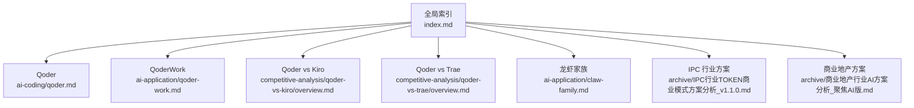
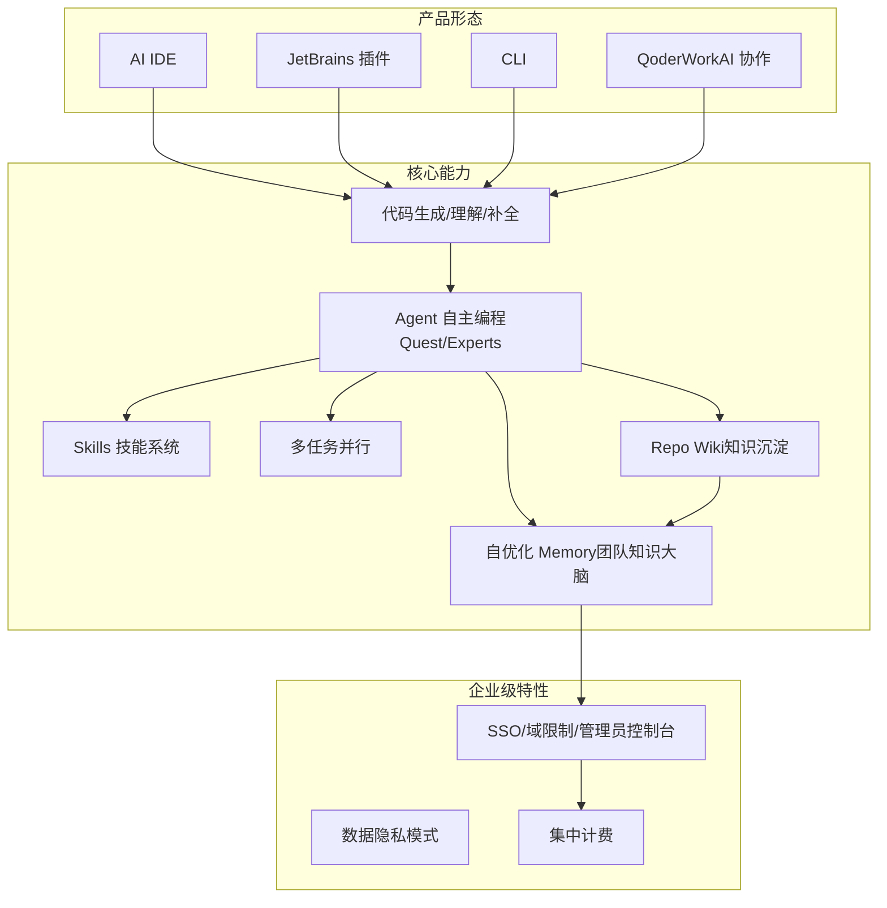
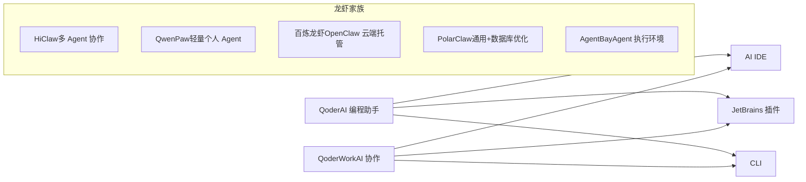
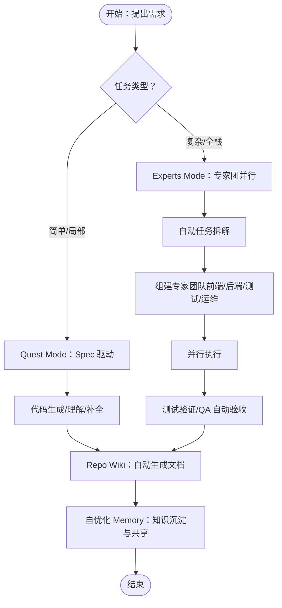
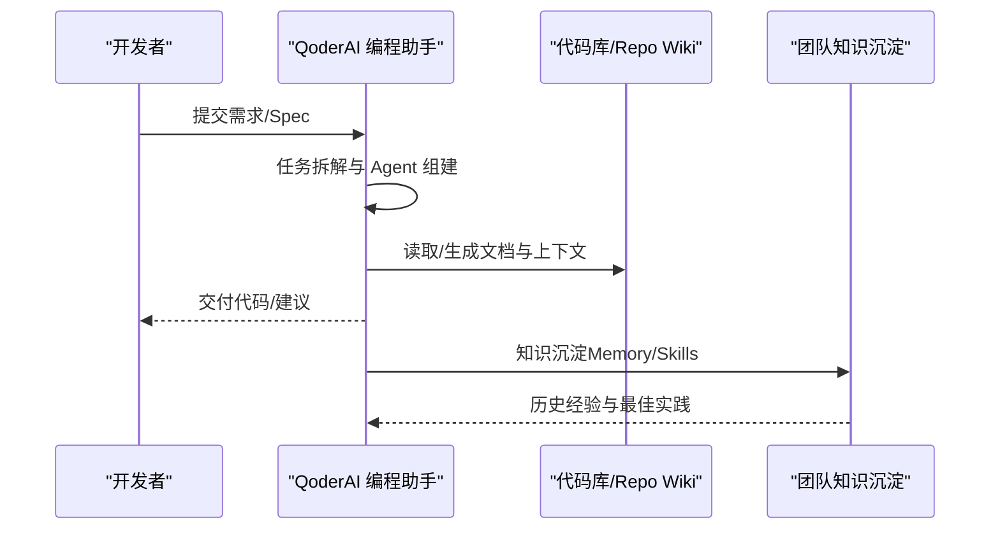
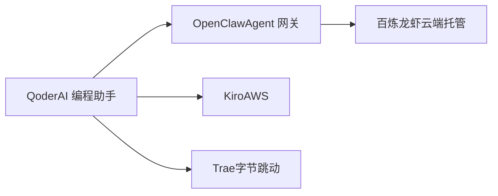

# AI 编程（Qoder）

<cite>
**本文引用的文件**
- [Qoder](file://knowledge/alibaba-cloud/ai-coding/qoder.md)
- [QoderWork](file://knowledge/alibaba-cloud/ai-application/qoder-work.md)
- [Qoder vs Kiro 产品分析](file://knowledge/alibaba-cloud/competitive-analysis/qoder-vs-kiro/overview.md)
- [Qoder vs Trae 竞争分析](file://knowledge/alibaba-cloud/competitive-analysis/qoder-vs-trae/overview.md)
- [“龙虾家族”AI Agent 产品全景](file://knowledge/alibaba-cloud/ai-application/claw-family.md)
- [IPC 行业 TOKEN 商业模式方案分析（v1.1.0）](file://archive/IPC行业TOKEN商业模式方案分析_v1.1.0.md)
- [商业地产行业 AI 方案分析（聚焦 AI 版）](file://archive/商业地产行业AI方案分析_聚焦AI版.md)
- [全局索引](file://index.md)
</cite>

## 目录
1. [简介](#简介)
2. [项目结构](#项目结构)
3. [核心组件](#核心组件)
4. [架构概览](#架构概览)
5. [详细组件分析](#详细组件分析)
6. [依赖分析](#依赖分析)
7. [性能考虑](#性能考虑)
8. [故障排查指南](#故障排查指南)
9. [结论](#结论)
10. [附录](#附录)

## 简介
本文件围绕阿里云 AI 编程助手 Qoder，系统梳理其定位、能力矩阵、技术架构、生态集成与选型建议，并结合行业案例与竞品分析，帮助读者全面理解 Qoder 在代码生成、代码理解、智能补全、团队协作与知识沉淀等方面的差异化优势，以及与传统 IDE 插件相比的升级价值。

## 项目结构
仓库中与 Qoder 相关的知识主要分布在以下区域：
- 产品定位与状态：Qoder、QoderWork
- 竞品对比：Qoder vs Kiro、Qoder vs Trae
- 产品矩阵：阿里云“龙虾家族”（HiClaw/QwenPaw/百炼龙虾/PolarClaw/AgentBay）
- 行业应用与定价：IPC/商业地产行业方案与 PPL 收入评估
- 全局索引：跨厂商与跨产品导航

**图表来源**
- [全局索引:1-69](file://index.md#L1-L69)
- [Qoder:1-9](file://knowledge/alibaba-cloud/ai-coding/qoder.md#L1-L9)
- [QoderWork:1-9](file://knowledge/alibaba-cloud/ai-application/qoder-work.md#L1-L9)
- [Qoder vs Kiro 产品分析:1-50](file://knowledge/alibaba-cloud/competitive-analysis/qoder-vs-kiro/overview.md#L1-L50)
- [Qoder vs Trae 竞争分析:1-214](file://knowledge/alibaba-cloud/competitive-analysis/qoder-vs-trae/overview.md#L1-L214)
- ["龙虾家族"AI Agent 产品全景:1-137](file://knowledge/alibaba-cloud/ai-application/claw-family.md#L1-L137)
- [IPC 行业 TOKEN 商业模式方案分析（v1.1.0）:300-490](file://archive/IPC行业TOKEN商业模式方案分析_v1.1.0.md#L300-L490)
- [商业地产行业 AI 方案分析（聚焦 AI 版）:200-342](file://archive/商业地产行业AI方案分析_聚焦AI版.md#L200-L342)

**章节来源**
- [全局索引:1-69](file://index.md#L1-L69)

## 核心组件
- 产品定位与形态
  - Qoder：AI 编程助手，面向开发者，提升编码效率。
  - QoderWork：AI 协作办公工具，面向业务用户。
- 产品矩阵与生态
  - “龙虾家族”包含多款围绕 OpenClaw 的应用层产品，覆盖个人 Agent、企业协作与云端托管等场景，体现阿里云在多 Agent 编排与执行环境上的整体布局。
- 竞品对比
  - Qoder vs Kiro：聚焦企业级能力差异与定价模式。
  - Qoder vs Trae：强调企业级协作、知识沉淀与 Experts Mode 的差异化定位。

**章节来源**
- [Qoder:1-9](file://knowledge/alibaba-cloud/ai-coding/qoder.md#L1-L9)
- [QoderWork:1-9](file://knowledge/alibaba-cloud/ai-application/qoder-work.md#L1-L9)
- ["龙虾家族"AI Agent 产品全景:1-137](file://knowledge/alibaba-cloud/ai-application/claw-family.md#L1-L137)
- [Qoder vs Kiro 产品分析:1-50](file://knowledge/alibaba-cloud/competitive-analysis/qoder-vs-kiro/overview.md#L1-L50)
- [Qoder vs Trae 竞争分析:1-214](file://knowledge/alibaba-cloud/competitive-analysis/qoder-vs-trae/overview.md#L1-L214)

## 架构概览
Qoder 的能力与定位可从“产品形态—核心能力—企业级特性—生态集成”的维度理解。下图给出概念性架构示意，帮助读者把握 Qoder 的整体能力边界与差异化优势。

说明
- 产品形态：AI IDE、JetBrains 插件、CLI、QoderWork，覆盖多场景使用入口。
- 核心能力：代码生成/理解/补全为基础，Agent 自主编程（Quest/Experts）为差异化亮点，配合 Skills、多任务并行、Repo Wiki 与自优化 Memory。
- 企业级特性：SSO/域限制/管理员控制台、数据隐私模式、集中计费，支撑企业合规与规模化落地。

（本图为概念示意，不直接映射具体源文件，故不附“图表来源”）

## 详细组件分析

### 1) 产品定位与形态
- Qoder：AI 编程助手，面向开发者，提升编码效率。
- QoderWork：AI 协作办公工具，面向业务用户。
- “龙虾家族”：HiClaw（多 Agent 协作框架）、QwenPaw（轻量个人 Agent）、百炼龙虾（OpenClaw 云端托管）、PolarClaw（通用 AI 助理+数据库深度优化）、AgentBay（Agent 云基础设施）。

**图表来源**
- [Qoder:1-9](file://knowledge/alibaba-cloud/ai-coding/qoder.md#L1-L9)
- [QoderWork:1-9](file://knowledge/alibaba-cloud/ai-application/qoder-work.md#L1-L9)
- ["龙虾家族"AI Agent 产品全景:1-137](file://knowledge/alibaba-cloud/ai-application/claw-family.md#L1-L137)

**章节来源**
- [Qoder:1-9](file://knowledge/alibaba-cloud/ai-coding/qoder.md#L1-L9)
- [QoderWork:1-9](file://knowledge/alibaba-cloud/ai-application/qoder-work.md#L1-L9)
- ["龙虾家族"AI Agent 产品全景:1-137](file://knowledge/alibaba-cloud/ai-application/claw-family.md#L1-L137)

### 2) 核心能力与技术特点
- 代码生成/理解/智能补全
  - 作为 AI 编程助手，Qoder 在代码生成、代码理解、智能补全方面具备基础能力，可显著提升开发者编码效率。
- Agent 自主编程（Quest Mode / Experts Mode）
  - Quest Mode：Spec 驱动的 AI 自主编程，自动完成需求分析→架构设计→代码实现→单元测试。
  - Experts Mode：专家团模式，主 Agent + 多子 Agent 并行，具备自进化学习与团队技能沉淀能力，覆盖方案设计→编码→测试→QA 自动验收的完整流程。
- Skills 技能系统与多任务并行
  - 支持 Expert Skill 与 Team Skill，天然支持多任务并行，适合复杂全栈任务与跨模块开发。
- 知识沉淀与自优化 Memory
  - Repo Wiki 基于代码自动生成结构化文档，持续跟踪代码变更并自动更新；自优化 Memory 支持个人与团队知识沉淀与共享。

**图表来源**
- [Qoder vs Trae 竞争分析:39-81](file://knowledge/alibaba-cloud/competitive-analysis/qoder-vs-trae/overview.md#L39-L81)

**章节来源**
- [Qoder vs Trae 竞争分析:39-81](file://knowledge/alibaba-cloud/competitive-analysis/qoder-vs-trae/overview.md#L39-L81)

### 3) 与传统 IDE 插件的差异与升级价值
- 传统 IDE 插件多侧重“增强现有工作流”，而 Qoder 将“Agent 自主编程”引入 IDE，实现从“人工驱动”到“AI 驱动”的升级。
- 通过 Experts Mode 的多 Agent 并行与 Repo Wiki 的知识沉淀，Qoder 更适合团队协作与长期演进，解决“知识流失”“重复劳动”“跨角色协调”等痛点。

**章节来源**
- [Qoder vs Trae 竞争分析:93-116](file://knowledge/alibaba-cloud/competitive-analysis/qoder-vs-trae/overview.md#L93-L116)

### 4) 使用场景与集成案例
- 代码生成：在需求明确或 Spec 驱动场景下，快速生成高质量代码。
- 重构建议：利用 Experts Mode 的多角色协作，自动输出架构与实现建议。
- 错误诊断：结合测试与 QA 自动验收，辅助定位与修复问题。
- 集成案例（行业应用）
  - 商业地产：在外包项目中试点 Qoder，验证在代码生成、代码审查、Bug 修复、文档生成、单元测试编写等场景的提效效果，预期缩短外包项目开发周期 20%-40%。
  - IPC 行业：以 PPL（按人头许可）模式评估收入，按研发人员规模测算月收入，覆盖制造+品牌层、品牌商层、IoT 平台层，形成规模化复制路径。

**图表来源**
- [Qoder vs Trae 竞争分析:39-81](file://knowledge/alibaba-cloud/competitive-analysis/qoder-vs-trae/overview.md#L39-L81)
- [商业地产行业 AI 方案分析（聚焦 AI 版）:279-298](file://archive/商业地产行业AI方案分析_聚焦AI版.md#L279-L298)

**章节来源**
- [Qoder vs Trae 竞争分析:39-81](file://knowledge/alibaba-cloud/competitive-analysis/qoder-vs-trae/overview.md#L39-L81)
- [商业地产行业 AI 方案分析（聚焦 AI 版）:279-298](file://archive/商业地产行业AI方案分析_聚焦AI版.md#L279-L298)

### 5) 不同编程语言与开发环境的适配
- 适配范围：Qoder 作为 AI 编程助手，可在多种主流语言与开发环境中使用，覆盖 AI IDE、JetBrains 插件与 CLI 等入口。
- 企业级落地：通过 SSO/域限制/管理员控制台与数据隐私模式，满足金融/政企等合规要求；通过集中计费与团队协作能力，支撑大规模研发团队的统一管理与知识沉淀。

**章节来源**
- [Qoder vs Trae 竞争分析:132-147](file://knowledge/alibaba-cloud/competitive-analysis/qoder-vs-trae/overview.md#L132-L147)

### 6) 选型建议与最佳实践
- 选型建议
  - 需要团队协作 + 知识沉淀：推荐 Qoder（完整知识共享池、Memory 同步、Repo Wiki）。
  - 需要专家团多 Agent 协作：推荐 Qoder（Experts Mode 唯一提供角色分工与多 Agent 并行）。
  - 企业级安全合规要求：推荐 Qoder（SSO、域限制、管理员控制台、集中计费）。
  - 个人开发者零成本使用：Trae 中国版（SOLO 完全免费）。
  - 海外开发者需要 GPT/Gemini：Trae 国际版（支持最新海外模型）。
- 最佳实践
  - 从试点项目开始，逐步建立 AI 编程规范与代码审查标准，覆盖代码生成、审查、Bug 修复、文档生成、单元测试编写等场景。
  - 结合 Repo Wiki 与自优化 Memory，沉淀团队知识资产，形成“使用→沉淀→依赖→迁移成本上升”的正向循环。

**章节来源**
- [Qoder vs Trae 竞争分析:192-201](file://knowledge/alibaba-cloud/competitive-analysis/qoder-vs-trae/overview.md#L192-L201)
- [Qoder vs Trae 竞争分析:166-191](file://knowledge/alibaba-cloud/competitive-analysis/qoder-vs-trae/overview.md#L166-L191)
- [Qoder vs Trae 竞争分析:117-131](file://knowledge/alibaba-cloud/competitive-analysis/qoder-vs-trae/overview.md#L117-L131)
- [商业地产行业 AI 方案分析（聚焦 AI 版）:279-298](file://archive/商业地产行业AI方案分析_聚焦AI版.md#L279-L298)

## 依赖分析
- 产品生态
  - Qoder 与“龙虾家族”中的百炼龙虾（OpenClaw 云端托管）存在生态关联，体现阿里云在 Agent 编排与托管方面的整体布局。
- 竞品关系
  - Qoder vs Kiro：聚焦企业级能力差异与定价模式。
  - Qoder vs Trae：强调企业级协作、知识沉淀与 Experts Mode 的差异化定位。

**图表来源**
- ["龙虾家族"AI Agent 产品全景:26-34](file://knowledge/alibaba-cloud/ai-application/claw-family.md#L26-L34)
- [Qoder vs Kiro 产品分析:1-50](file://knowledge/alibaba-cloud/competitive-analysis/qoder-vs-kiro/overview.md#L1-L50)
- [Qoder vs Trae 竞争分析:1-214](file://knowledge/alibaba-cloud/competitive-analysis/qoder-vs-trae/overview.md#L1-L214)

**章节来源**
- ["龙虾家族"AI Agent 产品全景:26-34](file://knowledge/alibaba-cloud/ai-application/claw-family.md#L26-L34)
- [Qoder vs Kiro 产品分析:1-50](file://knowledge/alibaba-cloud/competitive-analysis/qoder-vs-kiro/overview.md#L1-L50)
- [Qoder vs Trae 竞争分析:1-214](file://knowledge/alibaba-cloud/competitive-analysis/qoder-vs-trae/overview.md#L1-L214)

## 性能考虑
- 多 Agent 并行与任务拆解可显著缩短复杂项目的开发周期，但需关注团队协作与知识沉淀的成本与收益平衡。
- Repo Wiki 与自优化 Memory 的持续更新与共享，有助于降低知识流失风险，提升长期开发效率。
- 企业级特性（SSO/域限制/管理员控制台/数据隐私模式/集中计费）在保障合规的同时，也提升了规模化管理的效率与稳定性。

（本节为通用讨论，不直接分析具体文件，故不附“章节来源”）

## 故障排查指南
- 企业级合规与权限
  - 若遇到 SSO/域限制/管理员控制台相关问题，建议核查账户域设置与管理员控制台配置，确保符合企业数据隐私模式要求。
- 知识沉淀与协作
  - 若 Repo Wiki 或 Memory 更新异常，建议检查代码变更触发机制与团队协作权限设置，确保知识沉淀流程顺畅。
- 与竞品对比
  - 若与 Trae/Kiro 存在功能差异，可参考竞品分析文档中的定位与能力矩阵，明确自身优势与取舍。

**章节来源**
- [Qoder vs Trae 竞争分析:132-147](file://knowledge/alibaba-cloud/competitive-analysis/qoder-vs-trae/overview.md#L132-L147)
- [Qoder vs Trae 竞争分析:166-191](file://knowledge/alibaba-cloud/competitive-analysis/qoder-vs-trae/overview.md#L166-L191)

## 结论
Qoder 作为阿里云 AI 编程助手，以“Agent 自主编程 + 知识沉淀 + 企业级特性”为核心差异化优势，面向中大型研发团队提供从需求到交付的全链路能力。相较传统 IDE 插件，Qoder 更强调“团队协作、知识资产沉淀与企业级合规”，在复杂项目与长期演进场景中具备更强的规模化价值。结合行业案例与竞品分析，Qoder 更适合需要专家团模式、Repo Wiki 与集中管理的企业客户。

## 附录
- 行业应用与定价
  - 商业地产：通过试点项目验证 Qoder 在代码生成、审查、Bug 修复、文档生成、单元测试编写等场景的提效效果，形成规模化复制路径。
  - IPC 行业：以 PPL（按人头许可）模式评估收入，按研发人员规模测算月收入，覆盖制造+品牌层、品牌商层、IoT 平台层，形成规模化复制路径。

**章节来源**
- [商业地产行业 AI 方案分析（聚焦 AI 版）:215-222](file://archive/商业地产行业AI方案分析_聚焦AI版.md#L215-L222)
- [IPC 行业 TOKEN 商业模式方案分析（v1.1.0）:310-327](file://archive/IPC行业TOKEN商业模式方案分析_v1.1.0.md#L310-L327)