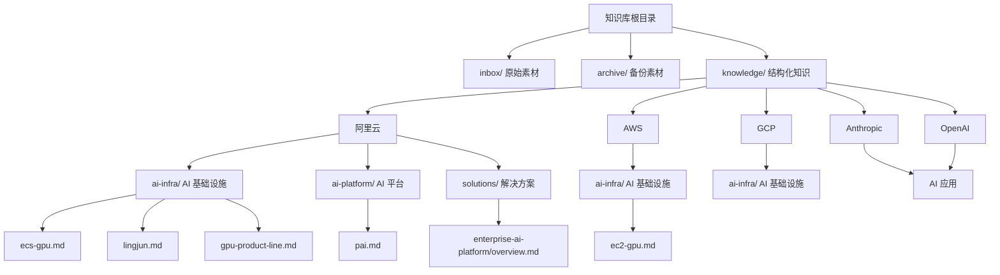
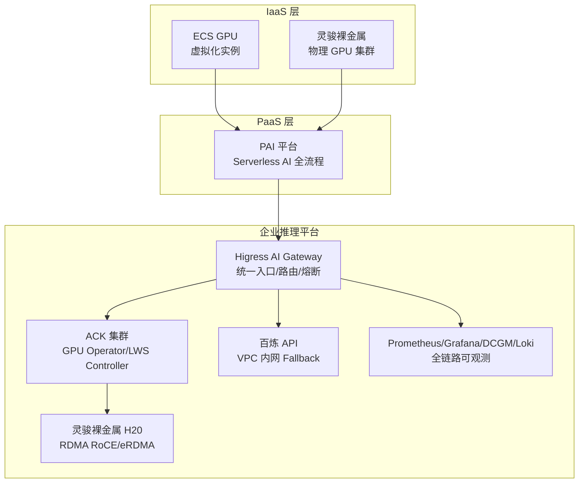
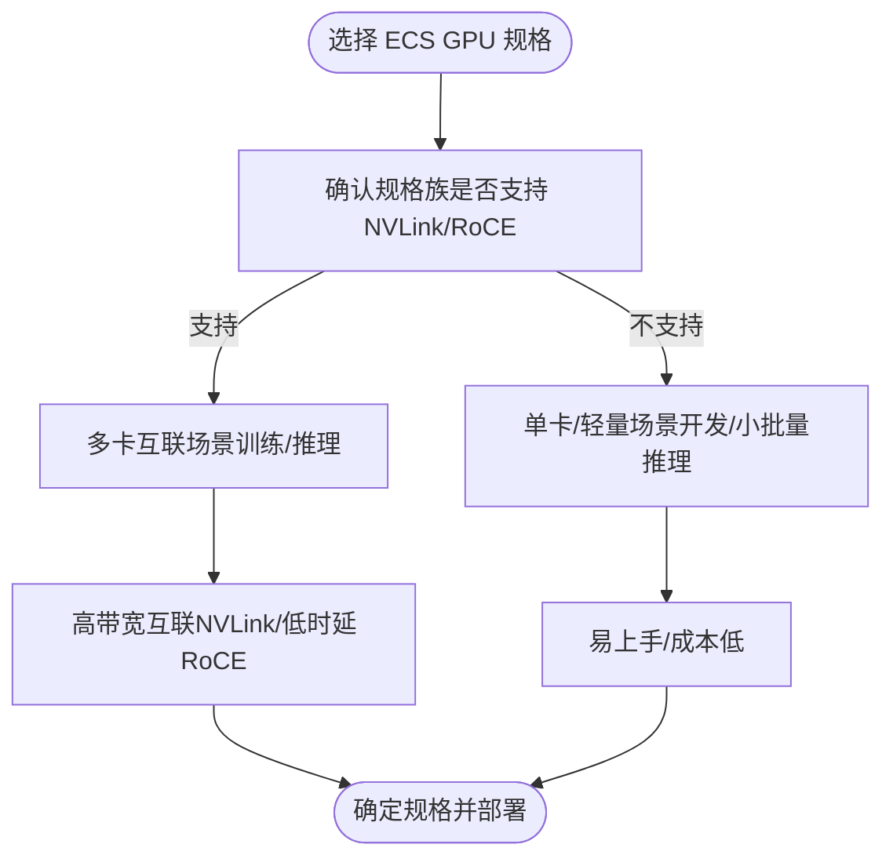
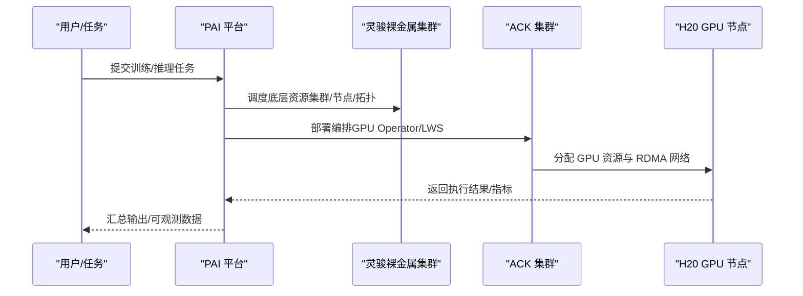
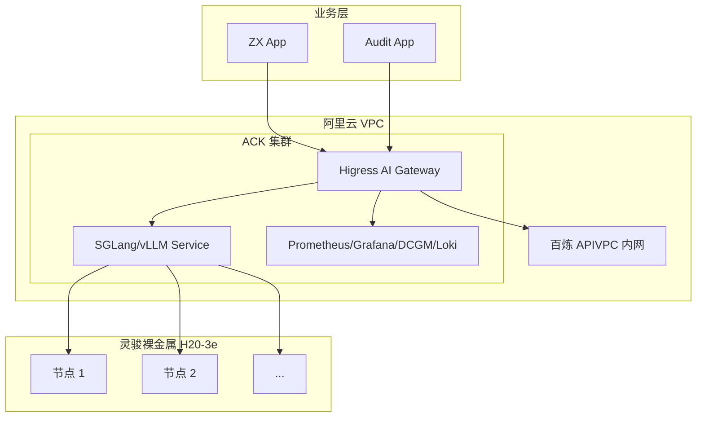
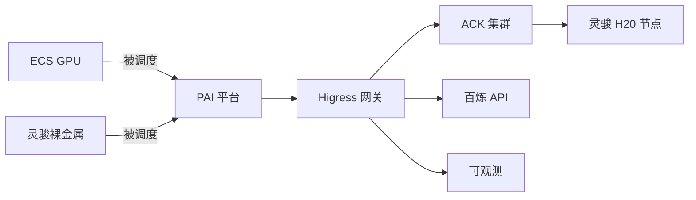
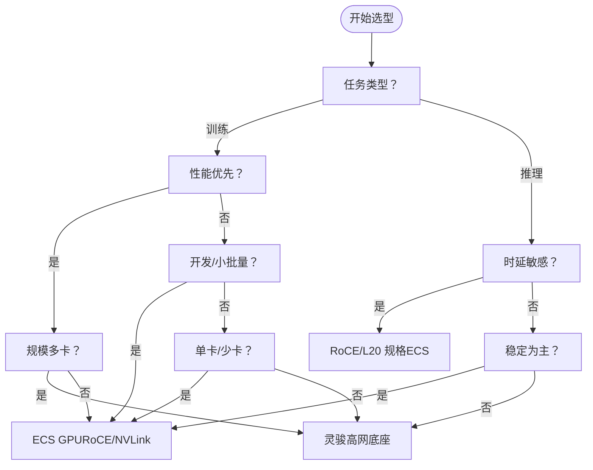

# AI Infrastructure（AI基础设施）

<cite>
**本文引用的文件**
- [知识库总览](file://README.md)
- [ECS GPU](file://knowledge/alibaba-cloud/ai-infra/ecs-gpu.md)
- [灵骏](file://knowledge/alibaba-cloud/ai-infra/lingjun.md)
- [PAI 平台](file://knowledge/alibaba-cloud/ai-platform/pai.md)
- [阿里云 GPU 产品线选型：ECS GPU vs 灵骏 vs PAI](file://knowledge/alibaba-cloud/ai-infra/gpu-product-line.md)
- [企业自建 AI 推理平台解决方案](file://knowledge/solutions/enterprise-ai-platform/overview.md)
- [AWS EC2 GPU](file://knowledge/aws/ai-infra/ec2-gpu.md)
</cite>

## 目录
1. [引言](#引言)
2. [项目结构](#项目结构)
3. [核心组件](#核心组件)
4. [架构总览](#架构总览)
5. [详细组件分析](#详细组件分析)
6. [依赖分析](#依赖分析)
7. [性能考量](#性能考量)
8. [故障排查指南](#故障排查指南)
9. [结论](#结论)
10. [附录](#附录)

## 引言
本文件系统化梳理阿里云 AI 基础设施的完整体系，聚焦以下目标：
- 全面介绍阿里云 GPU 算力供给的三种形态：IaaS（ECS GPU/灵骏）、PaaS（PAI），以及它们在网络拓扑、管理粒度、运维复杂度上的差异与适用边界。
- 深入解析灵骏 GPU 服务器的技术规格与部署优势，结合企业级推理平台实战案例，给出硬件配置建议、成本优化与性能调优方案。
- 提供面向 AI 训练与推理场景的选型策略与决策树，帮助企业在不同阶段与预算下做出合理选择。

## 项目结构
本知识库以“领域-组织-主题”方式组织内容，AI 基础设施相关文档主要分布在“阿里云/ai-infra”“阿里云/ai-platform”“解决方案/enterprise-ai-platform”等目录，并辅以竞品对比（如 AWS EC2 GPU）。

**图表来源**
- [知识库总览:1-20](file://README.md#L1-L20)

**章节来源**
- [知识库总览:1-20](file://README.md#L1-L20)

## 核心组件
- ECS GPU（虚拟化实例）
  - 通过直通或 vGPU 方式挂载 GPU，网络走 VPC；部分规格支持 NVLink 与 RoCE/eRDMA。
  - 代表性规格：gn8v（8 卡间支持 NVLink，带宽约 900GB/s）、gn8is（L20，支持 ERI/RoCE v2）。
  - 适用：单卡/少卡推理、轻量训练/开发测试。
- 灵骏智算服务（裸金属 GPU 集群）
  - 物理 GPU 服务器 + Infiniband/eRDMA + CPFS 文件系统，专为千卡/万卡级分布式训练设计。
  - 客户可 SSH 登录，自行管理底层，适合 H200、H20-141G 等大卡场景。
  - 适用：大规模训练、对网络与管理粒度要求高的场景。
- PAI 平台（Serverless AI 平台）
  - PaaS 层，自动调度底层资源（灵骏/ECS/ACK），提供数据预处理→训练→推理→MLOps 全链路。
  - 适用：零运维需求、希望以任务为中心的场景。

**章节来源**
- [阿里云 GPU 产品线选型：ECS GPU vs 灵骏 vs PAI:16-94](file://knowledge/alibaba-cloud/ai-infra/gpu-product-line.md#L16-L94)
- [ECS GPU:1-9](file://knowledge/alibaba-cloud/ai-infra/ecs-gpu.md#L1-L9)
- [灵骏:1-9](file://knowledge/alibaba-cloud/ai-infra/lingjun.md#L1-L9)
- [PAI 平台:1-9](file://knowledge/alibaba-cloud/ai-platform/pai.md#L1-L9)

## 架构总览
下图展示了阿里云 AI 基础设施的三层能力：IaaS（ECS GPU/灵骏）、PaaS（PAI），以及在企业推理平台中的典型落地路径。

**图表来源**
- [阿里云 GPU 产品线选型：ECS GPU vs 灵骏 vs PAI:39-93](file://knowledge/alibaba-cloud/ai-infra/gpu-product-line.md#L39-L93)
- [企业自建 AI 推理平台解决方案:46-127](file://knowledge/solutions/enterprise-ai-platform/overview.md#L46-L127)

## 详细组件分析

### ECS GPU 组件分析
- 资源挂载与网络
  - GPU 通过直通或 vGPU 挂载到实例，网络走 VPC；部分规格支持 NVLink 与 RoCE/eRDMA。
  - gn8v：8 卡间支持 NVLink（带宽约 900GB/s），适合多卡互联场景。
  - gn8is（L20）：支持 ERI（RoCE v2），具备更好的 RDMA 能力，适合低时延通信。
- 适用场景
  - 单卡/少卡推理（如 L20 gn8is）。
  - 轻量训练/开发测试。
- 限制与注意事项
  - 能力因规格族而异，需按需查证具体规格的网络与互联能力。

**图表来源**
- [阿里云 GPU 产品线选型：ECS GPU vs 灵骏 vs PAI:24-31](file://knowledge/alibaba-cloud/ai-infra/gpu-product-line.md#L24-L31)

**章节来源**
- [阿里云 GPU 产品线选型：ECS GPU vs 灵骏 vs PAI:24-31](file://knowledge/alibaba-cloud/ai-infra/gpu-product-line.md#L24-L31)
- [ECS GPU:1-9](file://knowledge/alibaba-cloud/ai-infra/ecs-gpu.md#L1-L9)

### 灵骏组件分析
- 技术规格与优势
  - 物理 GPU 服务器 + IB/eRDMA + CPFS 文件系统，面向千卡/万卡级分布式训练。
  - 支持 SSH 登录，客户可自行管理底层，适合 H200、H20-141G 等大卡场景。
  - 在企业推理平台实战中，采用 8 台 H20-3e（每台 8 卡）的裸金属集群，结合 RDMA RoCE 与多副本 DP 策略，平衡性能与成本。
- 适用场景
  - 大规模训练（H200 等）。
  - 对网络拓扑与管理粒度有较高要求的场景。
- 与 PAI 的关系
  - 灵骏是“底座”，PAI 是“平台”。二者常配合使用：PAI 下发任务到灵骏集群，兼顾效率与性能。

**图表来源**
- [阿里云 GPU 产品线选型：ECS GPU vs 灵骏 vs PAI:39-93](file://knowledge/alibaba-cloud/ai-infra/gpu-product-line.md#L39-L93)
- [企业自建 AI 推理平台解决方案:46-127](file://knowledge/solutions/enterprise-ai-platform/overview.md#L46-L127)

**章节来源**
- [阿里云 GPU 产品线选型：ECS GPU vs 灵骏 vs PAI:32-44](file://knowledge/alibaba-cloud/ai-infra/gpu-product-line.md#L32-L44)
- [灵骏:1-9](file://knowledge/alibaba-cloud/ai-infra/lingjun.md#L1-L9)
- [企业自建 AI 推理平台解决方案:137-170](file://knowledge/solutions/enterprise-ai-platform/overview.md#L137-L170)

### PAI 平台组件分析
- 能力与定位
  - PaaS 层，自动调度底层资源（灵骏/ECS/ACK），提供数据预处理→训练→推理→MLOps 全链路。
  - 适合零运维需求、以任务为中心的场景。
- 与灵骏的关系
  - 底座 vs 平台，常配合使用：PAI 任务下发到灵骏集群，兼顾效率与性能。

**章节来源**
- [阿里云 GPU 产品线选型：ECS GPU vs 灵骏 vs PAI:39-44](file://knowledge/alibaba-cloud/ai-infra/gpu-product-line.md#L39-L44)
- [PAI 平台:1-9](file://knowledge/alibaba-cloud/ai-platform/pai.md#L1-L9)

### 企业推理平台实战（灵骏 + 网关 + Fallback）
- 架构要点
  - 三层架构：业务层 → 阿里云 VPC → ACK 集群 → 灵骏裸金属 H20（RDMA RoCE）。
  - 统一网关（Higress AI Gateway）：统一入口、AI 路由、限流/鉴权、审计日志、健康检查与熔断。
  - 混合推理双轨：自建 GPU 主力 + 百炼 API Fallback，自动切换保障业务连续性。
  - 全链路可观测：Prometheus + Grafana + DCGM Exporter + Loki，覆盖网关→推理引擎→GPU 卡级指标。
- 节点规划与 TP 策略
  - 节点规划：控制面（ECS 3 节点 HA）、业务节点（ECS 2 节点）、GPU 推理节点（灵骏裸金属 H20-3e，8 台设计）。
  - TP 策略建议：≤72B 模型单机 TP=8；72B~200B 采用单机 TP=8 + 多副本 DP；>200B 或追求极低 TTFT 时启用跨机 TP（LWS + RDMA）。
- 产品组合推荐
  - AI 网关层：Higress AI Gateway（v2.1.9+，Helm 部署，2-3 副本 HA，挂载 SLB/ALB）。
  - GPU 计算层：阿里云灵骏裸金属 H20-3e（8 卡/台，141GB HBM3，分批纳管）。
  - 推理框架：SGLang（主）/ vLLM（辅），Ubuntu 24.04 + CUDA 13.0。
  - K8s 编排：ACK 托管版（v1.34.6+），含 GPU Operator + LWS Controller。
  - 跨机互联：RDMA RoCE + Multus CNI，Mellanox ConnectX NIC，macvlan 模式。
  - 云端 Fallback：百炼 API（VPC Endpoint 内网访问，按需付费）。
  - 缓存层：Redis Stack Server（Higress 已内置，可扩展为 Prompt 语义缓存）。
  - 存储层：阿里云 NAS（模型文件 RWX 静态 PV + 监控日志动态供给）。
  - 可观测：Prometheus + Grafana + DCGM Exporter + Loki。

**图表来源**
- [企业自建 AI 推理平台解决方案:46-127](file://knowledge/solutions/enterprise-ai-platform/overview.md#L46-L127)
- [企业自建 AI 推理平台解决方案:157-170](file://knowledge/solutions/enterprise-ai-platform/overview.md#L157-L170)

**章节来源**
- [企业自建 AI 推理平台解决方案:1-273](file://knowledge/solutions/enterprise-ai-platform/overview.md#L1-L273)

## 依赖分析
- 组件耦合与协作
  - ECS GPU 与 PAI：ECS 作为 IaaS 资源被 PAI 自动调度，适合轻量/开发场景。
  - 灵骏与 PAI：灵骏提供高网底座，PAI 提供开发平台，二者常配合使用。
  - 企业推理平台：Higress 网关依赖 ACK 集群与 GPU Operator/LWS Controller，调度灵骏裸金属；百炼 API 作为 Fallback。
- 外部依赖与竞品对照
  - 竞品维度：虚拟化 GPU（ECS GPU vs EC2 GPU）、高速网络（ERI/RoCE vs EFA）、裸金属（灵骏 vs EC2 Bare Metal）、AI 平台（PAI vs SageMaker/Vertex AI）。

**图表来源**
- [阿里云 GPU 产品线选型：ECS GPU vs 灵骏 vs PAI:39-93](file://knowledge/alibaba-cloud/ai-infra/gpu-product-line.md#L39-L93)
- [企业自建 AI 推理平台解决方案:46-127](file://knowledge/solutions/enterprise-ai-platform/overview.md#L46-L127)

**章节来源**
- [阿里云 GPU 产品线选型：ECS GPU vs 灵骏 vs PAI:95-103](file://knowledge/alibaba-cloud/ai-infra/gpu-product-line.md#L95-L103)
- [AWS EC2 GPU:1-9](file://knowledge/aws/ai-infra/ec2-gpu.md#L1-L9)

## 性能考量
- 网络拓扑与互联
  - NVLink（gn8v）：8 卡间高带宽互联，适合多卡通信密集型训练。
  - RoCE/ERI（gn8is/L20）：低时延 RDMA，适合需要低延迟通信的推理与训练场景。
  - 灵骏 RDMA RoCE：跨机 Tensor Parallel 通信，保障大规模分布式训练性能。
- 训练与推理场景差异
  - 训练：强调高带宽互联（NVLink）与大规模并行（多机多卡），优先选择灵骏或具备 NVLink/RDMA 的 ECS 规格。
  - 推理：强调低时延与稳定性，优先选择 RoCE/L20 规格或企业推理平台中的 RDMA 配置。
- TP 策略与成本
  - ≤72B 模型：单机 TP=8，避免跨机通信开销。
  - 72B~200B：单机 TP=8 + 多副本 DP，ROI 更高。
  - >200B 或追求极低 TTFT：启用跨机 TP（LWS + RDMA）。
- 可观测与稳定性
  - 全链路可观测（Token 统计、延迟/吞吐、GPU 利用率/温度）有助于及时发现瓶颈与异常。
  - Fallback 机制（健康检查 + 限流降级 + 熔断）保障业务连续性。

**章节来源**
- [阿里云 GPU 产品线选型：ECS GPU vs 灵骏 vs PAI:24-31](file://knowledge/alibaba-cloud/ai-infra/gpu-product-line.md#L24-L31)
- [企业自建 AI 推理平台解决方案:147-154](file://knowledge/solutions/enterprise-ai-platform/overview.md#L147-L154)
- [企业自建 AI 推理平台解决方案:211-238](file://knowledge/solutions/enterprise-ai-platform/overview.md#L211-L238)

## 故障排查指南
- Higress 网关高可用
  - 副本数不足：当前 1 副本存在单点风险，建议扩容至 2-3 副本并配置反亲和与 SLB 负载。
- Fallback 触发条件
  - 明确健康检查超时次数、队列深度阈值、错误率熔断规则，避免“双轨”成冷备。
- 灵骏 + Ubuntu 兼容性
  - MOFED 版本与 aiext kernel 需锁定版本；NCCL_IB_HCA 等参数需显式配置。
- 跨机 TP 必要性评估
  - H20 单机显存（1,128GB）足以覆盖 ≤72B 模型，多副本 DP 通常 ROI 更高。
- DCGM Exporter
  - 若 AVAILABLE=0，检查 readiness probe 配置问题，确保 GPU 卡级指标采集正常。

**章节来源**
- [企业自建 AI 推理平台解决方案:204-238](file://knowledge/solutions/enterprise-ai-platform/overview.md#L204-L238)

## 结论
- 阿里云 AI 基础设施以“IaaS（ECS GPU/灵骏）+ PaaS（PAI）”为核心，覆盖从轻量开发到超大规模训练的全谱系场景。
- 灵骏提供高网底座与裸金属管理能力，适合 H200/H20-141G 等大卡场景；ECS GPU 适合单卡/少卡推理与轻量训练；PAI 则提供以任务为中心的全链路开发平台。
- 企业推理平台实战表明：统一网关 + 灵骏裸金属 + 百炼 API Fallback + 全链路可观测，可在保证业务连续性的同时实现性能与成本的平衡。
- 选型建议：先评估模型规模与网络需求，再决定是否启用跨机 TP 与 RDMA；在预算有限时优先采用多副本 DP 策略；在合规与可观测方面提前规划，避免后期返工。

## 附录

### 选型决策树（训练/推理场景）

**图表来源**
- [阿里云 GPU 产品线选型：ECS GPU vs 灵骏 vs PAI:54-80](file://knowledge/alibaba-cloud/ai-infra/gpu-product-line.md#L54-L80)
- [企业自建 AI 推理平台解决方案:147-154](file://knowledge/solutions/enterprise-ai-platform/overview.md#L147-L154)

### 硬件配置与成本优化建议
- 硬件配置
  - 推理：优先 gn8is（L20，RoCE）或具备 NVLink 的规格；企业平台建议采用灵骏裸金属 H20-3e（8 卡/台）。
  - 训练：优先具备 NVLink/RDMA 的规格；大规模场景采用灵骏集群。
- 成本优化
  - ≤72B 模型：单机 TP=8，避免跨机通信带来的成本与复杂度。
  - 72B~200B：采用多副本 DP，ROI 更高。
  - 分批纳管：先接入少量节点验证，再按业务量逐步扩容。
- 性能调优
  - 明确 Fallback 触发条件，保障业务连续性。
  - 配置 RDMA RoCE 参数，确保跨机通信性能。
  - 建立全链路可观测体系，前置发现与定位问题。

**章节来源**
- [企业自建 AI 推理平台解决方案:137-170](file://knowledge/solutions/enterprise-ai-platform/overview.md#L137-L170)
- [企业自建 AI 推理平台解决方案:211-238](file://knowledge/solutions/enterprise-ai-platform/overview.md#L211-L238)