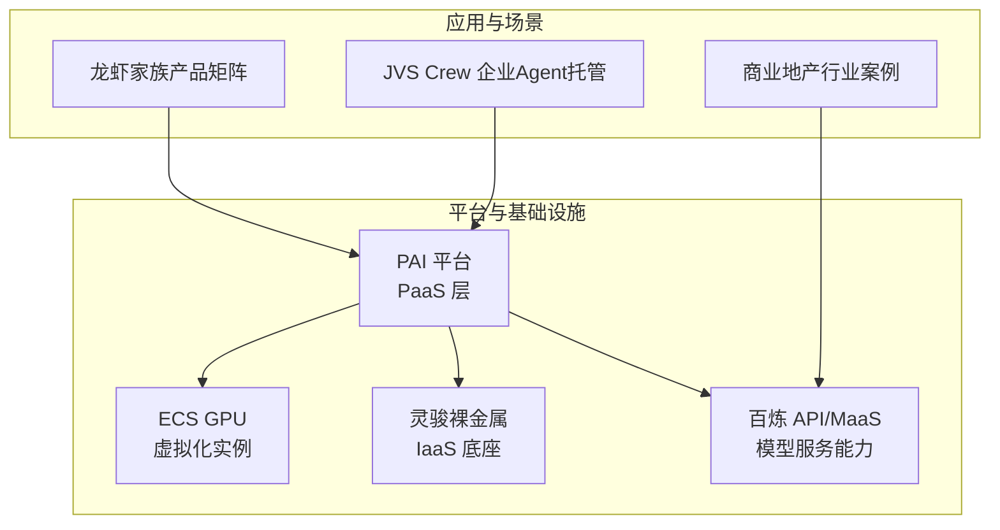
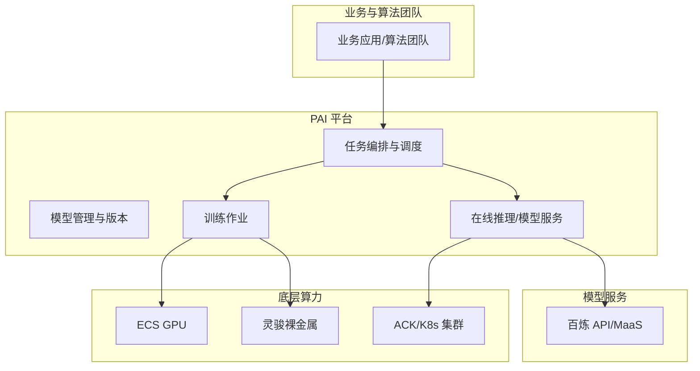
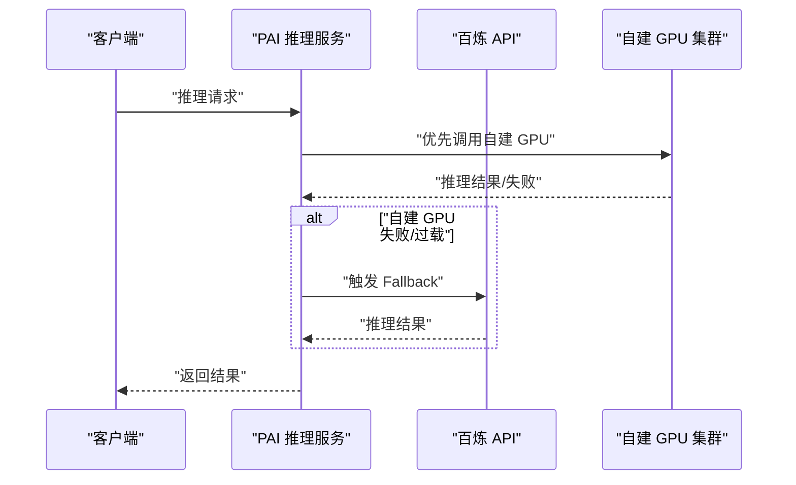
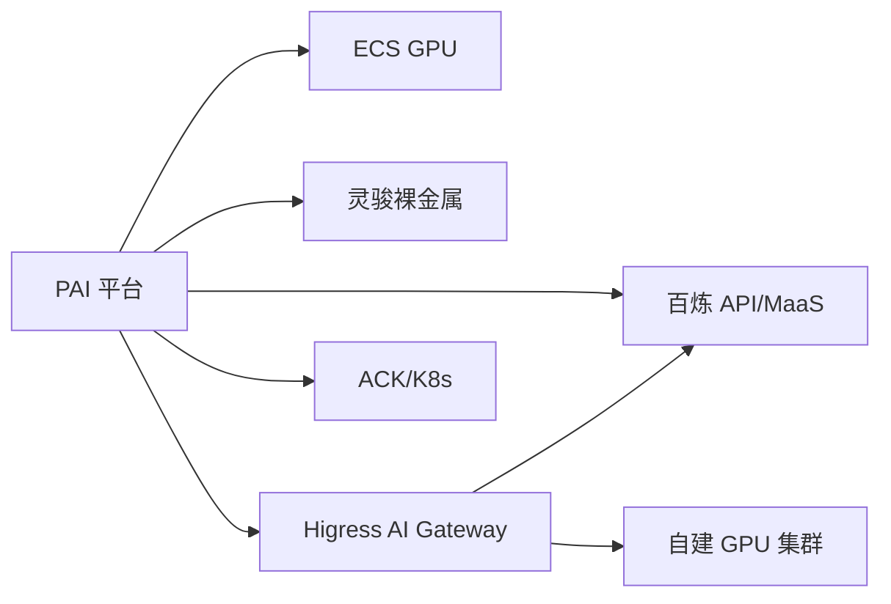

# AI平台服务

<cite>
**本文引用的文件**
- [pai.md](file://knowledge/alibaba-cloud/ai-platform/pai.md)
- [gpu-product-line.md](file://knowledge/alibaba-cloud/ai-infra/gpu-product-line.md)
- [overview.md](file://knowledge/solutions/enterprise-ai-platform/overview.md)
- [claw-family.md](file://knowledge/alibaba-cloud/ai-application/claw-family.md)
- [jvs-crew.md](file://knowledge/alibaba-cloud/ai-application/jvs-crew.md)
- [commercial-real-estate/overview.md](file://knowledge/solutions/commercial-real-estate/overview.md)
</cite>

## 目录
1. [简介](#简介)
2. [项目结构](#项目结构)
3. [核心组件](#核心组件)
4. [架构总览](#架构总览)
5. [详细组件分析](#详细组件分析)
6. [依赖分析](#依赖分析)
7. [性能考量](#性能考量)
8. [故障排查指南](#故障排查指南)
9. [结论](#结论)
10. [附录](#附录)

## 简介
本文件围绕阿里云AI平台（PAI）构建一站式机器学习开发与推理平台的定位与能力，结合PAI在“数据处理—特征工程—模型训练—模型评估—模型管理—在线推理”的全链路能力，系统阐述其与传统机器学习框架的差异与优势，并给出行业应用案例、使用指南、最佳实践与性能优化建议。PAI以PaaS形态提供从任务编排到资源调度的能力，既可独立使用，也可与阿里云底层算力（ECS GPU、灵骏裸金属）及百炼等服务协同，满足不同规模与复杂度的AI应用需求。

## 项目结构
本仓库中与PAI相关的内容主要分布在以下位置：
- 平台定位与概览：ai-platform/pai.md
- 算力与平台关系：ai-infra/gpu-product-line.md
- 企业自建推理平台方案：solutions/enterprise-ai-platform/overview.md
- AI应用产品矩阵：ai-application/claw-family.md
- 企业级Agent托管平台：ai-application/jvs-crew.md
- 行业应用案例（商业地产）：solutions/commercial-real-estate/overview.md

**图表来源**
- [gpu-product-line.md:39-44](file://knowledge/alibaba-cloud/ai-infra/gpu-product-line.md#L39-L44)
- [pai.md:8](file://knowledge/alibaba-cloud/ai-platform/pai.md#L8)
- [claw-family.md:16-34](file://knowledge/alibaba-cloud/ai-application/claw-family.md#L16-L34)
- [jvs-crew.md:16-36](file://knowledge/alibaba-cloud/ai-application/jvs-crew.md#L16-L36)
- [overview.md:157-170](file://knowledge/solutions/enterprise-ai-platform/overview.md#L157-L170)

**章节来源**
- [pai.md:1-9](file://knowledge/alibaba-cloud/ai-platform/pai.md#L1-L9)
- [gpu-product-line.md:1-114](file://knowledge/alibaba-cloud/ai-infra/gpu-product-line.md#L1-L114)
- [overview.md:1-273](file://knowledge/solutions/enterprise-ai-platform/overview.md#L1-L273)
- [claw-family.md:1-137](file://knowledge/alibaba-cloud/ai-application/claw-family.md#L1-L137)
- [jvs-crew.md:1-96](file://knowledge/alibaba-cloud/ai-application/jvs-crew.md#L1-L96)
- [commercial-real-estate/overview.md:1-217](file://knowledge/solutions/commercial-real-estate/overview.md#L1-L217)

## 核心组件
- 平台定位与职责
  - PAI作为一站式机器学习平台，覆盖从数据预处理、特征工程、模型训练、模型评估到模型管理与在线推理的全链路能力，提供任务级编排与资源调度，降低运维复杂度。
  - 与底层算力的关系：ECS GPU适用于轻量推理与开发测试；灵骏裸金属面向超大规模分布式训练；PAI作为PaaS层，统一调度底层资源，提供“客户管任务、平台管机器”的使用体验。
- 与百炼（MaaS）的协同
  - 百炼提供模型API与能力，PAI可作为训练与推理编排平台，二者在企业自建推理平台方案中形成“平台+模型服务”的组合，满足混合推理与统一网关的需求。
- 应用产品矩阵
  - 龙虾家族（HiClaw、QwenPaw、百炼龙虾、PolarClaw、无影 AgentBay）体现从轻量Agent到企业级PaaS的多层级能力，部分产品与PAI存在互补或协同关系。
- 企业Agent托管
  - JVS Crew提供企业级Agent托管能力，强调内网/VPC、SSO/AD、可审计与按会话计费等差异化优势，与PAI在任务编排层面可形成互补。

**章节来源**
- [pai.md:8](file://knowledge/alibaba-cloud/ai-platform/pai.md#L8)
- [gpu-product-line.md:39-44](file://knowledge/alibaba-cloud/ai-infra/gpu-product-line.md#L39-L44)
- [overview.md:157-170](file://knowledge/solutions/enterprise-ai-platform/overview.md#L157-L170)
- [claw-family.md:16-34](file://knowledge/alibaba-cloud/ai-application/claw-family.md#L16-L34)
- [jvs-crew.md:16-36](file://knowledge/alibaba-cloud/ai-application/jvs-crew.md#L16-L36)

## 架构总览
PAI在整体架构中的定位是“PaaS层”，向上承接业务与算法团队的训练/推理需求，向下联合ECS GPU、灵骏裸金属与百炼等能力，形成“平台+算力+模型服务”的统一交付形态。对于企业自建推理平台，PAI可与Higress AI Gateway、ACK/K8s、GPU Operator等组件协同，实现统一网关、混合推理与可观测性。

**图表来源**
- [pai.md:8](file://knowledge/alibaba-cloud/ai-platform/pai.md#L8)
- [gpu-product-line.md:39-44](file://knowledge/alibaba-cloud/ai-infra/gpu-product-line.md#L39-L44)
- [overview.md:157-170](file://knowledge/solutions/enterprise-ai-platform/overview.md#L157-L170)

## 详细组件分析

### 数据处理与特征工程
- 数据处理
  - PAI提供数据预处理与特征工程能力，支持从原始数据到训练样本的转换与清洗，便于后续训练与评估。
- 特征工程
  - 通过平台内置的特征工程模块，可完成特征构造、归一化、编码等步骤，提升模型输入质量与稳定性。
- 与百炼/模型服务的衔接
  - 预处理后的特征与样本可直接进入训练流程，或用于离线特征存储与在线特征服务对接。

**章节来源**
- [pai.md:8](file://knowledge/alibaba-cloud/ai-platform/pai.md#L8)

### 模型训练
- 训练编排
  - PAI负责训练任务的提交、资源分配与监控，支持分布式训练与多机多卡场景。
- 算力选择
  - 轻量训练可使用ECS GPU；超大规模训练可借助灵骏裸金属；PAI统一调度，简化资源管理。
- 与百炼的协同
  - 对于需要外部模型能力的场景，PAI可与百炼API联动，形成“平台+模型服务”的混合训练/推理方案。

**章节来源**
- [gpu-product-line.md:39-44](file://knowledge/alibaba-cloud/ai-infra/gpu-product-line.md#L39-L44)
- [overview.md:157-170](file://knowledge/solutions/enterprise-ai-platform/overview.md#L157-L170)

### 模型评估
- 评估流程
  - PAI提供模型评估能力，支持离线评估与A/B对比，帮助确定最优模型版本。
- 结果可视化
  - 评估结果可在平台内查看与导出，辅助模型迭代与上线决策。

**章节来源**
- [pai.md:8](file://knowledge/alibaba-cloud/ai-platform/pai.md#L8)

### 模型管理
- 版本管理
  - PAI提供模型版本与元数据管理，支持模型注册、标注与回滚。
- 模型服务化
  - 评估通过的模型可直接部署为在线服务，支持弹性扩缩容与灰度发布。

**章节来源**
- [pai.md:8](file://knowledge/alibaba-cloud/ai-platform/pai.md#L8)

### 在线推理
- 推理服务
  - PAI支持将训练好的模型快速上线为推理服务，提供统一的API与监控能力。
- 混合推理
  - 企业自建推理平台方案中，PAI可与百炼API形成混合推理双轨，实现健康检查与自动熔断切换，提高业务连续性。

**图表来源**
- [overview.md:157-170](file://knowledge/solutions/enterprise-ai-platform/overview.md#L157-L170)

**章节来源**
- [overview.md:157-170](file://knowledge/solutions/enterprise-ai-platform/overview.md#L157-L170)

### 与传统机器学习框架的差异与优势
- 差异点
  - 传统框架通常需要用户自行管理数据、训练、评估、部署与运维，PAI以PaaS形态提供一体化编排与调度。
  - 传统框架在多机多卡、网络拓扑与可观测性方面存在门槛，PAI通过统一平台降低复杂度。
- 优势
  - 任务级管理：客户只需提交任务，平台负责资源与调度。
  - 算力弹性：统一调度ECS GPU、灵骏裸金属与百炼API，适配不同规模场景。
  - 可观测与合规：提供统一监控与审计能力，满足企业合规要求。

**章节来源**
- [gpu-product-line.md:39-44](file://knowledge/alibaba-cloud/ai-infra/gpu-product-line.md#L39-L44)
- [overview.md:157-170](file://knowledge/solutions/enterprise-ai-platform/overview.md#L157-L170)

### 应用产品矩阵与PAI的协同
- 龙虾家族
  - HiClaw、QwenPaw、百炼龙虾、PolarClaw、无影 AgentBay构成从轻量Agent到企业级PaaS的产品矩阵，部分产品与PAI在任务编排与运行时层面存在互补关系。
- JVS Crew
  - 企业级Agent托管平台强调内网/VPC、SSO/AD、可审计与按会话计费，与PAI在任务编排与合规审计方面形成协同。

**章节来源**
- [claw-family.md:16-34](file://knowledge/alibaba-cloud/ai-application/claw-family.md#L16-L34)
- [jvs-crew.md:16-36](file://knowledge/alibaba-cloud/ai-application/jvs-crew.md#L16-L36)

### 行业应用案例
- 商业地产
  - 头部企业已落地商场AI质检、合同智能审查、企业知识库等场景，AI消耗占总云消耗3-8%，具备规模化复制潜力。
  - 方案以API调用为主，结合百炼大模型、视觉智能开放平台、智能语音交互与智能客服，形成“AI层+存储层+日志层”的组合。
  - 当API调用量达到一定阈值时，可评估自建GPU方案，以平衡成本与性能。

**章节来源**
- [commercial-real-estate/overview.md:43-54](file://knowledge/solutions/commercial-real-estate/overview.md#L43-L54)
- [commercial-real-estate/overview.md:88-111](file://knowledge/solutions/commercial-real-estate/overview.md#L88-L111)
- [commercial-real-estate/overview.md:111-122](file://knowledge/solutions/commercial-real-estate/overview.md#L111-L122)

## 依赖分析
- 平台与算力的耦合关系
  - PAI作为PaaS层，依赖底层ECS GPU与灵骏裸金属提供算力；在企业自建推理平台方案中，PAI与Higress AI Gateway、ACK/K8s、GPU Operator等组件共同组成统一推理栈。
- 平台与模型服务的耦合关系
  - 百炼API/MaaS作为模型服务能力，与PAI在混合推理与统一网关场景中形成互补，实现健康检查与自动熔断切换。
- 应用产品与平台的协同关系
  - 龙虾家族与JVS Crew在任务编排与运行时层面与PAI存在协同，分别覆盖Agent编排、企业级托管与合规审计等场景。

**图表来源**
- [gpu-product-line.md:39-44](file://knowledge/alibaba-cloud/ai-infra/gpu-product-line.md#L39-L44)
- [overview.md:157-170](file://knowledge/solutions/enterprise-ai-platform/overview.md#L157-L170)

**章节来源**
- [gpu-product-line.md:39-44](file://knowledge/alibaba-cloud/ai-infra/gpu-product-line.md#L39-L44)
- [overview.md:157-170](file://knowledge/solutions/enterprise-ai-platform/overview.md#L157-L170)

## 性能考量
- 网络拓扑与算力选择
  - 不同场景下优先选择合适的算力形态：轻量推理与开发测试可选ECS GPU；超大规模训练可选灵骏裸金属；PAI统一调度，兼顾效率与性能。
- 混合推理与熔断策略
  - 企业自建推理平台方案中，建议明确百炼API的Fallback触发条件（健康检查/队列深度/错误率），避免“双轨”成为冷备。
- 可观测与审计
  - 全链路监控与内容合规审计有助于及时发现性能瓶颈与合规风险，建议统一监控体系并明确审计日志容量规划。

**章节来源**
- [gpu-product-line.md:45-53](file://knowledge/alibaba-cloud/ai-infra/gpu-product-line.md#L45-L53)
- [overview.md:211-238](file://knowledge/solutions/enterprise-ai-platform/overview.md#L211-L238)

## 故障排查指南
- 网关与熔断
  - 若出现自建GPU不可用或过载，检查Higress健康检查与熔断配置，确保Fallback逻辑生效。
- 监控与日志
  - 统一Prometheus/Grafana/DCGM/Loki等组件，定位延迟、吞吐与GPU利用率异常。
- 审计与合规
  - 全量Prompt/Response持久化审计有助于问题回溯与合规检查，需明确存储容量与保留策略。

**章节来源**
- [overview.md:204-208](file://knowledge/solutions/enterprise-ai-platform/overview.md#L204-L208)
- [overview.md:226-230](file://knowledge/solutions/enterprise-ai-platform/overview.md#L226-L230)

## 结论
PAI作为阿里云AI平台，提供从数据到模型再到推理的一体化PaaS能力，通过统一的任务编排与资源调度，降低企业AI应用的复杂度与运维成本。结合ECS GPU、灵骏裸金属与百炼API，PAI可覆盖从小规模开发测试到超大规模训练与企业自建推理的多样化场景。在Agent编排与企业级托管方面，PAI与龙虾家族、JVS Crew等产品形成互补，满足不同行业与场景的合规、性能与可运维性诉求。

## 附录
- 使用指南与最佳实践
  - 选择合适算力：根据任务规模与网络需求选择ECS GPU或灵骏裸金属；PAI统一调度，简化资源管理。
  - 明确Fallback策略：在混合推理场景中，设置健康检查与熔断条件，确保业务连续性。
  - 统一可观测：收敛监控组件，建立全链路视图，覆盖网关、推理引擎与GPU卡级指标。
  - 合规与审计：全量审计日志与按场景容量规划，满足监管要求。
- 性能优化建议
  - 高优先级：提升网关HA与明确Fallback触发条件；评估跨机TP必要性，优先考虑多副本DP。
  - 中优先级：收敛监控体系、引入Prompt缓存层、强化多应用资源隔离。
  - 低优先级：成本归集、灰度发布机制与RDMA调度策略优化。

**章节来源**
- [gpu-product-line.md:54-80](file://knowledge/alibaba-cloud/ai-infra/gpu-product-line.md#L54-L80)
- [overview.md:211-238](file://knowledge/solutions/enterprise-ai-platform/overview.md#L211-L238)