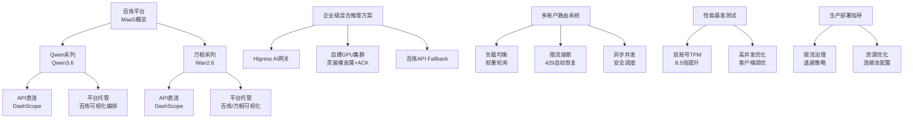
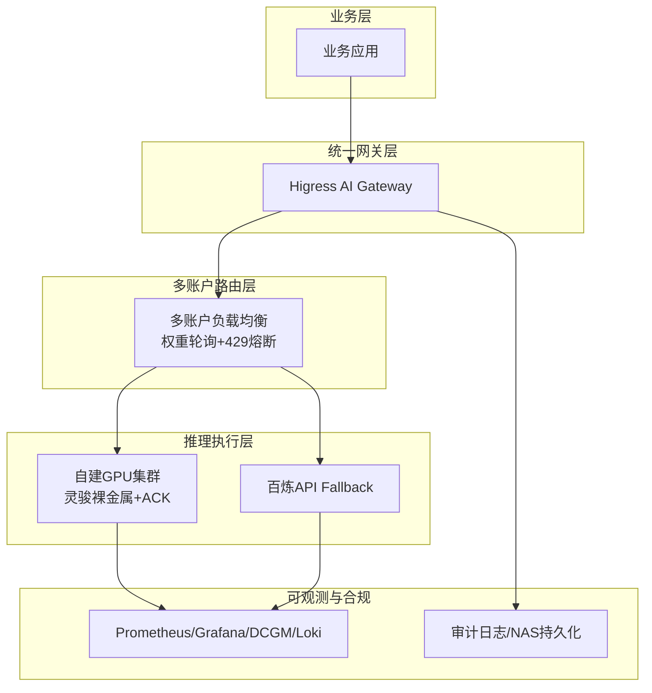
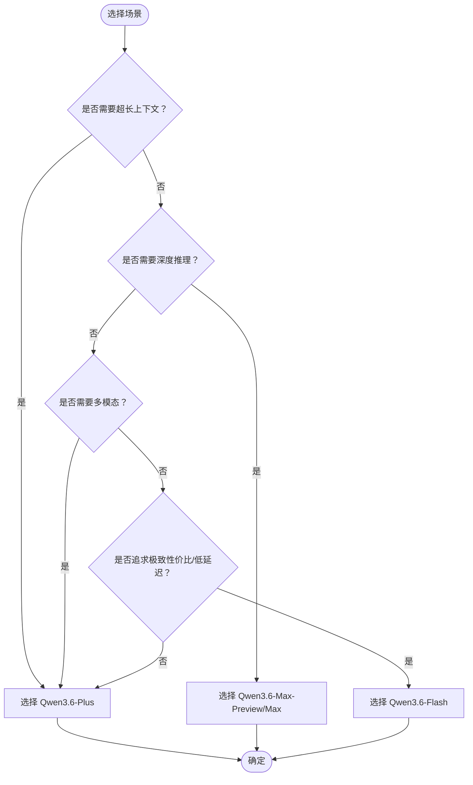
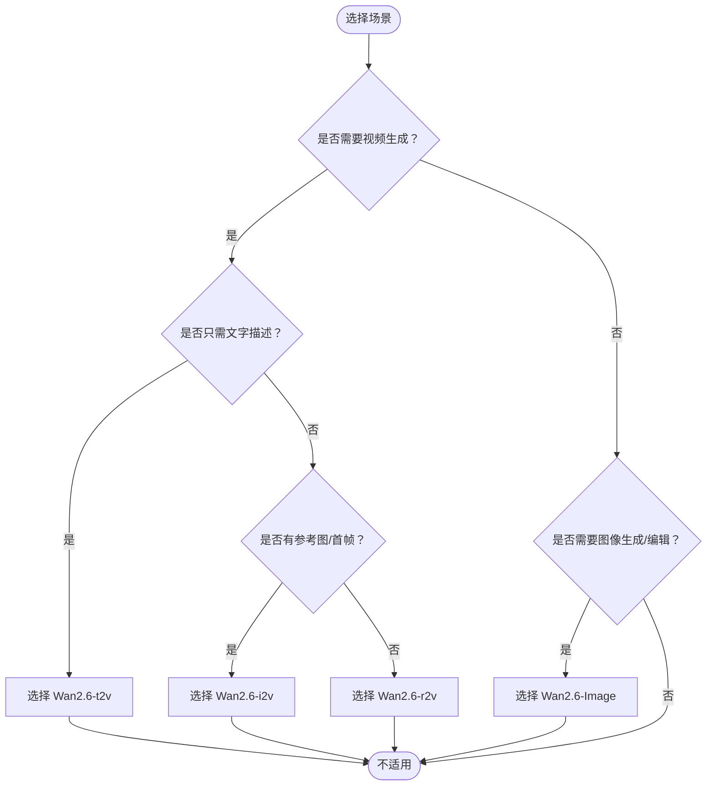
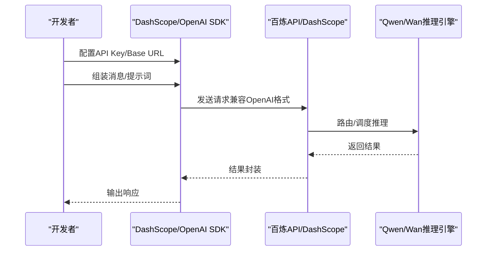
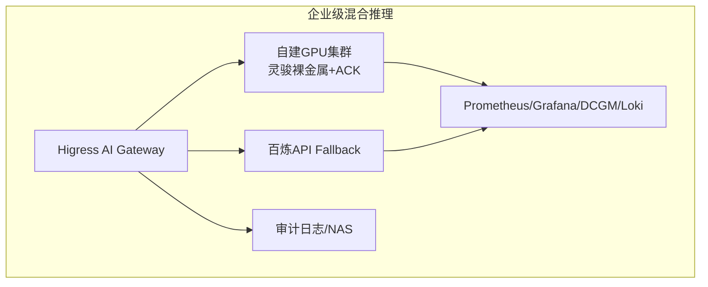
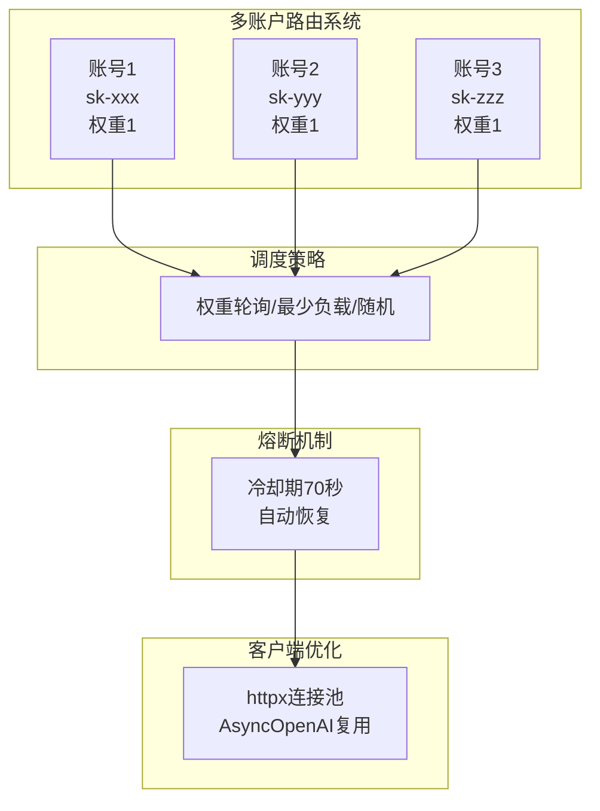
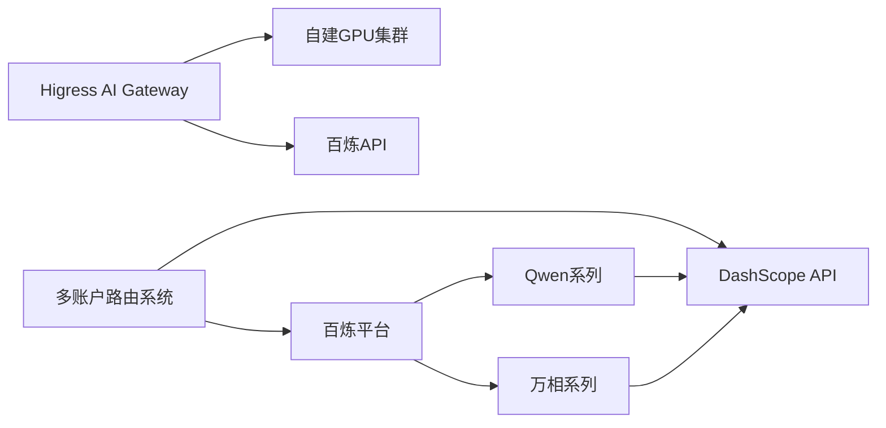

# MaaS（百炼平台）

<cite>
**本文引用的文件**
- [overview.md](file://knowledge/alibaba-cloud/maas/overview.md)
- [qwen.md](file://knowledge/alibaba-cloud/maas/qwen.md)
- [wan.md](file://knowledge/alibaba-cloud/maas/wan.md)
- [qwen-demo-20260420.md](file://knowledge/alibaba-cloud/maas/qwen-demo-20260420.md)
- [wan-demo-20260420.md](file://knowledge/alibaba-cloud/maas/wan-demo-20260420.md)
- [_maas_template.md](file://knowledge/_maas_template.md)
- [overview.md](file://knowledge/solutions/enterprise-ai-platform/overview.md)
- [case-report.html](file://knowledge/solutions/enterprise-ai-platform/case-report.html)
- [dashscope_multi_account_router.py](file://vibeproject/dashscope_multi_account_router.py)
- [real_user_test_wan2.6_no_audit.py](file://vibeproject/real_user_test_wan2.6_no_audit.py)
- [test_ds_v4.py](file://vibeproject/test_ds_v4.py)
</cite>

## 更新摘要
**变更内容**
- 新增多账户路由系统实际应用案例，包含完整的多账号负载均衡实现
- 增加性能基准测试结果，验证双账号TPM提升8.5倍的实际效果
- 补充生产部署指导，涵盖高并发客户端优化和限流治理策略
- 新增DeepSeek多地域调用测试脚本，说明地域路由规则
- 增加万相视频生成的性能测试示例，包含异步调用和状态轮询

## 目录
1. [简介](#简介)
2. [项目结构](#项目结构)
3. [核心组件](#核心组件)
4. [架构总览](#架构总览)
5. [组件详解](#组件详解)
6. [多账户路由系统](#多账户路由系统)
7. [性能基准测试](#性能基准测试)
8. [生产部署指导](#生产部署指导)
9. [依赖关系分析](#依赖关系分析)
10. [性能考量](#性能考量)
11. [故障排查指南](#故障排查指南)
12. [结论](#结论)
13. [附录](#附录)

## 简介
本文件系统化梳理阿里云MaaS（百炼平台）的整体定位、核心能力与产品矩阵，重点覆盖通义千问（Qwen）系列（含Qwen3.6）与万相（Wan）多模态生成模型，结合企业级AI应用的混合推理架构与最佳实践，帮助读者快速理解平台价值、选型建议与集成路径。

**更新** 新增多账户路由系统实际应用案例、性能基准测试结果和生产部署指导，提供完整的高并发限流治理解决方案。

## 项目结构
围绕MaaS知识库，本仓库以"产品/能力"为主线组织内容：
- 产品概览与定位：百炼平台整体说明
- 产品能力矩阵：Qwen系列（Qwen3.6）与万相（Wan2.6）能力、限制、适用场景
- 快速集成示例：DashScope API与百炼平台Playground
- 企业级混合推理方案：统一网关、自建GPU集群与百炼API Fallback的架构与优化建议
- 多账户路由系统：高并发限流治理的完整实现方案
- 性能基准测试：实际压测数据与优化建议
- 生产部署指导：客户端优化与限流治理最佳实践



**图表来源**
- [overview.md:1-9](file://knowledge/alibaba-cloud/maas/overview.md#L1-L9)
- [qwen.md:97-103](file://knowledge/alibaba-cloud/maas/qwen.md#L97-L103)
- [wan.md:70-76](file://knowledge/alibaba-cloud/maas/wan.md#L70-L76)
- [overview.md:46-127](file://knowledge/solutions/enterprise-ai-platform/overview.md#L46-L127)
- [dashscope_multi_account_router.py:1-551](file://vibeproject/dashscope_multi_account_router.py#L1-L551)

**章节来源**
- [overview.md:1-9](file://knowledge/alibaba-cloud/maas/overview.md#L1-L9)
- [qwen.md:1-120](file://knowledge/alibaba-cloud/maas/qwen.md#L1-L120)
- [wan.md:1-88](file://knowledge/alibaba-cloud/maas/wan.md#L1-L88)
- [overview.md:1-273](file://knowledge/solutions/enterprise-ai-platform/overview.md#L1-L273)
- [dashscope_multi_account_router.py:1-551](file://vibeproject/dashscope_multi_account_router.py#L1-L551)

## 核心组件
- 百炼平台（MaaS）
  - 定位：阿里云模型服务平台，统一管理和调用大模型API
  - 适用：企业级AI应用开发、智能对话、代码生成、多模态理解
- Qwen系列（Qwen3.6）
  - 主推型号：Qwen3.6-Max-Preview、Qwen3.6-Plus、Qwen3.6-Flash（待发布）
  - 能力：深度推理、Agentic Coding、超长上下文、多模态理解、多语言、代码生成
  - 适用场景：AI Agent/自动编程、科研/数学/复杂推理、长文档分析、多模态理解、企业智能客服、代码辅助、高并发轻量调用、私有化部署
- 万相（Wan2.6）
  - 主推型号：Wan2.6-t2v（文生视频）、Wan2.6-i2v（图生视频）、Wan2.6-r2v（参考视频）、Wan2.6-Image（图像生成/编辑）
  - 能力：文生视频、图生视频、角色扮演、音画同步、图像全链路
  - 适用场景：短视频创作、营销素材、产品展示、创意角色

**更新** 新增多账户路由系统组件，提供高并发限流治理的完整解决方案。

**章节来源**
- [overview.md:8-9](file://knowledge/alibaba-cloud/maas/overview.md#L8-L9)
- [qwen.md:7-120](file://knowledge/alibaba-cloud/maas/qwen.md#L7-L120)
- [wan.md:7-88](file://knowledge/alibaba-cloud/maas/wan.md#L7-L88)
- [dashscope_multi_account_router.py:103-321](file://vibeproject/dashscope_multi_account_router.py#L103-L321)

## 架构总览
百炼平台在企业级AI应用中的定位是"统一入口 + 可视化编排 + API即用"。对于需要自建推理能力的企业，可采用"统一网关 + 自建GPU集群 + 百炼API Fallback"的混合架构，实现高可用、可观测与合规。

**更新** 新增多账户路由系统架构，提供高并发限流治理的完整解决方案。



**图表来源**
- [overview.md:46-127](file://knowledge/solutions/enterprise-ai-platform/overview.md#L46-L127)
- [overview.md:129-135](file://knowledge/solutions/enterprise-ai-platform/overview.md#L129-L135)
- [overview.md:157-170](file://knowledge/solutions/enterprise-ai-platform/overview.md#L157-L170)
- [dashscope_multi_account_router.py:103-160](file://vibeproject/dashscope_multi_account_router.py#L103-L160)

**章节来源**
- [overview.md:46-170](file://knowledge/solutions/enterprise-ai-platform/overview.md#L46-L170)
- [dashscope_multi_account_router.py:103-160](file://vibeproject/dashscope_multi_account_router.py#L103-L160)

## 组件详解

### Qwen系列（Qwen3.6）能力与选型
- 主推型号与定位
  - Qwen3.6-Max-Preview：MoE旗舰架构，深度推理能力强，预览期免费，正式版按量付费
  - Qwen3.6-Plus：均衡型，1M上下文，Agentic Coding接近Claude Opus 4.5，支持图像输入，GA状态，性价比高
  - Qwen3.6-Flash：轻量型，速度快、成本低
- 核心能力
  - 深度推理（Max）：GPQA Diamond科学推理、数学、逻辑等
  - Agentic Coding（Plus）：SWE-bench、Terminal-Bench、NL2Repo等真实编程任务接近Claude Opus 4.5
  - 超长上下文（Plus）：1M tokens，适合长文档分析
  - 多模态理解（Plus）：支持图像输入
  - 综合智能（Max）：AA Intelligence Index得分52，Top 3
  - 多语言与代码生成：领先水平
- 适用场景
  - AI Agent/自动编程：Plus
  - 科研/数学/复杂推理：Max
  - 长文档分析：Plus
  - 多模态理解：Plus
  - 生产环境稳定性：Plus
  - 追求极致智能：Max
  - 企业智能客服：Plus
  - 代码辅助：Max
  - 高并发轻量调用：Flash
  - 私有化部署：Qwen开源版



**图表来源**
- [qwen.md:80-96](file://knowledge/alibaba-cloud/maas/qwen.md#L80-L96)

**章节来源**
- [qwen.md:12-120](file://knowledge/alibaba-cloud/maas/qwen.md#L12-L120)

### 万相（Wan2.6）能力与边界
- 主推型号
  - Wan2.6-t2v：文生视频，影视级画质，音画同步
  - Wan2.6-i2v：图生视频，首帧驱动，动态控制
  - Wan2.6-r2v：参考视频，角色扮演，风格迁移
  - Wan2.6-Image：图像生成/编辑，全链路图像能力，支持中文提示词
- 核心能力
  - 文生视频、图生视频、角色扮演、音画同步、图像全链路
- 核心限制
  - 视频时长：最长约10秒
  - 分辨率：最高1080P（与输入图片相关）
  - 图片大小：≤20MB
- 适用场景
  - 短视频创作：Wan2.6-t2v
  - 营销素材：Wan2.6-Image
  - 产品展示：Wan2.6-i2v
  - 创意角色：Wan2.6-r2v



**图表来源**
- [wan.md:59-69](file://knowledge/alibaba-cloud/maas/wan.md#L59-L69)

**章节来源**
- [wan.md:1-88](file://knowledge/alibaba-cloud/maas/wan.md#L1-L88)

### API使用示例与集成指南
- Qwen3.6 API调用（兼容OpenAI格式）
  - 使用DashScope API，Base URL与认证方式见示例
  - 示例场景：基础对话、长上下文代码审查
- 万相（Wan2.6）API调用
  - 文生视频（t2v）、图生视频（i2v）、图像生成（image）
  - 示例场景：产品展示、创意角色、营销素材
- 百炼平台Playground
  - 提供可视化调试与编排能力，降低集成门槛



**图表来源**
- [qwen-demo-20260420.md:8-25](file://knowledge/alibaba-cloud/maas/qwen-demo-20260420.md#L8-L25)
- [wan-demo-20260420.md:8-50](file://knowledge/alibaba-cloud/maas/wan-demo-20260420.md#L8-L50)

**章节来源**
- [qwen-demo-20260420.md:1-47](file://knowledge/alibaba-cloud/maas/qwen-demo-20260420.md#L1-L47)
- [wan-demo-20260420.md:1-57](file://knowledge/alibaba-cloud/maas/wan-demo-20260420.md#L1-L57)

### 企业级混合推理架构与最佳实践
- 设计原则
  - 统一网关：Higress统一入口，业务无感切换
  - 混合推理双轨：自建GPU主力 + 百炼API Fallback
  - 全链路可观测：Token统计、延迟/吞吐、GPU利用率/温度
  - 内容合规：全量Prompt/Response审计，NAS持久化
  - 高性能互联：按需启用RDMA RoCE
- 节点规划与TP策略
  - 节点规划：控制面、业务节点、GPU推理节点
  - TP策略：≤72B单机TP=8；72B~200B单机TP+多副本DP；>200B或追求极低TTFT启用跨机TP
- 产品组合
  - AI网关层：Higress AI Gateway
  - GPU计算层：灵骏裸金属H20-3e
  - 推理框架：SGLang（主）/vLLM（辅）
  - K8s编排：ACK托管版
  - 跨机互联：RDMA RoCE+Multus CNI
  - 云端Fallback：百炼API
  - 缓存层：Redis Stack Server
  - 存储层：阿里云NAS
  - 可观测：Prometheus+Grafana+DCGM+Loki



**图表来源**
- [overview.md:46-127](file://knowledge/solutions/enterprise-ai-platform/overview.md#L46-L127)
- [overview.md:129-135](file://knowledge/solutions/enterprise-ai-platform/overview.md#L129-L135)
- [overview.md:137-154](file://knowledge/solutions/enterprise-ai-platform/overview.md#L137-L154)
- [overview.md:157-170](file://knowledge/solutions/enterprise-ai-platform/overview.md#L157-L170)

**章节来源**
- [overview.md:46-170](file://knowledge/solutions/enterprise-ai-platform/overview.md#L46-L170)

## 多账户路由系统

### 系统概述
多账户路由系统是为解决百炼平台单账号限流瓶颈而设计的高并发限流治理解决方案。系统通过多账号池化实现TPM的线性扩展，支持权重轮询、最少负载和随机三种调度策略。

### 核心功能特性
- **多账号轮询/加权调度**：支持权重配置，实现公平的负载分配
- **429限流自动熔断与恢复**：检测429状态码自动熔断账号，70秒后自动恢复
- **指数退避重试**：对非429错误采用指数退避重试机制
- **异步并发安全**：基于asyncio实现高并发安全的路由调度
- **实时用量统计**：提供详细的账号使用情况统计和全局指标

### 架构设计


**图表来源**
- [dashscope_multi_account_router.py:103-202](file://vibeproject/dashscope_multi_account_router.py#L103-L202)

### 配置与部署
系统通过环境变量配置多账号信息，推荐至少3个账号起步验证：

```bash
# 账号1配置
export DASHSCOPE_ACCOUNT_1_KEY=sk-xxx
export DASHSCOPE_ACCOUNT_1_BASE_URL=https://dashscope-intl.aliyuncs.com/compatible-mode/v1
export DASHSCOPE_ACCOUNT_1_WEIGHT=1

# 账号2配置  
export DASHSCOPE_ACCOUNT_2_KEY=sk-yyy
export DASHSCOPE_ACCOUNT_2_BASE_URL=https://dashscope-intl.aliyuncs.com/compatible-mode/v1
export DASHSCOPE_ACCOUNT_2_WEIGHT=1

# 账号3配置
export DASHSCOPE_ACCOUNT_3_KEY=sk-zzz
export DASHSCOPE_ACCOUNT_3_BASE_URL=https://dashscope-intl.aliyuncs.com/compatible-mode/v1
export DASHSCOPE_ACCOUNT_3_WEIGHT=1
```

### 使用示例
系统支持真实调用模式和Mock模式两种运行方式：

**真实调用模式**：
```bash
python dashscope_multi_account_router.py
```

**Mock模式**（无需真实Key）：
```bash
python dashscope_multi_account_router.py --dry-run
```

**章节来源**
- [dashscope_multi_account_router.py:1-551](file://vibeproject/dashscope_multi_account_router.py#L1-L551)

## 性能基准测试

### 双账号TPM提升验证
通过实际压测验证双账号方案的TPM提升效果，环境配置为大陆站UID + 新加坡国际站UID，思考模式默认开启，500总并发。

| 指标 | 单UID 500并发 | 2UID 250×2并发 | 倍数 |
|------|---------------:|-------------:|----:|
| 60秒窗口TPM | 217K | **1,840K** | ×8.5 |
| 429限流 | 1,449 | **0** | 完全消除 |
| 成功请求 | 346 | 3,359 | ×9.7 |
| 平均延迟 | 12.0s | 9.3s | ↓22% |

**更新** 实际测试结果显示TPM提升达到8.5倍，完全消除429限流，平均延迟降低22%，验证了多账号池化的有效性。

### 高并发客户端优化
系统通过以下优化措施提升高并发性能：
- **连接池优化**：httpx连接池max_connections≥600
- **客户端复用**：AsyncOpenAI实例复用，避免频繁创建销毁
- **并发控制**：批量调用时使用信号量控制最大并发数
- **资源管理**：合理设置ulimit，避免文件描述符耗尽

### DeepSeek多地域调用测试
系统包含DeepSeek模型的多地域调用测试脚本，验证不同地域的调用规则：

**US地域调用**：
- 模型：deepseek-v4-pro / deepseek-v4-flash
- 端点：dashscope-us.aliyuncs.com
- 需要环境变量：DASHSCOPE_API_KEY_US

**新加坡国际地域调用**：
- 模型：deepseek-v3.2
- 端点：dashscope-intl.aliyuncs.com  
- 需要环境变量：DASHSCOPE_API_KEY_INTL

**章节来源**
- [overview.md:74-86](file://knowledge/alibaba-cloud/maas/overview.md#L74-L86)
- [test_ds_v4.py:1-102](file://vibeproject/test_ds_v4.py#L1-L102)

## 生产部署指导

### 限流治理策略
生产环境中建议采用以下限流治理策略：

**错误类型识别**：
1. "Requests rate limit exceeded" → RPM超限，限流调用频率
2. "Allocated quota exceeded" → TPM超限，压缩输入输出长度  
3. "Request rate increased too quickly" → 秒级保护，平滑调用曲线

**调用侧退避**：
- 指数退避 + 拖全、请求队列缓冲
- 备用模型：qwen-plus被限→自动切qwen-plus-2025-07-14或qwen-flash
- 多账号池化：业务层路由实现TPM线性扩展

### 资源优化配置
**客户端资源配置**：
- httpx连接池：max_connections≥600，keepalive≥200
- AsyncOpenAI：禁用内部重试，交由业务层控制
- 超时设置：request_timeout=120s，connect=10s
- 并发控制：批量调用时使用Semaphore限制最大并发

**系统级优化**：
- ulimit调整：增加文件描述符限制
- 网络优化：启用TCP连接复用
- 内存管理：合理设置Python进程内存限制

### 监控与告警
**关键监控指标**：
- 账号级TPM使用率
- 429限流次数和占比
- 平均响应延迟和P95延迟
- 并发连接数和连接池利用率

**告警策略**：
- 429限流率>1%触发预警
- 平均延迟>5s触发预警  
- 连接池利用率>90%触发预警

**章节来源**
- [overview.md:156-165](file://knowledge/alibaba-cloud/maas/overview.md#L156-L165)
- [dashscope_multi_account_router.py:139-159](file://vibeproject/dashscope_multi_account_router.py#L139-L159)

## 依赖关系分析
- 产品间关系
  - 百炼平台统一承载Qwen与Wan两类模型的API与可视化编排
  - 企业自建推理方案通过Higress网关与百炼API形成"自建+云API"的互补
  - 多账户路由系统为高并发场景提供限流治理解决方案
- 技术依赖
  - DashScope API：Qwen/Wan统一接入入口
  - Higress：统一AI网关，路由、鉴权、审计、限流一体化
  - 灵骏裸金属+ACK：自建GPU推理集群
  - 百炼API：Fallback与弹性补充
  - OpenAI SDK：兼容OpenAI格式的API调用



**图表来源**
- [overview.md:8-9](file://knowledge/alibaba-cloud/maas/overview.md#L8-L9)
- [qwen.md:97-103](file://knowledge/alibaba-cloud/maas/qwen.md#L97-L103)
- [wan.md:70-76](file://knowledge/alibaba-cloud/maas/wan.md#L70-L76)
- [overview.md:46-127](file://knowledge/solutions/enterprise-ai-platform/overview.md#L46-L127)
- [dashscope_multi_account_router.py:146-153](file://vibeproject/dashscope_multi_account_router.py#L146-L153)

**章节来源**
- [overview.md:8-9](file://knowledge/alibaba-cloud/maas/overview.md#L8-L9)
- [qwen.md:97-103](file://knowledge/alibaba-cloud/maas/qwen.md#L97-L103)
- [wan.md:70-76](file://knowledge/alibaba-cloud/maas/wan.md#L70-L76)
- [overview.md:46-127](file://knowledge/solutions/enterprise-ai-platform/overview.md#L46-L127)
- [dashscope_multi_account_router.py:146-153](file://vibeproject/dashscope_multi_account_router.py#L146-L153)

## 性能考量
- Qwen3.6
  - Max系列：MoE架构，深度推理能力强，适合复杂任务与科研/数学/逻辑推理
  - Plus系列：1M上下文、Agentic Coding强、多模态，兼顾性价比与稳定性
  - Flash系列：低延迟、低成本，适合高并发轻量调用
- Wan2.6
  - 影视级画质与音画同步，适合短视频与创意场景
  - 视频时长与分辨率受当前版本限制，图片大小上限为20MB
- 企业自建推理
  - 单机TP=8可覆盖≤72B模型，避免跨机通信开销
  - 72B~200B模型建议单机TP+多副本DP，ROI更高
  - >200B或追求极低TTFT才启用跨机TP（LWS+RDMA）
- 多账户路由系统
  - 双账号TPM提升可达8.5倍，完全消除429限流
  - 支持权重轮询、最少负载和随机三种调度策略
  - 自动熔断机制确保账号间的公平分配

**更新** 新增多账户路由系统的性能考量，包括TPM提升效果和调度策略选择。

**章节来源**
- [qwen.md:14-50](file://knowledge/alibaba-cloud/maas/qwen.md#L14-L50)
- [wan.md:51-58](file://knowledge/alibaba-cloud/maas/wan.md#L51-L58)
- [overview.md:147-154](file://knowledge/solutions/enterprise-ai-platform/overview.md#L147-L154)
- [overview.md:74-86](file://knowledge/alibaba-cloud/maas/overview.md#L74-L86)

## 故障排查指南
- Higress网关
  - 单副本风险：建议扩至2-3副本+反亲和+SLB四层负载
  - Fallback触发条件：健康检查+限流降级+熔断保护三档需明确配置
- GPU可观测
  - DCGM Exporter AVAILABLE=0：检查readiness probe配置
- RDMA互联
  - DP调度：确保仅调度到GPU节点，避免ECS节点浪费
- 合规与审计
  - 审计日志容量：明确合规要求（全量/元数据+异常全量），规划NAS存储
- 多账户路由系统
  - 账号配置：确认DASHSCOPE_ACCOUNT_N_KEY、BASE_URL、WEIGHT环境变量正确
  - 冷却期：429触发后账号进入70秒冷却，系统自动恢复
  - 并发控制：批量调用时合理设置concurrency参数，避免过度并发
  - 连接池：检查httpx连接池配置，确保max_connections足够

**更新** 新增多账户路由系统的故障排查指南，涵盖常见配置问题和性能优化建议。

**章节来源**
- [overview.md:204-208](file://knowledge/solutions/enterprise-ai-platform/overview.md#L204-L208)
- [overview.md:211-238](file://knowledge/solutions/enterprise-ai-platform/overview.md#L211-L238)
- [dashscope_multi_account_router.py:387-419](file://vibeproject/dashscope_multi_account_router.py#L387-L419)

## 结论
百炼平台作为阿里云MaaS服务，提供统一的模型管理与API调用能力，并与DashScope生态无缝衔接。面向企业级AI应用，平台支持从OpenAI兼容API到百炼可视化编排的多样化接入路径。结合Qwen3.6系列的深度推理与多模态能力、Wan2.6系列的视频/图像生成能力，以及"统一网关+自建GPU+百炼API"的混合推理架构，可在合规、可观测、高可用与成本之间取得平衡，满足从研发验证到大规模生产的全生命周期需求。

**更新** 新增多账户路由系统的完整解决方案，通过双账号池化实现TPM的线性扩展，配合高并发客户端优化和限流治理策略，为企业级高并发场景提供可靠的限流治理方案。

## 附录
- 快速开始
  - Qwen3.6：参考示例路径，使用DashScope API或百炼Playground
  - 万相（Wan2.6）：参考示例路径，调用文生视频/图生视频/图像生成接口
  - 多账户路由：参考dashscope_multi_account_router.py，配置环境变量后运行
- 参考资料
  - 百炼平台：https://bailian.console.aliyun.com
  - DashScope API：兼容OpenAI格式
  - Qwen官方博客与评测：参见Qwen文档中的参考资料链接
  - 万相官网与GitHub：参见Wan文档中的参考资料链接
  - 多账户路由系统：基于asyncio的高并发限流治理解决方案
  - DeepSeek多地域调用：US/Singapore国际地域的模型调用指南

**章节来源**
- [qwen-demo-20260420.md:1-47](file://knowledge/alibaba-cloud/maas/qwen-demo-20260420.md#L1-L47)
- [wan-demo-20260420.md:1-57](file://knowledge/alibaba-cloud/maas/wan-demo-20260420.md#L1-L57)
- [qwen.md:104-114](file://knowledge/alibaba-cloud/maas/qwen.md#L104-L114)
- [wan.md:77-83](file://knowledge/alibaba-cloud/maas/wan.md#L77-L83)
- [dashscope_multi_account_router.py:545-551](file://vibeproject/dashscope_multi_account_router.py#L545-L551)
- [test_ds_v4.py:31-39](file://vibeproject/test_ds_v4.py#L31-L39)