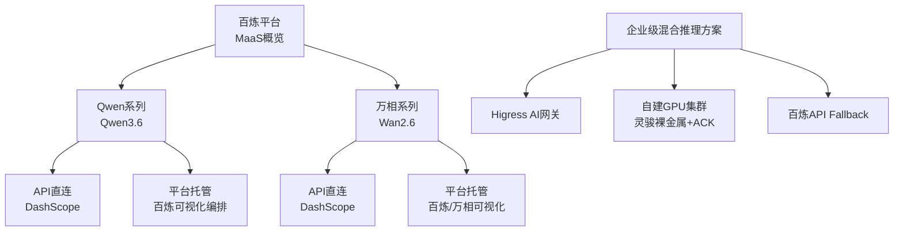
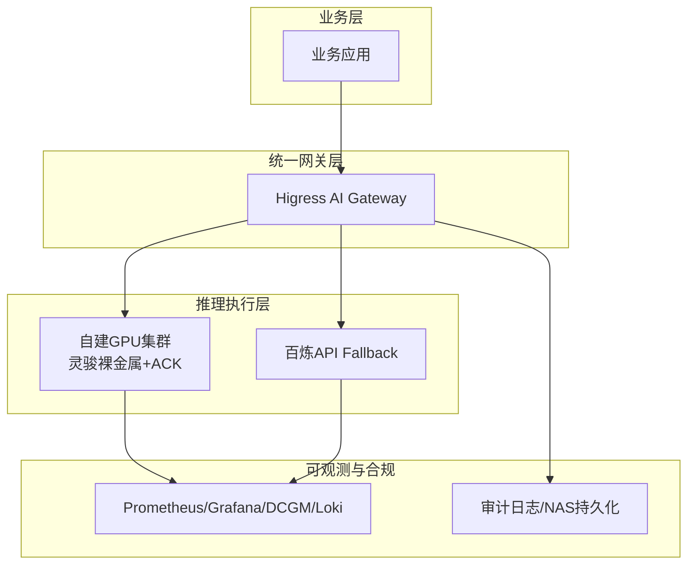
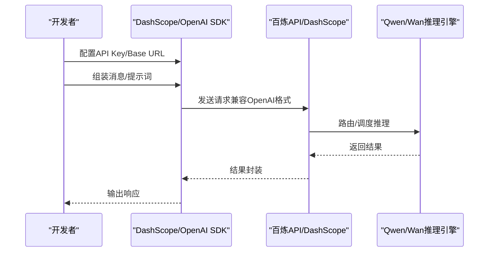
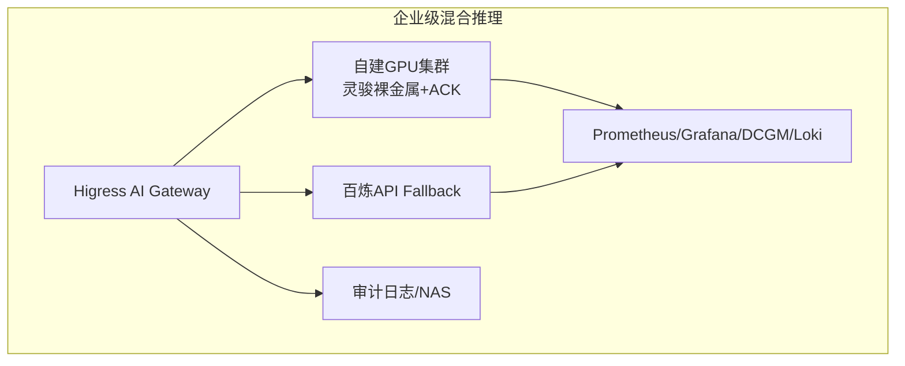
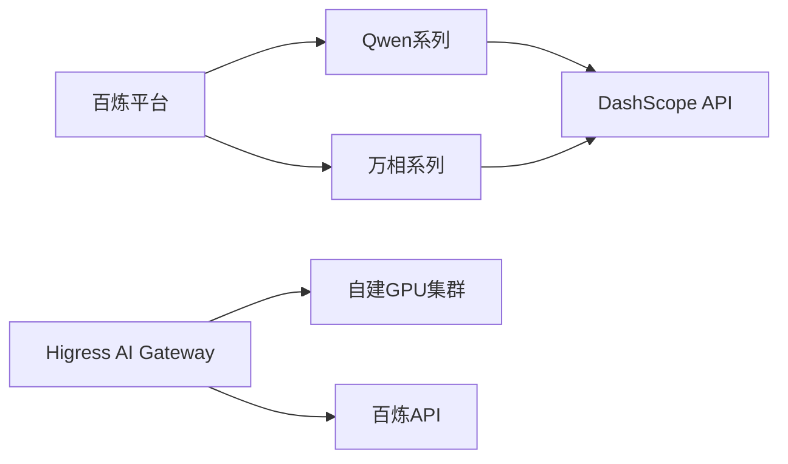

# MaaS（百炼平台）

<cite>
**本文引用的文件**
- [overview.md](file://knowledge/alibaba-cloud/maas/overview.md)
- [qwen.md](file://knowledge/alibaba-cloud/maas/qwen.md)
- [wan.md](file://knowledge/alibaba-cloud/maas/wan.md)
- [qwen-demo-20260420.md](file://knowledge/alibaba-cloud/maas/qwen-demo-20260420.md)
- [wan-demo-20260420.md](file://knowledge/alibaba-cloud/maas/wan-demo-20260420.md)
- [_maas_template.md](file://knowledge/_maas_template.md)
- [overview.md](file://knowledge/solutions/enterprise-ai-platform/overview.md)
- [case-report.html](file://knowledge/solutions/enterprise-ai-platform/case-report.html)
</cite>

## 目录
1. [简介](#简介)
2. [项目结构](#项目结构)
3. [核心组件](#核心组件)
4. [架构总览](#架构总览)
5. [组件详解](#组件详解)
6. [依赖关系分析](#依赖关系分析)
7. [性能考量](#性能考量)
8. [故障排查指南](#故障排查指南)
9. [结论](#结论)
10. [附录](#附录)

## 简介
本文件系统化梳理阿里云MaaS（百炼平台）的整体定位、核心能力与产品矩阵，重点覆盖通义千问（Qwen）系列（含Qwen3.6）与万相（Wan）多模态生成模型，结合企业级AI应用的混合推理架构与最佳实践，帮助读者快速理解平台价值、选型建议与集成路径。

## 项目结构
围绕MaaS知识库，本仓库以“产品/能力”为主线组织内容：
- 产品概览与定位：百炼平台整体说明
- 产品能力矩阵：Qwen系列（Qwen3.6）与万相（Wan2.6）能力、限制、适用场景
- 快速集成示例：DashScope API与百炼平台Playground
- 企业级混合推理方案：统一网关、自建GPU集群与百炼API Fallback的架构与优化建议

图表来源
- [overview.md:1-9](file://knowledge/alibaba-cloud/maas/overview.md#L1-L9)
- [qwen.md:97-103](file://knowledge/alibaba-cloud/maas/qwen.md#L97-L103)
- [wan.md:70-76](file://knowledge/alibaba-cloud/maas/wan.md#L70-L76)
- [overview.md:46-127](file://knowledge/solutions/enterprise-ai-platform/overview.md#L46-L127)

章节来源
- [overview.md:1-9](file://knowledge/alibaba-cloud/maas/overview.md#L1-L9)
- [qwen.md:1-120](file://knowledge/alibaba-cloud/maas/qwen.md#L1-L120)
- [wan.md:1-88](file://knowledge/alibaba-cloud/maas/wan.md#L1-L88)
- [overview.md:1-273](file://knowledge/solutions/enterprise-ai-platform/overview.md#L1-L273)

## 核心组件
- 百炼平台（MaaS）
  - 定位：阿里云模型服务平台，统一管理和调用大模型API
  - 适用：企业级AI应用开发、智能对话、代码生成、多模态理解
- Qwen系列（Qwen3.6）
  - 主推型号：Qwen3.6-Max-Preview、Qwen3.6-Plus、Qwen3.6-Flash（待发布）
  - 能力：深度推理、Agentic Coding、超长上下文、多模态理解、多语言、代码生成
  - 适用场景：AI Agent/自动编程、科研/数学/复杂推理、长文档分析、多模态理解、企业智能客服、代码辅助、高并发轻量调用、私有化部署
- 万相（Wan2.6）
  - 主推型号：Wan2.6-t2v（文生视频）、Wan2.6-i2v（图生视频）、Wan2.6-r2v（参考视频）、Wan2.6-Image（图像生成/编辑）
  - 能力：文生视频、图生视频、角色扮演、音画同步、图像全链路
  - 适用场景：短视频创作、营销素材、产品展示、创意角色

章节来源
- [overview.md:8-9](file://knowledge/alibaba-cloud/maas/overview.md#L8-L9)
- [qwen.md:7-120](file://knowledge/alibaba-cloud/maas/qwen.md#L7-L120)
- [wan.md:7-88](file://knowledge/alibaba-cloud/maas/wan.md#L7-L88)

## 架构总览
百炼平台在企业级AI应用中的定位是“统一入口 + 可视化编排 + API即用”。对于需要自建推理能力的企业，可采用“统一网关 + 自建GPU集群 + 百炼API Fallback”的混合架构，实现高可用、可观测与合规。

图表来源
- [overview.md:46-127](file://knowledge/solutions/enterprise-ai-platform/overview.md#L46-L127)
- [overview.md:129-135](file://knowledge/solutions/enterprise-ai-platform/overview.md#L129-L135)
- [overview.md:157-170](file://knowledge/solutions/enterprise-ai-platform/overview.md#L157-L170)

章节来源
- [overview.md:46-170](file://knowledge/solutions/enterprise-ai-platform/overview.md#L46-L170)

## 组件详解

### Qwen系列（Qwen3.6）能力与选型
- 主推型号与定位
  - Qwen3.6-Max-Preview：MoE旗舰架构，深度推理能力强，预览期免费，正式版按量付费
  - Qwen3.6-Plus：均衡型，1M上下文，Agentic Coding接近Claude Opus 4.5，支持图像输入，GA状态，性价比高
  - Qwen3.6-Flash：轻量型，速度快、成本低
- 核心能力
  - 深度推理（Max）：GPQA Diamond科学推理、数学、逻辑等
  - Agentic Coding（Plus）：SWE-bench、Terminal-Bench、NL2Repo等真实编程任务接近Claude Opus 4.5
  - 超长上下文（Plus）：1M tokens，适合长文档分析
  - 多模态理解（Plus）：支持图像输入
  - 综合智能（Max）：AA Intelligence Index得分52，Top 3
  - 多语言与代码生成：领先水平
- 适用场景
  - AI Agent/自动编程：Plus
  - 科研/数学/复杂推理：Max
  - 长文档分析：Plus
  - 多模态理解：Plus
  - 生产环境稳定性：Plus
  - 追求极致智能：Max
  - 企业智能客服：Plus
  - 代码辅助：Max
  - 高并发轻量调用：Flash
  - 私有化部署：Qwen开源版

图表来源
- [qwen.md:80-96](file://knowledge/alibaba-cloud/maas/qwen.md#L80-L96)

章节来源
- [qwen.md:12-120](file://knowledge/alibaba-cloud/maas/qwen.md#L12-L120)

### 万相（Wan2.6）能力与边界
- 主推型号
  - Wan2.6-t2v：文生视频，影视级画质，音画同步
  - Wan2.6-i2v：图生视频，首帧驱动，动态控制
  - Wan2.6-r2v：参考视频，角色扮演，风格迁移
  - Wan2.6-Image：图像生成/编辑，全链路图像能力，支持中文提示词
- 核心能力
  - 文生视频、图生视频、角色扮演、音画同步、图像全链路
- 核心限制
  - 视频时长：最长约10秒
  - 分辨率：最高1080P（与输入图片相关）
  - 图片大小：≤20MB
- 适用场景
  - 短视频创作：Wan2.6-t2v
  - 营销素材：Wan2.6-Image
  - 产品展示：Wan2.6-i2v
  - 创意角色：Wan2.6-r2v

图表来源
- [wan.md:59-69](file://knowledge/alibaba-cloud/maas/wan.md#L59-L69)

章节来源
- [wan.md:1-88](file://knowledge/alibaba-cloud/maas/wan.md#L1-L88)

### API使用示例与集成指南
- Qwen3.6 API调用（兼容OpenAI格式）
  - 使用DashScope API，Base URL与认证方式见示例
  - 示例场景：基础对话、长上下文代码审查
- 万相（Wan2.6）API调用
  - 文生视频（t2v）、图生视频（i2v）、图像生成（image）
  - 示例场景：产品展示、创意角色、营销素材
- 百炼平台Playground
  - 提供可视化调试与编排能力，降低集成门槛

图表来源
- [qwen-demo-20260420.md:8-25](file://knowledge/alibaba-cloud/maas/qwen-demo-20260420.md#L8-L25)
- [wan-demo-20260420.md:8-50](file://knowledge/alibaba-cloud/maas/wan-demo-20260420.md#L8-L50)

章节来源
- [qwen-demo-20260420.md:1-47](file://knowledge/alibaba-cloud/maas/qwen-demo-20260420.md#L1-L47)
- [wan-demo-20260420.md:1-57](file://knowledge/alibaba-cloud/maas/wan-demo-20260420.md#L1-L57)

### 企业级混合推理架构与最佳实践
- 设计原则
  - 统一网关：Higress统一入口，业务无感切换
  - 混合推理双轨：自建GPU主力 + 百炼API Fallback
  - 全链路可观测：Token统计、延迟/吞吐、GPU利用率/温度
  - 内容合规：全量Prompt/Response审计，NAS持久化
  - 高性能互联：按需启用RDMA RoCE
- 节点规划与TP策略
  - 节点规划：控制面、业务节点、GPU推理节点
  - TP策略：≤72B单机TP=8；72B~200B单机TP+多副本DP；>200B或追求极低TTFT启用跨机TP
- 产品组合
  - AI网关层：Higress AI Gateway
  - GPU计算层：灵骏裸金属H20-3e
  - 推理框架：SGLang（主）/vLLM（辅）
  - K8s编排：ACK托管版
  - 跨机互联：RDMA RoCE+Multus CNI
  - 云端Fallback：百炼API
  - 缓存层：Redis Stack Server
  - 存储层：阿里云NAS
  - 可观测：Prometheus+Grafana+DCGM+Loki

图表来源
- [overview.md:46-127](file://knowledge/solutions/enterprise-ai-platform/overview.md#L46-L127)
- [overview.md:129-135](file://knowledge/solutions/enterprise-ai-platform/overview.md#L129-L135)
- [overview.md:137-154](file://knowledge/solutions/enterprise-ai-platform/overview.md#L137-L154)
- [overview.md:157-170](file://knowledge/solutions/enterprise-ai-platform/overview.md#L157-L170)

章节来源
- [overview.md:46-170](file://knowledge/solutions/enterprise-ai-platform/overview.md#L46-L170)

## 依赖关系分析
- 产品间关系
  - 百炼平台统一承载Qwen与Wan两类模型的API与可视化编排
  - 企业自建推理方案通过Higress网关与百炼API形成“自建+云API”的互补
- 技术依赖
  - DashScope API：Qwen/Wan统一接入入口
  - Higress：统一AI网关，路由、鉴权、审计、限流一体化
  - 灵骏裸金属+ACK：自建GPU推理集群
  - 百炼API：Fallback与弹性补充

图表来源
- [overview.md:8-9](file://knowledge/alibaba-cloud/maas/overview.md#L8-L9)
- [qwen.md:97-103](file://knowledge/alibaba-cloud/maas/qwen.md#L97-L103)
- [wan.md:70-76](file://knowledge/alibaba-cloud/maas/wan.md#L70-L76)
- [overview.md:46-127](file://knowledge/solutions/enterprise-ai-platform/overview.md#L46-L127)

章节来源
- [overview.md:8-9](file://knowledge/alibaba-cloud/maas/overview.md#L8-L9)
- [qwen.md:97-103](file://knowledge/alibaba-cloud/maas/qwen.md#L97-L103)
- [wan.md:70-76](file://knowledge/alibaba-cloud/maas/wan.md#L70-L76)
- [overview.md:46-127](file://knowledge/solutions/enterprise-ai-platform/overview.md#L46-L127)

## 性能考量
- Qwen3.6
  - Max系列：MoE架构，深度推理能力强，适合复杂任务与科研/数学/逻辑推理
  - Plus系列：1M上下文、Agentic Coding强、多模态，兼顾性价比与稳定性
  - Flash系列：低延迟、低成本，适合高并发轻量调用
- Wan2.6
  - 影视级画质与音画同步，适合短视频与创意场景
  - 视频时长与分辨率受当前版本限制，图片大小上限为20MB
- 企业自建推理
  - 单机TP=8可覆盖≤72B模型，避免跨机通信开销
  - 72B~200B模型建议单机TP+多副本DP，ROI更高
  - >200B或追求极低TTFT才启用跨机TP（LWS+RDMA）

章节来源
- [qwen.md:14-50](file://knowledge/alibaba-cloud/maas/qwen.md#L14-L50)
- [wan.md:51-58](file://knowledge/alibaba-cloud/maas/wan.md#L51-L58)
- [overview.md:147-154](file://knowledge/solutions/enterprise-ai-platform/overview.md#L147-L154)

## 故障排查指南
- Higress网关
  - 单副本风险：建议扩至2-3副本+反亲和+SLB四层负载
  - Fallback触发条件：健康检查+限流降级+熔断保护三档需明确配置
- GPU可观测
  - DCGM Exporter AVAILABLE=0：检查readiness probe配置
- RDMA互联
  - DP调度：确保仅调度到GPU节点，避免ECS节点浪费
- 合规与审计
  - 审计日志容量：明确合规要求（全量/元数据+异常全量），规划NAS存储

章节来源
- [overview.md:204-208](file://knowledge/solutions/enterprise-ai-platform/overview.md#L204-L208)
- [overview.md:211-238](file://knowledge/solutions/enterprise-ai-platform/overview.md#L211-L238)

## 结论
百炼平台作为阿里云MaaS服务，提供统一的模型管理与API调用能力，并与DashScope生态无缝衔接。面向企业级AI应用，平台支持从OpenAI兼容API到百炼可视化编排的多样化接入路径。结合Qwen3.6系列的深度推理与多模态能力、Wan2.6系列的视频/图像生成能力，以及“统一网关+自建GPU+百炼API”的混合推理架构，可在合规、可观测、高可用与成本之间取得平衡，满足从研发验证到大规模生产的全生命周期需求。

## 附录
- 快速开始
  - Qwen3.6：参考示例路径，使用DashScope API或百炼Playground
  - 万相（Wan2.6）：参考示例路径，调用文生视频/图生视频/图像生成接口
- 参考资料
  - 百炼平台：https://bailian.console.aliyun.com
  - DashScope API：兼容OpenAI格式
  - Qwen官方博客与评测：参见Qwen文档中的参考资料链接
  - 万相官网与GitHub：参见Wan文档中的参考资料链接

章节来源
- [qwen-demo-20260420.md:1-47](file://knowledge/alibaba-cloud/maas/qwen-demo-20260420.md#L1-L47)
- [wan-demo-20260420.md:1-57](file://knowledge/alibaba-cloud/maas/wan-demo-20260420.md#L1-L57)
- [qwen.md:104-114](file://knowledge/alibaba-cloud/maas/qwen.md#L104-L114)
- [wan.md:77-83](file://knowledge/alibaba-cloud/maas/wan.md#L77-L83)