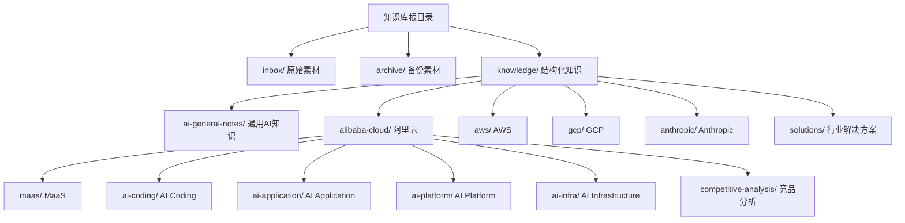
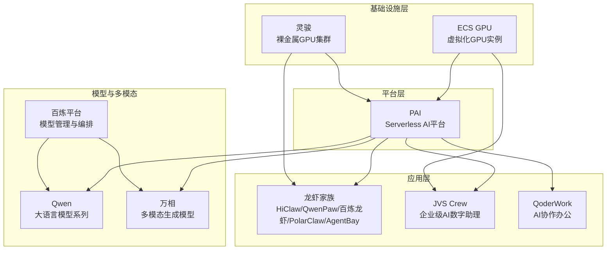
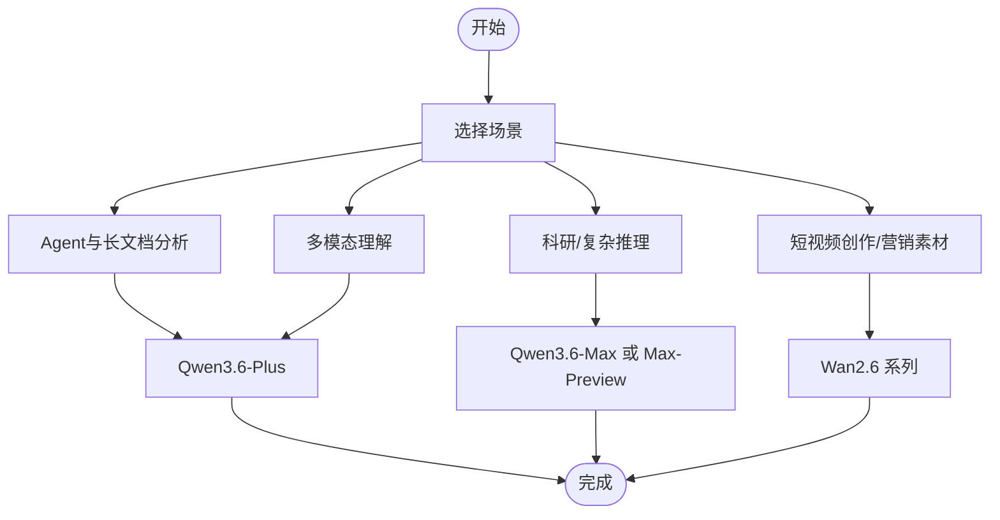
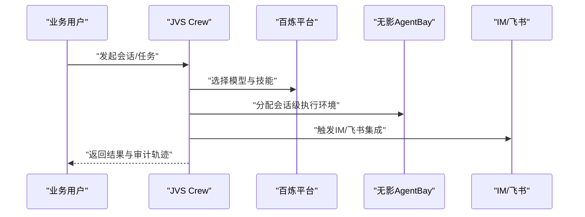
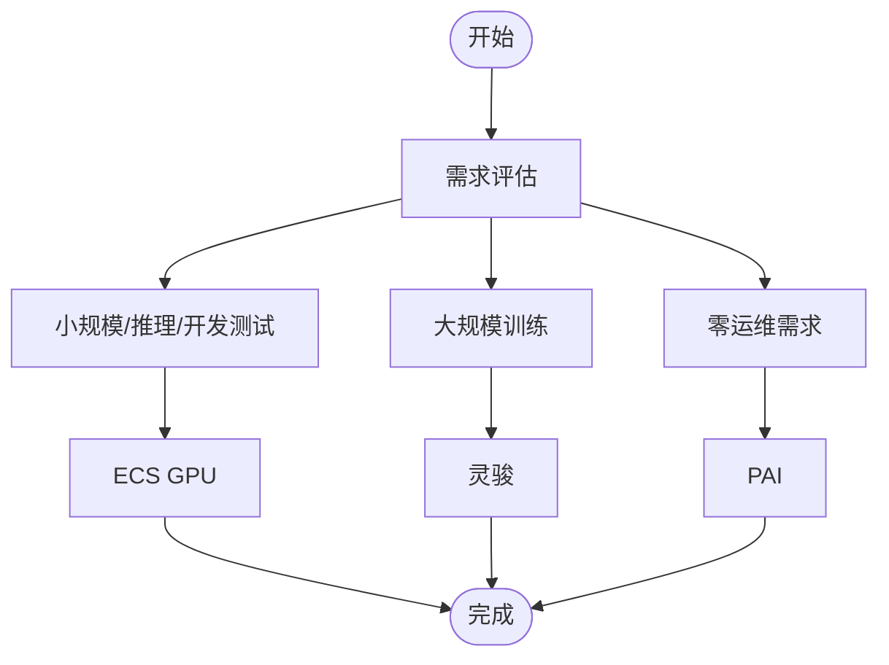
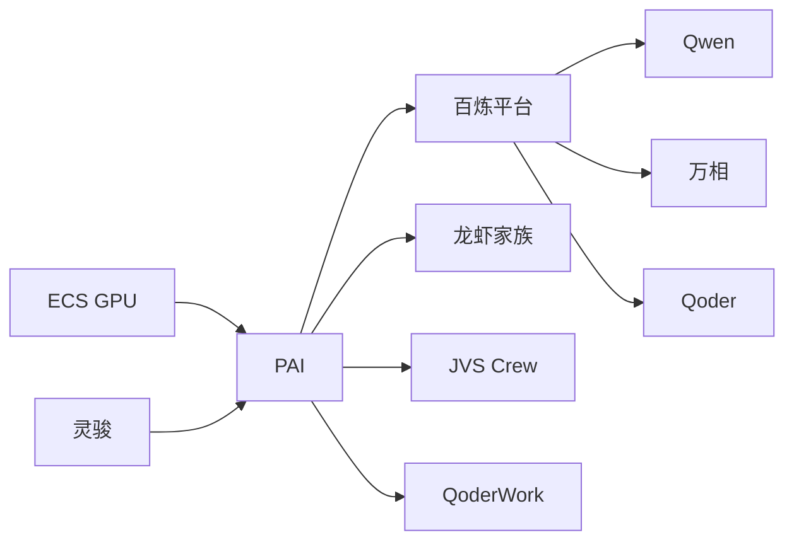

# 阿里云知识库

<cite>
**本文引用的文件**
- [README.md](file://README.md)
- [index.md](file://index.md)
- [知识库全局索引](file://index.md)
- [阿里云百炼平台概览](file://knowledge/alibaba-cloud/maas/overview.md)
- [阿里云PAI概览](file://knowledge/alibaba-cloud/ai-platform/pai.md)
- [阿里云“龙虾家族”AI Agent产品全景](file://knowledge/alibaba-cloud/ai-application/claw-family.md)
- [阿里云Qoder概览](file://knowledge/alibaba-cloud/ai-coding/qoder.md)
- [阿里云ECS GPU概览](file://knowledge/alibaba-cloud/ai-infra/ecs-gpu.md)
- [阿里云GPU产品线选型：ECS GPU vs 灵骏 vs PAI](file://knowledge/alibaba-cloud/ai-infra/gpu-product-line.md)
- [阿里云灵骏概览](file://knowledge/alibaba-cloud/ai-infra/lingjun.md)
- [通义千问 (Qwen)](file://knowledge/alibaba-cloud/maas/qwen.md)
- [万相 (Wan)](file://knowledge/alibaba-cloud/maas/wan.md)
- [阿里云JVS Crew概览](file://knowledge/alibaba-cloud/ai-application/jvs-crew.md)
- [阿里云QoderWork概览](file://knowledge/alibaba-cloud/ai-application/qoder-work.md)
- [阿里云 vs AWS 竞争分析](file://knowledge/alibaba-cloud/competitive-analysis/alibaba-vs-aws/overview.md)
- [Qoder vs Kiro 产品分析](file://knowledge/alibaba-cloud/competitive-analysis/qoder-vs-kiro/overview.md)
</cite>

## 目录
1. [简介](#简介)
2. [项目结构](#项目结构)
3. [核心组件](#核心组件)
4. [架构总览](#架构总览)
5. [详细组件分析](#详细组件分析)
6. [依赖分析](#依赖分析)
7. [性能考虑](#性能考虑)
8. [故障排查指南](#故障排查指南)
9. [结论](#结论)
10. [附录](#附录)

## 简介
本知识库面向阿里云AI平台的知识组织与沉淀，围绕两大Agent能力进行知识提炼与结构化输出：
- ai-knowledge-miner：负责将inbox中的原始素材提炼为脱敏、结构化的知识文档，写入knowledge/对应目录。涉及“提炼”“沉淀”“处理inbox”“knowledge miner”等关键词时自动适用。
- ai-native-expert：AI Native领域专家，聚焦MaaS（Qwen/Wan/Claude/Gemini/GPT）和AI Coding（Qoder/Kiro/Claude Code）。涉及模型能力、选型、API问题、竞品分析时自动适用。

知识库采用“道—点—线—体”的分层组织方式：
- 道：AI领域知识（跨厂商），如Agent、Harness、Prompt Engineering、RAG、Fine-tuning等。
- 点：单产品知识，按厂商与产品线分类，涵盖MaaS、AI Coding、AI Application、AI Platform、AI Infrastructure等。
- 线：对比分析（阿里云视角），如阿里云 vs AWS、Qoder vs Kiro等。
- 体：行业解决方案，如商业地产、企业自建AI推理平台等。

**章节来源**
- [README.md:1-20](file://README.md#L1-L20)

## 项目结构
知识库采用按领域与厂商分层的目录结构，便于检索与复用：
- inbox/：原始素材存放目录
- archive/：原始素材备份目录
- knowledge/：结构化知识文档目录，按不同AI领域和组织分类整理
  - ai-general-notes/：AI通用概念与方法论
  - alibaba-cloud/：阿里云产品线知识
    - maas/：MaaS（百炼平台、Qwen、万相）
    - ai-coding/：AI Coding（Qoder）
    - ai-application/：AI Application（龙虾家族、JVS Crew、QoderWork）
    - ai-platform/：AI Platform（PAI）
    - ai-infra/：AI Infrastructure（ECS GPU、灵骏、GPU产品线）
    - competitive-analysis/：竞品分析（阿里云视角）
  - aws/、gcp/、anthropic/：其他厂商产品线知识
  - solutions/：行业解决方案模板与案例

**图表来源**
- [README.md:13-18](file://README.md#L13-L18)

**章节来源**
- [README.md:13-18](file://README.md#L13-L18)
- [index.md:1-69](file://index.md#L1-L69)

## 核心组件
本节梳理阿里云AI平台各产品线的核心定位、技术特点与典型应用场景，并给出选型建议与最佳实践要点。

- MaaS（百炼平台、Qwen、万相）
  - 百炼平台：阿里云模型服务平台，统一管理和调用大模型API，支持可视化编排与企业级治理。
  - Qwen：阿里云自研大语言模型系列，覆盖文本/代码/多模态，主推Qwen3.6系列（Max/Plus/Flash），具备强推理、Agentic Coding、多模态与超长上下文能力。
  - 万相：阿里云多模态生成模型（图像/视频），主推Wan2.6系列（Video/Image），支持文生视频、图生视频、角色扮演与图像全链路能力。
  - 选型建议：推理优先选Qwen3.6-Flash，兼顾性价比；Agent与长文档分析选Qwen3.6-Plus；科研/复杂推理选Qwen3.6-Max-Preview或Max；视频/图像生成选Wan2.6系列。

- AI Coding（Qoder）
  - 定位：AI编程助手，提升开发者编码效率，面向开发者场景，提供代码生成与智能补全能力。
  - 选型建议：结合百炼平台进行模型编排与治理，适配企业开发流水线。

- AI Application（龙虾家族、JVS Crew、QoderWork）
  - 龙虾家族：围绕OpenClaw构建的五款产品矩阵，覆盖从轻量个人Agent到企业多Agent协作、再到云端托管全栈，包含HiClaw、QwenPaw、百炼龙虾、PolarClaw、无影AgentBay。
  - JVS Crew：企业级AI数字助理构建与托管平台，基于无影云电脑体系，强调内网/VPC、SSO（含AAD）、可审计与按Session执行计费，对标Claude Managed Agents。
  - QoderWork：AI协作办公工具，面向业务用户，提供智能工作流与知识协同能力。
  - 选型建议：多Agent协作与企业安全选HiClaw；轻量个人Agent选QwenPaw；数据库AI化操作选PolarClaw；需要合规内网与审计选JVS Crew。

- AI Platform（PAI）
  - 定位：阿里云机器学习平台，提供模型训练、推理全流程服务，支持数据预处理→训练→推理→MLOps全链路。
  - 选型建议：零运维需求优先选择PAI；若需深度定制或SSH访问，结合ECS GPU或灵骏使用。

- AI Infrastructure（ECS GPU、灵骏、GPU产品线）
  - ECS GPU：GPU云服务器实例，支持直通/vGPU，部分规格支持NVLink与RoCE/eRDMA，适合推理与轻量训练。
  - 灵骏：智算集群，面向大规模AI训练，物理GPU服务器+IB/eRDMA+CPFS，支持SSH登录与自管底层。
  - GPU产品线选型：IaaS（ECS GPU/灵骏）与PaaS（PAI）双层供给，核心差异在网络拓扑能力与管理粒度。
  - 选型建议：L20单卡/少卡推理选ECS GPU（gn8is）；轻量训练/开发测试选ECS GPU；H200大规模训练选灵骏+可选PAI；零运维需求选PAI。

**章节来源**
- [阿里云百炼平台概览:1-9](file://knowledge/alibaba-cloud/maas/overview.md#L1-L9)
- [通义千问 (Qwen):1-120](file://knowledge/alibaba-cloud/maas/qwen.md#L1-L120)
- [万相 (Wan):1-88](file://knowledge/alibaba-cloud/maas/wan.md#L1-L88)
- [阿里云Qoder概览:1-9](file://knowledge/alibaba-cloud/ai-coding/qoder.md#L1-L9)
- [阿里云“龙虾家族”AI Agent产品全景:1-137](file://knowledge/alibaba-cloud/ai-application/claw-family.md#L1-L137)
- [阿里云JVS Crew概览:1-96](file://knowledge/alibaba-cloud/ai-application/jvs-crew.md#L1-L96)
- [阿里云QoderWork概览:1-9](file://knowledge/alibaba-cloud/ai-application/qoder-work.md#L1-L9)
- [阿里云PAI概览:1-9](file://knowledge/alibaba-cloud/ai-platform/pai.md#L1-L9)
- [阿里云ECS GPU概览:1-9](file://knowledge/alibaba-cloud/ai-infra/ecs-gpu.md#L1-L9)
- [阿里云GPU产品线选型：ECS GPU vs 灵骏 vs PAI:1-114](file://knowledge/alibaba-cloud/ai-infra/gpu-product-line.md#L1-L114)
- [阿里云灵骏概览:1-9](file://knowledge/alibaba-cloud/ai-infra/lingjun.md#L1-L9)

## 架构总览
下图展示了阿里云AI平台的知识组织与产品交互关系，体现从基础设施到平台再到应用的分层架构。

**图表来源**
- [阿里云GPU产品线选型：ECS GPU vs 灵骏 vs PAI:18-93](file://knowledge/alibaba-cloud/ai-infra/gpu-product-line.md#L18-L93)
- [阿里云PAI概览:1-9](file://knowledge/alibaba-cloud/ai-platform/pai.md#L1-L9)
- [阿里云百炼平台概览:1-9](file://knowledge/alibaba-cloud/maas/overview.md#L1-L9)
- [通义千问 (Qwen):1-120](file://knowledge/alibaba-cloud/maas/qwen.md#L1-L120)
- [万相 (Wan):1-88](file://knowledge/alibaba-cloud/maas/wan.md#L1-L88)
- [阿里云“龙虾家族”AI Agent产品全景:1-137](file://knowledge/alibaba-cloud/ai-application/claw-family.md#L1-L137)
- [阿里云JVS Crew概览:1-96](file://knowledge/alibaba-cloud/ai-application/jvs-crew.md#L1-L96)
- [阿里云QoderWork概览:1-9](file://knowledge/alibaba-cloud/ai-application/qoder-work.md#L1-L9)

## 详细组件分析

### MaaS（百炼平台、Qwen、万相）
- 百炼平台：统一管理与调用大模型API，支持可视化编排与企业级治理，适配多模态与长上下文场景。
- Qwen：主推Qwen3.6系列（Max/Plus/Flash），具备强推理、Agentic Coding、多模态与超长上下文能力，适合Agent、长文档分析与多模态理解。
- 万相：主推Wan2.6系列（Video/Image），支持文生视频、图生视频、角色扮演与图像全链路能力，适合短视频创作与营销素材。

**图表来源**
- [通义千问 (Qwen):80-96](file://knowledge/alibaba-cloud/maas/qwen.md#L80-L96)
- [万相 (Wan):59-69](file://knowledge/alibaba-cloud/maas/wan.md#L59-L69)

**章节来源**
- [阿里云百炼平台概览:1-9](file://knowledge/alibaba-cloud/maas/overview.md#L1-L9)
- [通义千问 (Qwen):1-120](file://knowledge/alibaba-cloud/maas/qwen.md#L1-L120)
- [万相 (Wan):1-88](file://knowledge/alibaba-cloud/maas/wan.md#L1-L88)

### AI Application（龙虾家族、JVS Crew、QoderWork）
- 龙虾家族：HiClaw（多Agent协作框架）、QwenPaw（轻量个人Agent）、百炼龙虾（云端OpenClaw托管）、PolarClaw（数据库深度优化的通用AI助理）、无影AgentBay（Agent云基础设施）。
- JVS Crew：企业级AI数字助理，强调内网/VPC、SSO（含AAD）、可审计与按Session执行计费，适合需要合规与审计的企业场景。
- QoderWork：AI协作办公工具，面向业务用户，提供智能工作流与知识协同能力。

**图表来源**
- [阿里云JVS Crew概览:8-14](file://knowledge/alibaba-cloud/ai-application/jvs-crew.md#L8-L14)
- [阿里云“龙虾家族”AI Agent产品全景:77-88](file://knowledge/alibaba-cloud/ai-application/claw-family.md#L77-L88)

**章节来源**
- [阿里云“龙虾家族”AI Agent产品全景:1-137](file://knowledge/alibaba-cloud/ai-application/claw-family.md#L1-L137)
- [阿里云JVS Crew概览:1-96](file://knowledge/alibaba-cloud/ai-application/jvs-crew.md#L1-L96)
- [阿里云QoderWork概览:1-9](file://knowledge/alibaba-cloud/ai-application/qoder-work.md#L1-L9)

### AI Platform（PAI）
- 定位：提供数据预处理→训练→推理→MLOps全链路的Serverless AI平台，客户管任务不管机器，灵活度受限。
- 选型建议：零运维需求优先；若需深度定制或SSH访问，结合ECS GPU或灵骏使用。

**章节来源**
- [阿里云PAI概览:1-9](file://knowledge/alibaba-cloud/ai-platform/pai.md#L1-L9)

### AI Infrastructure（ECS GPU、灵骏、GPU产品线）
- ECS GPU：虚拟化GPU实例，支持直通/vGPU，部分规格支持NVLink与RoCE/eRDMA，适合推理与轻量训练。
- 灵骏：裸金属GPU集群，物理GPU服务器+IB/eRDMA+CPFS，适合千卡/万卡级分布式训练，支持SSH登录与自管底层。
- GPU产品线选型：IaaS（ECS GPU/灵骏）与PaaS（PAI）双层供给，核心差异在网络拓扑能力与管理粒度。

**图表来源**
- [阿里云GPU产品线选型：ECS GPU vs 灵骏 vs PAI:56-72](file://knowledge/alibaba-cloud/ai-infra/gpu-product-line.md#L56-L72)

**章节来源**
- [阿里云ECS GPU概览:1-9](file://knowledge/alibaba-cloud/ai-infra/ecs-gpu.md#L1-L9)
- [阿里云灵骏概览:1-9](file://knowledge/alibaba-cloud/ai-infra/lingjun.md#L1-L9)
- [阿里云GPU产品线选型：ECS GPU vs 灵骏 vs PAI:1-114](file://knowledge/alibaba-cloud/ai-infra/gpu-product-line.md#L1-L114)

### AI Coding（Qoder）
- 定位：AI编程助手，提升开发者编码效率，面向开发者场景，提供代码生成与智能补全能力。
- 选型建议：结合百炼平台进行模型编排与治理，适配企业开发流水线。

**章节来源**
- [阿里云Qoder概览:1-9](file://knowledge/alibaba-cloud/ai-coding/qoder.md#L1-L9)

## 依赖分析
- 组件耦合与协作
  - GPU产品线（ECS GPU/灵骏/PAI）为上层应用与平台提供算力与网络底座，其中灵骏与PAI常配合使用，形成“底座 vs 平台”的关系。
  - 百炼平台与Qwen/万相构成MaaS层，支撑Agent与多模态应用。
  - 龙虾家族与JVS Crew等应用层产品依赖百炼平台与无影AgentBay提供的执行环境与合规能力。
  - Qoder作为AI Coding工具，与百炼平台协同，服务于开发者场景。

**图表来源**
- [阿里云GPU产品线选型：ECS GPU vs 灵骏 vs PAI:81-93](file://knowledge/alibaba-cloud/ai-infra/gpu-product-line.md#L81-L93)
- [阿里云百炼平台概览:1-9](file://knowledge/alibaba-cloud/maas/overview.md#L1-L9)
- [通义千问 (Qwen):1-120](file://knowledge/alibaba-cloud/maas/qwen.md#L1-L120)
- [万相 (Wan):1-88](file://knowledge/alibaba-cloud/maas/wan.md#L1-L88)
- [阿里云“龙虾家族”AI Agent产品全景:1-137](file://knowledge/alibaba-cloud/ai-application/claw-family.md#L1-L137)
- [阿里云JVS Crew概览:1-96](file://knowledge/alibaba-cloud/ai-application/jvs-crew.md#L1-L96)
- [阿里云QoderWork概览:1-9](file://knowledge/alibaba-cloud/ai-application/qoder-work.md#L1-L9)
- [阿里云Qoder概览:1-9](file://knowledge/alibaba-cloud/ai-coding/qoder.md#L1-L9)

**章节来源**
- [阿里云GPU产品线选型：ECS GPU vs 灵骏 vs PAI:1-114](file://knowledge/alibaba-cloud/ai-infra/gpu-product-line.md#L1-L114)
- [阿里云“龙虾家族”AI Agent产品全景:1-137](file://knowledge/alibaba-cloud/ai-application/claw-family.md#L1-L137)
- [阿里云JVS Crew概览:1-96](file://knowledge/alibaba-cloud/ai-application/jvs-crew.md#L1-L96)

## 性能考虑
- 网络拓扑与管理粒度
  - ECS GPU：能力因规格族而异，需关注NVLink与RoCE支持情况；适合推理与轻量训练。
  - 灵骏：IB/eRDMA全支持，适合千卡/万卡级分布式训练，支持SSH登录与自管底层。
  - PAI：任务级管理，自动调度底层资源，灵活度受限。
- 模型与应用性能
  - Qwen3.6-Flash：低延迟低成本，适合高并发轻量调用。
  - Qwen3.6-Plus：Agentic Coding接近Claude Opus 4.5，支持多模态与1M上下文，适合Agent与长文档分析。
  - Wan2.6：文生视频/图生视频/角色扮演，适合短视频创作与营销素材。

**章节来源**
- [阿里云GPU产品线选型：ECS GPU vs 灵骏 vs PAI:22-53](file://knowledge/alibaba-cloud/ai-infra/gpu-product-line.md#L22-L53)
- [通义千问 (Qwen):51-79](file://knowledge/alibaba-cloud/maas/qwen.md#L51-L79)
- [万相 (Wan):39-58](file://knowledge/alibaba-cloud/maas/wan.md#L39-L58)

## 故障排查指南
- 常见误解与澄清
  - HiClaw与QwenPaw并非父子关系，HiClaw基于OpenClaw，QwenPaw基于AgentScope Runtime。
  - PolarClaw不仅是数据库工具，而是通用AI助理平台，在数据库场景上有深度优化。
  - “QwenClaw”非官方产品名，是社区俗称。
  - ECS GPU并非所有规格均支持高网能力，需按规格族核查。
- 竞品对比与取舍
  - JVS Crew在企业级合规与采购体验方面具有优势，但在模型能力上与Claude Managed Agents存在差距。
  - Qoder vs Kiro：需结合目标用户、定价模式与生态集成进行取舍。

**章节来源**
- [阿里云“龙虾家族”AI Agent产品全景:112-121](file://knowledge/alibaba-cloud/ai-application/claw-family.md#L112-L121)
- [阿里云GPU产品线选型：ECS GPU vs 灵骏 vs PAI:73-80](file://knowledge/alibaba-cloud/ai-infra/gpu-product-line.md#L73-L80)
- [阿里云JVS Crew概览:68-84](file://knowledge/alibaba-cloud/ai-application/jvs-crew.md#L68-L84)
- [Qoder vs Kiro 产品分析:1-50](file://knowledge/alibaba-cloud/competitive-analysis/qoder-vs-kiro/overview.md#L1-L50)

## 结论
本知识库以“道—点—线—体”为主线，系统梳理了阿里云AI平台的知识组织与产品能力，明确了MaaS、AI Coding、AI Application、AI Platform与AI Infrastructure的定位与协作关系。通过场景化选型建议与最佳实践，帮助读者在不同业务需求下做出合理的技术决策。同时，知识库的更新机制由两大Agent驱动：ai-knowledge-miner负责结构化沉淀，ai-native-expert负责竞品与能力分析，确保知识库持续演进与价值传递。

## 附录
- 使用指南
  - 新增素材：将原始素材放入inbox/，触发ai-knowledge-miner自动提炼为结构化文档至knowledge/对应目录。
  - 查询与导航：通过全局索引index.md快速定位所需知识，按厂商与产品线分类浏览。
  - 模板参考：使用通用模板与产品模板，确保知识结构一致、便于复用。
- 最佳实践
  - 场景驱动选型：先明确业务场景（推理/训练/Agent/多模态/合规），再选择合适的算力与平台形态。
  - 组合使用：灵骏（IaaS底座）+ PAI（PaaS平台）+ 百炼平台（MaaS）+ 应用层产品（龙虾家族/JVS Crew/QoderWork）形成完整闭环。
  - 合规与审计：在需要内网/VPC、SSO（含AAD）、可审计的企业场景，优先考虑JVS Crew与无影AgentBay。

**章节来源**
- [README.md:7-11](file://README.md#L7-L11)
- [index.md:62-69](file://index.md#L62-L69)