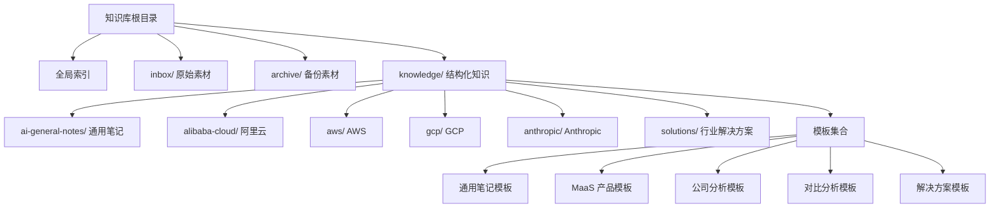
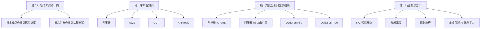
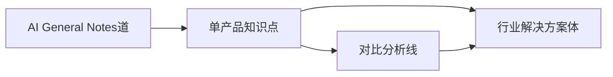

# 知识分类体系

<cite>
**本文引用的文件**
- [README.md](file://README.md)
- [index.md](file://index.md)
- [知识库通用笔记模板](file://knowledge/ai-general-notes/_template.md)
- [Agent 定义](file://knowledge/ai-general-notes/agent-def.md)
- [Harness（缰绳）](file://knowledge/ai-general-notes/harness.md)
- [Prompt Engineering](file://knowledge/ai-general-notes/prompt-engineering.md)
- [RAG](file://knowledge/ai-general-notes/rag.md)
- [微调（Fine-tuning）](file://knowledge/ai-general-notes/fine-tuning.md)
- [AI 能力边界与迭代部署](file://knowledge/ai-general-notes/ai-capability-and-deployment.md)
- [LLM 概览](file://knowledge/ai-general-notes/overview.md)
- [MaaS 产品模板](file://knowledge/_maas_template.md)
- [通用公司分析模板](file://knowledge/_general_company_intro_template.md)
- [阿里云对比分析模板](file://knowledge/alibaba-cloud/competitive-analysis/_template.md)
- [解决方案模板](file://knowledge/solutions/_template.md)
</cite>

## 目录
1. [引言](#引言)
2. [项目结构](#项目结构)
3. [核心组件](#核心组件)
4. [架构总览](#架构总览)
5. [详细组件分析](#详细组件分析)
6. [依赖分析](#依赖分析)
7. [性能考虑](#性能考虑)
8. [故障排查指南](#故障排查指南)
9. [结论](#结论)
10. [附录](#附录)

## 引言
本文件系统化阐述“AI知识库”的分类体系与架构设计，围绕“道-点-线-体”四个层级的知识组织理念，详解“AI General Notes（AI 通用笔记）”的技术概念类与概念洞察类知识的组织原则、内容构成与适用场景，并给出学习路径、选型价值与实践建议。同时总结知识分类的标准与命名规范，帮助读者根据使用需求高效选择合适类别。

## 项目结构
知识库采用“全局索引 + 分类目录 + 模板规范”的结构化组织方式：
- 全局索引：提供“道-点-线-体”四层导航与各分类入口
- 分类目录：按“AI General Notes”“厂商/平台/应用/基础设施/平台/对比分析/解决方案”等维度组织
- 模板规范：统一知识条目的结构、字段与撰写标准，确保一致性与可复用性

图表来源
- [index.md:1-69](file://index.md#L1-L69)
- [README.md:13-18](file://README.md#L13-L18)

章节来源
- [README.md:1-20](file://README.md#L1-L20)
- [index.md:1-69](file://index.md#L1-L69)

## 核心组件
- “道”层级：跨厂商、跨领域的通用知识，强调“技术概念类”和“概念洞察类”，用于关键选型维度与认知框架
- “点”层级：单产品知识，聚焦具体厂商与产品能力
- “线”层级：对比分析，强调横向对照与选型建议
- “体”层级：行业解决方案，强调端到端落地与规模化复制

章节来源
- [index.md:6-69](file://index.md#L6-L69)

## 架构总览
“道-点-线-体”四层架构以“通用概念”为根基，向下延伸到“产品细节”“横向对比”“行业落地”，形成从抽象到具体的完整知识谱系。

图表来源
- [index.md:6-69](file://index.md#L6-L69)

## 详细组件分析

### “道”层级：AI General Notes（AI 通用笔记）
“道”层级聚焦跨厂商、跨领域的通用知识，分为两类：

- 技术概念类（关键选型维度）
  - 代表性主题：Agent、Harness、Prompt Engineering、RAG、Fine-tuning
  - 组织原则：以“技术原理—关键选型维度—厂商实现对照—最佳实践—常见误区—参考资料—变更记录”为主线
  - 内容构成：第一性原理、数学/工程模型、选型对比表、可迁移应用场景、厂商能力差异分析
  - 适用场景：技术选型、架构设计、产品规划、竞品分析
  - 学习路径：先理解底层原理，再看选型维度，最后结合厂商实现与最佳实践
  - 选型价值：提供“可比较、可落地”的技术决策依据，降低技术债与重复试错成本

- 概念洞察类（关键认知框架）
  - 代表性主题：AI 能力边界与迭代部署、Personal AGI 终局
  - 组织原则：以“现象—根源—为什么重要—可迁移场景—厂商认知差异—最佳实践—常见误区”为主线
  - 内容构成：认知框架、哲学思考、可迁移场景、厂商理念差异、实践建议
  - 适用场景：产品路线图、安全策略、组织共识、高层决策
  - 学习路径：先建立认知框架，再结合厂商实践与自身业务场景迁移
  - 选型价值：统一认知、规避“技术乐观主义”陷阱、指导务实的迭代部署策略

章节来源
- [index.md:8-19](file://index.md#L8-L19)
- [知识库通用笔记模板:1-75](file://knowledge/ai-general-notes/_template.md#L1-L75)
- [Agent 定义:1-128](file://knowledge/ai-general-notes/agent-def.md#L1-L128)
- [Harness（缰绳）:1-108](file://knowledge/ai-general-notes/harness.md#L1-L108)
- [Prompt Engineering:1-193](file://knowledge/ai-general-notes/prompt-engineering.md#L1-L193)
- [RAG:1-42](file://knowledge/ai-general-notes/rag.md#L1-L42)
- [微调（Fine-tuning）:1-42](file://knowledge/ai-general-notes/fine-tuning.md#L1-L42)
- [AI 能力边界与迭代部署:1-135](file://knowledge/ai-general-notes/ai-capability-and-deployment.md#L1-L135)

#### 类别学习指南与实践建议
- 技术概念类
  - 建议顺序：原理→选型维度→厂商对照→最佳实践→误区澄清
  - 实践建议：将选型维度转化为“决策矩阵”，结合预算、性能、合规与风险进行打分
- 概念洞察类
  - 建议顺序：认知框架→厂商差异→迁移场景→实践策略→共识建设
  - 实践建议：用“终局思维”审视当前产品，避免陷入“技术炫技”而非“价值创造”

### “点”层级：单产品知识
- 组织原则：以厂商为单位，覆盖 MaaS、AI Coding、AI App、AI Platform、AI Infra 等维度
- 内容构成：产品定位、能力矩阵、适用/不适用场景、关键技术论文、厂商实现差异、变更记录
- 适用场景：产品介绍、销售支持、技术对接、竞品分析
- 选型价值：提供“可检索、可对比”的产品能力视图，支撑快速决策

章节来源
- [index.md:20-47](file://index.md#L20-L47)
- [MaaS 产品模板:1-65](file://knowledge/_maas_template.md#L1-L65)

### “线”层级：对比分析（阿里云视角）
- 组织原则：以“我方 vs 对方”的对比视角，突出差异、优势与销售建议
- 内容构成：概览对比、核心产品矩阵、生态与合规、定价策略、客户案例、SA 建议
- 适用场景：销售策略制定、客户提案、竞品应对
- 选型价值：将抽象能力转化为“可感知”的差异化优势

章节来源
- [index.md:48-54](file://index.md#L48-L54)
- [阿里云对比分析模板:1-46](file://knowledge/alibaba-cloud/competitive-analysis/_template.md#L1-L46)

### “体”层级：行业解决方案
- 组织原则：以“客群画像—核心需求—推荐架构—产品组合—标杆案例—优化建议—销售切入”为主线
- 内容构成：客群画像、需求优先级、架构设计、资源规划、竞品对比、优化建议、销售切入
- 适用场景：行业方案设计、销售 POC、客户说服
- 选型价值：提供“端到端”的可复制范式，加速规模化落地

章节来源
- [index.md:55-61](file://index.md#L55-L61)
- [解决方案模板:1-108](file://knowledge/solutions/_template.md#L1-L108)

### “道”层级知识的组织与命名规范
- 统一模板：通用笔记模板、MaaS 产品模板、公司分析模板、对比分析模板、解决方案模板
- 字段规范：标题、最后更新、领域、状态、一句话说明、核心价值、相关产品、核心原理、关键选型维度/关键认知框架、厂商实现对照、最佳实践、常见误区、参考资料、变更记录
- 命名规范：主题名称采用“领域 + 关键词”组合，便于检索与归类；状态字段统一为 Draft/Reviewed/Published

章节来源
- [知识库通用笔记模板:1-75](file://knowledge/ai-general-notes/_template.md#L1-L75)
- [MaaS 产品模板:1-65](file://knowledge/_maas_template.md#L1-L65)
- [通用公司分析模板:1-234](file://knowledge/_general_company_intro_template.md#L1-L234)
- [阿里云对比分析模板:1-46](file://knowledge/alibaba-cloud/competitive-analysis/_template.md#L1-L46)
- [解决方案模板:1-108](file://knowledge/solutions/_template.md#L1-L108)

## 依赖分析
“道-点-线-体”四层之间存在明显的依赖与映射关系：
- “道”为“点/线/体”的认知与方法论基础
- “点”为“线/体”的能力与产品基础
- “线”为“体”的选型与策略基础
- “体”为“道”的实践与验证闭环

图表来源
- [index.md:6-69](file://index.md#L6-L69)

## 性能考虑
- 知识检索效率：统一模板字段与命名规范，有助于全文检索与标签化聚合
- 决策效率：将“技术概念类”与“概念洞察类”分离，分别服务于“可比较的选型”与“可迁移的认知”，降低认知负担
- 复用效率：模板标准化与“可迁移场景”提炼，提升知识在不同业务场景的复用程度

## 故障排查指南
- 常见问题
  - 模板字段缺失：检查是否遵循“通用笔记模板”“MaaS 产品模板”等模板字段
  - 内容重复：避免“技术概念类”与“概念洞察类”混用，保持分类清晰
  - 缺乏厂商对照：技术概念类需补充“厂商实现对照”以支撑选型
  - 无“可迁移场景”：概念洞察类需提炼“可迁移场景”，提升认知价值
- 处理建议
  - 使用“变更记录”追踪修订，确保知识新鲜度
  - 对照“常见误区”板块，识别并修正认知偏差
  - 结合“最佳实践”形成可执行的行动清单

章节来源
- [知识库通用笔记模板:60-75](file://knowledge/ai-general-notes/_template.md#L60-L75)
- [Agent 定义:108-116](file://knowledge/ai-general-notes/agent-def.md#L108-L116)
- [Prompt Engineering:162-170](file://knowledge/ai-general-notes/prompt-engineering.md#L162-L170)
- [AI 能力边界与迭代部署:117-125](file://knowledge/ai-general-notes/ai-capability-and-deployment.md#L117-L125)

## 结论
“道-点-线-体”四层知识分类体系以“通用概念”为基，向下贯通“产品能力”“横向对比”“行业落地”，既满足技术选型的精确性，又提供认知框架的统一性。通过模板化与标准化，知识库实现了“可检索、可比较、可迁移、可复用”的目标，为组织在AI领域的持续进化提供稳定的知识底座。

## 附录
- 学习路径建议
  - 新手入门：先读“AI 能力边界与迭代部署”“Prompt Engineering”，建立认知框架与技术基础
  - 进阶应用：阅读“Agent”“Harness”“RAG”“Fine-tuning”，掌握关键选型维度
  - 实战落地：结合“单产品知识”“对比分析”“行业解决方案”，形成可执行方案
- 选型价值清单
  - 技术概念类：降低技术债、提升架构稳健性
  - 概念洞察类：统一组织认知、指导务实部署
  - 单产品知识：提供可检索的产品能力视图
  - 对比分析：凸显差异化优势，支撑销售策略
  - 行业解决方案：加速规模化复制，缩短交付周期