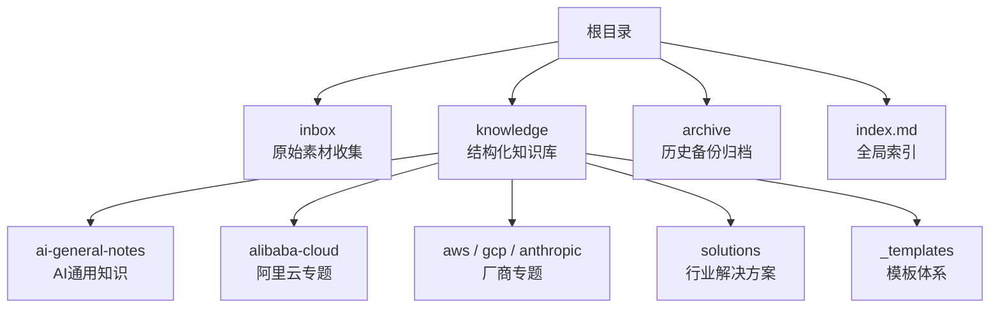
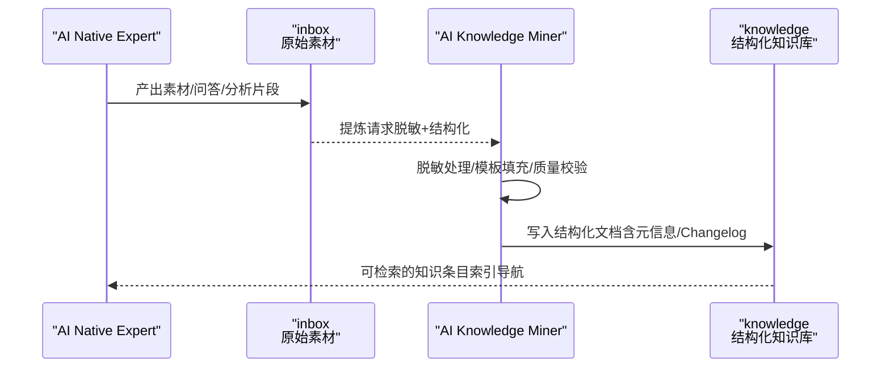
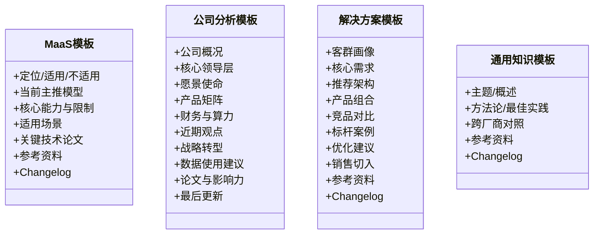
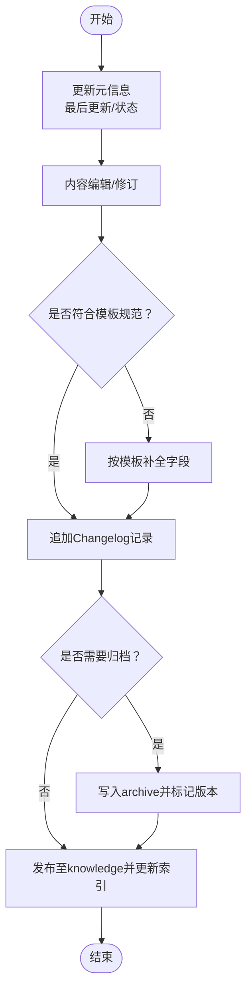
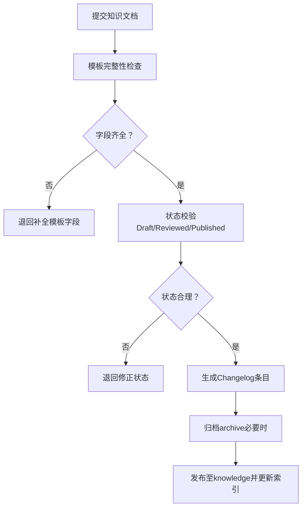
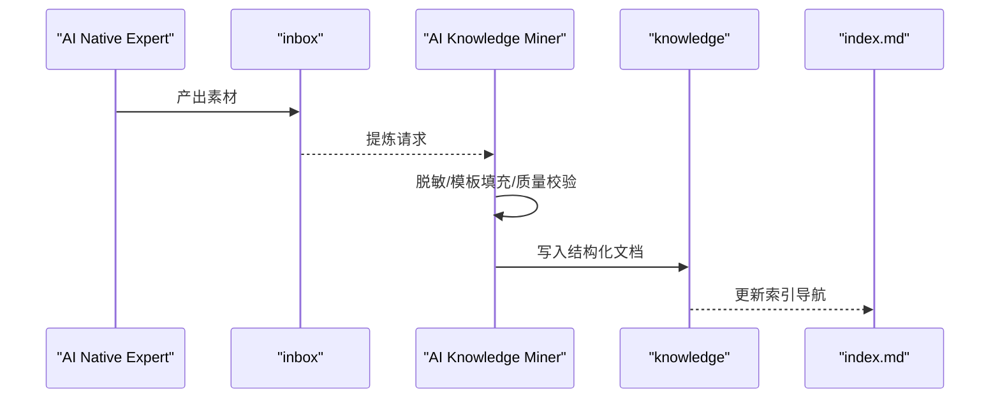
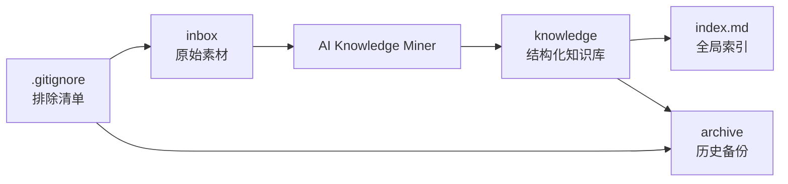

# 知识存储架构

<cite>
**本文引用的文件**
- [README.md](file://README.md)
- [index.md](file://index.md)
- [知识存储模板：_maas_template.md](file://knowledge/_maas_template.md)
- [知识存储模板：_general_company_intro_template.md](file://knowledge/_general_company_intro_template.md)
- [知识存储模板：solutions/_template.md](file://knowledge/solutions/_template.md)
- [阿里云百炼平台概览](file://knowledge/alibaba-cloud/maas/overview.md)
- [阿里云 vs AWS 竞争分析](file://knowledge/alibaba-cloud/competitive-analysis/alibaba-vs-aws/overview.md)
- [企业自建 AI 推理平台解决方案](file://knowledge/solutions/enterprise-ai-platform/overview.md)
- [.gitignore](file://.gitignore)
- [inbox/ai-knowledge-by-qoder-ai-native-agent-20260522.md](file://inbox/ai-knowledge-by-qoder-ai-native-agent-20260522.md)
- [archive/20260518.md](file://archive/20260518.md)
- [archive/20260420.md](file://archive/20260420.md)
- [archive/ai_knowledge_20260423.md](file://archive/ai_knowledge_20260423.md)
</cite>

## 目录
1. [引言](#引言)
2. [项目结构](#项目结构)
3. [核心组件](#核心组件)
4. [架构总览](#架构总览)
5. [详细组件分析](#详细组件分析)
6. [依赖分析](#依赖分析)
7. [性能考量](#性能考量)
8. [故障排查指南](#故障排查指南)
9. [结论](#结论)
10. [附录](#附录)

## 引言
本项目是一个面向AI领域的知识库工程，通过两类专用Agent实现“原始素材—结构化知识”的自动化沉淀与整理。其知识存储采用三层结构：inbox用于原始素材收集，knowledge用于结构化知识沉淀，archive用于历史备份归档。仓库同时提供标准化模板体系与版本变更记录（Changelog）机制，支撑知识的质量控制、演进追踪与可维护性。

## 项目结构
- 根目录包含三个核心知识域：
  - inbox：原始素材收集区，存放Agent产出的未脱敏、未结构化的初稿与素材片段。
  - knowledge：结构化知识库，按领域/厂商/主题分类组织，包含模板与正文。
  - archive：历史备份区，保存阶段性成果与归档文档，便于回溯与审计。
- 全局索引文件提供知识库导航与模板参考，帮助使用者快速定位所需内容。

图表来源
- [README.md:13-17](file://README.md#L13-L17)
- [index.md:1-69](file://index.md#L1-L69)

章节来源
- [README.md:1-20](file://README.md#L1-L20)
- [index.md:1-69](file://index.md#L1-L69)

## 核心组件
- 原始素材收集（inbox）
  - 由AI Native Expert产出，包含初稿、素材片段、问答记录等，未进行脱敏与结构化处理。
  - 通过.gitignore排除敏感/临时文件，避免污染版本库。
- 结构化知识存储（knowledge）
  - 按领域/厂商/主题分层组织，提供标准化模板，确保知识表达一致性与可复用性。
  - 每篇知识文档包含“最后更新”“状态”“Changelog”等元信息，便于追踪与审计。
- 历史备份管理（archive）
  - 保存阶段性成果与归档文档，支持版本回溯与合规审计。
- 全局索引（index.md）
  - 提供知识库导航、模板参考与更新时间，帮助使用者快速定位与复用知识。

章节来源
- [README.md:7-17](file://README.md#L7-L17)
- [.gitignore:23-25](file://.gitignore#L23-L25)
- [index.md:1-69](file://index.md#L1-L69)

## 架构总览
知识存储的自动化流水线由两类Agent驱动：
- ai-knowledge-miner：负责将inbox中的原始素材提炼为脱敏、结构化的知识文档，写入knowledge对应目录。
- ai-native-expert：聚焦MaaS与AI Coding领域，产出高质量素材并沉淀至inbox，形成“输入—提炼—沉淀”的闭环。

图表来源
- [README.md:7-11](file://README.md#L7-L11)
- [README.md:15-17](file://README.md#L15-L17)

章节来源
- [README.md:7-17](file://README.md#L7-L17)

## 详细组件分析

### 组件A：标准化模板体系
- MaaS产品模板：统一MaaS产品的定位、能力、限制、适用场景与变更记录格式，确保同类知识的一致性与可比性。
- 公司分析模板：提供公司概况、领导层、愿景使命、产品矩阵、财务与算力规划、论文影响力等结构化字段，便于跨厂商横向比较。
- 解决方案模板：定义客群画像、核心需求、推荐架构、产品组合、竞品对比、标杆案例、优化建议与销售切入要点，支撑端到端方案设计。
- 通用知识模板：覆盖AI通用概念、方法论与最佳实践，便于沉淀跨厂商的共性认知。

图表来源
- [知识存储模板：_maas_template.md:1-65](file://knowledge/_maas_template.md#L1-L65)
- [知识存储模板：_general_company_intro_template.md:1-234](file://knowledge/_general_company_intro_template.md#L1-L234)
- [知识存储模板：solutions/_template.md:1-108](file://knowledge/solutions/_template.md#L1-L108)

章节来源
- [知识存储模板：_maas_template.md:1-65](file://knowledge/_maas_template.md#L1-L65)
- [知识存储模板：_general_company_intro_template.md:1-234](file://knowledge/_general_company_intro_template.md#L1-L234)
- [知识存储模板：solutions/_template.md:1-108](file://knowledge/solutions/_template.md#L1-L108)

### 组件B：知识演进追踪与版本管理
- 文档元信息：每篇知识文档包含“最后更新”“状态（Draft/Reviewed/Published）”等元信息，便于识别新鲜度与成熟度。
- 变更记录（Changelog）：统一采用表格形式记录每次变更日期与内容，支持快速回溯与审计。
- 归档策略：archive目录用于保存阶段性成果与历史版本，结合.gitignore排除临时/敏感文件，降低版本库膨胀风险。

图表来源
- [阿里云百炼平台概览:1-9](file://knowledge/alibaba-cloud/maas/overview.md#L1-L9)
- [阿里云 vs AWS 竞争分析:1-46](file://knowledge/alibaba-cloud/competitive-analysis/alibaba-vs-aws/overview.md#L1-L46)
- [企业自建 AI 推理平台解决方案:1-273](file://knowledge/solutions/enterprise-ai-platform/overview.md#L1-L273)
- [.gitignore:23-25](file://.gitignore#L23-L25)

章节来源
- [阿里云百炼平台概览:1-9](file://knowledge/alibaba-cloud/maas/overview.md#L1-L9)
- [阿里云 vs AWS 竞争分析:1-46](file://knowledge/alibaba-cloud/competitive-analysis/alibaba-vs-aws/overview.md#L1-L46)
- [企业自建 AI 推理平台解决方案:1-273](file://knowledge/solutions/enterprise-ai-platform/overview.md#L1-L273)
- [.gitignore:23-25](file://.gitignore#L23-L25)

### 组件C：质量控制机制
- 模板约束：通过标准化模板强制字段与结构，减少遗漏与表述偏差。
- 状态流转：Draft/Reviewed/Published三级状态控制发布节奏与质量门槛。
- 元信息校验：要求“最后更新”“状态”“Changelog”等字段齐全，便于持续维护与审计。
- 归档与清理：利用.gitignore排除临时/敏感文件，archive用于长期保留，降低维护成本。

图表来源
- [知识存储模板：_maas_template.md:61-65](file://knowledge/_maas_template.md#L61-L65)
- [知识存储模板：solutions/_template.md:103-108](file://knowledge/solutions/_template.md#L103-L108)
- [.gitignore:23-25](file://.gitignore#L23-L25)

章节来源
- [知识存储模板：_maas_template.md:61-65](file://knowledge/_maas_template.md#L61-L65)
- [知识存储模板：solutions/_template.md:103-108](file://knowledge/solutions/_template.md#L103-L108)
- [.gitignore:23-25](file://.gitignore#L23-L25)

### 组件D：安全与访问控制
- 敏感文件排除：.gitignore明确排除inbox与archive下的Markdown文件，避免将原始素材与历史备份纳入版本控制，降低泄露风险。
- 临时文件清理：IDE缓存、Python缓存、Node模块等临时文件被忽略，减少无关内容进入仓库。
- 归档策略：archive用于历史备份，配合Changelog与状态字段，便于合规审计与责任追溯。

章节来源
- [.gitignore:23-25](file://.gitignore#L23-L25)

### 组件E：Agent驱动的知识沉淀流程
- AI Native Expert产出原始素材至inbox；
- AI Knowledge Miner从inbox提取素材，按模板脱敏与结构化，写入knowledge；
- 索引文件index.md汇总导航与模板参考，提升检索效率。

图表来源
- [README.md:7-11](file://README.md#L7-L11)
- [README.md:15-17](file://README.md#L15-L17)
- [index.md:1-69](file://index.md#L1-L69)

章节来源
- [README.md:7-17](file://README.md#L7-L17)
- [index.md:1-69](file://index.md#L1-L69)

## 依赖分析
- 组件耦合关系
  - inbox与knowledge之间通过AI Knowledge Miner进行解耦，前者只负责“输入”，后者只负责“输出”，中间流程可独立演进。
  - knowledge与archive之间为单向依赖，archive用于长期保留与审计，不影响日常检索与发布。
  - index.md对knowledge形成“导航依赖”，但不参与内容生成，保持弱耦合。
- 外部依赖与集成点
  - .gitignore定义了版本库的“排除清单”，间接影响知识沉淀的合规性与安全性。
  - 各模板文件构成知识表达的契约，是知识质量与一致性的重要保障。

图表来源
- [README.md:7-17](file://README.md#L7-L17)
- [index.md:1-69](file://index.md#L1-L69)
- [.gitignore:23-25](file://.gitignore#L23-L25)

章节来源
- [README.md:7-17](file://README.md#L7-L17)
- [index.md:1-69](file://index.md#L1-L69)
- [.gitignore:23-25](file://.gitignore#L23-L25)

## 性能考量
- 知识检索效率
  - 通过index.md集中导航与模板化字段，减少检索歧义，提升定位速度。
- 维护成本控制
  - 使用模板与状态字段降低编辑成本，Changelog与archive便于快速回溯，减少重复劳动。
- 版本库体积管理
  - .gitignore排除临时与敏感文件，archive用于历史归档，避免版本库膨胀。

## 故障排查指南
- 常见问题
  - 模板字段缺失：检查模板文件，补齐必填字段后再提交。
  - 状态不一致：确保“状态”字段与文档成熟度匹配（Draft/Reviewed/Published）。
  - Changelog缺失：每次变更必须新增一条记录，便于审计与回溯。
  - 敏感文件误提交：确认.gitignore规则，避免将inbox与archive下的Markdown纳入版本库。
- 排查步骤
  - 定位问题文档（查看“最后更新”与“状态”）；
  - 核对模板字段与结构；
  - 查看最近一次Changelog条目；
  - 检查.gitignore是否正确排除相关路径；
  - 必要时将文档归档至archive并创建新版本。

章节来源
- [阿里云百炼平台概览:1-9](file://knowledge/alibaba-cloud/maas/overview.md#L1-L9)
- [阿里云 vs AWS 竞争分析:1-46](file://knowledge/alibaba-cloud/competitive-analysis/alibaba-vs-aws/overview.md#L1-L46)
- [企业自建 AI 推理平台解决方案:1-273](file://knowledge/solutions/enterprise-ai-platform/overview.md#L1-L273)
- [.gitignore:23-25](file://.gitignore#L23-L25)

## 结论
该知识存储架构通过inbox—knowledge—archive的分层设计与标准化模板体系，实现了从“原始素材”到“结构化知识”的高效转化；借助状态字段与Changelog机制，保障了知识的可追踪性与可审计性；通过.gitignore与archive策略，兼顾了安全性与可维护性。整体架构清晰、流程可复用、质量可保障，适用于企业级知识管理与跨团队协作。

## 附录
- 最佳实践
  - 严格遵循模板字段，确保知识表达一致性；
  - 每次修改都追加Changelog条目，标注变更内容与责任人；
  - 使用状态字段控制发布节奏，避免过早发布不成熟内容；
  - 定期归档历史版本，保留审计线索。
- 维护指南
  - 定期回顾index.md，补充缺失导航与模板参考；
  - 持续优化模板字段，提升知识复用效率；
  - 通过archive沉淀关键里程碑版本，形成知识演进档案。