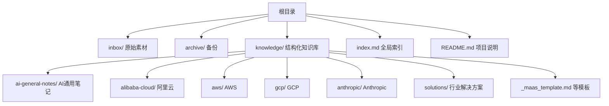
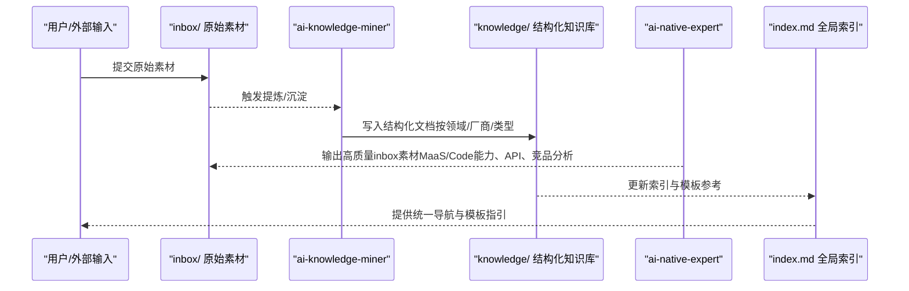
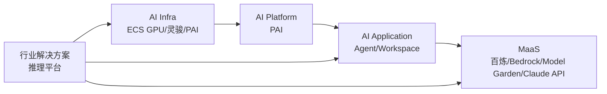

# 知识库组织结构

<cite>
**本文引用的文件**
- [README.md](file://README.md)
- [index.md](file://index.md)
- [_general_company_intro_template.md](file://knowledge/_general_company_intro_template.md)
- [_maas_template.md](file://knowledge/_maas_template.md)
- [alibaba-cloud/competitive-analysis/_template.md](file://knowledge/alibaba-cloud/competitive-analysis/_template.md)
- [ai-general-notes/overview.md](file://knowledge/ai-general-notes/overview.md)
- [alibaba-cloud/maas/overview.md](file://knowledge/alibaba-cloud/maas/overview.md)
- [aws/maas/overview.md](file://knowledge/aws/maas/overview.md)
- [gcp/maas/overview.md](file://knowledge/gcp/maas/overview.md)
- [anthropic/maas/claude-api.md](file://knowledge/anthropic/maas/claude-api.md)
- [alibaba-cloud/ai-application/claw-family.md](file://knowledge/alibaba-cloud/ai-application/claw-family.md)
- [alibaba-cloud/ai-coding/qoder.md](file://knowledge/alibaba-cloud/ai-coding/qoder.md)
- [alibaba-cloud/ai-infra/gpu-product-line.md](file://knowledge/alibaba-cloud/ai-infra/gpu-product-line.md)
- [alibaba-cloud/ai-platform/pai.md](file://knowledge/alibaba-cloud/ai-platform/pai.md)
- [solutions/enterprise-ai-platform/overview.md](file://knowledge/solutions/enterprise-ai-platform/overview.md)
</cite>

## 目录
1. [引言](#引言)
2. [项目结构](#项目结构)
3. [核心组件](#核心组件)
4. [架构总览](#架构总览)
5. [详细组件分析](#详细组件分析)
6. [依赖分析](#依赖分析)
7. [性能考虑](#性能考虑)
8. [故障排查指南](#故障排查指南)
9. [结论](#结论)
10. [附录](#附录)

## 引言
本知识库面向AI领域的知识沉淀与共享，围绕“道—点—线—体”四个维度组织内容：道（跨厂商AI领域知识）、点（单产品知识）、线（对比分析）、体（行业解决方案）。仓库通过两个专用Agent实现“从原始素材到结构化知识”的自动化流转：ai-knowledge-miner负责提炼inbox中的素材，生成脱敏且结构化的知识文档；ai-native-expert聚焦MaaS与AI Coding，输出高质量的inbox素材。全局索引文件提供统一导航与模板参考，确保知识的可发现性与一致性。

## 项目结构
仓库采用“按领域+厂商+产品类型”的层级化目录组织，辅以全局索引与模板体系，形成“知识沉淀—结构化—导航—复用”的闭环。

图表来源
- [README.md:13-18](file://README.md#L13-L18)
- [index.md:1-69](file://index.md#L1-L69)

章节来源
- [README.md:1-20](file://README.md#L1-L20)
- [index.md:1-69](file://index.md#L1-L69)

## 核心组件
- 知识分类体系
  - 道：AI General Notes，覆盖Agent、Harness、Prompt Engineering、RAG、Fine-tuning等跨厂商通用主题，支撑关键选型维度与认知框架。
  - 点：单厂商的MaaS、AI Coding、AI Application、AI Platform、AI Infra与Maas专题，形成“产品全景+能力边界+适用场景”的知识单元。
  - 线：对比分析（如阿里云 vs AWS、Qoder vs Kiro等），提供维度化对比与销售策略建议。
  - 体：行业解决方案（如商业地产、企业自建AI推理平台），强调规模化复制与落地实践。
- 模板与质量控制
  - 通用模板：公司分析模板、MaaS模板、对比分析模板、解决方案模板等，统一结构、字段与更新规范。
  - 质量控制：通过“摘要块”“状态标记”“变更日志”“参考资料”等机制，确保知识可追溯、可复核、可演进。
- 导航与索引
  - 全局索引提供跨域导航、模板参考与更新时间戳，便于快速定位与审阅。

章节来源
- [index.md:6-69](file://index.md#L6-L69)
- [_maas_template.md:1-65](file://knowledge/_maas_template.md#L1-L65)
- [_general_company_intro_template.md:1-234](file://knowledge/_general_company_intro_template.md#L1-L234)
- [alibaba-cloud/competitive-analysis/_template.md:1-46](file://knowledge/alibaba-cloud/competitive-analysis/_template.md#L1-L46)

## 架构总览
知识从“原始素材”到“结构化知识”的流转路径如下：

图表来源
- [README.md:7-11](file://README.md#L7-L11)
- [index.md:1-69](file://index.md#L1-L69)

## 详细组件分析

### AI General Notes（道）
- 设计理念
  - 以“关键选型维度”和“认知框架”两类主题组织，既支撑技术决策，也沉淀方法论。
  - 通过“概览+原理+选型+厂商对照+最佳实践+误区+资料+变更日志”结构，形成闭环知识。
- 组织原则
  - 跨厂商横向对比，避免重复建设；每个主题独立成篇，便于检索与复用。
- 示例与路径
  - [AI通用概览:1-42](file://knowledge/ai-general-notes/overview.md#L1-L42)

章节来源
- [ai-general-notes/overview.md:1-42](file://knowledge/ai-general-notes/overview.md#L1-L42)

### AI Applications（点：应用）
- 设计理念
  - 以“产品矩阵+关系解析+能力对比+适用场景+常见误解”为主线，帮助用户快速理解产品定位与取舍。
- 组织原则
  - 按厂商分目录，应用类文档强调“可直接落地”的能力说明与搭配建议。
- 示例与路径
  - [阿里云“龙虾家族”全景:1-137](file://knowledge/alibaba-cloud/ai-application/claw-family.md#L1-L137)

章节来源
- [alibaba-cloud/ai-application/claw-family.md:1-137](file://knowledge/alibaba-cloud/ai-application/claw-family.md#L1-L137)

### AI Coding（点：编程）
- 设计理念
  - 以“定位+能力边界+适用场景”为核心，结合厂商生态与工具链，给出可操作的实践建议。
- 组织原则
  - 与应用类文档并列，形成“应用+编程”的双轮驱动。
- 示例与路径
  - [阿里云Qoder:1-9](file://knowledge/alibaba-cloud/ai-coding/qoder.md#L1-L9)

章节来源
- [alibaba-cloud/ai-coding/qoder.md:1-9](file://knowledge/alibaba-cloud/ai-coding/qoder.md#L1-L9)

### AI Platform（点：平台）
- 设计理念
  - 以“平台定位+能力边界+与基础设施协同”为纲，强调平台在全链路中的作用。
- 组织原则
  - 与Infra并列，体现“平台层”与“算力层”的分工与协同。
- 示例与路径
  - [阿里云PAI:1-9](file://knowledge/alibaba-cloud/ai-platform/pai.md#L1-L9)

章节来源
- [alibaba-cloud/ai-platform/pai.md:1-9](file://knowledge/alibaba-cloud/ai-platform/pai.md#L1-L9)

### AI Infrastructure（点：基础设施）
- 设计理念
  - 以“产品形态+网络能力+管理粒度+适用边界+竞品对照”为骨架，解决“如何选型、何时组合”的工程问题。
- 组织原则
  - 强调IaaS（ECS GPU/灵骏）与PaaS（PAI）的分层关系与互补性。
- 示例与路径
  - [阿里云GPU产品线选型:1-114](file://knowledge/alibaba-cloud/ai-infra/gpu-product-line.md#L1-L114)

章节来源
- [alibaba-cloud/ai-infra/gpu-product-line.md:1-114](file://knowledge/alibaba-cloud/ai-infra/gpu-product-line.md#L1-L114)

### Maas（点：模型即服务）
- 设计理念
  - 以“定位+主推模型+能力与限制+适用场景+论文与资料+变更日志”为模板，统一MaaS知识表达。
- 组织原则
  - 按厂商分目录，突出“主推模型”“上下文/尺寸/场景”等关键字段，便于横向对比。
- 示例与路径
  - [阿里百炼概览:1-9](file://knowledge/alibaba-cloud/maas/overview.md#L1-L9)
  - [AWS Bedrock概览:1-9](file://knowledge/aws/maas/overview.md#L1-L9)
  - [GCP Model Garden概览:1-9](file://knowledge/gcp/maas/overview.md#L1-L9)
  - [Anthropic Claude API:1-9](file://knowledge/anthropic/maas/claude-api.md#L1-L9)

章节来源
- [alibaba-cloud/maas/overview.md:1-9](file://knowledge/alibaba-cloud/maas/overview.md#L1-L9)
- [aws/maas/overview.md:1-9](file://knowledge/aws/maas/overview.md#L1-L9)
- [gcp/maas/overview.md:1-9](file://knowledge/gcp/maas/overview.md#L1-L9)
- [anthropic/maas/claude-api.md:1-9](file://knowledge/anthropic/maas/claude-api.md#L1-L9)

### 竞争分析（线）
- 设计理念
  - 以“核心差异+产品矩阵+生态与合规+定价+客户案例+销售建议”为结构，支撑销售与策略制定。
- 组织原则
  - 模板化字段统一，摘要块快速抓取关键结论，便于高层决策与跨部门对齐。
- 示例与路径
  - [阿里云 vs AWS 竞争分析模板:1-46](file://knowledge/alibaba-cloud/competitive-analysis/_template.md#L1-L46)

章节来源
- [alibaba-cloud/competitive-analysis/_template.md:1-46](file://knowledge/alibaba-cloud/competitive-analysis/_template.md#L1-L46)

### 行业解决方案（体）
- 设计理念
  - 以“客群画像+核心需求+架构方案+产品组合+竞品对比+标杆案例+优化建议+销售策略”为主线，强调“可复制、可落地”的规模化路径。
- 组织原则
  - 以“企业自建AI推理平台”为代表，突出“网关+裸金属+K8s+可观测+合规”的工程闭环。
- 示例与路径
  - [企业自建AI推理平台解决方案:1-273](file://knowledge/solutions/enterprise-ai-platform/overview.md#L1-L273)

章节来源
- [solutions/enterprise-ai-platform/overview.md:1-273](file://knowledge/solutions/enterprise-ai-platform/overview.md#L1-L273)

## 依赖分析
- 组件耦合与协同
  - “基础设施（AI Infra）+平台（AI Platform）+应用（AI Application）+MaaS”构成完整的AI能力闭环，其中GPU产品线选型与PAI、灵骏的关系体现了IaaS与PaaS的协同。
  - 解决方案文档常与具体厂商的产品（如百炼API、灵骏裸金属、Higress网关）形成强绑定，便于落地复用。
- 外部依赖与集成点
  - 竞品分析与行业案例依赖公开资料与厂商文档，模板中的“参考资料”字段用于溯源与交叉验证。
- 潜在循环依赖
  - 通过“全局索引”与“模板参考”弱化文档间的直接循环引用，避免知识回路断裂。

图表来源
- [alibaba-cloud/ai-infra/gpu-product-line.md:81-93](file://knowledge/alibaba-cloud/ai-infra/gpu-product-line.md#L81-L93)
- [alibaba-cloud/ai-platform/pai.md:1-9](file://knowledge/alibaba-cloud/ai-platform/pai.md#L1-L9)
- [alibaba-cloud/ai-application/claw-family.md:16-35](file://knowledge/alibaba-cloud/ai-application/claw-family.md#L16-L35)
- [solutions/enterprise-ai-platform/overview.md:46-127](file://knowledge/solutions/enterprise-ai-platform/overview.md#L46-L127)

## 性能考虑
- 知识检索效率
  - 使用全局索引与模板参考，减少跨域查找成本；建议在文档标题与摘要中明确关键词，提升搜索命中率。
- 文档维护成本
  - 模板化结构与“变更日志”降低维护成本；建议定期对齐模板字段，避免信息碎片化。
- 工程落地效率
  - 行业解决方案强调“统一网关+混合推理+可观测+合规”，可作为工程团队的“最小可行知识包”。

## 故障排查指南
- 常见问题
  - 文档缺失：检查全局索引是否收录，确认对应厂商/类型目录是否存在。
  - 信息过期：查看“最后更新”与“变更日志”，必要时补充参考资料与交叉验证。
  - 结构不一致：对照模板字段（摘要块、状态、资料、变更日志）进行统一。
- 建议流程
  - 发现问题→定位模板→核对字段→更新索引→同步变更日志→复核发布。

章节来源
- [index.md:62-69](file://index.md#L62-L69)
- [_maas_template.md:62-65](file://knowledge/_maas_template.md#L62-L65)

## 结论
该知识库以“道—点—线—体”为骨架，结合模板化与全局索引，实现了跨厂商、跨领域的知识有序沉淀与高效复用。通过Agent驱动的知识流转与持续演进机制，既能支撑日常决策与销售策略，也能指导工程化落地与规模化复制。

## 附录
- 模板参考
  - [AI通用笔记模板:1-42](file://knowledge/ai-general-notes/overview.md#L1-L42)
  - [MaaS产品模板:1-65](file://knowledge/_maas_template.md#L1-L65)
  - [对比分析模板:1-46](file://knowledge/alibaba-cloud/competitive-analysis/_template.md#L1-L46)
  - [公司分析模板:1-234](file://knowledge/_general_company_intro_template.md#L1-L234)
- 全局索引
  - [知识库全局索引:1-69](file://index.md#L1-L69)